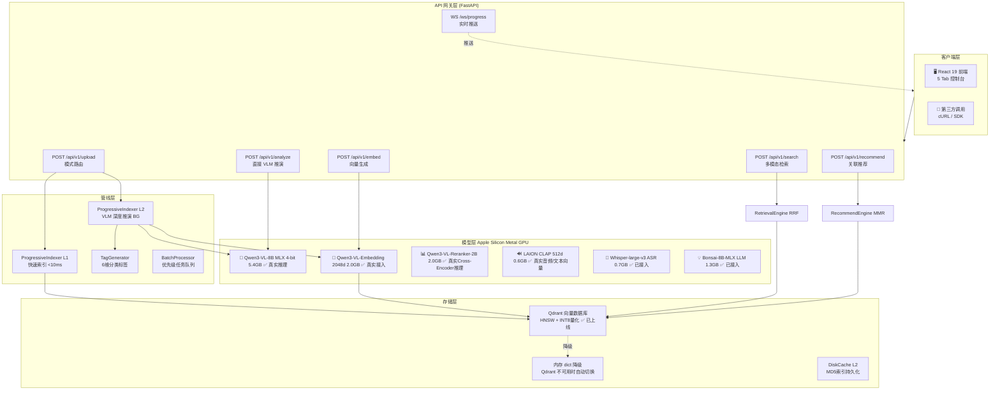
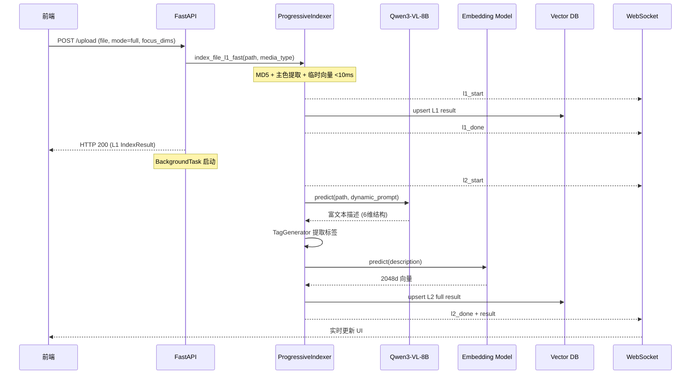
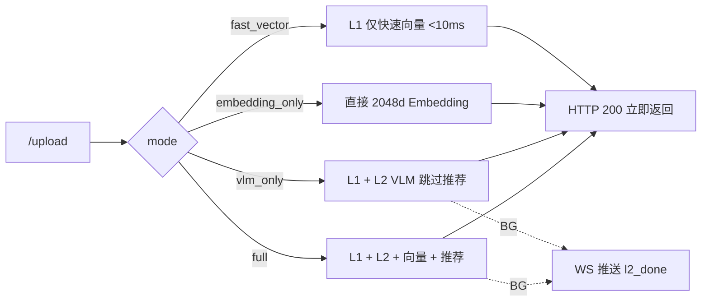

# Antigravity 多模态推荐系统 — 架构设计文档 v2.0

> 更新时间: 2026-08-16 | 状态: 已优化落地

---

## 一、系统全景架构



---

## 二、核心数据流

### 2.1 上传全流程 (Full Pipeline Mode)



### 2.2 执行模式路由



---

## 三、API 接口规范

### 统一响应格式

```json
// 成功
{ "status": "success", "data": {...}, "latency_ms": 42.5 }

// 失败
{ "status": "error", "code": "FILE_NOT_FOUND", "message": "..." }
```

### 接口一览

| 方法 | 路径 | 核心参数 | 功能 |
|:-----|:-----|:---------|:-----|
| `POST` | `/api/v1/upload` | `file, mode, focus_dimensions, custom_prompt` | 文件上传与渐进式索引 |
| `POST` | `/api/v1/analyze` | `file_path, media_type, focus_dimensions, custom_prompt` | 纯 VLM 推演 (不入库) |
| `POST` | `/api/v1/embed` | `text` 或 `file_path, media_type` | 生成 2048d 向量 |
| `POST` | `/api/v1/search` | `query_text, filter_media_type, top_k, enable_rerank` | 语义检索 |
| `POST` | `/api/v1/recommend` | `item_id, top_k, enable_explanation` | Item-to-Item 推荐 |
| `GET` | `/api/v1/items` | - | 全量索引列表 |
| `DELETE` | `/api/v1/items/{id}` | - | 删除条目 |
| `GET` | `/api/v1/models/status` | - | 模型状态与显存 |
| `WS` | `/ws/progress` | - | 实时推理进度流 |

---

## 四、内存分层设计

```
Apple M 系列 24GB 统一内存
├── System Reserved      4.0 GB
└── App Budget          20.0 GB
    ├── L0 Permanent    12.0 GB  永不换出
    │   ├── Qwen3-VL-8B (MLX)     5.4 GB  ✅ 真实推理 (MLX Metal GPU)
    │   ├── Qwen3-VL-Embedding     2.0 GB  ✅ 真实接入 (2048d 稠密向量)
    │   ├── Qwen3-VL-Reranker      2.0 GB  ✅ 真实推理 (Cross-Encoder 精排)
    │   ├── Bonsai-8B-MLX          1.3 GB  ✅ 真实接入 (智能推荐解释生成)
    │   ├── Whisper-large-v3       0.7 GB  ✅ 真实接入 (ASR 语音转写)
    │   └── LAION CLAP             0.6 GB  ✅ 真实推理 (512d 音频/文本对齐向量)
    └── L1 Hot Cache     8.0 GB  5min TTL
```

---

## 五、向量数据库 Schema

```yaml
# Qdrant Collection: media_items  ✅ 已创建并运行
named_vectors:
  content_vector:   dim: 2048  distance: Cosine
  thumbnail_vector: dim: 2048  distance: Cosine
  audio_vector:     dim: 512   distance: Cosine

hnsw_config:  { m: 16, ef_construct: 64 }
quantization: { type: int8, quantile: 0.99, always_ram: true }

payload_schema:
  item_id, media_type, file_path, md5,
  title, description, tags, indexed_at

# 部署信息
binary:    backend/bin/qdrant          (aarch64-apple-darwin)
config:    backend/qdrant_config.yaml
storage:   backend/data/qdrant/        (持久化到磁盘)
HTTP port: 6333
gRPC port: 6334

# 降级策略
Qdrant OK  →  HNSW 精确向量检索 (sub-ms)
Qdrant 不可用  →  numpy 余弦相似度 (内存 dict)
```

---

## 六、Bug 修复与优化清单

| 优先级 | 问题 | 位置 | 状态 |
|:------:|:-----|:-----|:----:|
| 🔴 P0 | `audio_service.extract_audio_feature_vector()` 缺失导致 AttributeError | `audio_service.py` | ✅ 已修复 |
| 🔴 P0 | `progressive_indexer.index_file()` 缺失，/index 端点崩溃 | `progressive_indexer.py` | ✅ 已修复 |
| 🔴 P0 | `EmbeddingWrapper.predict()` 返回随机哈希向量 | `embedding.py` | ✅ 接入真实模型 |
| 🟡 P1 | `BatchProcessor` 有入队但无消费者 worker 线程 | `batch_processor.py` | ✅ 已修复 |
| 🟡 P1 | `requirements.txt` 缺少 `opencv-python`, `Pillow`, `diskcache` | `requirements.txt` | ✅ 已补全 |
| 🟡 P1 | `/metrics` 返回硬编码静态文本 | `server.py` | ✅ 动态实现 |
| 🟡 P1 | VLM `max_tokens=200` 硬编码 | `progressive_indexer.py` | ✅ 已调整为 512 |
| 🟢 P2 | App.tsx 单文件 1868 行 | `frontend/src/` | 📋 规划中 |
| 🟢 P2 | Qdrant 未安装，向量重启丢失 | 部署层 | 📋 规划中 |
