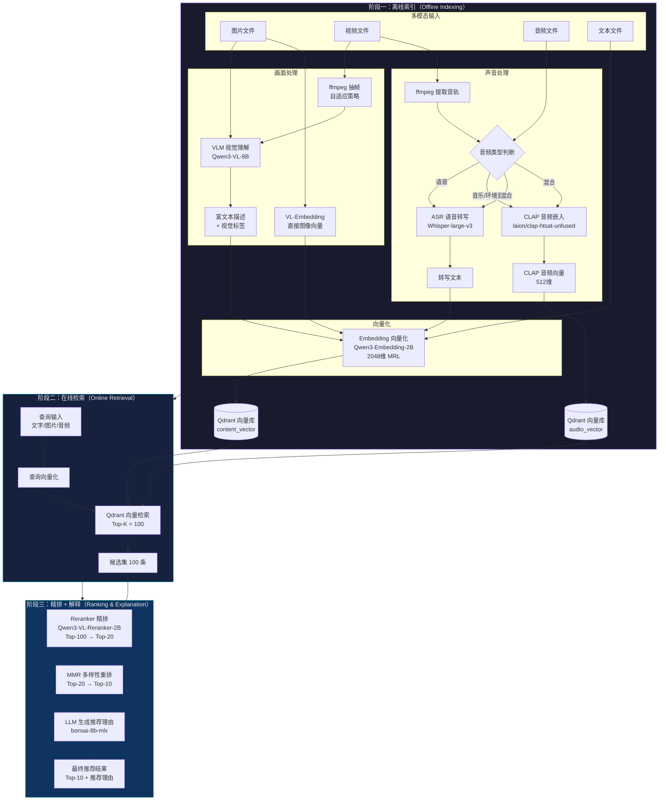
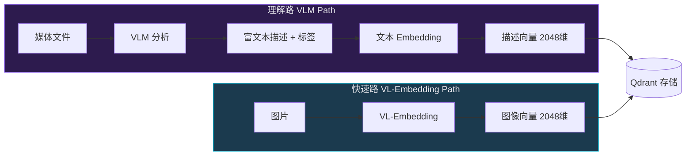
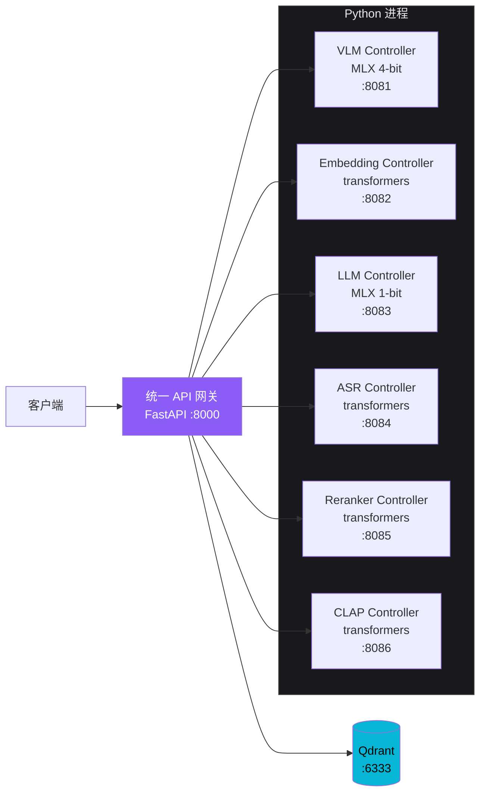
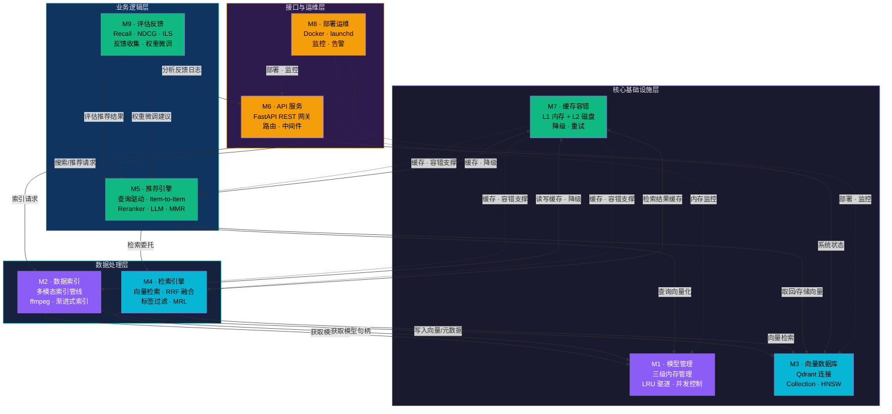
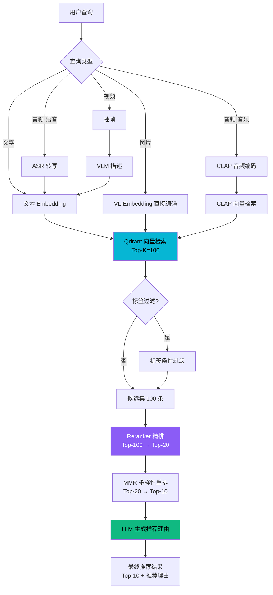

[← 返回目录](00-目录索引.md)

# 01 — 系统架构总览

> **多模态向量推荐系统** · Apple M5 (24GB) · MLX 4-bit 量化 · Qdrant 向量数据库
>
> 版本：2026-08-14 · 文档定位：系统级架构设计总览，涵盖定位、硬件、三阶段架构、模块依赖、数据流与推荐模式

---

## 目录

1. [系统定位与目标](#1-系统定位与目标)
2. [硬件与运行环境](#2-硬件与运行环境)
3. [系统架构图](#3-系统架构图)
4. [模块依赖关系](#4-模块依赖关系)
5. [数据流总览](#5-数据流总览)
6. [两种推荐模式对比](#6-两种推荐模式对比)
7. [技术栈总结](#7-技术栈总结)

---

## 1. 系统定位与目标

### 1.1 系统是什么

本系统是一个 **全本地运行的多模态向量推荐系统**，在单台 Apple M5 MacBook Pro（24GB 统一内存）上构建，支持对 **文字、图片、音频、视频** 四种模态的内容进行自动理解、标签生成、向量化索引和相似推荐。

系统的核心理念是 **"Retrieval-then-Rank"（先检索后精排）**，通过三阶段架构实现从原始媒体文件到高质量推荐结果的完整闭环。所有 AI 模型推理、向量存储和检索均在本地完成，数据隐私 100% 保障，无需依赖任何云服务。

### 1.2 解决什么问题

| 痛点 | 本系统方案 |
|------|-----------|
| 多模态内容难以统一检索 | 四种模态统一向量化到同一向量空间，跨模态检索 |
| 传统标签推荐理解深度不足 | VLM 生成富文本描述 + 多级标签体系，语义级理解 |
| 云端方案数据隐私无保障 | 全本地运行，数据不出设备 |
| 单机内存不足以跑多模型 | 三级内存管理（L0/L1/L2），24GB 精细分配 7 个模型 |
| 推荐结果缺乏可解释性 | LLM 生成自然语言推荐理由，每条结果附带解释 |
| Item-to-Item 推荐重复计算 | 向量不离开服务端，复用已存储向量，零重复计算 |

### 1.3 核心能力

- **四模态统一索引**：文字直接嵌入；图片经 VLM 理解 + VL-Embedding 双路编码；视频经抽帧/提音轨双轨道分析；音频经 ASR 转写或 CLAP 直接嵌入
- **双路向量化设计**：VLM 理解路（深度语义）+ VL-Embedding 快速路（直接向量），兼顾精度和速度
- **三阶段推荐架构**：离线索引 → 在线检索 Top-K=100 → Reranker 精排 Top-20 → LLM 重排 + 推荐理由 Top-10
- **两种推荐模式**：查询驱动搜索（实时向量化）+ 内容驱动推荐（Item-to-Item，向量复用，零重复计算）
- **三级内存管理**：L0 常驻（7.4GB）+ L1 热缓存（4.6GB, TTL 5 分钟）+ L2 冷加载（2.4GB, 用完即卸），内存限制 20GB
- **渐进式索引**：L1 快速（元数据, <100ms）→ L2 标准（VLM + Embedding, 2-15s）→ L3 深度（ASR + CLAP, 10-60s），入库即可搜索
- **多级缓存架构**：L1 内存缓存（LRU, 查询向量/检索结果）+ L2 磁盘缓存（diskcache, VLM 描述/ASR 转写/CLAP 向量/抽帧结果，基于 MD5 永久有效）
- **模态降级容错**：部分模型失败时自动降级（如 VLM 挂了跳过画面仅索引声音），保证基本可用
- **MMR 多样性控制**：Maximal Marginal Relevance 算法去重和多样化，避免连续推荐高度相似内容

---

## 2. 硬件与运行环境

### 2.1 硬件规格

| 项目 | 规格 | 说明 |
|------|------|------|
| 芯片 | Apple M5 | Apple Silicon，统一内存架构 |
| 物理内存 | 24 GB | CPU/GPU 统一寻址，无需数据拷贝 |
| 可用内存 | ~20 GB | 预留 4 GB 给 macOS 系统 |
| GPU 后端 | Metal Performance Shaders (MPS) | mlx-vlm / transformers 自动使用 |
| 存储 | NVMe SSD | 模型文件 + 磁盘缓存 + Qdrant 数据 |

### 2.2 推理框架

| 框架 | 用途 | 说明 |
|------|------|------|
| **mlx-vlm** | VLM 视觉理解 | Apple MLX 生态，M 芯片优化，4-bit 量化，原生支持 Metal GPU |
| **transformers** | Embedding / ASR / CLAP / Reranker / TTS | Hugging Face 生态，MPS 后端，广泛模型兼容性 |
| **mlx-lm** | LLM 推理 | bonsai-8b-mlx 1-bit 量化，极低内存占用 |

> **关键决策**：LM Studio 同时只能加载 1 个模型且没有 Embeddings API 端点，因此所有模型通过 Python + MLX/transformers 直接加载，绕过 LM Studio。VLM 已验证可用 MLX 4-bit 运行。

### 2.3 向量数据库

| 项目 | 规格 |
|------|------|
| 选型 | **Qdrant**（Rust 实现） |
| 部署模式 | 单机 Docker 部署 |
| 检索延时 | **4.55 ms** |
| 吞吐量 | **2000+ QPS** |
| 端口 | HTTP 6333 / gRPC 6334 |
| 索引算法 | HNSW（m=16, ef_construct=64, ef_search=128） |
| 量化策略 | scalar int8 标量量化 |

> Qdrant 在单机部署中性能远超 Chroma（1.5s）和 Milvus（300ms），且 Rust 实现内存占用极低，完美适配 24GB 环境。

### 2.4 三级内存管理

24GB 统一内存的精细分配方案，确保常驻模型 + 系统开销在安全范围内：

| 层级 | 模型 | 加载策略 | 卸载条件 | 内存占用 |
|------|------|----------|----------|----------|
| **L0 常驻** | VLM + Embedding | 系统启动时加载，永不卸载 | 仅系统关闭时释放 | **7.4 GB** |
| **L1 热缓存** | LLM / ASR / CLAP / Reranker | 首次调用时加载，保留 5 分钟 | 5 分钟无调用 → 卸载 | **4.6 GB**（峰值 4.0 GB，ASR/CLAP 互斥） |
| **L2 冷加载** | TTS | 每次调用时加载 | 调用完成立即卸载 | **2.4 GB** |

**内存分配总览**：

```
24 GB 物理内存
├── L0 常驻模型        7.4 GB  (VLM 5.4G + Embedding 2.0G)
├── L1 热缓存模型      4.6 GB  (LLM 1.3G + Reranker 2.0G + ASR 0.7G + CLAP 0.6G)
├── L2 冷加载模型      2.4 GB  (TTS, 仅使用时加载)
├── 系统 + Qdrant     ~3.5 GB  (macOS + Qdrant + Python 运行时 + KV Cache)
├── 安全余量          ~6.1 GB  (防止峰值溢出)
└── 硬限制            20.0 GB  (MEMORY_LIMIT_GB, 预留 4GB 给系统)
```

> **注意**：ASR 和 CLAP 互斥加载（语音走 ASR，音乐/环境音走 CLAP），实际 L1 峰值仅 +4.0 GB 而非 +4.6 GB。

---

## 3. 系统架构图

### 3.1 三阶段推荐架构总览

系统采用业界最佳实践的 **Retrieval-then-Rank** 三阶段架构：离线索引 → 在线检索 → 精排解释。



### 3.2 双路向量化设计

图片和视频画面采用 **双路并行向量化**，兼顾深度理解和快速检索：



| 路径 | 流程 | 优势 | 用途 | 延时 |
|------|------|------|------|------|
| **理解路** | 媒体 → VLM → 富文本描述 → 文本 Embedding | 深度理解，可生成标签和解释 | 入库时生成完整索引 + 查询时生成描述 | ~3-5s/图片, ~10-30s/视频 |
| **快速路** | 图片 → VL-Embedding → 直接向量 | 快速，无需文本中间步骤 | 查询时快速图片检索 + 辅助索引 | ~0.3s/图片 |

### 3.3 模型服务架构

7 个模型各自独立封装为 Controller，由统一 API 网关路由调度：



---

## 4. 模块依赖关系

系统由 9 个子模块组成，各模块职责明确、边界清晰，通过标准化接口通信。

### 4.1 模块职责一览

| 编号 | 模块 | 职责 | 核心组件 |
|------|------|------|----------|
| M1 | **模型管理** | 三级内存管理（L0/L1/L2）、模型加载/卸载、LRU 驱逐、并发控制 | `MemoryManager` |
| M2 | **数据索引** | 多模态文件索引管线（图片/视频/音频/文字）、ffmpeg 处理、渐进式索引 | `Indexer`, `ImagePipeline`, `VideoPipeline`, `AudioPipeline` |
| M3 | **向量数据库** | Qdrant 连接管理、Collection Schema、CRUD 操作、HNSW 索引配置 | `QdrantClient` |
| M4 | **检索引擎** | 向量检索、RRF 多路融合、标签过滤、MRL 维度截断 | `Searcher`, `Fusion` |
| M5 | **推荐引擎** | 查询驱动推荐、Item-to-Item 推荐、Reranker 精排、LLM 解释、MMR 多样性 | `RecommendationEngine`, `ItemRecommender`, `Explainer` |
| M6 | **API 服务** | REST API 网关、路由分发、请求/响应序列化、中间件（日志/限流/CORS） | `FastAPI Server` |
| M7 | **缓存容错** | L1 内存缓存 + L2 磁盘缓存、降级策略、重试机制、错误处理 | `MemoryCache`, `DiskCache`, `DegradationHandler` |
| M8 | **部署运维** | Docker Compose 部署、launchd 本地服务、监控指标、告警 | `Dockerfile`, `docker-compose.yml` |
| M9 | **评估反馈** | 离线评估指标（Recall/NDCG/ILS）、在线反馈收集、权重微调、难例挖掘 | `Evaluator`, `FeedbackAnalyzer` |

### 4.2 模块依赖关系图



### 4.3 依赖关系说明

| 依赖方向 | 说明 |
|----------|------|
| M2 → M1 | 索引管线需要从模型管理器获取 VLM/ASR/CLAP/Embedding 模型句柄 |
| M2 → M3 | 索引完成后将向量和元数据写入 Qdrant |
| M2 → M7 | 索引过程使用 L2 磁盘缓存（MD5 去重），失败时触发降级 |
| M4 → M1 | 检索时可能需要实时向量化查询输入 |
| M4 → M3 | 向量检索直接调用 Qdrant search API |
| M4 → M7 | 检索结果使用 L1 内存缓存（相同向量+过滤条件，TTL 5 分钟） |
| M5 → M1 | 推荐/精排需要 Reranker 和 LLM 模型句柄 |
| M5 → M4 | 推荐引擎委托检索引擎执行向量检索 |
| M5 → M3 | Item-to-Item 推荐需要从 Qdrant 取回已存储向量 |
| M5 → M7 | 推荐结果缓存 + 模型失败降级（跳过 Reranker/LLM） |
| M6 → M2 | API 网关将索引请求路由到数据索引模块 |
| M6 → M5 | API 网关将搜索/推荐请求路由到推荐引擎 |
| M6 → M3 | API 网关查询 Qdrant 状态用于 `/api/v1/stats` |
| M9 → M5 | 评估模块调用推荐引擎获取结果进行离线评估 |
| M9 → M6 | 反馈分析模块从 API 日志中收集用户行为数据 |
| M9 -.-> M5 | 反馈分析结果反馈给推荐引擎调整融合权重/MMR 参数 |
| M8 -.-> M6/M3/M1 | 部署运维模块负责所有服务的容器化部署和运行时监控 |
| M7 -.-> M2/M4/M5 | 缓存容错模块作为横切关注点，为所有数据处理模块提供支撑 |

---

## 5. 数据流总览

### 5.1 离线索引数据流

从原始文件输入到 Qdrant 向量存储的完整数据流：

| 阶段 | 输入 | 处理 | 输出 | 模型/工具 | 延时 |
|------|------|------|------|-----------|------|
| **文件 intake** | 原始文件（jpg/png/mp4/wav/mp3/txt） | 文件类型识别、MD5 哈希计算、元数据提取 | `{file_path, file_hash, media_type, size, resolution}` | ffmpeg probe | <100ms |
| **L1 快速索引** | 文件元数据 | 写入 Qdrant（占位向量 + 元数据），立即可搜索 | `item_id` + 基础 payload | Qdrant upsert | <100ms |
| **图片 VLM 分析** | 图片文件 | VLM 生成富文本描述 + 多级标签（类别/风格/情绪/场景/物体） | `{description, tags, color_palette}` | Qwen3-VL-8B (MLX 4-bit) | 3-5s/图片 |
| **图片 VL-Embedding** | 图片文件 | VL-Embedding 直接编码图像为向量 | `image_vector (2048维)` | Qwen3-Embedding-2B | 0.3s/图片 |
| **视频画面处理** | 视频文件 | ffmpeg 抽帧（自适应策略：1fps/关键帧/自定义）→ 帧图片序列 | `[frame_001.jpg, frame_002.jpg, ...]` | ffmpeg | 1-10s |
| **视频 VLM 分析** | 帧图片序列 | VLM 分析帧序列生成画面描述 + 视觉标签 | `{description, tags}` | Qwen3-VL-8B | 10-30s |
| **视频音轨提取** | 视频文件 | ffmpeg 提取音轨为 WAV | `audio_track.wav` | ffmpeg | 1-5s |
| **音频类型判断** | 音频文件/音轨 | 自动判断语音/音乐/环境音/混合 | `audio_type: speech\|music\|ambient\|mixed` | 规则 + CLAP 分类 | <1s |
| **ASR 语音转写** | 语音/混合音频 | Whisper 转写为文本 | `transcript` | Whisper-large-v3 | 2-15s |
| **CLAP 音频嵌入** | 音乐/环境音/混合音频 | CLAP 直接编码音频为向量 | `audio_vector (512维)` | laion/clap-htsat-unfused | 0.5-2s |
| **LLM 摘要 + 标签** | ASR 转写文本 | LLM 生成内容摘要 + 音频标签 | `{summary, audio_tags}` | bonsai-8b-mlx | 1-3s |
| **文本 Embedding** | 描述文本/转写文本/摘要 | Embedding 模型编码为向量 | `content_vector (2048维, MRL)` | Qwen3-Embedding-2B | 0.1-0.5s |
| **L2 标准索引** | VLM 描述 + content_vector | 更新 Qdrant（替换占位向量 + 写入描述/标签） | Qdrant point 更新 | Qdrant update | <50ms |
| **L3 深度索引** | ASR 转写 + CLAP 向量 | 更新 Qdrant（写入 transcript + audio_vector） | Qdrant point 更新 | Qdrant update | <50ms |

### 5.2 在线检索数据流

从用户查询到候选集输出的数据流：

| 阶段 | 输入 | 处理 | 输出 | 模型/工具 | 延时 |
|------|------|------|------|-----------|------|
| **查询接收** | 文字/图片/音频文件 | API 网关接收请求，解析查询类型和过滤条件 | `{query_type, query_data, filters, top_k}` | FastAPI | <10ms |
| **查询向量化** | 文字/图片/音频 | 根据模态选择编码路径：文字→Embedding；图片→VL-Embedding；语音→ASR→Embedding；音乐→CLAP | `query_vector (2048或512维)` | Embedding/VL-Embedding/ASR/CLAP | 0.1-5s |
| **向量检索** | query_vector + filters | Qdrant HNSW 检索，Top-K=100，可选标签过滤 | `candidates[100]` (item_id + score + payload) | Qdrant search | ~4.55ms |
| **多路融合** | 多路检索结果（画面路 + 声音路） | RRF 融合（weights=[0.7, 0.3]，k=60） | `fused_candidates[100]` | RRF 算法 | <1ms |

### 5.3 精排解释数据流

从候选集到最终推荐结果的数据流：

| 阶段 | 输入 | 处理 | 输出 | 模型/工具 | 延时 |
|------|------|------|------|-----------|------|
| **Reranker 精排** | Top-100 候选 + 查询描述 | 逐对打分 (query, candidate) → 相关性分数 0-1 | `reranked[20]` (score 排序) | Qwen3-VL-Reranker-2B | ~2-3s |
| **MMR 多样性重排** | Top-20 候选向量 + query_vector | MMR 算法平衡相关性与多样性（λ=0.5） | `diverse[10]` (item_id 列表) | MMR 算法 | <5ms |
| **LLM 推荐解释** | Top-10 候选 + 查询/源条目描述 | LLM 生成每条推荐理由 + 相关性评分 | `final[10]` (含 reason 字段) | bonsai-8b-mlx | ~1.5-5s |
| **结果组装** | final[10] + 延时统计 | 组装 JSON 响应，包含元数据/标签/推荐理由/延时分解 | API 响应 JSON | FastAPI | <10ms |

### 5.4 数据流代码示例

```python
# 离线索引管线核心流程
async def index_file(file_path: str, media_type: str = "auto") -> str:
    """索引单个文件 — 渐进式 L1→L2→L3"""
    # L1: 快速索引（立即可搜索）
    item_id = await progressive_indexer.index_l1(file_path)

    # L2: 标准索引（VLM + Embedding）
    description = await vlm_analyze(file_path)          # VLM 理解路
    image_vector = await vl_embedding.encode(file_path) # VL-Embedding 快速路
    text_vector = await embedding_model.encode(description)  # 文本 Embedding
    content_vector = fuse_vectors(text_vector, image_vector)  # 融合

    await qdrant.update_vectors(
        collection="media_items",
        point_id=item_id,
        vectors={"content_vector": content_vector},
    )
    await qdrant.set_payload(
        collection="media_items",
        point_id=item_id,
        payload={"description": description, "tags": extract_tags(description),
                 "index_level": 2},
    )

    # L3: 深度索引（ASR + CLAP，仅音视频）
    if media_type in ("video", "audio"):
        await progressive_indexer.enqueue_l3(item_id, file_path)

    return item_id


# 在线检索 + 精排核心流程
async def search_and_rank(query: dict, top_n: int = 10) -> dict:
    """查询驱动搜索 — 检索 + 精排 + 解释"""
    # 阶段二：在线检索
    query_vector = await vectorize_query(query)          # 查询向量化
    candidates = await searcher.search(                  # Qdrant Top-K=100
        query_vector=query_vector,
        filters=query.get("filters"),
        top_k=100,
    )

    # 阶段三：精排 + 解释
    reranked = await reranker.rerank(                    # Reranker Top-100→Top-20
        query_text=query.get("description", ""),
        candidates=candidates,
        top_k=20,
    )
    mmr_ids = maximal_marginal_relevance(                # MMR Top-20→Top-10
        query_vector=query_vector,
        candidate_vectors=[c["vector"] for c in reranked],
        candidate_ids=[c["item_id"] for c in reranked],
        lambda_param=query.get("mmr_lambda", 0.5),
        k=top_n,
    )
    final = [c for c in reranked if c["item_id"] in mmr_ids]
    explained = await llm_explainer.explain(             # LLM 推荐理由
        source=query, candidates=final,
    )
    return explained
```

---

## 6. 两种推荐模式对比

系统支持两种推荐模式：**查询驱动搜索** 和 **内容驱动推荐（Item-to-Item）**。两者共享精排和解释阶段，区别在于查询向量的来源。

### 6.1 模式对比表

| 维度 | 查询驱动搜索 | 内容驱动推荐（Item-to-Item） |
|------|-------------|---------------------------|
| **API 端点** | `POST /api/v1/search` | `POST /api/v1/recommend` |
| **触发方式** | 用户输入文字/图片/音频 | 客户端传已索引条目的 `item_id` |
| **查询向量来源** | 实时计算（Embedding/VLM/ASR/CLAP） | 从 Qdrant 取回已存储的向量 |
| **计算开销** | 需要跑模型生成向量 | **零重复计算**，直接取回 |
| **向量化延时** | 0.5-5s（取决于模态） | ~8ms（仅 Qdrant 读取） |
| **总延时** | 3-8s | 2-5s（省去向量化步骤） |
| **排除自身** | 不适用 | 自动排除 `item_id` 对应的条目 |
| **双向量融合** | 取决于查询模态 | 自动：源条目有 audio_vector 则两路检索 + RRF |
| **适用场景** | 主动搜索、跨模态查找 | "看了这个还看了"、相似内容推荐 |
| **客户端复杂度** | 需上传文件或输入文本 | 仅传 `item_id`，极简 |

### 6.2 查询驱动搜索流程



### 6.3 内容驱动推荐流程（Item-to-Item）

```mermaid
flowchart TB
    subgraph P1["阶段一：索引入库（前置）"]
        V[用户上传文件] --> PIPE[索引管线<br/>VLM · ASR · CLAP · Embedding]
        PIPE --> QD[(Qdrant 存储<br/>content_vector + audio_vector<br/>+ tags + MD5)]
    end

    QD -.->|"复用已存储向量"| RET

    subgraph P2["阶段二：基于内容推荐"]
        C[客户端请求<br/>POST { item_id }] -->|"仅传 ID"| SRV[服务端取回向量<br/>+ 标签过滤]
        SRV --> RET[向量检索 Top-100<br/>排除自身]
        RET --> RR[Reranker 精排<br/>Top-100 → Top-20]
        RR --> MMR[MMR 多样性重排<br/>Top-20 → Top-10]
        MMR --> LLM[LLM 生成推荐理由]
        LLM --> OUT[推荐结果<br/>Top-10 + 推荐理由]
    end

    style QD fill:#06B6D4,color:#000
    style SRV fill:#8B5CF6,color:#fff
    style RR fill:#8B5CF6,color:#fff
    style LLM fill:#10B981,color:#000
```

### 6.4 Item-to-Item 核心实现

```python
class ItemRecommender:
    """基于已索引内容的推荐引擎 — 向量复用，零重复计算"""

    async def recommend_by_item(
        self,
        item_id: str,
        top_n: int = 10,
        filters: dict = None,
        mmr_lambda: float = 0.5,
    ) -> dict:
        # 1. 从 Qdrant 取回该条目的存储向量（无需重新处理文件）
        source = await qdrant.retrieve(
            collection="media_items",
            ids=[item_id],
            with_vectors=True,    # 取回向量
            with_payload=True,    # 取回标签/描述
        )
        if not source:
            raise NotFoundError(f"item_id {item_id} 不存在")

        source_vectors = source[0].vector
        source_payload = source[0].payload

        # 2. 用取回的向量搜索相似内容（排除自身）
        search_results = []
        if "content_vector" in source_vectors:        # 主向量检索（画面/文本）
            visual_hits = await qdrant.search(
                collection="media_items",
                query_vector=source_vectors["content_vector"],
                query_filter=build_filter(filters, exclude_id=item_id),
                limit=100,
                with_payload=True,
            )
            search_results.append(visual_hits)

        if "audio_vector" in source_vectors:          # 音频向量检索（如有）
            audio_hits = await qdrant.search(
                collection="media_items",
                query_vector=source_vectors["audio_vector"],
                query_filter=build_filter(filters, exclude_id=item_id),
                limit=100,
                with_payload=True,
            )
            search_results.append(audio_hits)

        # 3. RRF 融合多路检索结果
        if len(search_results) > 1:
            candidates = reciprocal_rank_fusion(
                search_results, weights=[0.7, 0.3],
            )
        else:
            candidates = search_results[0]

        # 4. Reranker 精排 → Top-20
        reranked = await reranker.rerank(
            query_text=source_payload.get("description", ""),
            candidates=candidates[:20],
            top_k=top_n,
        )

        # 5. MMR 多样性重排 → Top-N
        mmr_ids = maximal_marginal_relevance(
            query_vector=source_vectors["content_vector"],
            candidate_vectors=[c["vector"] for c in reranked],
            candidate_ids=[c["item_id"] for c in reranked],
            lambda_param=mmr_lambda,
            k=top_n,
        )

        # 6. LLM 生成推荐理由
        final = [c for c in reranked if c["item_id"] in mmr_ids]
        explained = await llm_explainer.explain(
            source=source_payload, candidates=final,
        )
        return {"source_item": source_payload, "recommendations": explained}
```

### 6.5 核心设计原则：向量不离开服务端

| 原则 | 说明 |
|------|------|
| **索引阶段** | 文件经 VLM/ASR/CLAP 处理后，向量存入 Qdrant，客户端获得 `item_id` |
| **推荐阶段** | 客户端仅发送 `item_id`，服务端从 Qdrant 取回向量 → 检索 → 精排 → 返回结果 |
| **标签的角色** | 作为可选过滤条件（如"只推荐同类型视频"），不参与向量计算 |
| **MD5 的角色** | 用于缓存键和去重，不用于推荐检索 |
| **客户端零向量知识** | 客户端不需要理解向量、维度等内部细节，只需传 `item_id` |

---

## 7. 技术栈总结

### 7.1 模型选型一览

| 角色 | 模型 | 参数量 | 量化 | 内存占用 | 加载策略 | 推理框架 |
|------|------|--------|------|----------|----------|----------|
| VLM 视觉理解 | qwen3-vl-8b-instruct | 8B | MLX 4-bit | ~5.4 GB | L0 常驻 | mlx-vlm |
| 多模态 Embedding | qwen3-vl-embedding-2b | 2B | 4-bit | ~2.0 GB | L0 常驻 | transformers |
| ASR 语音识别 | Whisper-large-v3 | 1.5B | FP16 | ~0.7 GB | L1 热缓存 | transformers |
| 音频嵌入/分类 | laion/clap-htsat-unfused | 0.15B | FP16 | ~0.6 GB | L1 热缓存 | transformers |
| LLM 重排/解释 | bonsai-8b-mlx | 8B | 1-bit | ~1.3 GB | L1 热缓存 | mlx-lm |
| 跨模态 Reranker | qwen3-vl-reranker-2b | 2B | 4-bit | ~2.0 GB | L1 热缓存 | transformers |
| TTS 语音合成 | qwen3-tts-1.7b | 1.7B | 4-bit | ~2.4 GB | L2 冷加载 | transformers |

### 7.2 基础设施选型

| 类别 | 技术 | 版本/配置 | 选型理由 |
|------|------|-----------|----------|
| 向量数据库 | Qdrant | latest (Docker) | Rust 实现，4.55ms 检索，2000+ QPS，内存高效 |
| Web 框架 | FastAPI | Python 3.11 | 异步高性能，自动 OpenAPI 文档，类型安全 |
| GPU 后端 | Metal MPS | Apple M5 原生 | 统一内存架构，无需 CPU-GPU 数据拷贝 |
| 媒体处理 | ffmpeg | 系统安装 | 抽帧、提音轨、格式转换，生产级稳定 |
| 磁盘缓存 | diskcache | Python 库 | 永久缓存（基于 MD5），LRU 淘汰，线程安全 |
| 内存缓存 | LRU Dict | Python 内置 | 查询向量缓存、检索结果缓存，TTL 过期 |
| 反馈存储 | SQLite | Python 内置 | 轻量级反馈日志，无需额外数据库 |
| 容器化 | Docker Compose | 3.9 | Qdrant + Recommender 一键部署 |
| 本地服务 | launchd | macOS 原生 | 开机自启动，KeepAlive 崩溃重启 |

### 7.3 核心算法选型

| 算法 | 用途 | 核心参数 | 说明 |
|------|------|----------|------|
| HNSW | 向量索引 | m=16, ef_construct=64, ef_search=128 | 图索引算法，检索精度与速度平衡 |
| Scalar Quantization | 向量压缩 | int8 | 标量量化减少内存占用 |
| MRL (Matryoshka) | 维度截断 | 入库2048维 / 检索512维 / 粗筛128维 | Qwen3-Embedding 支持，速度提升4倍，召回率仅降~3% |
| RRF | 多路融合 | k=60, weights=[0.7, 0.3] | 倒数排名融合，无需归一化，抗尺度差异 |
| MMR | 多样性重排 | lambda=0.5 (默认) | 相关性与多样性平衡，避免连续推荐相似内容 |
| LRU | 缓存驱逐 | TTL 5min (L1) / 永久 (L2) | 最近最少使用淘汰，热缓存模型 5 分钟无调用卸载 |
| VAD | 语音活动检测 | ffmpeg silencedetect | 检测静音段，跳过无语音部分加速 ASR |

### 7.4 API 端点一览

| 方法 | 路径 | 功能 | 延时目标 |
|------|------|------|----------|
| POST | `/api/v1/index` | 索引单个文件（同步） | 2-15s |
| POST | `/api/v1/index/batch` | 批量索引（异步任务） | 立即返回 task_id |
| GET | `/api/v1/index/status/{task_id}` | 查询批量索引进度 | <50ms |
| POST | `/api/v1/search` | 多模态搜索（查询驱动） | 3-8s |
| POST | `/api/v1/recommend` | 基于内容推荐（Item-to-Item） | 2-5s |
| GET | `/api/v1/items/{id}` | 获取条目元数据 | <50ms |
| DELETE | `/api/v1/items/{id}` | 删除条目 | <100ms |
| GET | `/api/v1/stats` | 系统状态统计 | <50ms |
| DELETE | `/api/v1/cache` | 清除缓存 | <200ms |
| POST | `/api/v1/feedback` | 提交用户反馈 | <50ms |

### 7.5 项目结构一览

```
multimodal-recommender/
├── config/
│   ├── config.yaml              # 主配置文件
│   ├── model_paths.yaml         # 模型路径配置
│   └── logging.yaml             # 日志配置
├── src/
│   ├── api/                     # M6: API 服务
│   │   ├── server.py            # FastAPI 应用入口
│   │   ├── routes/              # 路由（index/search/stats）
│   │   └── middleware.py        # 中间件（日志/限流/CORS）
│   ├── models/                  # M1: 模型管理
│   │   ├── manager.py           # MemoryManager（三级内存管理）
│   │   ├── vlm_wrapper.py       # Qwen3-VL 封装
│   │   ├── embedding_wrapper.py # Qwen3-Embedding 封装
│   │   ├── asr_wrapper.py       # Whisper 封装
│   │   ├── clap_wrapper.py      # CLAP 音频嵌入封装
│   │   ├── reranker_wrapper.py  # Reranker 封装
│   │   └── llm_wrapper.py       # bonsai-8b 封装
│   ├── pipeline/                # M2: 数据索引
│   │   ├── indexer.py           # 索引管线编排器
│   │   ├── image_pipeline.py    # 图片索引流程
│   │   ├── video_pipeline.py    # 视频索引流程
│   │   ├── audio_pipeline.py    # 音频索引流程
│   │   └── text_pipeline.py     # 文本索引流程
│   ├── retrieval/               # M3+M4: 向量数据库 + 检索引擎
│   │   ├── qdrant_client.py     # Qdrant 连接与操作
│   │   ├── searcher.py          # 向量检索器
│   │   ├── fusion.py            # RRF 融合
│   │   └── reranker.py          # 精排器
│   ├── recommend/               # M5: 推荐引擎
│   │   ├── engine.py            # 推荐引擎（查询驱动）
│   │   ├── item_recommender.py  # Item-to-Item 推荐（向量复用）
│   │   ├── explainer.py         # LLM 推荐解释
│   │   ├── diversity.py         # MMR 多样性控制
│   │   └── feedback.py          # 反馈收集器
│   ├── cache/                   # M7: 缓存容错
│   │   ├── memory_cache.py      # L1 内存缓存
│   │   └── disk_cache.py        # L2 磁盘缓存
│   └── utils/
│       ├── ffmpeg_tools.py      # ffmpeg 封装
│       ├── file_utils.py        # 文件哈希/路径工具
│       └── logger.py            # 日志工具
├── tests/
├── scripts/
│   ├── init_qdrant.py           # 初始化 Qdrant collection
│   ├── batch_index.py           # 命令行批量索引
│   └── evaluate.py              # 离线评估脚本
├── docker-compose.yml           # M8: 部署运维
├── Dockerfile
├── requirements.txt
└── README.md
```

---

> **下一篇**：[02 — 模型选型与内存管理](02-模型选型与内存管理.md) — 7 个模型选型表、三级加载策略、内存分配预算、LRU 驱逐代码实现
