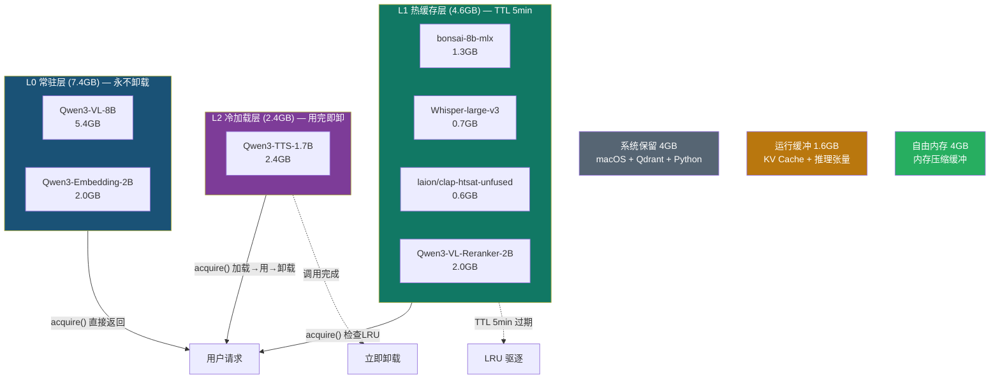
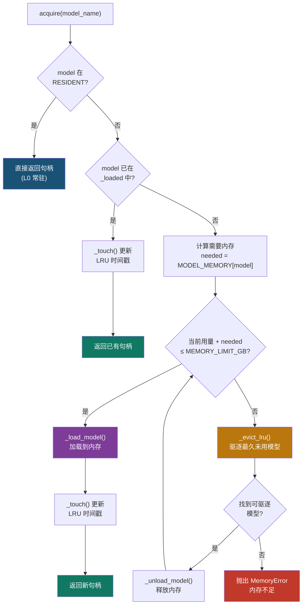
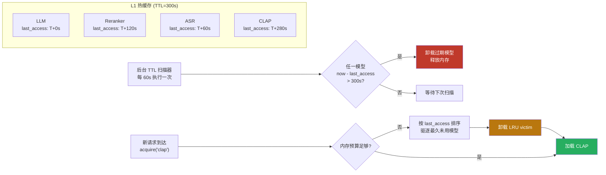
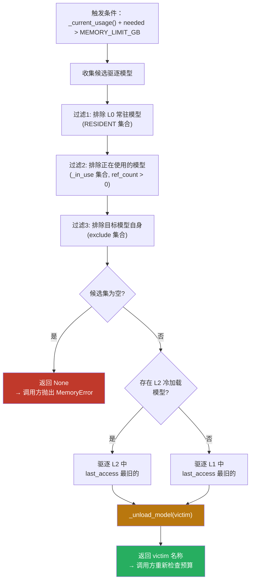
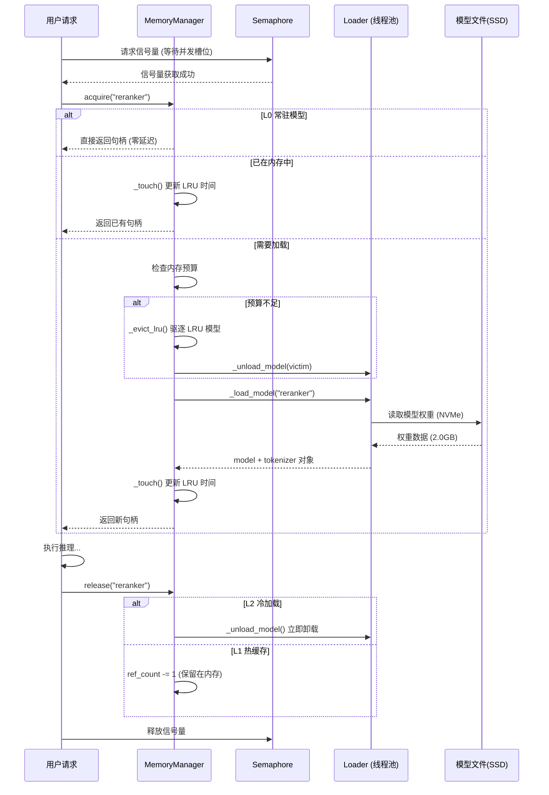
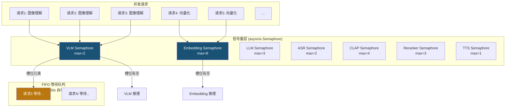

# 模型选型与内存管理

> 多模态向量推荐系统设计文档 · 02 篇
> 7 个模型协同 · 三级加载策略 · 24GB 统一内存精细分配

[← 返回目录](00-目录索引.md)

---

## 目录

1. [硬件约束分析](#1-硬件约束分析)
2. [模型选型表](#2-模型选型表)
3. [模型选型理由](#3-模型选型理由)
4. [三级内存管理架构](#4-三级内存管理架构)
5. [MemoryManager 完整实现](#5-memorymanager-完整实现)
6. [内存预算计算](#6-内存预算计算)
7. [模型加载/卸载策略](#7-模型加载卸载策略)
8. [并发控制](#8-并发控制)

---

## 1. 硬件约束分析

### 1.1 目标硬件规格

| 参数 | 规格 |
|------|------|
| 芯片 | Apple M5 (Apple Silicon) |
| 统一内存 | 24 GB LPDDRX |
| 内存带宽 | ~120 GB/s（统一内存架构，CPU/GPU/ANE 共享） |
| 神经引擎 (ANE) | 集成，支持部分算子卸载 |
| 存储 | NVMe SSD，模型冷加载延迟低 |
| 操作系统 | macOS 26.5 |

### 1.2 核心约束：统一内存的"双刃剑"

Apple Silicon 采用**统一内存架构（Unified Memory Architecture, UMA）**，CPU 与 GPU 共享同一块物理内存。这带来两个关键影响：

- **优势**：模型权重无需在 CPU/GPU 间拷贝，零拷贝推理延迟极低，MLX 框架可直接利用 GPU 进行矩阵运算。
- **约束**：所有进程共享 24GB 物理内存。macOS 内核、窗口服务器、后台守护进程等系统开销无法回避，一旦总用量逼近物理上限，系统触发内存压缩（memory compression）甚至交换（swap），导致推理延迟数倍增长。

因此，**必须为系统预留足够的内存余量**，保证 macOS 正常运行的同时避免触发压缩/交换。

### 1.3 24GB 内存分配预算

基于上述约束，24GB 统一内存的精细分配方案如下：

```
┌──────────────────────────────────────────────────────────┐
│                 24 GB 统一内存总容量                       │
├────────────┬──────────────┬──────────────┬───────┬───────┤
│  系统 4GB  │  L0 常驻 7.4G│  L1 热缓存 4.6G│L2 2.4G│缓冲1.6G│
│  macOS     │  VLM+Embed   │  LLM+ASR+     │  TTS  │ 运行  │
│  Qdrant    │  永不卸载     │  CLAP+Reranker│用完即卸│ KV缓存│
│  Python    │              │  TTL 5min     │       │       │
└────────────┴──────────────┴──────────────┴───────┴───────┘
      ↑              ↑              ↑          ↑       ↑
   预留不可动      常驻集         热缓存集    冷加载   安全垫
```

| 分配项 | 占用 | 说明 |
|--------|------|------|
| 系统保留 | 4.0 GB | macOS 内核 + Qdrant 向量库 + Python 运行时 + 基础守护进程 |
| L0 常驻集 | 7.4 GB | VLM (5.4G) + Embedding (2.0G)，启动即加载，永不卸载 |
| L1 热缓存集 | 4.6 GB | LLM (1.3G) + ASR (0.7G) + CLAP (0.6G) + Reranker (2.0G)，TTL 5 分钟 |
| L2 冷加载集 | 2.4 GB | TTS (2.4G)，按需加载，用完即卸 |
| 运行缓冲 | 1.6 GB | KV Cache、推理中间张量、峰值保护 |
| **合计** | **20.0 GB** | 预留 4GB 给系统压缩/交换，确保不触发 swap |
| **剩余自由** | **4.0 GB** | macOS 内存压缩缓冲区，防止系统卡顿 |

> **关键安全阈值**：`MEMORY_LIMIT_GB = 20.0`。当模型层内存使用量达到 20GB 时，拒绝加载新模型并触发 LRU 驱逐。此阈值 = 24GB − 4GB 系统保留，确保 macOS 始终有 4GB 自由内存运行基础服务。

### 1.4 峰值内存场景分析

| 场景 | 加载模型 | 内存占用 | 是否安全 |
|------|---------|---------|---------|
| 启动空闲 | VLM + Embedding | 7.4 GB | ✅ 余量 12.6 GB |
| 文本检索 + 精排 | L0 + LLM + Reranker | 7.4 + 1.3 + 2.0 = 10.7 GB | ✅ 余量 9.3 GB |
| 图像理解 + 推荐 | L0 + LLM | 7.4 + 1.3 = 8.7 GB | ✅ 余量 11.3 GB |
| 语音输入 + 检索 | L0 + ASR + LLM | 7.4 + 0.7 + 1.3 = 9.4 GB | ✅ 余量 10.6 GB |
| 音乐/环境音 + 检索 | L0 + CLAP + LLM + Reranker | 7.4 + 0.6 + 1.3 + 2.0 = 11.3 GB | ✅ 余量 8.7 GB |
| 全负载（含语音合成） | L0 + L1 全部 + TTS | 7.4 + 4.6 + 2.4 = 14.4 GB | ✅ 余量 5.6 GB |
| 极端全负载（ASR/CLAP 互斥优化后） | L0 + LLM + Reranker + ASR + TTS | 7.4 + 1.3 + 2.0 + 0.7 + 2.4 = 13.8 GB | ✅ 余量 6.2 GB |

> **ASR 与 CLAP 互斥**：语音转写（ASR）处理人声语音，音频嵌入（CLAP）处理音乐/环境音，二者业务场景互斥，不同时加载。实际 L1 峰值为 4.0GB 而非 4.6GB。

---

## 2. 模型选型表

### 2.1 完整模型清单

| # | 模型名 | 用途 | 框架 | 参数量 | 量化 | 内存占用 | 内存层级 | 加载策略 |
|---|--------|------|------|--------|------|---------|---------|---------|
| 1 | Qwen3-VL-8B-Instruct (4-bit) | 视觉理解 (VLM) | mlx-vlm | 8B | MLX 4-bit | 5.4 GB | L0 常驻 | 系统启动加载，永不卸载 |
| 2 | Qwen3-Embedding-2B | 文本向量化 | transformers | 2B | 4-bit | 2.0 GB | L0 常驻 | 系统启动加载，永不卸载 |
| 3 | bonsai-8b-mlx | 推荐理由生成 (LLM) | mlx-lm | 8B | 1-bit | 1.3 GB | L1 热缓存 | 首次调用加载，TTL 5min |
| 4 | Whisper-large-v3 | 语音转写 (ASR) | transformers | 1.5B | FP16 | 0.7 GB | L1 热缓存 | 首次调用加载，TTL 5min |
| 5 | laion/clap-htsat-unfused | 音频嵌入 (CLAP) | transformers | 0.15B | FP16 | 0.6 GB | L1 热缓存 | 首次调用加载，TTL 5min |
| 6 | Qwen3-VL-Reranker-2B | 精排 (Reranker) | transformers | 2B | 4-bit | 2.0 GB | L1 热缓存 | 首次调用加载，TTL 5min |
| 7 | Qwen3-TTS-1.7B | 语音合成 (TTS) | transformers | 1.7B | 4-bit | 2.4 GB | L2 冷加载 | 每次调用加载，用完即卸 |

### 2.2 模型角色与数据流

```
用户输入                         模型处理                          输出
─────────────────────────────────────────────────────────────────────
图片/视频帧  ──→  Qwen3-VL-8B (VLM)  ──→  文本描述
                                              │
语音输入     ──→  Whisper-large-v3 (ASR) ──→  转写文本
                                              │
音乐/环境音  ──→  CLAP (音频嵌入)     ──→  音频向量 + 标签
                                              │
                    Qwen3-Embedding-2B  ←─────┘ (文本向量化)
                          │
                          ▼
                    Qdrant 向量数据库 (检索)
                          │
                          ▼
              Qwen3-VL-Reranker-2B (精排重排)
                          │
                          ▼
              bonsai-8b-mlx (LLM 推荐理由生成)
                          │
                          ▼
              Qwen3-TTS-1.7B (TTS 语音播报) ← 仅按需
```

---

## 3. 模型选型理由

### 3.1 Qwen3-VL-8B-Instruct（视觉理解 VLM）

**选型理由**：

| 对比维度 | Qwen3-VL-8B (4-bit) | Llama-3.2-11B-Vision | InternVL2-8B | MiniCPM-V-2.6 |
|---------|---------------------|----------------------|--------------|---------------|
| 内存占用 | **5.4 GB** | ~6.5 GB | ~5.8 GB | ~5.0 GB |
| 框架兼容 | **mlx-vlm 原生支持** | 需 transformers | 需 transformers | 需 transformers |
| 中文能力 | **原生中文，业界顶级** | 一般 | 良好 | 良好 |
| 上下文窗口 | **262,144 tokens** | 131K | 32K | 32K |
| 量化支持 | MLX 4-bit 原生 | GGUF only | 需手动量化 | 需手动量化 |

**核心决策**：

1. **mlx-vlm 原生优化**：mlx-vlm 是 Apple Silicon 专用框架，对 M 系列芯片的统一内存和 GPU 进行深度优化。Qwen3-VL-8B 在 mlx-vlm 上以 4-bit 量化运行，模型仅占 5.4GB，峰值内存约 7.7GB，完美适配 24GB 环境。
2. **超长上下文**：262,144 tokens 的上下文窗口允许处理大量视频帧（≤50 帧一批处理仍远低于上限），避免频繁分批导致的上下文丢失。
3. **中文原生**：推荐系统面向中文场景，Qwen3-VL 的中文 OCR、场景描述、物体识别能力在 8B 级别模型中处于领先地位。
4. **已验证可用**：项目实践中已确认 mlx-vlm + 4-bit 量化可在 M5 24GB 上稳定运行。LM Studio 因误识别 VLM 为 LLM 类型而无法使用，mlx-vlm 是唯一可行的本地 VLM 方案。

> **已知限制**：mlx-vlm 存在视频 token 插入 bug，视频处理必须通过 ffmpeg 抽帧后逐帧/批量送入，不能直接传视频文件。

### 3.2 Qwen3-Embedding-2B（文本向量化）

**选型理由**：

| 对比维度 | Qwen3-Embedding-2B | BGE-large-zh | text-embedding-3-large | mxbai-embed-large |
|---------|--------------------|-------------|------------------------|--------------------|
| 内存占用 | **2.0 GB (4-bit)** | 1.3 GB | 0.3 GB (API) | 0.7 GB |
| 向量维度 | 可变 (512/1024/2048) | 1024 | 3072 | 1024 |
| 中文能力 | **业界顶级** | 优秀 | 良好 | 一般 |
| 本地部署 | **是** | 是 | 否 (OpenAI API) | 是 |
| 多语言 | **100+ 语言** | 中英 | 多语言 | 英文为主 |

**核心决策**：

1. **本地部署必需**：推荐系统需要高频向量化（索引构建 + 实时查询），依赖外部 API 会引入网络延迟和成本。Qwen3-Embedding-2B 完全本地运行。
2. **中文语义理解**：Qwen3-Embedding 在 C-MTEB 中文榜单长期领先，对中文商品描述、用户意图的语义捕捉优于 BGE。
3. **维度灵活性**：支持 512/1024/2048 多维度输出，可根据向量数据库存储成本灵活选择（推荐使用 1024 维，兼顾精度与存储）。
4. **常驻必需**：每次索引写入和用户查询都需要向量化，调用频率最高，必须常驻内存避免重复加载的 I/O 开销。

### 3.3 bonsai-8b-mlx（推荐理由生成 LLM）

**选型理由**：

| 对比维度 | bonsai-8b-mlx (1-bit) | Qwen3-8B (4-bit) | Llama-3.1-8B (4-bit) | Phi-3-mini (4-bit) |
|---------|------------------------|------------------|---------------------|---------------------|
| 内存占用 | **1.3 GB** | 5.0 GB | 4.5 GB | 2.3 GB |
| 框架 | **mlx-lm 原生** | mlx-lm | mlx-lm | mlx-lm |
| 中文能力 | 良好 | **优秀** | 一般 | 一般 |
| 推理质量 | 良好（推荐理由够用） | 优秀 | 良好 | 一般 |
| 常驻可行性 | **可热缓存** | 需常驻才合理 | 需常驻才合理 | 可热缓存 |

**核心决策**：

1. **极致量化省内存**：bonsai-8b-mlx 采用 1-bit 量化，8B 参数模型仅占 1.3GB，比常规 4-bit 量化（5GB）节省 3.7GB。这使得 LLM 可以作为热缓存模型而非常驻模型，大幅降低基础内存占用。
2. **推荐理由生成够用**：LLM 在本系统中的任务是生成"推荐理由"文本（如"这款耳机适合你，因为..."），而非复杂推理。1-bit 量化的质量损失在此任务上可接受。
3. **mlx-lm 原生**：与 VLM 同属 MLX 生态，加载方式一致，M 芯片优化充分。
4. **从 qwen3.5-9b-mlx 替换**：原方案使用 qwen3.5-9b-mlx (6.0GB, 常驻)，替换为 bonsai-8b-mlx 后节省 4.7GB 内存，使三级内存策略可行。

### 3.4 Whisper-large-v3（语音转写 ASR）

**选型理由**：

| 对比维度 | Whisper-large-v3 | Qwen3-ASR-0.6B | faster-whisper-large-v3 | SenseVoice |
|---------|-----------------|----------------|------------------------|------------|
| 内存占用 | **0.7 GB (FP16)** | 0.7 GB | 0.7 GB | 0.5 GB |
| 中文识别 | 优秀 | 良好 | 优秀 | **优秀** |
| 多语言 | **99 种语言** | 中英为主 | 99 种语言 | 中英日韩粤 |
| 框架 | transformers (MPS) | transformers | CTranslate2 | FunASR |
| 生态成熟度 | **最高** | 新发布 | 高 | 中文生态 |

**核心决策**：

1. **多语言覆盖**：推荐系统可能接收不同语言的语音输入，Whisper 支持 99 种语言，覆盖面最广。
2. **生态成熟**：Whisper 是开源 ASR 的事实标准，文档完善、社区活跃、问题排查资源丰富。transformers 原生支持 MPS 后端，在 M5 上可利用 GPU 加速。
3. **精度与体积平衡**：large-v3 是 Whisper 系列中精度最高的版本，0.7GB 的内存占用在 L1 热缓存中可接受。
4. **热缓存合理**：语音输入并非持续高频，TTL 5 分钟的热缓存策略避免常驻浪费。

### 3.5 laion/clap-htsat-unfused（音频嵌入 CLAP）

**选型理由**：

| 对比维度 | laion/clap-htsat-unfused | Whisper (as embedder) | AudioMAE | BEATs |
|---------|--------------------------|----------------------|----------|-------|
| 音频类型 | **音乐 + 环境音 + 语音** | 仅语音 | 通用 | 通用 |
| 向量输出 | **512 维音频嵌入** | 无嵌入输出 | 768 维 | 768 维 |
| 内存占用 | **0.6 GB** | 0.7 GB | 1.2 GB | 1.0 GB |
| 标签能力 | **自动音频标签** | 无 | 无 | 有限 |
| 框架 | transformers (MPS) | transformers | 需自建 | 需自建 |

**核心决策**：

1. **非语音音频必需**：ASR (Whisper) 只能处理人声语音，对音乐、环境音（鸟鸣、雨声、机械声等）无能为力。CLAP 专门处理非语音音频，生成可检索的音频向量，两者互补。
2. **音频标签自动生成**：CLAP 可自动为音频片段打标签（如"钢琴"、"下雨"、"咖啡馆环境"），这些标签直接用于推荐系统的元数据增强。
3. **与 ASR 互斥加载**：语音输入走 ASR，音乐/环境音走 CLAP，二者业务场景不重叠，共享 L1 热缓存槽位，不会同时占满内存。
4. **模型名修正**：正确的 HuggingFace 模型标识为 `laion/clap-htsat-unfused`（非 unfused），已在项目中下载验证。

### 3.6 Qwen3-VL-Reranker-2B（精排 Reranker）

**选型理由**：

| 对比维度 | Qwen3-VL-Reranker-2B | bge-reranker-large | Cohere Rerank | Jina Reranker |
|---------|----------------------|-------------------|--------------|---------------|
| 多模态 | **跨模态精排** | 仅文本 | 仅文本 | 仅文本 |
| 内存占用 | **2.0 GB (4-bit)** | 1.3 GB | API | 0.6 GB |
| 中文能力 | **顶级** | 优秀 | 良好 | 一般 |
| 本地部署 | **是** | 是 | 否 | 否 |
| 场景适配 | **图文混合候选重排** | 文本重排 | 文本重排 | 文本重排 |

**核心决策**：

1. **跨模态精排必需**：本推荐系统的候选集包含文本、图像、音频等多种模态的检索结果，纯文本 Reranker 无法理解跨模态相关性。Qwen3-VL-Reranker 支持图文混合输入的精排，直接对"用户查询 vs 候选项"做多模态相关性打分。
2. **与 VLM 同族**：Qwen3-VL-Reranker 与 Qwen3-VL-8B 同属 Qwen3-VL 系列，tokenizer 和视觉编码器共享架构理解，开发一致性高。
3. **热缓存合理**：精排在推荐流程末端调用，频率低于 VLM/Embedding 但高于 TTS，TTL 5 分钟热缓存策略平衡延迟与内存。
4. **已验证**：模型已下载（HuggingFace: `Qwen/Qwen3-VL-Reranker-2B`，4.0GB 原始文件，4-bit 量化后 2.0GB），加载验证通过。

### 3.7 Qwen3-TTS-1.7B（语音合成 TTS）

**选型理由**：

| 对比维度 | Qwen3-TTS-1.7B (4-bit) | edge-tts | Coqui XTTS-v2 | ChatTTS |
|---------|------------------------|----------|---------------|---------|
| 内存占用 | **2.4 GB** | 0 (云端) | 1.8 GB | 1.0 GB |
| 中文质量 | **优秀** | 优秀(微软) | 良好 | 良好 |
| 本地部署 | **是** | 否 | 是 | 是 |
| 离线可用 | **是** | 否 | 是 | 是 |
| 语音克隆 | 支持 | 否 | 支持 | 否 |

**核心决策**：

1. **本地部署离线可用**：推荐系统可能在内网或离线环境运行，TTS 需完全本地化。Qwen3-TTS 不依赖云端服务。
2. **冷加载策略**：语音合成仅在用户明确要求"语音播报推荐结果"时触发，频率最低，用完即卸的冷加载策略避免 2.4GB 常驻浪费。
3. **中文质量**：Qwen3-TTS 对中文的韵律、多音字处理优于开源竞品，适合生成推荐理由的语音播报。

---

## 4. 三级内存管理架构

### 4.1 三级层级定义

系统采用**三级内存管理策略**，根据模型调用频率和内存占用将 7 个模型分为三个层级：

| 层级 | 名称 | 包含模型 | 总占用 | 加载时机 | 卸载条件 |
|------|------|---------|--------|---------|---------|
| **L0** | 常驻集 (Resident) | VLM + Embedding | 7.4 GB | 系统启动时加载 | 仅系统关闭时释放 |
| **L1** | 热缓存集 (Warm Cache) | LLM + ASR + CLAP + Reranker | 4.6 GB | 首次调用时加载 | TTL 5 分钟无调用 → 卸载 |
| **L2** | 冷加载集 (Cold Load) | TTS | 2.4 GB | 每次调用时加载 | 调用完成立即卸载 |

### 4.2 层级关系与驱逐流程



### 4.3 内存预算检查与 LRU 驱逐流程



### 4.4 L1 热缓存 TTL 与 LRU 淘汰机制



---

## 5. MemoryManager 完整实现

### 5.1 设计概述

`MemoryManager` 是系统内存管理的核心组件，负责 7 个模型的生命周期管理。核心设计原则：

1. **常驻优先**：L0 模型启动即加载，`acquire()` 直接返回句柄，零延迟。
2. **LRU 驱逐**：非 L0 模型按 `last_access` 时间戳排序，内存不足时驱逐最久未用者。
3. **TTL 自动过期**：L1 热缓存模型 5 分钟无调用自动卸载，后台扫描器定期执行。
4. **冷加载即用即卸**：L2 模型 `release()` 时立即卸载，不保留。
5. **信号量并发控制**：每模型独立 `asyncio.Semaphore`，防止并发推理导致内存峰值。
6. **引用计数保护**：正在使用的模型不会被 LRU 驱逐。

### 5.2 完整代码实现

```python
"""
MemoryManager — 多模态推荐系统模型内存管理器

运行环境: Apple M5 (24GB Unified Memory)
框架: mlx-vlm / mlx-lm / transformers (MPS backend)
策略: 三级内存管理 (L0 常驻 / L1 热缓存 / L2 冷加载) + LRU 驱逐

依赖:
    pip install mlx-vlm mlx-lm transformers torch accelerate
"""

import asyncio
import time
import logging
from dataclasses import dataclass, field
from enum import Enum
from typing import Any, Optional

logger = logging.getLogger(__name__)


# ──────────────────────────────────────────────────────────────
# 1. 常量定义：三级内存层级
# ──────────────────────────────────────────────────────────────

class MemoryTier(Enum):
    """模型内存层级枚举"""
    L0_RESIDENT = "L0"      # 常驻：启动加载，永不卸载
    L1_WARM_CACHE = "L1"    # 热缓存：首次调用加载，TTL 5min
    L2_COLD_LOAD = "L2"     # 冷加载：每次加载，用完即卸


# 各层级包含的模型名集合
RESIDENT = {"vlm", "embedding"}
WARM_CACHE = {"llm", "asr", "clap", "reranker"}
COLD_LOAD = {"tts"}

# 热缓存 TTL（秒）：5 分钟无调用自动卸载
WARM_TTL = 300

# 冷加载卸载延迟（秒）：release 后延迟卸载，避免短时间反复加载
COLD_UNLOAD_DELAY = 2


# ──────────────────────────────────────────────────────────────
# 2. 模型内存映射表
# ──────────────────────────────────────────────────────────────

# 每个模型的内存占用（GB），用于内存预算计算
MODEL_MEMORY = {
    "vlm": 5.4,        # Qwen3-VL-8B (4-bit) — mlx-vlm
    "embedding": 2.0,  # Qwen3-Embedding-2B (4-bit) — transformers
    "llm": 1.3,        # bonsai-8b-mlx (1-bit) — mlx-lm
    "asr": 0.7,        # Whisper-large-v3 (FP16) — transformers
    "clap": 0.6,       # laion/clap-htsat-unfused (FP16) — transformers
    "reranker": 2.0,   # Qwen3-VL-Reranker-2B (4-bit) — transformers
    "tts": 2.4,        # Qwen3-TTS-1.7B (4-bit) — transformers
}

# 各模型的框架类型，决定加载方式
MODEL_FRAMEWORK = {
    "vlm": "mlx-vlm",
    "embedding": "transformers",
    "llm": "mlx-lm",
    "asr": "transformers",
    "clap": "transformers",
    "reranker": "transformers",
    "tts": "transformers",
}

# 各模型的 HuggingFace / 本地路径标识
MODEL_PATH = {
    "vlm": "mlx-community/Qwen3-VL-8B-Instruct-4bit",
    "embedding": "Qwen/Qwen3-Embedding-2B",
    "llm": "mlx-community/bonsai-8b-mlx",
    "asr": "openai/whisper-large-v3",
    "clap": "laion/clap-htsat-unfused",
    "reranker": "Qwen/Qwen3-VL-Reranker-2B",
    "tts": "Qwen/Qwen3-TTS-1.7B",
}


# ──────────────────────────────────────────────────────────────
# 3. 内存安全阈值
# ──────────────────────────────────────────────────────────────

# 24GB 物理内存 - 4GB 系统保留 = 20GB 模型内存上限
# 预留 4GB 给 macOS 内核、Qdrant、Python 运行时及内存压缩缓冲
MEMORY_LIMIT_GB = 20.0

# ASR 与 CLAP 互斥标记（二者不同时需要，共享槽位）
MUTUAL_EXCLUSION_PAIRS = [("asr", "clap")]


# ──────────────────────────────────────────────────────────────
# 4. 并发控制配置
# ──────────────────────────────────────────────────────────────

# 每个模型的最大并发推理数（受内存限制）
MODEL_CONCURRENCY = {
    "vlm": 2,          # VLM 内存大，限制并发避免峰值溢出
    "embedding": 8,    # Embedding 轻量，允许高并发
    "llm": 3,           # LLM 中等
    "asr": 2,           # ASR 音频处理较重
    "clap": 4,          # CLAP 轻量
    "reranker": 3,      # Reranker 中等
    "tts": 1,           # TTS 冷加载，串行避免反复加载
}

# 请求超时（秒）：超出并发上限的请求排队等待超时
REQUEST_TIMEOUT = 60


# ──────────────────────────────────────────────────────────────
# 5. 模型句柄数据结构
# ──────────────────────────────────────────────────────────────

@dataclass
class ModelHandle:
    """模型句柄：持有模型对象及元数据"""
    name: str
    model: Any                         # 模型对象 (mlx模型 / transformers pipeline)
    tokenizer: Any = None              # tokenizer / processor
    framework: str = ""               # 框架标识
    tier: MemoryTier = MemoryTier.L1_WARM_CACHE
    memory_gb: float = 0.0            # 内存占用
    loaded_at: float = field(default_factory=time.time)   # 加载时间
    last_access: float = field(default_factory=time.time) # 最后访问时间
    ref_count: int = 0                # 引用计数（正在使用中）


# ──────────────────────────────────────────────────────────────
# 6. MemoryManager 核心实现
# ──────────────────────────────────────────────────────────────

class MemoryManager:
    """
    模型内存管理器 — 三级加载 + LRU 驱逐 + 信号量并发控制

    职责:
        1. 管理所有模型的加载/卸载生命周期
        2. 维护 LRU 时间戳，内存不足时驱逐最久未用的非常驻模型
        3. 后台 TTL 扫描器定期卸载过期的 L1 热缓存模型
        4. 信号量控制每模型并发推理数，防止内存峰值
        5. 引用计数保护正在使用的模型不被驱逐
    """

    def __init__(self):
        # 已加载模型: {model_name: ModelHandle}
        self._loaded: dict[str, ModelHandle] = {}

        # 正在使用的模型集合（引用计数 > 0，不可被 LRU 驱逐）
        self._in_use: set[str] = set()

        # 加载/卸载锁（防止同一模型并发重复加载）
        self._load_locks: dict[str, asyncio.Lock] = {}

        # 信号量: {model_name: asyncio.Semaphore}
        self._semaphores: dict[str, asyncio.Semaphore] = {}

        # 全局操作锁（驱逐/预算检查时持锁）
        self._global_lock = asyncio.Lock()

        # TTL 扫描器任务
        self._ttl_task: Optional[asyncio.Task] = None

        # 初始化信号量
        for name, limit in MODEL_CONCURRENCY.items():
            self._semaphores[name] = asyncio.Semaphore(limit)
            self._load_locks[name] = asyncio.Lock()

    # ──────────────────────────────────────────
    # 公开 API
    # ──────────────────────────────────────────

    async def initialize(self):
        """系统启动时加载 L0 常驻模型"""
        logger.info("MemoryManager 初始化：加载 L0 常驻模型...")
        for name in RESIDENT:
            await self._load_model(name)
            self._touch(name)
            logger.info(f"  [L0] {name} 已加载 ({MODEL_MEMORY[name]}GB)")
        logger.info(
            f"L0 常驻集加载完成，当前内存: {self._current_usage():.1f}GB / {MEMORY_LIMIT_GB}GB"
        )
        # 启动 TTL 后台扫描器
        self._ttl_task = asyncio.create_task(self._ttl_scanner())

    async def shutdown(self):
        """系统关闭时卸载所有模型"""
        if self._ttl_task:
            self._ttl_task.cancel()
        for name in list(self._loaded.keys()):
            await self._unload_model(name)
        logger.info("MemoryManager 已关闭，所有模型已卸载")

    async def acquire(self, model_name: str) -> ModelHandle:
        """
        获取模型句柄 — 核心入口方法

        流程:
            1. 常驻模型 (L0) → 直接返回已加载句柄
            2. 已在内存中 (L1/L2) → 更新 LRU 时间戳，返回句柄
            3. 需要加载 → 检查内存预算 → 不够则驱逐 LRU → 加载 → 返回

        参数:
            model_name: 模型名称 (vlm / embedding / llm / asr / clap / reranker / tts)

        返回:
            ModelHandle: 模型句柄

        异常:
            MemoryError: 内存不足且无可驱逐模型
            ValueError: 未知模型名
        """
        if model_name not in MODEL_MEMORY:
            raise ValueError(f"未知模型: {model_name}")

        # 1. 常驻模型直接返回（L0）
        if model_name in RESIDENT:
            handle = self._loaded.get(model_name)
            if handle is None:
                # 理论上 initialize() 已加载，兜底加载
                await self._load_model(model_name)
                handle = self._loaded[model_name]
            self._touch(model_name)
            return handle

        async with self._global_lock:
            # 2. 检查是否已在内存中
            if model_name in self._loaded:
                self._touch(model_name)  # 更新 LRU 时间戳
                handle = self._loaded[model_name]
                handle.ref_count += 1
                self._in_use.add(model_name)
                return handle

            # 3. 需要加载 — 先检查互斥关系
            await self._handle_mutual_exclusion(model_name)

            # 4. 检查内存预算
            needed = MODEL_MEMORY[model_name]
            while self._current_usage() + needed > MEMORY_LIMIT_GB:
                victim = await self._evict_lru(exclude={model_name})
                if victim is None:
                    raise MemoryError(
                        f"无法加载 {model_name}：内存不足 "
                        f"(当前 {self._current_usage():.1f}GB + 需要 {needed}GB > "
                        f"上限 {MEMORY_LIMIT_GB}GB)"
                    )
                logger.info(f"  [LRU] 驱逐 {victim} 以腾出空间")

            # 5. 加载模型
            await self._load_model(model_name)
            self._touch(model_name)
            handle = self._loaded[model_name]
            handle.ref_count += 1
            self._in_use.add(model_name)

            logger.info(
                f"  [加载] {model_name} ({needed}GB) | "
                f"总内存: {self._current_usage():.1f}GB / {MEMORY_LIMIT_GB}GB"
            )
            return handle

    async def release(self, model_name: str):
        """
        释放模型引用

        - L2 冷加载模型：引用归零后立即卸载
        - L1 热缓存模型：仅减少引用计数，等待 TTL 或 LRU 驱逐
        - L0 常驻模型：无操作
        """
        if model_name not in self._loaded:
            return

        handle = self._loaded[model_name]
        handle.ref_count = max(0, handle.ref_count - 1)

        if handle.ref_count == 0:
            self._in_use.discard(model_name)

            # L2 冷加载模型：用完即卸
            if model_name in COLD_LOAD:
                logger.info(f"  [冷卸载] {model_name} 引用归零，立即卸载")
                await self._unload_model(model_name)

    async def acquire_for_inference(self, model_name: str):
        """
        上下文管理器入口：获取句柄 + 信号量并发控制

        用法:
            async with manager.acquire_for_inference("vlm") as handle:
                result = await vlm_inference(handle, image)
        """
        return _ModelContext(self, model_name)

    # ──────────────────────────────────────────
    # LRU 驱逐逻辑
    # ──────────────────────────────────────────

    async def _evict_lru(self, exclude: set[str] | None = None) -> Optional[str]:
        """
        LRU 驱逐：驱逐最久未使用的非常驻模型

        优先级:
            1. 冷加载模型 (L2) — 用完即卸，优先驱逐
            2. 热缓存模型 (L1) — 按 last_access 排序，驱逐最旧的

        排除:
            - L0 常驻模型（永不驱逐）
            - 正在使用的模型（ref_count > 0）
            - exclude 集合中的模型

        返回:
            被驱逐的模型名，或 None（无可驱逐模型）
        """
        exclude = exclude or set()

        candidates = [
            name for name in self._loaded
            if name not in RESIDENT          # 跳过常驻模型
            and name not in self._in_use     # 跳过正在使用的
            and name not in exclude          # 跳过排除集
        ]

        if not candidates:
            return None

        # 优先驱逐 L2 冷加载模型
        cold_candidates = [c for c in candidates if c in COLD_LOAD]
        if cold_candidates:
            victim = min(cold_candidates, key=lambda m: self._loaded[m].last_access)
        else:
            # L1 热缓存中按 last_access 排序，驱逐最久未用
            victim = min(candidates, key=lambda m: self._loaded[m].last_access)

        await self._unload_model(victim)
        logger.info(f"  [LRU驱逐] {victim} (last_access: "
                     f"{time.time() - self._loaded[victim].last_access:.0f}s前)" if victim in self._loaded
                     else f"  [LRU驱逐] {victim}")
        return victim

    async def _handle_mutual_exclusion(self, model_name: str):
        """
        处理互斥模型关系：ASR 与 CLAP 不同时加载

        若加载 ASR，先卸载 CLAP；反之亦然。
        """
        for a, b in MUTUAL_EXCLUSION_PAIRS:
            if model_name == a and b in self._loaded and b not in self._in_use:
                logger.info(f"  [互斥] 加载 {a}，卸载互斥模型 {b}")
                await self._unload_model(b)
            elif model_name == b and a in self._loaded and a not in self._in_use:
                logger.info(f"  [互斥] 加载 {b}，卸载互斥模型 {a}")
                await self._unload_model(a)

    # ──────────────────────────────────────────
    # 模型加载/卸载
    # ──────────────────────────────────────────

    async def _load_model(self, model_name: str):
        """加载模型到内存（根据框架调用对应加载器）"""
        # 防止同一模型并发重复加载
        async with self._load_locks[model_name]:
            if model_name in self._loaded:
                return  # 已被其他协程加载

            framework = MODEL_FRAMEWORK[model_name]
            model_path = MODEL_PATH[model_name]
            tier = self._get_tier(model_name)

            logger.info(f"  [加载中] {model_name} via {framework}...")

            # 在线程池中执行同步加载（避免阻塞事件循环）
            loop = asyncio.get_event_loop()
            model, tokenizer = await loop.run_in_executor(
                None, self._sync_load, model_name, framework, model_path
            )

            handle = ModelHandle(
                name=model_name,
                model=model,
                tokenizer=tokenizer,
                framework=framework,
                tier=tier,
                memory_gb=MODEL_MEMORY[model_name],
                loaded_at=time.time(),
                last_access=time.time(),
                ref_count=0,
            )
            self._loaded[model_name] = handle

    def _sync_load(self, model_name: str, framework: str, model_path: str):
        """
        同步加载模型（在线程池中执行）

        根据 framework 调用对应的加载逻辑。
        实际项目中需根据具体框架 API 实现。
        """
        if framework == "mlx-vlm":
            from mlx_vlm import load as mlx_vlm_load
            from mlx_vlm.utils import generate_config
            model, processor = mlx_vlm_load(model_path)
            return model, processor

        elif framework == "mlx-lm":
            from mlx_lm import load as mlx_lm_load
            model, tokenizer = mlx_lm_load(model_path)
            return model, tokenizer

        elif framework == "transformers":
            import torch
            device = "mps" if torch.backends.mps.is_available() else "cpu"

            if model_name == "embedding":
                from transformers import AutoModel, AutoTokenizer
                tokenizer = AutoTokenizer.from_pretrained(model_path)
                model = AutoModel.from_pretrained(
                    model_path, torch_dtype=torch.float16
                ).to(device)
                return model, tokenizer

            elif model_name == "asr":
                from transformers import WhisperProcessor, WhisperForConditionalGeneration
                processor = WhisperProcessor.from_pretrained(model_path)
                model = WhisperForConditionalGeneration.from_pretrained(
                    model_path, torch_dtype=torch.float16
                ).to(device)
                return model, processor

            elif model_name == "clap":
                from transformers import ClapModel, ClapProcessor
                processor = ClapProcessor.from_pretrained(model_path)
                model = ClapModel.from_pretrained(model_path).to(device)
                return model, processor

            elif model_name == "reranker":
                from transformers import AutoModelForCausalLM, AutoTokenizer
                tokenizer = AutoTokenizer.from_pretrained(model_path)
                model = AutoModelForCausalLM.from_pretrained(
                    model_path, torch_dtype=torch.float16
                ).to(device)
                return model, tokenizer

            elif model_name == "tts":
                from transformers import AutoTokenizer, AutoModelForCausalLM
                tokenizer = AutoTokenizer.from_pretrained(model_path)
                model = AutoModelForCausalLM.from_pretrained(
                    model_path, torch_dtype=torch.float16
                ).to(device)
                return model, tokenizer

        raise RuntimeError(f"未知的框架: {framework}")

    async def _unload_model(self, model_name: str):
        """从内存卸载模型，释放显存/内存"""
        if model_name not in self._loaded:
            return

        handle = self._loaded.pop(model_name)
        # 在线程池中执行同步卸载
        loop = asyncio.get_event_loop()
        await loop.run_in_executor(None, self._sync_unload, handle)

    def _sync_unload(self, handle: ModelHandle):
        """同步卸载模型：释放对象引用，触发 GC"""
        import gc
        import torch

        # 清理模型对象
        handle.model = None
        handle.tokenizer = None

        # PyTorch MPS 内存清理
        if torch.backends.mps.is_available():
            torch.mps.empty_cache()

        # 强制垃圾回收
        gc.collect()

        logger.info(
            f"  [卸载] {handle.name} 已释放 ({handle.memory_gb}GB) | "
            f"实际释放需等待 GC"
        )

    # ──────────────────────────────────────────
    # 内存统计
    # ──────────────────────────────────────────

    def _current_usage(self) -> float:
        """
        计算当前已加载模型的内存使用量（GB）

        基于 MODEL_MEMORY 静态映射表累加，
        而非运行时探测（运行时探测在统一内存架构下不可靠）。
        """
        return sum(
            MODEL_MEMORY[name] for name in self._loaded if name in MODEL_MEMORY
        )

    def get_memory_report(self) -> dict:
        """返回当前内存使用报告（用于监控/日志）"""
        loaded = {}
        for name, handle in self._loaded.items():
            loaded[name] = {
                "tier": handle.tier.value,
                "memory_gb": handle.memory_gb,
                "last_access_ago": f"{time.time() - handle.last_access:.0f}s",
                "ref_count": handle.ref_count,
                "in_use": name in self._in_use,
            }
        return {
            "total_usage_gb": round(self._current_usage(), 2),
            "limit_gb": MEMORY_LIMIT_GB,
            "free_gb": round(MEMORY_LIMIT_GB - self._current_usage(), 2),
            "loaded_models": loaded,
            "loaded_count": len(self._loaded),
        }

    # ──────────────────────────────────────────
    # 辅助方法
    # ──────────────────────────────────────────

    def _touch(self, model_name: str):
        """更新模型的 LRU 时间戳（最后访问时间）"""
        if model_name in self._loaded:
            self._loaded[model_name].last_access = time.time()

    @staticmethod
    def _get_tier(model_name: str) -> MemoryTier:
        """获取模型所属内存层级"""
        if model_name in RESIDENT:
            return MemoryTier.L0_RESIDENT
        elif model_name in COLD_LOAD:
            return MemoryTier.L2_COLD_LOAD
        else:
            return MemoryTier.L1_WARM_CACHE

    async def _ttl_scanner(self):
        """
        后台 TTL 扫描器：每 60 秒检查一次，卸载过期的 L1 热缓存模型

        L1 模型超过 WARM_TTL (300s) 无调用 → 自动卸载
        正在使用的模型 (ref_count > 0) 不卸载
        """
        while True:
            await asyncio.sleep(60)  # 每 60s 扫描一次
            now = time.time()
            async with self._global_lock:
                to_evict = []
                for name, handle in self._loaded.items():
                    if name in RESIDENT:
                        continue  # 跳过常驻模型
                    if name in COLD_LOAD:
                        continue  # 冷加载模型由 release() 管理
                    if name in self._in_use:
                        continue  # 正在使用中

                    idle = now - handle.last_access
                    if idle > WARM_TTL:
                        to_evict.append((name, idle))

                # 按空闲时间降序排序，先卸载空闲最久的
                to_evict.sort(key=lambda x: -x[1])
                for name, idle in to_evict:
                    logger.info(
                        f"  [TTL过期] {name} 空闲 {idle:.0f}s > {WARM_TTL}s，自动卸载"
                    )
                    await self._unload_model(name)


# ──────────────────────────────────────────────────────────────
# 7. 上下文管理器：acquire + 信号量并发控制
# ──────────────────────────────────────────────────────────────

class _ModelContext:
    """
    异步上下文管理器：自动获取/释放模型句柄 + 信号量并发控制

    用法:
        async with manager.acquire_for_inference("vlm") as handle:
            result = await vlm_generate(handle, prompt, image)

    流程:
        1. 获取信号量（等待并发槽位）
        2. acquire() 获取模型句柄（必要时触发加载/驱逐）
        3. 推理执行...
        4. release() 释放引用（冷加载模型自动卸载）
        5. 释放信号量
    """

    def __init__(self, manager: MemoryManager, model_name: str):
        self._manager = manager
        self._model_name = model_name
        self._semaphore = manager._semaphores[model_name]
        self._handle: Optional[ModelHandle] = None

    async def __aenter__(self) -> ModelHandle:
        # 1. 获取信号量（控制并发数）
        await asyncio.wait_for(
            self._semaphore.acquire(), timeout=REQUEST_TIMEOUT
        )
        # 2. 获取模型句柄
        try:
            self._handle = await self._manager.acquire(self._model_name)
        except Exception:
            self._semaphore.release()
            raise
        return self._handle

    async def __aexit__(self, exc_type, exc_val, exc_tb):
        # 3. 释放模型引用
        if self._handle:
            await self._manager.release(self._model_name)
        # 4. 释放信号量
        self._semaphore.release()
        return False


# ──────────────────────────────────────────────────────────────
# 8. 全局单例
# ──────────────────────────────────────────────────────────────

# 全局 MemoryManager 单例
_memory_manager: Optional[MemoryManager] = None


def get_memory_manager() -> MemoryManager:
    """获取全局 MemoryManager 单例"""
    global _memory_manager
    if _memory_manager is None:
        _memory_manager = MemoryManager()
    return _memory_manager


# ──────────────────────────────────────────────────────────────
# 使用示例
# ──────────────────────────────────────────────────────────────

async def main():
    """示例：完整使用流程"""
    logging.basicConfig(level=logging.INFO, format="%(asctime)s [%(levelname)s] %(message)s")

    manager = get_memory_manager()

    # 1. 启动：加载 L0 常驻模型
    await manager.initialize()

    # 2. 使用 VLM（L0 常驻，零延迟）
    async with manager.acquire_for_inference("vlm") as vlm_handle:
        # result = await vlm_inference(vlm_handle, image=pixels)
        print(f"VLM 句柄获取成功: {vlm_handle.name}")

    # 3. 使用 Embedding（L0 常驻）
    async with manager.acquire_for_inference("embedding") as emb_handle:
        # vec = await embed_text(emb_handle, "搜索关键词")
        print(f"Embedding 句柄获取成功: {emb_handle.name}")

    # 4. 使用 LLM（L1 热缓存，首次加载）
    async with manager.acquire_for_inference("llm") as llm_handle:
        # reason = await generate_recommendation_reason(llm_handle, context)
        print(f"LLM 句柄获取成功: {llm_handle.name}")

    # 5. 使用 Reranker（L1 热缓存）
    async with manager.acquire_for_inference("reranker") as rer_handle:
        # ranked = await rerank(rer_handle, query, candidates)
        print(f"Reranker 句柄获取成功: {rer_handle.name}")

    # 6. 使用 ASR（L1 热缓存，与 CLAP 互斥）
    async with manager.acquire_for_inference("asr") as asr_handle:
        # text = await transcribe(asr_handle, audio)
        print(f"ASR 句柄获取成功: {asr_handle.name}")

    # 7. 使用 TTS（L2 冷加载，用完即卸）
    async with manager.acquire_for_inference("tts") as tts_handle:
        # audio = await synthesize(tts_handle, "推荐理由文本")
        print(f"TTS 句柄获取成功: {tts_handle.name}")
    # TTS 退出上下文后立即卸载

    # 8. 打印内存报告
    report = manager.get_memory_report()
    print(f"\n内存报告: {report}")

    # 9. 关闭
    await manager.shutdown()


if __name__ == "__main__":
    asyncio.run(main())
```

### 5.3 关键设计说明

| 方法 | 职责 | 关键逻辑 |
|------|------|---------|
| `initialize()` | 启动加载 L0 | 遍历 `RESIDENT` 集合，依次加载 VLM 和 Embedding |
| `acquire()` | 获取模型句柄 | L0 直接返回 → L1/L2 检查已加载 → 未加载则检查预算 → 驱逐 LRU → 加载 |
| `_evict_lru()` | LRU 驱逐 | 跳过常驻模型和正在使用的模型，优先驱逐 L2，再驱逐 L1 中最久未用的 |
| `_load_model()` | 加载模型 | 根据框架调用 mlx-vlm / mlx-lm / transformers 对应加载器，在线程池中执行 |
| `_unload_model()` | 卸载模型 | 置空引用 + `torch.mps.empty_cache()` + `gc.collect()` 释放统一内存 |
| `_current_usage()` | 内存统计 | 累加 `_loaded` 中所有模型的 `MODEL_MEMORY` 静态值 |
| `_ttl_scanner()` | 后台 TTL 扫描 | 每 60s 检查 L1 模型，空闲超过 300s 自动卸载 |
| `_handle_mutual_exclusion()` | 互斥处理 | ASR 与 CLAP 不同时加载，加载一个先卸载另一个 |

---

## 6. 内存预算计算

### 6.1 总体预算表

| 分配项 | 子项 | 占用 (GB) | 累计 (GB) | 说明 |
|--------|------|-----------|-----------|------|
| **系统保留** | macOS 内核 + 窗口服务器 | 1.5 | 1.5 | 不可压缩的内核内存 |
| | Qdrant 向量数据库 | 1.0 | 2.5 | 向量索引常驻内存 |
| | Python 运行时 + 依赖库 | 1.0 | 3.5 | asyncio / transformers / mlx |
| | 后台守护进程 | 0.5 | 4.0 | 通知、Spotlight 等 |
| **L0 常驻集** | Qwen3-VL-8B (4-bit) | 5.4 | 9.4 | mlx-vlm |
| | Qwen3-Embedding-2B (4-bit) | 2.0 | 11.4 | transformers |
| **L1 热缓存集** | bonsai-8b-mlx (1-bit) | 1.3 | 12.7 | mlx-lm |
| | Whisper-large-v3 (FP16) | 0.7 | 13.4 | transformers |
| | laion/clap-htsat-unfused (FP16) | 0.6 | 14.0 | transformers |
| | Qwen3-VL-Reranker-2B (4-bit) | 2.0 | 16.0 | transformers |
| **L2 冷加载集** | Qwen3-TTS-1.7B (4-bit) | 2.4 | 18.4 | transformers |
| **运行缓冲** | KV Cache + 推理中间张量 | 1.6 | 20.0 | 峰值保护 |
| **自由内存** | 内存压缩缓冲 | 4.0 | 24.0 | 防止系统 swap |

### 6.2 各层级内存明细

#### L0 常驻集（永不卸载）

| 模型 | 内存 | 量化 | 加载耗时(预估) | 调用频率 |
|------|------|------|--------------|---------|
| Qwen3-VL-8B | 5.4 GB | MLX 4-bit | ~8s | 极高（每次图像/视频输入） |
| Qwen3-Embedding-2B | 2.0 GB | 4-bit | ~3s | 极高（每次索引/查询） |
| **小计** | **7.4 GB** | | ~11s | |

#### L1 热缓存集（TTL 5 分钟）

| 模型 | 内存 | 量化 | 加载耗时(预估) | 调用频率 |
|------|------|------|--------------|---------|
| bonsai-8b-mlx | 1.3 GB | 1-bit | ~2s | 高（每次推荐理由生成） |
| Whisper-large-v3 | 0.7 GB | FP16 | ~3s | 中（语音输入时） |
| laion/clap-htsat-unfused | 0.6 GB | FP16 | ~2s | 中（音频输入时） |
| Qwen3-VL-Reranker-2B | 2.0 GB | 4-bit | ~4s | 高（每次精排） |
| **小计（全部）** | **4.6 GB** | | ~11s | |
| **小计（互斥优化后）** | **4.0 GB** | | | ASR/CLAP 不同时加载 |

#### L2 冷加载集（用完即卸）

| 模型 | 内存 | 量化 | 加载耗时(预估) | 调用频率 |
|------|------|------|--------------|---------|
| Qwen3-TTS-1.7B | 2.4 GB | 4-bit | ~5s | 低（仅语音播报时） |
| **小计** | **2.4 GB** | | ~5s | |

### 6.3 峰值内存场景推演

```
场景: 用户语音输入 → ASR 转写 → 文本向量化 → 检索 → 精排 → 推荐理由生成 → 语音播报

时间线:
  T+0s   用户语音输入
  T+0s   acquire("asr")     → L1 加载 ASR (0.7GB)
  T+3s   ASR 推理完成
  T+3s   acquire("embedding") → L0 直接返回 (0GB 增量)
  T+3s   向量化 + Qdrant 检索
  T+4s   acquire("reranker")  → L1 加载 Reranker (2.0GB)
  T+8s   精排完成
  T+8s   acquire("llm")       → L1 加载 LLM (1.3GB)
  T+10s  推荐理由生成完成
  T+10s  acquire("tts")       → L2 加载 TTS (2.4GB)
         此时 ASR 仍在内存(TTL 未过期)
  T+15s  TTS 合成完成 → release("tts") → 立即卸载

峰值内存 (T+10s~T+15s):
  L0: 7.4GB (VLM + Embedding)
  L1: 0.7 + 2.0 + 1.3 = 4.0GB (ASR + Reranker + LLM，CLAP 未加载)
  L2: 2.4GB (TTS)
  ────────────────────────────
  合计: 13.8GB → 远低于 20GB 上限 ✅

  + 系统 4GB + 缓冲 → 总计 17.8GB，余 6.2GB ✅
```

### 6.4 内存预算与安全阈值验证

| 指标 | 值 | 验证 |
|------|-----|------|
| 物理内存 | 24.0 GB | — |
| `MEMORY_LIMIT_GB` | 20.0 GB | 24 - 4(系统) = 20 |
| L0 常驻峰值 | 7.4 GB | 20 - 7.4 = 12.6GB 可用 |
| L0 + L1 全部峰值 | 12.0 GB | 20 - 12.0 = 8.0GB 可用 |
| L0 + L1 + L2 全负载峰值 | 14.4 GB | 20 - 14.4 = 5.6GB 可用 |
| L0 + L1(互斥) + L2 实际峰值 | 13.8 GB | 20 - 13.8 = 6.2GB 可用 |
| 系统保留 | 4.0 GB | 24 - 20 = 4.0 |
| 最小自由内存 | 4.0 GB | 全负载下仍有 24 - 20 = 4GB |

> 结论：在**最极端的全负载场景**下（L0 + L1 全部 + L2 同时在内存），模型内存使用 14.4GB，加上 4GB 系统保留 = 18.4GB，仍留有 5.6GB 自由内存。`MEMORY_LIMIT_GB = 20.0` 提供了充足的缓冲。

---

## 7. 模型加载/卸载策略

### 7.1 加载策略矩阵

| 层级 | 加载时机 | 加载触发者 | 预估加载耗时 | 是否阻塞 |
|------|---------|-----------|------------|---------|
| L0 常驻 | 系统启动时 | `initialize()` | ~11s（两个模型） | 启动期间阻塞 |
| L1 热缓存 | 首次调用 `acquire()` | `acquire()` 内部 | 2~4s/模型 | 首次调用阻塞，后续零延迟 |
| L2 冷加载 | 每次调用 `acquire()` | `acquire()` 内部 | ~5s | 每次调用阻塞 |

### 7.2 卸载策略矩阵

| 层级 | 卸载时机 | 卸载触发者 | 卸载延迟 |
|------|---------|-----------|---------|
| L0 常驻 | 仅系统关闭时 | `shutdown()` | — |
| L1 热缓存 | TTL 5min 过期 或 LRU 驱逐 | `_ttl_scanner()` / `_evict_lru()` | 5min 后自动 |
| L2 冷加载 | `release()` 引用归零时 | `release()` | 立即（2s 延迟兜底） |

### 7.3 LRU 驱逐规则详解

LRU（Least Recently Used）驱逐是内存管理的核心防线，当新模型需要加载但内存预算不足时触发：



**驱逐优先级**：

1. **L2 冷加载模型优先驱逐**：冷加载模型用完即卸是常态，优先驱逐它们对系统影响最小。
2. **L1 热缓存按 LRU 排序**：在 L1 模型中，按 `last_access` 时间戳排序，驱逐空闲最久的。例如：LLM 30s 前用过、Reranker 120s 前用过 → 先驱逐 Reranker。
3. **正在使用的模型绝不驱逐**：`ref_count > 0` 的模型正在执行推理，驱逐会导致推理失败。

### 7.4 TTL 过期自动卸载

后台 TTL 扫描器每 60 秒执行一次，检查所有 L1 热缓存模型的空闲时间：

| 模型 | 上次访问 | 当前时间 | 空闲时长 | 是否过期 (>300s) | 动作 |
|------|---------|---------|---------|-----------------|------|
| LLM | T+0s | T+350s | 350s | ✅ 过期 | 卸载 |
| Reranker | T+120s | T+350s | 230s | ❌ 未过期 | 保留 |
| ASR | T+60s | T+350s | 290s | ❌ 未过期 | 保留 |

> TTL 扫描器跳过 `ref_count > 0` 的模型（正在推理中的模型不会被中断）。

### 7.5 模型加载流程时序



---

## 8. 并发控制

### 8.1 信号量并发控制架构

系统使用 `asyncio.Semaphore` 为每个模型设置独立的并发上限，防止多请求同时推理导致内存峰值溢出：



### 8.2 各模型并发限制表

| 模型 | 并发上限 | 限制原因 | 单次推理内存增量 | 峰值内存增量 |
|------|---------|---------|----------------|-------------|
| VLM (Qwen3-VL-8B) | 2 | 模型 5.4GB + KV Cache 大，限制并发避免峰值 | ~0.8GB (KV Cache) | ~1.6GB (2路并发) |
| Embedding (Qwen3-2B) | 8 | 模型轻量，推理快，允许高并发 | ~0.1GB | ~0.8GB |
| LLM (bonsai-8b-mlx) | 3 | 1-bit 量化轻量，推荐理由生成较快 | ~0.3GB | ~0.9GB |
| ASR (Whisper-large-v3) | 2 | 音频处理内存波动大 | ~0.4GB | ~0.8GB |
| CLAP (clap-htsat) | 4 | 模型极轻量(0.15B)，快速推理 | ~0.1GB | ~0.4GB |
| Reranker (Qwen3-VL-2B) | 3 | 精排需要多候选打分 | ~0.2GB | ~0.6GB |
| TTS (Qwen3-TTS-1.7B) | 1 | 冷加载模型，串行避免反复加载 | ~0.5GB | ~0.5GB |

### 8.3 并发控制实现机制

```python
# 每个模型一个独立信号量，初始化时创建
for name, limit in MODEL_CONCURRENCY.items():
    self._semaphores[name] = asyncio.Semaphore(limit)

# acquire_for_inference 上下文管理器封装了信号量 + 句柄获取
async with manager.acquire_for_inference("vlm") as handle:
    result = await vlm_inference(handle, image)

# 内部流程:
# 1. await semaphore.acquire()       # 获取并发槽位 (超时 60s)
# 2. await self.acquire(model_name)  # 获取模型句柄 (可能触发加载/驱逐)
# 3. ...推理执行...
# 4. await self.release(model_name)  # 释放引用 (L2 立即卸载)
# 5. semaphore.release()             # 释放并发槽位
```

### 8.4 并发场景分析

#### 场景1：多用户同时进行图像理解

```
请求1 → acquire_for_inference("vlm") → 信号量(2/2) → 获取句柄 → 推理中
请求2 → acquire_for_inference("vlm") → 信号量(2/2) → 获取句柄 → 推理中
请求3 → acquire_for_inference("vlm") → 信号量(0/2) → 等待... → 超时60s拒绝 ❌

内存增量: VLM KV Cache ~0.8GB × 2 = 1.6GB
总内存: 7.4(L0) + 1.6(KV) = 9.0GB → 安全 ✅
```

#### 场景2：混合多模态并发

```
请求1 → VLM 图像理解      → 信号量(1/2) → 推理中
请求2 → Embedding 向量化  → 信号量(1/8) → 推理中
请求3 → LLM 推荐理由      → 信号量(1/3) → 推理中
请求4 → Reranker 精排     → 信号量(1/3) → 推理中

内存增量: 0.8(VLM KV) + 0.1(Emb) + 0.3(LLM) + 0.2(Reranker) = 1.4GB
总内存: 7.4(L0) + 1.3(LLM) + 2.0(Reranker) + 1.4(KV) = 12.1GB → 安全 ✅
```

#### 场景3：信号量超时拒绝

```
VLM 信号量已满(2/2)，第3个请求等待超过 60s:
→ asyncio.wait_for() 抛出 TimeoutError
→ 返回 HTTP 503 (Service Unavailable)
→ 客户端重试或降级处理
```

### 8.5 并发控制设计原则

| 原则 | 说明 |
|------|------|
| **每模型独立信号量** | 不同模型的内存特性不同，需要独立的并发限制 |
| **信号量先于句柄获取** | 先控制并发数再加载模型，避免多请求同时触发加载导致内存溢出 |
| **超时拒绝机制** | 等待超过 60s 自动拒绝，避免请求无限堆积 |
| **引用计数保护** | `ref_count > 0` 的模型不会被 LRU 驱逐，保证推理不被中断 |
| **加载/卸载串行化** | 同一模型的 `_load_locks` 防止并发重复加载；`_global_lock` 保证驱逐操作的原子性 |
| **ASR/CLAP 互斥** | 两者共享 L1 槽位，加载一个先卸载另一个，实际并发内存更低 |

---

## 附录：模型选型速查卡

```
┌────────────────────────────────────────────────────────────────────────┐
│                    多模态推荐系统 · 7 模型协同图                        │
├────────────────────────────────────────────────────────────────────────┤
│                                                                        │
│  L0 常驻 (7.4GB) ─────────────────────────────────────────── 永不卸载  │
│  ┌─────────────────────┐  ┌─────────────────────┐                    │
│  │ Qwen3-VL-8B (5.4GB) │  │ Qwen3-Embed-2B (2.0G)│                    │
│  │ mlx-vlm · 4-bit     │  │ transformers · 4-bit │                    │
│  │ 视觉理解             │  │ 文本向量化            │                    │
│  └─────────────────────┘  └─────────────────────┘                    │
│                                                                        │
│  L1 热缓存 (4.6GB) ──────────────────────────────── TTL 5min · LRU   │
│  ┌──────────┐ ┌─────────┐ ┌──────────┐ ┌────────────┐               │
│  │bonsai-8b │ │Whisper-v3│ │  CLAP    │ │Reranker-2B │               │
│  │ 1.3GB    │ │ 0.7GB    │ │ 0.6GB    │ │ 2.0GB      │               │
│  │mlx-lm    │ │transform.│ │transform.│ │transform.  │               │
│  │1-bit     │ │FP16      │ │FP16      │ │4-bit       │               │
│  │推荐理由  │ │语音转写  │ │音频嵌入  │ │精排重排    │               │
│  └──────────┘ └─────────┘ └──────────┘ └────────────┘               │
│       ↕ 互斥加载: ASR(语音) vs CLAP(音乐/环境音)                        │
│                                                                        │
│  L2 冷加载 (2.4GB) ──────────────────────────────────── 用完即卸     │
│  ┌─────────────────────┐                                               │
│  │ Qwen3-TTS-1.7B(2.4G)│                                               │
│  │ transformers · 4-bit│                                               │
│  │ 语音合成             │                                               │
│  └─────────────────────┘                                               │
│                                                                        │
│  系统保留 (4.0GB) ─── macOS + Qdrant + Python ─── 不可压缩            │
│  运行缓冲 (1.6GB) ─── KV Cache + 推理张量 ─── 峰值保护                │
│  自由内存 (4.0GB) ─── 内存压缩缓冲 ─── 防止 swap                       │
│                                                                        │
│  合计: 24.0GB  |  安全阈值: MEMORY_LIMIT_GB = 20.0GB                  │
└────────────────────────────────────────────────────────────────────────┘
```

---

[← 返回目录](00-目录索引.md)

---

> 多模态向量推荐系统设计文档 · 02 模型选型与内存管理 · 版本：2026-08-14
