[← 返回目录](00-目录索引.md)

# 03 — 数据索引管线

> **运行环境**：Apple M5 (24GB RAM) · **模型总占用**：~8.7GB
>
> | 模型 | 用途 | 内存占用 |
> |------|------|----------|
> | Qwen3-VL-8B (mlx-vlm 4-bit) | 图片/视频帧分析 (VLM) | 5.4GB |
> | Whisper-large-v3 | 语音转写 (ASR) | 0.7GB |
> | laion/clap-htsat-unfused | 音频嵌入 (CLAP) | 0.6GB |
> | Qwen3-Embedding-2B | 文本向量化 (Embedding) | 2.0GB |

---

## 目录

1. [管线总览](#1-管线总览)
2. [图片索引模块](#2-图片索引模块)
3. [视频索引模块](#3-视频索引模块)
4. [音频索引模块](#4-音频索引模块)
5. [ffmpeg 工具封装](#5-ffmpeg-工具封装)
6. [VAD 语音活动检测](#6-vad-语音活动检测)
7. [标签生成体系](#7-标签生成体系)
8. [渐进式索引](#8-渐进式索引)
9. [去重策略](#9-去重策略)

---

## 1. 管线总览

数据索引管线负责将原始的多模态文件（图片、视频、音频）转化为可被 Qdrant 向量数据库检索的结构化向量与元数据。三种模态各自拥有独立的预处理流水线，最终汇聚到统一的 Qdrant Collection 中。

### 1.1 三模态索引全流程

```mermaid
flowchart TB
    subgraph INPUT["输入层"]
        IMG[图片文件<br>jpg/png/webp]
        VID[视频文件<br>mp4/mov/mkv]
        AUD[音频文件<br>mp3/wav/flac]
    end

    subgraph IMAGE["图片索引流程"]
        I1[文件读取 + MD5 去重] --> I2[VLM 分析<br>Qwen3-VL-8B]
        I2 --> I3[富文本描述 + 六类标签]
        I3 --> I4[Embedding 向量化<br>Qwen3-Embedding-2B]
    end

    subgraph VIDEO["视频索引流程"]
        V1[文件读取 + MD5 去重] --> V2{索引模式}
        V2 -->|visual 画面模式| V3[ffmpeg 抽帧]
        V3 --> V4[VLM 批量分析]
        V4 --> V5[描述 + 标签 + Embedding]
        V2 -->|audio 声音模式| V6[ffmpeg 提音轨]
        V6 --> V7[VAD 检测]
        V7 --> V8[ASR 转写 / CLAP 嵌入]
        V8 --> V9[文本 Embedding]
        V2 -->|both 画面+声音| V3
        V2 -->|both 画面+声音| V6
    end

    subgraph AUDIO["音频索引流程"]
        A1[文件读取 + MD5 去重] --> A2[音频类型判断]
        A2 -->|语音| A3[ASR 转写<br>Whisper-large-v3]
        A2 -->|音乐/环境音| A4[CLAP 嵌入]
        A2 -->|混合| A3
        A2 -->|混合| A4
        A3 --> A5[文本 Embedding]
        A4 --> A6[CLAP 音频向量]
    end

    IMG --> IMAGE
    VID --> VIDEO
    AUD --> AUDIO

    IMAGE --> MERGE[结果汇聚]
    VIDEO --> MERGE
    AUDIO --> MERGE

    MERGE --> QDRANT[(Qdrant 向量数据库)]
    MERGE --> META[(元数据存储<br>SQLite/JSON)]

    style IMAGE fill:#1a201a,stroke:#10B981
    style VIDEO fill:#1a1520,stroke:#8B5CF6
    style AUDIO fill:#0f1a1d,stroke:#06B6D4
    style QDRANT fill:#1d1a25,stroke:#A78BFA
```



### 1.2 统一输出格式

所有模态的索引管线最终输出统一的数据结构，便于 Qdrant 存储和后续检索：

```python
from dataclasses import dataclass, field
from typing import Optional

@dataclass
class IndexResult:
    """统一索引结果 — 所有模态共用"""
    file_path: str                          # 原始文件路径
    file_hash: str                          # MD5 哈希（去重用）
    modality: str                           # 模态: image / video / audio
    content_vector: list[float]             # 主内容向量（文本 Embedding）
    audio_vector: Optional[list[float]]      # 音频向量（CLAP），仅音频/视频含音轨时
    description: str                        # 富文本描述
    tags: dict[str, list[str]]              # 六类标签
    metadata: dict                          # 模态特定元数据（时长、分辨率等）
    index_level: str                        # 索引层级: L1 / L2 / L3
```

### 1.3 模型内存调度策略

在 24GB M5 上，4 个模型总占用 ~8.7GB，系统通过分时复用避免内存峰值：

```mermaid
flowchart LR
    subgraph RESIDENT["常驻模型 (~7.4GB)"]
        E[Qwen3-Embedding-2B<br>2.0GB<br>高频调用，常驻]
        V[Qwen3-VL-8B 4-bit<br>5.4GB<br>核心分析，常驻]
    end

    subgraph SWAP["互斥加载 (~0.7-1.3GB)"]
        direction TB
        W[Whisper-large-v3<br>0.7GB] -.->|互斥| C[CLAP<br>0.6GB]
    end

    RESIDENT --> QDRANT[(Qdrant)]
    SWAP --> QDRANT

    style RESIDENT fill:#1a201a,stroke:#10B981
    style SWAP fill:#1a1a20,stroke:#F59E0B
```



> Whisper 和 CLAP 互斥加载：处理语音内容时加载 Whisper，处理音乐/环境音时切换为 CLAP，两者不同时占用内存。

---

## 2. 图片索引模块

图片索引是最基础的索引流程，将单张图片通过 VLM 分析生成富文本描述和六类标签，再经 Embedding 模型向量化后存入 Qdrant。

### 2.1 流程图

```mermaid
flowchart LR
    A[图片文件] --> B[MD5 哈希计算]
    B --> C{已存在?}
    C -->|是| SKIP[跳过，返回已有记录]
    C -->|否| D[读取图片]
    D --> E[VLM 分析<br>Qwen3-VL-8B 4-bit]
    E --> F[富文本描述<br>100-200字]
    E --> G[六类标签提取<br>category/style/emotion/scene/objects/audio]
    F --> H[文本拼接<br>描述 + 标签文本]
    G --> H
    H --> I[Embedding 向量化<br>Qwen3-Embedding-2B]
    I --> J[写入 Qdrant<br>content_vector + payload]
    E --> K[元数据<br>尺寸/格式/色彩空间]
    K --> J

    style E fill:#1a1520,stroke:#8B5CF6
    style I fill:#1a1a20,stroke:#F59E0B
    style J fill:#1d1a25,stroke:#A78BFA
```



### 2.2 Python 实现

```python
import hashlib
import json
import mlx.core as mx
from mlx_vlm import load, generate
from mlx_vlm.prompt_utils import apply_chat_template
from mlx_vlm.utils import load_config
from pathlib import Path
from PIL import Image
from typing import Optional

# ---------------------------------------------------------------------------
# 图片索引模块
# ---------------------------------------------------------------------------

class ImageIndexer:
    """图片索引器 — VLM 分析 → 标签提取 → Embedding → Qdrant"""

    # VLM 分析 Prompt（详见第 7 章标签生成体系）
    VLM_PROMPT = """你是一位专业的内容分析师。请分析这张图片，按以下 JSON 格式输出分析结果：

{
  "description": "一段 100-200 字的详细描述，包含构图、光线、色彩分析",
  "tags_category": ["一级分类标签，如 美食/风景/人物/建筑/动物"],
  "tags_style": ["视觉风格标签，如 ins风/夜景/暖色调"],
  "tags_emotion": ["情绪氛围标签，如 温馨/活力/宁静"],
  "tags_scene": ["场景环境标签，如 室内/户外/车内"],
  "tags_objects": ["检测到的具体物体，如 汽车/手机/花卉"],
  "tags_audio": ["如果图片暗示了声音，如 钢琴/咖啡馆环境音，无则留空数组"],
  "summary": "一句话总结"
}

要求：
- 标签用中文，每个类别 2-5 个标签
- 描述要包含构图、光线、色彩分析
- 只输出 JSON，不要其他内容"""

    def __init__(self, qdrant_client, embedding_model, vlm_model=None, vlm_processor=None):
        """
        Args:
            qdrant_client: Qdrant 客户端实例
            embedding_model: 已加载的 Qwen3-Embedding-2B 模型
            vlm_model: 已加载的 Qwen3-VL-8B 模型（如为 None 则按需加载）
            vlm_processor: VLM processor
        """
        self.qdrant = qdrant_client
        self.embedding_model = embedding_model
        self.vlm_model = vlm_model
        self.vlm_processor = vlm_processor
        self.collection_name = "multimodal_index"

    def _compute_md5(self, file_path: str) -> str:
        """计算文件 MD5 哈希"""
        hash_md5 = hashlib.md5()
        with open(file_path, "rb") as f:
            for chunk in iter(lambda: f.read(8192), b""):
                hash_md5.update(chunk)
        return hash_md5.hexdigest()

    def _check_exists(self, file_hash: str) -> bool:
        """检查文件是否已索引（基于 MD5 去重）"""
        results, _ = self.qdrant.scroll(
            collection_name=self.collection_name,
            scroll_filter={
                "must": [{"key": "file_hash", "match": {"value": file_hash}}]
            },
            limit=1,
        )
        return len(results) > 0

    def _analyze_with_vlm(self, image_path: str) -> dict:
        """使用 VLM 分析图片，返回描述 + 标签"""
        # mlx-vlm 加载图片并生成
        formatted_prompt = apply_chat_template(
            self.vlm_processor, self.vlm_prompt, num_images=1
        )

        output = generate(
            self.vlm_model,
            self.vlm_processor,
            formatted_prompt,
            image_path,
            max_tokens=1024,
            verbose=False,
        )

        # 解析 VLM 输出的 JSON
        try:
            # 尝试提取 JSON 部分（VLM 可能输出额外文本）
            text = output.strip()
            if text.startswith("```json"):
                text = text[7:]
            if text.endswith("```"):
                text = text[:-3]
            result = json.loads(text)
        except json.JSONDecodeError:
            # 兜底：使用原始输出作为描述，标签为空
            result = {
                "description": output.strip(),
                "tags_category": [],
                "tags_style": [],
                "tags_emotion": [],
                "tags_scene": [],
                "tags_objects": [],
                "tags_audio": [],
                "summary": "",
            }

        return result

    def _get_image_metadata(self, image_path: str) -> dict:
        """获取图片元数据"""
        with Image.open(image_path) as img:
            return {
                "width": img.width,
                "height": img.height,
                "format": img.format,
                "mode": img.mode,
                "file_size": Path(image_path).stat().st_size,
            }

    def _embed_text(self, text: str) -> list[float]:
        """使用 Qwen3-Embedding-2B 将文本向量化"""
        # 假设 embedding_model 封装了 encode 方法
        embeddings = self.embedding_model.encode([text])
        return embeddings[0].tolist()

    def index(self, image_path: str) -> Optional[IndexResult]:
        """
        索引单张图片
        Returns:
            IndexResult 或 None（如已存在则跳过）
        """
        image_path = str(Path(image_path).resolve())

        # 1. MD5 去重检查
        file_hash = self._compute_md5(image_path)
        if self._check_exists(file_hash):
            print(f"[SKIP] 文件已索引: {image_path}")
            return None

        # 2. VLM 分析
        vlm_result = self._analyze_with_vlm(image_path)

        # 3. 拼接用于 Embedding 的文本
        tags = {
            "category": vlm_result.get("tags_category", []),
            "style": vlm_result.get("tags_style", []),
            "emotion": vlm_result.get("tags_emotion", []),
            "scene": vlm_result.get("tags_scene", []),
            "objects": vlm_result.get("tags_objects", []),
            "audio": vlm_result.get("tags_audio", []),
        }
        tags_text = " ".join(
            f"#{tag}" for tag_list in tags.values() for tag in tag_list
        )
        embed_text = f"{vlm_result['description']} {vlm_result.get('summary', '')} {tags_text}"

        # 4. Embedding 向量化
        content_vector = self._embed_text(embed_text)

        # 5. 图片元数据
        metadata = self._get_image_metadata(image_path)

        # 6. 构建 IndexResult
        result = IndexResult(
            file_path=image_path,
            file_hash=file_hash,
            modality="image",
            content_vector=content_vector,
            audio_vector=None,
            description=vlm_result["description"],
            tags=tags,
            metadata={
                **metadata,
                "summary": vlm_result.get("summary", ""),
            },
            index_level="L2",
        )

        # 7. 写入 Qdrant
        self._save_to_qdrant(result)

        return result

    def _save_to_qdrant(self, result: IndexResult):
        """将索引结果写入 Qdrant"""
        from qdrant_client.models import PointStruct

        point = PointStruct(
            id=result.file_hash,  # 用 MD5 作为 point ID
            vector={
                "content_vector": result.content_vector,
            },
            payload={
                "file_path": result.file_path,
                "file_hash": result.file_hash,
                "modality": result.modality,
                "description": result.description,
                "tags": result.tags,
                "metadata": result.metadata,
                "index_level": result.index_level,
            },
        )
        self.qdrant.upsert(
            collection_name=self.collection_name,
            points=[point],
        )
```

---

## 3. 视频索引模块

视频包含画面轨道和声音轨道两条信息流。系统支持三种索引模式：`visual`（仅画面）、`audio`（仅声音）、`both`（画面+声音并行）。视频时长决定了抽帧策略，进而影响 VLM 批量分析的方式。

### 3.1 流程图

```mermaid
flowchart TB
    V[视频文件] --> V0[MD5 去重检查]
    V0 --> V1{索引模式}

    V1 -->|visual| VS
    V1 -->|audio| AS
    V1 -->|both| VS
    V1 -->|both| AS

    subgraph VISUAL["画面索引路径"]
        VS[获取视频信息<br>时长/分辨率] --> VT{视频时长}
        VT -->|< 30s 短视频| VF1[ffmpeg 1fps 抽帧<br>~30帧]
        VT -->|30s-5min 中视频| VF2[ffmpeg 每2-3s抽帧<br>~30-100帧]
        VT -->|> 5min 长视频| VF3[ffmpeg 场景切换检测<br>scene>0.4<br>~20-30帧]

        VF1 --> VC{帧数判断}
        VF2 --> VC
        VF3 --> VC

        VC -->|≤50帧| VA1[VLM 批量分析<br>一批传入]
        VC -->|>100帧| VA2[关键帧提取<br>Top-N 代表帧]
        VA1 --> VR[描述 + 标签]
        VA2 --> VR
        VR --> VE[文本 Embedding<br>Qwen3-Embedding-2B]
    end

    subgraph AUDIO["声音索引路径"]
        AS[ffmpeg 提取音轨<br>16kHz 单声道 WAV] --> AV[VAD 语音检测<br>silero-vad]
        AV --> AT{语音占比}
        AT -->|>70% 语音| AASR[ASR 转写<br>Whisper-large-v3]
        AT -->|<30% 非语音| ACLP[CLAP 嵌入]
        AT -->|混合| AASR
        AT -->|混合| ACLP
        AASR --> ATX[转写文本]
        ACLP --> ACV[CLAP 音频向量]
        ATX --> ATE[文本 Embedding]
    end

    VE --> MERGE[结果汇聚]
    ATE --> MERGE
    ACV --> MERGE

    MERGE --> QDRANT[(Qdrant)]

    style VISUAL fill:#1a1520,stroke:#8B5CF6
    style AUDIO fill:#0f1a1d,stroke:#06B6D4
    style QDRANT fill:#1d1a25,stroke:#A78BFA
```



### 3.2 ffmpeg 抽帧策略

根据视频时长自动选择抽帧策略，统一缩放到 720p：

| 视频时长 | 策略 | 预估帧数 | 分辨率 | 适用场景 |
|----------|------|----------|--------|----------|
| < 30s | 1fps 抽帧 | ~30 帧 | 720p | 短视频、动图、片头 |
| 30s - 5min | 每 2-3s 一帧 | ~30-100 帧 | 720p | 常规视频、Vlog |
| > 5min | 场景切换检测 (scene > 0.4) | ~20-30 帧 | 720p | 长视频、纪录片、课程 |

```bash
# ─── 短视频 (<30s)：1fps 抽帧 ───
ffmpeg -i input.mp4 \
  -vf "fps=1,scale=1280:720:force_original_aspect_ratio=decrease,pad=1280:720:(ow-iw)/2:(oh-ih)/2" \
  -q:v 2 \
  frames/frame_%04d.jpg

# ─── 中视频 (30s-5min)：每 2-3s 一帧 ───
ffmpeg -i input.mp4 \
  -vf "fps=1/3,scale=1280:720:force_original_aspect_ratio=decrease,pad=1280:720:(ow-iw)/2:(oh-ih)/2" \
  -q:v 2 \
  frames/frame_%04d.jpg

# ─── 长视频 (>5min)：场景切换检测 (scene > 0.4) ───
ffmpeg -i input.mp4 \
  -vf "select='gt(scene,0.4)',scale=1280:720:force_original_aspect_ratio=decrease,pad=1280:720:(ow-iw)/2:(oh-ih)/2" \
  -vsync vfr \
  -q:v 2 \
  frames/frame_%04d.jpg
```

### 3.3 VLM 批量分析策略

抽帧完成后，根据帧数选择不同的 VLM 分析策略：

| 帧数范围 | 策略 | 说明 |
|----------|------|------|
| ≤ 50 帧 | 批量分析 | 将所有帧一次性传入 VLM，生成整体描述 |
| > 100 帧 | 关键帧提取 | 从帧序列中选取 Top-N 代表帧（均匀采样或聚类），再批量分析 |
| 50 - 100 帧 | 分批处理 | 分 2 批传入，结果合并 |

```python
# VLM 批量分析策略核心逻辑
def select_analysis_strategy(frame_count: int) -> str:
    """根据帧数选择 VLM 分析策略"""
    if frame_count <= 50:
        return "batch"          # 批量分析
    elif frame_count <= 100:
        return "split_batch"   # 分批处理
    else:
        return "keyframe"      # 关键帧提取

def extract_keyframes(frames: list[str], n: int = 20) -> list[str]:
    """从帧序列中提取 Top-N 代表帧（均匀采样）"""
    if len(frames) <= n:
        return frames
    step = len(frames) / n
    return [frames[int(i * step)] for i in range(n)]
```

### 3.4 Python 实现

```python
import hashlib
import json
import subprocess
import tempfile
import os
from pathlib import Path
from typing import Optional, Literal

# ---------------------------------------------------------------------------
# 视频索引模块
# ---------------------------------------------------------------------------

class VideoIndexer:
    """视频索引器 — 三种模式：visual / audio / both"""

    def __init__(
        self,
        qdrant_client,
        embedding_model,
        vlm_model=None,
        vlm_processor=None,
        whisper_model=None,
        clap_model=None,
    ):
        self.qdrant = qdrant_client
        self.embedding_model = embedding_model
        self.vlm_model = vlm_model
        self.vlm_processor = vlm_processor
        self.whisper_model = whisper_model
        self.clap_model = clap_model
        self.collection_name = "multimodal_index"

    # ─── 公共方法 ───────────────────────────────────────────────────

    def index(
        self,
        video_path: str,
        mode: Literal["visual", "audio", "both"] = "both",
    ) -> Optional[IndexResult]:
        """
        索引视频文件
        Args:
            video_path: 视频文件路径
            mode: 索引模式
                - visual: 仅分析画面（ffmpeg 抽帧 → VLM）
                - audio:  仅分析声音（提音轨 → VAD → ASR/CLAP）
                - both:   画面+声音并行分析
        """
        video_path = str(Path(video_path).resolve())

        # 1. MD5 去重
        file_hash = self._compute_md5(video_path)
        if self._check_exists(file_hash):
            print(f"[SKIP] 文件已索引: {video_path}")
            return None

        # 2. 获取视频信息
        video_info = self._get_video_info(video_path)
        duration = video_info["duration"]

        # 3. 根据模式分发
        visual_result = None
        audio_result = None

        if mode in ("visual", "both"):
            visual_result = self._index_visual(video_path, duration)

        if mode in ("audio", "both"):
            audio_result = self._index_audio(video_path)

        # 4. 合并结果
        merged = self._merge_results(visual_result, audio_result)

        # 5. 写入 Qdrant
        result = IndexResult(
            file_path=video_path,
            file_hash=file_hash,
            modality="video",
            content_vector=merged["content_vector"],
            audio_vector=merged.get("audio_vector"),
            description=merged["description"],
            tags=merged["tags"],
            metadata={
                **video_info,
                "mode": mode,
                "visual_result": visual_result is not None,
                "audio_result": audio_result is not None,
            },
            index_level="L3",
        )

        self._save_to_qdrant(result)
        return result

    # ─── 画面索引路径 ───────────────────────────────────────────────

    def _index_visual(self, video_path: str, duration: float) -> dict:
        """画面索引：ffmpeg 抽帧 → VLM 分析 → Embedding"""
        with tempfile.TemporaryDirectory() as tmpdir:
            # 1. 根据时长选择抽帧策略
            frame_strategy = self._select_frame_strategy(duration)
            frames = self._extract_frames(video_path, tmpdir, frame_strategy)
            print(f"[VISUAL] 抽帧策略: {frame_strategy}, 帧数: {len(frames)}")

            # 2. VLM 批量分析策略选择
            analysis_strategy = self._select_analysis_strategy(len(frames))
            print(f"[VISUAL] 分析策略: {analysis_strategy}")

            if analysis_strategy == "keyframe":
                # 关键帧提取
                frames = self._extract_keyframes(frames, n=20)

            # 3. VLM 分析
            vlm_result = self._analyze_frames_with_vlm(frames)

            # 4. 构建 Embedding 文本
            tags = self._extract_tags_from_vlm(vlm_result)
            tags_text = " ".join(
                f"#{tag}" for tag_list in tags.values() for tag in tag_list
            )
            embed_text = f"{vlm_result['description']} {vlm_result.get('summary', '')} {tags_text}"

            # 5. Embedding
            content_vector = self._embed_text(embed_text)

            return {
                "content_vector": content_vector,
                "description": vlm_result["description"],
                "tags": tags,
                "frame_count": len(frames),
                "frame_strategy": frame_strategy,
                "analysis_strategy": analysis_strategy,
            }

    def _select_frame_strategy(self, duration: float) -> str:
        """根据时长选择抽帧策略"""
        if duration < 30:
            return "fps_1"          # 1fps
        elif duration < 300:         # 5min
            return "fps_1_3"        # 每3秒1帧
        else:
            return "scene"          # 场景切换

    def _select_analysis_strategy(self, frame_count: int) -> str:
        """根据帧数选择 VLM 分析策略"""
        if frame_count <= 50:
            return "batch"
        elif frame_count <= 100:
            return "split_batch"
        else:
            return "keyframe"

    def _extract_keyframes(self, frames: list[str], n: int = 20) -> list[str]:
        """从帧序列中均匀采样 Top-N 代表帧"""
        if len(frames) <= n:
            return frames
        step = len(frames) / n
        return [frames[int(i * step)] for i in range(n)]

    def _analyze_frames_with_vlm(self, frames: list[str]) -> dict:
        """使用 VLM 分析帧序列，返回描述 + 标签"""
        prompt = f"""你是一位专业的内容分析师。请分析这 {len(frames)} 帧视频画面，
        它们按时间顺序排列。请综合所有帧内容，按以下 JSON 格式输出分析结果：

{{
  "description": "一段 100-200 字的视频内容描述，包含画面变化、场景转换",
  "tags_category": ["一级分类标签"],
  "tags_style": ["视觉风格标签"],
  "tags_emotion": ["情绪氛围标签"],
  "tags_scene": ["场景环境标签"],
  "tags_objects": ["检测到的物体"],
  "tags_audio": [],
  "summary": "一句话总结"
}}

要求：
- 标签用中文，每个类别 2-5 个标签
- 描述要涵盖视频的画面变化和叙事
- 只输出 JSON"""

        formatted_prompt = apply_chat_template(
            self.vlm_processor, prompt, num_images=len(frames)
        )

        output = generate(
            self.vlm_model,
            self.vlm_processor,
            formatted_prompt,
            frames,   # 传入帧列表
            max_tokens=1024,
            verbose=False,
        )

        return self._parse_vlm_json(output)

    # ─── 声音索引路径 ───────────────────────────────────────────────

    def _index_audio(self, video_path: str) -> dict:
        """声音索引：提音轨 → VAD → ASR/CLAP → Embedding"""
        with tempfile.TemporaryDirectory() as tmpdir:
            # 1. 提取音轨
            audio_path = os.path.join(tmpdir, "audio.wav")
            self._extract_audio(video_path, audio_path)
            print(f"[AUDIO] 音轨提取完成: {audio_path}")

            # 2. VAD 语音活动检测
            from silero_vad import load_silero_vad, read_audio, get_speech_timestamps
            vad_model = load_silero_vad()
            wav = read_audio(audio_path, sampling_rate=16000)
            speech_timestamps = get_speech_timestamps(
                wav, vad_model,
                threshold=0.5,
                min_speech_duration_ms=250,
                min_silence_duration_ms=500,
            )

            # 3. 计算语音占比
            total_speech = sum(t["end"] - t["start"] for t in speech_timestamps)
            total_duration = len(wav)
            speech_ratio = total_speech / total_duration if total_duration > 0 else 0
            print(f"[AUDIO] 语音占比: {speech_ratio:.2%}")

            # 4. 根据语音占比路由
            audio_vector = None
            content_vector = None
            transcription = ""
            audio_tags = []

            if speech_ratio > 0.7:
                # 语音为主 → ASR 转写
                transcription = self._run_asr(audio_path, speech_timestamps)
                content_vector = self._embed_text(transcription)

            elif speech_ratio < 0.3:
                # 非语音为主 → CLAP 嵌入
                audio_vector = self._run_clap(audio_path)
                audio_tags = self._clap_zero_shot_classify(audio_path)

            else:
                # 混合 → ASR + CLAP 并行
                transcription = self._run_asr(audio_path, speech_timestamps)
                content_vector = self._embed_text(transcription)
                audio_vector = self._run_clap(audio_path)
                audio_tags = self._clap_zero_shot_classify(audio_path)

            return {
                "content_vector": content_vector,
                "audio_vector": audio_vector,
                "transcription": transcription,
                "audio_tags": audio_tags,
                "speech_ratio": speech_ratio,
                "speech_segments": len(speech_timestamps),
            }

    def _run_asr(self, audio_path: str, speech_timestamps: list[dict]) -> str:
        """使用 Whisper-large-v3 进行 ASR 转写"""
        import torch
        import librosa

        # 加载 Whisper（如果未预加载）
        if self.whisper_model is None:
            from transformers import WhisperProcessor, WhisperForConditionalGeneration
            processor = WhisperProcessor.from_pretrained("openai/whisper-large-v3")
            self.whisper_model = WhisperForConditionalGeneration.from_pretrained(
                "openai/whisper-large-v3"
            )
            self._whisper_processor = processor

        # 读取音频
        wav, sr = librosa.load(audio_path, sr=16000)

        # 只对语音段进行转写（VAD 过滤静音段）
        segments_text = []
        for ts in speech_timestamps:
            start_sample = ts["start"]
            end_sample = ts["end"]
            segment = wav[start_sample:end_sample]

            if len(segment) < sr * 0.1:  # 跳过 <0.1s 的片段
                continue

            # Whisper 推理
            input_features = self._whisper_processor(
                segment, sampling_rate=sr, return_tensors="pt"
            ).input_features
            predicted_ids = self.whisper_model.generate(input_features)
            text = self._whisper_processor.batch_decode(
                predicted_ids, skip_special_tokens=True
            )[0]
            segments_text.append(text)

        full_transcription = " ".join(segments_text)
        print(f"[ASR] 转写完成，文本长度: {len(full_transcription)}")
        return full_transcription

    def _run_clap(self, audio_path: str) -> list[float]:
        """使用 CLAP 生成音频嵌入向量"""
        # 延迟加载 CLAP（与 Whisper 互斥）
        if self.clap_model is None:
            import laion_clap
            self.clap_model = laion_clap.CLAP_Module(enable_fusion=False)
            self.clap_model.load_ckpt()  # 加载预训练权重

        # 读取音频
        import librosa
        audio_data, sr = librosa.load(audio_path, sr=48000)
        audio_data = audio_data.reshape(1, -1)

        # CLAP 嵌入
        audio_embed = self.clap_model.get_audio_embedding_from_data(
            x=audio_data, use_tensor=False
        )
        return audio_embed[0].tolist()

    def _clap_zero_shot_classify(self, audio_path: str) -> list[str]:
        """CLAP 零样本分类 — 音频标签生成"""
        if self.clap_model is None:
            import laion_clap
            self.clap_model = laion_clap.CLAP_Module(enable_fusion=False)
            self.clap_model.load_ckpt()

        # 候选标签
        candidate_labels = [
            "钢琴", "吉他", "鼓", "小提琴", "电子合成器",
            "古典", "流行", "爵士", "摇滚", "电子",
            "咖啡馆环境音", "雨声", "街道噪音", "鸟鸣", "海浪",
            "欢快", "悲伤", "紧张", "宁静", "激昂",
        ]
        text_embed = self.clap_model.get_text_embedding(
            [f"this is a sound of {label}" for label in candidate_labels]
        )

        import librosa
        audio_data, sr = librosa.load(audio_path, sr=48000)
        audio_data = audio_data.reshape(1, -1)
        audio_embed = self.clap_model.get_audio_embedding_from_data(
            x=audio_data, use_tensor=False
        )

        # 计算相似度
        import numpy as np
        similarity = (audio_embed @ text_embed.T)[0]
        top_indices = np.argsort(similarity)[-5:][::-1]  # Top-5

        return [candidate_labels[i] for i in top_indices]

    # ─── 结果合并 ───────────────────────────────────────────────────

    def _merge_results(
        self, visual_result: Optional[dict], audio_result: Optional[dict]
    ) -> dict:
        """合并画面和声音的索引结果"""
        merged = {
            "content_vector": None,
            "audio_vector": None,
            "description": "",
            "tags": {},
        }

        if visual_result:
            merged["content_vector"] = visual_result["content_vector"]
            merged["description"] = visual_result["description"]
            merged["tags"].update(visual_result["tags"])

        if audio_result:
            # 如果画面也有 content_vector，取加权平均
            if merged["content_vector"] is not None and audio_result["content_vector"] is not None:
                merged["content_vector"] = self._average_vectors(
                    merged["content_vector"],
                    audio_result["content_vector"],
                    weights=[0.6, 0.4],  # 画面权重高于声音
                )
            elif audio_result["content_vector"] is not None:
                merged["content_vector"] = audio_result["content_vector"]

            merged["audio_vector"] = audio_result.get("audio_vector")
            merged["tags"]["audio"] = audio_result.get("audio_tags", [])

            # 附加转写文本到描述
            if audio_result.get("transcription"):
                merged["description"] += f" [语音转写]: {audio_result['transcription'][:200]}"

        return merged

    @staticmethod
    def _average_vectors(v1: list[float], v2: list[float], weights=None) -> list[float]:
        """加权平均两个向量"""
        if weights is None:
            weights = [0.5, 0.5]
        return [v1[i] * weights[0] + v2[i] * weights[1] for i in range(len(v1))]

    # ─── ffmpeg 工具方法（详见第 5 章） ─────────────────────────────

    def _extract_frames(
        self, video_path: str, output_dir: str, strategy: str
    ) -> list[str]:
        """根据策略调用 ffmpeg 抽帧"""
        output_pattern = os.path.join(output_dir, "frame_%04d.jpg")

        if strategy == "fps_1":
            vf = ("fps=1,scale=1280:720:force_original_aspect_ratio=decrease,"
                  "pad=1280:720:(ow-iw)/2:(oh-ih)/2")
        elif strategy == "fps_1_3":
            vf = ("fps=1/3,scale=1280:720:force_original_aspect_ratio=decrease,"
                  "pad=1280:720:(ow-iw)/2:(oh-ih)/2")
        elif strategy == "scene":
            vf = ("select='gt(scene,0.4)',"
                  "scale=1280:720:force_original_aspect_ratio=decrease,"
                  "pad=1280:720:(ow-iw)/2:(oh-ih)/2")
        else:
            raise ValueError(f"未知抽帧策略: {strategy}")

        cmd = [
            "ffmpeg", "-i", video_path,
            "-vf", vf,
            "-vsync", "vfr" if strategy == "scene" else "auto",
            "-q:v", "2",
            output_pattern,
        ]
        subprocess.run(cmd, capture_output=True, check=True)

        frames = sorted(
            os.path.join(output_dir, f)
            for f in os.listdir(output_dir)
            if f.endswith(".jpg")
        )
        return frames

    def _extract_audio(self, video_path: str, output_path: str):
        """从视频提取音轨（16kHz 单声道 WAV，ASR 标准格式）"""
        cmd = [
            "ffmpeg", "-i", video_path,
            "-vn",
            "-acodec", "pcm_s16le",
            "-ar", "16000",
            "-ac", "1",
            output_path,
        ]
        subprocess.run(cmd, capture_output=True, check=True)

    def _get_video_info(self, video_path: str) -> dict:
        """获取视频信息"""
        cmd = [
            "ffprobe", "-v", "quiet",
            "-print_format", "json",
            "-show_format", "-show_streams",
            video_path,
        ]
        result = subprocess.run(cmd, capture_output=True, text=True, check=True)
        info = json.loads(result.stdout)
        stream = next(s for s in info["streams"] if s["codec_type"] == "video")
        return {
            "duration": float(info["format"].get("duration", 0)),
            "width": int(stream["width"]),
            "height": int(stream["height"]),
            "fps": eval(stream.get("r_frame_rate", "0/1")),
            "codec": stream.get("codec_name", ""),
            "has_audio": any(
                s["codec_type"] == "audio" for s in info["streams"]
            ),
            "file_size": int(info["format"].get("size", 0)),
        }

    # ─── 通用方法（与图片索引器共用） ───────────────────────────────

    def _compute_md5(self, file_path: str) -> str:
        hash_md5 = hashlib.md5()
        with open(file_path, "rb") as f:
            for chunk in iter(lambda: f.read(8192), b""):
                hash_md5.update(chunk)
        return hash_md5.hexdigest()

    def _check_exists(self, file_hash: str) -> bool:
        results, _ = self.qdrant.scroll(
            collection_name=self.collection_name,
            scroll_filter={
                "must": [{"key": "file_hash", "match": {"value": file_hash}}]
            },
            limit=1,
        )
        return len(results) > 0

    def _embed_text(self, text: str) -> list[float]:
        embeddings = self.embedding_model.encode([text])
        return embeddings[0].tolist()

    def _extract_tags_from_vlm(self, vlm_result: dict) -> dict[str, list[str]]:
        return {
            "category": vlm_result.get("tags_category", []),
            "style": vlm_result.get("tags_style", []),
            "emotion": vlm_result.get("tags_emotion", []),
            "scene": vlm_result.get("tags_scene", []),
            "objects": vlm_result.get("tags_objects", []),
            "audio": vlm_result.get("tags_audio", []),
        }

    def _parse_vlm_json(self, output: str) -> dict:
        text = output.strip()
        if text.startswith("```json"):
            text = text[7:]
        if text.endswith("```"):
            text = text[:-3]
        try:
            return json.loads(text)
        except json.JSONDecodeError:
            return {
                "description": output.strip(),
                "tags_category": [], "tags_style": [], "tags_emotion": [],
                "tags_scene": [], "tags_objects": [], "tags_audio": [],
                "summary": "",
            }

    def _save_to_qdrant(self, result: IndexResult):
        from qdrant_client.models import PointStruct

        vectors = {"content_vector": result.content_vector}
        if result.audio_vector is not None:
            vectors["audio_vector"] = result.audio_vector

        point = PointStruct(
            id=result.file_hash,
            vector=vectors,
            payload={
                "file_path": result.file_path,
                "file_hash": result.file_hash,
                "modality": result.modality,
                "description": result.description,
                "tags": result.tags,
                "metadata": result.metadata,
                "index_level": result.index_level,
            },
        )
        self.qdrant.upsert(
            collection_name=self.collection_name,
            points=[point],
        )
```

---

## 4. 音频索引模块

音频索引模块处理独立的音频文件（mp3、wav、flac 等）。通过 VAD 检测语音占比，自动判断音频类型（语音/音乐/环境音/混合），然后分流到 ASR 或 CLAP 处理路径。

### 4.1 流程图

```mermaid
flowchart LR
    A[音频文件] --> B[MD5 去重]
    B --> C[读取音频<br>16kHz 单声道]
    C --> D[VAD 语音活动检测<br>silero-vad]
    D --> E{语音占比}

    E -->|> 70% 语音| F[ASR 转写<br>Whisper-large-v3]
    E -->|< 30% 非语音| G[CLAP 嵌入<br>laion/clap-htsat]
    E -->|30-70% 混合| F
    E -->|30-70% 混合| G

    F --> H[转写文本]
    H --> I[文本 Embedding<br>Qwen3-Embedding-2B]

    G --> J[CLAP 音频向量 512维]
    G --> K[CLAP 零样本分类<br>音频标签]

    I --> L[Qdrant 存储]
    J --> L
    K --> L

    A --> M[元数据<br>时长/格式/比特率/音频类型]
    M --> L

    style F fill:#0f1a1d,stroke:#06B6D4
    style G fill:#1a201a,stroke:#10B981
    style L fill:#1d1a25,stroke:#A78BFA
```



### 4.2 音频类型路由决策表

| 语音占比 (speech_ratio) | 平均能量 | 判定类型 | 路由 | 典型场景 |
|-------------------------|----------|---------|------|----------|
| > 0.7 | — | speech | 仅 ASR | 播客、对话、演讲、有声书 |
| < 0.3 | — | ambient/music | 仅 CLAP | 纯音乐、环境音、音效 |
| 0.3 - 0.7 | — | mixed | ASR + CLAP 并行 | MV、带 BGM 的视频 |
| 任意 | < 阈值 | silent | 跳过音频处理 | 静音文件、损坏音频 |

### 4.3 Python 实现

```python
import hashlib
import json
import subprocess
import os
from pathlib import Path
from typing import Optional, Literal

# ---------------------------------------------------------------------------
# 音频索引模块
# ---------------------------------------------------------------------------

class AudioIndexer:
    """音频索引器 — 类型判断 → ASR/CLAP 分流 → Embedding → Qdrant"""

    # CLAP 零样本分类候选标签
    CLAP_CANDIDATE_LABELS = [
        # 音乐风格
        "流行", "古典", "电子", "爵士", "摇滚", "民谣", "嘻哈", "蓝调",
        # 乐器
        "钢琴", "吉他", "鼓", "小提琴", "电子合成器", "萨克斯",
        # 环境音
        "咖啡馆环境音", "雨声", "街道噪音", "鸟鸣", "海浪", "风声",
        # 情绪
        "欢快", "悲伤", "紧张", "宁静", "激昂",
    ]

    def __init__(
        self,
        qdrant_client,
        embedding_model,
        whisper_model=None,
        clap_model=None,
    ):
        self.qdrant = qdrant_client
        self.embedding_model = embedding_model
        self.whisper_model = whisper_model
        self.clap_model = clap_model
        self.collection_name = "multimodal_index"

    def index(self, audio_path: str) -> Optional[IndexResult]:
        """索引单个音频文件"""
        audio_path = str(Path(audio_path).resolve())

        # 1. MD5 去重
        file_hash = self._compute_md5(audio_path)
        if self._check_exists(file_hash):
            print(f"[SKIP] 文件已索引: {audio_path}")
            return None

        # 2. 获取音频元数据
        metadata = self._get_audio_metadata(audio_path)

        # 3. VAD 检测语音活动
        vad_result = self._detect_speech(audio_path)
        speech_ratio = vad_result["speech_ratio"]
        audio_type = vad_result["type"]

        print(f"[AUDIO] 类型: {audio_type}, 语音占比: {speech_ratio:.2%}")

        # 4. 根据类型路由
        content_vector = None
        audio_vector = None
        transcription = ""
        audio_tags = []

        if audio_type == "silent":
            print("[AUDIO] 静音文件，跳过")
            return None

        if audio_type in ("speech", "mixed"):
            # ASR 转写
            transcription = self._run_asr(
                audio_path, vad_result["segments"]
            )
            content_vector = self._embed_text(transcription)

        if audio_type in ("ambient", "mixed"):
            # CLAP 嵌入
            audio_vector = self._run_clap(audio_path)
            audio_tags = self._clap_zero_shot_classify(audio_path)

        # 5. 构建结果
        # 如果是纯语音（无 CLAP 向量），用 ASR 文本的 Embedding 作为 content_vector
        # 如果是纯环境音（无 ASR），用 CLAP 向量作为 audio_vector，描述来自 CLAP 标签
        description = transcription if transcription else f"音频类型: {audio_type}, 标签: {', '.join(audio_tags)}"

        tags = {"audio": audio_tags} if audio_tags else {}

        result = IndexResult(
            file_path=audio_path,
            file_hash=file_hash,
            modality="audio",
            content_vector=content_vector or self._embed_text(description),
            audio_vector=audio_vector,
            description=description,
            tags=tags,
            metadata={
                **metadata,
                "audio_type": audio_type,
                "speech_ratio": speech_ratio,
                "transcription": transcription[:500] if transcription else "",
                "speech_segments": len(vad_result["segments"]),
            },
            index_level="L3",
        )

        # 6. 写入 Qdrant
        self._save_to_qdrant(result)
        return result

    # ─── VAD 语音检测 ───────────────────────────────────────────────

    def _detect_speech(self, audio_path: str) -> dict:
        """使用 silero-vad 检测语音活动"""
        import torch
        from silero_vad import load_silero_vad, read_audio, get_speech_timestamps

        vad_model = load_silero_vad()
        wav = read_audio(audio_path, sampling_rate=16000)

        timestamps = get_speech_timestamps(
            wav, vad_model,
            threshold=0.5,
            min_speech_duration_ms=250,
            min_silence_duration_ms=500,
        )

        total_speech = sum(t["end"] - t["start"] for t in timestamps)
        total_duration = len(wav)
        speech_ratio = total_speech / total_duration if total_duration > 0 else 0

        # 能量分析
        energy = torch.abs(wav).float()
        avg_energy = energy.mean().item()
        energy_variance = energy.var().item()

        # 类型判断
        if avg_energy < 0.001:
            audio_type = "silent"
        elif speech_ratio > 0.7:
            audio_type = "speech"
        elif speech_ratio < 0.3:
            audio_type = "ambient"
        else:
            audio_type = "mixed"

        return {
            "type": audio_type,
            "speech_ratio": speech_ratio,
            "segments": timestamps,
            "avg_energy": avg_energy,
            "energy_variance": energy_variance,
            "duration_s": total_duration / 16000,
        }

    # ─── ASR 转写 ──────────────────────────────────────────────────

    def _run_asr(self, audio_path: str, speech_timestamps: list[dict]) -> str:
        """使用 Whisper-large-v3 转写语音段"""
        import librosa
        from transformers import WhisperProcessor, WhisperForConditionalGeneration

        # 加载模型（与 CLAP 互斥）
        processor = WhisperProcessor.from_pretrained("openai/whisper-large-v3")
        model = WhisperForConditionalGeneration.from_pretrained("openai/whisper-large-v3")

        wav, sr = librosa.load(audio_path, sr=16000)

        segments_text = []
        for ts in speech_timestamps:
            start_sample = ts["start"]
            end_sample = ts["end"]
            segment = wav[start_sample:end_sample]

            if len(segment) < sr * 0.1:
                continue

            input_features = processor(
                segment, sampling_rate=sr, return_tensors="pt"
            ).input_features
            predicted_ids = model.generate(input_features)
            text = processor.batch_decode(
                predicted_ids, skip_special_tokens=True
            )[0]
            segments_text.append(text)

        return " ".join(segments_text)

    # ─── CLAP 嵌入 ─────────────────────────────────────────────────

    def _run_clap(self, audio_path: str) -> list[float]:
        """使用 CLAP 生成音频嵌入向量"""
        import laion_clap
        import librosa
        import numpy as np

        model = laion_clap.CLAP_Module(enable_fusion=False)
        model.load_ckpt()

        audio_data, sr = librosa.load(audio_path, sr=48000)
        audio_data = audio_data.reshape(1, -1)
        audio_embed = model.get_audio_embedding_from_data(
            x=audio_data, use_tensor=False
        )
        return audio_embed[0].tolist()

    def _clap_zero_shot_classify(self, audio_path: str) -> list[str]:
        """CLAP 零样本分类 — 音频标签生成"""
        import laion_clap
        import librosa
        import numpy as np

        model = laion_clap.CLAP_Module(enable_fusion=False)
        model.load_ckpt()

        # 文本嵌入
        text_embed = model.get_text_embedding(
            [f"this is a sound of {label}" for label in self.CLAP_CANDIDATE_LABELS]
        )

        # 音频嵌入
        audio_data, sr = librosa.load(audio_path, sr=48000)
        audio_data = audio_data.reshape(1, -1)
        audio_embed = model.get_audio_embedding_from_data(
            x=audio_data, use_tensor=False
        )

        # 相似度排序
        similarity = (audio_embed @ text_embed.T)[0]
        top_indices = np.argsort(similarity)[-5:][::-1]
        return [self.CLAP_CANDIDATE_LABELS[i] for i in top_indices]

    # ─── 工具方法 ──────────────────────────────────────────────────

    def _get_audio_metadata(self, audio_path: str) -> dict:
        """获取音频元数据"""
        cmd = [
            "ffprobe", "-v", "quiet",
            "-print_format", "json",
            "-show_format", "-show_streams",
            audio_path,
        ]
        result = subprocess.run(cmd, capture_output=True, text=True, check=True)
        info = json.loads(result.stdout)
        stream = next(s for s in info["streams"] if s["codec_type"] == "audio")
        return {
            "duration": float(info["format"].get("duration", 0)),
            "sample_rate": int(stream.get("sample_rate", 0)),
            "channels": int(stream.get("channels", 0)),
            "codec": stream.get("codec_name", ""),
            "bit_rate": int(info["format"].get("bit_rate", 0)),
            "file_size": int(info["format"].get("size", 0)),
        }

    def _compute_md5(self, file_path: str) -> str:
        hash_md5 = hashlib.md5()
        with open(file_path, "rb") as f:
            for chunk in iter(lambda: f.read(8192), b""):
                hash_md5.update(chunk)
        return hash_md5.hexdigest()

    def _check_exists(self, file_hash: str) -> bool:
        results, _ = self.qdrant.scroll(
            collection_name=self.collection_name,
            scroll_filter={
                "must": [{"key": "file_hash", "match": {"value": file_hash}}]
            },
            limit=1,
        )
        return len(results) > 0

    def _embed_text(self, text: str) -> list[float]:
        embeddings = self.embedding_model.encode([text])
        return embeddings[0].tolist()

    def _save_to_qdrant(self, result: IndexResult):
        from qdrant_client.models import PointStruct

        vectors = {"content_vector": result.content_vector}
        if result.audio_vector is not None:
            vectors["audio_vector"] = result.audio_vector

        point = PointStruct(
            id=result.file_hash,
            vector=vectors,
            payload={
                "file_path": result.file_path,
                "file_hash": result.file_hash,
                "modality": result.modality,
                "description": result.description,
                "tags": result.tags,
                "metadata": result.metadata,
                "index_level": result.index_level,
            },
        )
        self.qdrant.upsert(
            collection_name=self.collection_name,
            points=[point],
        )
```

---

## 5. ffmpeg 工具封装

将 ffmpeg/ffprobe 的常用操作封装为工具函数，统一管理抽帧、提音轨、获取视频信息等操作。

### 5.1 工具函数

```python
import subprocess
import json
import os
from pathlib import Path
from typing import Optional

# ---------------------------------------------------------------------------
# ffmpeg 工具封装
# ---------------------------------------------------------------------------

class FFmpegToolkit:
    """ffmpeg / ffprobe 工具封装"""

    # 统一缩放目标分辨率
    TARGET_RESOLUTION = (1280, 720)  # 720p

    # ─── 抽帧 ──────────────────────────────────────────────────────

    @staticmethod
    def extract_frames(
        video_path: str,
        output_dir: str,
        strategy: str = "auto",
        duration: Optional[float] = None,
    ) -> list[str]:
        """
        从视频抽取帧图片

        Args:
            video_path: 视频文件路径
            output_dir: 帧图片输出目录
            strategy: 抽帧策略
                - "auto": 自动根据时长选择（需提供 duration）
                - "fps_1": 1fps 抽帧（短视频 <30s）
                - "fps_1_3": 每3秒1帧（中视频 30s-5min）
                - "scene": 场景切换检测（长视频 >5min）
            duration: 视频时长（秒），strategy="auto" 时需要

        Returns:
            帧图片路径列表（按时间排序）
        """
        os.makedirs(output_dir, exist_ok=True)
        output_pattern = os.path.join(output_dir, "frame_%04d.jpg")

        # 自动选择策略
        if strategy == "auto":
            if duration is None:
                raise ValueError("strategy='auto' 时必须提供 duration")
            strategy = FFmpegToolkit._auto_select_strategy(duration)

        # 构建视频滤镜
        w, h = FFmpegToolkit.TARGET_RESOLUTION
        scale_filter = (
            f"scale={w}:{h}:force_original_aspect_ratio=decrease,"
            f"pad={w}:{h}:(ow-iw)/2:(oh-ih)/2"
        )

        if strategy == "fps_1":
            vf = f"fps=1,{scale_filter}"
            vsync = "auto"
        elif strategy == "fps_1_3":
            vf = f"fps=1/3,{scale_filter}"
            vsync = "auto"
        elif strategy == "scene":
            vf = f"select='gt(scene,0.4)',{scale_filter}"
            vsync = "vfr"
        else:
            raise ValueError(f"未知抽帧策略: {strategy}")

        cmd = [
            "ffmpeg", "-i", video_path,
            "-vf", vf,
            "-vsync", vsync,
            "-q:v", "2",
            "-y",  # 覆盖输出
            output_pattern,
        ]
        subprocess.run(cmd, capture_output=True, check=True)

        # 收集输出帧
        frames = sorted(
            os.path.join(output_dir, f)
            for f in os.listdir(output_dir)
            if f.startswith("frame_") and f.endswith(".jpg")
        )
        return frames

    @staticmethod
    def _auto_select_strategy(duration: float) -> str:
        """根据视频时长自动选择抽帧策略"""
        if duration < 30:
            return "fps_1"
        elif duration < 300:
            return "fps_1_3"
        else:
            return "scene"

    @staticmethod
    def extract_thumbnail(
        video_path: str,
        output_path: str,
        size: tuple[int, int] = (512, 512),
    ) -> str:
        """提取视频首帧作为缩略图"""
        w, h = size
        cmd = [
            "ffmpeg", "-i", video_path,
            "-vframes", "1",
            "-vf", f"scale={w}:{h}:force_original_aspect_ratio=decrease",
            "-q:v", "2",
            "-y",
            output_path,
        ]
        subprocess.run(cmd, capture_output=True, check=True)
        return output_path

    # ─── 音轨提取 ──────────────────────────────────────────────────

    @staticmethod
    def extract_audio(
        video_path: str,
        output_path: str,
        sample_rate: int = 16000,
        channels: int = 1,
        codec: str = "pcm_s16le",
    ) -> str:
        """
        从视频提取音轨

        Args:
            video_path: 视频文件路径
            output_path: 输出 WAV 路径
            sample_rate: 采样率（ASR 用 16000，CLAP 用 48000）
            channels: 声道数（ASR 用 1 单声道，CLAP 用 2 立体声）
            codec: 编码格式

        Returns:
            输出文件路径
        """
        cmd = [
            "ffmpeg", "-i", video_path,
            "-vn",                      # 不要视频
            "-acodec", codec,
            "-ar", str(sample_rate),
            "-ac", str(channels),
            "-y",
            output_path,
        ]
        subprocess.run(cmd, capture_output=True, check=True)
        return output_path

    @staticmethod
    def extract_audio_for_asr(video_path: str, output_path: str) -> str:
        """提取 ASR 标准格式音轨（16kHz 单声道 WAV）"""
        return FFmpegToolkit.extract_audio(
            video_path, output_path,
            sample_rate=16000, channels=1, codec="pcm_s16le",
        )

    @staticmethod
    def extract_audio_for_clap(video_path: str, output_path: str) -> str:
        """提取 CLAP 标准格式音轨（48kHz 立体声 WAV）"""
        return FFmpegToolkit.extract_audio(
            video_path, output_path,
            sample_rate=48000, channels=2, codec="pcm_s16le",
        )

    @staticmethod
    def split_audio(
        audio_path: str,
        output_dir: str,
        segment_duration: int = 30,
    ) -> list[str]:
        """将长音频分段（每段 30s）"""
        os.makedirs(output_dir, exist_ok=True)
        output_pattern = os.path.join(output_dir, "segment_%03d.wav")
        cmd = [
            "ffmpeg", "-i", audio_path,
            "-f", "segment",
            "-segment_time", str(segment_duration),
            "-c", "copy",
            "-y",
            output_pattern,
        ]
        subprocess.run(cmd, capture_output=True, check=True)

        segments = sorted(
            os.path.join(output_dir, f)
            for f in os.listdir(output_dir)
            if f.startswith("segment_") and f.endswith(".wav")
        )
        return segments

    @staticmethod
    def detect_silence(
        audio_path: str,
        noise_db: str = "-30dB",
        min_duration: float = 2.0,
    ) -> list[dict]:
        """
        检测静音段
        Returns:
            静音段列表 [{start, end}, ...]
        """
        cmd = [
            "ffmpeg", "-i", audio_path,
            "-af", f"silencedetect=noise={noise_db}:d={min_duration}",
            "-f", "null", "-",
        ]
        result = subprocess.run(cmd, capture_output=True, text=True)

        # 解析 stderr 中的静音检测结果
        silences = []
        stderr = result.stderr
        import re
        starts = re.findall(r"silence_start: ([\d.]+)", stderr)
        ends = re.findall(r"silence_end: ([\d.]+)", stderr)

        for i in range(min(len(starts), len(ends))):
            silences.append({
                "start": float(starts[i]),
                "end": float(ends[i]),
            })

        return silences

    # ─── 视频信息获取 ──────────────────────────────────────────────

    @staticmethod
    def get_video_info(video_path: str) -> dict:
        """
        获取视频详细信息

        Returns:
            {
                "duration": float,          # 时长（秒）
                "width": int,               # 视频宽度
                "height": int,              # 视频高度
                "fps": float,               # 帧率
                "video_codec": str,         # 视频编码
                "has_audio": bool,          # 是否有音轨
                "audio_codec": str,          # 音频编码
                "audio_sample_rate": int,    # 音频采样率
                "audio_channels": int,      # 音频声道数
                "bit_rate": int,            # 总比特率
                "file_size": int,           # 文件大小（字节）
                "format": str,              # 容器格式
            }
        """
        cmd = [
            "ffprobe", "-v", "quiet",
            "-print_format", "json",
            "-show_format", "-show_streams",
            video_path,
        ]
        result = subprocess.run(cmd, capture_output=True, text=True, check=True)
        info = json.loads(result.stdout)

        video_stream = None
        audio_stream = None
        for s in info.get("streams", []):
            if s["codec_type"] == "video" and video_stream is None:
                video_stream = s
            elif s["codec_type"] == "audio" and audio_stream is None:
                audio_stream = s

        fps = 0.0
        if video_stream and "r_frame_rate" in video_stream:
            num, den = video_stream["r_frame_rate"].split("/")
            fps = float(num) / float(den) if float(den) != 0 else 0.0

        return {
            "duration": float(info["format"].get("duration", 0)),
            "width": int(video_stream["width"]) if video_stream else 0,
            "height": int(video_stream["height"]) if video_stream else 0,
            "fps": fps,
            "video_codec": video_stream.get("codec_name", "") if video_stream else "",
            "has_audio": audio_stream is not None,
            "audio_codec": audio_stream.get("codec_name", "") if audio_stream else "",
            "audio_sample_rate": int(audio_stream.get("sample_rate", 0)) if audio_stream else 0,
            "audio_channels": int(audio_stream.get("channels", 0)) if audio_stream else 0,
            "bit_rate": int(info["format"].get("bit_rate", 0)),
            "file_size": int(info["format"].get("size", 0)),
            "format": info["format"].get("format_name", ""),
        }

    @staticmethod
    def get_audio_info(audio_path: str) -> dict:
        """获取音频文件信息"""
        cmd = [
            "ffprobe", "-v", "quiet",
            "-print_format", "json",
            "-show_format", "-show_streams",
            audio_path,
        ]
        result = subprocess.run(cmd, capture_output=True, text=True, check=True)
        info = json.loads(result.stdout)
        stream = next(s for s in info["streams"] if s["codec_type"] == "audio")
        return {
            "duration": float(info["format"].get("duration", 0)),
            "sample_rate": int(stream.get("sample_rate", 0)),
            "channels": int(stream.get("channels", 0)),
            "codec": stream.get("codec_name", ""),
            "bit_rate": int(info["format"].get("bit_rate", 0)),
            "file_size": int(info["format"].get("size", 0)),
            "format": info["format"].get("format_name", ""),
        }
```

### 5.2 使用示例

```python
# 示例：使用 FFmpegToolkit 处理视频
toolkit = FFmpegToolkit()

# 获取视频信息
info = toolkit.get_video_info("input.mp4")
print(f"时长: {info['duration']:.1f}s, 分辨率: {info['width']}x{info['height']}")

# 抽帧（自动选择策略）
frames = toolkit.extract_frames(
    "input.mp4", "frames/",
    strategy="auto",
    duration=info["duration"],
)
print(f"抽帧完成: {len(frames)} 帧")

# 提取 ASR 音轨
toolkit.extract_audio_for_asr("input.mp4", "audio_asr.wav")

# 提取 CLAP 音轨
toolkit.extract_audio_for_clap("input.mp4", "audio_clap.wav")

# 静音检测
silences = toolkit.detect_silence("audio_asr.wav")
print(f"静音段: {len(silences)} 个")

# 提取缩略图
toolkit.extract_thumbnail("input.mp4", "thumbnail.jpg")
```

### 5.3 ffmpeg 命令速查

```bash
# ─── 抽帧 ───

# 短视频 (<30s)：1fps 抽帧，720p
ffmpeg -i input.mp4 \
  -vf "fps=1,scale=1280:720:force_original_aspect_ratio=decrease,pad=1280:720:(ow-iw)/2:(oh-ih)/2" \
  -q:v 2 \
  frames/frame_%04d.jpg

# 中视频 (30s-5min)：每 3 秒 1 帧
ffmpeg -i input.mp4 \
  -vf "fps=1/3,scale=1280:720:force_original_aspect_ratio=decrease,pad=1280:720:(ow-iw)/2:(oh-ih)/2" \
  -q:v 2 \
  frames/frame_%04d.jpg

# 长视频 (>5min)：场景切换检测 (scene > 0.4)
ffmpeg -i input.mp4 \
  -vf "select='gt(scene,0.4)',scale=1280:720:force_original_aspect_ratio=decrease,pad=1280:720:(ow-iw)/2:(oh-ih)/2" \
  -vsync vfr \
  -q:v 2 \
  frames/frame_%04d.jpg

# ─── 音轨提取 ───

# ASR 格式：16kHz 单声道 WAV
ffmpeg -i input.mp4 -vn -acodec pcm_s16le -ar 16000 -ac 1 audio_asr.wav

# CLAP 格式：48kHz 立体声 WAV
ffmpeg -i input.mp4 -vn -acodec pcm_s16le -ar 48000 -ac 2 audio_clap.wav

# 长音频分段（每段 30s）
ffmpeg -i input.wav -f segment -segment_time 30 -c copy segment_%03d.wav

# ─── 静音检测 ───
ffmpeg -i input.wav -af "silencedetect=noise=-30dB:d=2" -f null -

# ─── 缩略图 ───
ffmpeg -i input.mp4 -vframes 1 -vf "scale=512:512:force_original_aspect_ratio=decrease" -q:v 2 thumbnail.jpg

# ─── 获取视频信息 ───
ffprobe -v quiet -print_format json -show_format -show_streams input.mp4
```

### 5.4 抽帧策略选择表

| 视频时长 | 策略 | ffmpeg 参数 | 预估帧数 | 分辨率 | 预估 vision tokens | 内存峰值 |
|----------|------|-------------|----------|--------|---------------------|----------|
| < 30s | 1fps | `fps=1` | ~30 帧 | 720p | ~27K | ~12GB |
| 30s - 5min | 每 2-3s | `fps=1/3` | ~30-100 帧 | 720p | ~30-90K | ~12-15GB |
| > 5min | 场景切换 | `select='gt(scene,0.4)'` | ~20-30 帧 | 720p | ~18-27K | ~10-12GB |
| > 30min | 分段处理 | 分段 + 场景切换 | 每段 ~20 帧 | 720p | 分批处理 | 可控 |

---

## 6. VAD 语音活动检测

使用 Silero VAD 进行语音活动检测，过滤静音段，减少 ASR 计算量。Silero VAD 仅占用 ~2MB 内存，可在常驻模型中运行。

### 6.1 工作原理

```mermaid
flowchart LR
    A[音频文件<br>16kHz WAV] --> B[读取音频<br>silero read_audio]
    B --> C[VAD 检测<br>get_speech_timestamps]
    C --> D[语音段列表<br>start, end]
    D --> E{语音段数量}

    E -->|有语音段| F[计算语音占比<br>speech_ratio]
    E -->|无语音段| G[标记为纯环境音/静音]

    F --> H{speech_ratio}
    H -->|> 0.7| I[类型: speech<br>路由: ASR]
    H -->|< 0.3| J[类型: ambient<br>路由: CLAP]
    H -->|0.3-0.7| K[类型: mixed<br>路由: ASR + CLAP]

    G --> L[类型: silent<br>跳过处理]

    I --> M[仅对语音段执行 ASR<br>跳过静音段]
    M --> N[输出: 时间戳 + 文本<br>{start, end, text}]

    style C fill:#0f1a1d,stroke:#06B6D4
    style M fill:#1a201a,stroke:#10B981
```

### 6.2 VAD 参数说明

| 参数 | 默认值 | 说明 |
|------|--------|------|
| `threshold` | 0.5 | 语音概率阈值，高于此值判定为语音 |
| `min_speech_duration_ms` | 250 | 最小语音段时长（ms），短于此值忽略 |
| `min_silence_duration_ms` | 500 | 最小静音时长（ms），用于切分语音段 |
| `sampling_rate` | 16000 | 采样率，必须与音频文件一致 |

### 6.3 Python 实现

```python
import torch
from silero_vad import load_silero_vad, read_audio, get_speech_timestamps
from typing import Optional

# ---------------------------------------------------------------------------
# VAD 语音活动检测
# ---------------------------------------------------------------------------

class VADDetector:
    """
    语音活动检测器 — 基于 Silero VAD

    功能：
    1. 检测音频中的语音段（start, end 时间戳）
    2. 计算语音占比，判断音频类型
    3. 对语音段执行 ASR 转写，跳过静音段以减少计算量
    """

    def __init__(
        self,
        threshold: float = 0.5,
        min_speech_duration_ms: int = 250,
        min_silence_duration_ms: int = 500,
    ):
        self.threshold = threshold
        self.min_speech_duration_ms = min_speech_duration_ms
        self.min_silence_duration_ms = min_silence_duration_ms
        self.model = load_silero_vad()

    def detect(self, audio_path: str) -> dict:
        """
        检测音频中的语音活动

        Args:
            audio_path: 音频文件路径（WAV 16kHz）

        Returns:
            {
                "type": "speech" | "ambient" | "mixed" | "silent",
                "speech_ratio": float,          # 语音占比 0-1
                "segments": list[dict],          # 语音段 [{start, end}, ...]
                "segments_with_text": list,     # ASR 后填充: [{start, end, text}]
                "duration_s": float,             # 总时长
                "avg_energy": float,             # 平均能量
                "energy_variance": float,        # 能量方差
            }
        """
        # 1. 读取音频
        wav = read_audio(audio_path, sampling_rate=16000)

        # 2. VAD 检测语音段
        timestamps = get_speech_timestamps(
            wav, self.model,
            threshold=self.threshold,
            min_speech_duration_ms=self.min_speech_duration_ms,
            min_silence_duration_ms=self.min_silence_duration_ms,
        )

        # 3. 计算语音占比
        total_speech = sum(t["end"] - t["start"] for t in timestamps)
        total_samples = len(wav)
        speech_ratio = total_speech / total_samples if total_samples > 0 else 0

        # 4. 能量分析
        energy = torch.abs(wav).float()
        avg_energy = energy.mean().item()
        energy_variance = energy.var().item()

        # 5. 类型判断
        if avg_energy < 0.001:
            audio_type = "silent"
        elif speech_ratio > 0.7:
            audio_type = "speech"
        elif speech_ratio < 0.3:
            audio_type = "ambient"
        else:
            audio_type = "mixed"

        return {
            "type": audio_type,
            "speech_ratio": speech_ratio,
            "segments": timestamps,
            "segments_with_text": [],  # ASR 后填充
            "duration_s": total_samples / 16000,
            "avg_energy": avg_energy,
            "energy_variance": energy_variance,
        }

    def detect_and_transcribe(
        self,
        audio_path: str,
        asr_callback=None,
    ) -> dict:
        """
        检测语音活动并对语音段执行 ASR 转写

        Args:
            audio_path: 音频文件路径
            asr_callback: ASR 转写回调函数
                def asr_callback(audio_segment: np.ndarray, sr: int) -> str

        Returns:
            检测结果 + 转写文本
        """
        result = self.detect(audio_path)

        if result["type"] in ("ambient", "silent"):
            return result

        if asr_callback is None:
            return result

        # 对每个语音段执行 ASR
        import librosa
        wav, sr = librosa.load(audio_path, sr=16000)

        segments_with_text = []
        full_transcription = []

        for ts in result["segments"]:
            start_sample = ts["start"]
            end_sample = ts["end"]
            segment = wav[start_sample:end_sample]

            if len(segment) < sr * 0.1:
                continue

            # 调用 ASR 回调
            text = asr_callback(segment, sr)

            # 转换为时间戳（秒）
            start_time = start_sample / sr
            end_time = end_sample / sr

            segments_with_text.append({
                "start": start_time,
                "end": end_time,
                "text": text,
            })
            full_transcription.append(text)

        result["segments_with_text"] = segments_with_text
        result["full_transcription"] = " ".join(full_transcription)

        return result

    def get_speech_segments(self, audio_path: str) -> list[dict]:
        """仅获取语音段时间戳（不执行 ASR）"""
        wav = read_audio(audio_path, sampling_rate=16000)
        timestamps = get_speech_timestamps(
            wav, self.model,
            threshold=self.threshold,
            min_speech_duration_ms=self.min_speech_duration_ms,
            min_silence_duration_ms=self.min_silence_duration_ms,
        )
        # 转换为秒
        sr = 16000
        return [
            {"start": t["start"] / sr, "end": t["end"] / sr}
            for t in timestamps
        ]
```

### 6.4 使用示例

```python
# 示例：VAD 检测 + ASR 转写
vad = VADDetector(threshold=0.5)

# 仅检测语音段
segments = vad.get_speech_segments("audio.wav")
print(f"检测到 {len(segments)} 个语音段:")
for seg in segments:
    print(f"  {seg['start']:.2f}s - {seg['end']:.2f}s")

# 检测 + ASR 转写
def my_asr_callback(audio_segment, sr):
    # 调用 Whisper-large-v3
    from transformers import WhisperProcessor, WhisperForConditionalGeneration
    processor = WhisperProcessor.from_pretrained("openai/whisper-large-v3")
    model = WhisperForConditionalGeneration.from_pretrained("openai/whisper-large-v3")
    input_features = processor(audio_segment, sampling_rate=sr, return_tensors="pt").input_features
    predicted_ids = model.generate(input_features)
    return processor.batch_decode(predicted_ids, skip_special_tokens=True)[0]

result = vad.detect_and_transcribe("audio.wav", asr_callback=my_asr_callback)
print(f"音频类型: {result['type']}")
print(f"语音占比: {result['speech_ratio']:.2%}")
print(f"转写文本: {result['full_transcription']}")
```

---

## 7. 标签生成体系

标签是向量检索的重要补充，支持在 Qdrant 中进行精确过滤。系统定义了六类标签，覆盖内容分类、视觉风格、情绪氛围、场景环境、具体物体和音频特征。

### 7.1 六类标签定义

| 标签字段 | 中文名 | 说明 | 生成方式 | 示例 |
|----------|--------|------|----------|------|
| `tags_category` | 一级分类 | 内容大类，最高层级分类 | VLM 分类 | 美食、风景、人物、建筑、动物 |
| `tags_style` | 视觉风格 | 画面视觉风格特征 | VLM 分析 | ins风、夜景、暖色调、胶片感 |
| `tags_emotion` | 情绪氛围 | 画面传达的情绪感受 | VLM + LLM 推断 | 温馨、活力、宁静、孤独 |
| `tags_scene` | 场景环境 | 拍摄场景和物理环境 | VLM 识别 | 室内、户外、车内、水下 |
| `tags_objects` | 具体物体 | 画面中可识别的物体 | VLM 检测 | 汽车、手机、花卉、食物 |
| `tags_audio` | 音频特征 | 音频类型和声学特征 | CLAP 零样本分类 | 钢琴、古典、咖啡馆环境音 |

### 7.2 标签存储格式

```python
# 标签在 Qdrant Payload 中的存储格式
tags = {
    "category": ["美食", "风景"],
    "style": ["ins风", "暖色调"],
    "emotion": ["温馨", "宁静"],
    "scene": ["室内", "户外"],
    "objects": ["咖啡杯", "蛋糕", "花卉"],
    "audio": ["钢琴", "咖啡馆环境音"],
}
```

### 7.3 VLM 标签生成 Prompt 设计

#### 图片/视频帧分析 Prompt

```text
你是一位专业的内容分析师。请分析这张图片/视频帧，
按以下 JSON 格式输出分析结果：

{
  "description": "一段 100-200 字的详细描述，包含构图、光线、色彩分析",
  "tags_category": ["一级分类标签，2-5个"],
  "tags_style": ["视觉风格标签，2-5个"],
  "tags_emotion": ["情绪氛围标签，2-5个"],
  "tags_scene": ["场景环境标签，2-5个"],
  "tags_objects": ["检测到的具体物体，2-5个"],
  "tags_audio": ["如果图片暗示了声音环境，如 钢琴/咖啡馆环境音，无则留空数组"],
  "summary": "一句话总结"
}

标签体系说明：
- tags_category（一级分类）：美食、风景、人物、建筑、动物、科技、运动、艺术、教育、旅行
- tags_style（视觉风格）：ins风、胶片感、极简、赛博朋克、夜景、暖色调、冷色调、高对比度
- tags_emotion（情绪氛围）：温馨、孤独、活力、宁静、神秘、欢快、悲伤、紧张、浪漫
- tags_scene（场景环境）：室内、户外、车内、夜景、水下、高空、街道、自然
- tags_objects（具体物体）：汽车、手机、花卉、食物、宠物、家具、建筑、电子产品
- tags_audio（音频特征）：钢琴、吉他、古典、流行、咖啡馆环境音、雨声、鸟鸣

要求：
- 标签用中文
- 每个类别 2-5 个标签
- 描述要包含构图、光线、色彩分析
- 色彩用十六进制色值，取 3-5 个主色
- 只输出 JSON，不要其他内容
```

#### 视频多帧分析 Prompt

```text
你是一位专业的内容分析师。请分析这 {N} 帧视频画面，
它们按时间顺序排列。请综合所有帧内容，按以下 JSON 格式输出分析结果：

{
  "description": "一段 100-200 字的视频内容描述，包含画面变化、场景转换",
  "tags_category": ["一级分类标签，2-5个"],
  "tags_style": ["视觉风格标签，2-5个"],
  "tags_emotion": ["情绪氛围标签，2-5个"],
  "tags_scene": ["场景环境标签，2-5个"],
  "tags_objects": ["检测到的物体，2-5个"],
  "tags_audio": [],
  "summary": "一句话总结视频内容"
}

要求：
- 标签用中文
- 综合所有帧内容生成标签，不要只看最后一帧
- 描述要涵盖视频的画面变化和叙事
- 只输出 JSON
```

#### 音频描述生成 Prompt（ASR 转写后）

```text
你是一位专业的内容分析师。以下是一段音频的语音转写文本：

"{transcription}"

请分析这段文本的内容，按以下 JSON 格式输出：

{
  "description": "一段 50-100 字的内容描述",
  "tags_category": ["内容分类标签，如 教育/科技/娱乐"],
  "tags_style": [],
  "tags_emotion": ["情绪标签，如 激昂/平和/紧张"],
  "tags_scene": [],
  "tags_objects": [],
  "tags_audio": ["语音特征标签"],
  "summary": "一句话总结"
}

要求：
- 标签用中文
- 只输出 JSON
```

### 7.4 CLAP 音频标签体系

CLAP 零样本分类用于生成音频标签，通过计算音频嵌入与候选文本标签的相似度实现：

```python
# CLAP 零样本分类候选标签
CLAP_LABELS = {
    "music_genre": ["流行", "古典", "电子", "爵士", "摇滚", "民谣", "嘻哈", "蓝调"],
    "instrument": ["钢琴", "吉他", "鼓", "小提琴", "电子合成器", "萨克斯", "长笛"],
    "environment": ["咖啡馆环境音", "雨声", "街道噪音", "鸟鸣", "海浪", "风声", "雷声"],
    "emotion": ["欢快", "悲伤", "紧张", "宁静", "激昂", "忧郁"],
}

def clap_classify(audio_embed, text_embeds, candidate_labels, top_k=5):
    """CLAP 零样本分类"""
    import numpy as np
    similarity = (audio_embed @ text_embeds.T)[0]
    top_indices = np.argsort(similarity)[-top_k:][::-1]
    return [candidate_labels[i] for i in top_indices]
```

### 7.5 Qdrant 标签过滤检索

标签存储在 Qdrant 的 Payload 中，支持精确过滤检索：

```python
# 带标签过滤的向量检索
results = qdrant_client.search(
    collection_name="multimodal_index",
    query_vector=query_vector,
    query_filter={
        "must": [
            {"key": "tags.category", "match": {"value": "美食"}},
        ],
        "should": [
            {"key": "tags.style", "match": {"any": ["ins风", "暖色调"]}},
            {"key": "tags.emotion", "match": {"value": "温馨"}},
        ],
    },
    limit=100,
    with_payload=True,
)
```

---

## 8. 渐进式索引

渐进式索引将索引过程分为三个层级，让文件在被添加后立即可搜索（L1），然后逐步深化到语义搜索（L2）和全模态搜索（L3）。

### 8.1 三级索引架构

```mermaid
flowchart TB
    FILE[新文件加入] --> L1

    subgraph L1["L1 快速索引 (<100ms)"]
        L1A[提取文件名] --> L1B[读取文件元数据<br>尺寸/时长/格式]
        L1B --> L1C[计算 MD5 哈希]
        L1C --> L1D[写入 Qdrant<br>仅 payload, 无向量]
        L1D --> L1E[立即可搜索<br>按文件名/元数据过滤]
    end

    L1 -->|异步触发| L2

    subgraph L2["L2 标准索引 (2-15s)"]
        L2A[VLM 分析<br>Qwen3-VL-8B] --> L2B[富文本描述 + 六类标签]
        L2B --> L2C[文本 Embedding<br>Qwen3-Embedding-2B]
        L2C --> L2D[更新 Qdrant<br>补充 content_vector + 标签]
        L2D --> L2E[语义可搜索<br>向量相似度检索]
    end

    L2 -->|异步触发| L3

    subgraph L3["L3 深度索引 (10-60s)"]
        L3A{模态判断}
        L3A -->|视频/音频| L3B[VAD 语音检测]
        L3B --> L3C[ASR 转写 / CLAP 嵌入]
        L3C --> L3D[补充 audio_vector]
        L3A -->|图片| L3E[跳过 L3]
        L3D --> L3F[更新 Qdrant<br>全模态可搜索]
    end

    style L1 fill:#1a201a,stroke:#10B981
    style L2 fill:#1a1520,stroke:#8B5CF6
    style L3 fill:#0f1a1d,stroke:#06B6D4
```



### 8.2 三级索引详细说明

| 层级 | 名称 | 耗时 | 处理内容 | 向量 | 可搜索方式 |
|------|------|------|----------|------|------------|
| L1 | 快速索引 | <100ms | 文件名 + 元数据 + MD5 | 无向量 | 按文件名/元数据过滤 |
| L2 | 标准索引 | 2-15s | VLM 描述 + 标签 + Embedding | content_vector | 语义相似度检索 |
| L3 | 深度索引 | 10-60s | ASR 转写 + CLAP 嵌入 | content_vector + audio_vector | 全模态检索 |

### 8.3 Python 实现

```python
import hashlib
import os
import json
import asyncio
from pathlib import Path
from typing import Optional
from dataclasses import dataclass, field

# ---------------------------------------------------------------------------
# 渐进式索引管理器
# ---------------------------------------------------------------------------

class ProgressiveIndexer:
    """
    渐进式索引管理器 — L1/L2/L3 三级索引

    L1: 快速索引 (<100ms) — 文件名 + 元数据 + MD5 → 立即可搜索
    L2: 标准索引 (2-15s)  — VLM 描述 + 标签 + Embedding → 语义可搜
    L3: 深度索引 (10-60s) — ASR + CLAP → 全模态可搜
    """

    def __init__(
        self,
        qdrant_client,
        image_indexer=None,
        video_indexer=None,
        audio_indexer=None,
    ):
        self.qdrant = qdrant_client
        self.image_indexer = image_indexer
        self.video_indexer = video_indexer
        self.audio_indexer = audio_indexer
        self.collection_name = "multimodal_index"

    async def index_progressive(self, file_path: str) -> str:
        """
        渐进式索引入口 — 依次执行 L1 → L2 → L3
        Returns:
            file_hash: 文件 MD5 哈希
        """
        file_path = str(Path(file_path).resolve())

        # ── L1: 快速索引 ──
        file_hash = await self._index_l1(file_path)
        print(f"[L1] 快速索引完成: {file_path}")

        # ── L2: 标准索引（异步触发） ──
        try:
            await self._index_l2(file_path, file_hash)
            print(f"[L2] 标准索引完成: {file_path}")
        except Exception as e:
            print(f"[L2] 标准索引失败: {e}")
            return file_hash

        # ── L3: 深度索引（异步触发） ──
        try:
            await self._index_l3(file_path, file_hash)
            print(f"[L3] 深度索引完成: {file_path}")
        except Exception as e:
            print(f"[L3] 深度索引失败: {e}")

        return file_hash

    # ─── L1: 快速索引 ──────────────────────────────────────────────

    async def _index_l1(self, file_path: str) -> str:
        """
        L1 快速索引 — 文件名 + 元数据 + MD5
        耗时: <100ms
        向量: 无
        可搜索: 按文件名/元数据过滤
        """
        # 1. 计算 MD5
        file_hash = self._compute_md5(file_path)

        # 2. 提取基本元数据
        file_stat = os.stat(file_path)
        ext = Path(file_path).suffix.lower().lstrip(".")

        # 3. 判断模态
        modality = self._detect_modality(ext)

        # 4. 获取模态特定元数据
        metadata = {
            "file_name": Path(file_path).name,
            "file_extension": ext,
            "file_size": file_stat.st_size,
            "created_at": file_stat.st_ctime,
            "modified_at": file_stat.st_mtime,
        }

        # 补充模态特定信息
        if modality == "image":
            metadata.update(self._get_image_info(file_path))
        elif modality == "video":
            metadata.update(self._get_video_info_quick(file_path))
        elif modality == "audio":
            metadata.update(self._get_audio_info_quick(file_path))

        # 5. 写入 Qdrant（仅 payload，无向量）
        from qdrant_client.models import PointStruct
        point = PointStruct(
            id=file_hash,
            vector={},  # L1 阶段无向量
            payload={
                "file_path": file_path,
                "file_hash": file_hash,
                "modality": modality,
                "metadata": metadata,
                "index_level": "L1",
                "description": "",
                "tags": {},
            },
        )
        self.qdrant.upsert(
            collection_name=self.collection_name,
            points=[point],
        )

        return file_hash

    # ─── L2: 标准索引 ──────────────────────────────────────────────

    async def _index_l2(self, file_path: str, file_hash: str):
        """
        L2 标准索引 — VLM 描述 + 标签 + Embedding
        耗时: 2-15s
        向量: content_vector
        可搜索: 语义相似度检索
        """
        ext = Path(file_path).suffix.lower().lstrip(".")
        modality = self._detect_modality(ext)

        # 根据模态调用对应索引器的 L2 部分
        if modality == "image" and self.image_indexer:
            result = self.image_indexer.index(file_path)
            if result:
                self._update_qdrant_level(file_hash, "L2", result)

        elif modality == "video" and self.video_indexer:
            # 视频 L2: 仅画面分析
            result = self.video_indexer.index(file_path, mode="visual")
            if result:
                self._update_qdrant_level(file_hash, "L2", result)

        elif modality == "audio" and self.audio_indexer:
            # 音频 L2: 仅文本描述（无 ASR）
            # 此处可先用音频文件名和元数据生成简单描述
            # 完整处理在 L3
            pass

    # ─── L3: 深度索引 ──────────────────────────────────────────────

    async def _index_l3(self, file_path: str, file_hash: str):
        """
        L3 深度索引 — ASR + CLAP 全模态
        耗时: 10-60s
        向量: content_vector + audio_vector
        可搜索: 全模态检索
        """
        ext = Path(file_path).suffix.lower().lstrip(".")
        modality = self._detect_modality(ext)

        if modality == "image":
            # 图片无需 L3
            return

        elif modality == "video" and self.video_indexer:
            # 视频 L3: 补充声音分析
            result = self.video_indexer.index(file_path, mode="audio")
            if result:
                self._update_qdrant_level(file_hash, "L3", result)

        elif modality == "audio" and self.audio_indexer:
            # 音频 L3: 完整 ASR + CLAP
            result = self.audio_indexer.index(file_path)
            if result:
                self._update_qdrant_level(file_hash, "L3", result)

    # ─── 辅助方法 ──────────────────────────────────────────────────

    def _update_qdrant_level(
        self, file_hash: str, level: str, result: IndexResult
    ):
        """更新 Qdrant 中的索引层级和向量"""
        from qdrant_client.models import PointStruct

        vectors = {}
        if result.content_vector:
            vectors["content_vector"] = result.content_vector
        if result.audio_vector:
            vectors["audio_vector"] = result.audio_vector

        # 先读取现有 payload
        existing, _ = self.qdrant.scroll(
            collection_name=self.collection_name,
            scroll_filter={
                "must": [{"key": "file_hash", "match": {"value": file_hash}}]
            },
            limit=1,
            with_payload=True,
            with_vectors=True,
        )

        if existing:
            existing_payload = existing[0].payload
            # 合并 payload
            merged_payload = {
                **existing_payload,
                "description": result.description or existing_payload.get("description", ""),
                "tags": {**existing_payload.get("tags", {}), **result.tags},
                "index_level": level,
            }
        else:
            merged_payload = {
                "file_path": result.file_path,
                "file_hash": file_hash,
                "modality": result.modality,
                "description": result.description,
                "tags": result.tags,
                "metadata": result.metadata,
                "index_level": level,
            }

        point = PointStruct(
            id=file_hash,
            vector=vectors,
            payload=merged_payload,
        )
        self.qdrant.upsert(
            collection_name=self.collection_name,
            points=[point],
        )

    def _detect_modality(self, ext: str) -> str:
        """根据文件扩展名判断模态"""
        image_exts = {"jpg", "jpeg", "png", "webp", "bmp", "gif", "tiff"}
        video_exts = {"mp4", "mov", "mkv", "avi", "flv", "wmv", "webm"}
        audio_exts = {"mp3", "wav", "flac", "aac", "ogg", "m4a", "wma"}

        if ext in image_exts:
            return "image"
        elif ext in video_exts:
            return "video"
        elif ext in audio_exts:
            return "audio"
        else:
            return "unknown"

    def _compute_md5(self, file_path: str) -> str:
        hash_md5 = hashlib.md5()
        with open(file_path, "rb") as f:
            for chunk in iter(lambda: f.read(8192), b""):
                hash_md5.update(chunk)
        return hash_md5.hexdigest()

    def _get_image_info(self, file_path: str) -> dict:
        """快速获取图片信息（不加载 VLM）"""
        try:
            from PIL import Image
            with Image.open(file_path) as img:
                return {
                    "width": img.width,
                    "height": img.height,
                    "format": img.format,
                    "mode": img.mode,
                }
        except Exception:
            return {}

    def _get_video_info_quick(self, file_path: str) -> dict:
        """快速获取视频信息"""
        try:
            import subprocess, json
            cmd = [
                "ffprobe", "-v", "quiet",
                "-print_format", "json",
                "-show_format", "-show_streams",
                file_path,
            ]
            result = subprocess.run(cmd, capture_output=True, text=True)
            info = json.loads(result.stdout)
            stream = next(
                (s for s in info.get("streams", []) if s["codec_type"] == "video"),
                None,
            )
            if stream:
                num, den = stream.get("r_frame_rate", "0/1").split("/")
                fps = float(num) / float(den) if float(den) != 0 else 0
                return {
                    "duration": float(info["format"].get("duration", 0)),
                    "width": int(stream["width"]),
                    "height": int(stream["height"]),
                    "fps": fps,
                    "has_audio": any(
                        s["codec_type"] == "audio" for s in info["streams"]
                    ),
                }
        except Exception:
            pass
        return {}

    def _get_audio_info_quick(self, file_path: str) -> dict:
        """快速获取音频信息"""
        try:
            import subprocess, json
            cmd = [
                "ffprobe", "-v", "quiet",
                "-print_format", "json",
                "-show_format", file_path,
            ]
            result = subprocess.run(cmd, capture_output=True, text=True)
            info = json.loads(result.stdout)
            return {
                "duration": float(info["format"].get("duration", 0)),
            }
        except Exception:
            pass
        return {}
```

### 8.4 使用示例

```python
import asyncio

# 创建渐进式索引器
indexer = ProgressiveIndexer(
    qdrant_client=qdrant_client,
    image_indexer=image_indexer,
    video_indexer=video_indexer,
    audio_indexer=audio_indexer,
)

# 渐进式索引单个文件
file_hash = asyncio.run(indexer.index_progressive("photo.jpg"))
# [L1] 快速索引完成: photo.jpg       (<100ms，立即可搜索)
# [L2] 标准索引完成: photo.jpg       (2-15s，语义可搜索)
# [L3] 深度索引完成: photo.jpg       (图片跳过 L3)

# 批量索引
async def batch_index(file_paths: list[str]):
    tasks = [indexer.index_progressive(fp) for fp in file_paths]
    results = await asyncio.gather(*tasks, return_exceptions=True)
    for fp, result in zip(file_paths, results):
        if isinstance(result, Exception):
            print(f"索引失败: {fp} - {result}")
        else:
            print(f"索引完成: {fp} -> {result}")

asyncio.run(batch_index(["video1.mp4", "video2.mp4", "audio1.mp3"]))
```

---

## 9. 去重策略

使用 MD5 哈希对文件内容进行去重，避免对相同文件重复索引。MD5 哈希同时作为 Qdrant 中的 point ID，确保同一文件只存在一条索引记录。

### 9.1 去重流程

```mermaid
flowchart TB
    A[新文件] --> B[计算 MD5 哈希]
    B --> C{Qdrant 中已存在<br>该 MD5?}
    C -->|是| D[跳过索引<br>返回已有记录 ID]
    C -->|否| E[执行索引流程<br>L1 → L2 → L3]
    E --> F[写入 Qdrant<br>point_id = MD5 哈希]

    G[文件修改/替换] --> H[重新计算 MD5]
    H --> I{MD5 变化?}
    I -->|否| J[跳过，文件未变]
    I -->|是| K[删除旧记录<br>重新索引]

    style C fill:#1a201a,stroke:#10B981
    style D fill:#0f1a1d,stroke:#06B6D4
    style F fill:#1d1a25,stroke:#A78BFA
```



### 9.2 Python 实现

```python
import hashlib
from typing import Optional

# ---------------------------------------------------------------------------
# 去重管理器
# ---------------------------------------------------------------------------

class DeduplicationManager:
    """
    文件去重管理器 — 基于 MD5 哈希

    功能：
    1. 计算文件 MD5 哈希
    2. 检查 Qdrant 中是否已存在相同哈希
    3. 支持 upsert 语义（已存在则跳过，不存在则索引）
    4. 支持批量去重检查
    """

    def __init__(self, qdrant_client, collection_name: str = "multimodal_index"):
        self.qdrant = qdrant_client
        self.collection_name = collection_name
        self._hash_cache: dict[str, str] = {}  # file_path -> md5 缓存

    def compute_hash(self, file_path: str, use_cache: bool = True) -> str:
        """
        计算文件 MD5 哈希
        Args:
            file_path: 文件路径
            use_cache: 是否使用缓存（文件未修改时直接返回缓存）
        Returns:
            MD5 哈希字符串
        """
        import os

        # 检查缓存（基于修改时间）
        if use_cache and file_path in self._hash_cache:
            cached_hash, cached_mtime = self._hash_cache[file_path]
            current_mtime = os.path.getmtime(file_path)
            if current_mtime == cached_mtime:
                return cached_hash

        # 计算完整文件 MD5
        hash_md5 = hashlib.md5()
        with open(file_path, "rb") as f:
            for chunk in iter(lambda: f.read(65536), b""):  # 64KB chunks
                hash_md5.update(chunk)

        file_hash = hash_md5.hexdigest()

        # 更新缓存
        if use_cache:
            self._hash_cache[file_path] = (
                file_hash,
                os.path.getmtime(file_path),
            )

        return file_hash

    def is_indexed(self, file_hash: str) -> bool:
        """检查文件哈希是否已存在于 Qdrant"""
        results, _ = self.qdrant.scroll(
            collection_name=self.collection_name,
            scroll_filter={
                "must": [{"key": "file_hash", "match": {"value": file_hash}}]
            },
            limit=1,
        )
        return len(results) > 0

    def check_and_deduplicate(
        self, file_path: str
    ) -> tuple[str, bool]:
        """
        检查文件是否需要索引
        Returns:
            (file_hash, should_index)
            - file_hash: 文件 MD5 哈希
            - should_index: True 表示需要索引，False 表示已存在（跳过）
        """
        file_hash = self.compute_hash(file_path)
        if self.is_indexed(file_hash):
            return (file_hash, False)
        return (file_hash, True)

    def batch_check(
        self, file_paths: list[str]
    ) -> tuple[list[str], list[str]]:
        """
        批量去重检查
        Returns:
            (to_index, to_skip)
            - to_index: 需要索引的文件路径列表
            - to_skip: 已存在（跳过）的文件路径列表
        """
        to_index = []
        to_skip = []

        for fp in file_paths:
            file_hash, should_index = self.check_and_deduplicate(fp)
            if should_index:
                to_index.append(fp)
            else:
                to_skip.append(fp)

        return to_index, to_skip

    def remove_hash(self, file_path: str):
        """从缓存中移除文件哈希"""
        if file_path in self._hash_cache:
            del self._hash_cache[file_path]

    def remove_from_qdrant(self, file_hash: str):
        """从 Qdrant 中删除指定哈希的记录"""
        from qdrant_client.models import PointIdsList
        self.qdrant.delete(
            collection_name=self.collection_name,
            points_selector=PointIdsList(points=[file_hash]),
        )
```

### 9.3 使用示例

```python
# 创建去重管理器
dedup = DeduplicationManager(qdrant_client)

# 单文件去重检查
file_hash, should_index = dedup.check_and_deduplicate("photo.jpg")
if should_index:
    print(f"需要索引，哈希: {file_hash}")
    # 执行索引...
else:
    print(f"已存在，跳过，哈希: {file_hash}")

# 批量去重
file_paths = ["video1.mp4", "video2.mp4", "audio1.mp3", "photo.jpg"]
to_index, to_skip = dedup.batch_check(file_paths)

print(f"需要索引: {len(to_index)} 个文件")
print(f"跳过（已存在）: {len(to_skip)} 个文件")
for fp in to_index:
    print(f"  [待索引] {fp}")
for fp in to_skip:
    print(f"  [跳过] {fp}")

# 删除旧记录（文件被替换时）
old_hash = dedup.compute_hash("old_video.mp4")
dedup.remove_from_qdrant(old_hash)
print(f"已删除旧记录: {old_hash}")
```

### 9.4 MD5 哈希作为 Qdrant point ID 的设计

| 设计决策 | 说明 |
|----------|------|
| point ID = MD5 哈希 | 同一文件内容永远映射到同一 point ID |
| upsert 语义 | 写入时用 `upsert`，已存在则更新，不存在则创建 |
| 哈希缓存 | 基于 `os.path.getmtime` 缓存，文件未修改时不重新计算 |
| 批量检查 | 支持 `batch_check` 一次性过滤大量文件 |
| 文件替换检测 | 修改时间变化时重新计算哈希，哈希变化时删除旧记录 |

---

> **文档版本**：2026-08-14 · **多模态向量推荐系统设计文档** · 03 数据索引管线
