[← 返回目录](00-目录索引.md)

# 04 — 向量数据库设计

> **向量数据库**：Qdrant 1.x · **部署模式**：单机 Docker · **运行环境**：Apple M5 (24GB RAM)
>
> | 项目 | 规格 |
> |------|------|
> | 向量数据库 | Qdrant（Rust 实现） |
> | Collection | `media_items` |
> | 主向量维度 | 2048 维（MRL 可降至 512 / 128） |
> | 索引算法 | HNSW（m=16, ef_construct=64, ef_search=128） |
> | 量化策略 | scalar int8 标量量化 |
> | 检索延时 | 4.55 ms |
> | 吞吐量 | 2000+ QPS |
>
> 版本：2026-08-14 · 文档定位：Qdrant 向量数据库的选型分析、Schema 设计、索引配置、客户端封装与性能优化

---

## 目录

1. [Qdrant 选型分析](#1-qdrant-选型分析)
2. [Collection Schema 设计](#2-collection-schema-设计)
3. [向量维度与 MRL](#3-向量维度与-mrl)
4. [HNSW 索引配置](#4-hnsw-索引配置)
5. [标量量化](#5-标量量化)
6. [Payload 过滤设计](#6-payload-过滤设计)
7. [去重策略](#7-去重策略)
8. [Qdrant 客户端封装](#8-qdrant-客户端封装)
9. [多向量字段管理](#9-多向量字段管理)
10. [性能优化](#10-性能优化)

---

## 1. Qdrant 选型分析

### 1.1 三大候选对比

在多模态向量推荐系统中，向量数据库需要同时满足以下约束：单机部署（24GB RAM）、毫秒级检索延时、高 QPS 吞吐、低内存占用、丰富的 Payload 过滤能力。我们对三个主流方案进行了系统性对比。

| 对比维度 | **Qdrant** | Chroma | Milvus |
|----------|------------|--------|--------|
| **实现语言** | Rust | Python + Rust | C++ + Go |
| **检索延时** | **4.55 ms** | 1,500 ms | 300 ms |
| **吞吐量** | **2,000+ QPS** | ~50 QPS | ~500 QPS |
| **单机内存占用** | **极低（Rust 零开销）** | 中等（Python 运行时） | 高（多组件常驻） |
| **部署复杂度** | 单容器 Docker | 单容器 Docker | docker-compose 多容器 |
| **Payload 过滤** | **原生支持（丰富语法）** | 基础 where 过滤 | 基础属性过滤 |
| **多向量字段** | **原生支持（同 Collection 多向量）** | 不支持 | 支持（多向量列） |
| **量化策略** | scalar int8 / product quantization | 无内置量化 | scalar / product / binary |
| **HNSW 参数调优** | m / ef_construct / ef_search 可配置 | 不可调 | 可配置 |
| **持久化** | mmap + 磁盘快照 | DuckDB / SQLite | 对象存储 + etcd |
| **适合场景** | **单机高性能检索** | 原型验证 | 大规模分布式集群 |

### 1.2 为什么选 Qdrant

```mermaid
flowchart LR
    subgraph REQ["选型约束"]
        R1[单机 24GB<br>内存受限]
        R2[毫秒级延时<br>实时推荐]
        R3[高 QPS<br>批量查询]
        R4[多向量字段<br>content + audio + thumbnail]
    end

    subgraph EVAL["方案评估"]
        Q["Qdrant<br>4.55ms / 2000+ QPS<br>Rust 低内存 / 多向量原生"]
        C["Chroma<br>1500ms / ~50 QPS<br>Python 内存高 / 无多向量"]
        M["Milvus<br>300ms / ~500 QPS<br>多组件常驻 / 部署复杂"]
    end

    REQ --> EVAL
    Q --> WIN["✅ 最终选型"]
    C -.->|延时超标| REJECT1["❌ 淘汰"]
    M -.->|部署过重| REJECT2["❌ 淘汰"]

    style Q fill:#1a201a,stroke:#10B981
    style WIN fill:#1a201a,stroke:#10B981
    style C fill:#1a201a,stroke:#EF4444
    style M fill:#1a201a,stroke:#EF4444
```

**核心决策依据**：

1. **性能碾压**：Qdrant 4.55ms 检索延时是 Milvus 的 66 倍、Chroma 的 330 倍。在实时推荐场景中，检索延时的每毫秒都直接影响用户体验。
2. **内存极低**：Rust 实现没有 Python 运行时开销和 GC 抖动。在 24GB 紧凑环境中，Qdrant 进程自身仅占 ~200-500MB，为 AI 模型留出宝贵内存。
3. **多向量字段原生支持**：Qdrant 允许在同一 Collection 中定义多个独立向量字段（`content_vector` / `audio_vector` / `thumbnail_vector`），各自拥有独立的维度、距离度量和索引配置，完美匹配多模态系统的多路向量需求。
4. **单机部署简洁**：只需一个 Docker 容器，无需 etcd / MinIO / Pulsar 等外部依赖（Milvus 需要 5+ 容器），降低运维复杂度。
5. **Payload 过滤丰富**：支持 `must`（AND）、`should`（OR）、`must_not`（NOT）、范围匹配、嵌套条件等复杂过滤逻辑，满足多标签组合查询需求。

### 1.3 Qdrant 版本与部署

| 项目 | 配置 |
|------|------|
| Qdrant 版本 | 1.x（最新稳定版） |
| 部署方式 | Docker 单容器 |
| HTTP 端口 | 6333 |
| gRPC 端口 | 6334（推荐客户端使用） |
| 数据持久化 | mmap 映射 + 快照（snapshot） |
| 存储路径 | `./qdrant_data`（挂载到宿主机） |

```yaml
# docker-compose.yml — Qdrant 单机部署
version: "3.8"
services:
  qdrant:
    image: qdrant/qdrant:latest
    container_name: qdrant
    ports:
      - "6333:6333"   # HTTP REST API
      - "6334:6334"   # gRPC API（推荐）
    volumes:
      - ./qdrant_data:/qdrant/storage  # 数据持久化
    environment:
      - QDRANT__SERVICE__GRPC_PORT=6334
    restart: unless-stopped
```

```bash
# 启动 Qdrant
docker-compose up -d

# 验证服务
curl http://localhost:6333/healthz
# 预期输出: healthz check passed
```

---

## 2. Collection Schema 设计

### 2.1 Schema 总览

所有模态（图片、音频、视频）的索引数据统一存储在 `media_items` Collection 中。该 Collection 包含三个向量字段和一组结构化 Payload 元数据。

```text
Collection: media_items
├── 向量字段（Vectors）
│   ├── content_vector          # 主内容向量 — 跨模态统一语义空间
│   │   ├── 维度: 2048（MRL 可降至 512 / 128）
│   │   ├── 距离度量: Cosine
│   │   ├── 索引: HNSW (m=16, ef_construct=64)
│   │   ├── 量化: scalar int8
│   │   └── 来源:
│   │       ├── 图片  → VL-Embedding 直接编码（VLM 描述 → 文本嵌入）
│   │       ├── 语音  → 文本 Embedding（ASR 转写 → 文本嵌入）
│   │       ├── 音乐  → CLAP 音频向量（512维）映射到主空间
│   │       └── 视频  → VLM 描述文本 Embedding（画面理解 → 文本嵌入）
│   │
│   ├── thumbnail_vector       # 缩略图向量（可选，图片/视频）
│   │   ├── 维度: 2048
│   │   ├── 距离度量: Cosine
│   │   ├── 索引: HNSW (m=16, ef_construct=64)
│   │   ├── 量化: scalar int8
│   │   └── 来源: VL-Embedding 对缩略图直接编码（跳过 VLM 文字描述）
│   │
│   └── audio_vector           # CLAP 音频向量（音频 + 视频含音轨条目）
│       ├── 维度: 512
│       ├── 距离度量: Cosine
│       ├── 索引: HNSW (m=16, ef_construct=64)
│       ├── 量化: scalar int8
│       └── 来源: laion/clap-htsat-unfused 模型直接编码原始音频波形
│
├── Payload 元数据（结构化字段）
│   ├── 标识字段
│   │   ├── id: string                 # 唯一标识（= MD5 哈希）
│   │   ├── media_type: keyword         # 模态类型: image / audio / video
│   │   ├── video_mode: keyword         # 视频模式: visual / audio / both（仅视频）
│   │   ├── file_path: keyword          # 原始文件路径
│   │   ├── file_hash: keyword         # MD5 哈希（去重索引）
│   │   └── file_size: integer          # 文件大小（字节）
│   │
│   ├── 媒体属性
│   │   ├── duration: float             # 时长（秒，音频/视频）
│   │   ├── resolution: keyword        # 分辨率（如 1920x1080，图片/视频）
│   │   └── audio_type: keyword         # 音频类型: speech / music / ambient（音频/视频音轨）
│   │
│   ├── 语义内容
│   │   ├── description: text          # VLM 生成的富文本描述（100-200 字）
│   │   ├── transcript: text           # ASR 语音转写文本（语音/视频语音模式）
│   │   └── summary: text              # 内容摘要（VLM 或 LLM 生成）
│   │
│   ├── 六类标签（数组，支持多值过滤）
│   │   ├── tags_category: keyword[]    # 类别: 风景 / 人物 / 动物 / 建筑...
│   │   ├── tags_style: keyword[]       # 风格: 写实 / 卡通 / 复古 / 极简...
│   │   ├── tags_emotion: keyword[]     # 情感: 欢快 / 忧郁 / 温馨 / 紧张...
│   │   ├── tags_scene: keyword[]       # 场景: 室内 / 户外 / 夜景 / 海边...
│   │   ├── tags_objects: keyword[]     # 物体: 汽车 / 猫 / 树木 / 建筑...
│   │   └── tags_audio: keyword[]       # 音频特征: 人声 / 钢琴 / 鼓声 / 噪声...
│   │
│   ├── 视觉特征
│   │   └── color_palette: keyword[]    # 主色调: red / blue / green / warm / cool...
│   │
│   └── 管理字段
│       ├── created_at: datetime        # 索引创建时间
│       ├── updated_at: datetime        # 最后更新时间
│       └── index_level: keyword        # 索引层级: L1 / L2 / L3
│
└── 索引配置
    ├── HNSW
    │   ├── m: 16                       # 每层最大连接数
    │   ├── ef_construct: 64            # 构建时搜索宽度
    │   └── ef_search: 128              # 查询时搜索宽度
    └── 量化
        └── scalar: int8                 # 标量量化（float32 → int8）
```

### 2.2 向量字段详解

| 向量字段 | 维度 | 模态覆盖 | 距离度量 | 索引 | 量化 | 必填 |
|----------|------|----------|----------|------|------|------|
| `content_vector` | 2048 | 全部 | Cosine | HNSW | int8 | 是 |
| `thumbnail_vector` | 2048 | 图片 / 视频 | Cosine | HNSW | int8 | 否 |
| `audio_vector` | 512 | 音频 / 视频 | Cosine | HNSW | int8 | 否 |

> **设计要点**：`content_vector` 是所有模态的主向量，统一映射到同一语义空间，实现跨模态检索。`thumbnail_vector` 和 `audio_vector` 为可选辅助向量，仅在对应模态中填充，其他模态留空（Qdrant 支持稀疏向量字段，未填充字段不参与索引）。

### 2.3 Payload 字段索引

为加速 Payload 过滤，对高频查询字段建立标量索引（Qdrant Payload Schema）：

| 字段 | 索引类型 | 过滤场景 |
|------|----------|----------|
| `media_type` | keyword | 按模态过滤 |
| `video_mode` | keyword | 按视频索引模式过滤 |
| `file_hash` | keyword | 去重查询 |
| `audio_type` | keyword | 按音频类型过滤 |
| `tags_category` | keyword[] | 类别标签过滤 |
| `tags_style` | keyword[] | 风格标签过滤 |
| `tags_emotion` | keyword[] | 情感标签过滤 |
| `tags_scene` | keyword[] | 场景标签过滤 |
| `tags_objects` | keyword[] | 物体标签过滤 |
| `tags_audio` | keyword[] | 音频标签过滤 |
| `color_palette` | keyword[] | 色调过滤 |
| `index_level` | keyword | 按索引层级过滤 |
| `duration` | float | 时长范围过滤 |
| `file_size` | integer | 文件大小范围过滤 |
| `created_at` | datetime | 时间范围过滤 |

### 2.4 Collection 创建代码

```python
from qdrant_client import QdrantClient
from qdrant_client.models import (
    Distance,
    VectorParams,
    HnswConfigDiff,
    ScalarQuantization,
    ScalarQuantizerConfig,
    ScalarType,
    QuantizationConfig,
    PayloadSchemaType,
    CreateCollectionOperation,
    OptimizersConfigDiff,
)


def create_media_items_collection(
    client: QdrantClient,
    collection_name: str = "media_items",
    content_dim: int = 2048,
    thumbnail_dim: int = 2048,
    audio_dim: int = 512,
) -> None:
    """
    创建 media_items Collection

    包含三个向量字段：
    - content_vector: 主内容向量（2048 维）
    - thumbnail_vector: 缩略图向量（2048 维，可选）
    - audio_vector: CLAP 音频向量（512 维，可选）

    索引配置：
    - HNSW: m=16, ef_construct=64
    - 标量量化: int8
    """
    # 如果已存在则先删除（开发环境）
    if client.collection_exists(collection_name):
        client.delete_collection(collection_name)

    # 创建 Collection
    client.create_collection(
        collection_name=collection_name,
        vectors_config={
            "content_vector": VectorParams(
                size=content_dim,
                distance=Distance.COSINE,
            ),
            "thumbnail_vector": VectorParams(
                size=thumbnail_dim,
                distance=Distance.COSINE,
            ),
            "audio_vector": VectorParams(
                size=audio_dim,
                distance=Distance.COSINE,
            ),
        },
        # HNSW 索引参数
        hnsw_config=HnswConfigDiff(
            m=16,                # 每层最大连接数
            ef_construct=64,     # 构建时搜索宽度
            full_scan_threshold=10000,  # 小于此数量时全量扫描
            max_indexing_threads=0,      # 0 = 使用所有 CPU 核心
        ),
        # 标量量化：float32 → int8，节省 75% 向量内存
        quantization_config=QuantizationConfig(
            scalar=ScalarQuantization(
                type=ScalarType.INT8,
                quantile=0.99,        # 99% 分位数裁剪，兼顾精度
                always_ram=True,       # 量化数据常驻内存
            )
        ),
        # 优化器配置
        optimizer_config=OptimizersConfigDiff(
            indexing_threshold=20000,     # 超过 2 万点后构建 HNSW 索引
            flush_interval_sec=5,          # 5 秒刷新间隔
            max_segment_size=200000,       # 最大段大小
        ),
    )

    # 创建 Payload 标量索引（加速过滤查询）
    payload_indexes = {
        "media_type": PayloadSchemaType.KEYWORD,
        "video_mode": PayloadSchemaType.KEYWORD,
        "file_hash": PayloadSchemaType.KEYWORD,
        "audio_type": PayloadSchemaType.KEYWORD,
        "tags_category": PayloadSchemaType.KEYWORD,
        "tags_style": PayloadSchemaType.KEYWORD,
        "tags_emotion": PayloadSchemaType.KEYWORD,
        "tags_scene": PayloadSchemaType.KEYWORD,
        "tags_objects": PayloadSchemaType.KEYWORD,
        "tags_audio": PayloadSchemaType.KEYWORD,
        "color_palette": PayloadSchemaType.KEYWORD,
        "index_level": PayloadSchemaType.KEYWORD,
        "duration": PayloadSchemaType.FLOAT,
        "file_size": PayloadSchemaType.INTEGER,
        "created_at": PayloadSchemaType.DATETIME,
    }

    for field_name, schema_type in payload_indexes.items():
        client.create_payload_index(
            collection_name=collection_name,
            field_name=field_name,
            field_schema=schema_type,
        )

    print(f"Collection '{collection_name}' 创建完成")
    print(f"  向量字段: content_vector({content_dim}d) + thumbnail_vector({thumbnail_dim}d) + audio_vector({audio_dim}d)")
    print(f"  HNSW: m=16, ef_construct=64")
    print(f"  量化: scalar int8 (quantile=0.99)")
    print(f"  Payload 索引: {len(payload_indexes)} 个字段")


# 使用示例
if __name__ == "__main__":
    client = QdrantClient(host="localhost", port=6333)
    create_media_items_collection(client)
```

### 2.5 Schema 设计图

```mermaid
flowchart TB
    subgraph COLLECTION["Collection: media_items"]
        subgraph VECTORS["向量字段"]
            CV["content_vector<br/>2048 维 · Cosine<br/>所有模态 · 必填"]
            TV["thumbnail_vector<br/>2048 维 · Cosine<br/>图片/视频 · 可选"]
            AV["audio_vector<br/>512 维 · Cosine<br/>音频/视频 · 可选"]
        end

        subgraph PAYLOAD["Payload 元数据"]
            subgraph IDENT["标识"]
                F1[media_type]
                F2[video_mode]
                F3[file_path]
                F4[file_hash]
                F5[file_size]
            end
            subgraph MEDIA["媒体属性"]
                F6[duration]
                F7[resolution]
                F8[audio_type]
            end
            subgraph SEMANTIC["语义内容"]
                F9[description]
                F10[transcript]
                F11[summary]
            end
            subgraph TAGS["六类标签"]
                T1[tags_category]
                T2[tags_style]
                T3[tags_emotion]
                T4[tags_scene]
                T5[tags_objects]
                T6[tags_audio]
            end
            subgraph VISUAL["视觉特征"]
                F12[color_palette]
            end
            subgraph MGMT["管理字段"]
                F13[created_at]
                F14[updated_at]
                F15[index_level]
            end
        end

        subgraph INDEX["索引配置"]
            HNSW["HNSW<br/>m=16, ef_construct=64<br/>ef_search=128"]
            QUANT["scalar int8<br/>quantile=0.99"]
        end
    end

    VECTORS --> INDEX
    PAYLOAD --> INDEX

    style CV fill:#1a201a,stroke:#10B981
    style TV fill:#1a201a,stroke:#F59E0B
    style AV fill:#1a201a,stroke:#06B6D4
    style HNSW fill:#1d1a25,stroke:#A78BFA
    style QUANT fill:#1d1a25,stroke:#A78BFA
```

---

## 3. 向量维度与 MRL

### 3.1 Matryoshka 表示学习原理

Matryoshka Representation Learning（MRL，套娃表示学习）借鉴俄罗斯套娃的嵌套结构，在**单次前向传播**中生成包含多个粒度信息的向量。其核心思想是：向量的前 N 维本身就是一个有效的低维表示，无需重新训练或额外投影。

```mermaid
flowchart LR
    subgraph INPUT["输入"]
        TEXT["文本 / VLM 描述"]
    end

    subgraph MODEL["Qwen3-Embedding-2B<br/>支持 MRL"]
        FORWARD["前向传播<br/>（单次推理）"]
    end

    subgraph OUTPUT["输出向量（2048 维）"]
        D1["第 1-128 维<br/>粗粒度语义<br/>快速初筛"]
        D2["第 129-512 维<br/>中粒度语义<br/>检索用"]
        D3["第 513-2048 维<br/>细粒度语义<br/>精排用"]
    end

    TEXT --> MODEL --> OUTPUT
    D1 -.->|嵌套包含于| D2
    D2 -.->|嵌套包含于| D3

    style MODEL fill:#1a1520,stroke:#8B5CF6
    style D1 fill:#1a201a,stroke:#06B6D4
    style D2 fill:#1a201a,stroke:#F59E0B
    style D3 fill:#1a201a,stroke:#10B981
```

**MRL 的数学本质**：

传统 Embedding 训练使用完整向量计算损失函数：

```
L_full = Loss(f(x)[1:d])     # f(x) ∈ R^d，使用全部 d 维
```

MRL 训练在多个嵌套维度上同时计算损失：

```
L_MRL = Σ_i w_i · Loss(f(x)[1:d_i])    # d_1 < d_2 < ... < d_k = d

# 例如: d_1=128, d_2=512, d_3=2048
# 训练时同时对 128维、512维、2048维 三种子向量施加损失
# 权重 w_i 通常均等分配: w_1 = w_2 = w_3 = 1/3
```

训练后，截取向量的前 N 维即可作为独立的 N 维表示使用，无需任何投影矩阵或重训练。

### 3.2 三档维度策略

本系统针对不同场景采用三档维度策略，在精度与速度之间取得最优平衡：

| 档位 | 维度 | 使用场景 | 相对速度 | 召回率 | 内存占用 |
|------|------|----------|----------|--------|----------|
| **高精度** | 2048 维 | 入库存储 / 精排阶段 | 1× | 100%（基准） | 8 KB/向量 |
| **标准检索** | 512 维 | 日常检索 / 实时推荐 | **4× 加速** | **~97%** | 2 KB/向量 |
| **快速初筛** | 128 维 | Top-K 粗筛 / 预过滤 | **16× 加速** | **~90%** | 0.5 KB/向量 |

```mermaid
flowchart TB
    START["检索请求"] --> STAGE1["阶段一：快速初筛"]
    STAGE1 --> Q128["128 维查询向量<br/>检索 Top-K=500<br/>16× 加速"]
    Q128 --> STAGE2["阶段二：标准检索"]
    STAGE2 --> Q512["512 维查询向量<br/>从 500 中筛选 Top-K=100<br/>4× 加速"]
    Q512 --> STAGE3["阶段三：精排"]
    STAGE3 --> Q2048["2048 维查询向量<br/>对 100 条精排 Top-K=20<br/>最高精度"]
    Q2048 --> RESULT["最终推荐结果"]

    style Q128 fill:#1a201a,stroke:#06B6D4
    style Q512 fill:#1a201a,stroke:#F59E0B
    style Q2048 fill:#1a201a,stroke:#10B981
    style RESULT fill:#1d1a25,stroke:#A78BFA
```

**策略说明**：

- **入库始终使用 2048 维**：存储完整向量，保留最高精度。MRL 保证前 512/128 维天然可用。
- **检索使用 512 维**：截断查询向量为 512 维，与库中向量的前 512 维匹配。速度提升 4 倍，召回率仅下降约 3%。
- **快速初筛使用 128 维**：在大规模候选集中先用 128 维粗筛，缩小候选范围后再用高维度精排。

### 3.3 Python 实现

```python
import numpy as np
from typing import Optional
from transformers import AutoModel, AutoTokenizer

# ---------------------------------------------------------------------------
# MRL 向量管理器 — 三档维度策略
# ---------------------------------------------------------------------------

class MRLVectorManager:
    """
    Matryoshka Representation Learning 向量管理器

    基于 Qwen3-Embedding-2B 模型，支持三档维度：
    - 2048 维：入库存储（最高精度）
    - 512 维：标准检索（速度 4×，召回率 ~97%）
    - 128 维：快速初筛（速度 16×，召回率 ~90%）

    MRL 截断原理：向量前 N 维即为有效的 N 维表示，直接切片即可，
    无需投影矩阵或重训练。
    """

    DIM_FULL = 2048    # 完整维度（入库）
    DIM_SEARCH = 512    # 检索维度（日常推荐）
    DIM_FAST = 128      # 快速初筛维度（Top-K 粗筛）

    def __init__(
        self,
        model_name: str = "Qwen/Qwen3-Embedding-2B",
        device: str = "mps",
    ):
        """
        初始化 MRL 向量管理器

        Args:
            model_name: HuggingFace 模型名称
            device: 推理设备（Apple Silicon 使用 mps）
        """
        self.tokenizer = AutoTokenizer.from_pretrained(model_name)
        self.model = AutoModel.from_pretrained(model_name).to(device)
        self.device = device
        self.model.eval()

    def embed(
        self,
        text: str,
        dim: Optional[int] = None,
        normalize: bool = True,
    ) -> np.ndarray:
        """
        生成文本向量（支持 MRL 维度截断）

        Args:
            text: 输入文本
            dim: 目标维度（None=完整 2048, 512=检索, 128=快速初筛）
            normalize: 是否 L2 归一化（Cosine 检索必需）

        Returns:
            维度为 dim 的 float32 向量
        """
        # Tokenize
        inputs = self.tokenizer(
            text,
            padding=True,
            truncation=True,
            max_length=512,
            return_tensors="pt",
        ).to(self.device)

        # 前向传播（单次推理，得到完整 2048 维向量）
        with __import__("torch").no_grad():
            outputs = self.model(**inputs)

        # 取 last_hidden_state 的 mean pooling
        token_embeddings = outputs.last_hidden_state  # (1, seq_len, 2048)
        attention_mask = inputs["attention_mask"].unsqueeze(-1)  # (1, seq_len, 1)
        sum_embeddings = (token_embeddings * attention_mask).sum(dim=1)
        sum_mask = attention_mask.sum(dim=1).clamp(min=1e-9)
        full_vector = (sum_embeddings / sum_mask).squeeze(0).cpu().numpy()

        # MRL 截断：取前 N 维
        if dim is not None and dim < self.DIM_FULL:
            full_vector = full_vector[:dim]

        # L2 归一化（Cosine 距离要求）
        if normalize:
            norm = np.linalg.norm(full_vector)
            if norm > 1e-9:
                full_vector = full_vector / norm

        return full_vector.astype(np.float32)

    def embed_for_storage(self, text: str) -> np.ndarray:
        """入库向量：2048 维，最高精度"""
        return self.embed(text, dim=self.DIM_FULL)

    def embed_for_search(self, text: str) -> np.ndarray:
        """
        检索向量：512 维，速度 4×，召回率 ~97%

        注意：Qdrant 查询时需要指定 query_params 中
        的 vectors 为前 512 维，或者使用 named_vector
        指定截断维度。
        """
        return self.embed(text, dim=self.DIM_SEARCH)

    def embed_for_fast_screen(self, text: str) -> np.ndarray:
        """快速初筛向量：128 维，速度 16×，召回率 ~90%"""
        return self.embed(text, dim=self.DIM_FAST)

    def batch_embed(
        self,
        texts: list[str],
        dim: Optional[int] = None,
        batch_size: int = 32,
    ) -> np.ndarray:
        """
        批量生成向量

        Args:
            texts: 文本列表
            dim: 目标维度
            batch_size: 批量大小

        Returns:
            (N, dim) 矩阵
        """
        all_vectors = []
        for i in range(0, len(texts), batch_size):
            batch = texts[i : i + batch_size]
            batch_vectors = [self.embed(text, dim=dim) for text in batch]
            all_vectors.extend(batch_vectors)
        return np.stack(all_vectors)


# ---------------------------------------------------------------------------
# MRL 检索策略 — 三阶段级联检索
# ---------------------------------------------------------------------------

class MRLSearchStrategy:
    """
    MRL 三阶段级联检索策略

    阶段一：128 维快速初筛（Top-K=500）
    阶段二：512 维标准检索（Top-K=100）
    阶段三：2048 维精排（Top-K=20）
    """

    def __init__(self, qdrant_client, collection_name: str = "media_items"):
        self.qdrant = qdrant_client
        self.collection_name = collection_name

    def cascading_search(
        self,
        query_vector_2048: np.ndarray,
        fast_top_k: int = 500,
        search_top_k: int = 100,
        final_top_k: int = 20,
        filter_conditions: Optional[dict] = None,
    ) -> list[dict]:
        """
        三阶段级联检索

        Args:
            query_vector_2048: 完整 2048 维查询向量
            fast_top_k: 快速初筛返回数量
            search_top_k: 标准检索返回数量
            final_top_k: 精排返回数量
            filter_conditions: Payload 过滤条件

        Returns:
            精排后的结果列表
        """
        # ---- 阶段一：128 维快速初筛 ----
        fast_vector = query_vector_2048[:128]
        fast_results = self.qdrant.query_points(
            collection_name=self.collection_name,
            query=fast_vector.tolist(),
            using="content_vector",
            query_params={"hnsw_ef": 32},  # 低 ef_search 加速
            limit=fast_top_k,
            query_filter=filter_conditions,
            with_payload=False,
            with_vectors=False,
        )
        fast_ids = [r.id for r in fast_results.points]
        if not fast_ids:
            return []

        # ---- 阶段二：512 维标准检索（仅在初筛候选中搜索）----
        search_vector = query_vector_2048[:512]
        # 使用 scroll + 重排序策略：先取出初筛候选，再用 512 维重排
        candidate_points = self.qdrant.scroll(
            collection_name=self.collection_name,
            scroll_filter={
                "must": [{"key": "id", "match": {"any": fast_ids}}]
            },
            limit=len(fast_ids),
            with_vectors=True,
            with_payload=True,
        )
        candidates = candidate_points[0]

        # 用 512 维重新计算相似度并排序
        scored = []
        for point in candidates:
            stored_vec = np.array(point.vector["content_vector"][:512])
            score = float(np.dot(search_vector, stored_vec))
            scored.append((point, score))
        scored.sort(key=lambda x: x[1], reverse=True)
        search_top = scored[:search_top_k]

        # ---- 阶段三：2048 维精排 ----
        final_results = []
        for point, _ in search_top:
            stored_vec_full = np.array(point.vector["content_vector"][:2048])
            final_score = float(np.dot(query_vector_2048, stored_vec_full))
            final_results.append({
                "id": point.id,
                "score": final_score,
                "payload": point.payload,
            })
        final_results.sort(key=lambda x: x["score"], reverse=True)

        return final_results[:final_top_k]


# 使用示例
if __name__ == "__main__":
    manager = MRLVectorManager()

    # 入库向量（2048 维）
    storage_vec = manager.embed_for_storage("一只橘猫在窗台上晒太阳")
    print(f"入库向量维度: {storage_vec.shape}")  # (2048,)

    # 检索向量（512 维）
    search_vec = manager.embed_for_search("一只橘猫在窗台上晒太阳")
    print(f"检索向量维度: {search_vec.shape}")  # (512,)

    # 快速初筛向量（128 维）
    fast_vec = manager.embed_for_fast_screen("一只橘猫在窗台上晒太阳")
    print(f"初筛向量维度: {fast_vec.shape}")  # (128,)

    # 验证 MRL 截断的正确性
    full_vec = manager.embed("测试文本", dim=2048)
    assert np.allclose(full_vec[:512], manager.embed("测试文本", dim=512))
    assert np.allclose(full_vec[:128], manager.embed("测试文本", dim=128))
    print("MRL 截断验证通过：512/128 维是 2048 维的真子集")
```

> **注意**：Qdrant 原生支持在查询时指定向量维度截断。当 Collection 的 `content_vector` 配置为 2048 维时，查询向量必须也是 2048 维。若要使用 512 维检索，有两种方案：(1) 单独创建 512 维的 Collection；(2) 在客户端对存储向量截断后重排。上述代码采用方案 (2) 的变体——先用完整维度初筛，再在客户端用截断向量重排。

---

## 4. HNSW 索引配置

### 4.1 HNSW 算法原理

Hierarchical Navigable Small World（HNSW）是一种基于图的近似最近邻搜索算法。它通过构建多层跳表式图结构，在搜索时从顶层（稀疏）逐层下降到底层（密集），实现 O(log N) 的搜索复杂度。

```mermaid
flowchart TB
    subgraph HNSW["HNSW 多层图结构"]
        L2["Layer 2（最稀疏）<br/>少数种子节点<br/>快速长距离跳转"]
        L1["Layer 1（中等密度）<br/>部分节点<br/>中距离导航"]
        L0["Layer 0（完整图）<br/>所有节点<br/>m=16 邻接连接"]

        L2 -->|下降| L1
        L1 -->|下降| L0
    end

    SEARCH["查询流程"] --> ENTER["从 Layer 2 顶层<br/>入口节点开始"]
    ENTER --> GREEDY2["Layer 2: 贪心搜索<br/>找到最近节点"]
    GREEDY2 --> DROP1["下降到 Layer 1"]
    DROP1 --> GREEDY1["Layer 1: 贪心搜索<br/>找到更近节点"]
    GREEDY1 --> DROP0["下降到 Layer 0"]
    DROP0 --> GREEDY0["Layer 0: ef_search 宽度搜索<br/>返回 Top-K 结果"]

    style L2 fill:#1a201a,stroke:#06B6D4
    style L1 fill:#1a201a,stroke:#F59E0B
    style L0 fill:#1a201a,stroke:#10B981
```

### 4.2 参数详解

| 参数 | 值 | 含义 | 影响 |
|------|----|------|------|
| **m** | 16 | 每个节点在 Layer 0 的最大邻接边数 | 值越大 → 图越密集 → 召回越高 → 内存越大 |
| **ef_construct** | 64 | 构建索引时的搜索宽度 | 值越大 → 索引质量越高 → 构建速度越慢 |
| **ef_search** | 128 | 查询时的搜索宽度（动态列表大小） | 值越大 → 召回越高 → 查询越慢 |
| **full_scan_threshold** | 10000 | 向量数低于此值时全量扫描 | 小数据集跳过 HNSW，直接暴力搜索 |
| **max_indexing_threads** | 0 | 索引构建线程数（0=自动） | 多线程加速构建 |

### 4.3 性能与精度权衡

```mermaid
flowchart LR
    subgraph TRADEOFF["参数调优权衡"]
        direction TB
        M_PARAM["m 参数<br/>━━━━━━━━━━━━━━━━━━━<br/>m=8  → 低内存, 召回~92%<br/>m=16 → 均衡, 召回~97% ✅<br/>m=32 → 高内存, 召回~99%"]
        EFC["ef_construct 参数<br/>━━━━━━━━━━━━━━━━━━━<br/>ef=32  → 快速构建, 索引质量低<br/>ef=64  → 均衡 ✅<br/>ef=128 → 慢速构建, 索引质量高"]
        EFS["ef_search 参数<br/>━━━━━━━━━━━━━━━━━━━<br/>ef=32   → 2ms, 召回~90%<br/>ef=128  → 4.5ms, 召回~97% ✅<br/>ef=512  → 15ms, 召回~99.5%"]
    end

    style M_PARAM fill:#1a201a,stroke:#10B981
    style EFC fill:#1a201a,stroke:#F59E0B
    style EFS fill:#1a201a,stroke:#06B6D4
```

**参数选择依据**：

| 参数 | 选定值 | 理由 |
|------|--------|------|
| m=16 | 业界默认推荐值，在召回率和内存间取得最佳平衡。每节点 16 条边，图密度适中。 | 24GB 环境内存敏感，m=32 会使图内存翻倍但召回仅提升 2% |
| ef_construct=64 | 构建阶段一次性投入，不影响查询速度。64 是质量与速度的平衡点。 | 更高值（128）构建时间翻倍但索引质量提升微小 |
| ef_search=128 | 查询阶段核心参数。128 在 4.55ms 延时下实现 ~97% 召回率。 | 支持运行时动态调整（见第 10 章） |

### 4.4 内存占用估算

HNSW 图的内存占用主要由邻接表构成：

```text
单节点 HNSW 图内存 ≈ m × sizeof(edge) × 层数
                   ≈ 16 × 4 bytes × ~log(N) 层
                   ≈ 64 × log₂(N) bytes

示例（N=100,000 个向量）：
  层数 ≈ log₂(100000) ≈ 17
  单节点图内存 ≈ 64 × 17 ≈ 1,088 bytes
  总图内存 ≈ 1,088 × 100,000 ≈ 104 MB

向量数据内存（int8 量化后）：
  content_vector: 2048 × 1 byte = 2,048 bytes/向量
  总向量内存 ≈ 2,048 × 100,000 ≈ 195 MB

总 HNSW + 向量 ≈ 104 + 195 ≈ 300 MB（10 万向量）
```

### 4.5 ef_search 动态调整实验数据

| ef_search | 延时 (ms) | 召回率@10 | 召回率@100 | 适用场景 |
|-----------|----------|-----------|------------|----------|
| 16 | 1.2 | 72% | 65% | 极速预览 |
| 32 | 2.0 | 85% | 78% | 快速筛选 |
| 64 | 3.0 | 93% | 88% | 日常推荐 |
| **128** | **4.5** | **97%** | **94%** | **标准推荐** ✅ |
| 256 | 8.0 | 99% | 97% | 高质量推荐 |
| 512 | 15.0 | 99.5% | 99% | 精排阶段 |

---

## 5. 标量量化

### 5.1 量化原理

标量量化（Scalar Quantization）将 float32（32 位浮点）向量压缩为 int8（8 位整数）向量，每个维度从 4 字节压缩到 1 字节，节省 **75%** 的向量存储内存。

```mermaid
flowchart LR
    subgraph BEFORE["量化前（float32）"]
        F1["向量维度: 2048<br/>每维: 4 bytes (float32)<br/>单向量: 8,192 bytes (8 KB)<br/>10万向量: 781 MB"]
    end

    subgraph QUANT["量化过程"]
        Q1["1. 计算每维 min/max<br/>2. 映射到 [-128, 127]<br/>3. scale = (max-min)/255<br/>4. int8_val = round((float-min)/scale)"]
    end

    subgraph AFTER["量化后（int8）"]
        A1["向量维度: 2048<br/>每维: 1 byte (int8)<br/>单向量: 2,048 bytes (2 KB)<br/>10万向量: 195 MB<br/>节省: 75%"]
    end

    BEFORE --> QUANT --> AFTER

    style F1 fill:#1a201a,stroke:#EF4444
    style A1 fill:#1a201a,stroke:#10B981
```

### 5.2 Qdrant 的标量量化实现

Qdrant 使用改进的标量量化方案，支持分位数裁剪（`quantile` 参数）：

| 配置项 | 值 | 说明 |
|--------|----|------|
| `type` | `int8` | 量化为 8 位整数 |
| `quantile` | `0.99` | 使用 99% 分位数裁剪极端值 |
| `always_ram` | `true` | 量化数据常驻内存（不换出到磁盘） |

**分位数裁剪原理**：

```text
不裁剪（quantile=1.0）:
  min = 实际最小值, max = 实际最大值
  若存在极端离群值 → min/max 范围过大 → 精度损失严重

99% 分位裁剪（quantile=0.99）:
  排除前 0.5% 和后 0.5% 的极端值
  min = 0.5% 分位数, max = 99.5% 分位数
  牺牲极少数离群点的精度，换取整体量化精度提升 ~5-10%
```

### 5.3 内存节省效果

| 数据规模 | float32 内存 | int8 量化后 | 节省 | 压缩比 |
|----------|-------------|------------|------|--------|
| 1 万向量 | 78 MB | 20 MB | 58 MB | 4× |
| 10 万向量 | 781 MB | 195 MB | 586 MB | 4× |
| 50 万向量 | 3,814 MB | 954 MB | 2,860 MB | 4× |

> 在 24GB 环境中，int8 量化使得系统能容纳更多向量。不量化时 50 万向量需 3.8GB，量化后仅需 954MB，为 AI 模型留出约 2.9GB 额外内存。

### 5.4 量化对精度的影响

| 指标 | float32 | int8 量化 | 损失 |
|------|---------|----------|------|
| 召回率@10 | 97.0% | 96.2% | -0.8% |
| 召回率@100 | 94.0% | 93.1% | -0.9% |
| 检索延时 | 4.55 ms | 3.80 ms | -17%（更快） |

> int8 量化不仅节省内存，由于 CPU 缓存命中率提升，检索速度反而更快。召回率损失不到 1%，在可接受范围内。

---

## 6. Payload 过滤设计

### 6.1 Qdrant Filter 语法

Qdrant 使用结构化的 Filter 对象进行 Payload 过滤，支持三种逻辑组合：

| 逻辑操作 | 字段 | 语义 | SQL 类比 |
|----------|------|------|----------|
| `must` | AND | 所有条件必须满足 | WHERE ... AND ... |
| `should` | OR | 至少一个条件满足 | WHERE ... OR ... |
| `must_not` | NOT | 所有条件都不满足 | WHERE NOT ... |

条件匹配类型：

| 匹配类型 | 适用字段 | 说明 |
|----------|----------|------|
| `match.value` | keyword | 精确匹配单个值 |
| `match.any` | keyword[] | 匹配多个值之一（IN 语义） |
| `range` | int / float / datetime | 范围匹配（lt/lte/gt/gte） |
| `values_count` | keyword[] | 数组长度匹配 |

### 6.2 多标签组合查询示例

```python
from qdrant_client.models import (
    Filter,
    FieldCondition,
    MatchValue,
    MatchAny,
    Range,
    IsEmptyCondition,
    HasIdCondition,
)


# ---------------------------------------------------------------------------
# 标签过滤器构建器
# ---------------------------------------------------------------------------

class TagFilterBuilder:
    """
    Payload 过滤条件构建器

    支持多标签组合查询，构建 Qdrant Filter 对象。
    所有方法返回 self，支持链式调用。
    """

    def __init__(self):
        self._must: list = []
        self._should: list = []
        self._must_not: list = []

    def media_type(self, mtype: str) -> "TagFilterBuilder":
        """按模态过滤: image / audio / video"""
        self._must.append(
            FieldCondition(key="media_type", match=MatchValue(value=mtype))
        )
        return self

    def video_mode(self, mode: str) -> "TagFilterBuilder":
        """按视频模式过滤: visual / audio / both"""
        self._must.append(
            FieldCondition(key="video_mode", match=MatchValue(value=mode))
        )
        return self

    def audio_type(self, atype: str) -> "TagFilterBuilder":
        """按音频类型过滤: speech / music / ambient"""
        self._must.append(
            FieldCondition(key="audio_type", match=MatchValue(value=atype))
        )
        return self

    def category(self, categories: list[str]) -> "TagFilterBuilder":
        """类别标签（任一匹配）: 风景/人物/动物/建筑..."""
        self._must.append(
            FieldCondition(
                key="tags_category", match=MatchAny(any=categories)
            )
        )
        return self

    def style(self, styles: list[str]) -> "TagFilterBuilder":
        """风格标签（任一匹配）: 写实/卡通/复古/极简..."""
        self._must.append(
            FieldCondition(key="tags_style", match=MatchAny(any=styles))
        )
        return self

    def emotion(self, emotions: list[str]) -> "TagFilterBuilder":
        """情感标签（任一匹配）: 欢快/忧郁/温馨/紧张..."""
        self._must.append(
            FieldCondition(key="tags_emotion", match=MatchAny(any=emotions))
        )
        return self

    def scene(self, scenes: list[str]) -> "TagFilterBuilder":
        """场景标签（任一匹配）: 室内/户外/夜景/海边..."""
        self._must.append(
            FieldCondition(key="tags_scene", match=MatchAny(any=scenes))
        )
        return self

    def objects(self, objs: list[str]) -> "TagFilterBuilder":
        """物体标签（任一匹配）: 汽车/猫/树木/建筑..."""
        self._must.append(
            FieldCondition(key="tags_objects", match=MatchAny(any=objs))
        )
        return self

    def audio_tags(self, tags: list[str]) -> "TagFilterBuilder":
        """音频标签（任一匹配）: 人声/钢琴/鼓声/噪声..."""
        self._must.append(
            FieldCondition(key="tags_audio", match=MatchAny(any=tags))
        )
        return self

    def color(self, colors: list[str]) -> "TagFilterBuilder":
        """色调过滤（任一匹配）: red/blue/green/warm/cool..."""
        self._must.append(
            FieldCondition(
                key="color_palette", match=MatchAny(any=colors)
            )
        )
        return self

    def duration_range(
        self, min_sec: float = None, max_sec: float = None
    ) -> "TagFilterBuilder":
        """时长范围过滤"""
        range_cond = {}
        if min_sec is not None:
            range_cond["gte"] = min_sec
        if max_sec is not None:
            range_cond["lte"] = max_sec
        self._must.append(
            FieldCondition(key="duration", range=Range(**range_cond))
        )
        return self

    def index_level(self, level: str) -> "TagFilterBuilder":
        """按索引层级过滤: L1 / L2 / L3"""
        self._must.append(
            FieldCondition(key="index_level", match=MatchValue(value=level))
        )
        return self

    def or_category(self, categories: list[str]) -> "TagFilterBuilder":
        """可选类别（OR 语义，非必须满足）"""
        self._should.append(
            FieldCondition(
                key="tags_category", match=MatchAny(any=categories)
            )
        )
        return self

    def exclude_category(self, categories: list[str]) -> "TagFilterBuilder":
        """排除指定类别"""
        self._must_not.append(
            FieldCondition(
                key="tags_category", match=MatchAny(any=categories)
            )
        )
        return self

    def has_audio_vector(self) -> "TagFilterBuilder":
        """仅返回包含音频向量的条目（非空 audio_vector）"""
        self._must_not.append(
            IsEmptyCondition(is_empty=FieldCondition(key="audio_vector"))
        )
        return self

    def build(self) -> Filter:
        """构建 Qdrant Filter 对象"""
        return Filter(
            must=self._must or None,
            should=self._should or None,
            must_not=self._must_not or None,
        )


# ---------------------------------------------------------------------------
# 常用过滤查询示例
# ---------------------------------------------------------------------------

# 示例 1: 查找所有风景类图片
filter_images_scenery = (
    TagFilterBuilder()
    .media_type("image")
    .category(["风景", "自然"])
    .build()
)

# 示例 2: 查找所有欢快或温馨的音频（语音或音乐）
filter_happy_audio = (
    TagFilterBuilder()
    .media_type("audio")
    .emotion(["欢快", "温馨"])
    .build()
)

# 示例 3: 查找夜间户外场景的短视频（10-60秒）
filter_night_outdoor_short = (
    TagFilterBuilder()
    .media_type("video")
    .scene(["夜景", "户外"])
    .duration_range(min_sec=10, max_sec=60)
    .build()
)

# 示例 4: 查找包含猫或狗的图片，排除卡通风格
filter_pets_realistic = (
    TagFilterBuilder()
    .media_type("image")
    .objects(["猫", "狗"])
    .exclude_category(["卡通", "动画"])
    .build()
)

# 示例 5: 查找含有钢琴音乐的音频条目（必须有 audio_vector）
filter_piano_music = (
    TagFilterBuilder()
    .audio_tags(["钢琴", "古典乐"])
    .audio_type("music")
    .has_audio_vector()
    .build()
)

# 示例 6: 复合查询 — 风景或建筑类视频，温馨或宁静情感，排除夜景
filter_complex = (
    TagFilterBuilder()
    .media_type("video")
    .category(["风景", "建筑"])
    .emotion(["温馨", "宁静"])
    .exclude_category(["夜景"])
    .build()
)
```

### 6.3 过滤性能说明

Qdrant 在向量检索时支持两种过滤执行策略：

```mermaid
flowchart TB
    QUERY["检索请求<br/>query + filter"] --> STRATEGY{过滤策略选择}

    STRATEGY -->|选择性高<br/>匹配大量点| PRE["Pre-filter 策略<br/>1. 先按 filter 筛选候选点<br/>2. 在候选集上做 ANN 搜索<br/>适用于: 宽松过滤"]
    STRATEGY -->|选择性低<br/>匹配少量点| POST["Post-filter 策略<br/>1. 先做 ANN 搜索<br/>2. 对 Top-K 结果按 filter 过滤<br/>适用于: 严格过滤"]

    STRATEGY -->|自动选择| AUTO["Qdrant 自动选择<br/>基于 filter 选择性估算<br/>选择最优策略"]

    PRE --> RESULT["最终结果"]
    POST --> RESULT
    AUTO --> RESULT

    style AUTO fill:#1a201a,stroke:#10B981
```

> **最佳实践**：为所有高频过滤字段创建 Payload 标量索引（见第 2.3 节），Qdrant 会自动利用索引加速过滤。未建索引的字段使用全量扫描，在数据量大时显著变慢。

---

## 7. 去重策略

### 7.1 去重流程

系统使用 MD5 文件哈希作为去重依据，同时将 MD5 哈希作为 Qdrant 的 point ID，确保同一文件内容只存在一条索引记录。

```mermaid
flowchart TB
    A["新文件到达"] --> B["计算 MD5 哈希"]
    B --> C["查询 Qdrant<br/>payload.file_hash 是否存在"]

    C -->|不存在| D["执行完整索引流程<br/>VLM → 标签 → Embedding"]
    D --> E["写入 Qdrant<br/>point_id = MD5 哈希<br/>payload.file_hash = MD5 哈希"]
    E --> F["索引完成"]

    C -->|已存在| G{"文件是否有<br/>元数据更新?"}
    G -->|是| H["仅更新 Payload 元数据<br/>不重新计算向量<br/>使用 upsert 操作"]
    G -->|否| I["跳过，返回已有记录"]

    J["文件被修改/替换"] --> K["重新计算 MD5"]
    K --> L{"MD5 变化?"}
    L -->|否| M["跳过，文件未变"]
    L -->|是| N["删除旧 point<br/>重新索引"]

    style C fill:#1a201a,stroke:#10B981
    style E fill:#1d1a25,stroke:#A78BFA
    style H fill:#1a201a,stroke:#F59E0B
```

### 7.2 MD5 去重完整实现

```python
import hashlib
import os
from typing import Optional
from qdrant_client import QdrantClient
from qdrant_client.models import (
    PointStruct,
    Filter,
    FieldCondition,
    MatchValue,
    PointIdsList,
)


# ---------------------------------------------------------------------------
# 去重管理器
# ---------------------------------------------------------------------------

class DeduplicationManager:
    """
    文件去重管理器 — 基于 MD5 哈希

    核心设计：
    1. MD5 哈希同时作为 Qdrant point ID 和 payload.file_hash
    2. upsert 语义：已存在则更新元数据，不存在则创建
    3. 基于 os.path.getmtime 缓存哈希，避免重复计算
    4. 支持批量去重检查

    内存占用：极低（仅缓存 file_path → (hash, mtime) 映射）
    """

    def __init__(
        self,
        qdrant_client: QdrantClient,
        collection_name: str = "media_items",
    ):
        self.qdrant = qdrant_client
        self.collection_name = collection_name
        # 哈希缓存: {file_path: (md5_hash, mtime)}
        self._hash_cache: dict[str, tuple[str, float]] = {}

    # ------------------------------------------------------------------
    # MD5 哈希计算
    # ------------------------------------------------------------------

    def compute_hash(self, file_path: str, use_cache: bool = True) -> str:
        """
        计算文件 MD5 哈希

        采用流式读取（64KB 分块），避免大文件一次性加载到内存。

        Args:
            file_path: 文件路径
            use_cache: 是否使用缓存（基于修改时间判断文件是否变化）

        Returns:
            32 字符 MD5 哈希字符串
        """
        # 检查缓存（基于修改时间）
        if use_cache and file_path in self._hash_cache:
            cached_hash, cached_mtime = self._hash_cache[file_path]
            try:
                current_mtime = os.path.getmtime(file_path)
                if current_mtime == cached_mtime:
                    return cached_hash
            except OSError:
                pass  # 文件可能已被删除

        # 流式计算 MD5
        hash_md5 = hashlib.md5()
        with open(file_path, "rb") as f:
            for chunk in iter(lambda: f.read(65536), b""):  # 64KB chunks
                hash_md5.update(chunk)

        file_hash = hash_md5.hexdigest()

        # 更新缓存
        if use_cache:
            try:
                mtime = os.path.getmtime(file_path)
                self._hash_cache[file_path] = (file_hash, mtime)
            except OSError:
                pass

        return file_hash

    # ------------------------------------------------------------------
    # Qdrant 去重查询
    # ------------------------------------------------------------------

    def is_indexed(self, file_hash: str) -> bool:
        """
        检查文件哈希是否已存在于 Qdrant

        查询方式：通过 payload.file_hash 字段过滤查询
        """
        results, _ = self.qdrant.scroll(
            collection_name=self.collection_name,
            scroll_filter=Filter(
                must=[
                    FieldCondition(
                        key="file_hash",
                        match=MatchValue(value=file_hash),
                    )
                ]
            ),
            limit=1,
            with_payload=False,
            with_vectors=False,
        )
        return len(results) > 0

    def get_existing_point(self, file_hash: str) -> Optional[dict]:
        """
        获取已存在的记录信息

        Returns:
            payload dict 或 None（不存在时）
        """
        results, _ = self.qdrant.scroll(
            collection_name=self.collection_name,
            scroll_filter=Filter(
                must=[
                    FieldCondition(
                        key="file_hash",
                        match=MatchValue(value=file_hash),
                    )
                ]
            ),
            limit=1,
            with_payload=True,
            with_vectors=False,
        )
        if results:
            return results[0].payload
        return None

    # ------------------------------------------------------------------
    # 去重检查与决策
    # ------------------------------------------------------------------

    def check_and_deduplicate(
        self, file_path: str
    ) -> tuple[str, bool, Optional[dict]]:
        """
        检查文件是否需要索引

        Returns:
            (file_hash, should_index, existing_payload)
            - file_hash: MD5 哈希字符串
            - should_index: True 需要索引 / False 已存在
            - existing_payload: 已存在记录的 payload（None 表示不存在）
        """
        file_hash = self.compute_hash(file_path)

        existing = self.get_existing_point(file_hash)
        if existing is not None:
            return (file_hash, False, existing)

        return (file_hash, True, None)

    def batch_check(
        self, file_paths: list[str]
    ) -> tuple[list[str], list[str]]:
        """
        批量去重检查

        Returns:
            (to_index, to_skip)
            - to_index: 需要索引的文件路径列表
            - to_skip: 已存在（跳过）的文件路径列表
        """
        to_index = []
        to_skip = []

        for fp in file_paths:
            file_hash, should_index, _ = self.check_and_deduplicate(fp)
            if should_index:
                to_index.append(fp)
            else:
                to_skip.append(fp)

        return to_index, to_skip

    # ------------------------------------------------------------------
    # upsert 逻辑
    # ------------------------------------------------------------------

    def upsert_point(
        self,
        file_hash: str,
        content_vector: list[float],
        payload: dict,
        thumbnail_vector: Optional[list[float]] = None,
        audio_vector: Optional[list[float]] = None,
    ) -> None:
        """
        写入或更新 Qdrant 点

        使用 upsert 语义：
        - point_id 不存在 → 创建新点
        - point_id 已存在 → 更新 payload 和向量

        point_id = file_hash（MD5），确保同一文件只存在一条记录。

        Args:
            file_hash: MD5 哈希（同时作为 point_id）
            content_vector: 主内容向量（2048 维）
            payload: 元数据字典
            thumbnail_vector: 缩略图向量（可选）
            audio_vector: 音频向量（可选）
        """
        # 构建向量字典
        vectors = {"content_vector": content_vector}
        if thumbnail_vector is not None:
            vectors["thumbnail_vector"] = thumbnail_vector
        if audio_vector is not None:
            vectors["audio_vector"] = audio_vector

        # 确保 payload 中包含 file_hash
        payload["file_hash"] = file_hash
        payload["id"] = file_hash

        # 构建 PointStruct
        point = PointStruct(
            id=file_hash,  # MD5 哈希作为 point ID
            vector=vectors,
            payload=payload,
        )

        # upsert：存在则更新，不存在则创建
        self.qdrant.upsert(
            collection_name=self.collection_name,
            points=[point],
        )

    def update_metadata_only(
        self, file_hash: str, payload_updates: dict
    ) -> None:
        """
        仅更新元数据（不重新计算向量）

        当文件哈希未变但元数据需要更新时使用。
        使用 Qdrant 的 set_payload 操作。
        """
        self.qdrant.set_payload(
            collection_name=self.collection_name,
            payload=payload_updates,
            points=[file_hash],
        )

    # ------------------------------------------------------------------
    # 删除操作
    # ------------------------------------------------------------------

    def remove_from_qdrant(self, file_hash: str) -> None:
        """从 Qdrant 中删除指定哈希的记录"""
        self.qdrant.delete(
            collection_name=self.collection_name,
            points_selector=PointIdsList(points=[file_hash]),
        )

    def remove_from_cache(self, file_path: str) -> None:
        """从本地哈希缓存中移除文件"""
        if file_path in self._hash_cache:
            del self._hash_cache[file_path]


# ---------------------------------------------------------------------------
# 使用示例
# ---------------------------------------------------------------------------

if __name__ == "__main__":
    client = QdrantClient(host="localhost", port=6333)
    dedup = DeduplicationManager(client, "media_items")

    # --- 单文件去重 ---
    file_hash, should_index, existing = dedup.check_and_deduplicate(
        "/path/to/photo.jpg"
    )

    if should_index:
        print(f"需要索引，哈希: {file_hash}")
        # 执行索引流程...
        # 假设获得了向量和元数据:
        content_vector = [0.1] * 2048  # 实际来自 Embedding 模型
        payload = {
            "media_type": "image",
            "file_path": "/path/to/photo.jpg",
            "file_size": 1024000,
            "description": "一只橘猫在窗台上晒太阳",
            "tags_category": ["动物", "室内"],
            "tags_emotion": ["温馨", "慵懒"],
            "created_at": "2026-08-14T10:00:00Z",
            "index_level": "L2",
        }
        dedup.upsert_point(file_hash, content_vector, payload)
        print("索引完成")
    else:
        print(f"已存在，跳过索引。现有记录: {existing.get('description', 'N/A')}")

    # --- 批量去重 ---
    file_paths = [
        "/path/to/video1.mp4",
        "/path/to/video2.mp4",
        "/path/to/audio1.mp3",
        "/path/to/photo.jpg",  # 已存在
    ]
    to_index, to_skip = dedup.batch_check(file_paths)
    print(f"需要索引: {len(to_index)} 个, 跳过: {len(to_skip)} 个")

    # --- 仅更新元数据 ---
    dedup.update_metadata_only(
        file_hash,
        {"updated_at": "2026-08-14T12:00:00Z", "index_level": "L3"},
    )
    print("元数据更新完成")

    # --- 删除旧记录 ---
    old_hash = dedup.compute_hash("/path/to/old_video.mp4")
    dedup.remove_from_qdrant(old_hash)
    print(f"已删除旧记录: {old_hash}")
```

### 7.3 去重设计决策表

| 设计决策 | 说明 | 优势 |
|----------|------|------|
| point_id = MD5 哈希 | 同一文件内容映射到同一 point ID | 天然幂等，upsert 即可 |
| payload.file_hash 冗余存储 | point_id 和 payload 中都存哈希 | 支持 payload filter 查询 |
| 哈希缓存 | 基于 mtime 判断文件是否变化 | 避免重复计算大文件 MD5 |
| 仅更新元数据 | file_hash 不变时用 `set_payload` | 避免重新计算向量 |
| 批量去重检查 | `batch_check` 一次性过滤 | 减少网络往返 |
| 流式 MD5 | 64KB 分块读取 | 大文件不撑爆内存 |

---

## 8. Qdrant 客户端封装

### 8.1 封装设计

```mermaid
flowchart TB
    subgraph WRAPPER["QdrantManager 封装类"]
        INIT["连接管理<br/>__init__ / connect / close"]
        COLL["Collection 管理<br/>init_collection / collection_info"]
        UPSERT["upsert_point()<br/>写入/更新向量+payload"]
        SEARCH["search()<br/>向量检索 + 过滤"]
        RETRIEVE["retrieve()<br/>取回向量 + payload"]
        DELETE["delete()<br/>删除点/批量删除"]
        BATCH["batch_upsert()<br/>批量写入"]
    end

    subgraph QDRANT["Qdrant Server"]
        SERVER["gRPC :6334<br/>HTTP :6333"]
    end

    WRAPPER -->|gRPC| QDRANT

    style WRAPPER fill:#1a201a,stroke:#10B981
    style QDRANT fill:#1d1a25,stroke:#A78BFA
```

### 8.2 完整封装类

```python
import uuid
import logging
from typing import Optional, Any
from datetime import datetime, timezone

from qdrant_client import QdrantClient
from qdrant_client.models import (
    Distance,
    VectorParams,
    HnswConfigDiff,
    ScalarQuantization,
    ScalarQuantizerConfig,
    ScalarType,
    QuantizationConfig,
    PayloadSchemaType,
    OptimizersConfigDiff,
    PointStruct,
    Filter,
    FieldCondition,
    MatchValue,
    MatchAny,
    Range,
    PointIdsList,
    QueryResponse,
    Record,
)

logger = logging.getLogger(__name__)


# ---------------------------------------------------------------------------
# Qdrant 客户端封装
# ---------------------------------------------------------------------------

class QdrantManager:
    """
    Qdrant 向量数据库客户端封装

    功能：
    1. 连接管理（gRPC 优先，自动重连）
    2. Collection 初始化（含 HNSW + int8 量化 + Payload 索引）
    3. upsert_point() — 写入/更新单条向量
    4. search() — 向量检索 + Payload 过滤
    5. retrieve() — 按 ID 取回向量 + Payload
    6. delete() — 删除单条/批量点
    7. batch_upsert() — 批量写入

    设计原则：
    - 所有方法自动处理异常并记录日志
    - 支持 gRPC 协议（比 HTTP 快 2-3 倍）
    - 检索方法支持动态 ef_search 调整
    """

    # Collection 配置常量
    COLLECTION_NAME = "media_items"
    CONTENT_DIM = 2048
    THUMBNAIL_DIM = 2048
    AUDIO_DIM = 512
    HNSW_M = 16
    HNSW_EF_CONSTRUCT = 64
    HNSW_EF_SEARCH = 128

    def __init__(
        self,
        host: str = "localhost",
        grpc_port: int = 6334,
        http_port: int = 6333,
        prefer_grpc: bool = True,
        timeout: int = 30,
    ):
        """
        初始化 Qdrant 客户端

        Args:
            host: Qdrant 服务地址
            grpc_port: gRPC 端口（推荐，性能更好）
            http_port: HTTP 端口
            prefer_grpc: 是否优先使用 gRPC
            timeout: 请求超时（秒）
        """
        self.host = host
        self.grpc_port = grpc_port
        self.http_port = http_port
        self.prefer_grpc = prefer_grpc
        self.timeout = timeout
        self._client: Optional[QdrantClient] = None

    # ------------------------------------------------------------------
    # 连接管理
    # ------------------------------------------------------------------

    def connect(self) -> None:
        """建立 Qdrant 连接"""
        self._client = QdrantClient(
            host=self.host,
            port=self.http_port,
            grpc_port=self.grpc_port,
            prefer_grpc=self.prefer_grpc,
            timeout=self.timeout,
        )
        # 验证连接
        try:
            health = self._client.get_collection(self.COLLECTION_NAME)
            logger.info(
                f"Qdrant 连接成功 | Collection: {self.COLLECTION_NAME} | "
                f"points: {health.points_count}"
            )
        except Exception:
            logger.warning(
                f"Qdrant 连接成功但 Collection '{self.COLLECTION_NAME}' 不存在，"
                f"请调用 init_collection() 创建"
            )

    @property
    def client(self) -> QdrantClient:
        """获取 Qdrant 客户端实例"""
        if self._client is None:
            self.connect()
        assert self._client is not None
        return self._client

    def close(self) -> None:
        """关闭连接"""
        if self._client is not None:
            self._client.close()
            self._client = None
            logger.info("Qdrant 连接已关闭")

    # ------------------------------------------------------------------
    # Collection 初始化
    # ------------------------------------------------------------------

    def init_collection(
        self,
        drop_if_exists: bool = False,
    ) -> None:
        """
        初始化 media_items Collection

        Args:
            drop_if_exists: 如果 Collection 已存在，是否先删除
        """
        client = self.client

        # 检查是否已存在
        if client.collection_exists(self.COLLECTION_NAME):
            if drop_if_exists:
                client.delete_collection(self.COLLECTION_NAME)
                logger.info(f"已删除旧 Collection: {self.COLLECTION_NAME}")
            else:
                logger.info(
                    f"Collection '{self.COLLECTION_NAME}' 已存在，跳过创建"
                )
                return

        # 创建 Collection
        client.create_collection(
            collection_name=self.COLLECTION_NAME,
            vectors_config={
                "content_vector": VectorParams(
                    size=self.CONTENT_DIM,
                    distance=Distance.COSINE,
                ),
                "thumbnail_vector": VectorParams(
                    size=self.THUMBNAIL_DIM,
                    distance=Distance.COSINE,
                ),
                "audio_vector": VectorParams(
                    size=self.AUDIO_DIM,
                    distance=Distance.COSINE,
                ),
            },
            hnsw_config=HnswConfigDiff(
                m=self.HNSW_M,
                ef_construct=self.HNSW_EF_CONSTRUCT,
                full_scan_threshold=10000,
                max_indexing_threads=0,
            ),
            quantization_config=QuantizationConfig(
                scalar=ScalarQuantization(
                    type=ScalarType.INT8,
                    quantile=0.99,
                    always_ram=True,
                )
            ),
            optimizer_config=OptimizersConfigDiff(
                indexing_threshold=20000,
                flush_interval_sec=5,
                max_segment_size=200000,
            ),
        )

        # 创建 Payload 标量索引
        payload_indexes = {
            "media_type": PayloadSchemaType.KEYWORD,
            "video_mode": PayloadSchemaType.KEYWORD,
            "file_hash": PayloadSchemaType.KEYWORD,
            "audio_type": PayloadSchemaType.KEYWORD,
            "tags_category": PayloadSchemaType.KEYWORD,
            "tags_style": PayloadSchemaType.KEYWORD,
            "tags_emotion": PayloadSchemaType.KEYWORD,
            "tags_scene": PayloadSchemaType.KEYWORD,
            "tags_objects": PayloadSchemaType.KEYWORD,
            "tags_audio": PayloadSchemaType.KEYWORD,
            "color_palette": PayloadSchemaType.KEYWORD,
            "index_level": PayloadSchemaType.KEYWORD,
            "duration": PayloadSchemaType.FLOAT,
            "file_size": PayloadSchemaType.INTEGER,
            "created_at": PayloadSchemaType.DATETIME,
        }

        for field_name, schema_type in payload_indexes.items():
            client.create_payload_index(
                collection_name=self.COLLECTION_NAME,
                field_name=field_name,
                field_schema=schema_type,
            )

        logger.info(
            f"Collection '{self.COLLECTION_NAME}' 创建完成 | "
            f"vectors: content({self.CONTENT_DIM}d) + thumbnail({self.THUMBNAIL_DIM}d) + "
            f"audio({self.AUDIO_DIM}d) | HNSW m={self.HNSW_M} | int8 quantization"
        )

    # ------------------------------------------------------------------
    # upsert_point — 写入/更新单条
    # ------------------------------------------------------------------

    def upsert_point(
        self,
        point_id: str,
        content_vector: list[float],
        payload: dict,
        thumbnail_vector: Optional[list[float]] = None,
        audio_vector: Optional[list[float]] = None,
    ) -> None:
        """
        写入或更新一条向量记录

        使用 upsert 语义：point_id 已存在则更新，不存在则创建。

        Args:
            point_id: 点 ID（通常使用 MD5 哈希）
            content_vector: 主内容向量（2048 维）
            payload: 元数据字典
            thumbnail_vector: 缩略图向量（可选，2048 维）
            audio_vector: 音频向量（可选，512 维）
        """
        # 构建多向量字段
        vectors: dict[str, list[float]] = {
            "content_vector": content_vector,
        }
        if thumbnail_vector is not None:
            vectors["thumbnail_vector"] = thumbnail_vector
        if audio_vector is not None:
            vectors["audio_vector"] = audio_vector

        # 补充管理字段
        now = datetime.now(timezone.utc).isoformat()
        payload.setdefault("created_at", now)
        payload["updated_at"] = now

        point = PointStruct(
            id=point_id,
            vector=vectors,
            payload=payload,
        )

        self.client.upsert(
            collection_name=self.COLLECTION_NAME,
            points=[point],
        )
        logger.debug(f"upsert 完成 | id={point_id} | vectors={list(vectors.keys())}")

    # ------------------------------------------------------------------
    # batch_upsert — 批量写入
    # ------------------------------------------------------------------

    def batch_upsert(
        self,
        points: list[dict],
        batch_size: int = 100,
    ) -> int:
        """
        批量写入向量记录

        Args:
            points: 点列表，每个元素为 dict:
                {
                    "id": str,
                    "content_vector": list[float],
                    "payload": dict,
                    "thumbnail_vector": Optional[list[float]],
                    "audio_vector": Optional[list[float]],
                }
            batch_size: 每批写入数量

        Returns:
            成功写入的数量
        """
        total = 0
        now = datetime.now(timezone.utc).isoformat()

        for i in range(0, len(points), batch_size):
            batch = points[i : i + batch_size]
            point_structs = []

            for p in batch:
                vectors: dict[str, list[float]] = {
                    "content_vector": p["content_vector"],
                }
                if p.get("thumbnail_vector") is not None:
                    vectors["thumbnail_vector"] = p["thumbnail_vector"]
                if p.get("audio_vector") is not None:
                    vectors["audio_vector"] = p["audio_vector"]

                payload = p["payload"]
                payload.setdefault("created_at", now)
                payload["updated_at"] = now

                point_structs.append(
                    PointStruct(
                        id=p["id"],
                        vector=vectors,
                        payload=payload,
                    )
                )

            self.client.upsert(
                collection_name=self.COLLECTION_NAME,
                points=point_structs,
            )
            total += len(point_structs)
            logger.info(
                f"批量写入进度: {total}/{len(points)}"
            )

        return total

    # ------------------------------------------------------------------
    # search — 向量检索 + 过滤
    # ------------------------------------------------------------------

    def search(
        self,
        query_vector: list[float],
        vector_name: str = "content_vector",
        top_k: int = 20,
        query_filter: Optional[Filter] = None,
        ef_search: Optional[int] = None,
        with_payload: bool = True,
        with_vectors: bool = False,
    ) -> list[dict]:
        """
        向量相似度检索

        Args:
            query_vector: 查询向量
            vector_name: 检索的向量字段名
                - "content_vector": 主内容向量（默认）
                - "thumbnail_vector": 缩略图向量
                - "audio_vector": 音频向量
            top_k: 返回结果数量
            query_filter: Payload 过滤条件
            ef_search: HNSW 搜索宽度（None 使用默认 128）
            with_payload: 是否返回 payload
            with_vectors: 是否返回向量

        Returns:
            结果列表，每个元素为:
            {
                "id": point_id,
                "score": 相似度分数,
                "payload": 元数据字典,
                "vector": 向量字典（仅 with_vectors=True）,
            }
        """
        # 构建 HNSW 查询参数
        query_params = {}
        if ef_search is not None:
            query_params["hnsw_ef"] = ef_search

        results = self.client.query_points(
            collection_name=self.COLLECTION_NAME,
            query=query_vector,
            using=vector_name,
            query_filter=query_filter,
            limit=top_k,
            with_payload=with_payload,
            with_vectors=with_vectors,
            **({"query_params": query_params} if query_params else {}),
        )

        output = []
        for point in results.points:
            entry = {
                "id": point.id,
                "score": point.score,
                "payload": point.payload if with_payload else None,
            }
            if with_vectors and point.vector:
                entry["vector"] = point.vector
            output.append(entry)

        logger.info(
            f"检索完成 | vector={vector_name} | top_k={top_k} | "
            f"results={len(output)} | filter={'有' if query_filter else '无'}"
        )
        return output

    # ------------------------------------------------------------------
    # retrieve — 按 ID 取回
    # ------------------------------------------------------------------

    def retrieve(
        self,
        point_ids: list[str],
        with_payload: bool = True,
        with_vectors: bool = True,
    ) -> list[dict]:
        """
        按 point ID 取回向量 + payload

        用于 Item-to-Item 推荐场景：已知 item ID，
        取回其向量用于后续计算。

        Args:
            point_ids: point ID 列表
            with_payload: 是否返回 payload
            with_vectors: 是否返回向量

        Returns:
            结果列表，每个元素为:
            {
                "id": point_id,
                "payload": 元数据字典,
                "vector": 向量字典,
            }
        """
        records = self.client.retrieve(
            collection_name=self.COLLECTION_NAME,
            ids=point_ids,
            with_payload=with_payload,
            with_vectors=with_vectors,
        )

        output = []
        for record in records:
            entry = {
                "id": record.id,
                "payload": record.payload if with_payload else None,
                "vector": record.vector if with_vectors else None,
            }
            output.append(entry)

        logger.info(f"取回完成 | 请求={len(point_ids)} | 返回={len(output)}")
        return output

    # ------------------------------------------------------------------
    # delete — 删除
    # ------------------------------------------------------------------

    def delete(self, point_ids: list[str]) -> None:
        """
        删除一条或多条记录

        Args:
            point_ids: 要删除的 point ID 列表
        """
        self.client.delete(
            collection_name=self.COLLECTION_NAME,
            points_selector=PointIdsList(points=point_ids),
        )
        logger.info(f"删除完成 | count={len(point_ids)}")

    def delete_by_filter(self, query_filter: Filter) -> None:
        """
        按 Payload 过滤条件批量删除

        Args:
            query_filter: 过滤条件
        """
        self.client.delete(
            collection_name=self.COLLECTION_NAME,
            points_selector=query_filter,
        )
        logger.info("按条件删除完成")

    # ------------------------------------------------------------------
    # 工具方法
    # ------------------------------------------------------------------

    def collection_info(self) -> dict:
        """获取 Collection 统计信息"""
        info = self.client.get_collection(self.COLLECTION_NAME)
        return {
            "points_count": info.points_count,
            "vectors_count": info.vectors_count,
            "indexed_vectors_count": info.indexed_vectors_count,
            "status": info.status,
            "optimizer_status": info.optimizer_status,
        }

    def count_points(self, query_filter: Optional[Filter] = None) -> int:
        """统计符合条件的点数量"""
        result = self.client.count(
            collection_name=self.COLLECTION_NAME,
            count_filter=query_filter,
            exact=True,
        )
        return result.count


# ---------------------------------------------------------------------------
# 使用示例
# ---------------------------------------------------------------------------

if __name__ == "__main__":
    logging.basicConfig(level=logging.INFO)

    # 初始化管理器
    manager = QdrantManager(host="localhost", grpc_port=6334)

    # 初始化 Collection（首次运行）
    manager.init_collection(drop_if_exists=True)

    # --- 写入单条 ---
    manager.upsert_point(
        point_id="abc123def456",  # 实际使用 MD5 哈希
        content_vector=[0.1] * 2048,
        payload={
            "media_type": "image",
            "file_path": "/photos/cat.jpg",
            "file_hash": "abc123def456",
            "description": "一只橘猫在窗台上晒太阳",
            "tags_category": ["动物", "室内"],
            "tags_emotion": ["温馨"],
            "index_level": "L2",
        },
    )

    # --- 批量写入 ---
    batch = [
        {
            "id": "hash1",
            "content_vector": [0.2] * 2048,
            "payload": {"media_type": "video", "description": "海边日落"},
            "audio_vector": [0.3] * 512,
        },
        {
            "id": "hash2",
            "content_vector": [0.4] * 2048,
            "payload": {"media_type": "audio", "description": "钢琴曲"},
            "audio_vector": [0.5] * 512,
        },
    ]
    manager.batch_upsert(batch, batch_size=50)

    # --- 向量检索 ---
    results = manager.search(
        query_vector=[0.1] * 2048,
        vector_name="content_vector",
        top_k=10,
        ef_search=128,
    )
    for r in results:
        print(f"  id={r['id']}  score={r['score']:.4f}  "
              f"desc={r['payload'].get('description', '')}")

    # --- 带过滤的检索 ---
    from qdrant_client.models import Filter, FieldCondition, MatchValue
    image_filter = Filter(
        must=[FieldCondition(key="media_type", match=MatchValue(value="image"))]
    )
    results = manager.search(
        query_vector=[0.1] * 2048,
        top_k=5,
        query_filter=image_filter,
    )

    # --- 按 ID 取回 ---
    records = manager.retrieve(
        point_ids=["abc123def456", "hash1"],
        with_payload=True,
        with_vectors=True,
    )
    for r in records:
        vectors = r.get("vector", {})
        print(f"  id={r['id']}  vectors={list(vectors.keys())}")

    # --- 统计信息 ---
    info = manager.collection_info()
    print(f"Collection info: {info}")

    # --- 删除 ---
    manager.delete(["hash2"])

    manager.close()
```

---

## 9. 多向量字段管理

### 9.1 多向量架构

本系统在单个 Collection 中管理三个独立的向量字段，每个向量字段拥有独立的维度、距离度量和 HNSW 索引，互不干扰。

```mermaid
flowchart TB
    subgraph COLLECTION["Collection: media_items"]
        subgraph FIELDS["三个向量字段"]
            CV["content_vector<br/>2048 维 · 所有模态<br/>主语义检索"]
            TV["thumbnail_vector<br/>2048 维 · 图片/视频<br/>视觉相似检索"]
            AV["audio_vector<br/>512 维 · 音频/视频<br/>音频相似检索"]
        end

        subgraph INDEX["独立 HNSW 索引（每个字段）"]
            IDX1["HNSW m=16<br/>ef_construct=64<br/>int8 量化"]
            IDX2["HNSW m=16<br/>ef_construct=64<br/>int8 量化"]
            IDX3["HNSW m=16<br/>ef_construct=64<br/>int8 量化"]
        end

        CV --> IDX1
        TV --> IDX2
        AV --> IDX3
    end

    subgraph MODALITY["模态分布"]
        IMG["图片条目<br/>content_vector ✅<br/>thumbnail_vector ✅<br/>audio_vector ❌"]
        VID["视频条目<br/>content_vector ✅<br/>thumbnail_vector ✅<br/>audio_vector ✅"]
        AUD["音频条目<br/>content_vector ✅<br/>thumbnail_vector ❌<br/>audio_vector ✅"]
    end

    style CV fill:#1a201a,stroke:#10B981
    style TV fill:#1a201a,stroke:#F59E0B
    style AV fill:#1a201a,stroke:#06B6D4
```

### 9.2 各模态的向量字段填充策略

| 模态 | content_vector | thumbnail_vector | audio_vector | 说明 |
|------|----------------|-------------------|--------------|------|
| **图片** | VLM 描述 → 文本 Embedding | VL-Embedding 直接编码图片 | 不填充 | 双路向量：语义描述 + 视觉像素 |
| **视频（画面模式）** | VLM 描述 → 文本 Embedding | 关键帧 VL-Embedding | 不填充 | 仅画面分析，无音轨处理 |
| **视频（声音模式）** | ASR 转写 → 文本 Embedding | 不填充 | CLAP 音频向量 | 仅音轨分析，无画面处理 |
| **视频（混合模式）** | VLM 描述 → 文本 Embedding | 关键帧 VL-Embedding | CLAP 音频向量 | 画面 + 声音双路完整索引 |
| **音频（语音）** | ASR 转写 → 文本 Embedding | 不填充 | 不填充 | 语音内容靠文本语义检索 |
| **音频（音乐）** | CLAP 向量映射到主空间 | 不填充 | CLAP 音频向量 | 音频特征双路索引 |
| **音频（环境音）** | VLM 描述 → 文本 Embedding | 不填充 | CLAP 音频向量 | 类似音乐处理 |

> **Qdrant 稀疏向量支持**：当某个向量字段未填充时（如图片的 `audio_vector`），Qdrant 不会为该字段创建索引条目，不占用额外内存。查询时指定 `using="audio_vector"` 会自动跳过没有该字量的点。

### 9.3 多向量查询策略

```python
# ---------------------------------------------------------------------------
# 多向量查询策略示例
# ---------------------------------------------------------------------------

class MultiVectorSearcher:
    """
    多向量字段查询策略

    支持三种查询模式：
    1. 单向量检索：指定 using 查询某个向量字段
    2. 多向量融合检索：分别查询多个字段，分数加权融合
    3. 条件检索：根据模态自动选择查询的向量字段
    """

    def __init__(self, qdrant_manager):
        self.qm = qdrant_manager

    def search_by_content(
        self,
        query_vector: list[float],
        top_k: int = 20,
        query_filter=None,
    ) -> list[dict]:
        """
        主内容向量检索（默认）

        使用 content_vector 字段，适用于文本/语义相似查询。
        """
        return self.qm.search(
            query_vector=query_vector,
            vector_name="content_vector",
            top_k=top_k,
            query_filter=query_filter,
        )

    def search_by_thumbnail(
        self,
        query_vector: list[float],
        top_k: int = 20,
        query_filter=None,
    ) -> list[dict]:
        """
        缩略图向量检索

        使用 thumbnail_vector 字段，适用于视觉相似查询。
        仅返回包含 thumbnail_vector 的条目（图片/视频）。
        """
        return self.qm.search(
            query_vector=query_vector,
            vector_name="thumbnail_vector",
            top_k=top_k,
            query_filter=query_filter,
        )

    def search_by_audio(
        self,
        query_vector: list[float],
        top_k: int = 20,
        query_filter=None,
    ) -> list[dict]:
        """
        音频向量检索

        使用 audio_vector 字段，适用于音频相似查询。
        仅返回包含 audio_vector 的条目（音频/视频含音轨）。
        """
        return self.qm.search(
            query_vector=query_vector,
            vector_name="audio_vector",
            top_k=top_k,
            query_filter=query_filter,
        )

    def fused_search(
        self,
        content_vec: list[float],
        audio_vec: Optional[list[float]] = None,
        thumbnail_vec: Optional[list[float]] = None,
        top_k: int = 20,
        content_weight: float = 0.6,
        audio_weight: float = 0.2,
        thumbnail_weight: float = 0.2,
    ) -> list[dict]:
        """
        多向量融合检索

        分别查询各向量字段，将分数加权融合后排序。

        Args:
            content_vec: 内容查询向量（2048 维）
            audio_vec: 音频查询向量（512 维，可选）
            thumbnail_vec: 缩略图查询向量（2048 维，可选）
            top_k: 最终返回数量
            content_weight / audio_weight / thumbnail_weight: 各路权重

        Returns:
            融合排序后的结果列表
        """
        # 各路检索（多取一些候选用于融合）
        candidate_k = top_k * 5  # 5 倍候选
        scores: dict[str, dict] = {}  # point_id -> {field: score, payload}

        # 1. content_vector 检索
        content_results = self.qm.search(
            query_vector=content_vec,
            vector_name="content_vector",
            top_k=candidate_k,
            with_payload=True,
        )
        for r in content_results:
            pid = r["id"]
            if pid not in scores:
                scores[pid] = {"payload": r["payload"], "scores": {}}
            scores[pid]["scores"]["content"] = r["score"]

        # 2. audio_vector 检索（可选）
        if audio_vec is not None:
            audio_results = self.qm.search(
                query_vector=audio_vec,
                vector_name="audio_vector",
                top_k=candidate_k,
                with_payload=True,
            )
            for r in audio_results:
                pid = r["id"]
                if pid not in scores:
                    scores[pid] = {"payload": r["payload"], "scores": {}}
                scores[pid]["scores"]["audio"] = r["score"]

        # 3. thumbnail_vector 检索（可选）
        if thumbnail_vec is not None:
            thumb_results = self.qm.search(
                query_vector=thumbnail_vec,
                vector_name="thumbnail_vector",
                top_k=candidate_k,
                with_payload=True,
            )
            for r in thumb_results:
                pid = r["id"]
                if pid not in scores:
                    scores[pid] = {"payload": r["payload"], "scores": {}}
                scores[pid]["scores"]["thumbnail"] = r["score"]

        # 4. 加权融合
        final_results = []
        for pid, info in scores.items():
            s = info["scores"]
            # 缺失的路用 0 分填充
            content_s = s.get("content", 0.0)
            audio_s = s.get("audio", 0.0)
            thumbnail_s = s.get("thumbnail", 0.0)

            fused_score = (
                content_weight * content_s
                + audio_weight * audio_s
                + thumbnail_weight * thumbnail_s
            )
            final_results.append({
                "id": pid,
                "score": fused_score,
                "payload": info["payload"],
                "sub_scores": s,
            })

        # 按融合分数排序
        final_results.sort(key=lambda x: x["score"], reverse=True)
        return final_results[:top_k]


# 使用示例
if __name__ == "__main__":
    manager = QdrantManager()
    manager.connect()

    searcher = MultiVectorSearcher(manager)

    # 单向量检索
    results = searcher.search_by_content(
        query_vector=[0.1] * 2048,
        top_k=10,
    )

    # 多向量融合检索
    results = searcher.fused_search(
        content_vec=[0.1] * 2048,
        audio_vec=[0.2] * 512,
        thumbnail_vec=[0.3] * 2048,
        top_k=20,
        content_weight=0.5,
        audio_weight=0.3,
        thumbnail_weight=0.2,
    )
    for r in results:
        print(f"  id={r['id']}  fused={r['score']:.4f}  "
              f"sub={r['sub_scores']}")
```

---

## 10. 性能优化

### 10.1 ef_search 动态调整

根据查询场景动态调整 HNSW 的 `ef_search` 参数，在速度与精度间灵活切换：

```mermaid
flowchart TB
    QUERY["检索请求"] --> CHECK{"候选集大小<br/>估算"}

    CHECK -->|候选 < 1000| FAST["ef_search=32<br/>延时 ~2ms<br/>召回 ~85%"]
    CHECK -->|候选 1000-10000| NORMAL["ef_search=128<br/>延时 ~4.5ms<br/>召回 ~97%"]
    CHECK -->|候选 > 10000| HIGH["ef_search=256<br/>延时 ~8ms<br/>召回 ~99%"]
    CHECK -->|精排阶段| MAX["ef_search=512<br/>延时 ~15ms<br/>召回 ~99.5%"]

    style FAST fill:#1a201a,stroke:#06B6D4
    style NORMAL fill:#1a201a,stroke:#10B981
    style HIGH fill:#1a201a,stroke:#F59E0B
    style MAX fill:#1a201a,stroke:#8B5CF6
```

```python
# ---------------------------------------------------------------------------
# 动态 ef_search 策略
# ---------------------------------------------------------------------------

class DynamicEfSearch:
    """
    根据查询场景动态调整 ef_search

    策略：
    - 快速预览（候选 < 1K）: ef=32
    - 日常推荐（候选 1K-10K）: ef=128
    - 高质量检索（候选 > 10K）: ef=256
    - 精排阶段: ef=512
    """

    @staticmethod
    def get_ef_search(
        candidate_count: int,
        stage: str = "search",
    ) -> int:
        """
        根据候选集大小和检索阶段推荐 ef_search

        Args:
            candidate_count: 预估候选集大小（Collection 中的总点数或过滤后的点数）
            stage: 检索阶段
                - "fast_screen": 快速初筛
                - "search": 日常检索
                - "rerank": 精排阶段

        Returns:
            推荐的 ef_search 值
        """
        if stage == "fast_screen":
            return 32
        elif stage == "rerank":
            return 512
        else:  # search
            if candidate_count < 1000:
                return 32
            elif candidate_count < 10000:
                return 128
            else:
                return 256


# 使用示例
manager = QdrantManager()
manager.connect()

# 快速预览模式
results = manager.search(
    query_vector=query_vec,
    top_k=10,
    ef_search=DynamicEfSearch.get_ef_search(500, "fast_screen"),  # 32
)

# 日常推荐
total = manager.count_points()
results = manager.search(
    query_vector=query_vec,
    top_k=20,
    ef_search=DynamicEfSearch.get_ef_search(total, "search"),  # 128 或 256
)

# 精排阶段
results = manager.search(
    query_vector=query_vec,
    top_k=100,
    ef_search=DynamicEfSearch.get_ef_search(0, "rerank"),  # 512
)
```

### 10.2 批量写入优化

```python
# ---------------------------------------------------------------------------
# 批量写入优化策略
# ---------------------------------------------------------------------------

def optimized_batch_upsert(
    manager: QdrantManager,
    items: list[dict],
    batch_size: int = 100,
    wait_for_indexing: bool = False,
) -> int:
    """
    优化的批量写入

    策略：
    1. 分批写入（默认 100 条/批），避免单次请求过大
    2. 写入后可选等待索引完成（wait_for_indexing）
    3. 写入前预过滤已存在的点（去重）
    """
    # 写入
    total = manager.batch_upsert(items, batch_size=batch_size)

    # 可选：等待索引完成
    if wait_for_indexing:
        import time
        while True:
            info = manager.collection_info()
            if info["indexed_vectors_count"] >= info["vectors_count"]:
                break
            time.sleep(1)
        logger.info("索引完成")

    return total
```

**批量写入性能数据**：

| 批量大小 | 10K 条写入耗时 | 吞吐量 | 内存峰值 |
|----------|---------------|--------|----------|
| 1 条/批 | 45.0 s | 222 条/s | 低 |
| 50 条/批 | 3.2 s | 3,125 条/s | 中 |
| **100 条/批** | **2.1 s** | **4,762 条/s** | 中 |
| 500 条/批 | 1.8 s | 5,556 条/s | 高 |
| 1000 条/批 | 1.5 s | 6,667 条/s | 高 |

> **推荐**：批量大小设为 100，在吞吐量和内存之间取得平衡。过大的批量可能导致 gRPC 消息体超过限制或内存峰值过高。

### 10.3 内存估算

```python
# ---------------------------------------------------------------------------
# Qdrant 内存估算工具
# ---------------------------------------------------------------------------

class QdrantMemoryEstimator:
    """
    Qdrant 内存占用估算

    估算公式：
    总内存 = 向量数据 + HNSW 图 + Payload 索引 + 元数据 + 系统开销
    """

    # int8 量化后每维 1 byte
    BYTES_PER_DIM_INT8 = 1
    # float32 每维 4 bytes（未量化时）
    BYTES_PER_DIM_F32 = 4
    # HNSW 图每节点平均内存（m=16, ~log(N) 层）
    HNSW_BYTES_PER_NODE = 1100  # 经验值

    @classmethod
    def estimate(
        cls,
        num_vectors: int,
        content_dim: int = 2048,
        thumbnail_ratio: float = 0.4,
        audio_ratio: float = 0.3,
        audio_dim: int = 512,
        quantized: bool = True,
    ) -> dict:
        """
        估算 Qdrant 内存占用

        Args:
            num_vectors: 向量总数
            content_dim: content_vector 维度
            thumbnail_ratio: 有 thumbnail_vector 的比例
            audio_ratio: 有 audio_vector 的比例
            audio_dim: audio_vector 维度
            quantized: 是否启用 int8 量化

        Returns:
            估算的内存占用明细（MB）
        """
        bytes_per_dim = (
            cls.BYTES_PER_DIM_INT8 if quantized else cls.BYTES_PER_DIM_F32
        )

        # 1. 向量数据
        content_mem = num_vectors * content_dim * bytes_per_dim
        thumbnail_mem = int(num_vectors * thumbnail_ratio) * content_dim * bytes_per_dim
        audio_mem = int(num_vectors * audio_ratio) * audio_dim * bytes_per_dim
        vector_total = content_mem + thumbnail_mem + audio_mem

        # 2. HNSW 图
        hnsw_total = num_vectors * cls.HNSW_BYTES_PER_NODE

        # 3. Payload 索引（经验值：每个点 ~200 bytes）
        payload_index_total = num_vectors * 200

        # 4. 系统开销（固定 ~100MB）
        system_overhead = 100 * 1024 * 1024

        # 总计
        total = vector_total + hnsw_total + payload_index_total + system_overhead

        return {
            "num_vectors": num_vectors,
            "quantized": quantized,
            "content_vector_mb": content_mem / 1024 / 1024,
            "thumbnail_vector_mb": thumbnail_mem / 1024 / 1024,
            "audio_vector_mb": audio_mem / 1024 / 1024,
            "hnsw_graph_mb": hnsw_total / 1024 / 1024,
            "payload_index_mb": payload_index_total / 1024 / 1024,
            "system_overhead_mb": system_overhead / 1024 / 1024,
            "total_mb": total / 1024 / 1024,
            "total_gb": total / 1024 / 1024 / 1024,
        }


# 使用示例
if __name__ == "__main__":
    # 估算 10 万向量的内存占用（int8 量化）
    est = QdrantMemoryEstimator.estimate(
        num_vectors=100_000,
        quantized=True,
    )
    print("=== 10 万向量（int8 量化）===")
    for k, v in est.items():
        if isinstance(v, float):
            print(f"  {k}: {v:.1f}")
        else:
            print(f"  {k}: {v}")

    print()

    # 估算 10 万向量的内存占用（不量化）
    est2 = QdrantMemoryEstimator.estimate(
        num_vectors=100_000,
        quantized=False,
    )
    print("=== 10 万向量（无量化）===")
    for k, v in est2.items():
        if isinstance(v, float):
            print(f"  {k}: {v:.1f}")
        else:
            print(f"  {k}: {v}")
```

**估算结果参考**：

| 数据规模 | int8 量化 | 无量化 | 节省 |
|----------|----------|--------|------|
| 1 万向量 | ~45 MB | ~120 MB | 62% |
| 10 万向量 | ~320 MB | ~920 MB | 65% |
| 50 万向量 | ~1,500 MB | ~4,400 MB | 66% |

> 在 24GB 环境中，Qdrant 分配约 2.5GB 内存预算。int8 量化后可容纳约 50 万向量；不量化时仅能容纳约 15 万向量。

### 10.4 性能优化清单

| 优化项 | 策略 | 预期收益 |
|--------|------|----------|
| gRPC 协议 | 优先使用 gRPC 而非 HTTP | 延时降低 30-50% |
| int8 量化 | 启用 scalar int8 量化 | 内存节省 75%，速度提升 17% |
| 批量写入 | 100 条/批 upsert | 吞吐量提升 20 倍 |
| ef_search 动态调整 | 根据候选集大小调整 | 小候选集延时降低 60% |
| Payload 索引 | 为所有过滤字段建标量索引 | 过滤速度提升 10-100 倍 |
| MRL 截断检索 | 512 维检索替代 2048 维 | 检索速度提升 4 倍 |
| 全量扫描阈值 | full_scan_threshold=10000 | 小数据集跳过 HNSW 直接扫描 |
| mmap 持久化 | Qdrant 默认 mmap 映射 | 大数据集自动换出到磁盘 |
| 快照备份 | 定期创建 snapshot | 数据安全，快速恢复 |

---

## 11. 附录

### 11.1 Qdrant Filter 语法速查

```python
from qdrant_client.models import Filter, FieldCondition, MatchValue, MatchAny, Range

# AND 条件（所有条件必须满足）
filter_and = Filter(
    must=[
        FieldCondition(key="media_type", match=MatchValue(value="image")),
        FieldCondition(key="tags_category", match=MatchAny(any=["风景", "自然"])),
    ]
)

# OR 条件（至少一个满足）
filter_or = Filter(
    should=[
        FieldCondition(key="tags_emotion", match=MatchValue(value="欢快")),
        FieldCondition(key="tags_emotion", match=MatchValue(value="温馨")),
    ]
)

# NOT 条件（排除）
filter_not = Filter(
    must_not=[
        FieldCondition(key="media_type", match=MatchValue(value="audio")),
    ]
)

# 范围查询
filter_range = Filter(
    must=[
        FieldCondition(key="duration", range=Range(gte=10.0, lte=60.0)),
    ]
)

# 组合：AND + OR + NOT
filter_complex = Filter(
    must=[
        FieldCondition(key="media_type", match=MatchValue(value="video")),
    ],
    should=[
        FieldCondition(key="tags_scene", match=MatchAny(any=["夜景", "户外"])),
    ],
    must_not=[
        FieldCondition(key="tags_style", match=MatchValue(value="卡通")),
    ],
)
```

### 11.2 常用 Qdrant CLI 命令

```bash
# 查看 Collection 列表
curl http://localhost:6333/collections

# 查看 Collection 详情
curl http://localhost:6333/collections/media_items

# 统计点数量
curl -X POST http://localhost:6333/collections/media_items/points/count \
  -H 'Content-Type: application/json' \
  -d '{"exact": true}'

# 创建快照备份
curl -X POST http://localhost:6333/snapshots

# 查看快照列表
curl http://localhost:6333/snapshots
```

### 11.3 故障排查

| 问题 | 可能原因 | 解决方案 |
|------|----------|----------|
| 检索延时突然升高 | 索引正在构建中 | 等待 `indexed_vectors_count` 追上 `vectors_count` |
| 内存占用持续增长 | 未启用量化或段未合并 | 检查 quantization 配置，触发 optimizer |
| 召回率下降 | ef_search 过低 | 调高 ef_search（128 → 256） |
| 过滤查询慢 | Payload 字段未建索引 | 为过滤字段创建标量索引 |
| 写入失败 | gRPC 消息体过大 | 减小 batch_size（100 → 50） |
| 向量维度不匹配 | 入库与检索维度不一致 | 确认 MRL 截断策略一致 |

---

[← 返回目录](00-目录索引.md)

---

> 多模态向量推荐系统设计文档 · 04 向量数据库设计 · 版本：2026-08-14
