[← 返回目录](00-目录索引.md)

# 05 — 检索引擎模块

> **运行环境**：Apple M5 (24GB RAM) · Qdrant 单机 Docker · HNSW (m=16, ef_construct=64, ef_search=128)
>
> | 向量字段 | 维度 | 来源模型 | 用途 |
> |---------|------|---------|------|
> | content_vector | 2048 (MRL) | Qwen3-Embedding-2B | 文本/图片/视频画面语义检索 |
> | audio_vector | 512 | laion/clap-htsat-unfused | 音频/音乐声学检索 |
>
> 版本：2026-08-14 · 文档定位：检索引擎的完整设计，涵盖查询向量化、Qdrant 检索封装、标签过滤、RRF 多路融合、检索器一站式封装与性能调优

---

## 目录

1. [检索引擎总览](#1-检索引擎总览)
2. [查询向量化](#2-查询向量化)
3. [向量检索](#3-向量检索)
4. [标签过滤系统](#4-标签过滤系统)
5. [RRF 融合算法](#5-rrf-融合算法)
6. [多路检索策略](#6-多路检索策略)
7. [检索器封装](#7-检索器封装)
8. [性能优化](#8-性能优化)
9. [融合策略对比](#9-融合策略对比)

---

## 1. 检索引擎总览

检索引擎是三阶段推荐架构（索引 → 检索 → 精排）的第二阶段。它接收用户查询，完成查询类型判断、向量化、Qdrant 向量检索 Top-K=100、标签过滤四个步骤，输出候选集交给下游 Reranker 精排。

### 1.1 检索全流程

```mermaid
flowchart TB
    QUERY[用户查询<br>text / image / audio / video] --> JUDGE{查询类型判断}

    JUDGE -->|文字| P1[文本 Embedding<br>Qwen3-Embedding-2B]
    JUDGE -->|图片| P2[VL-Embedding 直接编码]
    JUDGE -->|音频-语音| P3[ASR 转写 → 文本 Embedding]
    JUDGE -->|音频-音乐| P4[CLAP 音频编码]
    JUDGE -->|视频| P5[抽帧 → VLM 描述 → 文本 Embedding]

    P1 --> VEC[查询向量]
    P2 --> VEC
    P3 --> VEC
    P4 --> VEC
    P5 --> VEC

    VEC --> STRATEGY{检索策略判断}

    STRATEGY -->|单路| SINGLE[单路向量检索<br>content_vector 或 audio_vector]
    STRATEGY -->|双路 RRF| DUAL[双路并行检索<br>content_vector + audio_vector]

    SINGLE --> SEARCH[Qdrant search<br>Top-K=100<br>with_payload=True]
    DUAL --> SEARCH

    SEARCH --> FILTER[标签过滤<br>modality / tags.category / tags.emotion / tags.style]
    FILTER --> CANDIDATES[候选集<br>≤100 条, 交给 Reranker]

    style JUDGE fill:#1a1a2e,stroke:#E94560
    style STRATEGY fill:#1a1a2e,stroke:#E94560
    style SEARCH fill:#1d1a25,stroke:#A78BFA
    style CANDIDATES fill:#1a201a,stroke:#10B981
```



### 1.2 检索引擎在系统中的位置

```mermaid
flowchart LR
    subgraph STAGE1["阶段一 · 离线索引"]
        INDEX[数据索引管线<br>03-数据索引管线.md]
    end

    subgraph STAGE2["阶段二 · 在线检索"]
        SEARCH_ENGINE[检索引擎<br>本模块]
    end

    subgraph STAGE3["阶段三 · 精排重排"]
        RERANK[Reranker 精排<br>Top-100 → Top-20]
        LLM_RANK[LLM 重排 + 推荐理由<br>Top-20 → Top-10]
    end

    INDEX -->|Qdrant 向量库| SEARCH_ENGINE
    SEARCH_ENGINE -->|候选集 Top-100| RERANK
    RERANK -->|精排结果 Top-20| LLM_RANK
    LLM_RANK -->|最终推荐 Top-10| OUTPUT[推荐结果]

    style STAGE2 fill:#1d1a25,stroke:#A78BFA
    style SEARCH_ENGINE fill:#2d1a35,stroke:#A78BFA
```



### 1.3 关键设计决策

| 决策点 | 选择 | 理由 |
|--------|------|------|
| Top-K 值 | 100 | 召回率与延时的平衡点，100 条候选足够为 Reranker 提供多样选择 |
| 融合算法 | RRF (Reciprocal Rank Fusion) | content_vector (2048维) 与 audio_vector (512维) 维度不同、空间不同，基于排名的融合无需分数归一化 |
| 过滤时机 | Qdrant 原生过滤（检索时同步过滤） | 避免先检索再过滤导致的候选数不足问题，利用 HNSW 索引的过滤优化 |
| 查询向量化模型 | 与索引时同模型 | 保证查询向量与索引向量在同一空间，Qwen3-Embedding-2B 同时服务索引和查询 |
| MRL 维度截断 | 入库 2048 维 / 检索 512 维 | 检索速度提升约 4 倍，召回率仅下降约 3% |

---

## 2. 查询向量化

五种查询类型对应五条向量化路径。文字、音频-语音、视频三条路径最终都汇聚到 Qwen3-Embedding-2B 文本编码，产出的向量与 Qdrant 中的 `content_vector` 同空间。图片路径通过 VL-Embedding 直接编码，音频-音乐路径通过 CLAP 编码后与 `audio_vector` 同空间。

### 2.1 五种向量化路径

```mermaid
flowchart LR
    subgraph TEXT_PATH["文字查询"]
        T1[输入文本] --> T2[Qwen3-Embedding-2B] --> T3[content_vector<br>2048维]
    end

    subgraph IMAGE_PATH["图片查询"]
        I1[输入图片] --> I2[VL-Embedding<br>直接编码] --> I3[content_vector<br>2048维]
    end

    subgraph SPEECH_PATH["音频-语音查询"]
        S1[输入音频] --> S2[Whisper ASR 转写] --> S3[转写文本] --> S4[Qwen3-Embedding-2B] --> S5[content_vector<br>2048维]
    end

    subgraph MUSIC_PATH["音频-音乐查询"]
        M1[输入音频] --> M2[CLAP 音频编码] --> M3[audio_vector<br>512维]
    end

    subgraph VIDEO_PATH["视频查询"]
        V1[输入视频] --> V2[ffmpeg 抽帧] --> V3[VLM 描述] --> V4[Qwen3-Embedding-2B] --> V5[content_vector<br>2048维]
    end

    style TEXT_PATH fill:#1a201a,stroke:#10B981
    style IMAGE_PATH fill:#1a1520,stroke:#8B5CF6
    style SPEECH_PATH fill:#0f1a1d,stroke:#06B6D4
    style MUSIC_PATH fill:#1d1a1a,stroke:#F59E0B
    style VIDEO_PATH fill:#1a1a2e,stroke:#E94560
```



### 2.2 查询类型判断

查询类型通过输入数据类型自动判断，也支持显式指定：

```python
from pathlib import Path
from typing import Any, Optional
from enum import Enum


class QueryType(Enum):
    """查询类型枚举"""
    TEXT = "text"           # 文字查询
    IMAGE = "image"         # 图片查询
    AUDIO_SPEECH = "audio_speech"  # 音频-语音
    AUDIO_MUSIC = "audio_music"    # 音频-音乐
    VIDEO = "video"         # 视频查询


# 文件扩展名到查询类型的映射
EXTENSION_MAP = {
    # 图片
    ".jpg": QueryType.IMAGE, ".jpeg": QueryType.IMAGE,
    ".png": QueryType.IMAGE, ".webp": QueryType.IMAGE, ".bmp": QueryType.IMAGE,
    # 音频
    ".mp3": QueryType.AUDIO_SPEECH, ".wav": QueryType.AUDIO_SPEECH,
    ".flac": QueryType.AUDIO_SPEECH, ".m4a": QueryType.AUDIO_SPEECH,
    ".aac": QueryType.AUDIO_SPEECH, ".ogg": QueryType.AUDIO_SPEECH,
    # 视频
    ".mp4": QueryType.VIDEO, ".mov": QueryType.VIDEO,
    ".mkv": QueryType.VIDEO, ".avi": QueryType.VIDEO, ".webm": QueryType.VIDEO,
}


def detect_query_type(query: Any) -> QueryType:
    """自动判断查询类型

    Args:
        query: 查询输入，可以是 str（文字/文件路径）或 bytes（二进制数据）

    Returns:
        QueryType 枚举值
    """
    if isinstance(query, str):
        # 纯文本（非文件路径）
        if not Path(query).exists():
            return QueryType.TEXT

        # 文件路径 → 根据扩展名判断
        ext = Path(query).suffix.lower()
        if ext in EXTENSION_MAP:
            query_type = EXTENSION_MAP[ext]
            # 音频需要进一步区分语音/音乐，这里默认语音
            # 实际区分在向量化阶段通过 VAD 检测完成
            return query_type

        # 无扩展名或未知扩展名 → 当作文本
        return QueryType.TEXT

    # bytes 数据 → 需要调用方指定类型，默认当图片处理
    return QueryType.IMAGE
```

### 2.3 文字查询向量化

文字查询直接调用 Qwen3-Embedding-2B 编码，输出 2048 维向量。这是最常用的查询路径，延迟约 0.1-0.3 秒。

```python
import torch
import numpy as np
from typing import Union, List


class TextEmbedder:
    """文本向量化封装 — Qwen3-Embedding-2B"""

    def __init__(self, model, tokenizer, device: str = "mps"):
        """
        Args:
            model: 已加载的 Qwen3-Embedding-2B 模型
            tokenizer: 对应 tokenizer
            device: 推理设备，M5 芯片使用 mps
        """
        self.model = model
        self.tokenizer = tokenizer
        self.device = device
        self._cache = {}  # 简单 LRU 缓存

    def encode(
        self,
        text: Union[str, List[str]],
        max_length: int = 512,
        normalize: bool = True,
        mrl_dim: Optional[int] = None,
    ) -> np.ndarray:
        """将文本编码为向量

        Args:
            text: 单条文本或文本列表
            max_length: tokenizer 最大长度
            normalize: 是否 L2 归一化
            mrl_dim: MRL 截断维度，None 表示不截断（输出 2048 维），
                     设为 512/1024 则截断到对应维度

        Returns:
            向量数组，单条返回 (dim,) ，多条返回 (n, dim)
        """
        is_batch = isinstance(text, list)
        if not is_batch:
            text = [text]

        # 缓存检查
        cache_key = (tuple(text), max_length, normalize, mrl_dim)
        if cache_key in self._cache:
            return self._cache[cache_key]

        # Tokenize
        inputs = self.tokenizer(
            text,
            padding=True,
            truncation=True,
            max_length=max_length,
            return_tensors="pt",
        ).to(self.device)

        # 推理
        with torch.no_grad():
            outputs = self.model(**inputs)
            # 取 last_hidden_state 的 mean pooling
            attention_mask = inputs["attention_mask"]
            token_embeddings = outputs.last_hidden_state
            input_mask_expanded = attention_mask.unsqueeze(-1).float()
            embedding = torch.sum(token_embeddings * input_mask_expanded, dim=1)
            embedding = embedding / input_mask_expanded.sum(dim=1).clamp(min=1e-9)

        # MRL 维度截断
        if mrl_dim is not None and mrl_dim < embedding.shape[-1]:
            embedding = embedding[:, :mrl_dim]

        # L2 归一化
        if normalize:
            embedding = torch.nn.functional.normalize(embedding, p=2, dim=1)

        result = embedding.cpu().numpy()
        if not is_batch:
            result = result[0]

        self._cache[cache_key] = result
        return result
```

### 2.4 图片查询向量化

图片查询通过 VL-Embedding 直接编码图像为向量，跳过 VLM 描述生成步骤。这条路径适用于"以图搜图"场景——用户上传一张图片，系统直接编码后检索相似内容。延迟约 0.3 秒/图片。

```python
from PIL import Image


class ImageEmbedder:
    """图片向量化封装 — VL-Embedding 直接编码"""

    def __init__(self, model, processor, device: str = "mps"):
        """
        Args:
            model: 支持 VL-Embedding 的模型（Qwen3-Embedding-2B 视觉模式）
            processor: 对应的 processor
            device: 推理设备
        """
        self.model = model
        self.processor = processor
        self.device = device

    def encode(
        self,
        image_path: str,
        normalize: bool = True,
        mrl_dim: Optional[int] = None,
    ) -> np.ndarray:
        """将图片编码为向量

        Args:
            image_path: 图片文件路径
            normalize: 是否 L2 归一化
            mrl_dim: MRL 截断维度

        Returns:
            2048 维向量（或截断后的 mrl_dim 维）
        """
        image = Image.open(image_path).convert("RGB")

        inputs = self.processor(images=image, return_tensors="pt").to(self.device)

        with torch.no_grad():
            outputs = self.model(**inputs)
            # 取 CLS token 或 pooling 后的向量
            if hasattr(outputs, "image_embeds"):
                embedding = outputs.image_embeds
            else:
                embedding = outputs.last_hidden_state.mean(dim=1)

        # MRL 截断
        if mrl_dim is not None and mrl_dim < embedding.shape[-1]:
            embedding = embedding[:, :mrl_dim]

        if normalize:
            embedding = torch.nn.functional.normalize(embedding, p=2, dim=1)

        return embedding.cpu().numpy()[0]
```

### 2.5 音频-语音查询向量化

语音类音频查询先通过 Whisper-large-v3 转写为文本，再用 Qwen3-Embedding-2B 编码。这条路径适用于"说出你想找的"场景——用户录制一段语音描述，系统转写后检索。延迟约 1-3 秒（取决于音频时长）。

```python
import torchaudio


class SpeechQueryEmbedder:
    """音频-语音查询向量化 — ASR 转写 + 文本 Embedding"""

    def __init__(self, asr_model, asr_processor, text_embedder: TextEmbedder,
                 device: str = "mps"):
        """
        Args:
            asr_model: Whisper-large-v3 模型
            asr_processor: Whisper processor
            text_embedder: 文本向量化器
            device: 推理设备
        """
        self.asr_model = asr_model
        self.asr_processor = asr_processor
        self.text_embedder = text_embedder
        self.device = device

    def encode(
        self,
        audio_path: str,
        language: str = "zh",
        mrl_dim: Optional[int] = None,
    ) -> tuple[np.ndarray, str]:
        """将语音音频转写并编码为向量

        Args:
            audio_path: 音频文件路径
            language: 语言代码，默认中文
            mrl_dim: MRL 截断维度

        Returns:
            (向量, 转写文本) 元组
        """
        # 加载音频，Whisper 要求 16kHz 单声道
        waveform, sample_rate = torchaudio.load(audio_path)
        if sample_rate != 16000:
            resampler = torchaudio.transforms.Resample(
                sample_rate, 16000
            )
            waveform = resampler(waveform)
        if waveform.shape[0] > 1:
            waveform = waveform.mean(dim=0, keepdim=True)

        # ASR 转写
        inputs = self.asr_processor(
            waveform.squeeze().numpy(),
            sampling_rate=16000,
            return_tensors="pt",
        ).to(self.device)

        with torch.no_grad():
            generated_ids = self.asr_model.generate(
                **inputs,
                language=language,
                max_new_tokens=440,
            )

        transcript = self.asr_processor.batch_decode(
            generated_ids, skip_special_tokens=True
        )[0].strip()

        # 文本向量化
        vector = self.text_embedder.encode(transcript, mrl_dim=mrl_dim)

        return vector, transcript
```

### 2.6 音频-音乐查询向量化

音乐/环境音类查询通过 CLAP 直接编码音频为 512 维向量。这条路径适用于"哼歌搜索"或"找类似音乐"场景。延迟约 0.5-1 秒。

```python
class AudioEmbedder:
    """音频向量化封装 — CLAP (laion/clap-htsat-unfused)"""

    def __init__(self, clap_model, clap_processor, device: str = "mps"):
        """
        Args:
            clap_model: CLAP 音频模型
            clap_processor: CLAP processor
            device: 推理设备
        """
        self.model = clap_model
        self.processor = clap_processor
        self.device = device

    def encode(self, audio_path: str, normalize: bool = True) -> np.ndarray:
        """将音频编码为 512 维 CLAP 向量

        Args:
            audio_path: 音频文件路径
            normalize: 是否 L2 归一化

        Returns:
            512 维向量
        """
        # CLAP 要求 48kHz 采样率
        waveform, sample_rate = torchaudio.load(audio_path)
        if sample_rate != 48000:
            resampler = torchaudio.transforms.Resample(
                sample_rate, 48000
            )
            waveform = resampler(waveform)
        if waveform.shape[0] > 1:
            waveform = waveform.mean(dim=0, keepdim=True)

        inputs = self.processor(
            audios=waveform.squeeze().numpy(),
            sampling_rate=48000,
            return_tensors="pt",
        ).to(self.device)

        with torch.no_grad():
            outputs = self.model.get_audio_features(**inputs)

        embedding = outputs

        if normalize:
            embedding = torch.nn.functional.normalize(embedding, p=2, dim=1)

        return embedding.cpu().numpy()[0]
```

### 2.7 视频查询向量化

视频查询通过 ffmpeg 抽帧 → VLM (Qwen3-VL-8B) 生成描述 → 文本 Embedding 三步完成。抽帧策略根据视频时长动态调整。延迟约 5-15 秒。

```python
import subprocess
import tempfile
import json


class VideoQueryEmbedder:
    """视频查询向量化 — 抽帧 + VLM 描述 + 文本 Embedding"""

    def __init__(
        self,
        vlm_model,
        vlm_processor,
        text_embedder: TextEmbedder,
        device: str = "mps",
    ):
        self.vlm_model = vlm_model
        self.vlm_processor = vlm_processor
        self.text_embedder = text_embedder
        self.device = device

    def _extract_frames(self, video_path: str, max_frames: int = 8) -> list[str]:
        """根据视频时长自适应抽帧

        抽帧策略：
        - <30 秒：1 fps
        - 30s-5min：每 2-3 秒 1 帧
        - >5min：仅关键帧
        """
        # 获取视频时长
        probe = subprocess.run(
            [
                "ffprobe", "-v", "quiet",
                "-show_entries", "format=duration",
                "-of", "json", video_path,
            ],
            capture_output=True, text=True,
        )
        duration = float(json.loads(probe.stdout)["format"]["duration"])

        # 计算抽帧间隔
        if duration < 30:
            fps = 1.0
        elif duration < 300:
            fps = 0.5  # 每 2 秒 1 帧
        else:
            fps = 0.2  # 每 5 秒 1 帧

        frame_paths = []
        with tempfile.TemporaryDirectory() as tmpdir:
            output_pattern = f"{tmpdir}/frame_%04d.jpg"
            subprocess.run(
                [
                    "ffmpeg", "-i", video_path,
                    "-vf", f"fps={fps},scale=720:-1",
                    "-frames:v", str(max_frames),
                    "-q:v", "2",
                    output_pattern,
                    "-y", "-loglevel", "quiet",
                ],
                check=True,
            )
            import glob
            frame_paths = sorted(glob.glob(output_pattern))

        return frame_paths

    def _describe_frames(self, frame_paths: list[str]) -> str:
        """用 VLM 描述视频帧内容"""
        from PIL import Image

        images = [Image.open(p).convert("RGB") for p in frame_paths]

        prompt = (
            "请分析这组视频帧，生成一段详细的内容描述，"
            "包括：场景、人物动作、物体、氛围、色调。"
            "用一段连贯的文字输出，200字以内。"
        )

        inputs = self.vlm_processor(
            text=prompt,
            images=images,
            return_tensors="pt",
        ).to(self.device)

        with torch.no_grad():
            output = self.vlm_model.generate(
                **inputs,
                max_new_tokens=512,
                do_sample=False,
            )

        description = self.vlm_processor.decode(
            output[0], skip_special_tokens=True
        )
        # 提取模型生成的部分（去掉 prompt）
        if prompt in description:
            description = description.split(prompt)[-1].strip()

        return description

    def encode(self, video_path: str, mrl_dim: Optional[int] = None) -> tuple[np.ndarray, str]:
        """将视频编码为向量

        Args:
            video_path: 视频文件路径
            mrl_dim: MRL 截断维度

        Returns:
            (向量, 视频描述) 元组
        """
        # 1. 抽帧
        frame_paths = self._extract_frames(video_path)

        # 2. VLM 描述
        description = self._describe_frames(frame_paths)

        # 3. 文本向量化
        vector = self.text_embedder.encode(description, mrl_dim=mrl_dim)

        return vector, description
```

---

## 3. 向量检索

Qdrant 检索封装负责与向量数据库交互，执行 HNSW 近似最近邻搜索。Collection `multimodal_index` 配置了两个命名向量字段：`content_vector`（2048 维，文本语义空间）和 `audio_vector`（512 维，CLAP 音频空间）。

### 3.1 Qdrant Collection 结构

```python
from qdrant_client import QdrantClient
from qdrant_client.models import (
    VectorParams,
    Distance,
    HnswConfigDiff,
    ScalarQuantization,
    ScalarQuantConfig,
    ScalarType,
    QuantizationConfig,
)

COLLECTION_NAME = "multimodal_index"


def ensure_collection(qdrant: QdrantClient):
    """确保 Qdrant Collection 存在并正确配置

    Collection 配置：
    - content_vector: 2048 维, Cosine 距离, int8 标量量化
    - audio_vector: 512 维, Cosine 距离, int8 标量量化
    - HNSW: m=16, ef_construct=64
    """
    if qdrant.collection_exists(COLLECTION_NAME):
        return

    qdrant.create_collection(
        collection_name=COLLECTION_NAME,
        vectors_config={
            "content_vector": VectorParams(
                size=2048,
                distance=Distance.COSINE,
            ),
            "audio_vector": VectorParams(
                size=512,
                distance=Distance.COSINE,
            ),
        },
        hnsw_config=HnswConfigDiff(
            m=16,
            ef_construct=64,
            full_scan_threshold=10000,
        ),
        quantization_config=QuantizationConfig(
            scalar=ScalarQuantization(
                type=ScalarType.INT8,
                quantile=0.99,
                always_ram=True,
            ),
        ),
    )
```

### 3.2 检索封装

```python
import time
from dataclasses import dataclass, field
from typing import Optional
from qdrant_client.models import (
    SearchRequest,
    Filter,
    FieldCondition,
    MatchValue,
    MatchAny,
)


@dataclass
class SearchResult:
    """单条检索结果"""
    id: str
    score: float
    payload: dict
    vector_name: str  # 命中的向量字段名


@dataclass
class SearchResponse:
    """检索响应，包含结果和延时统计"""
    results: list[SearchResult]
    vector_name: str
    elapsed_ms: float
    total_found: int


class QdrantSearcher:
    """Qdrant 向量检索封装"""

    def __init__(self, qdrant: QdrantClient, collection_name: str = COLLECTION_NAME):
        self.qdrant = qdrant
        self.collection_name = collection_name

    def search(
        self,
        query_vector: np.ndarray,
        vector_name: str = "content_vector",
        top_k: int = 100,
        query_filter: Optional[Filter] = None,
        with_payload: bool = True,
        ef_search: int = 128,
    ) -> SearchResponse:
        """执行单路向量检索

        Args:
            query_vector: 查询向量
            vector_name: 命名向量字段名，content_vector 或 audio_vector
            top_k: 返回前 K 条结果，默认 100
            query_filter: Qdrant 过滤条件，None 表示不过滤
            with_payload: 是否返回 payload
            ef_search: HNSW 搜索时的 ef 参数，越大越精确但越慢

        Returns:
            SearchResponse 包含结果列表和延时统计
        """
        start = time.perf_counter()

        # 设置 HNSW 搜索参数
        search_params = qdrant_client_models.SearchParams(
            hnsw_ef=ef_search,
            exact=False,  # 使用 HNSW 近似搜索
        )

        hits = self.qdrant.search(
            collection_name=self.collection_name,
            query_vector=query_vector.tolist(),
            query_filter=query_filter,
            limit=top_k,
            with_payload=with_payload,
            with_vectors=False,  # 不返回向量本身，节省网络传输
            search_params=search_params,
        )

        elapsed_ms = (time.perf_counter() - start) * 1000

        results = [
            SearchResult(
                id=str(hit.id),
                score=hit.score,
                payload=hit.payload or {},
                vector_name=vector_name,
            )
            for hit in hits
        ]

        return SearchResponse(
            results=results,
            vector_name=vector_name,
            elapsed_ms=elapsed_ms,
            total_found=len(results),
        )

    async def search_batch(
        self,
        query_vectors: list[tuple[np.ndarray, str]],
        top_k: int = 100,
        query_filter: Optional[Filter] = None,
    ) -> list[SearchResponse]:
        """批量多路检索（用于双路 RRF 场景）

        Args:
            query_vectors: [(向量, 向量字段名), ...] 列表
            top_k: 每路返回前 K 条
            query_filter: 过滤条件

        Returns:
            各路检索响应列表
        """
        import asyncio

        requests = []
        for query_vector, vector_name in query_vectors:
            requests.append(
                self.qdrant.search_batch(
                    collection_name=self.collection_name,
                    requests=[
                        SearchRequest(
                            vector=query_vector.tolist(),
                            filter=query_filter,
                            limit=top_k,
                            with_payload=True,
                            with_vector=False,
                        )
                    ],
                )
            )

        # Qdrant Python SDK 的 search_batch 支持多向量同时检索
        all_responses = []
        for query_vector, vector_name in query_vectors:
            start = time.perf_counter()
            hits_list = self.qdrant.search_batch(
                collection_name=self.collection_name,
                requests=[
                    SearchRequest(
                        vector=query_vector.tolist(),
                        filter=query_filter,
                        limit=top_k,
                        with_payload=True,
                        with_vector=False,
                    )
                ],
            )
            elapsed_ms = (time.perf_counter() - start) * 1000

            results = [
                SearchResult(
                    id=str(hit.id),
                    score=hit.score,
                    payload=hit.payload or {},
                    vector_name=vector_name,
                )
                for hit in hits_list[0]
            ]
            all_responses.append(
                SearchResponse(
                    results=results,
                    vector_name=vector_name,
                    elapsed_ms=elapsed_ms,
                    total_found=len(results),
                )
            )

        return all_responses


# 导入别名，简化上方引用
import qdrant_client.models as qdrant_client_models
```

### 3.3 with_payload 配置说明

| 配置 | 说明 | 使用场景 |
|------|------|---------|
| `with_payload=True` | 返回完整 payload | 默认配置，下游需要 description/tags/metadata |
| `with_payload=False` | 不返回 payload | 仅需 ID 和分数的场景（如两阶段检索的第一阶段） |
| `with_payload=["file_path", "modality"]` | 仅返回指定字段 | 带宽敏感场景，减少网络传输 |
| `with_vectors=False` | 不返回向量本身 | 默认配置，检索时不需要原始向量 |

实际使用中，`with_payload=True` + `with_vectors=False` 是标准配置。一条 payload 平均约 2-5 KB（含描述文本和标签），100 条结果的网络传输量约 200-500 KB，在本地 Docker 环境下可忽略不计。

---

## 4. 标签过滤系统

Qdrant Payload 中存储的标签数据支持多维度组合过滤。过滤条件在检索时同步传入 Qdrant，利用 HNSW 索引的过滤优化（`full_scan_threshold` 以下走全扫描 + 过滤，以上走 HNSW + 过滤），避免先检索再过滤导致候选数不足。

### 4.1 Payload 标签结构

索引时写入 Qdrant 的 payload 结构如下：

```python
payload = {
    "file_path": "/data/videos/cooking.mp4",
    "file_hash": "a3f5b2c1...",
    "modality": "video",              # 媒体类型：image / video / audio
    "description": "一位厨师在厨房制作意大利面...",
    "tags": {
        "category": ["美食", "教程"],   # 内容类别
        "style": ["暖色调", "ins风"],   # 风格标签
        "emotion": ["温馨", "治愈"],   # 情感标签
        "scene": ["厨房", "室内"],     # 场景标签
        "objects": ["锅", "面条", "砧板"],  # 物体标签
        "audio": ["人声", "烹饪声"],   # 音频标签
    },
    "metadata": {
        "duration": 120.5,
        "width": 1920,
        "height": 1080,
        "fps": 30,
    },
    "index_level": "L3",              # 索引深度：L1 / L2 / L3
}
```

### 4.2 过滤维度说明

| 过滤维度 | Payload 路径 | 匹配方式 | 示例值 |
|---------|-------------|---------|--------|
| 媒体类型 | `modality` | 精确匹配 | `image`, `video`, `audio` |
| 内容类别 | `tags.category` | 单值/多值匹配 | `美食`, `教程`, `旅行` |
| 风格 | `tags.style` | 单值/多值匹配 | `ins风`, `暖色调`, `极简` |
| 情感 | `tags.emotion` | 单值/多值匹配 | `温馨`, `欢快`, `悲伤` |
| 场景 | `tags.scene` | 单值/多值匹配 | `厨房`, `户外`, `办公室` |
| 物体 | `tags.objects` | 多值匹配 | `锅`, `猫`, `汽车` |
| 音频特征 | `tags.audio` | 多值匹配 | `人声`, `音乐`, `环境音` |
| 索引深度 | `index_level` | 精确匹配 | `L1`, `L2`, `L3` |

### 4.3 Filter 构建器

```python
from qdrant_client.models import (
    Filter,
    FieldCondition,
    MatchValue,
    MatchAny,
    MatchExcept,
    Range,
)
from typing import Optional


class TagFilterBuilder:
    """标签过滤条件构建器

    支持链式调用构建复杂的多维度组合过滤条件。

    用法示例：
        builder = TagFilterBuilder()
        filter = (builder
            .media_type("video")
            .category(["美食", "教程"])
            .emotion("温馨")
            .min_index_level("L2")
            .build())
    """

    def __init__(self):
        self._must: list[FieldCondition] = []    # AND 条件（全部满足）
        self._should: list[FieldCondition] = []  # OR 条件（至少满足一个）
        self._must_not: list[FieldCondition] = []  # NOT 条件（都不满足）
        self._min_should: int = 0  # should 条件最少满足数

    def media_type(self, modality: str) -> "TagFilterBuilder":
        """按媒体类型过滤（精确匹配）"""
        self._must.append(
            FieldCondition(
                key="modality",
                match=MatchValue(value=modality),
            )
        )
        return self

    def category(self, categories: str | list[str]) -> "TagFilterBuilder":
        """按内容类别过滤

        单个类别用精确匹配，多个类别用任意匹配（OR 语义）。
        """
        if isinstance(categories, str):
            self._must.append(
                FieldCondition(
                    key="tags.category",
                    match=MatchValue(value=categories),
                )
            )
        else:
            self._must.append(
                FieldCondition(
                    key="tags.category",
                    match=MatchAny(any=categories),
                )
            )
        return self

    def style(self, styles: str | list[str]) -> "TagFilterBuilder":
        """按风格过滤"""
        if isinstance(styles, str):
            self._must.append(
                FieldCondition(
                    key="tags.style",
                    match=MatchValue(value=styles),
                )
            )
        else:
            self._must.append(
                FieldCondition(
                    key="tags.style",
                    match=MatchAny(any=styles),
                )
            )
        return self

    def emotion(self, emotions: str | list[str]) -> "TagFilterBuilder":
        """按情感过滤"""
        if isinstance(emotions, str):
            self._must.append(
                FieldCondition(
                    key="tags.emotion",
                    match=MatchValue(value=emotions),
                )
            )
        else:
            self._must.append(
                FieldCondition(
                    key="tags.emotion",
                    match=MatchAny(any=emotions),
                )
            )
        return self

    def scene(self, scenes: str | list[str]) -> "TagFilterBuilder":
        """按场景过滤"""
        if isinstance(scenes, str):
            self._must.append(
                FieldCondition(
                    key="tags.scene",
                    match=MatchValue(value=scenes),
                )
            )
        else:
            self._must.append(
                FieldCondition(
                    key="tags.scene",
                    match=MatchAny(any=scenes),
                )
            )
        return self

    def objects(self, objs: str | list[str]) -> "TagFilterBuilder":
        """按物体标签过滤"""
        if isinstance(objs, str):
            objs = [objs]
        self._must.append(
            FieldCondition(
                key="tags.objects",
                match=MatchAny(any=objs),
            )
        )
        return self

    def min_index_level(self, level: str) -> "TagFilterBuilder":
        """按最低索引深度过滤

        过滤掉索引深度不够的结果：
        L3 > L2 > L1，只保留达到指定深度的结果。
        """
        level_priority = {"L1": 1, "L2": 2, "L3": 3}
        allowed = [
            lv for lv, pri in level_priority.items() if pri >= level_priority[level]
        ]
        self._must.append(
            FieldCondition(
                key="index_level",
                match=MatchAny(any=allowed),
            )
        )
        return self

    def duration_range(
        self, min_sec: float = None, max_sec: float = None
    ) -> "TagFilterBuilder":
        """按时长范围过滤（仅对视频/音频有效）"""
        conditions = {}
        if min_sec is not None:
            conditions["gte"] = min_sec
        if max_sec is not None:
            conditions["lte"] = max_sec
        if conditions:
            self._must.append(
                FieldCondition(
                    key="metadata.duration",
                    range=Range(**conditions),
                )
            )
        return self

    def add_should(
        self, key: str, values: list[str], min_match: int = 1
    ) -> "TagFilterBuilder":
        """添加可选条件（OR 语义）

        Args:
            key: payload 字段路径，如 "tags.style"
            values: 候选值列表
            min_match: 至少需要匹配几个值
        """
        self._should.append(
            FieldCondition(
                key=key,
                match=MatchAny(any=values),
            )
        )
        self._min_should = min_match
        return self

    def exclude_category(self, categories: list[str]) -> "TagFilterBuilder":
        """排除特定类别"""
        self._must_not.append(
            FieldCondition(
                key="tags.category",
                match=MatchAny(any=categories),
            )
        )
        return self

    def build(self) -> Optional[Filter]:
        """构建 Qdrant Filter 对象"""
        if not any([self._must, self._should, self._must_not]):
            return None

        return Filter(
            must=self._must if self._must else None,
            should=self._should if self._should else None,
            must_not=self._must_not if self._must_not else None,
            min_should=self._min_should if self._should else None,
        )


# --- 使用示例 ---

# 示例 1：搜索美食类视频，温馨风格
filter1 = (
    TagFilterBuilder()
    .media_type("video")
    .category("美食")
    .emotion("温馨")
    .build()
)

# 示例 2：搜索图片，美食或旅行类别，排除暗色调
filter2 = (
    TagFilterBuilder()
    .media_type("image")
    .category(["美食", "旅行"])
    .add_should("tags.style", ["暖色调", "明亮"], min_match=1)
    .exclude_category(["广告"])
    .build()
)

# 示例 3：搜索 30-300 秒的视频，至少完成 L2 索引
filter3 = (
    TagFilterBuilder()
    .media_type("video")
    .duration_range(min_sec=30, max_sec=300)
    .min_index_level("L2")
    .build()
)
```

### 4.4 过滤与检索的结合

标签过滤在 Qdrant 检索时同步执行，而非检索后过滤。这避免了两个问题：（1）检索 Top-100 后再过滤可能剩余不足 100 条；（2）过滤后的结果不一定是向量相似度最高的。

```python
# 带过滤的检索：过滤条件在 search 时传入 Qdrant
searcher = QdrantSearcher(qdrant_client)

# 构建过滤条件
query_filter = (
    TagFilterBuilder()
    .media_type("video")
    .category("美食")
    .build()
)

# 检索时同步过滤
response = searcher.search(
    query_vector=query_vector,
    vector_name="content_vector",
    top_k=100,
    query_filter=query_filter,  # 过滤条件传入 Qdrant
)

print(f"检索到 {response.total_found} 条结果，耗时 {response.elapsed_ms:.1f}ms")
for result in response.results[:5]:
    print(f"  [{result.score:.4f}] {result.payload.get('description', '')[:50]}")
```

### 4.5 Qdrant 过滤性能说明

Qdrant 的过滤检索有三种执行策略，由 `full_scan_threshold` 参数（默认 10000）自动切换：

| 策略 | 触发条件 | 原理 | 延时 |
|------|---------|------|------|
| 全扫描 + 过滤 | 候选集 < threshold | 遍历所有 payload 匹配过滤条件，再按向量排序 | O(N) |
| HNSW + 过滤 | 候选集 >= threshold | 在 HNSW 图上搜索时跳过不满足过滤条件的节点 | O(log N) |
| 精确搜索 | `exact=True` | 不使用 HNSW 近似，遍历全部向量计算 | O(N)，最精确 |

在当前系统中，Collection 数据量在万级以下时走全扫描 + 过滤，延时仍可控制在 10ms 以内（Qdrant 实测 4.55ms）。

---

## 5. RRF 融合算法

当视频条目同时拥有 `content_vector`（画面语义）和 `audio_vector`（声音特征）两个向量时，单路检索只能利用其中一个维度。RRF（Reciprocal Rank Fusion）通过融合两路检索结果的排名，让最终候选集同时反映画面和声音的相似度。

### 5.1 数学公式

RRF 的核心思想：一个条目如果在多路检索中都排名靠前，它的融合分数就应该高。分数只依赖排名位置，不依赖原始相似度分数，因此天然适配不同维度、不同空间的向量检索结果。

对于条目 $d$，其 RRF 融合分数为：

$$\text{RRF}(d) = \sum_{i=1}^{N} \frac{w_i}{k + \text{rank}_i(d) + 1}$$

其中：
- $N$：检索路径数量（本系统中 $N=2$，画面路 + 声音路）
- $w_i$：第 $i$ 路的权重（画面 0.7，声音 0.3）
- $k$：平滑常数，默认 60。$k$ 越大，排名差异对分数的影响越平滑；$k$ 越小，头部排名优势越明显
- $\text{rank}_i(d)$：条目 $d$ 在第 $i$ 路检索结果中的排名（0-based，排名 0 即第 1 名）

以 $k=60$ 为例，第 1 名的分数贡献为 $w_i / 61$，第 100 名为 $w_i / 161$，两者比值约 2.6 倍。这个衰减速率既能区分头部和尾部，又不至于让长尾结果完全失去贡献。

### 5.2 Python 实现

```python
from dataclasses import dataclass
from typing import Optional


@dataclass
class FusedResult:
    """融合后的单条结果"""
    id: str
    rrf_score: float
    payload: dict
    rank_details: dict  # 各路排名详情 {vector_name: rank}


def reciprocal_rank_fusion(
    result_lists: list[list[SearchResult]],
    weights: Optional[list[float]] = None,
    k: int = 60,
    top_n: int = 100,
) -> list[FusedResult]:
    """Reciprocal Rank Fusion 融合多路检索结果

    Args:
        result_lists: 多路检索结果列表，每路为 SearchResult 列表（按 score 降序）
        weights: 各路权重，None 表示等权。
                 例如 [0.7, 0.3] 表示第一路权重 0.7，第二路权重 0.3
        k: 平滑常数，默认 60。值越大排名差异越平滑
        top_n: 返回前 N 个融合结果

    Returns:
        融合后的结果列表，按 RRF 分数降序排列
    """
    n_paths = len(result_lists)
    if n_paths == 0:
        return []

    # 默认等权
    if weights is None:
        weights = [1.0 / n_paths] * n_paths

    assert len(weights) == n_paths, (
        f"权重数量 ({len(weights)}) 与检索路径数量 ({n_paths}) 不匹配"
    )

    # 累加各路的 RRF 分数
    fused_scores: dict[str, float] = {}
    item_payload: dict[str, dict] = {}
    item_ranks: dict[str, dict[str, int]] = {}

    for path_idx, (result_list, weight) in enumerate(zip(result_lists, weights)):
        vector_name = result_list[0].vector_name if result_list else f"path_{path_idx}"
        for rank, item in enumerate(result_list):
            item_id = item.id
            rrf_contribution = weight / (k + rank + 1)

            fused_scores[item_id] = fused_scores.get(item_id, 0.0) + rrf_contribution

            # 保留首次出现的 payload
            if item_id not in item_payload:
                item_payload[item_id] = item.payload

            # 记录各路排名
            if item_id not in item_ranks:
                item_ranks[item_id] = {}
            item_ranks[item_id][vector_name] = rank

    # 按 RRF 分数降序排列
    sorted_ids = sorted(
        fused_scores.keys(),
        key=lambda x: fused_scores[x],
        reverse=True,
    )

    # 构建结果
    results = [
        FusedResult(
            id=item_id,
            rrf_score=fused_scores[item_id],
            payload=item_payload[item_id],
            rank_details=item_ranks[item_id],
        )
        for item_id in sorted_ids[:top_n]
    ]

    return results
```

### 5.3 多路检索融合示例

以下示例展示一个文本查询对视频库的双路检索 + RRF 融合过程：

```python
# --- 场景：文本查询 "热闹的街头美食" 检索视频库 ---
# 视频条目同时拥有 content_vector 和 audio_vector
# 文本查询向量同时检索两路，通过 RRF 融合

# 1. 文本查询向量化
query_text = "热闹的街头美食"
query_vector = text_embedder.encode(query_text)  # 2048 维

# 2. 双路检索
# 路径 A：content_vector 检索（画面语义匹配）
response_content = searcher.search(
    query_vector=query_vector,
    vector_name="content_vector",
    top_k=100,
)

# 路径 B：用 CLAP 文本编码器将查询文本编码为 CLAP 空间向量，
# 再检索 audio_vector（声音特征匹配）
# 注意：CLAP 支持文本编码，可将文本投影到音频向量空间
clap_text_vector = clap_model.get_text_features(
    **clap_processor(text=[query_text], return_tensors="pt", padding=True)
)
response_audio = searcher.search(
    query_vector=clap_text_vector.cpu().numpy()[0],
    vector_name="audio_vector",
    top_k=100,
)

# 3. RRF 融合（画面权重 0.7，声音权重 0.3）
fused_results = reciprocal_rank_fusion(
    result_lists=[
        response_content.results,
        response_audio.results,
    ],
    weights=[0.7, 0.3],  # 画面 0.7, 声音 0.3
    k=60,
    top_n=100,
)

# 4. 查看融合结果
print(f"融合后候选集: {len(fused_results)} 条")
print(f"检索延时: content={response_content.elapsed_ms:.1f}ms, "
      f"audio={response_audio.elapsed_ms:.1f}ms")
print()

for i, result in enumerate(fused_results[:10]):
    ranks = result.rank_details
    rank_str = " | ".join(
        f"{name}: #{r+1}" for name, r in sorted(ranks.items())
    )
    print(
        f"  [{i+1}] RRF={result.rrf_score:.6f} | "
        f"{result.payload.get('description', '')[:40]} | "
        f"({rank_str})"
    )
```

输出示例：

```
融合后候选集: 153 条
检索延时: content=4.8ms, audio=4.2ms

  [1] RRF=0.013889 | 夜市街边小吃摊，热气腾腾的炒面... | (content_vector: #2 | audio_vector: #5)
  [2] RRF=0.012698 | 繁华夜市美食街，人声鼎沸... | (content_vector: #1 | audio_vector: #12)
  [3] RRF=0.011905 | 街头烧烤摊，烟火气十足... | (content_vector: #3 | audio_vector: #8)
  [4] RRF=0.011111 | 厨师在路边摊翻炒面条... | (content_vector: #5 | audio_vector: #6)
  [5] RRF=0.009524 | 美食节现场，各种小吃摊位... | (content_vector: #8 | audio_vector: #7)
```

第 1 名在画面路排第 2、声音路排第 5，两路都靠前，RRF 分数最高。第 2 名虽然在画面路排第 1，但声音路排第 12，综合分数被拉低。这正是 RRF 的价值——鼓励两路都表现好的条目。

### 5.4 权重配置策略

| 场景 | 画面路权重 | 声音路权重 | 配置理由 |
|------|-----------|-----------|---------|
| 文本查视频（默认） | 0.7 | 0.3 | 文本查询与画面语义关联更强，声音作为辅助信号 |
| 以音搜视频 | 0.2 | 0.8 | 查询本身就是音频，声音路为主，画面路提供补充 |
| 通用推荐 | 0.5 | 0.5 | 无明确偏好时等权融合，让两路平等贡献 |
| 查画面 | 1.0 | 0.0 | 退化为单路，仅检索 content_vector |
| 查音频 | 0.0 | 1.0 | 退化为单路，仅检索 audio_vector |

权重通过配置文件管理，支持运行时动态调整：

```python
from dataclasses import dataclass


@dataclass
class FusionConfig:
    """RRF 融合权重配置"""
    k: int = 60                          # 平滑常数
    content_weight: float = 0.7          # 画面路权重
    audio_weight: float = 0.3            # 声音路权重

    # 场景覆盖写
    SCENE_WEIGHTS = {
        "text_to_video": (0.7, 0.3),     # 文本查视频
        "audio_to_video": (0.2, 0.8),    # 以音搜视频
        "general_recommend": (0.5, 0.5), # 通用推荐
        "content_only": (1.0, 0.0),      # 仅画面
        "audio_only": (0.0, 1.0),        # 仅声音
    }

    def get_weights(self, scene: str) -> tuple[float, float]:
        """根据场景获取权重"""
        return self.SCENE_WEIGHTS.get(
            scene, (self.content_weight, self.audio_weight)
        )

    @property
    def top_n(self) -> int:
        return 100
```

### 5.5 k 值对融合效果的影响

$k$ 值控制排名衰减速率。以权重 $w=0.5$ 为例：

| 排名 | k=10 | k=60 | k=120 |
|------|------|------|-------|
| 1 | 0.0455 | 0.00820 | 0.00413 |
| 10 | 0.0238 | 0.00714 | 0.00380 |
| 50 | 0.0082 | 0.00492 | 0.00280 |
| 100 | 0.0045 | 0.00311 | 0.00207 |
| 第1名/第100名比值 | 10.1x | 2.6x | 2.0x |

$k=60$ 是信息检索领域 RRF 原论文的推荐值，在区分度和平滑性之间取得平衡。本系统沿用此默认值，实际测试中 $k \in [40, 80]$ 范围内对最终推荐质量的影响小于 2%。

---

## 6. 多路检索策略

不同的查询类型和目标条目类型决定了检索路径的选择。核心判断逻辑：查询向量的空间与目标条目的哪些向量字段对齐，就需要检索哪些路。

### 6.1 检索路径决策表

| 查询类型 | 目标条目 | 检索路径 | 融合策略 | 权重 |
|---------|---------|---------|---------|------|
| 文字 | 图片 | content_vector 单路 | 无需融合 | - |
| 文字 | 音频（语音） | content_vector 单路 | 无需融合 | - |
| 文字 | 音频（音乐） | audio_vector 单路 | 无需融合 | - |
| 文字 | 视频 | content_vector + audio_vector 双路 | RRF | (0.7, 0.3) |
| 图片 | 图片 | content_vector 单路 | 无需融合 | - |
| 图片 | 视频 | content_vector + audio_vector 双路 | RRF | (0.7, 0.3) |
| 音频-语音 | 视频 | content_vector 单路 | 无需融合 | - |
| 音频-语音 | 音频（语音） | content_vector 单路 | 无需融合 | - |
| 音频-音乐 | 视频 | content_vector + audio_vector 双路 | RRF | (0.2, 0.8) |
| 音频-音乐 | 音频（音乐） | audio_vector 单路 | 无需融合 | - |
| 视频 | 视频 | content_vector + audio_vector 双路 | RRF | (0.7, 0.3) |
| 视频 | 图片 | content_vector 单路 | 无需融合 | - |
| 无查询（通用推荐） | 全部 | content_vector + audio_vector 双路 | RRF | (0.5, 0.5) |

### 6.2 决策流程图

```mermaid
flowchart TB
    START[查询输入] --> QTYPE{查询类型?}

    QTYPE -->|文字/图片/视频| TEXT_VEC[查询向量在<br>content_vector 空间]
    QTYPE -->|音频-语音| TEXT_VEC
    QTYPE -->|音频-音乐| AUDIO_VEC[查询向量在<br>audio_vector 空间]

    TEXT_VEC --> TARGET_CONTENT{目标条目有<br>audio_vector?}
    AUDIO_VEC --> TARGET_AUDIO{目标条目有<br>audio_vector?}

    TARGET_CONTENT -->|是| DUAL_CONTENT[双路检索<br>content + audio]
    TARGET_CONTENT -->|否| SINGLE_CONTENT[单路检索<br>content_vector]

    TARGET_AUDIO -->|是| DUAL_AUDIO[双路检索<br>content + audio]
    TARGET_AUDIO -->|否| SINGLE_AUDIO[单路检索<br>audio_vector]

    DUAL_CONTENT --> RRF_CONTENT[RRF 融合<br>权重 0.7 / 0.3]
    DUAL_AUDIO --> RRF_AUDIO[RRF 融合<br>权重 0.2 / 0.8]

    SINGLE_CONTENT --> RESULT[候选集]
    SINGLE_AUDIO --> RESULT
    RRF_CONTENT --> RESULT
    RRF_AUDIO --> RESULT

    style DUAL_CONTENT fill:#1d1a25,stroke:#A78BFA
    style DUAL_AUDIO fill:#1d1a25,stroke:#A78BFA
    style RRF_CONTENT fill:#2d1a35,stroke:#A78BFA
    style RRF_AUDIO fill:#2d1a35,stroke:#A78BFA
```



### 6.3 策略选择实现

```python
from enum import Enum
from dataclasses import dataclass


class RetrievalStrategy(Enum):
    """检索策略"""
    SINGLE_CONTENT = "single_content"  # 仅 content_vector
    SINGLE_AUDIO = "single_audio"      # 仅 audio_vector
    DUAL_RRF = "dual_rrf"              # 双路 RRF 融合


@dataclass
class RetrievalPlan:
    """检索计划"""
    strategy: RetrievalStrategy
    # 需要检索的向量字段和对应权重
    search_paths: list[tuple[str, float]]  # [(vector_name, weight), ...]
    fusion_k: int = 60


class RetrievalPlanner:
    """检索策略决策器"""

    def __init__(self, fusion_config: FusionConfig):
        self.config = fusion_config

    def plan(
        self,
        query_type: QueryType,
        target_modalities: list[str] = None,
        scene: str = "default",
    ) -> RetrievalPlan:
        """根据查询类型和目标条目类型生成检索计划

        Args:
            query_type: 查询类型
            target_modalities: 目标条体的 modality 列表，None 表示不限
            scene: 场景标识，用于权重覆盖写

        Returns:
            RetrievalPlan 检索计划
        """
        # 通用推荐场景：等权双路
        if scene == "general_recommend":
            return RetrievalPlan(
                strategy=RetrievalStrategy.DUAL_RRF,
                search_paths=[
                    ("content_vector", 0.5),
                    ("audio_vector", 0.5),
                ],
            )

        # 判断查询向量所在空间
        query_in_content_space = query_type in (
            QueryType.TEXT,
            QueryType.IMAGE,
            QueryType.AUDIO_SPEECH,
            QueryType.VIDEO,
        )
        query_in_audio_space = query_type == QueryType.AUDIO_MUSIC

        # 判断目标条目是否可能拥有 audio_vector
        # 只有 video 和 audio 类型的条目可能有 audio_vector
        target_has_audio = (
            target_modalities is None
            or "video" in target_modalities
            or "audio" in target_modalities
        )

        # 策略决策
        if query_in_content_space and target_has_audio and "video" in (target_modalities or ["video"]):
            # 文本/图片/视频查视频 → 双路 RRF
            content_w, audio_w = self.config.get_weights("text_to_video")
            return RetrievalPlan(
                strategy=RetrievalStrategy.DUAL_RRF,
                search_paths=[
                    ("content_vector", content_w),
                    ("audio_vector", audio_w),
                ],
            )

        elif query_in_audio_space and target_has_audio and "video" in (target_modalities or ["video"]):
            # 以音搜视频 → 双路 RRF，声音路为主
            content_w, audio_w = self.config.get_weights("audio_to_video")
            return RetrievalPlan(
                strategy=RetrievalStrategy.DUAL_RRF,
                search_paths=[
                    ("content_vector", content_w),
                    ("audio_vector", audio_w),
                ],
            )

        elif query_in_content_space:
            # 查询在 content 空间，目标无 audio_vector
            return RetrievalPlan(
                strategy=RetrievalStrategy.SINGLE_CONTENT,
                search_paths=[("content_vector", 1.0)],
            )

        else:
            # 查询在 audio 空间，目标无 content_vector 需要
            return RetrievalPlan(
                strategy=RetrievalStrategy.SINGLE_AUDIO,
                search_paths=[("audio_vector", 1.0)],
            )
```

### 6.4 跨模态检索特殊处理

跨模态搜索（如"以音搜视频"）需要特殊处理：查询向量在 audio_vector 空间，但目标条目同时拥有 content_vector 和 audio_vector。此时需要将查询同时投影到两个空间：

```python
class CrossModalSearchHelper:
    """跨模态检索辅助器"""

    def __init__(self, clap_model, clap_processor, text_embedder, device="mps"):
        self.clap_model = clap_model
        self.clap_processor = clap_processor
        self.text_embedder = text_embedder
        self.device = device

    def audio_query_to_dual_vectors(
        self, audio_path: str
    ) -> tuple[np.ndarray, np.ndarray]:
        """将音频查询转换为双路向量

        音频查询天然在 audio_vector 空间（CLAP 编码）。
        对于 content_vector 路，需要额外生成一个文本描述：
        1. 用 CLAP 零样本分类推测音频内容类别
        2. 将类别词作为文本查询 content_vector

        Returns:
            (content_vector, audio_vector) 两个查询向量
        """
        # 1. CLAP 音频编码 → audio_vector 空间
        # （复用 AudioEmbedder）
        audio_embedder = AudioEmbedder(self.clap_model, self.clap_processor, self.device)
        audio_vector = audio_embedder.encode(audio_path)

        # 2. CLAP 零样本分类 → 推测音频内容类别
        candidate_labels = [
            "音乐", "人声", "自然环境音", "城市噪音",
            "动物声音", "机械声", "沉默",
        ]
        text_inputs = self.clap_processor(
            text=candidate_labels,
            return_tensors="pt",
            padding=True,
        ).to(self.device)

        with torch.no_grad():
            text_embeds = self.clap_model.get_text_features(**text_inputs)
            text_embeds = torch.nn.functional.normalize(text_embeds, dim=1)

        # 音频向量与候选标签计算相似度
        audio_tensor = torch.from_numpy(audio_vector).to(self.device)
        similarities = (audio_tensor @ text_embeds.T).cpu().numpy()
        top_idx = np.argsort(similarities)[-3:][::-1]  # 取 Top-3 类别
        top_labels = [candidate_labels[i] for i in top_idx]

        # 3. 将类别标签组合成查询文本
        query_text = " ".join(top_labels)
        content_vector = self.text_embedder.encode(query_text)

        return content_vector, audio_vector
```

---

## 7. 检索器封装

Searcher 类是检索引擎的统一入口，封装了查询类型判断、向量化、检索策略选择、多路检索、RRF 融合的完整流程。调用方只需传入查询和可选的过滤条件，即可获得候选集。

### 7.1 Searcher 类完整实现

```python
import time
import logging
from dataclasses import dataclass, field
from typing import Any, Optional

logger = logging.getLogger(__name__)


@dataclass
class SearchLatency:
    """检索延时统计"""
    total_ms: float = 0.0
    vectorization_ms: float = 0.0
    search_ms: float = 0.0
    fusion_ms: float = 0.0
    filter_ms: float = 0.0
    path_count: int = 0
    result_count: int = 0

    def __str__(self) -> str:
        return (
            f"total={self.total_ms:.1f}ms "
            f"(vec={self.vectorization_ms:.1f}ms, "
            f"search={self.search_ms:.1f}ms, "
            f"fusion={self.fusion_ms:.1f}ms, "
            f"paths={self.path_count}, "
            f"results={self.result_count})"
        )


@dataclass
class SearchOutput:
    """检索引擎输出"""
    candidates: list[FusedResult]     # 候选集
    query_type: QueryType             # 实际使用的查询类型
    strategy: RetrievalStrategy       # 检索策略
    latency: SearchLatency            # 延时统计
    query_text: str = ""              # 向量化时产生的文本（ASR转写/VLM描述）
    extra: dict = field(default_factory=dict)  # 额外信息


class Searcher:
    """检索引擎一站式封装

    用法示例：
        searcher = Searcher(
            qdrant_client=qdrant,
            text_embedder=text_embedder,
            image_embedder=image_embedder,
            ...
        )

        # 文字搜索
        output = await searcher.search(
            query="热闹的街头美食",
            filters=TagFilterBuilder().media_type("video").build(),
        )

        # 图片搜索
        output = await searcher.search(
            query="/path/to/image.jpg",
        )
    """

    def __init__(
        self,
        qdrant_client: QdrantClient,
        text_embedder: TextEmbedder,
        image_embedder: ImageEmbedder = None,
        speech_embedder: SpeechQueryEmbedder = None,
        audio_embedder: AudioEmbedder = None,
        video_embedder: VideoQueryEmbedder = None,
        collection_name: str = COLLECTION_NAME,
        default_top_k: int = 100,
        ef_search: int = 128,
        mrl_dim: Optional[int] = None,
    ):
        """
        Args:
            qdrant_client: Qdrant 客户端
            text_embedder: 文本向量化器（必须）
            image_embedder: 图片向量化器（图片查询时必须）
            speech_embedder: 语音查询向量化器（语音查询时必须）
            audio_embedder: 音频向量化器（音乐查询时必须）
            video_embedder: 视频查询向量化器（视频查询时必须）
            collection_name: Qdrant Collection 名称
            default_top_k: 默认返回候选数
            ef_search: HNSW ef_search 参数
            mrl_dim: MRL 截断维度，None 表示不截断
        """
        self.qdrant = qdrant_client
        self.text_embedder = text_embedder
        self.image_embedder = image_embedder
        self.speech_embedder = speech_embedder
        self.audio_embedder = audio_embedder
        self.video_embedder = video_embedder
        self.collection_name = collection_name
        self.default_top_k = default_top_k
        self.ef_search = ef_search
        self.mrl_dim = mrl_dim

        # 内部组件
        self.qdrant_searcher = QdrantSearcher(qdrant_client, collection_name)
        self.filter_builder_cls = TagFilterBuilder
        self.fusion_config = FusionConfig()
        self.planner = RetrievalPlanner(self.fusion_config)

        # 查询向量缓存（避免相同查询重复向量化）
        self._vector_cache: dict[str, Any] = {}
        self._cache_max_size = 256

    async def search(
        self,
        query: Any,
        query_type: Optional[QueryType] = None,
        filters: Optional[Filter] = None,
        target_modalities: Optional[list[str]] = None,
        scene: str = "default",
        top_k: Optional[int] = None,
    ) -> SearchOutput:
        """一站式检索：查询 → 向量化 → 检索 → 融合 → 候选集

        Args:
            query: 查询输入（文本/文件路径/二进制数据）
            query_type: 显式指定查询类型，None 则自动判断
            filters: 标签过滤条件，None 不过滤
            target_modalities: 目标条目的 modality 列表，影响检索策略
            scene: 场景标识，影响 RRF 权重
            top_k: 返回候选数，None 使用默认值 100

        Returns:
            SearchOutput 包含候选集、延时统计和元信息
        """
        latency = SearchLatency()
        total_start = time.perf_counter()
        top_k = top_k or self.default_top_k

        # 1. 查询类型判断
        if query_type is None:
            query_type = detect_query_type(query)
            logger.debug(f"自动判断查询类型: {query_type.value}")

        # 2. 查询向量化
        vec_start = time.perf_counter()
        query_vectors, query_text = await self._vectorize_query(
            query, query_type
        )
        latency.vectorization_ms = (time.perf_counter() - vec_start) * 1000

        # 3. 检索策略规划
        plan = self.planner.plan(query_type, target_modalities, scene)
        latency.path_count = len(plan.search_paths)

        # 4. 执行检索
        search_start = time.perf_counter()
        search_responses = []
        for vector_name, _weight in plan.search_paths:
            # 获取对应空间的查询向量
            if vector_name == "content_vector":
                q_vec = query_vectors.get("content_vector")
            elif vector_name == "audio_vector":
                q_vec = query_vectors.get("audio_vector")
            else:
                continue

            if q_vec is None:
                logger.warning(f"查询向量缺失: {vector_name}，跳过该路")
                continue

            response = self.qdrant_searcher.search(
                query_vector=q_vec,
                vector_name=vector_name,
                top_k=top_k,
                query_filter=filters,
                ef_search=self.ef_search,
            )
            search_responses.append(response)

        latency.search_ms = (time.perf_counter() - search_start) * 1000

        # 5. RRF 融合（多路时）或直接取结果（单路时）
        fusion_start = time.perf_counter()
        if len(search_responses) == 1:
            # 单路：直接转换格式
            candidates = [
                FusedResult(
                    id=r.id,
                    rrf_score=r.score,
                    payload=r.payload,
                    rank_details={r.vector_name: i},
                )
                for i, r in enumerate(search_responses[0].results)
            ]
            strategy = (
                RetrievalStrategy.SINGLE_CONTENT
                if search_responses[0].vector_name == "content_vector"
                else RetrievalStrategy.SINGLE_AUDIO
            )
        else:
            # 多路：RRF 融合
            weights = [w for _, w in plan.search_paths]
            candidates = reciprocal_rank_fusion(
                result_lists=[resp.results for resp in search_responses],
                weights=weights,
                k=plan.fusion_k,
                top_n=top_k,
            )
            strategy = RetrievalStrategy.DUAL_RRF

        latency.fusion_ms = (time.perf_counter() - fusion_start) * 1000
        latency.result_count = len(candidates)

        # 6. 汇总延时
        latency.total_ms = (time.perf_counter() - total_start) * 1000

        logger.info(
            f"检索完成: type={query_type.value}, "
            f"strategy={strategy.value}, {latency}"
        )

        return SearchOutput(
            candidates=candidates,
            query_type=query_type,
            strategy=strategy,
            latency=latency,
            query_text=query_text,
            extra={
                "search_responses": [
                    {"vector_name": r.vector_name, "elapsed_ms": r.elapsed_ms}
                    for r in search_responses
                ],
            },
        )

    async def _vectorize_query(
        self,
        query: Any,
        query_type: QueryType,
    ) -> tuple[dict[str, np.ndarray], str]:
        """根据查询类型执行向量化

        Returns:
            (向量字典, 关联文本) 元组
            向量字典: {"content_vector": vec} 或 {"audio_vector": vec} 或两者都有
            关联文本: ASR转写/VLM描述/原始文本，用于日志和展示
        """
        vectors = {}
        query_text = ""

        if query_type == QueryType.TEXT:
            vectors["content_vector"] = self.text_embedder.encode(
                query, mrl_dim=self.mrl_dim
            )
            query_text = query

        elif query_type == QueryType.IMAGE:
            if self.image_embedder is None:
                raise ValueError("图片查询需要 image_embedder，但未初始化")
            vectors["content_vector"] = self.image_embedder.encode(
                query, mrl_dim=self.mrl_dim
            )
            query_text = f"[图片查询: {query}]"

        elif query_type == QueryType.AUDIO_SPEECH:
            if self.speech_embedder is None:
                raise ValueError("语音查询需要 speech_embedder，但未初始化")
            vec, transcript = self.speech_embedder.encode(
                query, mrl_dim=self.mrl_dim
            )
            vectors["content_vector"] = vec
            query_text = transcript

        elif query_type == QueryType.AUDIO_MUSIC:
            if self.audio_embedder is None:
                raise ValueError("音乐查询需要 audio_embedder，但未初始化")
            vectors["audio_vector"] = self.audio_embedder.encode(query)
            query_text = f"[音频查询: {query}]"

        elif query_type == QueryType.VIDEO:
            if self.video_embedder is None:
                raise ValueError("视频查询需要 video_embedder，但未初始化")
            vec, description = self.video_embedder.encode(
                query, mrl_dim=self.mrl_dim
            )
            vectors["content_vector"] = vec
            query_text = description

        return vectors, query_text

    async def search_by_vector(
        self,
        query_vector: np.ndarray,
        vector_name: str = "content_vector",
        filters: Optional[Filter] = None,
        top_k: Optional[int] = None,
    ) -> SearchOutput:
        """直接使用预计算的向量检索（Item-to-Item 推荐场景）

        当推荐模式为内容驱动推荐（Item-to-Item）时，查询向量
        直接从 Qdrant 中已存储的条目向量获取，无需重新向量化。

        Args:
            query_vector: 预计算的查询向量
            vector_name: 向量字段名
            filters: 过滤条件
            top_k: 返回候选数
        """
        latency = SearchLatency()
        total_start = time.perf_counter()
        top_k = top_k or self.default_top_k

        response = self.qdrant_searcher.search(
            query_vector=query_vector,
            vector_name=vector_name,
            top_k=top_k,
            query_filter=filters,
            ef_search=self.ef_search,
        )

        latency.search_ms = response.elapsed_ms
        latency.path_count = 1
        latency.result_count = len(response.results)
        latency.total_ms = (time.perf_counter() - total_start) * 1000

        candidates = [
            FusedResult(
                id=r.id,
                rrf_score=r.score,
                payload=r.payload,
                rank_details={r.vector_name: i},
            )
            for i, r in enumerate(response.results)
        ]

        return SearchOutput(
            candidates=candidates,
            query_type=QueryType.TEXT,  # 预计算向量场景下无实际查询类型
            strategy=(
                RetrievalStrategy.SINGLE_CONTENT
                if vector_name == "content_vector"
                else RetrievalStrategy.SINGLE_AUDIO
            ),
            latency=latency,
            query_text="[预计算向量]",
        )

    def get_stats(self) -> dict:
        """获取检索引擎统计信息"""
        collection_info = self.qdrant.get_collection(self.collection_name)
        return {
            "collection": self.collection_name,
            "points_count": collection_info.points_count,
            "vectors_config": {
                "content_vector": {"size": 2048, "distance": "Cosine"},
                "audio_vector": {"size": 512, "distance": "Cosine"},
            },
            "ef_search": self.ef_search,
            "mrl_dim": self.mrl_dim,
            "default_top_k": self.default_top_k,
            "cache_size": len(self._vector_cache),
        }
```

### 7.2 使用示例

```python
import asyncio
from qdrant_client import QdrantClient


async def main():
    # 初始化组件
    qdrant = QdrantClient(host="localhost", port=6333)

    # 假设模型已加载
    searcher = Searcher(
        qdrant_client=qdrant,
        text_embedder=text_embedder,
        image_embedder=image_embedder,
        speech_embedder=speech_embedder,
        audio_embedder=audio_embedder,
        video_embedder=video_embedder,
        ef_search=128,
        mrl_dim=512,  # MRL 截断到 512 维，加速检索
    )

    # --- 场景 1：文字搜索视频 ---
    output = await searcher.search(
        query="热闹的街头美食",
        filters=TagFilterBuilder().media_type("video").build(),
    )
    print(f"文字搜索: {output.latency}")
    for c in output.candidates[:5]:
        print(f"  [{c.rrf_score:.4f}] {c.payload.get('description', '')[:50]}")

    # --- 场景 2：图片搜索 ---
    output = await searcher.search(
        query="/data/images/food_photo.jpg",
        query_type=QueryType.IMAGE,
    )
    print(f"图片搜索: {output.latency}, 共 {len(output.candidates)} 条")

    # --- 场景 3：语音搜索 ---
    output = await searcher.search(
        query="/data/audio/voice_query.wav",
    )
    print(f"语音搜索: 转写='{output.query_text}', {output.latency}")

    # --- 场景 4：Item-to-Item 推荐 ---
    # 从 Qdrant 获取某个视频的已存储向量
    points, _ = qdrant.scroll(
        collection_name="multimodal_index",
        scroll_filter=Filter(
            must=[FieldCondition(key="file_hash", match=MatchValue(value="a3f5b2c1..."))]
        ),
        with_vectors=True,
        limit=1,
    )
    if points:
        stored_vector = points[0].vector.get("content_vector")
        output = await searcher.search_by_vector(
            query_vector=np.array(stored_vector),
            vector_name="content_vector",
        )
        print(f"相似推荐: {output.latency}")


asyncio.run(main())
```

---

## 8. 性能优化

### 8.1 ef_search 调参

HNSW 算法的 `ef_search` 参数控制搜索时的候选队列大小。值越大，搜索越精确（更接近暴力搜索），但延时越高。

| ef_search | 延时 (10K 条目) | 召回率 (vs 暴力搜索) | 适用场景 |
|-----------|----------------|---------------------|---------|
| 32 | ~2ms | ~85% | 实时交互、粗筛 |
| 64 | ~3ms | ~92% | 低延时优先 |
| 128 (默认) | ~5ms | ~97% | 默认平衡配置 |
| 256 | ~9ms | ~99% | 精度优先 |
| 512 | ~18ms | ~99.5% | 极致精度 |

```python
class AdaptiveEfSearch:
    """自适应 ef_search 策略

    根据数据量和场景动态调整 ef_search：
    - 小数据集（<1K）：低 ef 即可达高召回
    - 大数据集（>100K）：需要更高 ef
    - 粗筛阶段可降低 ef，精排阶段提高
    """

    def __init__(self):
        self._default = 128
        self._thresholds = [
            (1_000, 64),     # < 1K 条目 → ef=64
            (10_000, 128),   # < 10K → ef=128
            (100_000, 256),  # < 100K → ef=256
            (float("inf"), 512),  # 更大 → ef=512
        ]

    def get_ef_search(
        self,
        collection_size: int,
        stage: str = "retrieval",
    ) -> int:
        """获取推荐的 ef_search 值

        Args:
            collection_size: Collection 中的条目数
            stage: 检索阶段，"retrieval"（粗筛）或 "rerank"（精排）
        """
        for threshold, ef in self._thresholds:
            if collection_size < threshold:
                base_ef = ef
                break
        else:
            base_ef = 512

        # 粗筛阶段降低 ef
        if stage == "retrieval":
            return max(base_ef // 2, 32)
        return base_ef
```

### 8.2 MRL 维度选择

Qwen3-Embedding-2B 支持 Matryoshka Representation Learning（MRL），原始输出 2048 维向量可以被截断到更低维度而不丢失过多语义信息。截断后的向量与原始向量在同一空间，只是分辨率降低。

| 存储维度 | 检索维度 | 检索延时 | 召回率 (vs 2048维) | 存储空间 | 适用场景 |
|---------|---------|---------|-------------------|---------|---------|
| 2048 | 2048 | ~5ms | 100% | 1x | 默认配置 |
| 2048 | 1024 | ~3ms | ~98% | 1x (存储) / 0.5x (检索) | 平衡配置 |
| 2048 | 512 | ~2ms | ~97% | 1x (存储) / 0.25x (检索) | 推荐配置 |
| 2048 | 256 | ~1.5ms | ~93% | 1x (存储) / 0.125x (检索) | 粗筛 |
| 2048 | 128 | ~1ms | ~87% | 1x (存储) / 0.06x (检索) | 极速粗筛 |

MRL 截断的实现：查询向量截断后需要重新 L2 归一化，确保与索引向量的余弦相似度计算正确。

```python
def truncate_and_normalize(
    vector: np.ndarray,
    target_dim: int,
) -> np.ndarray:
    """MRL 维度截断 + 重新归一化

    Args:
        vector: 原始向量 (2048,)
        target_dim: 目标维度（512/1024/256/128）

    Returns:
        截断并归一化后的向量 (target_dim,)
    """
    truncated = vector[:target_dim]
    norm = np.linalg.norm(truncated)
    if norm > 0:
        truncated = truncated / norm
    return truncated
```

推荐策略：入库时存储完整 2048 维向量（Qdrant int8 量化后约 2KB/条），检索时截断到 512 维（延时降低约 60%，召回率仅下降约 3%）。对于需要极致精度的场景（如精排阶段），可使用完整 2048 维重新检索。

### 8.3 缓存策略

检索引擎的缓存分三层，分别缓存不同粒度的中间结果：

```mermaid
flowchart TB
    QUERY[查询请求] --> CACHE1{L1 查询向量缓存<br>LRU 256 条}

    CACHE1 -->|命中| VEC_CACHED[复用查询向量]
    CACHE1 -->|未命中| VEC_COMPUTE[计算查询向量]
    VEC_COMPUTE --> CACHE1

    VEC_CACHED --> CACHE2{L2 检索结果缓存<br>MD5(query+filter) → results}
    VEC_COMPUTE --> CACHE2

    CACHE2 -->|命中| RESULT_CACHED[复用检索结果]
    CACHE2 -->|未命中| SEARCH[执行 Qdrant 检索]
    SEARCH --> CACHE2

    RESULT_CACHED --> OUTPUT[返回候选集]
    SEARCH --> OUTPUT

    style CACHE1 fill:#1a201a,stroke:#10B981
    style CACHE2 fill:#1a1520,stroke:#8B5CF6
```

```python
import hashlib
import json
from collections import OrderedDict


class SearchCache:
    """检索引擎多级缓存"""

    def __init__(
        self,
        vector_cache_size: int = 256,
        result_cache_size: int = 64,
        result_ttl_seconds: float = 300.0,  # 5 分钟
    ):
        """
        Args:
            vector_cache_size: 查询向量缓存容量
            result_cache_size: 检索结果缓存容量
            result_ttl_seconds: 检索结果缓存 TTL
        """
        self._vector_cache: OrderedDict[str, np.ndarray] = OrderedDict()
        self._vector_cache_size = vector_cache_size

        self._result_cache: OrderedDict[str, tuple[float, list]] = OrderedDict()
        self._result_cache_size = result_cache_size
        self._result_ttl = result_ttl_seconds

    def get_vector(self, query_text: str) -> Optional[np.ndarray]:
        """获取缓存的查询向量"""
        key = hashlib.md5(query_text.encode()).hexdigest()
        if key in self._vector_cache:
            # LRU: 移到末尾
            self._vector_cache.move_to_end(key)
            return self._vector_cache[key]
        return None

    def set_vector(self, query_text: str, vector: np.ndarray):
        """缓存查询向量"""
        key = hashlib.md5(query_text.encode()).hexdigest()
        self._vector_cache[key] = vector
        self._vector_cache.move_to_end(key)
        if len(self._vector_cache) > self._vector_cache_size:
            self._vector_cache.popitem(last=False)

    def get_result(
        self, query_text: str, filter_repr: str
    ) -> Optional[list]:
        """获取缓存的检索结果"""
        key = self._result_key(query_text, filter_repr)
        if key in self._result_cache:
            timestamp, results = self._result_cache[key]
            if time.time() - timestamp < self._result_ttl:
                self._result_cache.move_to_end(key)
                return results
            else:
                del self._result_cache[key]
        return None

    def set_result(
        self, query_text: str, filter_repr: str, results: list
    ):
        """缓存检索结果"""
        key = self._result_key(query_text, filter_repr)
        self._result_cache[key] = (time.time(), results)
        self._result_cache.move_to_end(key)
        if len(self._result_cache) > self._result_cache_size:
            self._result_cache.popitem(last=False)

    def _result_key(self, query_text: str, filter_repr: str) -> str:
        raw = f"{query_text}::{filter_repr}"
        return hashlib.md5(raw.encode()).hexdigest()

    def stats(self) -> dict:
        return {
            "vector_cache_size": len(self._vector_cache),
            "result_cache_size": len(self._result_cache),
        }

    def clear(self):
        self._vector_cache.clear()
        self._result_cache.clear()
```

### 8.4 延时预算分解

基于 Qdrant 单机实测数据（4.55ms 检索延时），各阶段的延时预算分配如下：

| 阶段 | 文字查询 | 图片查询 | 语音查询 | 音乐查询 | 视频查询 |
|------|---------|---------|---------|---------|---------|
| 查询类型判断 | <0.1ms | <0.1ms | <0.1ms | <0.1ms | <0.1ms |
| 查询向量化 | 100-300ms | 300ms | 1-3s | 500ms-1s | 5-15s |
| 向量缓存命中 | <0.1ms | <0.1ms | <0.1ms | <0.1ms | <0.1ms |
| Qdrant 检索单路 | ~5ms | ~5ms | ~5ms | ~5ms | ~5ms |
| Qdrant 检索双路 | ~9ms | ~9ms | ~5ms | ~9ms | ~9ms |
| RRF 融合 | <0.5ms | <0.5ms | <0.5ms | <0.5ms | <0.5ms |
| 标签过滤（Qdrant 内） | ~1ms | ~1ms | ~1ms | ~1ms | ~1ms |
| **总计（缓存未命中）** | **106-315ms** | **306ms** | **1-3s** | **506ms-1s** | **5-15s** |
| **总计（缓存命中）** | **~7ms** | **~7ms** | **~7ms** | **~7ms** | **~7ms** |

向量化是延时的主要来源。文字查询的向量化（100-300ms）在可接受范围内，但视频查询的抽帧 + VLM 描述（5-15s）对于实时交互来说偏长。缓存命中时所有查询类型均可降至 ~7ms，与 Qdrant 检索延时处于同一量级。

---

## 9. 融合策略对比

多路检索结果的融合有三种主流策略。本系统选择 RRF，原因是 content_vector（2048 维文本语义空间）和 audio_vector（512 维 CLAP 音频空间）维度不同、空间不同，基于排名的融合无需分数归一化。

### 9.1 三种策略对比表

| 对比维度 | RRF (Reciprocal Rank Fusion) | 加权平均 (Weighted Score Average) | 投影统一空间 (Projection) |
|---------|------------------------------|----------------------------------|--------------------------|
| **原理** | 基于排名的融合，分数 = Σ wᵢ/(k+rankᵢ+1) | 对各路相似度分数做加权求和 | 将不同空间的向量投影到统一空间后直接比较 |
| **分数依赖** | 仅依赖排名位置，不依赖原始分数 | 依赖原始相似度分数 | 依赖投影后的相似度分数 |
| **跨空间兼容** | 天然兼容，不同维度/空间的向量均可融合 | 需要分数归一化（min-max/z-score），不同空间的分数不可比 | 需要训练投影矩阵，将不同空间映射到同一空间 |
| **实现复杂度** | 低，纯排名计算 | 中，需要归一化处理 | 高，需要训练投影矩阵和评估投影质量 |
| **参数** | k（平滑常数）+ 权重 | 归一化方式 + 权重 | 投影矩阵 + 权重 |
| **冷启动** | 即时可用，无需训练 | 即时可用，但归一化参数需要数据估计 | 需要标注数据训练投影矩阵 |
| **可解释性** | 高（可查看各路排名贡献） | 中（分数来源清晰但归一化后语义模糊） | 低（投影后分数的语义不直观） |
| **精度上限** | 中（丢失分数信息，只保留排名） | 高（保留分数信息） | 最高（理论上可学习最优映射） |
| **适用场景** | 不同维度/空间的向量融合 | 同空间多路检索（如不同参数的同一模型） | 有充足标注数据的跨模态统一检索 |
| **本项目适用性** | 采用 | 不适用（2048维 vs 512维不可比） | 可作为未来优化方向 |

### 9.2 RRF 的优势与局限

**优势**：

- 无需分数归一化。content_vector 的余弦相似度范围可能与 audio_vector 不同，直接比较分数无意义。RRF 只用排名，回避了这个问题。
- 对异常值鲁棒。如果某一路的分数分布异常（如全部集中在 0.99-1.0），RRF 不受影响。
- 实现简单，无需训练数据，冷启动即可使用。

**局限**：

- 丢失分数信息。两个条目可能排名相邻但分数差距很大（0.95 vs 0.50），RRF 将它们视为等距。
- 对结果列表长度敏感。如果两路检索返回的结果数量不同，未出现在某一路的条目在该路的贡献为零。

### 9.3 加权平均的适用条件

加权平均要求各路分数可比。只有以下条件同时满足时才适用：

1. 各路向量维度相同（如都是 2048 维）
2. 各路使用相同的距离度量（如都是 Cosine）
3. 各路的分数分布范围相近（或已做归一化）

本系统中 content_vector (2048维) 和 audio_vector (512维) 不满足条件 1，因此加权平均不适用。但在同模型不同参数的检索场景下（如同一 Qwen3-Embedding-2B 用不同 prompt 编码），加权平均是合理选择。

### 9.4 投影统一空间的未来方向

投影统一空间通过训练一个映射矩阵 $W \in \mathbb{R}^{d_1 \times d_2}$，将 audio_vector 从 512 维投影到 2048 维空间（或反过来），使两个空间的向量可以直接计算相似度。这需要：

1. **标注数据**：一批同时有文本描述和音频的条目，作为跨空间对齐的锚点
2. **投影训练**：最小化投影后的跨模态对齐损失
3. **投影后索引**：将投影后的向量重新写入 Qdrant，或使用 Qdrant 的向量变换功能

```python
# 投影统一空间的伪代码（未来实现）

class ProjectionFusion:
    """投影统一空间融合（未来方向）"""

    def __init__(self, projection_matrix_path: str):
        # 加载预训练的投影矩阵
        # W: (512, 2048) 将 audio_vector 投影到 content_vector 空间
        self.W = np.load(projection_matrix_path)

    def project_audio_to_content(
        self, audio_vector: np.ndarray
    ) -> np.ndarray:
        """将 audio_vector 投影到 content_vector 空间"""
        projected = audio_vector @ self.W  # (512,) @ (512, 2048) → (2048,)
        # L2 归一化
        return projected / np.linalg.norm(projected)

    def unified_search(
        self,
        query_vector: np.ndarray,
        searcher: QdrantSearcher,
        top_k: int = 100,
    ) -> list[SearchResult]:
        """在统一空间中检索

        前提：索引时已将所有 audio_vector 投影并存储为
        unified_vector 字段（2048 维）。
        """
        return searcher.search(
            query_vector=query_vector,
            vector_name="unified_vector",
            top_k=top_k,
        ).results
```

投影方案的优势在于检索阶段退化为单路检索，无需融合步骤，延时减半。但训练投影矩阵需要标注数据，且投影质量直接影响检索精度。在本系统初期数据量不足时，RRF 是更稳妥的选择；当系统积累了足够的跨模态标注数据后，可以考虑迁移到投影方案。
