[← 返回目录](00-目录索引.md)

# 06 — 推荐引擎模块

> **运行环境**：Apple M5 (24GB RAM) · **核心模型**：Qwen3-VL-Reranker-2B (2.0GB, L1 热缓存) + bonsai-8b-mlx (1.3GB, L1 热缓存)
>
> | 模型 | 用途 | 内存占用 | 层级 |
> |------|------|----------|------|
> | Qwen3-VL-Reranker-2B | 精排打分 (Reranker) | 2.0GB | L1 热缓存 |
> | bonsai-8b-mlx | 推荐理由生成 (LLM) | 1.3GB | L1 热缓存 |
> | Qwen3-Embedding-2B | 查询向量化 (复用) | 2.0GB | L0 常驻 |
> | Qdrant | 向量检索 + 向量取回 | — | 外部服务 |

---

## 目录

1. [推荐引擎总览](#1-推荐引擎总览)
2. [两种推荐模式](#2-两种推荐模式)
3. [Reranker 精排](#3-reranker-精排)
4. [LLM 推荐解释](#4-llm-推荐解释)
5. [MMR 多样性重排](#5-mmr-多样性重排)
6. [Item-to-Item 推荐引擎](#6-item-to-item-推荐引擎)
7. [推荐引擎统一入口](#7-推荐引擎统一入口)
8. [冷启动策略](#8-冷启动策略)
9. [反馈闭环](#9-反馈闭环)

---

## 1. 推荐引擎总览

推荐引擎是多模态向量推荐系统的核心决策层，负责将向量数据库检索出的粗排候选集（Top-100）经过多阶段精排、多样性控制和自然语言解释，最终输出高质量的 Top-10 推荐结果。

### 1.1 推荐流程总览

```mermaid
flowchart TB
    subgraph INPUT["输入层"]
        QD[查询驱动模式<br>文字/图片/音频 → 实时向量化]
        I2I[Item-to-Item 模式<br>item_id → Qdrant 取回向量]
    end

    subgraph STAGE1["阶段 1：候选召回"]
        QD --> EMB[Embedding 向量化<br>Qwen3-Embedding-2B]
        I2I --> RET_VEC[Qdrant 取回向量<br>with_vectors=True]
        EMB --> SEARCH[Qdrant 向量检索<br>Top-100]
        RET_VEC --> SEARCH
    end

    subgraph STAGE2["阶段 2：Reranker 精排"]
        SEARCH --> RR[Reranker 逐对打分<br>Qwen3-VL-Reranker-2B<br>query × candidate → score 0-1]
        RR --> TOP20[Top-20 候选]
    end

    subgraph STAGE3["阶段 3：MMR 多样性重排"]
        TOP20 --> MMR[MMR 算法<br>λ·相关性 − 1−λ·冗余度]
        MMR --> DIVERSE[多样性优化的 Top-10]
    end

    subgraph STAGE4["阶段 4：LLM 推荐解释"]
        DIVERSE --> LLM[bonsai-8b-mlx<br>生成推荐理由 + JSON 输出]
        LLM --> FINAL[最终 Top-10 + 推荐理由]
    end

    FINAL --> OUTPUT[返回客户端]

    style INPUT fill:#1a1a2e,stroke:#06B6D4
    style STAGE1 fill:#0f1a1d,stroke:#06B6D4
    style STAGE2 fill:#1a201a,stroke:#10B981
    style STAGE3 fill:#1a1520,stroke:#8B5CF6
    style STAGE4 fill:#201a15,stroke:#F59E0B
    style OUTPUT fill:#1d1a25,stroke:#A78BFA
```



### 1.2 四阶段处理链路

| 阶段 | 模块 | 输入 | 输出 | 模型/算法 | 延时 |
|------|------|------|------|-----------|------|
| 1. 候选召回 | 向量检索 | 查询向量 / item 向量 | Top-100 候选 | Qdrant HNSW | ~5ms |
| 2. 精排 | Reranker | (query, candidate) 对 | Top-20 + 相关性分数 | Qwen3-VL-Reranker-2B | ~2-3s |
| 3. 多样性 | MMR | Top-20 + 向量 | Top-10（去冗余） | Maximal Marginal Relevance | <10ms |
| 4. 解释 | LLM | Top-10 + 查询描述 | Top-10 + 推荐理由 | bonsai-8b-mlx | ~3-5s |
| **总计** | — | — | — | — | **~5-8s** |

### 1.3 设计原则

- **Retrieval-then-Rank**：先粗排召回大候选集，再逐阶段精筛，兼顾召回率和精度
- **零重复计算**：Item-to-Item 模式直接复用 Qdrant 中已存储的向量，不重新跑 VLM/ASR/CLAP
- **多样性保证**：MMR 算法在精排后强制去冗余，避免连续推荐高度相似内容
- **可解释性**：每条推荐结果附带自然语言推荐理由和匹配标签
- **渐进降级**：任一阶段失败时自动降级（如 LLM 不可用则跳过理由生成，返回 Top-10 分数排序）

---

## 2. 两种推荐模式

### 2.1 模式对比

| 维度 | 查询驱动搜索 (Query-Driven) | 内容驱动推荐 (Item-to-Item) |
|------|----------------------------|---------------------------|
| **输入** | 文字 / 图片 / 音频 | item_id |
| **向量化** | 实时向量化（Embedding / VLM / ASR / CLAP） | 无需向量化，从 Qdrant 取回已存储向量 |
| **向量来源** | 客户端输入 → 服务端实时计算 | Qdrant `with_vectors=True` 取回 |
| **向量是否离开服务端** | 查询向量在服务端生成，不传输 | 完全不离开服务端 |
| **候选召回** | 单路或多路检索 + RRF 融合 | 双向量检索（content + audio）+ RRF 融合 |
| **重复计算** | 有（每次查询需重新向量化） | 无（向量在索引时已存入） |
| **延时** | ~5-8s（含向量化 1-3s） | ~4-6s（省去向量化步骤） |
| **适用场景** | 用户主动搜索、跨模态查询 | "相似推荐"、"猜你喜欢"、相关内容推荐 |
| **API** | `POST /api/v1/search` | `POST /api/v1/recommend` |
| **客户端复杂度** | 需上传文件或输入文本 | 仅传 item_id，极简 |
| **标签过滤** | 可选（用户指定标签筛选） | 可选（标签作为过滤条件缩小候选池） |

### 2.2 各自适用场景

**查询驱动搜索**：

- 用户输入文字描述搜索相关图片/视频/音频
- 用户上传一张图片查找视觉相似内容
- 用户录制语音搜索匹配的媒体
- 跨模态检索（如"用文字搜音频"）

**Item-to-Item 推荐**：

- 内容详情页底部的"相似内容推荐"
- 播放器的"下一个推荐"
- 用户浏览历史驱动的自动推荐
- 基于当前内容的关联推荐

### 2.3 两种模式的流程对比

```mermaid
flowchart LR
    subgraph QUERY["查询驱动搜索"]
        direction TB
        Q1[用户输入<br>文字/图片/音频] --> Q2[实时向量化<br>Embedding/VLM/ASR/CLAP]
        Q2 --> Q3[Qdrant 检索 Top-100]
        Q3 --> Q4[Reranker 精排]
        Q4 --> Q5[MMR 重排]
        Q5 --> Q6[LLM 解释]
    end

    subgraph ITEM["Item-to-Item 推荐"]
        direction TB
        I1[客户端传 item_id] --> I2[Qdrant 取回向量<br>with_vectors=True]
        I2 --> I3[双向量检索 + RRF<br>排除自身]
        I3 --> I4[Reranker 精排]
        I4 --> I5[MMR 重排]
        I5 --> I6[LLM 解释]
    end

    style QUERY fill:#0f1a1d,stroke:#06B6D4
    style ITEM fill:#1a201a,stroke:#10B981
```



---

## 3. Reranker 精排

### 3.1 模型说明

| 项目 | 规格 |
|------|------|
| 模型 | Qwen3-VL-Reranker-2B |
| 框架 | transformers (MPS 后端) |
| 参数量 | 2B |
| 内存占用 | 2.0 GB |
| 内存层级 | L1 热缓存（TTL 5 分钟） |
| 输入 | (query_text, candidate_text) 文本对 |
| 输出 | 相关性分数 0-1（sigmoid 归一化） |
| 处理量 | 100 条候选 → Top-20 |
| 延时 | ~2-3s（100 对逐对打分） |

> **设计决策**：Reranker 采用逐对打分（pairwise scoring）而非列表打分（listwise），因为逐对打分可并行化且更灵活地适应不同候选数量。虽然 Qwen3-VL-Reranker 支持视觉输入，但在推荐精排阶段我们仅使用文本对（query 描述 + candidate 描述），视觉能力在索引阶段已由 VLM 转化为富文本描述。

### 3.2 Reranker 工作原理

```mermaid
flowchart LR
    subgraph INPUT["输入"]
        Q[Query 文本<br>查询描述/源条目描述]
        C1[Candidate 1 描述+标签]
        C2[Candidate 2 描述+标签]
        CN[Candidate N 描述+标签]
    end

    subgraph MODEL["Qwen3-VL-Reranker-2B"]
        P1["[CLS] Query [SEP] C1 [SEP]"]
        P2["[CLS] Query [SEP] C2 [SEP]"]
        PN["[CLS] Query [SEP] CN [SEP]"]
        P1 --> S1[Score: 0.92]
        P2 --> S2[Score: 0.76]
        PN --> SN[Score: 0.31]
    end

    subgraph OUTPUT["输出"]
        S1 --> R[按分数排序<br>取 Top-20]
        S2 --> R
        SN --> R
    end

    style MODEL fill:#1a201a,stroke:#10B981
```



### 3.3 完整 Python 实现

```python
import torch
import asyncio
from typing import Optional
from transformers import AutoModelForSequenceClassification, AutoTokenizer


class RerankerService:
    """
    Qwen3-VL-Reranker-2B 精排服务

    工作方式：
    - 输入 (query, candidate) 文本对
    - 模型输出 logits → sigmoid → 相关性分数 0-1
    - 支持 batch 打分提高吞吐
    - L1 热缓存策略，TTL 5 分钟自动卸载
    """

    MODEL_NAME = "Qwen/Qwen3-VL-Reranker-2B"
    MAX_LENGTH = 512
    BATCH_SIZE = 16  # 每次 forward 处理的对数，平衡内存和速度

    def __init__(self, device: str = "mps"):
        self.device = device
        self._model: Optional[AutoModelForSequenceClassification] = None
        self._tokenizer: Optional[AutoTokenizer] = None
        self._lock = asyncio.Lock()

    async def load(self):
        """加载模型到内存（L1 热缓存策略）"""
        if self._model is not None:
            return

        async with self._lock:
            if self._model is not None:
                return  # double-check

            print(f"[Reranker] 加载模型 {self.MODEL_NAME} ...")
            self._tokenizer = AutoTokenizer.from_pretrained(
                self.MODEL_NAME, trust_remote_code=True
            )
            self._model = AutoModelForSequenceClassification.from_pretrained(
                self.MODEL_NAME,
                torch_dtype=torch.float16,
                trust_remote_code=True,
            ).to(self.device)
            self._model.eval()
            print(f"[Reranker] 模型加载完成，占用 ~2.0GB")

    async def unload(self):
        """卸载模型释放内存"""
        if self._model is not None:
            del self._model
            del self._tokenizer
            self._model = None
            self._tokenizer = None
            if self.device == "mps":
                torch.mps.empty_cache()
            print("[Reranker] 模型已卸载")

    @property
    def is_loaded(self) -> bool:
        return self._model is not None

    def _build_candidate_text(self, candidate: dict) -> str:
        """将候选条目的描述和标签拼接为 Reranker 输入文本"""
        desc = candidate.get("description", "")
        tags = candidate.get("tags", {})

        # 拼接标签
        tag_parts = []
        for category, values in tags.items():
            if values:
                tag_parts.append(f"{category}: {', '.join(values)}")
        tag_str = "; ".join(tag_parts) if tag_parts else ""

        return f"{desc} [{tag_str}]" if tag_str else desc

    async def rerank(
        self,
        query_text: str,
        candidates: list[dict],
        top_k: int = 20,
    ) -> list[dict]:
        """
        对候选列表逐对打分并排序

        Args:
            query_text: 查询文本（查询描述或源条目描述）
            candidates: 候选列表，每个 dict 包含 description, tags, item_id 等
            top_k: 返回前 K 条

        Returns:
            排序后的候选列表，每条增加 rerank_score 字段
        """
        if not self.is_loaded:
            await self.load()

        if not candidates:
            return []

        # 构建文本对
        pairs = []
        for cand in candidates:
            cand_text = self._build_candidate_text(cand)
            pairs.append((query_text, cand_text))

        # 分 batch 打分
        scores = await self._batch_score(pairs)

        # 附加分数并排序
        for cand, score in zip(candidates, scores):
            cand["rerank_score"] = float(score)

        # 按分数降序排列
        ranked = sorted(candidates, key=lambda x: -x["rerank_score"])

        return ranked[:top_k]

    async def _batch_score(self, pairs: list[tuple[str, str]]) -> list[float]:
        """分 batch 进行 forward 推理，返回每对的相关性分数"""
        all_scores = []

        for i in range(0, len(pairs), self.BATCH_SIZE):
            batch = pairs[i : i + self.BATCH_SIZE]

            # Tokenize 文本对
            texts_a = [p[0] for p in batch]
            texts_b = [p[1] for p in batch]

            inputs = self._tokenizer(
                texts_a,
                texts_b,
                padding=True,
                truncation=True,
                max_length=self.MAX_LENGTH,
                return_tensors="pt",
            ).to(self.device)

            # 前向推理
            with torch.no_grad():
                outputs = self._model(**inputs)
                logits = outputs.logits.squeeze(-1)
                # sigmoid 归一化到 0-1
                scores = torch.sigmoid(logits).cpu().tolist()

            # 确保单个元素也能正常处理
            if isinstance(scores, float):
                scores = [scores]

            all_scores.extend(scores)

        return all_scores


# ─── 使用示例 ──────────────────────────────────────────────────

async def demo_reranker():
    reranker = RerankerService(device="mps")

    query = "夕阳下的海滩风景"

    candidates = [
        {
            "item_id": "img_001",
            "description": "金色夕阳洒在海面上，波浪轻柔拍打沙滩",
            "tags": {"scene": ["beach", "sunset"], "mood": ["peaceful"]},
        },
        {
            "item_id": "img_002",
            "description": "城市夜景，霓虹灯闪烁的高楼大厦",
            "tags": {"scene": ["city", "night"], "mood": ["vibrant"]},
        },
        {
            "item_id": "img_003",
            "description": "热带海滩日落，棕榈树剪影映衬橙红色天空",
            "tags": {"scene": ["beach", "sunset"], "mood": ["romantic"]},
        },
    ]

    ranked = await reranker.rerank(query, candidates, top_k=2)

    for item in ranked:
        print(f"  [{item['rerank_score']:.4f}] {item['item_id']}: {item['description'][:40]}")
    # 预期输出：img_001 和 img_003 排在前面（与"夕阳海滩"高度相关）


if __name__ == "__main__":
    asyncio.run(demo_reranker())
```

### 3.4 Reranker 延时分析

| 候选数量 | Batch 数 (batch=16) | 预计延时 | 说明 |
|----------|---------------------|----------|------|
| 20 | 2 | ~0.5s | Top-20 已精排后的小规模 |
| 50 | 4 | ~1.2s | 中等规模 |
| 100 | 7 | ~2-3s | 默认 Top-100 候选 |
| 200 | 13 | ~5s | 大候选集（不推荐） |

> **优化建议**：如果候选数 >100，建议先用向量检索分数粗排到 100 再送入 Reranker，避免不必要的计算开销。

---

## 4. LLM 推荐解释

### 4.1 模型说明

| 项目 | 规格 |
|------|------|
| 模型 | bonsai-8b-mlx |
| 框架 | mlx-lm |
| 参数量 | 8B |
| 量化 | 1-bit |
| 内存占用 | 1.3 GB |
| 内存层级 | L1 热缓存（TTL 5 分钟） |
| 输入 | 查询描述 + Top-10 候选列表（描述+标签） |
| 输出 | JSON 格式推荐结果（含推荐理由） |
| 延时 | ~3-5s |

### 4.2 Prompt 设计

```text
你是一个多模态内容推荐助手。请根据用户查询和候选内容列表，选出最相关的 10 条内容，
并为每条生成简短的推荐理由。

## 用户查询
{query_description}

## 候选内容列表
1. [ID: {item_id_1}] {description_1} (标签: {tags_1})
2. [ID: {item_id_2}] {description_2} (标签: {tags_2})
...
N. [ID: {item_id_N}] {description_N} (标签: {tags_N})

## 输出要求
请输出严格的 JSON 格式，不要包含任何其他文字。JSON 结构如下：

{
  "recommendations": [
    {
      "item_id": "候选 ID",
      "rank": 1,
      "relevance_score": 0.95,
      "reason": "推荐理由：与查询在 XX 方面高度匹配，...",
      "match_tags": ["匹配的关键标签1", "匹配的关键标签2"]
    }
  ]
}

## 注意事项
- relevance_score 范围 0-1，反映与查询的相关程度
- reason 不超过 50 字，说明推荐理由
- match_tags 列出与查询最相关的 1-3 个标签
- rank 从 1 开始，按相关度降序排列
- 最多返回 10 条
```

### 4.3 完整 Python 实现

```python
import json
import re
import asyncio
from typing import Optional
from mlx_lm import load, generate


class LLMExplainer:
    """
    bonsai-8b-mlx 推荐理由生成服务

    工作方式：
    - 接收 Top-10 候选 + 查询描述
    - 构造结构化 Prompt
    - LLM 生成 JSON 格式的推荐结果
    - 解析 JSON 并校验完整性
    - L1 热缓存策略，TTL 5 分钟自动卸载
    """

    MODEL_NAME = "mlx-community/bonsai-8b-mlx"
    MAX_TOKENS = 2048
    TEMPERATURE = 0.3  # 低温度保证输出稳定

    def __init__(self):
        self._model = None
        self._tokenizer = None
        self._lock = asyncio.Lock()

    async def load(self):
        """加载模型（L1 热缓存策略）"""
        if self._model is not None:
            return

        async with self._lock:
            if self._model is not None:
                return

            print(f"[LLM] 加载模型 {self.MODEL_NAME} ...")
            self._model, self._tokenizer = load(self.MODEL_NAME)
            print(f"[LLM] 模型加载完成，占用 ~1.3GB")

    async def unload(self):
        """卸载模型释放内存"""
        if self._model is not None:
            del self._model
            del self._tokenizer
            self._model = None
            self._tokenizer = None
            print("[LLM] 模型已卸载")

    @property
    def is_loaded(self) -> bool:
        return self._model is not None

    def _build_prompt(
        self,
        query_description: str,
        candidates: list[dict],
    ) -> str:
        """构造 LLM 输入 Prompt"""
        # 构建候选列表文本
        candidate_lines = []
        for i, cand in enumerate(candidates, 1):
            item_id = cand.get("item_id", "unknown")
            desc = cand.get("description", "")
            tags = cand.get("tags", {})

            # 标签格式化
            tag_str = ", ".join(
                v for vals in tags.values() for v in vals
            ) if tags else "无"

            candidate_lines.append(
                f"{i}. [ID: {item_id}] {desc} (标签: {tag_str})"
            )

        candidates_text = "\n".join(candidate_lines)

        prompt = f"""你是一个多模态内容推荐助手。请根据用户查询和候选内容列表，选出最相关的 10 条内容，并为每条生成简短的推荐理由。

## 用户查询
{query_description}

## 候选内容列表
{candidates_text}

## 输出要求
请输出严格的 JSON 格式，不要包含任何其他文字。JSON 结构如下：

{{
  "recommendations": [
    {{
      "item_id": "候选 ID",
      "rank": 1,
      "relevance_score": 0.95,
      "reason": "推荐理由：与查询在 XX 方面高度匹配，...",
      "match_tags": ["匹配的关键标签1", "匹配的关键标签2"]
    }}
  ]
}}

## 注意事项
- relevance_score 范围 0-1，反映与查询的相关程度
- reason 不超过 50 字，说明推荐理由
- match_tags 列出与查询最相关的 1-3 个标签
- rank 从 1 开始，按相关度降序排列
- 最多返回 10 条"""

        # 应用 chat template
        if hasattr(self._tokenizer, "apply_chat_template"):
            messages = [{"role": "user", "content": prompt}]
            return self._tokenizer.apply_chat_template(
                messages, tokenize=False, add_generation_prompt=True
            )
        return prompt

    def _parse_json_response(self, text: str) -> Optional[dict]:
        """
        从 LLM 输出中解析 JSON

        LLM 输出可能包含 markdown 代码块标记或多余文字，
        需要鲁棒地提取 JSON 内容。
        """
        # 尝试直接解析
        try:
            return json.loads(text)
        except json.JSONDecodeError:
            pass

        # 尝试从 ```json ... ``` 代码块中提取
        json_block = re.search(r"```json\s*(.*?)\s*```", text, re.DOTALL)
        if json_block:
            try:
                return json.loads(json_block.group(1))
            except json.JSONDecodeError:
                pass

        # 尝试从第一个 { 到最后一个 } 提取
        start = text.find("{")
        end = text.rfind("}")
        if start != -1 and end != -1:
            try:
                return json.loads(text[start : end + 1])
            except json.JSONDecodeError:
                pass

        print(f"[LLM] JSON 解析失败，原始输出:\n{text[:500]}")
        return None

    def _validate_recommendations(
        self, result: dict, candidate_ids: set[str]
    ) -> list[dict]:
        """校验推荐结果完整性，过滤无效条目"""
        if not result or "recommendations" not in result:
            return []

        recommendations = result["recommendations"]
        valid = []

        for rec in recommendations:
            item_id = rec.get("item_id")
            if item_id not in candidate_ids:
                print(f"[LLM] 警告: item_id {item_id} 不在候选列表中，跳过")
                continue

            # 补全缺失字段
            rec.setdefault("rank", len(valid) + 1)
            rec.setdefault("relevance_score", 0.5)
            rec.setdefault("reason", "")
            rec.setdefault("match_tags", [])

            # 类型修正
            rec["relevance_score"] = float(rec["relevance_score"])
            rec["rank"] = int(rec["rank"])

            valid.append(rec)

        # 按 rank 排序
        valid.sort(key=lambda x: x["rank"])
        return valid

    async def explain(
        self,
        query_description: str,
        candidates: list[dict],
        source_item: Optional[dict] = None,
    ) -> list[dict]:
        """
        生成推荐理由

        Args:
            query_description: 查询描述文本
            candidates: Top-10 候选列表
            source_item: Item-to-Item 模式下的源条目信息（可选）

        Returns:
            带推荐理由的推荐列表
        """
        if not self.is_loaded:
            await self.load()

        if not candidates:
            return []

        # 构建 prompt
        prompt = self._build_prompt(query_description, candidates)

        # 生成
        print(f"[LLM] 生成推荐理由，候选数: {len(candidates)}")
        output = generate(
            self._model,
            self._tokenizer,
            prompt=prompt,
            max_tokens=self.MAX_TOKENS,
            temp=self.TEMPERATURE,
        )

        # 解析 JSON
        result = self._parse_json_response(output)

        # 校验
        candidate_ids = {c["item_id"] for c in candidates}
        recommendations = self._validate_recommendations(result, candidate_ids)

        # 如果 LLM 输出解析失败，降级为按 rerank_score 排序
        if not recommendations:
            print("[LLM] 降级：LLM 输出解析失败，使用 Reranker 分数排序")
            recommendations = [
                {
                    "item_id": c["item_id"],
                    "rank": i + 1,
                    "relevance_score": c.get("rerank_score", 0.5),
                    "reason": "基于向量相似度推荐",
                    "match_tags": [],
                }
                for i, c in enumerate(
                    sorted(candidates, key=lambda x: -x.get("rerank_score", 0))
                )
            ]

        return recommendations


# ─── 使用示例 ──────────────────────────────────────────────────

async def demo_llm_explainer():
    explainer = LLMExplainer()

    query = "寻找宁静的海滩日落风景"

    candidates = [
        {
            "item_id": "img_001",
            "description": "金色夕阳洒在海面上，波浪轻柔拍打沙滩",
            "tags": {"scene": ["beach", "sunset"], "mood": ["peaceful"]},
            "rerank_score": 0.92,
        },
        {
            "item_id": "img_003",
            "description": "热带海滩日落，棕榈树剪影映衬橙红色天空",
            "tags": {"scene": ["beach", "sunset"], "mood": ["romantic"]},
            "rerank_score": 0.88,
        },
    ]

    recommendations = await explainer.explain(query, candidates)

    for rec in recommendations:
        print(f"  #{rec['rank']} [{rec['relevance_score']:.2f}] {rec['item_id']}")
        print(f"      理由: {rec['reason']}")
        print(f"      标签: {rec['match_tags']}")


if __name__ == "__main__":
    asyncio.run(demo_llm_explainer())
```

### 4.4 JSON 输出格式规范

```json
{
  "recommendations": [
    {
      "item_id": "img_001",
      "rank": 1,
      "relevance_score": 0.95,
      "reason": "推荐理由：金色夕阳与海滩场景与查询高度匹配，氛围宁静",
      "match_tags": ["beach", "sunset", "peaceful"]
    },
    {
      "item_id": "img_003",
      "rank": 2,
      "relevance_score": 0.88,
      "reason": "推荐理由：热带海滩日落场景，棕榈剪影增添意境",
      "match_tags": ["beach", "sunset", "romantic"]
    }
  ]
}
```

### 4.5 降级策略

| 异常情况 | 降级处理 | 用户感知 |
|----------|----------|----------|
| LLM 模型加载失败 | 跳过理由生成，返回 Reranker 分数排序 | 有推荐结果但无推荐理由 |
| JSON 解析失败 | 使用 Reranker 分数排序，理由填充默认文本 | 有推荐结果但理由为模板文案 |
| LLM 输出 item_id 不在候选中 | 过滤无效条目，返回有效子集 | 推荐结果数量可能少于 10 |
| LLM 超时（>10s） | 返回已有 Reranker 结果 | 有推荐结果但无推荐理由 |

---

## 5. MMR 多样性重排

### 5.1 算法说明

Maximal Marginal Relevance (MMR) 是一种经典的多样性重排算法，在保证相关性的同时最大化推荐结果的多样性，避免连续推荐高度相似的内容。

**核心公式**：

```
MMR(d) = argmax_{d ∈ C\D} [ λ · sim(d, q) − (1−λ) · max_{d' ∈ D} sim(d, d') ]
```

- `C`：候选集合（Reranker 输出的 Top-20）
- `D`：已选中集合（初始为空）
- `sim(d, q)`：候选 d 与查询 q 的相似度（相关性）
- `max sim(d, d')`：候选 d 与已选中任意 d' 的最大相似度（冗余度）
- `λ`：相关性 vs 多样性的权衡参数

### 5.2 λ 参数说明

| λ 值 | 策略 | 适用场景 | 效果 |
|------|------|----------|------|
| **1.0** | 纯相关性排序 | 精准搜索、用户意图明确 | 结果最相关但可能重复 |
| **0.7** | 偏相关性 | 常规推荐 | 相关性为主，轻度去重 |
| **0.5** | 均衡（默认） | 通用推荐 | 相关性与多样性平衡 |
| **0.3** | 偏多样性 | 探索性推荐 | 结果更多样，相关性略降 |
| **0.2** | 强调多样性 | 内容发现、新用户引导 | 最大化覆盖不同类别 |

### 5.3 完整 Python 实现

```python
import numpy as np
from typing import Sequence, Optional


def maximal_marginal_relevance(
    query_vector: np.ndarray,
    candidate_vectors: np.ndarray,
    candidate_ids: Sequence[str],
    lambda_param: float = 0.5,
    k: int = 10,
) -> list[str]:
    """
    MMR 多样性重排

    贪心算法：每轮从剩余候选中选择 MMR 分数最高的条目加入结果集。

    Args:
        query_vector: 查询向量 (D,)，用于计算相关性
        candidate_vectors: 候选向量矩阵 (N, D)
        candidate_ids: 候选 ID 列表 (N,)
        lambda_param: 相关性 vs 多样性权衡参数
                      1.0 = 纯相关性
                      0.5 = 均衡（默认）
                      0.2 = 强调多样性
        k: 返回结果数量

    Returns:
        重排后的 item_id 列表（长度 min(k, len(candidate_ids))）
    """
    n = len(candidate_ids)
    if n == 0:
        return []

    k = min(k, n)

    # 确保输入为 numpy 数组
    query_vector = np.asarray(query_vector, dtype=np.float32)
    candidate_vectors = np.asarray(candidate_vectors, dtype=np.float32)

    # 向量归一化（余弦相似度 = 归一化后的点积）
    query_norm = query_vector / (np.linalg.norm(query_vector) + 1e-8)
    cand_norm = candidate_vectors / (
        np.linalg.norm(candidate_vectors, axis=1, keepdims=True) + 1e-8
    )

    # 预计算查询-候选相似度（相关性分数）
    rel_scores = cand_norm @ query_norm  # (N,)

    # 预计算候选间的相似度矩阵（用于多样性惩罚）
    sim_matrix = cand_norm @ cand_norm.T  # (N, N)

    selected_indices: list[int] = []
    selected_mask = np.zeros(n, dtype=bool)

    # 第一轮：选择相关性最高的条目（无多样性惩罚）
    first_idx = int(np.argmax(rel_scores))
    selected_indices.append(first_idx)
    selected_mask[first_idx] = True

    # 后续轮次：MMR 贪心选择
    for _ in range(1, k):
        best_idx = -1
        best_score = -np.inf

        for i in range(n):
            if selected_mask[i]:
                continue

            # 相关性分数
            relevance = rel_scores[i]

            # 多样性惩罚：与已选中最相似的分致
            max_sim_to_selected = max(sim_matrix[i, j] for j in selected_indices)

            # MMR 分数
            mmr_score = lambda_param * relevance - (1 - lambda_param) * max_sim_to_selected

            if mmr_score > best_score:
                best_score = mmr_score
                best_idx = i

        if best_idx == -1:
            break

        selected_indices.append(best_idx)
        selected_mask[best_idx] = True

    return [candidate_ids[i] for i in selected_indices]


def mmr_rerank_with_scores(
    query_vector: np.ndarray,
    candidates: list[dict],
    lambda_param: float = 0.5,
    k: int = 10,
) -> list[dict]:
    """
    MMR 重排（保留候选字典信息）

    Args:
        query_vector: 查询向量 (D,)
        candidates: 候选列表，每个 dict 必须包含 'vector' 和 'item_id'
        lambda_param: MMR lambda 参数
        k: 返回数量

    Returns:
        MMR 重排后的候选列表
    """
    if not candidates:
        return []

    candidate_vectors = np.array([c["vector"] for c in candidates])
    candidate_ids = [c["item_id"] for c in candidates]

    # 运行 MMR
    selected_ids = maximal_marginal_relevance(
        query_vector=query_vector,
        candidate_vectors=candidate_vectors,
        candidate_ids=candidate_ids,
        lambda_param=lambda_param,
        k=k,
    )

    # 按选中顺序重排候选列表
    id_to_candidate = {c["item_id"]: c for c in candidates}
    return [id_to_candidate[i] for i in selected_ids if i in id_to_candidate]


# ─── 使用示例 ──────────────────────────────────────────────────

def demo_mmr():
    # 模拟查询向量和候选向量（8 维简化示例）
    query_vec = np.array([0.9, 0.1, 0.8, 0.2, 0.7, 0.1, 0.6, 0.3])

    candidates = [
        {"item_id": "A", "vector": np.array([0.85, 0.15, 0.75, 0.25, 0.65, 0.15, 0.55, 0.35])},
        {"item_id": "B", "vector": np.array([0.82, 0.12, 0.78, 0.22, 0.68, 0.12, 0.58, 0.32])},
        {"item_id": "C", "vector": np.array([0.3, 0.9, 0.2, 0.85, 0.15, 0.88, 0.25, 0.82])},
        {"item_id": "D", "vector": np.array([0.7, 0.3, 0.65, 0.35, 0.6, 0.25, 0.5, 0.4])},
        {"item_id": "E", "vector": np.array([0.25, 0.85, 0.18, 0.8, 0.12, 0.82, 0.22, 0.78])},
    ]

    print("=== λ=1.0（纯相关性）===")
    result = mmr_rerank_with_scores(query_vec, candidates, lambda_param=1.0, k=5)
    print("  顺序:", [c["item_id"] for c in result])
    # A 和 B 高度相似，会连续出现

    print("\n=== λ=0.5（均衡，默认）===")
    result = mmr_rerank_with_scores(query_vec, candidates, lambda_param=0.5, k=5)
    print("  顺序:", [c["item_id"] for c in result])
    # A 和 B 会被分开，穿插不同类型

    print("\n=== λ=0.2（强调多样性）===")
    result = mmr_rerank_with_scores(query_vec, candidates, lambda_param=0.2, k=5)
    print("  顺序:", [c["item_id"] for c in result])
    # 最大化类别覆盖


if __name__ == "__main__":
    demo_mmr()
```

### 5.4 MMR 性能分析

| 候选数量 (N) | 返回数量 (k) | 计算复杂度 | 实测延时 |
|--------------|-------------|------------|----------|
| 20 | 10 | O(k × N) | <5ms |
| 50 | 10 | O(k × N) | <10ms |
| 100 | 20 | O(k × N) | <15ms |

> MMR 的延时远低于 Reranker 和 LLM，在整体链路中几乎可忽略。主要开销在预计算 N×N 相似度矩阵上，但 N=20 时仅 400 次点积运算。

---

## 6. Item-to-Item 推荐引擎

### 6.1 核心原则

Item-to-Item 推荐是本系统的核心推荐模式之一，其设计遵循以下原则：

| 原则 | 说明 |
|------|------|
| **向量不离开服务端** | 客户端只传 item_id，向量始终在服务端流转 |
| **零重复计算** | 向量在索引时已存入 Qdrant，推荐时直接取回使用 |
| **双向量检索** | 源条目有 content_vector + audio_vector 时，两路检索并 RRF 融合 |
| **排除自身** | 检索时排除源条目自身，避免推荐出同一个内容 |
| **标签可选过滤** | 标签作为过滤条件缩小候选池，但不参与向量计算 |
| **全链路精排** | 取回向量 → 检索 → RRF → Reranker → MMR → LLM 完整链路 |

### 6.2 Item-to-Item 推荐流程

```mermaid
flowchart TB
    CLIENT[客户端<br>传 item_id] --> SERVER[服务端]

    subgraph SERVER_FLOW["服务端处理流程"]
        step1["① Qdrant 取回向量<br>retrieve(id, with_vectors=True)<br>获取 content_vector + audio_vector"]
        step2["② 双向量检索<br>content_vector → 搜索 Top-100<br>audio_vector → 搜索 Top-100<br>排除自身 (exclude_id)"]
        step3["③ RRF 融合<br>Reciprocal Rank Fusion<br>weights=0.7, 0.3"]
        step4["④ Reranker 精排<br>Qwen3-VL-Reranker-2B<br>源描述 × 候选描述 → Top-20"]
        step5["⑤ MMR 多样性重排<br>源 content_vector 为查询向量<br>Top-20 → Top-10"]
        step6["⑥ LLM 推荐理由<br>bonsai-8b-mlx<br>源信息 + Top-10 → JSON"]
        step7["⑦ 返回结果<br>源条目信息 + 推荐列表"]

        step1 --> step2 --> step3 --> step4 --> step5 --> step6 --> step7
    end

    SERVER --> SERVER_FLOW
    step7 --> RESULT[客户端收到<br>推荐结果 + 推荐理由]

    style SERVER_FLOW fill:#1a201a,stroke:#10B981
    style CLIENT fill:#0f1a1d,stroke:#06B6D4
    style RESULT fill:#1d1a25,stroke:#A78BFA
```



### 6.3 RRF 融合算法

```python
def reciprocal_rank_fusion(
    result_lists: list[list[dict]],
    weights: list[float] = None,
    k: int = 60,
) -> list[dict]:
    """
    Reciprocal Rank Fusion (RRF) — 多路检索结果融合

    RRF 公式：score(d) = Σ w_i / (k + rank_i(d))

    Args:
        result_lists: 多路检索结果列表，每路是 [{item_id, score, ...}, ...]
        weights: 各路权重（默认等权）
        k: RRF 常数（默认 60），平滑排名差异

    Returns:
        融合后的候选列表，按 RRF 分数降序
    """
    if not result_lists:
        return []

    if weights is None:
        weights = [1.0] * len(result_lists)

    # 归一化权重
    total_w = sum(weights)
    weights = [w / total_w for w in weights]

    # 累积 RRF 分数
    rrf_scores: dict[str, float] = {}
    item_info: dict[str, dict] = {}

    for result_list, weight in zip(result_lists, weights):
        for rank, item in enumerate(result_list, 1):
            item_id = item["item_id"]
            rrf_score = weight / (k + rank)
            rrf_scores[item_id] = rrf_scores.get(item_id, 0) + rrf_score

            # 保留第一次出现时的完整信息
            if item_id not in item_info:
                item_info[item_id] = item.copy()

    # 按 RRF 分数排序
    sorted_ids = sorted(rrf_scores.keys(), key=lambda x: -rrf_scores[x])

    # 组装结果
    result = []
    for item_id in sorted_ids:
        item = item_info[item_id]
        item["rrf_score"] = rrf_scores[item_id]
        result.append(item)

    return result
```

### 6.4 build_filter 过滤条件构建

```python
def build_filter(
    filters: dict = None,
    exclude_id: str = None,
) -> dict | None:
    """
    构建 Qdrant 过滤条件：标签过滤 + 排除自身

    Args:
        filters: 标签过滤条件，如 {"modality": ["image"], "scene": ["beach"]}
        exclude_id: 需要排除的 item_id（通常是源条目自身）

    Returns:
        Qdrant Filter 字典，或 None（无过滤条件）
    """
    conditions = []

    # 排除源条目自身
    if exclude_id:
        conditions.append({
            "key": "id",
            "match": {"except": exclude_id},
        })

    # 标签过滤（可选）
    if filters:
        for tag_field, values in filters.items():
            if values:
                conditions.append({
                    "key": f"tags.{tag_field}",
                    "match": {"any": values},
                })

    return {"must": conditions} if conditions else None
```

### 6.5 ItemRecommender 完整实现

```python
import asyncio
import numpy as np
from typing import Optional
from qdrant_client import AsyncQdrantClient
from qdrant_client.models import (
    FieldCondition,
    MatchExcept,
    MatchAny,
    Filter,
    SearchParams,
)


class ItemRecommender:
    """
    Item-to-Item 推荐引擎

    核心流程：
    1. 从 Qdrant 取回源条目的已存储向量（with_vectors=True）
    2. 用取回的向量搜索相似内容（排除自身）
    3. 双向量检索结果通过 RRF 融合
    4. Reranker 精排 → MMR 多样性重排 → LLM 推荐理由

    设计优势：
    - 向量不离开服务端，客户端只需传 item_id
    - 零重复计算，复用索引时已生成的向量
    - 支持双向量（content + audio）RRF 融合
    - 标签作为可选过滤条件
    """

    COLLECTION = "media_items"
    SEARCH_LIMIT = 100        # 每路检索返回数
    RERANK_TOP_K = 20         # Reranker 精排保留数
    FINAL_TOP_K = 10          # 最终返回数
    CONTENT_WEIGHT = 0.7      # content_vector 检索权重
    AUDIO_WEIGHT = 0.3        # audio_vector 检索权重

    def __init__(
        self,
        qdrant: AsyncQdrantClient,
        reranker: "RerankerService",
        llm_explainer: "LLMExplainer",
    ):
        self.qdrant = qdrant
        self.reranker = reranker
        self.llm_explainer = llm_explainer

    async def recommend_by_item(
        self,
        item_id: str,
        top_n: int = 10,
        filters: Optional[dict] = None,
        mmr_lambda: float = 0.5,
    ) -> dict:
        """
        基于已索引内容的推荐

        Args:
            item_id: 源条目 ID
            top_n: 返回推荐数量（默认 10）
            filters: 可选标签过滤条件，如 {"modality": ["image"]}
            mmr_lambda: MMR 多样性参数（默认 0.5 均衡）

        Returns:
            {
                "source_item": {item_id, description, tags, modality},
                "recommendations": [{item_id, rank, relevance_score, reason, match_tags}]
            }
        """
        # ─── ① 从 Qdrant 取回源条目的向量 + 元数据 ─────────────
        source = await self.qdrant.retrieve(
            collection_name=self.COLLECTION,
            ids=[item_id],
            with_vectors=True,     # 取回向量
            with_payload=True,     # 取回标签/描述
        )

        if not source:
            raise ValueError(f"item_id {item_id} 不存在于 Qdrant")

        source_point = source[0]
        source_vectors = source_point.vector or {}
        source_payload = source_point.payload or {}

        source_description = source_payload.get("description", "")
        source_tags = source_payload.get("tags", {})
        source_modality = source_payload.get("modality", "unknown")

        print(f"[ItemRecommender] 源条目: {item_id} ({source_modality})")
        print(f"  描述: {source_description[:60]}...")
        print(f"  向量: {list(source_vectors.keys())}")

        # ─── ② 双向量检索 + 排除自身 ─────────────────────────
        search_results: list[list[dict]] = []
        qdrant_filter = self._build_qdrant_filter(filters, exclude_id=item_id)

        # 主向量检索（画面/文本语义）
        if "content_vector" in source_vectors:
            content_hits = await self.qdrant.search(
                collection_name=self.COLLECTION,
                query_vector=source_vectors["content_vector"],
                query_filter=qdrant_filter,
                limit=self.SEARCH_LIMIT,
                with_payload=True,
                with_vectors=False,   # 检索阶段不需要取回向量
                search_params=SearchParams(hnsw_ef=128, exact=False),
            )
            content_results = self._format_search_results(content_hits)
            search_results.append(content_results)
            print(f"  content_vector 检索: {len(content_results)} 条")

        # 音频向量检索（如果源条目有音频向量）
        if "audio_vector" in source_vectors:
            audio_hits = await self.qdrant.search(
                collection_name=self.COLLECTION,
                query_vector=source_vectors["audio_vector"],
                query_filter=qdrant_filter,
                limit=self.SEARCH_LIMIT,
                with_payload=True,
                with_vectors=False,
                search_params=SearchParams(hnsw_ef=128, exact=False),
            )
            audio_results = self._format_search_results(audio_hits)
            search_results.append(audio_results)
            print(f"  audio_vector 检索: {len(audio_results)} 条")

        if not search_results:
            return {
                "source_item": self._format_source(item_id, source_payload),
                "recommendations": [],
            }

        # ─── ③ RRF 融合多路检索结果 ──────────────────────────
        if len(search_results) > 1:
            candidates = reciprocal_rank_fusion(
                search_results,
                weights=[self.CONTENT_WEIGHT, self.AUDIO_WEIGHT],
            )
            print(f"  RRF 融合后: {len(candidates)} 条")
        else:
            candidates = search_results[0]

        # 取 Top-100
        candidates = candidates[: self.SEARCH_LIMIT]

        # ─── ④ Reranker 精排 → Top-20 ────────────────────────
        # 使用源条目描述作为 query
        reranked = await self.reranker.rerank(
            query_text=source_description,
            candidates=candidates,
            top_k=self.RERANK_TOP_K,
        )
        print(f"  Reranker 精排: {len(reranked)} 条")

        # ─── ⑤ MMR 多样性重排 → Top-N ───────────────────────
        # 需要取回候选向量用于 MMR 计算
        candidate_ids = [c["item_id"] for c in reranked]
        candidate_vectors_map = await self._fetch_vectors(candidate_ids)

        # 构建带向量的候选列表
        candidates_with_vectors = []
        for c in reranked:
            vec = candidate_vectors_map.get(c["item_id"])
            if vec is not None:
                c["vector"] = vec
                candidates_with_vectors.append(c)

        # 使用源条目的 content_vector 作为 MMR 查询向量
        query_vec = np.array(source_vectors["content_vector"])

        mmr_result = mmr_rerank_with_scores(
            query_vector=query_vec,
            candidates=candidates_with_vectors,
            lambda_param=mmr_lambda,
            k=top_n,
        )
        print(f"  MMR 重排: {len(mmr_result)} 条 (λ={mmr_lambda})")

        # ─── ⑥ LLM 生成推荐理由 ──────────────────────────────
        recommendations = await self.llm_explainer.explain(
            query_description=f"与以下内容相似：{source_description}",
            candidates=mmr_result,
            source_item=self._format_source(item_id, source_payload),
        )
        print(f"  LLM 推荐理由: {len(recommendations)} 条")

        return {
            "source_item": self._format_source(item_id, source_payload),
            "recommendations": recommendations,
        }

    # ─── 辅助方法 ─────────────────────────────────────────────

    def _build_qdrant_filter(
        self,
        filters: Optional[dict],
        exclude_id: str,
    ) -> Optional[Filter]:
        """构建 Qdrant Filter 对象：排除自身 + 标签过滤"""
        conditions = []

        # 排除源条目自身
        conditions.append(
            FieldCondition(
                key="id",
                match=MatchExcept(except_=exclude_id),
            )
        )

        # 标签过滤
        if filters:
            for tag_field, values in filters.items():
                if values:
                    conditions.append(
                        FieldCondition(
                            key=f"tags.{tag_field}",
                            match=MatchAny(any=values),
                        )
                    )

        return Filter(must=conditions) if conditions else None

    def _format_search_results(self, hits) -> list[dict]:
        """将 Qdrant 搜索结果格式化为统一字典列表"""
        results = []
        for hit in hits:
            payload = hit.payload or {}
            results.append({
                "item_id": str(hit.id),
                "score": float(hit.score),
                "description": payload.get("description", ""),
                "tags": payload.get("tags", {}),
                "modality": payload.get("modality", "unknown"),
                "metadata": payload.get("metadata", {}),
            })
        return results

    def _format_source(self, item_id: str, payload: dict) -> dict:
        """格式化源条目信息"""
        return {
            "item_id": item_id,
            "description": payload.get("description", ""),
            "tags": payload.get("tags", {}),
            "modality": payload.get("modality", "unknown"),
        }

    async def _fetch_vectors(
        self, item_ids: list[str], vector_name: str = "content_vector"
    ) -> dict[str, np.ndarray]:
        """批量取回候选条目的向量（用于 MMR 计算）"""
        if not item_ids:
            return {}

        points = await self.qdrant.retrieve(
            collection_name=self.COLLECTION,
            ids=item_ids,
            with_vectors=True,
            with_payload=False,
        )

        vectors = {}
        for point in points:
            if point.vector and vector_name in point.vector:
                vectors[str(point.id)] = np.array(point.vector[vector_name])

        return vectors


# ─── 使用示例 ──────────────────────────────────────────────────

async def demo_item_recommender():
    from qdrant_client import AsyncQdrantClient

    # 初始化依赖
    qdrant = AsyncQdrantClient(url="http://localhost:6333")
    reranker = RerankerService(device="mps")
    llm_explainer = LLMExplainer()

    recommender = ItemRecommender(qdrant, reranker, llm_explainer)

    # 执行推荐
    result = await recommender.recommend_by_item(
        item_id="a1b2c3d4e5f6",
        top_n=10,
        filters={"modality": ["image"]},  # 只推荐图片
        mmr_lambda=0.5,                   # 均衡模式
    )

    print(f"\n源条目: {result['source_item']['description'][:50]}")
    print(f"推荐结果 ({len(result['recommendations'])} 条):")
    for rec in result["recommendations"]:
        print(f"  #{rec['rank']} [{rec['relevance_score']:.2f}] {rec['item_id']}")
        print(f"      {rec['reason']}")


if __name__ == "__main__":
    asyncio.run(demo_item_recommender())
```

### 6.6 延时分解

| 步骤 | 操作 | 延时 | 说明 |
|------|------|------|------|
| ① | Qdrant retrieve (取回向量) | ~2ms | 单点查询 |
| ② | Qdrant search × 2 (双向量检索) | ~10ms | 并行可优化 |
| ③ | RRF 融合 | <1ms | 纯内存计算 |
| ④ | Reranker 精排 (20 对) | ~0.5-1s | 20 对 batch 打分 |
| ⑤ | MMR 重排 | <5ms | 纯内存计算 |
| ⑥ | LLM 推荐理由 | ~3-5s | 主要瓶颈 |
| **总计** | — | **~4-6s** | 比 Query-Driven 快 1-3s |

---

## 7. 推荐引擎统一入口

### 7.1 设计目标

`RecommendationEngine` 是推荐引擎的统一入口类，封装了查询驱动搜索和 Item-to-Item 推荐两种模式，对外提供一致的 API 接口。

### 7.2 架构设计

```mermaid
flowchart TB
    API[API 层<br>POST /api/v1/search<br>POST /api/v1/recommend]
    API --> ENGINE[RecommendationEngine<br>统一入口]

    ENGINE --> MODE{推荐模式}

    MODE -->|query-driven| QD[查询驱动流程<br>实时向量化 → 检索]
    MODE -->|item-to-item| I2I[Item-to-Item 流程<br>取回向量 → 检索]

    QD --> COMMON[公共精排链路]
    I2I --> COMMON

    subgraph COMMON["公共精排链路"]
        RR[Reranker 精排<br>Top-100 → Top-20]
        MM[MMR 重排<br>Top-20 → Top-10]
        LM[LLM 解释<br>Top-10 + 推荐理由]
        RR --> MM --> LM
    end

    COMMON --> COLD[冷启动处理<br>新条目 boost / 默认 lambda]
    COLD --> RESULT[返回结果]

    style ENGINE fill:#1a201a,stroke:#10B981
    style COMMON fill:#0f1a1d,stroke:#06B6D4
    style COLD fill:#1a1520,stroke:#8B5CF6
```



### 7.3 完整实现

```python
import asyncio
import time
import numpy as np
from typing import Optional, Any
from dataclasses import dataclass, field
from qdrant_client import AsyncQdrantClient
from qdrant_client.models import SearchParams


@dataclass
class RecommendationResult:
    """推荐结果统一数据结构"""
    query_id: str                           # 本次推荐的唯一 ID
    mode: str                               # "query_driven" | "item_to_item"
    recommendations: list[dict]             # 推荐列表
    latency_ms: int                         # 总延时（毫秒）
    stages: dict[str, int] = field(default_factory=dict)  # 各阶段延时


class RecommendationEngine:
    """
    推荐引擎统一入口

    封装两种推荐模式：
    1. 查询驱动搜索（query_driven）：用户输入文字/图片/音频 → 实时向量化 → 检索 → 精排
    2. Item-to-Item 推荐（item_to_item）：客户端传 item_id → 取回向量 → 检索 → 精排

    两种模式共享公共精排链路：Reranker → MMR → LLM
    """

    COLLECTION = "media_items"
    CANDIDATE_TOP_K = 100   # 候选召回数量
    RERANK_TOP_K = 20       # Reranker 精排保留
    DEFAULT_TOP_N = 10      # 默认最终返回数
    DEFAULT_MMR_LAMBDA = 0.5

    def __init__(
        self,
        qdrant: AsyncQdrantClient,
        embedder: Any,           # EmbeddingService (Qwen3-Embedding-2B)
        reranker: "RerankerService",
        llm_explainer: "LLMExplainer",
        cold_start_handler: Optional["ColdStartHandler"] = None,
    ):
        self.qdrant = qdrant
        self.embedder = embedder
        self.reranker = reranker
        self.llm_explainer = llm_explainer
        self.cold_start = cold_start_handler or ColdStartHandler()
        self._item_recommender: Optional[ItemRecommender] = None

    @property
    def item_recommender(self) -> ItemRecommender:
        """懒加载 ItemRecommender"""
        if self._item_recommender is None:
            self._item_recommender = ItemRecommender(
                qdrant=self.qdrant,
                reranker=self.reranker,
                llm_explainer=self.llm_explainer,
            )
        return self._item_recommender

    # ─── 查询驱动搜索 ──────────────────────────────────────────

    async def search(
        self,
        query: dict,
        top_n: int = DEFAULT_TOP_N,
        mmr_lambda: Optional[float] = None,
        filters: Optional[dict] = None,
    ) -> RecommendationResult:
        """
        查询驱动搜索

        Args:
            query: 查询字典，包含:
                - text: str (文本查询)
                - image_path: str (图片查询，可选)
                - audio_path: str (音频查询，可选)
                - vector: list[float] (预计算向量，可选，跳过向量化)
            top_n: 返回数量
            mmr_lambda: MMR 参数（None 时使用冷启动默认值）
            filters: 标签过滤条件

        Returns:
            RecommendationResult
        """
        query_id = f"q-{int(time.time() * 1000)}"
        stages = {}
        t0 = time.time()

        # ─── 1. 向量化 ──────────────────────────────────────
        t = time.time()
        if "vector" in query:
            query_vector = np.array(query["vector"])
            query_text = query.get("text", "基于向量的搜索")
        else:
            query_vector, query_text = await self._vectorize_query(query)
        stages["vectorize_ms"] = int((time.time() - t) * 1000)

        # ─── 2. 向量检索 Top-100 ────────────────────────────
        t = time.time()
        candidates = await self._search_qdrant(
            query_vector=query_vector,
            filters=filters,
            limit=self.CANDIDATE_TOP_K,
        )
        stages["search_ms"] = int((time.time() - t) * 1000)

        if not candidates:
            return RecommendationResult(
                query_id=query_id,
                mode="query_driven",
                recommendations=[],
                latency_ms=int((time.time() - t0) * 1000),
                stages=stages,
            )

        # ─── 3. Reranker 精排 ───────────────────────────────
        t = time.time()
        reranked = await self.reranker.rerank(
            query_text=query_text,
            candidates=candidates,
            top_k=self.RERANK_TOP_K,
        )
        stages["rerank_ms"] = int((time.time() - t) * 1000)

        # ─── 4. MMR 多样性重排 ──────────────────────────────
        t = time.time()
        # 冷启动：新查询使用默认 lambda
        effective_lambda = mmr_lambda if mmr_lambda is not None else self.DEFAULT_MMR_LAMBDA

        # 取回候选向量用于 MMR
        candidate_ids = [c["item_id"] for c in reranked]
        vectors_map = await self._fetch_vectors_batch(candidate_ids)
        candidates_with_vectors = [
            {**c, "vector": vectors_map[c["item_id"]]}
            for c in reranked
            if c["item_id"] in vectors_map
        ]

        mmr_result = mmr_rerank_with_scores(
            query_vector=query_vector,
            candidates=candidates_with_vectors,
            lambda_param=effective_lambda,
            k=top_n,
        )
        stages["mmr_ms"] = int((time.time() - t) * 1000)

        # ─── 5. 冷启动 boost ────────────────────────────────
        t = time.time()
        mmr_result = self.cold_start.apply_new_item_boost(mmr_result, mmr_result)
        stages["coldstart_ms"] = int((time.time() - t) * 1000)

        # ─── 6. LLM 推荐理由 ────────────────────────────────
        t = time.time()
        recommendations = await self.llm_explainer.explain(
            query_description=query_text,
            candidates=mmr_result,
        )
        stages["llm_ms"] = int((time.time() - t) * 1000)

        total_ms = int((time.time() - t0) * 1000)
        return RecommendationResult(
            query_id=query_id,
            mode="query_driven",
            recommendations=recommendations,
            latency_ms=total_ms,
            stages=stages,
        )

    # ─── Item-to-Item 推荐 ────────────────────────────────────

    async def recommend(
        self,
        item_id: str,
        top_n: int = DEFAULT_TOP_N,
        mmr_lambda: Optional[float] = None,
        filters: Optional[dict] = None,
    ) -> RecommendationResult:
        """
        Item-to-Item 推荐

        Args:
            item_id: 源条目 ID
            top_n: 返回数量
            mmr_lambda: MMR 参数
            filters: 标签过滤条件

        Returns:
            RecommendationResult
        """
        query_id = f"r-{int(time.time() * 1000)}"
        t0 = time.time()

        effective_lambda = mmr_lambda if mmr_lambda is not None else self.DEFAULT_MMR_LAMBDA

        # 委托给 ItemRecommender
        result = await self.item_recommender.recommend_by_item(
            item_id=item_id,
            top_n=top_n,
            filters=filters,
            mmr_lambda=effective_lambda,
        )

        total_ms = int((time.time() - t0) * 1000)

        return RecommendationResult(
            query_id=query_id,
            mode="item_to_item",
            recommendations=result.get("recommendations", []),
            latency_ms=total_ms,
            stages={"total_via_item_recommender": total_ms},
        )

    # ─── 公共辅助方法 ──────────────────────────────────────────

    async def _vectorize_query(self, query: dict) -> tuple[np.ndarray, str]:
        """
        将用户查询向量化

        支持：
        - 纯文本：直接 Embedding
        - 图片：VLM 生成描述 → Embedding
        - 音频：ASR/CLAP → Embedding
        """
        if "text" in query and query["text"]:
            # 文本查询
            vector = await self.embedder.embed(query["text"])
            return np.array(vector), query["text"]

        if "image_path" in query:
            # 图片查询：VLM 描述 → Embedding
            # 实际实现调用 VLM 生成描述
            description = await self._describe_image(query["image_path"])
            vector = await self.embedder.embed(description)
            return np.array(vector), description

        if "audio_path" in query:
            # 音频查询：ASR 转写 → Embedding
            transcript = await self._transcribe_audio(query["audio_path"])
            vector = await self.embedder.embed(transcript)
            return np.array(vector), transcript

        raise ValueError("查询必须包含 text / image_path / audio_path 之一")

    async def _search_qdrant(
        self,
        query_vector: np.ndarray,
        filters: Optional[dict],
        limit: int,
    ) -> list[dict]:
        """Qdrant 向量检索"""
        from qdrant_client.models import Filter, FieldCondition, MatchAny

        qdrant_filter = None
        if filters:
            conditions = []
            for tag_field, values in filters.items():
                if values:
                    conditions.append(
                        FieldCondition(
                            key=f"tags.{tag_field}",
                            match=MatchAny(any=values),
                        )
                    )
            qdrant_filter = Filter(must=conditions) if conditions else None

        hits = await self.qdrant.search(
            collection_name=self.COLLECTION,
            query_vector=query_vector.tolist(),
            query_filter=qdrant_filter,
            limit=limit,
            with_payload=True,
            with_vectors=False,
            search_params=SearchParams(hnsw_ef=128, exact=False),
        )

        results = []
        for hit in hits:
            payload = hit.payload or {}
            results.append({
                "item_id": str(hit.id),
                "score": float(hit.score),
                "description": payload.get("description", ""),
                "tags": payload.get("tags", {}),
                "modality": payload.get("modality", "unknown"),
                "created_at": payload.get("metadata", {}).get("created_at"),
            })
        return results

    async def _fetch_vectors_batch(
        self, item_ids: list[str]
    ) -> dict[str, np.ndarray]:
        """批量取回向量"""
        if not item_ids:
            return {}

        points = await self.qdrant.retrieve(
            collection_name=self.COLLECTION,
            ids=item_ids,
            with_vectors=True,
            with_payload=False,
        )

        vectors = {}
        for point in points:
            if point.vector and "content_vector" in point.vector:
                vectors[str(point.id)] = np.array(point.vector["content_vector"])
        return vectors

    async def _describe_image(self, image_path: str) -> str:
        """调用 VLM 生成图片描述（委托给 VLM 服务）"""
        # 实际实现调用 VLMService
        # 此处为接口占位
        raise NotImplementedError("请注入 VLMService 后实现此方法")

    async def _transcribe_audio(self, audio_path: str) -> str:
        """调用 ASR 转写音频（委托给 ASR 服务）"""
        # 实际实现调用 ASRService
        raise NotImplementedError("请注入 ASRService 后实现此方法")
```

### 7.4 使用示例

```python
async def demo_recommendation_engine():
    from qdrant_client import AsyncQdrantClient

    # 初始化所有依赖
    qdrant = AsyncQdrantClient(url="http://localhost:6333")
    embedder = EmbeddingService()       # Qwen3-Embedding-2B
    reranker = RerankerService(device="mps")
    llm_explainer = LLMExplainer()
    cold_start = ColdStartHandler()

    engine = RecommendationEngine(
        qdrant=qdrant,
        embedder=embedder,
        reranker=reranker,
        llm_explainer=llm_explainer,
        cold_start_handler=cold_start,
    )

    # ─── 查询驱动搜索 ───────────────────────────────────
    result = await engine.search(
        query={"text": "宁静的海滩日落风景"},
        top_n=10,
        mmr_lambda=0.5,
    )

    print(f"模式: {result.mode}")
    print(f"总延时: {result.latency_ms}ms")
    print(f"阶段延时: {result.stages}")
    for rec in result.recommendations:
        print(f"  #{rec['rank']} [{rec['relevance_score']:.2f}] {rec['reason']}")

    # ─── Item-to-Item 推荐 ─────────────────────────────
    result = await engine.recommend(
        item_id="a1b2c3d4e5f6",
        top_n=10,
        mmr_lambda=0.5,
        filters={"modality": ["image"]},
    )

    print(f"模式: {result.mode}")
    print(f"总延时: {result.latency_ms}ms")
    for rec in result.recommendations:
        print(f"  #{rec['rank']} [{rec['relevance_score']:.2f}] {rec['reason']}")


if __name__ == "__main__":
    asyncio.run(demo_recommendation_engine())
```

---

## 8. 冷启动策略

### 8.1 三种冷启动场景

```mermaid
flowchart TB
    subgraph COLD_NEW_ITEM["新条目冷启动"]
        NI1[新内容入库] --> NI2[L1 快速索引<br>元数据可搜]
        NI2 --> NI3[L2 标准索引<br>语义可搜]
        NI3 --> NI4[L3 深度索引<br>全模态可搜]
        NI4 --> NI5[前 7 天 1.2× 分数加权<br>线性衰减至 1.0]
    end

    subgraph COLD_NEW_QUERY["新查询冷启动"]
        NQ1[用户首次搜索] --> NQ2[无偏好数据]
        NQ2 --> NQ3[默认 MMR λ=0.5<br>相关性/多样性均衡]
        NQ3 --> NQ4[展示热门标签<br>引导细化查询]
        NQ4 --> NQ5[记录行为<br>后续优化偏好]
    end

    subgraph COLD_EMPTY_DB["空库冷启动"]
        ED1[系统初始化] --> ED2[批量导入文件]
        ED2 --> ED3[L1 全量快速索引<br>所有文件元数据可搜]
        ED3 --> ED4[搜索立即可用]
        ED4 --> ED5[L2/L3 后台渐进填充<br>逐个深度索引]
        ED5 --> ED6[进度看板<br>GET /api/v1/stats]
    end

    style COLD_NEW_ITEM fill:#1a201a,stroke:#10B981
    style COLD_NEW_QUERY fill:#0f1a1d,stroke:#06B6D4
    style COLD_EMPTY_DB fill:#1a1520,stroke:#8B5CF6
```



### 8.2 新条目冷启动

| 项目 | 说明 |
|------|------|
| 问题 | 新入库内容无交互历史，在向量检索中分数偏低，难以被推荐 |
| 方案 | 渐进式索引（L1→L2→L3）+ 前 7 天 1.2× 分数加权 |
| 索引阶段 | L1 元数据可搜 → L2 语义可搜 → L3 全模态可搜 |
| Boost 机制 | 新条目前 7 天给予 1.2× 分数加权，线性衰减至 1.0 |
| 触发时机 | Reranker 精排后、MMR 重排前施加 boost |

```python
from datetime import datetime, timedelta
from typing import Optional
from dateutil.parser import parse as parse_date


class ColdStartHandler:
    """
    冷启动处理器

    处理三种冷启动场景：
    1. 新条目冷启动：渐进式索引 + 分数加权
    2. 新查询冷启动：默认多样性偏好
    3. 空库冷启动：批量导入 + 后台渐进索引
    """

    # ─── 新条目 Boost 配置 ─────────────────────────────────────
    NEW_ITEM_BOOST_WEIGHT = 1.2       # 最大加权倍数
    NEW_ITEM_BOOST_DECAY_DAYS = 7     # 衰减天数

    # ─── 新查询默认配置 ───────────────────────────────────────
    DEFAULT_MMR_LAMBDA = 0.5          # 新用户默认多样性参数
    DEFAULT_TOP_N = 10                # 默认返回数量

    # ─── 空库冷启动配置 ───────────────────────────────────────
    BATCH_IMPORT_CONCURRENCY = 3      # 批量导入并发数
    L1_BATCH_SIZE = 100              # L1 批量索引大小

    def apply_new_item_boost(
        self,
        results: list[dict],
        items_meta: Optional[dict[str, dict]] = None,
    ) -> list[dict]:
        """
        对新条目（入库 <7 天）施加分数 boost

        Boost 公式：
            boost = 1 + (1.2 - 1) × (1 - age_days / 7)
                 = 1 + 0.2 × (1 - age_days / 7)

        - 入库第 0 天：boost = 1.2
        - 入库第 3.5 天：boost = 1.1
        - 入库第 7 天：boost = 1.0（无加权）

        Args:
            results: 推荐结果列表，每个 dict 含 item_id, score 等
            items_meta: 条目元数据 {item_id: {created_at: ...}}

        Returns:
            施加 boost 后的结果列表（按新分数排序）
        """
        if not items_meta:
            return results

        now = datetime.now()

        for item in results:
            item_id = item.get("item_id")
            meta = items_meta.get(item_id, {}) if items_meta else {}

            # 从结果自身或 meta 中获取创建时间
            created_at = (
                meta.get("created_at")
                or item.get("created_at")
                or item.get("metadata", {}).get("created_at")
            )

            if created_at:
                try:
                    if isinstance(created_at, str):
                        created = parse_date(created_at)
                    elif isinstance(created_at, (int, float)):
                        created = datetime.fromtimestamp(created_at)
                    else:
                        created = created_at

                    age_days = (now - created).total_seconds() / 86400

                    if age_days < self.NEW_ITEM_BOOST_DECAY_DAYS:
                        # 线性衰减
                        decay = 1 - (age_days / self.NEW_ITEM_BOOST_DECAY_DAYS)
                        boost = 1 + (self.NEW_ITEM_BOOST_WEIGHT - 1) * decay
                        original_score = item.get("rerank_score", item.get("score", 0.5))
                        item["score"] = original_score * boost
                        item["boosted"] = True
                        item["boost_factor"] = round(boost, 3)
                        item["age_days"] = round(age_days, 1)
                    else:
                        item["boosted"] = False

                except Exception as e:
                    print(f"[ColdStart] boost 计算失败 (item={item_id}): {e}")
                    item["boosted"] = False

        # 按新分数重新排序
        results.sort(key=lambda x: -x.get("score", 0))
        return results

    # ─── 新查询冷启动 ─────────────────────────────────────────

    def get_default_config_for_new_user(self) -> dict:
        """
        新查询/新用户的默认推荐配置

        Returns:
            默认配置字典
        """
        return {
            "mmr_lambda": self.DEFAULT_MMR_LAMBDA,
            "top_n": self.DEFAULT_TOP_N,
            "strategy": "balanced_diversity",
            "description": "新用户默认均衡模式：相关性/多样性各占50%",
        }

    def get_explore_config(self) -> dict:
        """
        探索性推荐配置（强多样性，适合新用户引导）

        Returns:
            探索配置字典
        """
        return {
            "mmr_lambda": 0.2,
            "top_n": self.DEFAULT_TOP_N,
            "strategy": "exploration",
            "description": "探索模式：强调多样性，最大化类别覆盖",
        }

    # ─── 空库冷启动 ───────────────────────────────────────────

    async def batch_import(
        self,
        file_paths: list[str],
        index_manager: Any,
    ) -> dict:
        """
        空库冷启动：批量导入 + 渐进式索引

        流程：
        1. L1 全量快速索引（所有文件元数据入库，<100ms/文件）
        2. 搜索立即可用（按元数据过滤）
        3. L2/L3 后台渐进填充（逐个深度索引）

        Args:
            file_paths: 待导入文件路径列表
            index_manager: 渐进式索引管理器 (ProgressiveIndexer)

        Returns:
            导入统计
        """
        import asyncio

        total = len(file_paths)
        print(f"[ColdStart] 空库冷启动，开始批量导入 {total} 个文件")

        # ─── 阶段 1：L1 全量快速索引 ──────────────────────
        l1_start = datetime.now()
        semaphore = asyncio.Semaphore(self.BATCH_IMPORT_CONCURRENCY)

        async def index_l1_batch(batch: list[str]):
            async with semaphore:
                for fp in batch:
                    try:
                        await index_manager.index_l1(fp)
                    except Exception as e:
                        print(f"[ColdStart] L1 索引失败 {fp}: {e}")

        # 分批处理
        batches = [
            file_paths[i : i + self.L1_BATCH_SIZE]
            for i in range(0, total, self.L1_BATCH_SIZE)
        ]
        await asyncio.gather(*[index_l1_batch(b) for b in batches])

        l1_duration = (datetime.now() - l1_start).total_seconds()
        print(f"[ColdStart] L1 全量索引完成: {total} 文件, {l1_duration:.1f}s")

        # ─── 阶段 2：后台 L2/L3 渐进填充 ──────────────────
        async def background_deep_index():
            """后台任务：逐个深度索引"""
            for i, fp in enumerate(file_paths):
                try:
                    await index_manager.index_l2(fp)
                    await index_manager.index_l3(fp)
                    if (i + 1) % 10 == 0:
                        print(f"[ColdStart] 后台深度索引进度: {i+1}/{total}")
                except Exception as e:
                    print(f"[ColdStart] L2/L3 索引失败 {fp}: {e}")

        # 启动后台任务（不等待完成）
        asyncio.create_task(background_deep_index())

        return {
            "total_files": total,
            "l1_indexed": total,
            "l1_duration_sec": round(l1_duration, 1),
            "search_ready": True,
            "background_l2l3": "running",
            "message": "L1 全量索引完成，搜索已可用。L2/L3 正在后台填充。",
        }
```

### 8.3 冷启动场景对照表

| 场景 | 触发条件 | 核心策略 | 关键参数 | 预期效果 |
|------|----------|----------|----------|----------|
| 新条目冷启动 | 新文件入库 | 渐进式索引 + 7 天 boost | boost=1.2, decay=7d | 新内容获得曝光机会 |
| 新查询冷启动 | 用户首次搜索 | 默认 λ=0.5 + 标签引导 | mmr_lambda=0.5 | 平衡相关性和多样性 |
| 空库冷启动 | 系统初始化 | L1 全量 + 后台 L2/L3 | batch=100, concurrency=3 | 分钟级搜索可用 |

### 8.4 使用示例

```python
async def demo_cold_start():
    cold_start = ColdStartHandler()

    # ─── 新条目 boost ───────────────────────────────────
    from datetime import datetime, timedelta

    results = [
        {"item_id": "old_001", "rerank_score": 0.90, "created_at": datetime.now() - timedelta(days=30)},
        {"item_id": "new_001", "rerank_score": 0.85, "created_at": datetime.now() - timedelta(days=1)},
        {"item_id": "new_002", "rerank_score": 0.80, "created_at": datetime.now() - timedelta(days=3)},
    ]

    boosted = cold_start.apply_new_item_boost(results)
    for item in boosted:
        boost = item.get("boost_factor", 1.0)
        print(f"  {item['item_id']}: score={item['score']:.3f} boost={boost}")
    # new_001 (1天) 获得 1.17× boost，可能超过 old_001

    # ─── 新查询默认配置 ─────────────────────────────────
    config = cold_start.get_default_config_for_new_user()
    print(f"\n新查询默认配置: {config}")

    # ─── 探索模式 ───────────────────────────────────────
    explore = cold_start.get_explore_config()
    print(f"探索模式配置: {explore}")


if __name__ == "__main__":
    import asyncio
    asyncio.run(demo_cold_start())
```

---

## 9. 反馈闭环

### 9.1 反馈数据模型

反馈闭环通过收集用户对推荐结果的行为反馈（点击、跳过、收藏等），分析推荐质量并指导权重微调，形成持续优化的闭环。

```mermaid
flowchart LR
    subgraph COLLECT["反馈收集"]
        R1[推荐结果展示] --> R2[用户行为]
        R2 -->|点击| R3a[click]
        R2 -->|跳过| R3b[skip]
        R2 -->|收藏| R3c[like]
        R2 -->|不喜欢| R3d[dislike]
        R2 -->|保存| R3e[save]
        R3a --> DB[(feedback.db)]
        R3b --> DB
        R3c --> DB
        R3d --> DB
        R3e --> DB
    end

    subgraph ANALYZE["反馈分析（每日 cron）"]
        DB --> A1[CTR 按位置分析]
        DB --> A2[跳过率高的查询]
        DB --> A3[难例挖掘<br>dislike 但高分推荐]
        A1 --> A4[权重微调建议]
        A2 --> A4
        A3 --> A4
    end

    subgraph OPTIMIZE["优化执行"]
        A4 --> O1[调整 MMR λ]
        A4 --> O2[调整 Reranker 权重]
        A4 --> O3[难例入库<br>用于未来训练]
    end

    OPTIMIZE --> R1

    style COLLECT fill:#0f1a1d,stroke:#06B6D4
    style ANALYZE fill:#1a201a,stroke:#10B981
    style OPTIMIZE fill:#1a1520,stroke:#8B5CF6
```



### 9.2 反馈 API

```python
# POST /api/v1/feedback
# 请求体格式：
{
    "query_id": "q-20260814-001",      # 推荐请求的唯一 ID
    "item_id": "a1b2c3d4e5f6",        # 被反馈的条目 ID
    "action": "click",                 # click|skip|like|dislike|save
    "position": 1,                     # 在推荐列表中的位置（从 1 开始）
    "dwell_time_sec": 15,              # 停留时间（可选，仅 click 有意义）
    "score": 0.92                      # 系统给出的推荐分数（可选）
}
```

| action | 含义 | 权重影响 |
|--------|------|----------|
| `click` | 用户点击查看 | 正反馈，强化该类推荐 |
| `skip` | 用户跳过未看 | 负反馈（弱），降低类似推荐 |
| `like` | 用户收藏/点赞 | 强正反馈，显著强化 |
| `dislike` | 用户明确不喜欢 | 强负反馈，记录为难例 |
| `save` | 用户保存/下载 | 强正反馈，强化并提升优先级 |

### 9.3 FeedbackCollector 实现

```python
import sqlite3
import json
from datetime import datetime, date
from typing import Optional


class FeedbackCollector:
    """
    用户反馈收集器

    将用户对推荐结果的行为反馈持久化到 SQLite，
    供后续分析使用。
    """

    DB_PATH = "./data/feedback.db"

    SCHEMA = """
    CREATE TABLE IF NOT EXISTS feedback (
        id INTEGER PRIMARY KEY AUTOINCREMENT,
        query_id TEXT NOT NULL,
        item_id TEXT NOT NULL,
        action TEXT NOT NULL,           -- click|skip|like|dislike|save
        position INTEGER,               -- 推荐列表中的位置
        dwell_time_sec REAL,            -- 停留时间
        score REAL,                     -- 系统推荐分数
        timestamp TEXT NOT NULL,        -- ISO 格式时间戳
        date TEXT NOT NULL,             -- YYYY-MM-DD（便于按日聚合）
        metadata TEXT                   -- 额外信息 JSON
    );

    CREATE INDEX IF NOT EXISTS idx_feedback_date ON feedback(date);
    CREATE INDEX IF NOT EXISTS idx_feedback_query ON feedback(query_id);
    CREATE INDEX IF NOT EXISTS idx_feedback_item ON feedback(item_id);
    CREATE INDEX IF NOT EXISTS idx_feedback_action ON feedback(action);
    """

    def __init__(self, db_path: str = None):
        self.db_path = db_path or self.DB_PATH
        self._init_db()

    def _init_db(self):
        """初始化数据库表结构"""
        conn = sqlite3.connect(self.db_path)
        conn.executescript(self.SCHEMA)
        conn.commit()
        conn.close()

    def record(
        self,
        query_id: str,
        item_id: str,
        action: str,
        position: int = 0,
        dwell_time_sec: float = 0,
        score: float = 0,
        metadata: dict = None,
    ) -> int:
        """
        记录一条用户反馈

        Args:
            query_id: 推荐请求 ID
            item_id: 被反馈的条目 ID
            action: 行为类型 click|skip|like|dislike|save
            position: 推荐列表中的位置
            dwell_time_sec: 停留时间
            score: 系统推荐分数
            metadata: 额外信息

        Returns:
            反馈记录 ID
        """
        now = datetime.now()
        conn = sqlite3.connect(self.db_path)
        cursor = conn.execute(
            """
            INSERT INTO feedback
                (query_id, item_id, action, position, dwell_time_sec,
                 score, timestamp, date, metadata)
            VALUES (?, ?, ?, ?, ?, ?, ?, ?, ?)
            """,
            (
                query_id,
                item_id,
                action,
                position,
                dwell_time_sec,
                score,
                now.isoformat(),
                now.date().isoformat(),
                json.dumps(metadata or {}, ensure_ascii=False),
            ),
        )
        record_id = cursor.lastrowid
        conn.commit()
        conn.close()
        return record_id

    def batch_record(self, feedbacks: list[dict]) -> int:
        """批量记录反馈"""
        conn = sqlite3.connect(self.db_path)
        now = datetime.now()
        records = [
            (
                f["query_id"],
                f["item_id"],
                f["action"],
                f.get("position", 0),
                f.get("dwell_time_sec", 0),
                f.get("score", 0),
                now.isoformat(),
                now.date().isoformat(),
                json.dumps(f.get("metadata", {}), ensure_ascii=False),
            )
            for f in feedbacks
        ]
        conn.executemany(
            """
            INSERT INTO feedback
                (query_id, item_id, action, position, dwell_time_sec,
                 score, timestamp, date, metadata)
            VALUES (?, ?, ?, ?, ?, ?, ?, ?, ?)
            """,
            records,
        )
        conn.commit()
        conn.close()
        return len(records)
```

### 9.4 FeedbackAnalyzer 实现

```python
import sqlite3
import pandas as pd
from datetime import datetime, timedelta
from typing import Optional


class FeedbackAnalyzer:
    """
    反馈分析器

    每日定时分析反馈数据，输出推荐质量报告和权重微调建议。
    运行方式：每日 cron 任务（如每天 02:00 执行）
    """

    DB_PATH = "./data/feedback.db"

    # 行为权重映射（用于计算加权得分）
    ACTION_WEIGHTS = {
        "click": 1.0,
        "save": 2.0,
        "like": 2.0,
        "skip": -0.5,
        "dislike": -2.0,
    }

    # 质量阈值
    LOW_CTR_THRESHOLD = 0.3         # 位置 CTR 低于此值需关注
    HIGH_SKIP_RATE_THRESHOLD = 0.7  # 查询跳过率高于此值需关注
    HARD_NEGATIVE_SCORE_THRESHOLD = 0.8  # 难例：高分但 dislike

    def __init__(self, db_path: str = None):
        self.db_path = db_path or self.DB_PATH

    def daily_report(self, target_date: Optional[str] = None) -> dict:
        """
        生成每日反馈分析报告

        Args:
            target_date: 目标日期 YYYY-MM-DD，默认今天

        Returns:
            分析报告字典
        """
        if target_date is None:
            target_date = datetime.now().date().isoformat()

        conn = sqlite3.connect(self.db_path)
        df = pd.read_sql(
            "SELECT * FROM feedback WHERE date = ?", conn, params=(target_date,)
        )
        conn.close()

        if df.empty:
            return {"date": target_date, "message": "当日无反馈数据"}

        report = {
            "date": target_date,
            "total_feedback": len(df),
            "avg_ctr": float(df["action"].eq("click").mean()),
            "avg_dwell_time": float(df[df["action"] == "click"]["dwell_time_sec"].mean()),
            "action_distribution": df["action"].value_counts().to_dict(),
            "ctr_by_position": self._ctr_by_position(df),
            "bad_queries": self._find_bad_queries(df),
            "hard_negatives": self._find_hard_negatives(df),
            "top_liked_items": self._top_items_by_action(df, "like", limit=10),
            "top_disliked_items": self._top_items_by_action(df, "dislike", limit=10),
        }

        # 生成优化建议
        report["suggestions"] = self._generate_suggestions(report)

        return report

    def _ctr_by_position(self, df: pd.DataFrame) -> dict:
        """按推荐位置计算点击率（CTR）"""
        ctr = df.groupby("position")["action"].apply(
            lambda x: float((x == "click").mean())
        ).to_dict()
        return {int(k): round(v, 3) for k, v in ctr.items()}

    def _find_bad_queries(self, df: pd.DataFrame) -> list[str]:
        """发现跳过率高的查询"""
        skip_rate = df.groupby("query_id")["action"].apply(
            lambda x: float((x == "skip").mean())
        )
        bad = skip_rate[skip_rate > self.HIGH_SKIP_RATE_THRESHOLD]
        return list(bad.index)

    def _find_hard_negatives(self, df: pd.DataFrame) -> list[dict]:
        """
        挖掘难例：系统高分推荐但用户 dislike

        这些样本可用于未来微调 Reranker
        """
        hard = df[
            (df["action"] == "dislike")
            & (df["score"] > self.HARD_NEGATIVE_SCORE_THRESHOLD)
        ]
        return hard[["query_id", "item_id", "position", "score"]].to_dict("records")

    def _top_items_by_action(
        self, df: pd.DataFrame, action: str, limit: int = 10
    ) -> list[dict]:
        """按行为类型统计热门条目"""
        filtered = df[df["action"] == action]
        if filtered.empty:
            return []
        counts = filtered.groupby("item_id").size().sort_values(ascending=False).head(limit)
        return [{"item_id": iid, "count": int(cnt)} for iid, cnt in counts.items()]

    def _generate_suggestions(self, report: dict) -> list[str]:
        """根据分析结果生成优化建议"""
        suggestions = []

        # CTR 偏低的位置
        ctr_by_pos = report.get("ctr_by_position", {})
        for pos, ctr in ctr_by_pos.items():
            if ctr < self.LOW_CTR_THRESHOLD:
                suggestions.append(
                    f"位置 {pos} 的 CTR 偏低 ({ctr:.1%})，"
                    f"建议增加 MMR λ 多样性或检查该位置推荐内容质量"
                )

        # 跳过率高的查询
        bad_queries = report.get("bad_queries", [])
        if bad_queries:
            suggestions.append(
                f"发现 {len(bad_queries)} 个跳过率过高的查询，"
                f"建议检查对应查询的向量检索质量或 Reranker 精排效果"
            )

        # 难例数量
        hard_negatives = report.get("hard_negatives", [])
        if hard_negatives:
            suggestions.append(
                f"发现 {len(hard_negatives)} 个难例（高分但 dislike），"
                f"建议积累后用于 Reranker 微调训练"
            )

        # 整体 CTR
        avg_ctr = report.get("avg_ctr", 0)
        if avg_ctr < 0.2:
            suggestions.append(
                f"整体 CTR 偏低 ({avg_ctr:.1%})，"
                f"建议降低 MMR λ（更偏相关性）或检查索引质量"
            )
        elif avg_ctr > 0.6:
            suggestions.append(
                f"整体 CTR 较高 ({avg_ctr:.1%})，"
                f"可尝试降低 MMR λ 增加多样性探索"
            )

        if not suggestions:
            suggestions.append("推荐质量正常，无需调整")

        return suggestions

    def export_hard_negatives(self, output_path: str = "./data/hard_negatives.json"):
        """
        导出难例样本（用于未来 Reranker 微调）

        难例定义：系统给出高分（>0.8）但用户明确 dislike 的推荐
        """
        conn = sqlite3.connect(self.db_path)
        df = pd.read_sql(
            """
            SELECT query_id, item_id, position, score, timestamp
            FROM feedback
            WHERE action = 'dislike' AND score > ?
            ORDER BY score DESC
            """,
            conn,
            params=(self.HARD_NEGATIVE_SCORE_THRESHOLD,),
        )
        conn.close()

        records = df.to_dict("records")
        with open(output_path, "w", encoding="utf-8") as f:
            json.dump(records, f, ensure_ascii=False, indent=2)

        print(f"[FeedbackAnalyzer] 导出 {len(records)} 条难例到 {output_path}")
        return len(records)
```

### 9.5 权重微调机制

```python
class WeightTuner:
    """
    基于反馈数据的权重微调器

    根据每日反馈分析结果，自动调整推荐参数：
    - MMR lambda：根据 CTR 和跳过率调整多样性/相关性平衡
    - 新条目 boost：根据新内容的 CTR 表现调整 boost 强度
    - Reranker 权重：积累难例后可用于微调
    """

    # 参数边界
    MMR_LAMBDA_MIN = 0.2
    MMR_LAMBDA_MAX = 1.0
    MMR_LAMBDA_STEP = 0.05    # 每次调整步长

    BOOST_MIN = 1.0
    BOOST_MAX = 1.5
    BOOST_STEP = 0.05

    def __init__(self):
        self.current_lambda = 0.5
        self.current_boost = 1.2

    def tune_from_report(self, report: dict) -> dict:
        """
        根据每日报告调整参数

        调整逻辑：
        - CTR 低 + 跳过率高 → 增大 λ（更偏相关性，减少不相关推荐）
        - CTR 高 + 跳过率低 → 减小 λ（增加多样性探索）
        - 新内容 CTR 好 → 增大 boost（更多曝光新内容）
        - 新内容 CTR 差 → 减小 boost
        """
        adjustments = []

        avg_ctr = report.get("avg_ctr", 0.5)
        bad_queries = report.get("bad_queries", [])
        skip_rate = len(bad_queries) / max(report.get("total_feedback", 1), 1)

        old_lambda = self.current_lambda

        # MMR lambda 调整
        if avg_ctr < 0.3 and skip_rate > 0.3:
            # CTR 低且跳过多 → 更偏相关性
            self.current_lambda = min(
                self.current_lambda + self.MMR_LAMBDA_STEP,
                self.MMR_LAMBDA_MAX,
            )
            adjustments.append(
                f"MMR λ: {old_lambda:.2f} → {self.current_lambda:.2f} "
                f"(CTR 低，增加相关性权重)"
            )
        elif avg_ctr > 0.6 and skip_rate < 0.1:
            # CTR 高且跳过少 → 增加多样性探索
            self.current_lambda = max(
                self.current_lambda - self.MMR_LAMBDA_STEP,
                self.MMR_LAMBDA_MIN,
            )
            adjustments.append(
                f"MMR λ: {old_lambda:.2f} → {self.current_lambda:.2f} "
                f"(CTR 高，增加多样性探索)"
            )

        return {
            "mmr_lambda": round(self.current_lambda, 2),
            "new_item_boost": round(self.current_boost, 2),
            "adjustments": adjustments,
            "timestamp": datetime.now().isoformat(),
        }
```

### 9.6 反馈闭环使用示例

```python
import asyncio
from datetime import datetime


async def demo_feedback_loop():
    # ─── 初始化 ─────────────────────────────────────────
    collector = FeedbackCollector()
    analyzer = FeedbackAnalyzer()
    tuner = WeightTuner()

    # ─── 模拟用户反馈 ───────────────────────────────────
    query_id = "q-20260814-001"

    # 用户点击了第 1 条推荐
    collector.record(query_id, "img_001", "click", position=1, dwell_time_sec=15, score=0.92)

    # 用户跳过了第 2 条
    collector.record(query_id, "img_002", "skip", position=2, score=0.88)

    # 用户收藏了第 3 条
    collector.record(query_id, "img_003", "like", position=3, score=0.85)

    # 用户不喜欢第 5 条（难例：高分但 dislike）
    collector.record(query_id, "img_005", "dislike", position=5, score=0.90)

    # ─── 每日分析 ───────────────────────────────────────
    report = analyzer.daily_report()

    print("=== 每日反馈报告 ===")
    print(f"总反馈数: {report['total_feedback']}")
    print(f"平均 CTR: {report['avg_ctr']:.1%}")
    print(f"行为分布: {report['action_distribution']}")
    print(f"CTR 按位置: {report['ctr_by_position']}")
    print(f"跳过率高的查询: {report['bad_queries']}")
    print(f"难例数量: {len(report['hard_negatives'])}")
    print(f"\n优化建议:")
    for s in report["suggestions"]:
        print(f"  - {s}")

    # ─── 权重微调 ───────────────────────────────────────
    tuning = tuner.tune_from_report(report)
    print(f"\n=== 权重微调 ===")
    print(f"MMR λ: {tuning['mmr_lambda']}")
    print(f"新条目 boost: {tuning['new_item_boost']}")
    for adj in tuning["adjustments"]:
        print(f"  调整: {adj}")

    # ─── 导出难例 ───────────────────────────────────────
    count = analyzer.export_hard_negatives("./data/hard_negatives.json")
    print(f"\n导出难例: {count} 条")


if __name__ == "__main__":
    asyncio.run(demo_feedback_loop())
```

### 9.7 反馈闭环指标体系

| 指标 | 计算方式 | 健康范围 | 异常处理 |
|------|----------|----------|----------|
| **CTR (点击率)** | click 数 / 总展示数 | 20%-60% | <20% 增大 λ，>60% 减小 λ |
| **跳过率** | skip 数 / 总展示数 | <30% | >70% 检查检索质量 |
| **收藏率** | like 数 / 总展示数 | 5%-20% | — |
| **难例数** | dislike 且 score>0.8 的数量 | <5/日 | 积累后微调 Reranker |
| **位置 CTR 衰减** | pos=1 CTR / pos=10 CTR | 2x-5x | 衰减过大说明长尾推荐质量差 |
| **平均停留时间** | click 条目的 dwell_time 均值 | >10s | <5s 说明推荐内容不吸引 |

---

> **文档版本**：2026-08-14 · **多模态向量推荐系统设计文档** · 06 推荐引擎模块
