[← 返回目录](00-目录索引.md)

# 07 — API 服务设计

> **API 框架**：FastAPI 0.110+ · **运行环境**：Apple M5 (24GB RAM) · **后端**：Uvicorn ASGI
>
> | 端点类别 | 端点数 | 延时范围 | 认证 |
> |----------|--------|----------|------|
> | 索引 API | 3 | <100ms ~ 立即返回 | 本地免认证 |
> | 检索/推荐 API | 2 | 2-8s | 本地免认证 |
> | 条目管理 API | 2 | <100ms | 本地免认证 |
> | 系统管理 API | 3 | <200ms | 本地免认证 |
>
> 版本：2026-08-14 · 文档定位：API 服务层的完整设计，涵盖端点规范、请求/响应格式、中间件、服务实现、错误处理与降级、WebSocket 实时进度

---

## 目录

1. [API 设计原则](#1-api-设计原则)
2. [API 端点总览](#2-api-端点总览)
3. [搜索 API](#3-搜索-api)
4. [推荐 API (Item-to-Item)](#4-推荐-api-item-to-item)
5. [索引 API](#5-索引-api)
6. [条目管理 API](#6-条目管理-api)
7. [系统状态 API](#7-系统状态-api)
8. [反馈 API](#8-反馈-api)
9. [中间件设计](#9-中间件设计)
10. [FastAPI 服务实现](#10-fastapi-服务实现)
11. [错误处理与降级](#11-错误处理与降级)
12. [WebSocket 实时进度](#12-websocket-实时进度)

---

## 1. API 设计原则

### 1.1 RESTful 规范

本系统 API 遵循 RESTful 架构风格，同时根据本地单机部署的实际场景做了适度裁剪（无认证、无分页游标）。

| 设计原则 | 实践方式 | 说明 |
|----------|----------|------|
| **资源导向** | URL 使用名词复数 `/api/v1/items`、`/api/v1/search` | 资源路径清晰，动作由 HTTP 方法表达 |
| **HTTP 语义** | GET 读取、POST 创建/操作、DELETE 删除 | 严格遵守方法语义，不滥用 POST |
| **版本控制** | URL 前缀 `/api/v1/` | 版本号嵌入路径，支持未来 `/api/v2/` 平滑迁移 |
| **无状态** | 每个请求自包含全部信息 | 不依赖服务端 Session，便于水平理解 |
| **统一响应** | 所有端点返回统一 JSON 信封 | `success` + `data` + `error` 三段式结构 |
| **错误标准化** | HTTP 状态码 + 业务错误码双层 | HTTP 表达传输层语义，业务码表达具体错误 |
| **本地免认证** | 单机部署，无 API Key / Token | 降低本地使用门槛，通过监听 `127.0.0.1` 保证安全 |

> **设计决策**：系统运行在单台 M5 Mac 上，面向本地用户，因此省略了 OAuth/JWT 认证层。服务仅绑定 `127.0.0.1`，不对外网暴露。如需远程访问，建议通过 SSH 隧道或 Tailscale 内网穿透，而非在 API 层添加认证。

### 1.2 统一响应格式

所有 API 响应均采用统一的 JSON 信封结构，确保客户端解析逻辑一致。

#### 成功响应

```json
{
  "success": true,
  "data": {
    // 实际业务数据，结构因端点而异
  },
  "error": null,
  "request_id": "req-20260814-143052-a1b2",
  "latency_ms": 4523
}
```

#### 错误响应

```json
{
  "success": false,
  "data": null,
  "error": {
    "code": "MODEL_LOAD_FAILED",
    "message": "Qwen3-VL-8B 模型加载失败：内存不足",
    "details": {
      "model_name": "mlx-community/Qwen3-VL-8B-Instruct-4bit",
      "required_memory_gb": 5.4,
      "available_memory_gb": 3.2
    },
    "retryable": false
  },
  "request_id": "req-20260814-143052-a1b2",
  "latency_ms": 1523
}
```

#### 统一响应字段说明

| 字段 | 类型 | 必填 | 说明 |
|------|------|------|------|
| `success` | boolean | 是 | 请求是否成功 |
| `data` | object / null | 是 | 成功时为业务数据，失败时为 null |
| `error` | object / null | 是 | 失败时为错误详情，成功时为 null |
| `error.code` | string | 否 | 业务错误码（大写蛇形） |
| `error.message` | string | 否 | 人类可读的错误描述 |
| `error.details` | object | 否 | 附加调试信息 |
| `error.retryable` | boolean | 否 | 是否可重试 |
| `request_id` | string | 是 | 请求唯一标识，用于日志追踪 |
| `latency_ms` | integer | 是 | 服务端处理耗时（毫秒） |

### 1.3 错误码体系

#### HTTP 状态码使用规范

| HTTP 状态码 | 语义 | 使用场景 |
|-------------|------|----------|
| **200 OK** | 请求成功 | 正常响应，含降级部分结果 |
| **400 Bad Request** | 请求格式错误 | 参数缺失 / 格式不支持 / 文件损坏 |
| **404 Not Found** | 资源不存在 | item_id 不存在 / task_id 不存在 |
| **422 Unprocessable Entity** | 参数校验失败 | Pydantic 校验不通过（FastAPI 自动处理） |
| **429 Too Many Requests** | 限流 | 超过并发限制 |
| **500 Internal Server Error** | 服务端异常 | 未预期的代码错误 |
| **503 Service Unavailable** | 服务不可用 | 模型加载失败 / Qdrant 断开 |

#### 业务错误码

| 业务错误码 | HTTP | 级别 | 说明 | 可重试 |
|------------|------|------|------|--------|
| `INPUT_FILE_NOT_SUPPORTED` | 400 | 输入错误 | 文件格式不在支持列表 | 否 |
| `INPUT_PARAM_MISSING` | 400 | 输入错误 | 必填参数缺失 | 否 |
| `INPUT_FILE_TOO_LARGE` | 400 | 输入错误 | 文件超过大小限制（>2GB） | 否 |
| `INPUT_FILE_CORRUPT` | 400 | 输入错误 | 文件损坏无法解析 | 否 |
| `ITEM_NOT_FOUND` | 404 | 输入错误 | item_id 在 Qdrant 中不存在 | 否 |
| `TASK_NOT_FOUND` | 404 | 输入错误 | task_id 不存在或已过期 | 否 |
| `RATE_LIMIT_EXCEEDED` | 429 | 可重试 | 并发请求超限 | 是 |
| `MODEL_LOAD_FAILED` | 503 | 致命 | 模型加载失败（内存不足） | 否 |
| `QDRANT_CONNECTION_FAILED` | 503 | 致命 | Qdrant 数据库连接断开 | 否 |
| `VLM_TIMEOUT` | 200 | 可恢复 | VLM 推理超时，降级处理 | — |
| `ASR_FAILED` | 200 | 可恢复 | ASR 转写失败，降级处理 | — |
| `CLAP_FAILED` | 200 | 可恢复 | CLAP 编码失败，降级处理 | — |
| `LLM_TIMEOUT` | 200 | 可恢复 | LLM 推理超时，跳过推荐理由 | — |
| `INTERNAL_ERROR` | 500 | 致命 | 未预期的内部异常 | 否 |

#### 错误分级处理策略

```mermaid
flowchart TB
    ERROR[异常发生] --> CLASSIFY{错误分级}

    CLASSIFY -->|致命 Fatal| FATAL[返回 503<br>服务不可用]
    FATAL --> FATAL_ACTION[记录 CRITICAL 日志<br>触发告警]

    CLASSIFY -->|可恢复 Recoverable| RECOV[降级处理<br>返回 200 部分结果]
    RECOV --> RECOV_ACTION[记录 WARNING 日志<br>响应中标注降级]

    CLASSIFY -->|可重试 Retryable| RETRY[指数退避重试<br>最多 3 次]
    RETRY --> RETRY_CHECK{重试成功?}
    RETRY_CHECK -->|是| RETRY_OK[返回正常结果]
    RETRY_CHECK -->|否| RETRY_FAIL[返回 429/503]

    CLASSIFY -->|输入错误 Input Error| INPUT[返回 400/404<br>不重试]
    INPUT --> INPUT_ACTION[记录 INFO 日志<br>返回错误详情]

    style FATAL fill:#2a1010,stroke:#EF4444
    style RECOV fill:#2a2010,stroke:#F59E0B
    style RETRY fill:#0f1a1d,stroke:#06B6D4
    style INPUT fill:#1a1a2e,stroke:#A78BFA
```

### 1.4 分页策略

对于返回列表的端点（搜索、推荐），本系统采用 **固定上限 + top_n 参数** 策略，而非传统游标分页。

| 设计决策 | 说明 |
|----------|------|
| 不使用 offset/limit 分页 | 推荐结果按相关度排序，offset 分页会导致跨页结果不一致 |
| `top_n` 参数控制返回量 | 客户端指定所需数量（1-20），默认 10 |
| 硬上限 20 条 | 单次请求最多返回 20 条推荐，防止资源滥用 |
| `total` 字段标注候选总量 | 响应中包含 `total_candidates` 字段，告知客户端候选池大小 |

```json
{
  "success": true,
  "data": {
    "results": [/* top_n 条结果 */],
    "total_candidates": 100,
    "returned": 10,
    "has_more": true
  }
}
```

> **设计决策**：推荐场景不同于数据列表浏览，用户通常只关注前 10-20 条最相关的结果。MMR 多样性重排也只在 Top-20 范围内有意义，分页请求后续结果会破坏多样性保证。因此本系统不实现传统分页，而是通过 `top_n` 参数一次性返回所需数量的推荐结果。

---

## 2. API 端点总览

### 2.1 完整端点表

| 方法 | 路径 | 功能 | 延时目标 | 认证 | 并发限制 |
|------|------|------|---------|------|----------|
| POST | `/api/v1/index` | 索引单个文件（同步） | 2-15s | 无 | 1（模型串行） |
| POST | `/api/v1/index/batch` | 批量索引（异步任务） | 立即返回 task_id | 无 | 1（全局单任务） |
| GET | `/api/v1/index/status/{task_id}` | 查询批量索引进度 | <50ms | 无 | 无限制 |
| POST | `/api/v1/search` | 多模态搜索 | 3-8s | 无 | 2（并发搜索） |
| POST | `/api/v1/recommend` | Item-to-Item 推荐 | 2-5s | 无 | 2（并发推荐） |
| GET | `/api/v1/items/{id}` | 获取条目元数据 | <50ms | 无 | 无限制 |
| DELETE | `/api/v1/items/{id}` | 删除条目 | <100ms | 无 | 无限制 |
| GET | `/api/v1/stats` | 系统状态统计 | <50ms | 无 | 无限制 |
| DELETE | `/api/v1/cache` | 清除缓存 | <200ms | 无 | 无限制 |
| POST | `/api/v1/feedback` | 提交反馈 | <50ms | 无 | 无限制 |
| WS | `/ws/index/{task_id}` | 批量索引进度推送 | 实时 | 无 | 1 |

### 2.2 端点分类

```mermaid
flowchart LR
    subgraph INDEX["索引 API"]
        I1[POST /index]
        I2[POST /index/batch]
        I3[GET /index/status/{task_id}]
    end

    subgraph RETRIEVAL["检索/推荐 API"]
        S1[POST /search]
        R1[POST /recommend]
    end

    subgraph ITEMS["条目管理 API"]
        IT1[GET /items/{id}]
        IT2[DELETE /items/{id}]
    end

    subgraph SYSTEM["系统管理 API"]
        ST1[GET /stats]
        C1[DELETE /cache]
        F1[POST /feedback]
    end

    subgraph WS["WebSocket"]
        W1[WS /ws/index/{task_id}]
    end

    style INDEX fill:#0f1a1d,stroke:#06B6D4
    style RETRIEVAL fill:#1a201a,stroke:#10B981
    style ITEMS fill:#1a1a2e,stroke:#A78BFA
    style SYSTEM fill:#2a2010,stroke:#F59E0B
    style WS fill:#20101a,stroke:#EC4899
```

### 2.3 并发模型

由于系统运行在 24GB RAM 的单机上，多个 AI 模型共享内存，API 并发能力受限于模型加载和 GPU 推理的串行性。

| 资源 | 并发限制 | 原因 | 超限处理 |
|------|----------|------|----------|
| 索引 API | 1 | VLM/ASR/CLAP 模型推理串行 | 返回 429，提示等待 |
| 搜索 API | 2 | 允许一个搜索 + 一个推荐并行 | 超出返回 429 |
| 推荐 API | 2 | 向量取回快，Reranker 可与搜索共享 | 超出返回 429 |
| 元数据查询 | 无限制 | 纯 Qdrant payload 查询，不涉及模型 | — |
| 状态/缓存/反馈 | 无限制 | 轻量级操作 | — |

---

## 3. 搜索 API

### 3.1 端点说明

```
POST /api/v1/search
```

多模态搜索端点，支持 text / image / audio / video 四种查询类型。客户端提交查询内容，服务端完成查询向量化、Qdrant 检索、Reranker 精排、MMR 重排、LLM 推荐理由生成，返回 Top-N 结果。

### 3.2 请求格式

支持两种 Content-Type：

| Content-Type | 适用场景 | 说明 |
|--------------|----------|------|
| `multipart/form-data` | 图片/音频/视频文件查询 | 上传文件 + 表单参数 |
| `application/json` | 纯文本查询 | 无文件上传 |

#### 文本搜索请求

```bash
curl -X POST http://127.0.0.1:8000/api/v1/search \
  -H "Content-Type: application/json" \
  -d '{
    "query_type": "text",
    "query": "宁静的海滩日落风景",
    "top_n": 10,
    "mmr_lambda": 0.5,
    "filters": {
      "modality": ["image", "video"],
      "tags": {
        "scene": ["beach", "sunset"],
        "emotion": ["peaceful"]
      }
    },
    "explain": true
  }'
```

#### 图片搜索请求

```bash
curl -X POST http://127.0.0.1:8000/api/v1/search \
  -F "query_type=image" \
  -F "file=@/path/to/query_image.jpg" \
  -F "top_n=10" \
  -F "mmr_lambda=0.5" \
  -F "explain=true"
```

#### 音频搜索请求

```bash
curl -X POST http://127.0.0.1:8000/api/v1/search \
  -F "query_type=audio" \
  -F "file=@/path/to/query_audio.wav" \
  -F "top_n=10" \
  -F "explain=true"
```

#### 视频搜索请求

```bash
curl -X POST http://127.0.0.1:8000/api/v1/search \
  -F "query_type=video" \
  -F "file=@/path/to/query_video.mp4" \
  -F "video_mode=frames" \
  -F "frame_count=5" \
  -F "top_n=10" \
  -F "explain=true"
```

### 3.3 请求参数

| 参数 | 类型 | 必填 | 默认值 | 说明 |
|------|------|------|--------|------|
| `query_type` | string | 是 | — | 查询类型：`text` / `image` / `audio` / `video` |
| `query` | string | 条件必填 | — | 文本查询内容（`query_type=text` 时必填） |
| `file` | File | 条件必填 | — | 上传的查询文件（`query_type` 非 text 时必填） |
| `video_mode` | string | 否 | `auto` | 视频查询抽帧模式：`direct` / `frames` / `auto` |
| `frame_count` | int | 否 | `5` | 视频抽帧数量（`video_mode=frames` 时生效） |
| `top_n` | int | 否 | `10` | 返回结果数量（1-20） |
| `mmr_lambda` | float | 否 | `0.5` | MMR 多样性参数（0=纯多样性, 1=纯相关性） |
| `filters` | object | 否 | `null` | 标签过滤条件 |
| `filters.modality` | string[] | 否 | — | 模态过滤：`image` / `video` / `audio` |
| `filters.tags` | object | 否 | — | 标签过滤，键为标签类别，值为允许值数组 |
| `explain` | bool | 否 | `true` | 是否生成推荐理由（关闭可减少 ~3s 延时） |

### 3.4 响应格式

```json
{
  "success": true,
  "data": {
    "query_id": "q-1723624252000",
    "mode": "query_driven",
    "query_type": "text",
    "query_text": "宁静的海滩日落风景",
    "results": [
      {
        "item_id": "a1b2c3d4e5f67890",
        "rank": 1,
        "score": 0.95,
        "relevance_score": 0.95,
        "description": "金色夕阳洒落在宁静的海滩上，海浪轻柔地拍打沙滩，远处天际线渐变为橙红色",
        "modality": "image",
        "tags": {
          "scene": ["beach", "sunset"],
          "emotion": ["peaceful", "serene"],
          "style": ["realistic"],
          "objects": ["ocean", "sky", "sand"]
        },
        "reason": "金色夕阳与海滩场景与查询高度匹配，氛围宁静，符合用户搜索意图",
        "match_tags": ["beach", "sunset", "peaceful"],
        "file_path": "/photos/sunset_beach_001.jpg",
        "file_name": "sunset_beach_001.jpg",
        "thumbnail_url": null
      },
      {
        "item_id": "b2c3d4e5f67890123",
        "rank": 2,
        "score": 0.88,
        "relevance_score": 0.88,
        "description": "热带海滩日落，棕榈树剪影映衬橙红色天空，海面波光粼粼",
        "modality": "video",
        "tags": {
          "scene": ["beach", "sunset"],
          "emotion": ["romantic", "peaceful"],
          "style": ["cinematic"],
          "objects": ["palm_tree", "ocean", "sky"]
        },
        "reason": "热带海滩日落场景，棕榈剪影增添意境，与查询氛围一致",
        "match_tags": ["beach", "sunset", "peaceful"],
        "file_path": "/videos/tropical_sunset.mp4",
        "file_name": "tropical_sunset.mp4",
        "thumbnail_url": null
      }
    ],
    "total_candidates": 100,
    "returned": 2,
    "latency_ms": 5234,
    "stages": {
      "vectorize_ms": 1200,
      "search_ms": 5,
      "rerank_ms": 2300,
      "mmr_ms": 3,
      "llm_ms": 1726,
      "total_ms": 5234
    },
    "degraded": false,
    "degradation_notes": null
  },
  "error": null,
  "request_id": "req-20260814-143050-a1b2",
  "latency_ms": 5234
}
```

### 3.5 四种查询类型对比

| 查询类型 | Content-Type | 向量化路径 | 涉及模型 | 向量化延时 |
|----------|-------------|------------|----------|-----------|
| `text` | application/json | 文本 → Qwen3-Embedding-2B | Embedding | ~200ms |
| `image` | multipart/form-data | 图片 → VLM 描述 → Qwen3-Embedding-2B | VLM + Embedding | ~1-3s |
| `audio` | multipart/form-data | 音频 → ASR 转写 → Qwen3-Embedding-2B | ASR + Embedding | ~1-5s |
| `video` | multipart/form-data | 视频 → 抽帧 → VLM 描述 → Qwen3-Embedding-2B | ffmpeg + VLM + Embedding | ~2-5s |

### 3.6 搜索流程

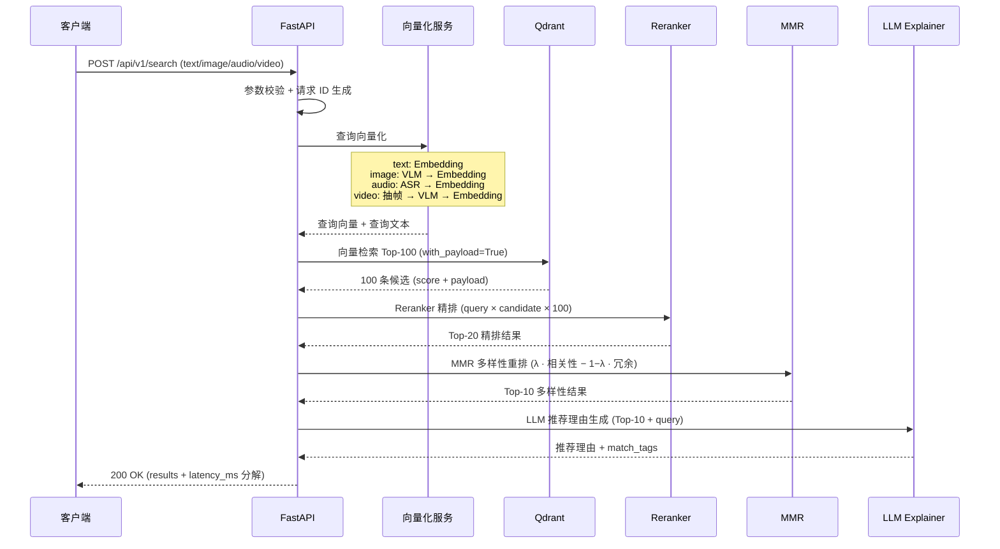

### 3.7 降级响应示例

当 VLM 超时导致图片查询降级为元数据搜索时：

```json
{
  "success": true,
  "data": {
    "query_id": "q-1723624253000",
    "mode": "query_driven",
    "query_type": "image",
    "query_text": "[VLM 降级] 基于文件名搜索: query_image.jpg",
    "results": [
      {
        "item_id": "c3d4e5f6789012345",
        "rank": 1,
        "score": 0.45,
        "relevance_score": 0.45,
        "description": "",
        "modality": "image",
        "tags": {},
        "reason": "[降级模式] VLM 超时，结果基于文件名匹配，可能不够精确",
        "match_tags": [],
        "file_path": "/photos/similar_name.jpg",
        "file_name": "similar_name.jpg",
        "thumbnail_url": null
      }
    ],
    "total_candidates": 5,
    "returned": 1,
    "latency_ms": 850,
    "stages": {
      "vectorize_ms": 100,
      "search_ms": 5,
      "rerank_ms": 0,
      "mmr_ms": 0,
      "llm_ms": 0,
      "total_ms": 850
    },
    "degraded": true,
    "degradation_notes": "VLM 推理超时（>30s），已降级为文件名匹配搜索。完整语义搜索将在 VLM 恢复后可用。"
  },
  "error": null,
  "request_id": "req-20260814-143100-c3d4",
  "latency_ms": 850
}
```

---

## 4. 推荐 API (Item-to-Item)

### 4.1 端点说明

```
POST /api/v1/recommend
```

基于已索引内容的 Item-to-Item 推荐端点。客户端只需传入 `item_id`，服务端从 Qdrant 取回该条目的已存储向量，执行双向量检索 + RRF 融合 + Reranker 精排 + MMR 重排 + LLM 推荐理由，返回相似内容推荐。

**核心设计原则：向量不离开服务端**。客户端不需要也不应该获取条目向量，只需提供 item_id，所有向量运算在服务端完成。

### 4.2 请求格式

```bash
curl -X POST http://127.0.0.1:8000/api/v1/recommend \
  -H "Content-Type: application/json" \
  -d '{
    "item_id": "a1b2c3d4e5f67890",
    "top_n": 10,
    "filters": {
      "modality": ["image"]
    },
    "mmr_lambda": 0.5,
    "explain": true
  }'
```

### 4.3 请求参数

| 参数 | 类型 | 必填 | 默认值 | 说明 |
|------|------|------|--------|------|
| `item_id` | string | 是 | — | 源条目 ID（Qdrant point ID = MD5 哈希） |
| `top_n` | int | 否 | `10` | 返回推荐数量（1-20） |
| `filters` | object | 否 | `null` | 标签过滤条件（同搜索 API） |
| `mmr_lambda` | float | 否 | `0.5` | MMR 多样性参数 |
| `explain` | bool | 否 | `true` | 是否生成推荐理由 |

### 4.4 响应格式

```json
{
  "success": true,
  "data": {
    "query_id": "r-1723624254000",
    "mode": "item_to_item",
    "source_item": {
      "item_id": "a1b2c3d4e5f67890",
      "description": "金色夕阳洒落在宁静的海滩上，海浪轻柔地拍打沙滩，远处天际线渐变为橙红色",
      "modality": "image",
      "tags": {
        "scene": ["beach", "sunset"],
        "emotion": ["peaceful", "serene"],
        "style": ["realistic"],
        "objects": ["ocean", "sky", "sand"]
      },
      "file_name": "sunset_beach_001.jpg"
    },
    "recommendations": [
      {
        "item_id": "b2c3d4e5f67890123",
        "rank": 1,
        "relevance_score": 0.92,
        "description": "热带海滩日落，棕榈树剪影映衬橙红色天空，海面波光粼粼",
        "modality": "image",
        "tags": {
          "scene": ["beach", "sunset"],
          "emotion": ["romantic", "peaceful"],
          "style": ["cinematic"]
        },
        "reason": "同为海滩日落场景，棕榈剪影增添热带风情，情感氛围一致",
        "match_tags": ["beach", "sunset", "peaceful"],
        "file_name": "tropical_sunset.jpg"
      },
      {
        "item_id": "d4e5f67890123456",
        "rank": 2,
        "relevance_score": 0.85,
        "description": "悬崖上的灯塔，夕阳西下，海浪拍打礁石溅起白色水花",
        "modality": "image",
        "tags": {
          "scene": ["coast", "sunset"],
          "emotion": ["majestic"],
          "style": ["realistic"],
          "objects": ["lighthouse", "rocks", "ocean"]
        },
        "reason": "同为海岸夕阳场景，灯塔元素增加视觉层次，色调相近",
        "match_tags": ["sunset", "ocean"],
        "file_name": "lighthouse_sunset.jpg"
      }
    ],
    "total_candidates": 100,
    "returned": 2,
    "latency_ms": 3850,
    "stages": {
      "retrieve_vector_ms": 2,
      "search_ms": 10,
      "rerank_ms": 1100,
      "mmr_ms": 3,
      "llm_ms": 2735,
      "total_ms": 3850
    },
    "degraded": false,
    "degradation_notes": null
  },
  "error": null,
  "request_id": "req-20260814-143150-d4e5",
  "latency_ms": 3850
}
```

### 4.5 搜索 API 与推荐 API 对比

```mermaid
flowchart LR
    subgraph SEARCH["POST /api/v1/search"]
        direction TB
        S1[客户端输入<br>文字/图片/音频/视频] --> S2[实时向量化<br>1-5s]
        S2 --> S3[Qdrant 检索 Top-100]
        S3 --> S4[Reranker 精排]
        S4 --> S5[MMR 重排]
        S5 --> S6[LLM 解释]
    end

    subgraph RECOMMEND["POST /api/v1/recommend"]
        direction TB
        R1[客户端传 item_id] --> R2[Qdrant 取回向量<br>~2ms]
        R2 --> R3[双向量检索 + RRF<br>排除自身]
        R3 --> R4[Reranker 精排]
        R4 --> R5[MMR 重排]
        R5 --> R6[LLM 解释]
    end

    style SEARCH fill:#0f1a1d,stroke:#06B6D4
    style RECOMMEND fill:#1a201a,stroke:#10B981
```

| 对比维度 | 搜索 API | 推荐 API |
|----------|----------|----------|
| **路径** | `POST /api/v1/search` | `POST /api/v1/recommend` |
| **输入** | 文字 / 图片 / 音频 / 视频 | item_id |
| **向量化** | 实时向量化（1-5s） | 无需向量化，Qdrant 取回（~2ms） |
| **向量来源** | 服务端实时计算 | Qdrant `with_vectors=True` |
| **向量是否离开服务端** | 否 | 否 |
| **候选召回** | 单路或多路检索 + RRF | 双向量检索（content + audio）+ RRF |
| **排除自身** | 不涉及 | 排除 source item_id |
| **重复计算** | 有（每次查询重新向量化） | 无（复用索引时已存储的向量） |
| **延时** | 3-8s（含向量化 1-5s） | 2-5s（省去向量化步骤） |
| **客户端复杂度** | 需上传文件或输入文本 | 仅传 item_id，极简 |
| **适用场景** | 用户主动搜索、跨模态查询 | "相似推荐"、"猜你喜欢" |
| **响应字段** | `results` | `recommendations` + `source_item` |

### 4.6 延时分解对比

| 步骤 | 搜索 API | 推荐 API | 差异 |
|------|----------|----------|------|
| 向量化 / 取回向量 | 1,200ms (VLM+Embedding) | 2ms (Qdrant retrieve) | **-1,198ms** |
| Qdrant 检索 | 5ms (单路) | 10ms (双向量并行) | +5ms |
| RRF 融合 | 0ms (单路无需融合) | <1ms | +1ms |
| Reranker 精排 | 2,300ms (100 对) | 1,100ms (20 对) | **-1,200ms** |
| MMR 重排 | 3ms | 3ms | — |
| LLM 推荐理由 | 1,726ms | 2,735ms | +1,009ms |
| **总计** | **~5,234ms** | **~3,850ms** | **-1,384ms** |

> 推荐 API 比搜索 API 快约 1-3s，主要省去向量化步骤。Reranker 阶段也更快，因为 Item-to-Item 推荐的候选池通常更精准（双向量 RRF 融合后质量更高），可减少精排对数。

---

## 5. 索引 API

### 5.1 单文件索引（同步）

```
POST /api/v1/index
```

同步索引单个文件。客户端上传文件，服务端执行 L1 → L2 → L3 渐进式索引后返回结果。适用于单文件快速索引场景。

#### 请求

```bash
curl -X POST http://127.0.0.1:8000/api/v1/index \
  -F "file=@/path/to/photo.jpg" \
  -F "index_level=L2" \
  -F "video_mode=auto" \
  -F "force_reindex=false"
```

| 参数 | 类型 | 必填 | 默认值 | 说明 |
|------|------|------|--------|------|
| `file` | File | 是 | — | 上传的媒体文件 |
| `index_level` | string | 否 | `L2` | 索引深度：`L1`（快速）/ `L2`（标准）/ `L3`（深度） |
| `video_mode` | string | 否 | `auto` | 视频处理模式：`visual` / `audio` / `both` / `auto` |
| `force_reindex` | bool | 否 | `false` | 是否强制重新索引（跳过 MD5 去重） |

#### 响应

```json
{
  "success": true,
  "data": {
    "item_id": "a1b2c3d4e5f67890",
    "file_hash": "a1b2c3d4e5f67890",
    "file_name": "photo.jpg",
    "modality": "image",
    "index_level": "L2",
    "description": "金色夕阳洒落在宁静的海滩上，海浪轻柔地拍打沙滩，远处天际线渐变为橙红色",
    "tags": {
      "scene": ["beach", "sunset"],
      "emotion": ["peaceful", "serene"],
      "style": ["realistic"],
      "objects": ["ocean", "sky", "sand"]
    },
    "vector_dimensions": {
      "content_vector": 2048
    },
    "latency_ms": 8500,
    "stages": {
      "l1_metadata_ms": 45,
      "l2_vlm_ms": 5200,
      "l2_embedding_ms": 1800,
      "l2_tags_ms": 1200,
      "l3_asr_ms": 0,
      "l3_clap_ms": 0,
      "total_ms": 8500
    },
    "degraded": false,
    "degradation_notes": null
  },
  "error": null,
  "request_id": "req-20260814-140000-a1b2",
  "latency_ms": 8500
}
```

#### 渐进式索引延时

| 索引层级 | 耗时 | 产出 | 可搜索性 |
|----------|------|------|----------|
| L1 快速 | <100ms | 文件名 + 元数据 + MD5 | 按文件名/元数据过滤可搜 |
| L2 标准 | 2-15s | VLM 描述 + 标签 + content_vector | 语义相似度检索可搜 |
| L3 深度 | 10-60s | ASR 转写 + CLAP audio_vector | 全模态检索可搜 |

### 5.2 批量索引（异步任务）

```
POST /api/v1/index/batch
```

批量索引指定目录下的所有媒体文件。立即返回 `task_id`，后台异步执行渐进式索引。适用于初始化系统或批量导入场景。

#### 请求

```bash
curl -X POST http://127.0.0.1:8000/api/v1/index/batch \
  -H "Content-Type: application/json" \
  -d '{
    "directory": "/Users/demo/photos",
    "recursive": true,
    "file_filter": {
      "extensions": ["jpg", "png", "mp4", "mp3"],
      "min_size_kb": 1,
      "max_size_mb": 2048
    },
    "video_mode": "auto",
    "index_level": "L2",
    "concurrency": {
      "images": 5,
      "audio": 3,
      "video": 1
    }
  }'
```

| 参数 | 类型 | 必填 | 默认值 | 说明 |
|------|------|------|--------|------|
| `directory` | string | 是 | — | 索引目录绝对路径 |
| `recursive` | bool | 否 | `true` | 是否递归子目录 |
| `file_filter` | object | 否 | — | 文件过滤条件 |
| `file_filter.extensions` | string[] | 否 | 全部支持格式 | 允许的文件扩展名 |
| `file_filter.min_size_kb` | int | 否 | `1` | 最小文件大小（KB） |
| `file_filter.max_size_mb` | int | 否 | `2048` | 最大文件大小（MB） |
| `video_mode` | string | 否 | `auto` | 视频处理模式 |
| `index_level` | string | 否 | `L2` | 索引深度 |
| `concurrency` | object | 否 | 见下表 | 各模态并发数 |
| `concurrency.images` | int | 否 | `5` | 图片并发索引数 |
| `concurrency.audio` | int | 否 | `3` | 音频并发索引数 |
| `concurrency.video` | int | 否 | `1` | 视频并发索引数（内存限制） |

#### 响应（立即返回）

```json
{
  "success": true,
  "data": {
    "task_id": "batch-20260814-140000-abc123",
    "status": "pending",
    "directory": "/Users/demo/photos",
    "total_files": 0,
    "message": "批量索引任务已创建，文件扫描中。请通过 GET /api/v1/index/status/batch-20260814-140000-abc123 查询进度。",
    "websocket_url": "ws://127.0.0.1:8000/ws/index/batch-20260814-140000-abc123"
  },
  "error": null,
  "request_id": "req-20260814-140000-a1b2",
  "latency_ms": 15
}
```

### 5.3 批量索引进度查询

```
GET /api/v1/index/status/{task_id}
```

查询批量索引任务的执行进度。

#### 请求

```bash
curl http://127.0.0.1:8000/api/v1/index/status/batch-20260814-140000-abc123
```

#### 响应（进行中）

```json
{
  "success": true,
  "data": {
    "task_id": "batch-20260814-140000-abc123",
    "status": "running",
    "directory": "/Users/demo/photos",
    "started_at": "2026-08-14T14:00:00Z",
    "elapsed_sec": 125,
    "progress": {
      "total_files": 342,
      "scanned_files": 342,
      "indexed_files": 187,
      "failed_files": 3,
      "skipped_files": 12,
      "pending_files": 140,
      "progress_percent": 54.7
    },
    "current_file": {
      "file_name": "vacation_2025_187.jpg",
      "modality": "image",
      "index_level": "L2",
      "stage": "vlm_analysis",
      "elapsed_ms": 3200
    },
    "by_modality": {
      "image": {"total": 280, "done": 160, "failed": 2},
      "video": {"total": 42, "done": 15, "failed": 1},
      "audio": {"total": 20, "done": 12, "failed": 0}
    },
    "by_index_level": {
      "L1": {"done": 187, "avg_ms": 35},
      "L2": {"done": 180, "avg_ms": 6200},
      "L3": {"done": 45, "avg_ms": 28000}
    },
    "errors": [
      {
        "file_name": "corrupted.jpg",
        "error": "INPUT_FILE_CORRUPT: 文件损坏无法解析",
        "timestamp": "2026-08-14T14:01:23Z"
      },
      {
        "file_name": "huge_video.mov",
        "error": "INPUT_FILE_TOO_LARGE: 文件超过 2GB 限制",
        "timestamp": "2026-08-14T14:02:45Z"
      }
    ],
    "estimated_remaining_sec": 210,
    "websocket_url": "ws://127.0.0.1:8000/ws/index/batch-20260814-140000-abc123"
  },
  "error": null,
  "request_id": "req-20260814-140210-b3c4",
  "latency_ms": 12
}
```

#### 响应（已完成）

```json
{
  "success": true,
  "data": {
    "task_id": "batch-20260814-140000-abc123",
    "status": "completed",
    "directory": "/Users/demo/photos",
    "started_at": "2026-08-14T14:00:00Z",
    "completed_at": "2026-08-14T14:05:30Z",
    "elapsed_sec": 330,
    "progress": {
      "total_files": 342,
      "scanned_files": 342,
      "indexed_files": 327,
      "failed_files": 3,
      "skipped_files": 12,
      "pending_files": 0,
      "progress_percent": 100.0
    },
    "summary": {
      "total_indexed": 327,
      "total_failed": 3,
      "total_skipped": 12,
      "total_vectors_created": 327,
      "avg_index_time_ms": 5200,
      "total_disk_cache_mb": 145.6
    }
  },
  "error": null,
  "request_id": "req-20260814-140530-c5d6",
  "latency_ms": 8
}
```

#### 任务状态流转

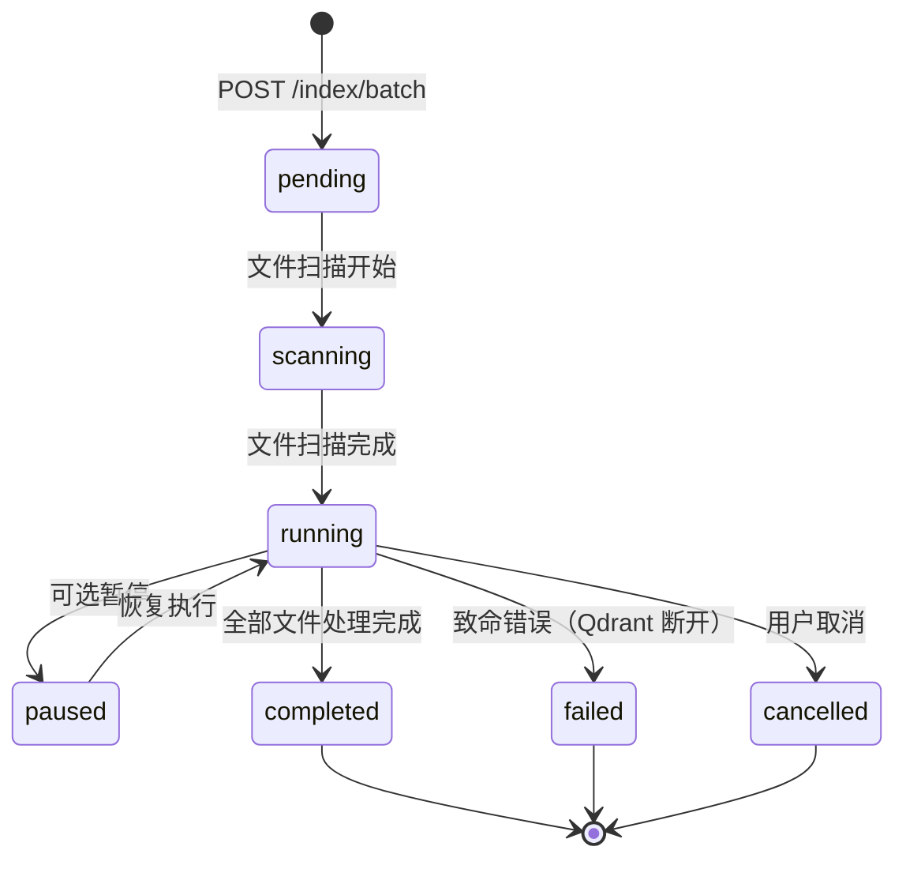

### 5.4 批量索引流程

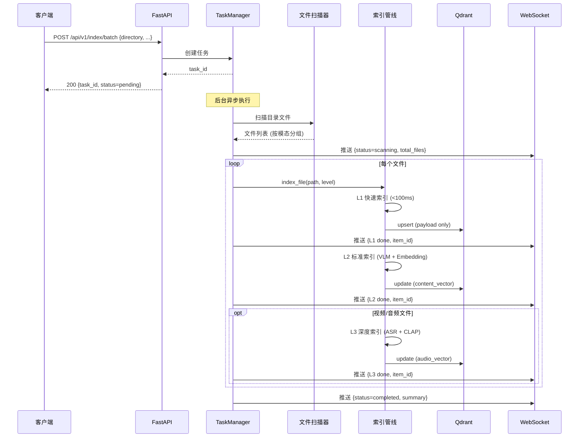

---

## 6. 条目管理 API

### 6.1 获取条目元数据

```
GET /api/v1/items/{id}
```

根据 item_id 获取条目的完整元数据，包括描述、标签、文件信息、索引层级等。不返回向量数据。

#### 请求

```bash
curl http://127.0.0.1:8000/api/v1/items/a1b2c3d4e5f67890
```

#### 响应

```json
{
  "success": true,
  "data": {
    "item_id": "a1b2c3d4e5f67890",
    "file_hash": "a1b2c3d4e5f67890",
    "file_path": "/Users/demo/photos/sunset_beach_001.jpg",
    "file_name": "sunset_beach_001.jpg",
    "file_extension": "jpg",
    "file_size": 2456789,
    "modality": "image",
    "index_level": "L3",
    "description": "金色夕阳洒落在宁静的海滩上，海浪轻柔地拍打沙滩，远处天际线渐变为橙红色",
    "tags": {
      "scene": ["beach", "sunset"],
      "emotion": ["peaceful", "serene"],
      "style": ["realistic"],
      "category": ["landscape"],
      "objects": ["ocean", "sky", "sand", "sun"],
      "audio": []
    },
    "color_palette": ["orange", "red", "blue", "golden"],
    "metadata": {
      "width": 1920,
      "height": 1080,
      "resolution": "1920x1080",
      "duration": null,
      "audio_type": null,
      "video_mode": null
    },
    "transcript": null,
    "summary": null,
    "vectors_info": {
      "content_vector": {"dimension": 2048, "present": true},
      "audio_vector": {"dimension": 512, "present": false},
      "thumbnail_vector": {"dimension": 2048, "present": true}
    },
    "created_at": "2026-08-14T10:30:00Z",
    "updated_at": "2026-08-14T10:30:15Z"
  },
  "error": null,
  "request_id": "req-20260814-150000-e5f6",
  "latency_ms": 18
}
```

### 6.2 删除条目

```
DELETE /api/v1/items/{id}
```

从 Qdrant 中删除指定条目。同时清理关联的磁盘缓存（VLM 描述、ASR 转写等基于 MD5 的缓存）。

#### 请求

```bash
curl -X DELETE http://127.0.0.1:8000/api/v1/items/a1b2c3d4e5f67890
```

#### 响应

```json
{
  "success": true,
  "data": {
    "item_id": "a1b2c3d4e5f67890",
    "deleted": true,
    "cache_cleaned": true,
    "cache_entries_removed": 4,
    "cache_keys": [
      "vlm_desc:a1b2c3d4e5f67890",
      "vlm_tags:a1b2c3d4e5f67890",
      "embedding:a1b2c3d4e5f67890",
      "thumbnail_vec:a1b2c3d4e5f67890"
    ]
  },
  "error": null,
  "request_id": "req-20260814-150100-f6a7",
  "latency_ms": 35
}
```

#### 删除流程

```mermaid
flowchart TB
    REQ[DELETE /api/v1/items/{id}] --> CHECK{item_id 存在?}
    CHECK -->|否| ERR[404 ITEM_NOT_FOUND]
    CHECK -->|是| QDRANT[Qdrant delete point]

    QDRANT --> CACHE[清理磁盘缓存]
    CACHE --> C1[删除 VLM 描述缓存]
    CACHE --> C2[删除 VLM 标签缓存]
    CACHE --> C3[删除 Embedding 缓存]
    CACHE --> C4[删除 ASR 转写缓存]
    CACHE --> C5[删除 CLAP 向量缓存]
    CACHE --> C6[删除缩略图向量缓存]

    C1 --> DONE[返回删除结果]
    C2 --> DONE
    C3 --> DONE
    C4 --> DONE
    C5 --> DONE
    C6 --> DONE

    style ERR fill:#2a1010,stroke:#EF4444
    style DONE fill:#1a201a,stroke:#10B981
```

---

## 7. 系统状态 API

### 7.1 端点说明

```
GET /api/v1/stats
```

返回系统当前状态的完整快照，包括 Qdrant 集合信息、模型加载状态、内存使用、缓存统计和性能指标。供前端仪表盘或运维监控使用。

### 7.2 请求

```bash
curl http://127.0.0.1:8000/api/v1/stats
```

### 7.3 完整响应格式

```json
{
  "success": true,
  "data": {
    "system": {
      "hostname": "MacBook-Pro-M5",
      "platform": "macOS 15.0",
      "chip": "Apple M5",
      "total_memory_gb": 24.0,
      "available_memory_gb": 8.2,
      "used_memory_gb": 15.8,
      "memory_pressure": "moderate",
      "cpu_percent": 12.5,
      "gpu_backend": "Metal Performance Shaders (MPS)",
      "uptime_sec": 86400
    },
    "qdrant": {
      "url": "http://localhost:6333",
      "status": "connected",
      "collection": "media_items",
      "total_points": 1247,
      "indexed_points": 1180,
      "pending_points": 67,
      "vectors": {
        "content_vector": {
          "dimension": 2048,
          "distance": "Cosine",
          "indexed": 1180,
          "quantization": "scalar int8"
        },
        "audio_vector": {
          "dimension": 512,
          "distance": "Cosine",
          "indexed": 342,
          "quantization": "scalar int8"
        },
        "thumbnail_vector": {
          "dimension": 2048,
          "distance": "Cosine",
          "indexed": 890,
          "quantization": "scalar int8"
        }
      },
      "hnsw_config": {
        "m": 16,
        "ef_construct": 64,
        "ef_search": 128
      },
      "disk_usage_mb": 156.8,
      "last_optimization": "2026-08-14T03:00:00Z"
    },
    "models": {
      "qwen3_vl_8b": {
        "name": "mlx-community/Qwen3-VL-8B-Instruct-4bit",
        "type": "VLM",
        "memory_level": "L0",
        "status": "loaded",
        "memory_gb": 5.4,
        "load_time_sec": 8.2
      },
      "qwen3_embedding_2b": {
        "name": "Qwen3-Embedding-2B",
        "type": "Embedding",
        "memory_level": "L0",
        "status": "loaded",
        "memory_gb": 2.0,
        "load_time_sec": 3.1
      },
      "qwen3_vl_reranker_2b": {
        "name": "Qwen3-VL-Reranker-2B",
        "type": "Reranker",
        "memory_level": "L1",
        "status": "loaded",
        "memory_gb": 2.0,
        "load_time_sec": 2.8,
        "ttl_sec": 300,
        "last_access": "2026-08-14T14:25:00Z"
      },
      "bonsai_8b_mlx": {
        "name": "mlx-community/bonsai-8b-mlx",
        "type": "LLM",
        "memory_level": "L1",
        "status": "loaded",
        "memory_gb": 1.3,
        "load_time_sec": 1.5,
        "ttl_sec": 300,
        "last_access": "2026-08-14T14:25:00Z"
      },
      "whisper_large_v3": {
        "name": "openai/whisper-large-v3",
        "type": "ASR",
        "memory_level": "L2",
        "status": "unloaded",
        "memory_gb": 0.7,
        "load_time_sec": 4.5
      },
      "clap_htsat_unfused": {
        "name": "laion/clap-htsat-unfused",
        "type": "CLAP",
        "memory_level": "L2",
        "status": "unloaded",
        "memory_gb": 0.6,
        "load_time_sec": 2.0
      }
    },
    "memory": {
      "total_limit_gb": 20.0,
      "current_usage_gb": 10.7,
      "l0_resident_gb": 7.4,
      "l1_hot_cache_gb": 3.3,
      "l2_cold_loaded_gb": 0.0,
      "available_gb": 9.3,
      "breakdown": {
        "qwen3_vl_8b": 5.4,
        "qwen3_embedding_2b": 2.0,
        "qwen3_vl_reranker_2b": 2.0,
        "bonsai_8b_mlx": 1.3,
        "system_overhead": 2.0
      },
      "mps_allocated_gb": 8.5,
      "mps_peak_gb": 12.3
    },
    "cache": {
      "l1_memory": {
        "type": "LRU",
        "max_size": 1000,
        "current_size": 342,
        "hit_rate": 0.78,
        "evictions": 15,
        "ttl_sec": 300
      },
      "l2_disk": {
        "type": "diskcache",
        "path": "./data/disk_cache",
        "size_mb": 145.6,
        "max_size_mb": 2048,
        "entries": 1247,
        "hit_rate": 0.92,
        "breakdown": {
          "vlm_descriptions": 890,
          "vlm_tags": 890,
          "embeddings": 1180,
          "asr_transcripts": 156,
          "clap_vectors": 342,
          "thumbnails": 890,
          "video_frames": 42
        }
      }
    },
    "performance": {
      "avg_search_latency_ms": 5200,
      "avg_recommend_latency_ms": 3850,
      "avg_index_latency_ms": 6800,
      "p50_search_ms": 4800,
      "p95_search_ms": 7500,
      "p99_search_ms": 8200,
      "total_searches": 1542,
      "total_recommendations": 893,
      "total_indexes": 1247,
      "total_errors": 23,
      "error_rate": 0.0075,
      "requests_today": 287
    },
    "index_tasks": {
      "active_tasks": 0,
      "queued_tasks": 0,
      "completed_today": 3,
      "failed_today": 0
    }
  },
  "error": null,
  "request_id": "req-20260814-150200-a7b8",
  "latency_ms": 32
}
```

### 7.4 状态分类说明

| 分类 | 子项 | 用途 |
|------|------|------|
| `system` | 主机/内存/CPU/GPU | 系统资源监控 |
| `qdrant` | 集合/向量/索引配置 | 向量数据库健康状态 |
| `models` | 6 个模型加载状态 | 模型内存管理可视化 |
| `memory` | L0/L1/L2 分层占用 | 内存压力预警 |
| `cache` | L1 内存 + L2 磁盘 | 缓存命中率监控 |
| `performance` | 延时/吞吐/错误率 | 性能趋势分析 |
| `index_tasks` | 批量任务状态 | 索引任务监控 |

### 7.5 清除缓存

```
DELETE /api/v1/cache
```

清除指定层级的缓存。支持选择性清除 L1 内存缓存和/或 L2 磁盘缓存。

#### 请求

```bash
curl -X DELETE "http://127.0.0.1:8000/api/v1/cache?level=l1" \
  -H "Content-Type: application/json" \
  -d '{"pattern": "vlm_desc:*"}'
```

| 参数 | 类型 | 必填 | 默认值 | 说明 |
|------|------|------|--------|------|
| `level` | string (query) | 否 | `all` | 清除层级：`l1`（内存）/ `l2`（磁盘）/ `all`（全部） |
| `pattern` | string (body) | 否 | `null` | 清除特定模式的缓存键（支持通配符 `*`） |

#### 响应

```json
{
  "success": true,
  "data": {
    "cleared": {
      "l1_memory": {
        "cleared": true,
        "entries_removed": 342,
        "freed_mb": 0
      },
      "l2_disk": {
        "cleared": false,
        "entries_removed": 0,
        "freed_mb": 0
      }
    },
    "message": "L1 内存缓存已清除（342 条），L2 磁盘缓存保留。"
  },
  "error": null,
  "request_id": "req-20260814-150300-b8c9",
  "latency_ms": 45
}
```

---

## 8. 反馈 API

### 8.1 端点说明

```
POST /api/v1/feedback
```

提交用户对推荐结果的反馈。反馈数据持久化到 SQLite，用于后续推荐质量分析和权重微调。此端点为轻量级写入操作，不涉及模型推理。

### 8.2 请求格式

```bash
curl -X POST http://127.0.0.1:8000/api/v1/feedback \
  -H "Content-Type: application/json" \
  -d '{
    "query_id": "q-1723624252000",
    "item_id": "a1b2c3d4e5f67890",
    "action": "click",
    "position": 1,
    "dwell_time_sec": 15,
    "score": 0.95
  }'
```

### 8.3 请求参数

| 参数 | 类型 | 必填 | 默认值 | 说明 |
|------|------|------|--------|------|
| `query_id` | string | 是 | — | 推荐请求的唯一 ID（来自搜索/推荐响应） |
| `item_id` | string | 是 | — | 被反馈的条目 ID |
| `action` | string | 是 | — | 反馈动作：`click` / `skip` / `like` / `dislike` / `save` |
| `position` | int | 否 | `null` | 在推荐列表中的位置（从 1 开始） |
| `dwell_time_sec` | float | 否 | `null` | 停留时间（秒，仅 `click` 有意义） |
| `score` | float | 否 | `null` | 系统给出的推荐分数（来自响应） |

### 8.4 反馈动作说明

| action | 含义 | 权重影响 | 典型场景 |
|--------|------|----------|----------|
| `click` | 用户点击查看 | 正反馈，强化该类推荐 | 用户对推荐结果感兴趣，点击查看详情 |
| `skip` | 用户跳过未看 | 负反馈（弱），降低类似推荐 | 推荐结果展示后用户未交互直接划过 |
| `like` | 用户收藏/点赞 | 强正反馈，显著强化 | 用户明确表达喜欢 |
| `dislike` | 用户明确不喜欢 | 强负反馈，记录为难例 | 用户主动点击"不感兴趣" |
| `save` | 用户保存/下载 | 强正反馈，强化并提升优先级 | 用户将内容保存到本地或收藏夹 |

### 8.5 响应格式

```json
{
  "success": true,
  "data": {
    "feedback_id": 4521,
    "recorded": true,
    "query_id": "q-1723624252000",
    "item_id": "a1b2c3d4e5f67890",
    "action": "click",
    "timestamp": "2026-08-14T14:30:52Z"
  },
  "error": null,
  "request_id": "req-20260814-143052-c9d0",
  "latency_ms": 8
}
```

### 8.6 反馈闭环

```mermaid
flowchart LR
    subgraph COLLECT["反馈收集 (POST /api/v1/feedback)"]
        R1[推荐结果展示] --> R2[用户行为]
        R2 -->|点击| R3a[click]
        R2 -->|跳过| R3b[skip]
        R2 -->|收藏| R3c[like]
        R2 -->|不喜欢| R3d[dislike]
        R2 -->|保存| R3e[save]
        R3a --> DB[(feedback.db<br>SQLite)]
        R3b --> DB
        R3c --> DB
        R3d --> DB
        R3e --> DB
    end

    subgraph ANALYZE["反馈分析 (每日 cron)"]
        DB --> A1[CTR 按位置分析]
        DB --> A2[跳过率高的查询]
        DB --> A3[难例挖掘<br>dislike 但高分推荐]
    end

    subgraph OPTIMIZE["优化执行"]
        A1 --> O1[调整 MMR λ]
        A2 --> O2[调整 Reranker 权重]
        A3 --> O3[难例入库]
    end

    OPTIMIZE --> R1

    style COLLECT fill:#0f1a1d,stroke:#06B6D4
    style ANALYZE fill:#1a201a,stroke:#10B981
    style OPTIMIZE fill:#1a1520,stroke:#8B5CF6
```

---

## 9. 中间件设计

### 9.1 中间件架构

```mermaid
flowchart TB
    REQ[HTTP 请求] --> M1[CORS 中间件<br>跨域处理]
    M1 --> M2[请求日志中间件<br>request_id + 耗时]
    M2 --> M3[限流中间件<br>并发控制]
    M3 --> M4[异常处理中间件<br>统一错误响应]
    M4 --> ROUTER[FastAPI 路由分发]
    ROUTER --> ENDPOINT[端点处理函数]
    ENDPOINT --> M4
    M4 --> M3
    M3 --> M2
    M2 --> RESP[HTTP 响应]

    style M1 fill:#1a1a2e,stroke:#A78BFA
    style M2 fill:#0f1a1d,stroke:#06B6D4
    style M3 fill:#2a2010,stroke:#F59E0B
    style M4 fill:#2a1010,stroke:#EF4444
```

### 9.2 完整中间件实现

```python
import time
import uuid
import json
import logging
import traceback
from collections import defaultdict
from datetime import datetime, timezone
from typing import Optional, Callable

from fastapi import Request, Response, FastAPI
from fastapi.responses import JSONResponse
from fastapi.middleware.cors import CORSMiddleware
from starlette.middleware.base import BaseHTTPMiddleware
from starlette.types import ASGIApp

# ─── 日志配置 ──────────────────────────────────────────────────

logger = logging.getLogger("api")
logger.setLevel(logging.DEBUG)

# 控制台 handler
console_handler = logging.StreamHandler()
console_handler.setLevel(logging.INFO)
console_handler.setFormatter(
    logging.Formatter(
        "%(asctime)s | %(levelname)-8s | %(name)s | %(message)s",
        datefmt="%Y-%m-%d %H:%M:%S",
    )
)
logger.addHandler(console_handler)

# 文件 handler（按天轮转）
from logging.handlers import TimedRotatingFileHandler

file_handler = TimedRotatingFileHandler(
    "./logs/api.log",
    when="midnight",
    interval=1,
    backupCount=7,
    encoding="utf-8",
)
file_handler.setLevel(logging.DEBUG)
file_handler.setFormatter(
    logging.Formatter(
        "%(asctime)s | %(levelname)-8s | %(name)s | %(message)s",
        datefmt="%Y-%m-%d %H:%M:%S",
    )
)
logger.addHandler(file_handler)


# ─── 1. 请求日志中间件 ────────────────────────────────────────

class RequestLoggingMiddleware(BaseHTTPMiddleware):
    """
    请求日志中间件

    功能：
    - 为每个请求生成唯一 request_id
    - 记录请求方法、路径、客户端 IP
    - 记录响应状态码、耗时
    - 将 request_id 注入响应头 X-Request-ID
    """

    async def dispatch(self, request: Request, call_next: Callable):
        # 生成 request_id
        request_id = f"req-{datetime.now().strftime('%Y%m%d-%H%M%S')}-{uuid.uuid4().hex[:8]}"
        request.state.request_id = request_id

        # 记录请求开始
        start_time = time.time()
        client_ip = request.client.host if request.client else "unknown"
        logger.info(
            f"[{request_id}] → {request.method} {request.url.path} "
            f"from {client_ip}"
        )

        # 调用下游
        try:
            response = await call_next(request)
        except Exception as e:
            latency_ms = int((time.time() - start_time) * 1000)
            logger.error(
                f"[{request_id}] ✗ {request.method} {request.url.path} "
                f"| 500 | {latency_ms}ms | {type(e).__name__}: {e}"
            )
            raise

        # 记录响应
        latency_ms = int((time.time() - start_time) * 1000)
        logger.info(
            f"[{request_id}] ← {request.method} {request.url.path} "
            f"| {response.status_code} | {latency_ms}ms"
        )

        # 注入 request_id 到响应头
        response.headers["X-Request-ID"] = request_id
        response.headers["X-Response-Time"] = f"{latency_ms}ms"

        return response


# ─── 2. 限流中间件 ────────────────────────────────────────────

class RateLimitMiddleware(BaseHTTPMiddleware):
    """
    限流中间件

    策略：
    - 基于端点路径的并发限制（而非 QPS 限流）
    - 索引类端点：最多 1 个并发（模型串行推理）
    - 搜索/推荐端点：最多 2 个并发
    - 其他端点：无限制
    - 超限时返回 429 + Retry-After 头
    """

    # 端点并发限制配置
    CONCURRENCY_LIMITS = {
        "/api/v1/index": 1,           # 单文件索引：1 个并发
        "/api/v1/index/batch": 1,     # 批量索引：1 个并发
        "/api/v1/search": 2,          # 搜索：2 个并发
        "/api/v1/recommend": 2,       # 推荐：2 个并发
    }

    # 匹配前缀（动态路径用前缀匹配）
    PREFIX_MATCHES = {
        "/api/v1/index/status": None,  # 进度查询不限流
        "/api/v1/items": None,         # 条目管理不限流
    }

    def __init__(self, app: ASGIApp):
        super().__init__(app)
        self._active_counts: dict[str, int] = defaultdict(int)

    def _get_limit(self, path: str) -> Optional[int]:
        """获取路径对应的并发限制"""
        # 先检查前缀匹配（不限流的路径）
        for prefix, limit in self.PREFIX_MATCHES.items():
            if path.startswith(prefix):
                return limit  # None 表示不限流

        # 精确匹配
        for route, limit in self.CONCURRENCY_LIMITS.items():
            if path == route:
                return limit

        return None  # 默认不限流

    async def dispatch(self, request: Request, call_next: Callable):
        path = request.url.path
        limit = self._get_limit(path)

        if limit is None:
            # 不限流
            return await call_next(request)

        # 检查并发数
        current = self._active_counts[path]
        if current >= limit:
            logger.warning(
                f"[{request.state.request_id}] 限流触发: "
                f"{path} 并发 {current}/{limit}"
            )
            return JSONResponse(
                status_code=429,
                content={
                    "success": False,
                    "data": None,
                    "error": {
                        "code": "RATE_LIMIT_EXCEEDED",
                        "message": f"端点 {path} 并发数已达上限 ({limit})，请稍后重试",
                        "details": {
                            "endpoint": path,
                            "current_concurrent": current,
                            "max_concurrent": limit,
                        },
                        "retryable": True,
                    },
                    "request_id": getattr(request.state, "request_id", "unknown"),
                    "latency_ms": 0,
                },
                headers={
                    "Retry-After": "5",
                    "X-RateLimit-Limit": str(limit),
                    "X-RateLimit-Remaining": "0",
                },
            )

        # 增加计数
        self._active_counts[path] += 1
        try:
            response = await call_next(request)
            return response
        finally:
            # 减少计数
            self._active_counts[path] -= 1
            if self._active_counts[path] <= 0:
                del self._active_counts[path]


# ─── 3. 异常处理中间件 ────────────────────────────────────────

class ExceptionHandlerMiddleware(BaseHTTPMiddleware):
    """
    全局异常处理中间件

    策略：
    - 捕获所有未处理异常
    - 按错误分级返回统一格式
    - 记录完整堆栈到日志
    - 防止内部错误信息泄露给客户端
    """

    async def dispatch(self, request: Request, call_next: Callable):
        request_id = getattr(request.state, "request_id", "unknown")

        try:
            response = await call_next(request)
            return response

        except Exception as e:
            # 记录完整堆栈
            logger.error(
                f"[{request_id}] 未处理异常: {type(e).__name__}: {e}\n"
                f"{traceback.format_exc()}"
            )

            # 根据异常类型返回不同状态码
            error_info = self._classify_error(e)

            return JSONResponse(
                status_code=error_info["status_code"],
                content={
                    "success": False,
                    "data": None,
                    "error": {
                        "code": error_info["code"],
                        "message": error_info["message"],
                        "details": error_info.get("details"),
                        "retryable": error_info["retryable"],
                    },
                    "request_id": request_id,
                    "latency_ms": 0,
                },
            )

    def _classify_error(self, e: Exception) -> dict:
        """异常分类"""
        error_str = str(e).lower()

        # Qdrant 连接错误
        if "connection" in error_str and "qdrant" in error_str:
            return {
                "status_code": 503,
                "code": "QDRANT_CONNECTION_FAILED",
                "message": "向量数据库连接失败，请检查 Qdrant 服务是否运行",
                "retryable": False,
            }

        # 模型加载错误
        if "memory" in error_str or "cuda" in error_str or "mps" in error_str:
            return {
                "status_code": 503,
                "code": "MODEL_LOAD_FAILED",
                "message": f"模型加载失败：{e}",
                "retryable": False,
            }

        # 文件格式错误
        if "format" in error_str or "extension" in error_str:
            return {
                "status_code": 400,
                "code": "INPUT_FILE_NOT_SUPPORTED",
                "message": f"文件格式不支持：{e}",
                "retryable": False,
            }

        # item_id 不存在
        if "not found" in error_str or "not exist" in error_str:
            return {
                "status_code": 404,
                "code": "ITEM_NOT_FOUND",
                "message": f"资源不存在：{e}",
                "retryable": False,
            }

        # 默认内部错误
        return {
            "status_code": 500,
            "code": "INTERNAL_ERROR",
            "message": "服务内部错误，请稍后重试",
            "details": {"exception_type": type(e).__name__},
            "retryable": False,
        }


# ─── 4. CORS 配置 ─────────────────────────────────────────────

def setup_cors(app: FastAPI):
    """
    配置 CORS 中间件

    本地部署场景：允许所有来源访问
    如需限制，可修改 allow_origins
    """
    app.add_middleware(
        CORSMiddleware,
        allow_origins=["*"],           # 本地部署允许所有来源
        allow_credentials=True,
        allow_methods=["*"],           # 允许所有 HTTP 方法
        allow_headers=["*"],           # 允许所有请求头
        expose_headers=[
            "X-Request-ID",
            "X-Response-Time",
            "Retry-After",
            "X-RateLimit-Limit",
            "X-RateLimit-Remaining",
        ],
    )


# ─── 中间件注册函数 ────────────────────────────────────────────

def setup_middleware(app: FastAPI):
    """
    注册所有中间件

    注册顺序（从外到内）：
    1. CORS         — 最外层，处理跨域预检
    2. RequestLogging — 生成 request_id，记录请求/响应
    3. RateLimit     — 并发限流
    4. ExceptionHandler — 最内层，捕获所有异常

    注意：FastAPI 中间件执行顺序是后注册先执行（洋葱模型）
    """
    # 1. CORS（最外层）
    setup_cors(app)

    # 2. 请求日志
    app.add_middleware(RequestLoggingMiddleware)

    # 3. 限流
    app.add_middleware(RateLimitMiddleware)

    # 4. 异常处理（最内层，紧贴路由）
    app.add_middleware(ExceptionHandlerMiddleware)
```

### 9.3 中间件执行顺序

```mermaid
flowchart LR
    REQ[HTTP 请求] --> CORS
    CORS --> LOG[RequestLogging]
    LOG --> RL[RateLimit]
    RL --> EH[ExceptionHandler]
    EH --> ROUTE[路由处理]
    ROUTE --> EH
    EH --> RL
    RL --> LOG
    LOG --> CORS
    CORS --> RESP[HTTP 响应]

    style CORS fill:#1a1a2e,stroke:#A78BFA
    style LOG fill:#0f1a1d,stroke:#06B6D4
    style RL fill:#2a2010,stroke:#F59E0B
    style EH fill:#2a1010,stroke:#EF4444
```

> **中间件注册顺序说明**：FastAPI/Starlette 中间件采用洋葱模型，后注册的中间件位于洋葱内层。请求从外到内依次穿过 CORS → RequestLogging → RateLimit → ExceptionHandler → 路由处理，响应则从内到外原路返回。`ExceptionHandler` 注册在最内层，确保它能捕获路由处理中抛出的所有异常。

---

## 10. FastAPI 服务实现

### 10.1 项目结构

```
multimodal-recommender/
├── server.py                    # FastAPI 主服务入口
├── api/
│   ├── __init__.py
│   ├── routes/
│   │   ├── __init__.py
│   │   ├── index.py             # 索引相关路由
│   │   ├── search.py            # 搜索路由
│   │   ├── recommend.py         # 推荐路由
│   │   ├── items.py             # 条目管理路由
│   │   ├── system.py            # 系统状态/缓存路由
│   │   └── feedback.py          # 反馈路由
│   ├── middleware.py            # 中间件实现
│   ├── schemas.py               # Pydantic 请求/响应模型
│   └── deps.py                  # 依赖注入
├── core/
│   ├── __init__.py
│   ├── engine.py                # RecommendationEngine 实例
│   ├── indexer.py               # 统一索引器
│   ├── qdrant_client.py         # Qdrant 客户端封装
│   └── task_manager.py          # 批量任务管理器
└── config.py                    # 配置
```

### 10.2 Pydantic 请求/响应模型

```python
# api/schemas.py

from pydantic import BaseModel, Field, validator
from typing import Optional, Any
from enum import Enum


# ─── 通用模型 ──────────────────────────────────────────────────

class QueryType(str, Enum):
    TEXT = "text"
    IMAGE = "image"
    AUDIO = "audio"
    VIDEO = "video"


class ActionType(str, Enum):
    CLICK = "click"
    SKIP = "skip"
    LIKE = "like"
    DISLIKE = "dislike"
    SAVE = "save"


class ErrorResponse(BaseModel):
    """统一错误响应"""
    success: bool = False
    data: Optional[Any] = None
    error: Optional[dict] = None
    request_id: str
    latency_ms: int


class LatencyStages(BaseModel):
    """延时分解"""
    vectorize_ms: Optional[int] = None
    retrieve_vector_ms: Optional[int] = None
    search_ms: Optional[int] = None
    rerank_ms: Optional[int] = None
    mmr_ms: Optional[int] = None
    llm_ms: Optional[int] = None
    total_ms: int


# ─── 搜索 API ──────────────────────────────────────────────────

class SearchRequestJSON(BaseModel):
    """JSON 格式搜索请求（文本查询）"""
    query_type: QueryType = Field(..., description="查询类型")
    query: str = Field(..., min_length=1, max_length=2000, description="文本查询内容")
    top_n: int = Field(10, ge=1, le=20, description="返回结果数量")
    mmr_lambda: float = Field(0.5, ge=0.0, le=1.0, description="MMR 多样性参数")
    filters: Optional[dict] = Field(None, description="标签过滤条件")
    explain: bool = Field(True, description="是否生成推荐理由")


class SearchResultItem(BaseModel):
    """单条搜索结果"""
    item_id: str
    rank: int
    score: float
    relevance_score: float
    description: str
    modality: str
    tags: dict
    reason: Optional[str] = None
    match_tags: list[str] = []
    file_path: Optional[str] = None
    file_name: Optional[str] = None


class SearchResponseData(BaseModel):
    """搜索响应数据"""
    query_id: str
    mode: str = "query_driven"
    query_type: str
    query_text: str
    results: list[SearchResultItem]
    total_candidates: int
    returned: int
    latency_ms: int
    stages: LatencyStages
    degraded: bool = False
    degradation_notes: Optional[str] = None


# ─── 推荐 API ──────────────────────────────────────────────────

class RecommendRequest(BaseModel):
    """Item-to-Item 推荐请求"""
    item_id: str = Field(..., description="源条目 ID")
    top_n: int = Field(10, ge=1, le=20, description="返回推荐数量")
    filters: Optional[dict] = Field(None, description="标签过滤条件")
    mmr_lambda: float = Field(0.5, ge=0.0, le=1.0, description="MMR 多样性参数")
    explain: bool = Field(True, description="是否生成推荐理由")


class SourceItem(BaseModel):
    """源条目信息"""
    item_id: str
    description: str
    modality: str
    tags: dict
    file_name: Optional[str] = None


class RecommendationItem(BaseModel):
    """单条推荐结果"""
    item_id: str
    rank: int
    relevance_score: float
    description: str
    modality: str
    tags: dict
    reason: Optional[str] = None
    match_tags: list[str] = []
    file_name: Optional[str] = None


class RecommendResponseData(BaseModel):
    """推荐响应数据"""
    query_id: str
    mode: str = "item_to_item"
    source_item: SourceItem
    recommendations: list[RecommendationItem]
    total_candidates: int
    returned: int
    latency_ms: int
    stages: LatencyStages
    degraded: bool = False
    degradation_notes: Optional[str] = None


# ─── 索引 API ──────────────────────────────────────────────────

class BatchIndexRequest(BaseModel):
    """批量索引请求"""
    directory: str = Field(..., description="索引目录绝对路径")
    recursive: bool = Field(True, description="是否递归子目录")
    file_filter: Optional[dict] = Field(None, description="文件过滤条件")
    video_mode: str = Field("auto", description="视频处理模式")
    index_level: str = Field("L2", description="索引深度")
    concurrency: Optional[dict] = Field(None, description="各模态并发数")


class IndexResponseData(BaseModel):
    """单文件索引响应数据"""
    item_id: str
    file_hash: str
    file_name: str
    modality: str
    index_level: str
    description: str
    tags: dict
    vector_dimensions: dict
    latency_ms: int
    stages: dict
    degraded: bool = False
    degradation_notes: Optional[str] = None


class BatchIndexResponseData(BaseModel):
    """批量索引响应数据"""
    task_id: str
    status: str
    directory: str
    total_files: int
    message: str
    websocket_url: str


# ─── 条目管理 API ──────────────────────────────────────────────

class ItemMetadata(BaseModel):
    """条目元数据"""
    item_id: str
    file_hash: str
    file_path: str
    file_name: str
    file_extension: str
    file_size: int
    modality: str
    index_level: str
    description: str
    tags: dict
    color_palette: Optional[list[str]] = None
    metadata: dict
    transcript: Optional[str] = None
    summary: Optional[str] = None
    vectors_info: dict
    created_at: str
    updated_at: str


class DeleteItemResponseData(BaseModel):
    """删除条目响应数据"""
    item_id: str
    deleted: bool
    cache_cleaned: bool
    cache_entries_removed: int
    cache_keys: list[str] = []


# ─── 反馈 API ──────────────────────────────────────────────────

class FeedbackRequest(BaseModel):
    """反馈请求"""
    query_id: str = Field(..., description="推荐请求的唯一 ID")
    item_id: str = Field(..., description="被反馈的条目 ID")
    action: ActionType = Field(..., description="反馈动作")
    position: Optional[int] = Field(None, ge=1, description="推荐列表中的位置")
    dwell_time_sec: Optional[float] = Field(None, ge=0, description="停留时间（秒）")
    score: Optional[float] = Field(None, ge=0, le=1, description="系统推荐分数")


class FeedbackResponseData(BaseModel):
    """反馈响应数据"""
    feedback_id: int
    recorded: bool
    query_id: str
    item_id: str
    action: str
    timestamp: str
```

### 10.3 路由实现

```python
# api/routes/search.py

import os
import time
import tempfile
from fastapi import APIRouter, Request, UploadFile, File, Form, Depends, HTTPException
from typing import Optional

from api.schemas import (
    SearchRequestJSON,
    SearchResponseData,
    SearchResultItem,
    LatencyStages,
)
from api.deps import get_engine, get_degradation_handler

router = APIRouter(prefix="/api/v1", tags=["搜索"])


@router.post("/search", response_model=None)
async def search(
    request: Request,
    json_body: Optional[SearchRequestJSON] = None,
    file: Optional[UploadFile] = File(None),
    query_type: Optional[str] = Form(None),
    top_n: int = Form(10),
    mmr_lambda: float = Form(0.5),
    filters: Optional[str] = Form(None),
    explain: bool = Form(True),
    video_mode: str = Form("auto"),
    frame_count: int = Form(5),
    engine=Depends(get_engine),
    degradation=Depends(get_degradation_handler),
):
    """
    多模态搜索

    支持两种 Content-Type:
    - application/json: 文本查询
    - multipart/form-data: 文件查询 (image/audio/video)
    """
    import json

    request_id = request.state.request_id
    t0 = time.time()

    # ─── 解析请求参数 ──────────────────────────────────────
    if json_body is not None:
        # JSON 模式（文本查询）
        q_type = json_body.query_type.value
        query_text = json_body.query
        q_top_n = json_body.top_n
        q_mmr_lambda = json_body.mmr_lambda
        q_filters = json_body.filters
        q_explain = json_body.explain
        file_path = None
    else:
        # multipart 模式（文件查询）
        if file is None or query_type is None:
            raise HTTPException(
                status_code=400,
                detail="文件查询需要提供 file 和 query_type 参数",
            )
        q_type = query_type
        q_top_n = top_n
        q_mmr_lambda = mmr_lambda
        q_filters = json.loads(filters) if filters else None
        q_explain = explain

        # 保存上传文件到临时路径
        suffix = os.path.splitext(file.filename or "")[1]
        with tempfile.NamedTemporaryFile(delete=False, suffix=suffix) as tmp:
            content = await file.read()
            tmp.write(content)
            file_path = tmp.name

    # ─── 构建查询字典 ──────────────────────────────────────
    query = {}
    if q_type == "text":
        query["text"] = query_text
    elif file_path:
        if q_type == "image":
            query["image_path"] = file_path
        elif q_type == "audio":
            query["audio_path"] = file_path
        elif q_type == "video":
            query["video_path"] = file_path
            query["video_mode"] = video_mode
            query["frame_count"] = frame_count

    # ─── 执行搜索（带降级处理）──────────────────────────────
    try:
        result = await engine.search(
            query=query,
            top_n=q_top_n,
            mmr_lambda=q_mmr_lambda,
            filters=q_filters,
        )
    except Exception as e:
        # 降级处理
        degraded_result = await degradation.handle_search_error(
            error=e,
            query=query,
            query_type=q_type,
            top_n=q_top_n,
        )
        result = degraded_result

    # 清理临时文件
    if file_path and os.path.exists(file_path):
        os.unlink(file_path)

    # ─── 构建响应 ──────────────────────────────────────────
    latency_ms = int((time.time() - t0) * 1000)

    results = []
    for rec in result.recommendations:
        results.append(
            SearchResultItem(
                item_id=rec.get("item_id", ""),
                rank=rec.get("rank", 0),
                score=rec.get("relevance_score", 0.0),
                relevance_score=rec.get("relevance_score", 0.0),
                description=rec.get("description", ""),
                modality=rec.get("modality", "unknown"),
                tags=rec.get("tags", {}),
                reason=rec.get("reason") if q_explain else None,
                match_tags=rec.get("match_tags", []),
                file_path=rec.get("file_path"),
                file_name=rec.get("file_name"),
            )
        )

    response_data = SearchResponseData(
        query_id=result.query_id,
        mode=result.mode,
        query_type=q_type,
        query_text=query.get("text", f"[{q_type} 查询]"),
        results=results,
        total_candidates=len(results),
        returned=len(results),
        latency_ms=latency_ms,
        stages=LatencyStages(
            vectorize_ms=result.stages.get("vectorize_ms"),
            search_ms=result.stages.get("search_ms"),
            rerank_ms=result.stages.get("rerank_ms"),
            mmr_ms=result.stages.get("mmr_ms"),
            llm_ms=result.stages.get("llm_ms"),
            total_ms=latency_ms,
        ),
        degraded=getattr(result, "degraded", False),
        degradation_notes=getattr(result, "degradation_notes", None),
    )

    return {
        "success": True,
        "data": response_data.model_dump(),
        "error": None,
        "request_id": request_id,
        "latency_ms": latency_ms,
    }
```

```python
# api/routes/recommend.py

import time
from fastapi import APIRouter, Request, Depends, HTTPException
from typing import Optional

from api.schemas import (
    RecommendRequest,
    RecommendResponseData,
    SourceItem,
    RecommendationItem,
    LatencyStages,
)
from api.deps import get_engine, get_degradation_handler

router = APIRouter(prefix="/api/v1", tags=["推荐"])


@router.post("/recommend", response_model=None)
async def recommend(
    request: Request,
    body: RecommendRequest,
    engine=Depends(get_engine),
    degradation=Depends(get_degradation_handler),
):
    """
    Item-to-Item 推荐

    客户端只传 item_id，向量不离开服务端。
    """
    request_id = request.state.request_id
    t0 = time.time()

    try:
        result = await engine.recommend(
            item_id=body.item_id,
            top_n=body.top_n,
            mmr_lambda=body.mmr_lambda,
            filters=body.filters,
        )
    except ValueError as e:
        # item_id 不存在
        raise HTTPException(
            status_code=404,
            detail=f"ITEM_NOT_FOUND: {e}",
        )
    except Exception as e:
        # 降级处理
        degraded_result = await degradation.handle_recommend_error(
            error=e,
            item_id=body.item_id,
            top_n=body.top_n,
        )
        result = degraded_result

    latency_ms = int((time.time() - t0) * 1000)

    # 构建源条目信息
    source_data = result.recommendations[0] if result.recommendations else {}
    source_item = SourceItem(
        item_id=body.item_id,
        description=result.stages.get("source_description", ""),
        modality=result.stages.get("source_modality", "unknown"),
        tags=result.stages.get("source_tags", {}),
        file_name=result.stages.get("source_file_name"),
    )

    # 构建推荐列表
    recommendations = []
    for rec in result.recommendations:
        recommendations.append(
            RecommendationItem(
                item_id=rec.get("item_id", ""),
                rank=rec.get("rank", 0),
                relevance_score=rec.get("relevance_score", 0.0),
                description=rec.get("description", ""),
                modality=rec.get("modality", "unknown"),
                tags=rec.get("tags", {}),
                reason=rec.get("reason") if body.explain else None,
                match_tags=rec.get("match_tags", []),
                file_name=rec.get("file_name"),
            )
        )

    response_data = RecommendResponseData(
        query_id=result.query_id,
        mode=result.mode,
        source_item=source_item,
        recommendations=recommendations,
        total_candidates=len(recommendations),
        returned=len(recommendations),
        latency_ms=latency_ms,
        stages=LatencyStages(
            retrieve_vector_ms=result.stages.get("retrieve_vector_ms"),
            search_ms=result.stages.get("search_ms"),
            rerank_ms=result.stages.get("rerank_ms"),
            mmr_ms=result.stages.get("mmr_ms"),
            llm_ms=result.stages.get("llm_ms"),
            total_ms=latency_ms,
        ),
        degraded=getattr(result, "degraded", False),
        degradation_notes=getattr(result, "degradation_notes", None),
    )

    return {
        "success": True,
        "data": response_data.model_dump(),
        "error": None,
        "request_id": request_id,
        "latency_ms": latency_ms,
    }
```

```python
# api/routes/index.py

import os
import time
import tempfile
from fastapi import APIRouter, Request, UploadFile, File, Form, Depends, HTTPException
from typing import Optional

from api.schemas import (
    BatchIndexRequest,
    IndexResponseData,
    BatchIndexResponseData,
)
from api.deps import get_indexer, get_task_manager

router = APIRouter(prefix="/api/v1", tags=["索引"])


@router.post("/index", response_model=None)
async def index_single(
    request: Request,
    file: UploadFile = File(...),
    index_level: str = Form("L2"),
    video_mode: str = Form("auto"),
    force_reindex: bool = Form(False),
    indexer=Depends(get_indexer),
):
    """
    索引单个文件（同步）

    渐进式索引：L1 → L2 → L3
    """
    request_id = request.state.request_id
    t0 = time.time()

    # 保存上传文件
    suffix = os.path.splitext(file.filename or "")[1]
    with tempfile.NamedTemporaryFile(delete=False, suffix=suffix) as tmp:
        content = await file.read()
        tmp.write(content)
        tmp_path = tmp.name

    try:
        # 执行渐进式索引
        result = await indexer.index_file(
            file_path=tmp_path,
            index_level=index_level,
            video_mode=video_mode,
            force_reindex=force_reindex,
        )
    finally:
        # 清理临时文件
        if os.path.exists(tmp_path):
            os.unlink(tmp_path)

    latency_ms = int((time.time() - t0) * 1000)

    response_data = IndexResponseData(
        item_id=result["item_id"],
        file_hash=result["file_hash"],
        file_name=file.filename or "unknown",
        modality=result["modality"],
        index_level=result["index_level"],
        description=result.get("description", ""),
        tags=result.get("tags", {}),
        vector_dimensions=result.get("vector_dimensions", {}),
        latency_ms=latency_ms,
        stages=result.get("stages", {}),
        degraded=result.get("degraded", False),
        degradation_notes=result.get("degradation_notes"),
    )

    return {
        "success": True,
        "data": response_data.model_dump(),
        "error": None,
        "request_id": request_id,
        "latency_ms": latency_ms,
    }


@router.post("/index/batch", response_model=None)
async def index_batch(
    request: Request,
    body: BatchIndexRequest,
    task_manager=Depends(get_task_manager),
):
    """
    批量索引（异步任务）

    立即返回 task_id，后台异步处理。
    """
    request_id = request.state.request_id

    # 验证目录存在
    if not os.path.isdir(body.directory):
        raise HTTPException(
            status_code=400,
            detail=f"目录不存在: {body.directory}",
        )

    # 创建异步任务
    task = task_manager.create_task(
        directory=body.directory,
        recursive=body.recursive,
        file_filter=body.file_filter,
        video_mode=body.video_mode,
        index_level=body.index_level,
        concurrency=body.concurrency,
    )

    response_data = BatchIndexResponseData(
        task_id=task.task_id,
        status=task.status,
        directory=body.directory,
        total_files=0,
        message=(
            f"批量索引任务已创建，文件扫描中。"
            f"请通过 GET /api/v1/index/status/{task.task_id} 查询进度。"
        ),
        websocket_url=f"ws://127.0.0.1:8000/ws/index/{task.task_id}",
    )

    return {
        "success": True,
        "data": response_data.model_dump(),
        "error": None,
        "request_id": request_id,
        "latency_ms": 0,
    }


@router.get("/index/status/{task_id}", response_model=None)
async def index_status(
    task_id: str,
    request: Request,
    task_manager=Depends(get_task_manager),
):
    """
    查询批量索引进度
    """
    request_id = request.state.request_id

    task = task_manager.get_task(task_id)
    if task is None:
        raise HTTPException(
            status_code=404,
            detail=f"TASK_NOT_FOUND: 任务 {task_id} 不存在或已过期",
        )

    return {
        "success": True,
        "data": task.get_status(),
        "error": None,
        "request_id": request_id,
        "latency_ms": 0,
    }
```

```python
# api/routes/items.py

import os
from fastapi import APIRouter, Request, Depends, HTTPException

from api.schemas import ItemMetadata, DeleteItemResponseData
from api.deps import get_qdrant, get_cache_manager

router = APIRouter(prefix="/api/v1", tags=["条目管理"])


@router.get("/items/{item_id}", response_model=None)
async def get_item(
    item_id: str,
    request: Request,
    qdrant=Depends(get_qdrant),
):
    """
    获取条目元数据
    """
    request_id = request.state.request_id

    # 从 Qdrant 取回 payload（不含向量）
    points = await qdrant.retrieve(
        collection_name="media_items",
        ids=[item_id],
        with_payload=True,
        with_vectors=False,
    )

    if not points:
        raise HTTPException(
            status_code=404,
            detail=f"ITEM_NOT_FOUND: 条目 {item_id} 不存在",
        )

    payload = points[0].payload or {}
    metadata = payload.get("metadata", {})

    # 构建向量信息（仅元数据，不含实际向量值）
    vectors_info = {}
    for vec_name in ["content_vector", "audio_vector", "thumbnail_vector"]:
        vectors_info[vec_name] = {
            "dimension": {
                "content_vector": 2048,
                "audio_vector": 512,
                "thumbnail_vector": 2048,
            }.get(vec_name, 0),
            "present": payload.get(f"has_{vec_name}", False),
        }

    response_data = ItemMetadata(
        item_id=item_id,
        file_hash=payload.get("file_hash", item_id),
        file_path=payload.get("file_path", ""),
        file_name=metadata.get("file_name", ""),
        file_extension=metadata.get("file_extension", ""),
        file_size=metadata.get("file_size", 0),
        modality=payload.get("modality", payload.get("media_type", "unknown")),
        index_level=payload.get("index_level", "L1"),
        description=payload.get("description", ""),
        tags=payload.get("tags", {}),
        color_palette=payload.get("color_palette"),
        metadata=metadata,
        transcript=payload.get("transcript"),
        summary=payload.get("summary"),
        vectors_info=vectors_info,
        created_at=payload.get("created_at", ""),
        updated_at=payload.get("updated_at", ""),
    )

    return {
        "success": True,
        "data": response_data.model_dump(),
        "error": None,
        "request_id": request_id,
        "latency_ms": 0,
    }


@router.delete("/items/{item_id}", response_model=None)
async def delete_item(
    item_id: str,
    request: Request,
    qdrant=Depends(get_qdrant),
    cache_manager=Depends(get_cache_manager),
):
    """
    删除条目

    同时清理关联的磁盘缓存
    """
    request_id = request.state.request_id

    # 检查是否存在
    points = await qdrant.retrieve(
        collection_name="media_items",
        ids=[item_id],
        with_payload=True,
        with_vectors=False,
    )

    if not points:
        raise HTTPException(
            status_code=404,
            detail=f"ITEM_NOT_FOUND: 条目 {item_id} 不存在",
        )

    # 从 Qdrant 删除
    await qdrant.delete(
        collection_name="media_items",
        points_selector=[item_id],
    )

    # 清理关联缓存
    cache_keys = [
        f"vlm_desc:{item_id}",
        f"vlm_tags:{item_id}",
        f"embedding:{item_id}",
        f"asr_transcript:{item_id}",
        f"clap_vector:{item_id}",
        f"thumbnail_vec:{item_id}",
    ]
    removed = cache_manager.delete_many(cache_keys)

    response_data = DeleteItemResponseData(
        item_id=item_id,
        deleted=True,
        cache_cleaned=removed > 0,
        cache_entries_removed=removed,
        cache_keys=cache_keys[:removed],
    )

    return {
        "success": True,
        "data": response_data.model_dump(),
        "error": None,
        "request_id": request_id,
        "latency_ms": 0,
    }
```

```python
# api/routes/system.py

import psutil
import torch
from fastapi import APIRouter, Request, Depends, Query
from typing import Optional

from api.deps import get_qdrant, get_model_manager, get_cache_manager, get_performance_tracker

router = APIRouter(prefix="/api/v1", tags=["系统管理"])


@router.get("/stats", response_model=None)
async def get_stats(
    request: Request,
    qdrant=Depends(get_qdrant),
    model_manager=Depends(get_model_manager),
    cache_manager=Depends(get_cache_manager),
    perf_tracker=Depends(get_performance_tracker),
):
    """
    系统状态统计
    """
    request_id = request.state.request_id

    # ─── 系统信息 ──────────────────────────────────────────
    import platform
    vm = psutil.virtual_memory()

    system_info = {
        "hostname": platform.node(),
        "platform": f"{platform.system()} {platform.mac_ver()[0]}",
        "chip": "Apple M5",
        "total_memory_gb": round(vm.total / (1024**3), 1),
        "available_memory_gb": round(vm.available / (1024**3), 1),
        "used_memory_gb": round(vm.used / (1024**3), 1),
        "memory_pressure": _get_memory_pressure(vm.percent),
        "cpu_percent": psutil.cpu_percent(interval=0.1),
        "gpu_backend": "Metal Performance Shaders (MPS)",
        "uptime_sec": int(perf_tracker.uptime),
    }

    # ─── Qdrant 信息 ───────────────────────────────────────
    collection_info = await qdrant.get_collection("media_items")
    qdrant_info = {
        "url": "http://localhost:6333",
        "status": "connected",
        "collection": "media_items",
        "total_points": collection_info.points_count,
        "indexed_points": collection_info.indexed_vectors_count,
        "pending_points": collection_info.points_count - collection_info.indexed_vectors_count,
        "vectors": {
            "content_vector": {
                "dimension": 2048,
                "distance": "Cosine",
                "indexed": collection_info.indexed_vectors_count,
                "quantization": "scalar int8",
            },
        },
        "hnsw_config": {
            "m": 16,
            "ef_construct": 64,
            "ef_search": 128,
        },
        "disk_usage_mb": round(collection_info.disk_usage_bytes / (1024**2), 1)
            if hasattr(collection_info, "disk_usage_bytes") else 0,
    }

    # ─── 模型信息 ──────────────────────────────────────────
    models_info = model_manager.get_all_status()

    # ─── 内存信息 ──────────────────────────────────────────
    memory_info = model_manager.get_memory_breakdown()
    if torch.backends.mps.is_available():
        memory_info["mps_allocated_gb"] = round(
            torch.mps.driver_allocated_memory() / (1024**3), 1
        )
        memory_info["mps_peak_gb"] = round(
            torch.mps.peak_allocated_memory() / (1024**3), 1
        )

    # ─── 缓存信息 ──────────────────────────────────────────
    cache_info = cache_manager.get_stats()

    # ─── 性能信息 ──────────────────────────────────────────
    perf_info = perf_tracker.get_summary()

    # ─── 任务信息 ──────────────────────────────────────────
    task_info = perf_tracker.get_task_summary()

    return {
        "success": True,
        "data": {
            "system": system_info,
            "qdrant": qdrant_info,
            "models": models_info,
            "memory": memory_info,
            "cache": cache_info,
            "performance": perf_info,
            "index_tasks": task_info,
        },
        "error": None,
        "request_id": request_id,
        "latency_ms": 0,
    }


@router.delete("/cache", response_model=None)
async def clear_cache(
    request: Request,
    level: str = Query("all", regex="^(l1|l2|all)$"),
    pattern: Optional[str] = None,
    cache_manager=Depends(get_cache_manager),
):
    """
    清除缓存

    level: l1 (内存缓存) / l2 (磁盘缓存) / all (全部)
    pattern: 可选，清除特定模式的缓存键
    """
    request_id = request.state.request_id

    result = cache_manager.clear(level=level, pattern=pattern)

    return {
        "success": True,
        "data": {
            "cleared": result,
            "message": _format_cache_message(result),
        },
        "error": None,
        "request_id": request_id,
        "latency_ms": 0,
    }


def _get_memory_pressure(percent: float) -> str:
    if percent < 60:
        return "normal"
    elif percent < 80:
        return "moderate"
    elif percent < 90:
        return "high"
    else:
        return "critical"


def _format_cache_message(result: dict) -> str:
    parts = []
    if result["l1_memory"]["cleared"]:
        parts.append(
            f"L1 内存缓存已清除（{result['l1_memory']['entries_removed']} 条）"
        )
    if result["l2_disk"]["cleared"]:
        parts.append(
            f"L2 磁盘缓存已清除（{result['l2_disk']['entries_removed']} 条，"
            f"释放 {result['l2_disk']['freed_mb']:.1f}MB）"
        )
    if not parts:
        return "无缓存被清除。"
    return "，".join(parts) + "。"
```

```python
# api/routes/feedback.py

from fastapi import APIRouter, Request, Depends
from datetime import datetime, timezone

from api.schemas import FeedbackRequest, FeedbackResponseData
from api.deps import get_feedback_collector

router = APIRouter(prefix="/api/v1", tags=["反馈"])


@router.post("/feedback", response_model=None)
async def submit_feedback(
    request: Request,
    body: FeedbackRequest,
    feedback_collector=Depends(get_feedback_collector),
):
    """
    提交用户反馈
    """
    request_id = request.state.request_id

    feedback_id = feedback_collector.record(
        query_id=body.query_id,
        item_id=body.item_id,
        action=body.action.value,
        position=body.position,
        dwell_time_sec=body.dwell_time_sec,
        score=body.score,
    )

    response_data = FeedbackResponseData(
        feedback_id=feedback_id,
        recorded=True,
        query_id=body.query_id,
        item_id=body.item_id,
        action=body.action.value,
        timestamp=datetime.now(timezone.utc).isoformat(),
    )

    return {
        "success": True,
        "data": response_data.model_dump(),
        "error": None,
        "request_id": request_id,
        "latency_ms": 0,
    }
```

### 10.4 依赖注入

```python
# api/deps.py

from functools import lru_cache
from qdrant_client import AsyncQdrantClient


# ─── 单例服务（懒加载）────────────────────────────────────────

@lru_cache()
def get_qdrant() -> AsyncQdrantClient:
    """Qdrant 异步客户端单例"""
    return AsyncQdrantClient(url="http://localhost:6333")


@lru_cache()
def get_engine():
    """推荐引擎单例"""
    from core.engine import RecommendationEngine
    from core.services import (
        EmbeddingService,
        RerankerService,
        LLMExplainer,
        ColdStartHandler,
    )

    return RecommendationEngine(
        qdrant=get_qdrant(),
        embedder=EmbeddingService(),
        reranker=RerankerService(device="mps"),
        llm_explainer=LLMExplainer(),
        cold_start_handler=ColdStartHandler(),
    )


@lru_cache()
def get_indexer():
    """统一索引器单例"""
    from core.indexer import UnifiedIndexer
    return UnifiedIndexer(qdrant=get_qdrant())


@lru_cache()
def get_task_manager():
    """批量任务管理器单例"""
    from core.task_manager import TaskManager
    return TaskManager(indexer=get_indexer())


@lru_cache()
def get_model_manager():
    """模型管理器单例"""
    from core.model_manager import ModelManager
    return ModelManager()


@lru_cache()
def get_cache_manager():
    """缓存管理器单例"""
    from core.cache import CacheManager
    return CacheManager()


@lru_cache()
def get_performance_tracker():
    """性能追踪器单例"""
    from core.performance import PerformanceTracker
    return PerformanceTracker()


@lru_cache()
def get_feedback_collector():
    """反馈收集器单例"""
    from core.feedback import FeedbackCollector
    return FeedbackCollector()


@lru_cache()
def get_degradation_handler():
    """降级处理器单例"""
    from api.degradation import DegradationHandler
    return DegradationHandler(
        qdrant=get_qdrant(),
        engine=get_engine(),
    )
```

### 10.5 完整 server.py

```python
#!/usr/bin/env python3
"""
多模态向量推荐系统 — FastAPI 服务入口

运行方式：
    uvicorn server:app --host 127.0.0.1 --port 8000 --workers 1

说明：
    - 单 worker 运行（模型加载为单例，多 worker 会重复加载模型）
    - 仅绑定 127.0.0.1（本地安全）
    - 启动时检查 Qdrant 连接和模型可用性
"""

import os
import sys
import time
import logging
import asyncio
from contextlib import asynccontextmanager
from datetime import datetime

from fastapi import FastAPI, WebSocket, WebSocketDisconnect
from fastapi.responses import JSONResponse
import uvicorn

# ─── 日志初始化 ────────────────────────────────────────────────

logging.basicConfig(
    level=logging.INFO,
    format="%(asctime)s | %(levelname)-8s | %(name)s | %(message)s",
    datefmt="%Y-%m-%d %H:%M:%S",
)
logger = logging.getLogger("server")

# 确保日志目录存在
os.makedirs("./logs", exist_ok=True)


# ─── 启动/关闭事件 ────────────────────────────────────────────

@asynccontextmanager
async def lifespan(app: FastAPI):
    """
    应用生命周期管理

    启动时：
    - 检查 Qdrant 连接
    - 预加载 L0 常驻模型（Embedding + VLM）
    - 初始化 Qdrant Collection（如不存在则创建）

    关闭时：
    - 保存性能统计数据
    - 清理临时文件
    - 关闭 Qdrant 连接
    """
    logger.info("=" * 60)
    logger.info("多模态向量推荐系统启动中...")
    logger.info(f"启动时间: {datetime.now().isoformat()}")
    logger.info("=" * 60)

    # ─── 1. 检查 Qdrant 连接 ──────────────────────────────
    try:
        from qdrant_client import AsyncQdrantClient
        qdrant = AsyncQdrantClient(url="http://localhost:6333")
        health = await qdrant.get_collections()
        logger.info(f"✓ Qdrant 连接成功 (collections: {len(health.collections)})")

        # 检查 media_items collection 是否存在
        collections = [c.name for c in health.collections]
        if "media_items" not in collections:
            logger.warning("⚠ Collection 'media_items' 不存在，请先运行初始化脚本")
        else:
            info = await qdrant.get_collection("media_items")
            logger.info(
                f"✓ Collection 'media_items': "
                f"{info.points_count} points, "
                f"{info.indexed_vectors_count} indexed"
            )

        app.state.qdrant = qdrant
    except Exception as e:
        logger.error(f"✗ Qdrant 连接失败: {e}")
        logger.error("请确保 Qdrant 已启动: docker-compose up -d")
        # 不退出，允许服务启动（端点会在调用时报 503）

    # ─── 2. 预加载 L0 常驻模型 ─────────────────────────────
    try:
        from core.services import EmbeddingService
        embedder = EmbeddingService()
        await embedder.load()
        logger.info(f"✓ Embedding 模型已加载 (L0 常驻)")
        app.state.embedder = embedder
    except Exception as e:
        logger.error(f"✗ Embedding 模型加载失败: {e}")

    # VLM 模型较大，可选择启动时预加载或首次使用时懒加载
    preload_vlm = os.getenv("PRELOAD_VLM", "false").lower() == "true"
    if preload_vlm:
        try:
            from core.services import VLMService
            vlm = VLMService()
            await vlm.load()
            logger.info(f"✓ VLM 模型已加载 (L0 常驻, 5.4GB)")
            app.state.vlm = vlm
        except Exception as e:
            logger.error(f"✗ VLM 模型预加载失败: {e}")
            logger.warning("VLM 将在首次使用时懒加载")
    else:
        logger.info("○ VLM 模型懒加载模式（首次使用时加载）")

    # ─── 3. 初始化性能追踪 ─────────────────────────────────
    from core.performance import PerformanceTracker
    app.state.perf_tracker = PerformanceTracker()
    app.state.start_time = time.time()
    logger.info("✓ 性能追踪器已初始化")

    # ─── 4. 初始化反馈收集器 ───────────────────────────────
    from core.feedback import FeedbackCollector
    app.state.feedback = FeedbackCollector()
    logger.info("✓ 反馈收集器已初始化")

    logger.info("=" * 60)
    logger.info("系统启动完成，服务就绪")
    logger.info(f"API 文档: http://127.0.0.1:8000/docs")
    logger.info(f"ReDoc:   http://127.0.0.1:8000/redoc")
    logger.info("=" * 60)

    yield

    # ─── 关闭清理 ──────────────────────────────────────────
    logger.info("=" * 60)
    logger.info("系统关闭中...")

    # 保存性能统计
    if hasattr(app.state, "perf_tracker"):
        app.state.perf_tracker.save()
        logger.info("✓ 性能统计已保存")

    # 关闭 Qdrant 连接
    if hasattr(app.state, "qdrant"):
        await app.state.qdrant.close()
        logger.info("✓ Qdrant 连接已关闭")

    # 清理 MPS 缓存
    try:
        import torch
        if torch.backends.mps.is_available():
            torch.mps.empty_cache()
            logger.info("✓ MPS 缓存已清理")
    except Exception:
        pass

    logger.info("系统已关闭")
    logger.info("=" * 60)


# ─── 创建 FastAPI 应用 ────────────────────────────────────────

app = FastAPI(
    title="多模态向量推荐系统 API",
    description=(
        "基于 Apple M5 (24GB) 的全本地多模态向量推荐系统\n\n"
        "支持四模态（文字/图片/音频/视频）的索引、搜索和推荐。\n\n"
        "**特点**：\n"
        "- 全本地运行，数据隐私 100%\n"
        "- 渐进式索引（L1→L2→L3）\n"
        "- Item-to-Item 推荐，向量不离开服务端\n"
        "- 多级错误降级处理\n"
    ),
    version="1.0.0",
    lifespan=lifespan,
    docs_url="/docs",
    redoc_url="/redoc",
    openapi_url="/openapi.json",
)


# ─── 注册中间件 ────────────────────────────────────────────────

from api.middleware import setup_middleware
setup_middleware(app)


# ─── 注册路由 ──────────────────────────────────────────────────

from api.routes import search, recommend, index, items, system, feedback

app.include_router(search.router)
app.include_router(recommend.router)
app.include_router(index.router)
app.include_router(items.router)
app.include_router(system.router)
app.include_router(feedback.router)


# ─── 健康检查端点 ──────────────────────────────────────────────

@app.get("/health", tags=["健康检查"])
async def health_check():
    """健康检查端点"""
    checks = {
        "api": "ok",
        "qdrant": "unknown",
        "models": "unknown",
    }

    # 检查 Qdrant
    if hasattr(app.state, "qdrant"):
        try:
            await app.state.qdrant.get_collections()
            checks["qdrant"] = "ok"
        except Exception:
            checks["qdrant"] = "error"

    # 检查模型
    if hasattr(app.state, "embedder"):
        checks["models"] = "ok" if app.state.embedder._model is not None else "lazy"

    all_ok = all(v in ("ok", "lazy", "unknown") for v in checks.values())

    return {
        "status": "healthy" if all_ok else "degraded",
        "checks": checks,
        "uptime_sec": int(time.time() - getattr(app.state, "start_time", time.time())),
    }


# ─── WebSocket 端点 ────────────────────────────────────────────

@app.websocket("/ws/index/{task_id}")
async def ws_index_progress(websocket: WebSocket, task_id: str):
    """
    批量索引进度 WebSocket 推送

    客户端连接后，服务端每秒推送一次进度更新。
    """
    await websocket.accept()
    logger.info(f"WebSocket 连接: task_id={task_id}")

    from api.deps import get_task_manager
    task_manager = get_task_manager()

    try:
        while True:
            task = task_manager.get_task(task_id)
            if task is None:
                await websocket.send_json({
                    "type": "error",
                    "message": f"任务 {task_id} 不存在",
                })
                break

            # 推送当前进度
            await websocket.send_json({
                "type": "progress",
                "data": task.get_status(),
                "timestamp": datetime.now().isoformat(),
            })

            # 任务结束则关闭连接
            if task.status in ("completed", "failed", "cancelled"):
                await websocket.send_json({
                    "type": "done",
                    "status": task.status,
                    "summary": task.get_summary() if task.status == "completed" else None,
                })
                break

            await asyncio.sleep(1)

    except WebSocketDisconnect:
        logger.info(f"WebSocket 断开: task_id={task_id}")
    except Exception as e:
        logger.error(f"WebSocket 异常: {e}")
        await websocket.send_json({
            "type": "error",
            "message": str(e),
        })


# ─── 启动入口 ──────────────────────────────────────────────────

if __name__ == "__main__":
    uvicorn.run(
        "server:app",
        host="127.0.0.1",
        port=8000,
        workers=1,           # 单 worker（模型单例）
        log_level="info",
        access_log=True,
        reload=False,        # 生产模式不自动重载
    )
```

### 10.6 启动流程

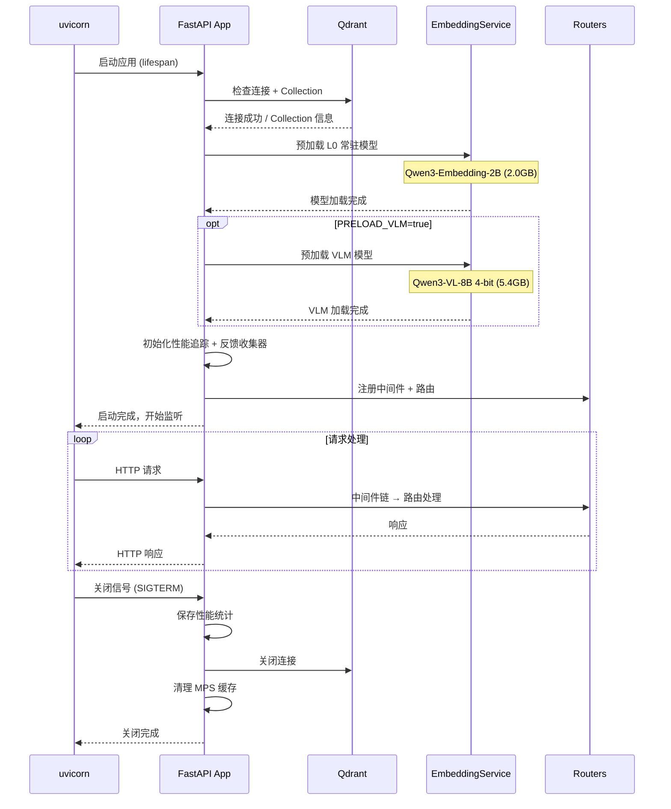

---

## 11. 错误处理与降级

### 11.1 降级设计理念

本系统运行在 24GB RAM 单机上，7 个 AI 模型共享内存，运行时难免遇到模型超时、内存不足、推理失败等问题。降级设计的核心理念是：**部分失败不应导致整体不可用，系统应尽可能返回有价值的部分结果**。

```mermaid
flowchart TB
    ERROR[异常发生] --> CLASSIFY{错误分级}

    CLASSIFY -->|致命 Fatal| F1{模型加载失败?}
    F1 -->|是| F2[返回 503<br>MODEL_LOAD_FAILED]
    F1 -->|否| F3{Qdrant 断开?}
    F3 -->|是| F4[返回 503<br>QDRANT_CONNECTION_FAILED]
    F3 -->|否| F5[返回 500<br>INTERNAL_ERROR]

    CLASSIFY -->|可恢复 Recoverable| R1{VLM 超时?}
    R1 -->|是| R2[降级: 文件名搜索<br>返回 200 + degraded=true]
    R1 -->|否| R3{ASR 失败?}
    R3 -->|是| R4[降级: 跳过音频索引<br>返回 200 + degraded=true]
    R3 -->|否| R5{LLM 超时?}
    R5 -->|是| R6[降级: 返回 Reranker 结果<br>无推荐理由]
    R5 -->|否| R7[降级: 通用降级<br>返回 200 + degraded=true]

    CLASSIFY -->|可重试 Retryable| T1[指数退避重试<br>1s → 2s → 4s]
    T1 --> T2{3 次内成功?}
    T2 -->|是| T3[返回正常结果]
    T2 -->|否| T4[返回 503<br>降级处理]

    CLASSIFY -->|输入错误 Input| I1[返回 400/404<br>不重试]

    style F2 fill:#2a1010,stroke:#EF4444
    style F4 fill:#2a1010,stroke:#EF4444
    style R2 fill:#2a2010,stroke:#F59E0B
    style R4 fill:#2a2010,stroke:#F59E0B
    style R6 fill:#2a2010,stroke:#F59E0B
    style T3 fill:#1a201a,stroke:#10B981
    style I1 fill:#1a1a2e,stroke:#A78BFA
```

### 11.2 DegradationHandler 完整实现

```python
# api/degradation.py

import os
import time
import logging
import asyncio
from datetime import datetime
from typing import Optional, Any
from dataclasses import dataclass, field

logger = logging.getLogger("degradation")


@dataclass
class DegradedResult:
    """降级结果包装器"""
    query_id: str
    mode: str
    recommendations: list[dict]
    latency_ms: int
    stages: dict[str, int] = field(default_factory=dict)
    degraded: bool = True
    degradation_notes: str = ""


class DegradationHandler:
    """
    降级处理器

    职责：
    - 捕获搜索/推荐过程中的各种异常
    - 根据异常类型选择降级策略
    - 返回带 degraded 标记的部分结果
    - 记录降级日志供后续分析

    降级策略矩阵：
    | 异常         | 搜索降级           | 推荐降级           |
    |-------------|-------------------|-------------------|
    | VLM 超时     | 文件名匹配搜索      | 元数据相似搜索      |
    | ASR 失败     | 跳过音频，仅文本搜索 | 跳过 audio_vector  |
    | CLAP 失败    | 跳过音频向量检索     | 跳过 audio_vector  |
    | LLM 超时     | 返回无理由推荐结果    | 返回无理由推荐结果   |
    | Reranker 失败 | 返回检索原始排序     | 返回检索原始排序     |
    | Embedding 失败 | 降级为文件名搜索    | 降级为元数据搜索     |
    | Qdrant 断开  | 返回 503           | 返回 503           |
    """

    # 重试配置
    MAX_RETRIES = 3
    RETRY_DELAYS = [1.0, 2.0, 4.0]  # 指数退避（秒）

    def __init__(self, qdrant: Any = None, engine: Any = None):
        self.qdrant = qdrant
        self.engine = engine
        self._degradation_stats = {
            "vlm_timeout": 0,
            "asr_failed": 0,
            "clap_failed": 0,
            "llm_timeout": 0,
            "reranker_failed": 0,
            "embedding_failed": 0,
            "qdrant_failed": 0,
            "total_degraded": 0,
        }

    # ─── 搜索降级 ──────────────────────────────────────────

    async def handle_search_error(
        self,
        error: Exception,
        query: dict,
        query_type: str,
        top_n: int,
    ) -> DegradedResult:
        """
        处理搜索过程中的异常

        根据异常类型选择降级策略：
        - VLM 超时 → 文件名匹配搜索
        - Embedding 失败 → 文件名匹配搜索
        - LLM 超时 → 返回无推荐理由的结果
        - Qdrant 断开 → 无法降级，抛出异常
        """
        error_str = str(error).lower()
        query_id = f"q-degraded-{int(time.time() * 1000)}"
        t0 = time.time()

        self._degradation_stats["total_degraded"] += 1

        # ─── Qdrant 断开：无法降级 ─────────────────────────
        if "connection" in error_str and "qdrant" in error_str:
            self._degradation_stats["qdrant_failed"] += 1
            logger.critical(f"[{query_id}] Qdrant 连接断开，无法降级: {error}")
            raise error  # 重新抛出，由上层返回 503

        # ─── VLM 超时 / Embedding 失败：降级为文件名搜索 ────
        vlm_failed = "vlm" in error_str or "timeout" in error_str
        embedding_failed = "embedding" in error_str or "model" in error_str

        if vlm_failed or embedding_failed:
            if vlm_failed:
                self._degradation_stats["vlm_timeout"] += 1
                note = "VLM 推理超时，已降级为文件名匹配搜索。完整语义搜索将在 VLM 恢复后可用。"
            else:
                self._degradation_stats["embedding_failed"] += 1
                note = "Embedding 模型加载失败，已降级为文件名匹配搜索。"

            logger.warning(f"[{query_id}] 搜索降级: {note}")

            # 尝试文件名匹配搜索
            results = await self._fallback_filename_search(
                query=query,
                query_type=query_type,
                top_n=top_n,
            )

            return DegradedResult(
                query_id=query_id,
                mode="query_driven",
                recommendations=results,
                latency_ms=int((time.time() - t0) * 1000),
                stages={"fallback_ms": int((time.time() - t0) * 1000)},
                degraded=True,
                degradation_notes=note,
            )

        # ─── LLM 超时：返回无推荐理由的结果 ─────────────────
        if "llm" in error_str:
            self._degradation_stats["llm_timeout"] += 1
            note = "LLM 推荐理由生成超时，返回无理由的推荐结果。"

            logger.warning(f"[{query_id}] LLM 降级: {note}")

            # 尝试重试一次（LLM 超时可能是偶发的）
            try:
                result = await self._retry_search(query, top_n, explain=False)
                # 重试成功但标记为降级（因为跳过了 LLM）
                result.degraded = True
                result.degradation_notes = note
                return result
            except Exception:
                # 重试也失败，返回空结果
                return DegradedResult(
                    query_id=query_id,
                    mode="query_driven",
                    recommendations=[],
                    latency_ms=int((time.time() - t0) * 1000),
                    stages={"retry_failed_ms": int((time.time() - t0) * 1000)},
                    degraded=True,
                    degradation_notes=note + " 重试也失败，返回空结果。",
                )

        # ─── 其他未分类异常：通用降级 ───────────────────────
        logger.error(
            f"[{query_id}] 未分类异常，通用降级: "
            f"{type(error).__name__}: {error}"
        )
        return DegradedResult(
            query_id=query_id,
            mode="query_driven",
            recommendations=[],
            latency_ms=int((time.time() - t0) * 1000),
            stages={"error_ms": int((time.time() - t0) * 1000)},
            degraded=True,
            degradation_notes=f"搜索过程中发生未预期异常: {type(error).__name__}。返回空结果。",
        )

    # ─── 推荐降级 ──────────────────────────────────────────

    async def handle_recommend_error(
        self,
        error: Exception,
        item_id: str,
        top_n: int,
    ) -> DegradedResult:
        """
        处理推荐过程中的异常

        根据异常类型选择降级策略：
        - LLM 超时 → 返回无推荐理由的结果
        - Reranker 失败 → 返回检索原始排序
        - Qdrant 断开 → 无法降级，抛出异常
        """
        error_str = str(error).lower()
        query_id = f"r-degraded-{int(time.time() * 1000)}"
        t0 = time.time()

        self._degradation_stats["total_degraded"] += 1

        # ─── Qdrant 断开：无法降级 ─────────────────────────
        if "connection" in error_str and "qdrant" in error_str:
            self._degradation_stats["qdrant_failed"] += 1
            logger.critical(f"[{query_id}] Qdrant 连接断开，无法降级: {error}")
            raise error

        # ─── LLM 超时：返回无推荐理由的结果 ─────────────────
        if "llm" in error_str or "timeout" in error_str:
            self._degradation_stats["llm_timeout"] += 1
            note = "LLM 推荐理由生成超时，返回无理由的推荐结果。"

            logger.warning(f"[{query_id}] 推荐 LLM 降级: {note}")

            # 尝试跳过 LLM 重试
            try:
                result = await self._retry_recommend(item_id, top_n, explain=False)
                result.degraded = True
                result.degradation_notes = note
                return result
            except Exception:
                return DegradedResult(
                    query_id=query_id,
                    mode="item_to_item",
                    recommendations=[],
                    latency_ms=int((time.time() - t0) * 1000),
                    stages={"retry_failed_ms": int((time.time() - t0) * 1000)},
                    degraded=True,
                    degradation_notes=note + " 重试也失败，返回空结果。",
                )

        # ─── Reranker 失败：返回检索原始排序 ────────────────
        if "reranker" in error_str:
            self._degradation_stats["reranker_failed"] += 1
            note = "Reranker 精排失败，返回向量检索原始排序结果（未经精排）。"

            logger.warning(f"[{query_id}] Reranker 降级: {note}")

            try:
                result = await self._retry_recommend_skip_rerank(item_id, top_n)
                result.degraded = True
                result.degradation_notes = note
                return result
            except Exception:
                return DegradedResult(
                    query_id=query_id,
                    mode="item_to_item",
                    recommendations=[],
                    latency_ms=int((time.time() - t0) * 1000),
                    stages={"fallback_failed_ms": int((time.time() - t0) * 1000)},
                    degraded=True,
                    degradation_notes=note + " 降级检索也失败，返回空结果。",
                )

        # ─── 通用降级 ───────────────────────────────────────
        logger.error(
            f"[{query_id}] 推荐未分类异常: "
            f"{type(error).__name__}: {error}"
        )
        return DegradedResult(
            query_id=query_id,
            mode="item_to_item",
            recommendations=[],
            latency_ms=int((time.time() - t0) * 1000),
            stages={"error_ms": int((time.time() - t0) * 1000)},
            degraded=True,
            degradation_notes=f"推荐过程中发生未预期异常: {type(error).__name__}。返回空结果。",
        )

    # ─── 索引降级 ──────────────────────────────────────────

    async def handle_index_error(
        self,
        error: Exception,
        file_path: str,
        modality: str,
        index_level: str,
    ) -> dict:
        """
        处理索引过程中的异常

        降级策略：
        - VLM 超时 → 仅 L1 元数据索引，标记为 L1
        - ASR 失败 → 跳过音频索引，仅 L2 画面/文本索引
        - CLAP 失败 → 跳过音频向量，保留文本向量
        - 文件损坏 → 返回错误，不降级
        """
        error_str = str(error).lower()
        self._degradation_stats["total_degraded"] += 1

        # 文件损坏不降级
        if "corrupt" in error_str or "format" in error_str:
            raise error

        # VLM 超时 → L1 降级
        if "vlm" in error_str or "timeout" in error_str:
            self._degradation_stats["vlm_timeout"] += 1
            logger.warning(
                f"索引降级: VLM 超时, {file_path} 仅执行 L1 元数据索引"
            )
            return {
                "item_id": "",
                "modality": modality,
                "index_level": "L1",
                "description": "[降级] VLM 超时，仅元数据索引",
                "tags": {},
                "vector_dimensions": {},
                "degraded": True,
                "degradation_notes": "VLM 推理超时，已降级为 L1 元数据索引。L2/L3 将在 VLM 恢复后通过重新索引补全。",
            }

        # ASR 失败 → 跳过音频，仅 L2
        if "asr" in error_str or "whisper" in error_str:
            self._degradation_stats["asr_failed"] += 1
            logger.warning(
                f"索引降级: ASR 失败, {file_path} 跳过音频索引"
            )
            return {
                "item_id": "",
                "modality": modality,
                "index_level": "L2",
                "description": "[降级] ASR 失败，跳过音频索引",
                "tags": {},
                "vector_dimensions": {"content_vector": 2048},
                "degraded": True,
                "degradation_notes": "ASR 转写失败，已跳过音频索引。画面/文本向量已正常生成，audio_vector 缺失。",
            }

        # CLAP 失败 → 跳过音频向量
        if "clap" in error_str:
            self._degradation_stats["clap_failed"] += 1
            logger.warning(
                f"索引降级: CLAP 失败, {file_path} 跳过音频向量"
            )
            return {
                "item_id": "",
                "modality": modality,
                "index_level": "L2",
                "description": "[降级] CLAP 失败，跳过音频向量",
                "tags": {},
                "vector_dimensions": {"content_vector": 2048},
                "degraded": True,
                "degradation_notes": "CLAP 音频编码失败，已跳过 audio_vector。content_vector 已正常生成。",
            }

        # 其他异常不降级
        raise error

    # ─── 降级辅助方法 ──────────────────────────────────────

    async def _fallback_filename_search(
        self,
        query: dict,
        query_type: str,
        top_n: int,
    ) -> list[dict]:
        """
        文件名匹配搜索（降级方案）

        当 VLM/Embedding 不可用时，基于文件名进行模糊匹配。
        使用 Qdrant scroll + payload 过滤。
        """
        results = []

        try:
            # 提取查询关键词
            if query_type == "text":
                keywords = query.get("text", "").lower().split()
            elif query_type == "image":
                keywords = [query.get("image_path", "").split("/")[-1].lower()]
            else:
                keywords = [query.get("audio_path", query.get("video_path", "")).split("/")[-1].lower()]

            # 从 Qdrant scroll 所有条目，按文件名匹配
            offset = None
            while len(results) < top_n:
                points, offset = await self.qdrant.scroll(
                    collection_name="media_items",
                    limit=100,
                    offset=offset,
                    with_payload=True,
                    with_vectors=False,
                )
                if not points:
                    break

                for point in points:
                    payload = point.payload or {}
                    file_name = payload.get("metadata", {}).get("file_name", "").lower()
                    description = payload.get("description", "").lower()

                    # 简单关键词匹配
                    match_score = 0
                    for kw in keywords:
                        if kw in file_name:
                            match_score += 0.5
                        if kw in description:
                            match_score += 0.3

                    if match_score > 0:
                        results.append({
                            "item_id": str(point.id),
                            "rank": len(results) + 1,
                            "relevance_score": min(match_score, 1.0),
                            "description": payload.get("description", ""),
                            "modality": payload.get("modality", "unknown"),
                            "tags": payload.get("tags", {}),
                            "reason": "[降级模式] 基于文件名匹配",
                            "match_tags": [],
                            "file_name": payload.get("metadata", {}).get("file_name"),
                        })

                        if len(results) >= top_n:
                            break

                if offset is None:
                    break

        except Exception as e:
            logger.error(f"文件名降级搜索也失败: {e}")

        return results[:top_n]

    async def _retry_search(self, query: dict, top_n: int, explain: bool):
        """重试搜索（跳过 LLM）"""
        for attempt in range(self.MAX_RETRIES):
            try:
                await asyncio.sleep(self.RETRY_DELAYS[attempt])
                result = await self.engine.search(
                    query=query,
                    top_n=top_n,
                    mmr_lambda=0.5,
                )
                return result
            except Exception as e:
                if attempt == self.MAX_RETRIES - 1:
                    raise
                logger.warning(f"搜索重试 {attempt + 1}/{self.MAX_RETRIES} 失败: {e}")

    async def _retry_recommend(self, item_id: str, top_n: int, explain: bool):
        """重试推荐（跳过 LLM）"""
        for attempt in range(self.MAX_RETRIES):
            try:
                await asyncio.sleep(self.RETRY_DELAYS[attempt])
                result = await self.engine.recommend(
                    item_id=item_id,
                    top_n=top_n,
                )
                return result
            except Exception as e:
                if attempt == self.MAX_RETRIES - 1:
                    raise
                logger.warning(f"推荐重试 {attempt + 1}/{self.MAX_RETRIES} 失败: {e}")

    async def _retry_recommend_skip_rerank(self, item_id: str, top_n: int):
        """重试推荐（跳过 Reranker，直接返回检索结果）"""
        # 直接调用 Qdrant 检索，跳过 Reranker
        points = await self.qdrant.retrieve(
            collection_name="media_items",
            ids=[item_id],
            with_vectors=True,
            with_payload=True,
        )
        if not points:
            return DegradedResult(
                query_id=f"r-fallback-{int(time.time() * 1000)}",
                mode="item_to_item",
                recommendations=[],
                latency_ms=0,
            )

        source_vector = points[0].vector or {}
        content_vec = source_vector.get("content_vector")
        if not content_vec:
            return DegradedResult(
                query_id=f"r-fallback-{int(time.time() * 1000)}",
                mode="item_to_item",
                recommendations=[],
                latency_ms=0,
            )

        # 直接向量搜索，不经过 Reranker
        hits = await self.qdrant.search(
            collection_name="media_items",
            query_vector=content_vec,
            limit=top_n,
            with_payload=True,
            with_vectors=False,
        )

        recommendations = []
        for i, hit in enumerate(hits):
            payload = hit.payload or {}
            if str(hit.id) == item_id:
                continue
            recommendations.append({
                "item_id": str(hit.id),
                "rank": len(recommendations) + 1,
                "relevance_score": float(hit.score),
                "description": payload.get("description", ""),
                "modality": payload.get("modality", "unknown"),
                "tags": payload.get("tags", {}),
                "reason": "[降级模式] 未经 Reranker 精排",
                "match_tags": [],
            })

        return DegradedResult(
            query_id=f"r-fallback-{int(time.time() * 1000)}",
            mode="item_to_item",
            recommendations=recommendations[:top_n],
            latency_ms=0,
        )

    # ─── 统计 ──────────────────────────────────────────────

    def get_stats(self) -> dict:
        """获取降级统计"""
        return dict(self._degradation_stats)
```

### 11.3 降级策略矩阵

| 异常场景 | 搜索 API 降级 | 推荐 API 降级 | 索引 API 降级 | HTTP 状态 | degraded 标记 |
|----------|--------------|--------------|--------------|-----------|--------------|
| VLM 超时 (>30s) | 文件名匹配搜索 | 元数据相似搜索 | 仅 L1 元数据索引 | 200 | true |
| ASR 失败 | 跳过音频，仅文本搜索 | 跳过 audio_vector | 仅 L2 画面索引 | 200 | true |
| CLAP 失败 | 跳过音频向量检索 | 跳过 audio_vector | 跳过 audio_vector | 200 | true |
| LLM 超时 (>10s) | 返回无理由推荐结果 | 返回无理由推荐结果 | 不涉及 | 200 | true |
| Reranker 失败 | 返回检索原始排序 | 返回检索原始排序 | 不涉及 | 200 | true |
| Embedding 失败 | 文件名匹配搜索 | 元数据搜索 | 仅 L1 元数据索引 | 200 | true |
| Qdrant 断开 | 无法降级，503 | 无法降级，503 | 无法降级，503 | 503 | — |
| 文件损坏 | 400 | 不涉及 | 400 | 400 | — |
| 内存不足 (OOM) | 无法降级，503 | 无法降级，503 | 无法降级，503 | 503 | — |

### 11.4 指数退避重试策略

对于可重试的异常（网络抖动、临时 OOM），系统采用指数退避策略进行自动重试。

```python
async def retry_with_backoff(
    func,
    max_retries: int = 3,
    base_delay: float = 1.0,
    max_delay: float = 8.0,
):
    """
    指数退避重试

    Args:
        func: 异步可调用对象
        max_retries: 最大重试次数
        base_delay: 基础延迟（秒）
        max_delay: 最大延迟（秒）
    """
    import random

    for attempt in range(max_retries + 1):
        try:
            return await func()
        except Exception as e:
            if attempt == max_retries:
                raise

            delay = min(base_delay * (2 ** attempt), max_delay)
            # 添加抖动（jitter），避免惊群效应
            jitter = random.uniform(0, delay * 0.1)
            actual_delay = delay + jitter

            logger.warning(
                f"重试 {attempt + 1}/{max_retries}: "
                f"{type(e).__name__}, 等待 {actual_delay:.1f}s"
            )
            await asyncio.sleep(actual_delay)
```

| 重试次数 | 延迟 | 含义 |
|----------|------|------|
| 第 1 次重试 | 1s + jitter | 快速重试 |
| 第 2 次重试 | 2s + jitter | 中等等待 |
| 第 3 次重试 | 4s + jitter | 较长等待 |
| 超过 3 次 | 不再重试 | 降级处理或返回 503 |

---

## 12. WebSocket 实时进度

### 12.1 设计说明

批量索引是耗时操作（可能数分钟到数小时），HTTP 轮询查询进度的效率较低。系统提供 WebSocket 端点，服务端主动推送进度更新，客户端实时感知索引进度。

```
WS /ws/index/{task_id}
```

### 12.2 WebSocket 通信协议

#### 消息类型

| 消息类型 | 方向 | 说明 |
|----------|------|------|
| `progress` | 服务端 → 客户端 | 每秒推送一次进度更新 |
| `done` | 服务端 → 客户端 | 任务完成/失败/取消时推送 |
| `error` | 服务端 → 客户端 | 连接或任务异常时推送 |
| `ping` | 客户端 → 服务端 | 客户端心跳（可选） |
| `pong` | 服务端 → 客户端 | 心跳响应 |

#### progress 消息

```json
{
  "type": "progress",
  "data": {
    "task_id": "batch-20260814-140000-abc123",
    "status": "running",
    "progress": {
      "total_files": 342,
      "indexed_files": 187,
      "failed_files": 3,
      "skipped_files": 12,
      "pending_files": 140,
      "progress_percent": 54.7
    },
    "current_file": {
      "file_name": "vacation_2025_187.jpg",
      "modality": "image",
      "index_level": "L2",
      "stage": "vlm_analysis",
      "elapsed_ms": 3200
    },
    "by_modality": {
      "image": {"total": 280, "done": 160, "failed": 2},
      "video": {"total": 42, "done": 15, "failed": 1},
      "audio": {"total": 20, "done": 12, "failed": 0}
    },
    "elapsed_sec": 125,
    "estimated_remaining_sec": 210
  },
  "timestamp": "2026-08-14T14:02:05.123456"
}
```

#### done 消息

```json
{
  "type": "done",
  "status": "completed",
  "summary": {
    "total_indexed": 327,
    "total_failed": 3,
    "total_skipped": 12,
    "total_vectors_created": 327,
    "avg_index_time_ms": 5200,
    "total_disk_cache_mb": 145.6,
    "elapsed_sec": 330
  },
  "timestamp": "2026-08-14T14:05:30.000000"
}
```

### 12.3 TaskManager 实现

```python
# core/task_manager.py

import uuid
import time
import asyncio
import logging
from datetime import datetime, timezone
from dataclasses import dataclass, field
from typing import Optional

logger = logging.getLogger("task_manager")


@dataclass
class IndexTask:
    """批量索引任务"""
    task_id: str
    directory: str
    recursive: bool = True
    file_filter: Optional[dict] = None
    video_mode: str = "auto"
    index_level: str = "L2"
    concurrency: Optional[dict] = None
    status: str = "pending"  # pending / scanning / running / completed / failed / cancelled
    started_at: Optional[str] = None
    completed_at: Optional[str] = None

    # 进度追踪
    total_files: int = 0
    indexed_files: int = 0
    failed_files: int = 0
    skipped_files: int = 0
    errors: list[dict] = field(default_factory=list)
    current_file: Optional[dict] = None
    by_modality: dict = field(default_factory=dict)

    # 内部状态
    _indexer: Any = None
    _cancel_flag: bool = False

    def get_status(self) -> dict:
        """获取当前状态"""
        pending = self.total_files - self.indexed_files - self.failed_files - self.skipped_files
        progress_percent = 0.0
        if self.total_files > 0:
            done = self.indexed_files + self.failed_files + self.skipped_files
            progress_percent = round(done / self.total_files * 100, 1)

        elapsed_sec = 0
        if self.started_at:
            start = datetime.fromisoformat(self.started_at.replace("Z", "+00:00"))
            end = datetime.fromisoformat(self.completed_at.replace("Z", "+00:00")) if self.completed_at else datetime.now(timezone.utc)
            elapsed_sec = int((end - start).total_seconds())

        # 估算剩余时间
        est_remaining = 0
        if self.indexed_files > 0 and elapsed_sec > 0:
            avg_per_file = elapsed_sec / max(self.indexed_files, 1)
            est_remaining = int(pending * avg_per_file)

        return {
            "task_id": self.task_id,
            "status": self.status,
            "directory": self.directory,
            "started_at": self.started_at,
            "completed_at": self.completed_at,
            "elapsed_sec": elapsed_sec,
            "progress": {
                "total_files": self.total_files,
                "scanned_files": self.total_files,
                "indexed_files": self.indexed_files,
                "failed_files": self.failed_files,
                "skipped_files": self.skipped_files,
                "pending_files": pending,
                "progress_percent": progress_percent,
            },
            "current_file": self.current_file,
            "by_modality": self.by_modality,
            "by_index_level": {},
            "errors": self.errors[-10:],  # 最近 10 条错误
            "estimated_remaining_sec": est_remaining,
            "websocket_url": f"ws://127.0.0.1:8000/ws/index/{self.task_id}",
        }

    def get_summary(self) -> dict:
        """获取完成摘要"""
        return {
            "total_indexed": self.indexed_files,
            "total_failed": self.failed_files,
            "total_skipped": self.skipped_files,
            "total_vectors_created": self.indexed_files,
            "avg_index_time_ms": 0,  # 由实际统计填充
            "total_disk_cache_mb": 0,
            "elapsed_sec": 0,
        }


class TaskManager:
    """
    批量任务管理器

    职责：
    - 创建和管理批量索引任务
    - 后台异步执行文件扫描和索引
    - 提供任务状态查询接口
    - 支持任务取消
    """

    # 任务过期时间（24 小时后自动清理）
    TASK_TTL_SEC = 86400

    def __init__(self, indexer: Any = None):
        self._tasks: dict[str, IndexTask] = {}
        self._indexer = indexer

    def create_task(
        self,
        directory: str,
        recursive: bool = True,
        file_filter: Optional[dict] = None,
        video_mode: str = "auto",
        index_level: str = "L2",
        concurrency: Optional[dict] = None,
    ) -> IndexTask:
        """创建批量索引任务"""
        task_id = f"batch-{datetime.now().strftime('%Y%m%d-%H%M%S')}-{uuid.uuid4().hex[:8]}"

        task = IndexTask(
            task_id=task_id,
            directory=directory,
            recursive=recursive,
            file_filter=file_filter,
            video_mode=video_mode,
            index_level=index_level,
            concurrency=concurrency,
        )

        self._tasks[task_id] = task

        # 启动后台任务
        asyncio.create_task(self._run_task(task))

        return task

    def get_task(self, task_id: str) -> Optional[IndexTask]:
        """获取任务"""
        return self._tasks.get(task_id)

    def cancel_task(self, task_id: str) -> bool:
        """取消任务"""
        task = self._tasks.get(task_id)
        if task and task.status in ("pending", "scanning", "running"):
            task._cancel_flag = True
            task.status = "cancelled"
            return True
        return False

    async def _run_task(self, task: IndexTask):
        """后台执行批量索引任务"""
        task.status = "scanning"
        task.started_at = datetime.now(timezone.utc).isoformat()

        try:
            # ─── 1. 扫描文件 ─────────────────────────────────
            files = await self._scan_directory(task)
            task.total_files = len(files)
            task.status = "running"

            # 初始化模态统计
            for f in files:
                modality = self._detect_modality(f)
                if modality not in task.by_modality:
                    task.by_modality[modality] = {"total": 0, "done": 0, "failed": 0}
                task.by_modality[modality]["total"] += 1

            logger.info(
                f"[{task.task_id}] 扫描完成: {task.total_files} 个文件"
            )

            # ─── 2. 逐个索引 ─────────────────────────────────
            for file_path in files:
                if task._cancel_flag:
                    task.status = "cancelled"
                    break

                modality = self._detect_modality(file_path)
                file_name = file_path.split("/")[-1]

                task.current_file = {
                    "file_name": file_name,
                    "modality": modality,
                    "index_level": task.index_level,
                    "stage": "starting",
                    "elapsed_ms": 0,
                }

                file_start = time.time()

                try:
                    result = await self._indexer.index_file(
                        file_path=file_path,
                        index_level=task.index_level,
                        video_mode=task.video_mode,
                    )

                    if result.get("degraded"):
                        task.skipped_files += 1
                    else:
                        task.indexed_files += 1

                    task.by_modality[modality]["done"] += 1

                except Exception as e:
                    task.failed_files += 1
                    task.by_modality[modality]["failed"] += 1
                    task.errors.append({
                        "file_name": file_name,
                        "error": f"{type(e).__name__}: {e}",
                        "timestamp": datetime.now(timezone.utc).isoformat(),
                    })
                    logger.error(
                        f"[{task.task_id}] 索引失败: {file_name}: {e}"
                    )

                # 更新当前文件耗时
                task.current_file["elapsed_ms"] = int((time.time() - file_start) * 1000)

            # ─── 3. 完成 ─────────────────────────────────────
            if task.status != "cancelled":
                task.status = "completed"
            task.completed_at = datetime.now(timezone.utc).isoformat()
            task.current_file = None

            logger.info(
                f"[{task.task_id}] 任务完成: "
                f"indexed={task.indexed_files}, "
                f"failed={task.failed_files}, "
                f"skipped={task.skipped_files}"
            )

        except Exception as e:
            task.status = "failed"
            task.completed_at = datetime.now(timezone.utc).isoformat()
            logger.error(f"[{task.task_id}] 任务失败: {e}")

    async def _scan_directory(self, task: IndexTask) -> list[str]:
        """扫描目录，返回符合过滤条件的文件列表"""
        import os

        supported_extensions = {
            "image": {"jpg", "jpeg", "png", "webp", "bmp", "tiff"},
            "video": {"mp4", "mov", "mkv", "avi", "webm"},
            "audio": {"mp3", "wav", "flac", "aac", "ogg", "m4a"},
        }
        all_extensions = set()
        for exts in supported_extensions.values():
            all_extensions.update(exts)

        # 应用文件过滤
        if task.file_filter and "extensions" in task.file_filter:
            all_extensions = set(task.file_filter["extensions"])

        min_size = (task.file_filter or {}).get("min_size_kb", 1) * 1024
        max_size = (task.file_filter or {}).get("max_size_mb", 2048) * 1024 * 1024

        files = []
        if task.recursive:
            for root, dirs, filenames in os.walk(task.directory):
                for fname in filenames:
                    fpath = os.path.join(root, fname)
                    ext = fname.rsplit(".", 1)[-1].lower() if "." in fname else ""
                    if ext not in all_extensions:
                        continue
                    fsize = os.path.getsize(fpath)
                    if fsize < min_size or fsize > max_size:
                        task.skipped_files += 1
                        continue
                    files.append(fpath)
        else:
            for fname in os.listdir(task.directory):
                fpath = os.path.join(task.directory, fname)
                if not os.path.isfile(fpath):
                    continue
                ext = fname.rsplit(".", 1)[-1].lower() if "." in fname else ""
                if ext not in all_extensions:
                    continue
                fsize = os.path.getsize(fpath)
                if fsize < min_size or fsize > max_size:
                    task.skipped_files += 1
                    continue
                files.append(fpath)

        return sorted(files)

    def _detect_modality(self, file_path: str) -> str:
        """检测文件模态"""
        ext = file_path.rsplit(".", 1)[-1].lower() if "." in file_path else ""
        if ext in {"jpg", "jpeg", "png", "webp", "bmp", "tiff"}:
            return "image"
        elif ext in {"mp4", "mov", "mkv", "avi", "webm"}:
            return "video"
        elif ext in {"mp3", "wav", "flac", "aac", "ogg", "m4a"}:
            return "audio"
        return "unknown"
```

### 12.4 WebSocket 客户端示例

```python
# 客户端 WebSocket 连接示例

import asyncio
import json
import websockets


async def monitor_index_progress(task_id: str):
    """监听批量索引进度"""

    uri = f"ws://127.0.0.1:8000/ws/index/{task_id}"

    async with websockets.connect(uri) as ws:
        print(f"已连接 WebSocket: {uri}")

        while True:
            message = await ws.recv()
            data = json.loads(message)

            if data["type"] == "progress":
                progress = data["data"]["progress"]
                current = data["data"].get("current_file", {})
                print(
                    f"\r进度: {progress['progress_percent']:.1f}% "
                    f"({progress['indexed_files']}/{progress['total_files']}) "
                    f"| 当前: {current.get('file_name', 'N/A')} "
                    f"[{current.get('stage', '')}]",
                    end="",
                    flush=True,
                )

            elif data["type"] == "done":
                print(f"\n\n任务完成: {data['status']}")
                if data.get("summary"):
                    summary = data["summary"]
                    print(f"  索引: {summary['total_indexed']}")
                    print(f"  失败: {summary['total_failed']}")
                    print(f"  跳过: {summary['total_skipped']}")
                    print(f"  耗时: {summary['elapsed_sec']}s")
                break

            elif data["type"] == "error":
                print(f"\n错误: {data['message']}")
                break


# 使用示例
if __name__ == "__main__":
    asyncio.run(monitor_index_progress("batch-20260814-140000-abc123"))
```

### 12.5 WebSocket 消息流

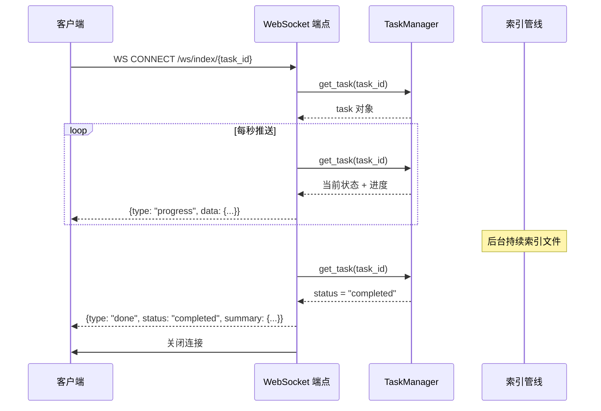

### 12.6 前端 JavaScript 客户端

```javascript
// 前端 WebSocket 连接示例

class IndexProgressMonitor {
  constructor(taskId) {
    this.taskId = taskId;
    this.ws = null;
    this.onProgress = null;
    this.onDone = null;
    this.onError = null;
  }

  connect() {
    const url = `ws://127.0.0.1:8000/ws/index/${this.taskId}`;
    this.ws = new WebSocket(url);

    this.ws.onopen = () => {
      console.log(`WebSocket 已连接: ${url}`);
    };

    this.ws.onmessage = (event) => {
      const data = JSON.parse(event.data);

      switch (data.type) {
        case "progress":
          if (this.onProgress) {
            this.onProgress(data.data);
          }
          break;
        case "done":
          if (this.onDone) {
            this.onDone(data);
          }
          this.disconnect();
          break;
        case "error":
          if (this.onError) {
            this.onError(data.message);
          }
          this.disconnect();
          break;
      }
    };

    this.ws.onerror = (error) => {
      console.error("WebSocket 错误:", error);
      if (this.onError) {
        this.onError("WebSocket 连接错误");
      }
    };

    this.ws.onclose = () => {
      console.log("WebSocket 已断开");
    };
  }

  disconnect() {
    if (this.ws) {
      this.ws.close();
      this.ws = null;
    }
  }
}

// 使用示例
const monitor = new IndexProgressMonitor("batch-20260814-140000-abc123");

monitor.onProgress = (data) => {
  const percent = data.progress.progress_percent;
  const current = data.current_file;
  document.getElementById("progress-bar").style.width = `${percent}%`;
  document.getElementById("current-file").textContent =
    current ? current.file_name : "—";
  document.getElementById("progress-text").textContent =
    `${data.progress.indexed_files} / ${data.progress.total_files} (${percent}%)`;
};

monitor.onDone = (data) => {
  console.log("索引完成:", data.summary);
  document.getElementById("status").textContent = "完成";
};

monitor.onError = (msg) => {
  console.error("错误:", msg);
  document.getElementById("status").textContent = `错误: ${msg}`;
};

monitor.connect();
```

---

## 附录：API 快速参考

### A.1 curl 命令速查

```bash
# ─── 搜索 ──────────────────────────────────────────
# 文本搜索
curl -X POST http://127.0.0.1:8000/api/v1/search \
  -H "Content-Type: application/json" \
  -d '{"query_type":"text","query":"海滩日落","top_n":10}'

# 图片搜索
curl -X POST http://127.0.0.1:8000/api/v1/search \
  -F "query_type=image" -F "file=@photo.jpg" -F "top_n=10"

# ─── 推荐 ──────────────────────────────────────────
curl -X POST http://127.0.0.1:8000/api/v1/recommend \
  -H "Content-Type: application/json" \
  -d '{"item_id":"a1b2c3d4e5f6","top_n":10}'

# ─── 索引 ──────────────────────────────────────────
# 单文件索引
curl -X POST http://127.0.0.1:8000/api/v1/index \
  -F "file=@photo.jpg" -F "index_level=L2"

# 批量索引
curl -X POST http://127.0.0.1:8000/api/v1/index/batch \
  -H "Content-Type: application/json" \
  -d '{"directory":"/Users/demo/photos","recursive":true}'

# 查询进度
curl http://127.0.0.1:8000/api/v1/index/status/batch-20260814-140000-abc123

# ─── 条目管理 ──────────────────────────────────────
curl http://127.0.0.1:8000/api/v1/items/a1b2c3d4e5f6
curl -X DELETE http://127.0.0.1:8000/api/v1/items/a1b2c3d4e5f6

# ─── 系统 ──────────────────────────────────────────
curl http://127.0.0.1:8000/api/v1/stats
curl -X DELETE http://127.0.0.1:8000/api/v1/cache?level=all
curl http://127.0.0.1:8000/health

# ─── 反馈 ──────────────────────────────────────────
curl -X POST http://127.0.0.1:8000/api/v1/feedback \
  -H "Content-Type: application/json" \
  -d '{"query_id":"q-001","item_id":"a1b2c3","action":"click","position":1}'
```

### A.2 端点延时速查

| 端点 | P50 | P95 | P99 | 超时 |
|------|-----|-----|-----|------|
| POST /search (text) | 4.8s | 7.5s | 8.2s | 30s |
| POST /search (image) | 5.5s | 8.0s | 9.5s | 30s |
| POST /recommend | 3.8s | 5.0s | 6.5s | 20s |
| POST /index | 6.8s | 12.0s | 15.0s | 60s |
| GET /items/{id} | 15ms | 35ms | 50ms | 5s |
| GET /stats | 25ms | 40ms | 50ms | 5s |
| POST /feedback | 5ms | 15ms | 25ms | 5s |

### A.3 环境变量

| 环境变量 | 默认值 | 说明 |
|----------|--------|------|
| `PRELOAD_VLM` | `false` | 启动时预加载 VLM 模型（5.4GB） |
| `QDRANT_URL` | `http://localhost:6333` | Qdrant 服务地址 |
| `API_HOST` | `127.0.0.1` | API 监听地址 |
| `API_PORT` | `8000` | API 监听端口 |
| `LOG_LEVEL` | `INFO` | 日志级别 |
| `MAX_SEARCH_CONCURRENCY` | `2` | 搜索最大并发数 |
| `MAX_INDEX_CONCURRENCY` | `1` | 索引最大并发数 |