[← 返回目录](00-目录索引.md)

# 08 — 缓存容错与批量处理

> **多模态向量推荐系统** · Apple M5 (24GB) · 两级缓存 · 四级错误体系 · 信号量并发控制 · 渐进式索引
>
> 版本：2026-08-14 · 文档定位：缓存架构、错误分级与降级、重试机制、批量处理器、并发控制、渐进式索引流水线的完整设计与实现

---

## 目录

1. [缓存架构总览](#1-缓存架构总览)
2. [L1 内存缓存](#2-l1-内存缓存)
3. [L2 磁盘缓存](#3-l2-磁盘缓存)
4. [缓存策略](#4-缓存策略)
5. [错误分级与处理](#5-错误分级与处理)
6. [降级策略](#6-降级策略)
7. [重试机制](#7-重试机制)
8. [批量处理器](#8-批量处理器)
9. [并发控制](#9-并发控制)
10. [渐进式索引](#10-渐进式索引)
11. [缓存一致性](#11-缓存一致性)
12. [性能数据](#12-性能数据)

---

## 1. 缓存架构总览

### 1.1 设计目标

在 Apple M5 (24GB RAM) 单机环境下，多模态处理管线涉及大量重复计算——同一张图片的 VLM 描述、同一段音频的 ASR 转写、同一段文本的 Embedding 向量，在文件内容不变的情况下完全可复用。缓存系统的核心目标是：

- **消除重复推理**：VLM/ASR/CLAP 等重模型推理结果基于文件内容哈希永久缓存，同一文件二次索引时零计算
- **加速查询响应**：高频查询的向量化和检索结果缓存在内存，命中率 >80% 时查询延时从秒级降至毫秒级
- **控制内存占用**：L1 内存缓存在 LRU + TTL 双重淘汰策略下峰值不超过 2GB，为模型推理留出充足内存
- **持久化中间产物**：L2 磁盘缓存利用 NVMe SSD 的随机读写性能，在 37GB 空间预算内持久化全部重计算产物

### 1.2 两级缓存架构图

```mermaid
flowchart TB
    subgraph "请求入口"
        REQ[索引/检索请求]
    end

    subgraph "L1 内存缓存 (进程内 · LRU+TTL)"
        direction TB
        EMB_CACHE[embedding_cache<br>文本→向量<br>TTL 24h · LRU 5000<br>预估 ~800MB]
        SRCH_CACHE[search_cache<br>查询→结果<br>TTL 10min · LRU 200<br>预估 ~200MB]
    end

    subgraph "L2 磁盘缓存 (diskcache · NVMe SSD)"
        direction TB
        DESC_CACHE[descriptions<br>VLM 描述缓存<br>10GB]
        ASR_CACHE[asr_transcripts<br>ASR 转写缓存<br>5GB]
        CLAP_CACHE[clap_embeddings<br>CLAP 嵌入缓存<br>2GB]
        FRAME_CACHE[video_frames<br>视频帧缓存<br>20GB]
    end

    subgraph "后端计算"
        VLM[VLM 推理]
        ASR[ASR 转写]
        CLAP[CLAP 嵌入]
        FFMEPG[ffmpeg 抽帧]
        EMBED[Embedding 模型]
        QDRANT[Qdrant 向量库]
    end

    REQ --> EMB_CACHE
    REQ --> SRCH_CACHE

    EMB_CACHE -->|命中| FAST_RET[直接返回向量]
    EMB_CACHE -->|未命中| EMBED
    EMBED --> EMB_CACHE

    SRCH_CACHE -->|命中| FAST_RES[直接返回结果]
    SRCH_CACHE -->|未命中| QDRANT
    QDRANT --> SRCH_CACHE

    REQ --> DESC_CACHE
    REQ --> ASR_CACHE
    REQ --> CLAP_CACHE
    REQ --> FRAME_CACHE

    DESC_CACHE -->|命中| SKIP_VLM[跳过 VLM]
    DESC_CACHE -->|未命中| VLM
    VLM --> DESC_CACHE

    ASR_CACHE -->|命中| SKIP_ASR[跳过 ASR]
    ASR_CACHE -->|未命中| ASR
    ASR --> ASR_CACHE

    CLAP_CACHE -->|命中| SKIP_CLAP[跳过 CLAP]
    CLAP_CACHE -->|未命中| CLAP
    CLAP --> CLAP_CACHE

    FRAME_CACHE -->|命中| SKIP_FFMPEG[跳过抽帧]
    FRAME_CACHE -->|未命中| FFMEPG
    FFMEPG --> FRAME_CACHE

    style EMB_CACHE fill:#1a201a,stroke:#10B981
    style SRCH_CACHE fill:#1a201a,stroke:#10B981
    style DESC_CACHE fill:#1a1520,stroke:#8B5CF6
    style ASR_CACHE fill:#1a1520,stroke:#8B5CF6
    style CLAP_CACHE fill:#1a1520,stroke:#8B5CF6
    style FRAME_CACHE fill:#1a1520,stroke:#8B5CF6
```

### 1.3 缓存层次职责划分

| 层级 | 介质 | 生命周期 | 容量限制 | 失效策略 | 典型延时 |
|------|------|----------|----------|----------|----------|
| **L1-embedding_cache** | 进程内存 (OrderedDict) | 进程存活期间 | 5000 条 (~800MB) | LRU + TTL 24h | <0.1ms |
| **L1-search_cache** | 进程内存 (OrderedDict) | 进程存活期间 | 200 条 (~200MB) | LRU + TTL 10min | <0.1ms |
| **L2-descriptions** | NVMe SSD (diskcache) | 永久（基于内容哈希） | 10GB | LRU 淘汰 + 手动清除 | 1-5ms |
| **L2-asr_transcripts** | NVMe SSD (diskcache) | 永久（基于内容哈希） | 5GB | LRU 淘汰 + 手动清除 | 1-5ms |
| **L2-clap_embeddings** | NVMe SSD (diskcache) | 永久（基于内容哈希） | 2GB | LRU 淘汰 + 手动清除 | 1-3ms |
| **L2-video_frames** | NVMe SSD (diskcache) | 永久（基于内容哈希） | 20GB | LRU 淘汰 + 手动清除 | 5-20ms |

### 1.4 数据流总结

```mermaid
flowchart LR
    subgraph "索引阶段"
        FILE[媒体文件] --> HASH[MD5 内容哈希]
        HASH --> L2_CHECK{L2 磁盘缓存<br>是否命中?}
        L2_CHECK -->|命中| REUSE[复用缓存结果]
        L2_CHECK -->|未命中| COMPUTE[执行模型推理]
        COMPUTE --> STORE_L2[写入 L2 磁盘缓存]
        STORE_L2 --> INDEX[写入 Qdrant]
        REUSE --> INDEX
    end

    subgraph "检索阶段"
        QUERY[查询文本] --> L1_CHECK{L1 内存缓存<br>是否命中?}
        L1_CHECK -->|命中| RET_VEC[返回缓存向量]
        L1_CHECK -->|未命中| EMBED_Q[查询向量化]
        EMBED_Q --> STORE_L1[写入 L1 内存缓存]
        STORE_L1 --> SEARCH[Qdrant 检索]
        RET_VEC --> SEARCH
        SEARCH --> RES_CACHE{L1 检索结果<br>缓存命中?}
        RES_CACHE -->|命中| RET_RES[返回缓存结果]
        RES_CACHE -->|未命中| STORE_RES[写入 L1 结果缓存]
        STORE_RES --> OUTPUT[返回候选集]
        RET_RES --> OUTPUT
    end

    style L2_CHECK fill:#1a1520,stroke:#8B5CF6
    style L1_CHECK fill:#1a201a,stroke:#10B981
    style RES_CACHE fill:#1a201a,stroke:#10B981
```

**索引阶段**以文件内容哈希 (MD5) 为缓存键，L2 磁盘缓存命中时直接跳过 VLM/ASR/CLAP 等重模型推理，将二次索引耗时从 10-60s 降至 <1s。

**检索阶段**以查询文本哈希为缓存键，L1 内存缓存命中时跳过 Embedding 模型推理（100-300ms）和 Qdrant 检索（~5ms），将查询响应从 100-300ms 降至 <0.1ms。

---

## 2. L1 内存缓存

### 2.1 设计说明

L1 内存缓存使用 Python 标准库 `collections.OrderedDict` 实现 LRU 淘汰，配合 `time.monotonic()` 实现 TTL 过期。选择 OrderedDict 而非 functools.lru_cache 的原因：

1. 需要同时支持 LRU 和 TTL 双重淘汰策略
2. 需要按值大小估算内存占用，动态调整容量
3. 需要支持批量清除和统计接口
4. 缓存值包含 numpy 数组，lru_cache 不适合缓存不可哈希对象

两个独立的缓存实例：

| 缓存名 | 键 | 值 | TTL | LRU 容量 | 预估内存/条 | 预估总内存 |
|--------|-----|-----|-----|----------|-------------|------------|
| `embedding_cache` | MD5(text) | numpy.ndarray (2048维 float32) | 24h | 5000 | ~8KB | ~40MB（向量本体）+ 元数据开销 |
| `search_cache` | MD5(query+filter) | list[dict] (Top-100 检索结果) | 10min | 200 | ~50KB-1MB | ~10-200MB |

> **注**：embedding_cache 的 5000 条容量按向量本体计算仅 40MB，但实际包含 Python 对象开销和 OrderedDict 元数据，总占用约 80-120MB。search_cache 的每条结果包含 100 条记录的 payload，实际内存占用波动较大，200 条上限控制在 200MB 以内。两者合计峰值约 1GB。

### 2.2 LRUTTLCache 完整实现

```python
"""
L1 内存缓存 — LRU + TTL 双重淘汰策略

用于 embedding_cache (文本→向量) 和 search_cache (查询→结果) 两个实例。
所有缓存在进程内存中，进程重启后丢失，依赖 L2 磁盘缓存提供持久性。
"""

import hashlib
import time
import threading
from collections import OrderedDict
from typing import Any, Optional, Callable


class LRUTTLCache:
    """
    LRU + TTL 内存缓存

    淘汰策略:
      1. TTL 过期: 超过 ttl_seconds 的条目在访问时惰性删除
      2. LRU 淘汰: 容量超限时淘汰最久未访问的条目
      3. 内存上限: 超过 max_memory_bytes 时按 LRU 顺序批量淘汰

    线程安全: 使用 threading.Lock 保护所有读写操作。
    """

    def __init__(
        self,
        name: str,
        max_size: int,
        ttl_seconds: float,
        max_memory_bytes: Optional[int] = None,
        size_estimator: Optional[Callable[[Any], int]] = None,
    ):
        """
        Args:
            name: 缓存名称（用于日志和统计）
            max_size: 最大条目数（LRU 容量上限）
            ttl_seconds: TTL 过期时间（秒）
            max_memory_bytes: 最大内存占用（字节），None 表示不限
            size_estimator: 估算值大小的函数，返回字节数
        """
        self.name = name
        self._max_size = max_size
        self._ttl = ttl_seconds
        self._max_memory = max_memory_bytes
        self._size_estimator = size_estimator or (lambda v: 0)

        self._cache: OrderedDict[str, tuple[float, Any]] = OrderedDict()
        # key -> (expire_timestamp, value)
        self._total_memory: int = 0

        # 统计计数器
        self._hits = 0
        self._misses = 0
        self._evictions_lru = 0
        self._evictions_ttl = 0
        self._evictions_mem = 0

        self._lock = threading.Lock()

    def _make_key(self, *parts: str) -> str:
        """生成缓存键: MD5(拼接后的字符串)"""
        raw = "::".join(str(p) for p in parts)
        return hashlib.md5(raw.encode("utf-8")).hexdigest()

    def get(self, key: str) -> Optional[Any]:
        """
        获取缓存值

        Returns:
            缓存值，未命中或已过期返回 None
        """
        with self._lock:
            if key not in self._cache:
                self._misses += 1
                return None

            expire_ts, value = self._cache[key]

            # TTL 检查
            if time.monotonic() > expire_ts:
                del self._cache[key]
                self._total_memory -= self._size_estimator(value)
                self._evictions_ttl += 1
                self._misses += 1
                return None

            # LRU: 移到末尾（最近使用）
            self._cache.move_to_end(key)
            self._hits += 1
            return value

    def set(self, key: str, value: Any):
        """写入缓存值，自动执行淘汰"""
        with self._lock:
            # 如果 key 已存在，先移除旧值
            if key in self._cache:
                _, old_value = self._cache.pop(key)
                self._total_memory -= self._size_estimator(old_value)

            expire_ts = time.monotonic() + self._ttl
            value_size = self._size_estimator(value)

            self._cache[key] = (expire_ts, value)
            self._total_memory += value_size

            # LRU 淘汰: 超过容量上限
            while len(self._cache) > self._max_size:
                _, (_, evicted_value) = self._cache.popitem(last=False)
                self._total_memory -= self._size_estimator(evicted_value)
                self._evictions_lru += 1

            # 内存淘汰: 超过内存上限
            if self._max_memory is not None:
                while self._total_memory > self._max_memory and len(self._cache) > 1:
                    _, (_, evicted_value) = self._cache.popitem(last=False)
                    self._total_memory -= self._size_estimator(evicted_value)
                    self._evictions_mem += 1

    def delete(self, key: str) -> bool:
        """删除指定缓存条目"""
        with self._lock:
            if key in self._cache:
                _, value = self._cache.pop(key)
                self._total_memory -= self._size_estimator(value)
                return True
            return False

    def clear(self):
        """清空全部缓存"""
        with self._lock:
            self._cache.clear()
            self._total_memory = 0

    def cleanup_expired(self) -> int:
        """
        主动清理所有过期条目（惰性删除的补充）

        Returns:
            清理的条目数
        """
        removed = 0
        now = time.monotonic()
        with self._lock:
            expired_keys = [
                k for k, (expire_ts, _) in self._cache.items()
                if now > expire_ts
            ]
            for k in expired_keys:
                _, value = self._cache.pop(k)
                self._total_memory -= self._size_estimator(value)
                removed += 1
            self._evictions_ttl += removed
        return removed

    def stats(self) -> dict:
        """返回缓存统计信息"""
        with self._lock:
            total = self._hits + self._misses
            hit_rate = (self._hits / total * 100) if total > 0 else 0.0
            return {
                "name": self.name,
                "size": len(self._cache),
                "max_size": self._max_size,
                "memory_bytes": self._total_memory,
                "memory_mb": round(self._total_memory / 1024 / 1024, 2),
                "hits": self._hits,
                "misses": self._misses,
                "hit_rate": f"{hit_rate:.1f}%",
                "evictions_lru": self._evictions_lru,
                "evictions_ttl": self._evictions_ttl,
                "evictions_mem": self._evictions_mem,
                "ttl_seconds": self._ttl,
            }


# ---------------------------------------------------------------------------
# 内存大小估算器
# ---------------------------------------------------------------------------

def estimate_ndarray_size(arr) -> int:
    """估算 numpy 数组的内存占用（字节）"""
    try:
        import numpy as np
        if isinstance(arr, np.ndarray):
            return arr.nbytes + 128  # 加上 Python 对象开销
        return 128
    except ImportError:
        return 128


def estimate_list_size(lst: list) -> int:
    """估算列表的内存占用（字节），用于 search_cache"""
    import sys
    try:
        # 递归估算
        total = sys.getsizeof(lst)
        for item in lst:
            if isinstance(item, dict):
                total += sys.getsizeof(item)
                total += sum(
                    sys.getsizeof(k) + sys.getsizeof(v)
                    for k, v in item.items()
                )
            elif isinstance(item, str):
                total += sys.getsizeof(item)
            else:
                total += 64  # 保守估算
        return total
    except Exception:
        return len(lst) * 1024  # 保守估算: 每条 1KB
```

### 2.3 embedding_cache 和 search_cache 实例化

```python
"""
L1 缓存实例化 — 两个独立的 LRUTTLCache 实例

embedding_cache: 文本→向量缓存
  - 键: MD5(text + model_name + normalize + mrl_dim)
  - 值: numpy.ndarray (2048维 float32)
  - TTL: 24h（文本内容不变则向量不变，24h 足够长）
  - LRU: 5000 条（覆盖常见查询词汇）

search_cache: 查询→结果缓存
  - 键: MD5(query_text + filter_json + top_k + search_mode)
  - 值: list[dict] (检索结果列表)
  - TTL: 10min（索引内容可能更新，10min 平衡新鲜度和性能）
  - LRU: 200 条（检索结果较大，200 条上限控制内存）
"""

# embedding_cache 实例
embedding_cache = LRUTTLCache(
    name="embedding_cache",
    max_size=5000,
    ttl_seconds=24 * 3600,          # 24 小时
    max_memory_bytes=600 * 1024 * 1024,  # 600MB 上限
    size_estimator=estimate_ndarray_size,
)

# search_cache 实例
search_cache = LRUTTLCache(
    name="search_cache",
    max_size=200,
    ttl_seconds=10 * 60,            # 10 分钟
    max_memory_bytes=300 * 1024 * 1024,  # 300MB 上限
    size_estimator=estimate_list_size,
)


# ---------------------------------------------------------------------------
# 使用示例
# ---------------------------------------------------------------------------

async def embed_with_cache(
    text: str,
    model_name: str = "bge-m3",
    normalize: bool = True,
    mrl_dim: int = 2048,
    embed_fn=None,
) -> "np.ndarray":
    """
    带缓存的文本向量化

    优先查 L1 内存缓存，未命中则调用 embed_fn 计算并写入缓存。

    Args:
        text: 待向量化的文本
        model_name: 模型名称（影响向量空间，需纳入缓存键）
        normalize: 是否归一化
        mrl_dim: MRL 截断维度
        embed_fn: 实际向量化函数 (str) -> np.ndarray
    """
    import numpy as np

    # 构建缓存键: 包含所有影响输出向量的参数
    cache_key = embedding_cache._make_key(text, model_name, normalize, mrl_dim)

    # 1. 查 L1 缓存
    cached = embedding_cache.get(cache_key)
    if cached is not None:
        return cached

    # 2. 缓存未命中，执行向量化
    if embed_fn is None:
        raise ValueError("embed_fn is required when cache misses")

    vector = await embed_fn(text)

    # 3. 写入缓存
    embedding_cache.set(cache_key, vector)

    return vector


async def search_with_cache(
    query_text: str,
    filter_dict: dict,
    top_k: int = 100,
    search_mode: str = "hybrid",
    search_fn=None,
) -> list:
    """
    带缓存的检索

    优先查 L1 search_cache，未命中则执行检索并写入缓存。
    """
    import json

    # 构建缓存键
    filter_repr = json.dumps(filter_dict, sort_keys=True, ensure_ascii=False)
    cache_key = search_cache._make_key(query_text, filter_repr, top_k, search_mode)

    # 1. 查 L1 缓存
    cached = search_cache.get(cache_key)
    if cached is not None:
        return cached

    # 2. 缓存未命中，执行检索
    if search_fn is None:
        raise ValueError("search_fn is required when cache misses")

    results = await search_fn(query_text, filter_dict, top_k, search_mode)

    # 3. 写入缓存
    search_cache.set(cache_key, results)

    return results


# ---------------------------------------------------------------------------
# 后台清理线程
# ---------------------------------------------------------------------------

def start_cache_cleanup_thread(interval: float = 60.0):
    """
    启动后台线程定期清理过期缓存条目

    LRUTTLCache 的 TTL 检查是惰性的（仅在访问时检查），
    此线程作为补充，定期主动扫描并清理过期条目，避免内存泄漏。
    """
    import threading

    def _cleanup_loop():
        while True:
            try:
                emb_removed = embedding_cache.cleanup_expired()
                srch_removed = search_cache.cleanup_expired()
                if emb_removed or srch_removed:
                    print(
                        f"[CacheCleanup] embedding: removed {emb_removed}, "
                        f"search: removed {srch_removed}"
                    )
            except Exception as e:
                print(f"[CacheCleanup] Error: {e}")
            time.sleep(interval)

    thread = threading.Thread(target=_cleanup_loop, daemon=True, name="cache-cleanup")
    thread.start()
    return thread
```

### 2.4 缓存命中流程图

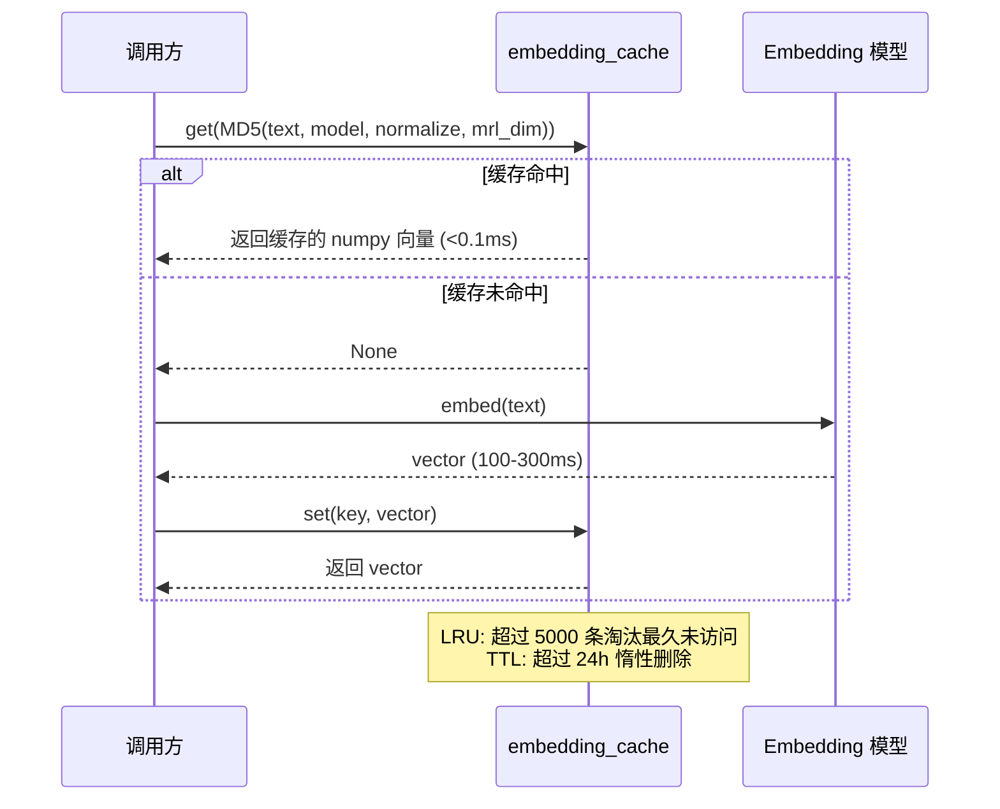

---

## 3. L2 磁盘缓存

### 3.1 设计说明

L2 磁盘缓存使用第三方库 `diskcache` 实现，它基于 SQLite + 文件系统存储，具备以下优势：

- **持久化**：进程重启后缓存仍然有效，基于文件内容哈希的缓存键保证一致性
- **自动 LRU**：diskcache 内置基于访问时间的自动淘汰，设置 `size_limit` 后自动管理
- **线程安全**：diskcache 内部使用文件锁，支持多线程并发读写
- **大值支持**：大文件（如视频帧）直接存储在文件系统，SQLite 仅存元数据，避免数据库膨胀
- **快速随机访问**：NVMe SSD 随机读取延时 ~0.1ms，缓存读取比重新推理快 1000-600000 倍

四种缓存实例的用途和容量规划：

| 缓存名 | 存储内容 | 键 | 容量上限 | 单条预估大小 | 可缓存条数 |
|--------|----------|-----|----------|-------------|------------|
| `descriptions` | VLM 生成的文本描述 + 标签 | MD5(文件内容) | 10GB | ~2-5KB (文本) | ~200万-500万条 |
| `asr_transcripts` | ASR 转写文本 + 时间戳 | MD5(音频流内容) | 5GB | ~10-100KB (转写) | ~5万-50万条 |
| `clap_embeddings` | CLAP 音频嵌入向量 | MD5(音频流内容) | 2GB | ~2KB (512维 float32) | ~100万条 |
| `video_frames` | ffmpeg 抽取的视频帧 | MD5(视频内容 + 抽帧参数) | 20GB | ~200KB-1MB (720p JPEG) | ~2万-10万条 |

### 3.2 DiskCacheManager 完整实现

```python
"""
L2 磁盘缓存 — 基于 diskcache 的四种缓存封装

所有缓存以文件内容 MD5 为键，文件内容不变则缓存永久有效。
diskcache 内置 LRU 自动淘汰，超容量限制时自动删除最久未访问的条目。
"""

import os
import hashlib
import pickle
import json
from pathlib import Path
from typing import Any, Optional, Union

try:
    import diskcache as dc
except ImportError:
    raise ImportError(
        "diskcache is required. Install with: pip install diskcache"
    )


class DiskCacheManager:
    """
    L2 磁盘缓存管理器

    管理四种独立的 diskcache 实例:
      - descriptions: VLM 描述缓存 (10GB)
      - asr_transcripts: ASR 转写缓存 (5GB)
      - clap_embeddings: CLAP 嵌入缓存 (2GB)
      - video_frames: 视频帧缓存 (20GB)

    每个实例独立配置容量上限和淘汰策略。
    """

    # 缓存配置: (name, size_limit_bytes, description)
    CACHE_CONFIGS = {
        "descriptions":    (10 * 1024**3, "VLM 描述缓存"),
        "asr_transcripts":  (5 * 1024**3, "ASR 转写缓存"),
        "clap_embeddings":  (2 * 1024**3, "CLAP 嵌入缓存"),
        "video_frames":    (20 * 1024**3, "视频帧缓存"),
    }

    def __init__(self, base_dir: str = "~/.multimodal/cache"):
        """
        Args:
            base_dir: 缓存根目录，所有子缓存在此目录下创建子文件夹
        """
        self.base_dir = Path(base_dir).expanduser()
        self.base_dir.mkdir(parents=True, exist_ok=True)

        self._caches: dict[str, dc.Cache] = {}

        for name, (size_limit, desc) in self.CACHE_CONFIGS.items():
            cache_dir = self.base_dir / name
            cache_dir.mkdir(parents=True, exist_ok=True)
            self._caches[name] = dc.Cache(
                directory=str(cache_dir),
                size_limit=size_limit,
                # diskcache 使用 cPickle 序列化，对 numpy 数组有优化
                disk=dc.JSONDisk if name == "descriptions" else dc.Disk,
            )
            print(f"[DiskCache] Initialized '{name}': {desc} at {cache_dir}")

    # ─── 文件哈希计算 ──────────────────────────────────────────

    @staticmethod
    def compute_file_hash(file_path: str, chunk_size: int = 8192) -> str:
        """
        计算文件内容的 MD5 哈希

        用于作为缓存键，文件内容不变则哈希不变，缓存命中。
        分块读取避免大文件一次性加载到内存。

        Args:
            file_path: 文件路径
            chunk_size: 读取块大小 (8KB)
        """
        md5 = hashlib.md5()
        with open(file_path, "rb") as f:
            while True:
                chunk = f.read(chunk_size)
                if not chunk:
                    break
                md5.update(chunk)
        return md5.hexdigest()

    @staticmethod
    def compute_content_hash(content: Union[str, bytes]) -> str:
        """
        计算任意内容的 MD5 哈希

        用于对字符串或字节流生成缓存键。
        """
        if isinstance(content, str):
            content = content.encode("utf-8")
        return hashlib.md5(content).hexdigest()

    # ─── 通用缓存接口 ──────────────────────────────────────────

    def get(self, cache_name: str, key: str) -> Optional[Any]:
        """
        从指定缓存中获取值

        Args:
            cache_name: 缓存名称 (descriptions/asr_transcripts/clap_embeddings/video_frames)
            key: 缓存键 (通常为文件内容 MD5)
        """
        cache = self._caches.get(cache_name)
        if cache is None:
            raise KeyError(f"Unknown cache: {cache_name}")
        return cache.get(key, default=None)

    def set(self, cache_name: str, key: str, value: Any, expire: Optional[float] = None):
        """
        写入指定缓存

        Args:
            cache_name: 缓存名称
            key: 缓存键
            value: 缓存值
            expire: TTL（秒），None 表示永久（默认）
        """
        cache = self._caches.get(cache_name)
        if cache is None:
            raise KeyError(f"Unknown cache: {cache_name}")
        cache.set(key, value, expire=expire)

    def delete(self, cache_name: str, key: str) -> bool:
        """删除指定缓存条目"""
        cache = self._caches.get(cache_name)
        if cache is None:
            raise KeyError(f"Unknown cache: {cache_name}")
        return cache.delete(key)

    def exists(self, cache_name: str, key: str) -> bool:
        """检查缓存键是否存在"""
        cache = self._caches.get(cache_name)
        if cache is None:
            raise KeyError(f"Unknown cache: {cache_name}")
        return key in cache

    # ─── 专用缓存接口 ──────────────────────────────────────────

    def get_vlm_description(self, file_hash: str) -> Optional[dict]:
        """
        获取 VLM 描述缓存

        Returns:
            {"description": str, "tags": dict, "model": str} 或 None
        """
        return self.get("descriptions", file_hash)

    def set_vlm_description(
        self, file_hash: str, description: str, tags: dict, model: str
    ):
        """写入 VLM 描述缓存"""
        self.set("descriptions", file_hash, {
            "description": description,
            "tags": tags,
            "model": model,
            "timestamp": os.path.getmtime("."),  # 占位，实际用 time.time()
        })

    def get_asr_transcript(self, audio_hash: str) -> Optional[dict]:
        """
        获取 ASR 转写缓存

        Returns:
            {"text": str, "segments": list, "language": str} 或 None
        """
        return self.get("asr_transcripts", audio_hash)

    def set_asr_transcript(
        self, audio_hash: str, text: str, segments: list, language: str
    ):
        """写入 ASR 转写缓存"""
        self.set("asr_transcripts", audio_hash, {
            "text": text,
            "segments": segments,
            "language": language,
        })

    def get_clap_embedding(self, audio_hash: str) -> Optional["np.ndarray"]:
        """
        获取 CLAP 嵌入缓存

        Returns:
            numpy.ndarray (512维 float32) 或 None
        """
        return self.get("clap_embeddings", audio_hash)

    def set_clap_embedding(self, audio_hash: str, embedding):
        """写入 CLAP 嵌入缓存"""
        self.set("clap_embeddings", audio_hash, embedding)

    def get_video_frames(self, video_hash: str, frame_params: str) -> Optional[list]:
        """
        获取视频帧缓存

        Args:
            video_hash: 视频内容 MD5
            frame_params: 抽帧参数标识 (如 "fps=1,resolution=720p")

        Returns:
            list[bytes] (JPEG 帧列表) 或 None
        """
        key = f"{video_hash}::{frame_params}"
        return self.get("video_frames", key)

    def set_video_frames(
        self, video_hash: str, frame_params: str, frames: list
    ):
        """写入视频帧缓存"""
        key = f"{video_hash}::{frame_params}"
        self.set("video_frames", key, frames)

    # ─── 统计与管理 ────────────────────────────────────────────

    def stats(self) -> dict:
        """返回所有缓存的统计信息"""
        result = {}
        for name, cache in self._caches.items():
            result[name] = {
                "size_bytes": cache.volume(),
                "size_mb": round(cache.volume() / 1024 / 1024, 2),
                "size_gb": round(cache.volume() / 1024**3, 2),
                "limit_gb": round(
                    self.CACHE_CONFIGS[name][0] / 1024**3, 2
                ),
                "item_count": len(cache),
                "directory": cache.directory,
            }
        return result

    def clear(self, cache_name: Optional[str] = None):
        """
        清空缓存

        Args:
            cache_name: 指定缓存名称，None 表示清空全部
        """
        if cache_name:
            cache = self._caches.get(cache_name)
            if cache:
                cache.clear()
        else:
            for cache in self._caches.values():
                cache.clear()

    def close(self):
        """关闭所有缓存连接"""
        for cache in self._caches.values():
            cache.close()
```

### 3.3 缓存读写流程

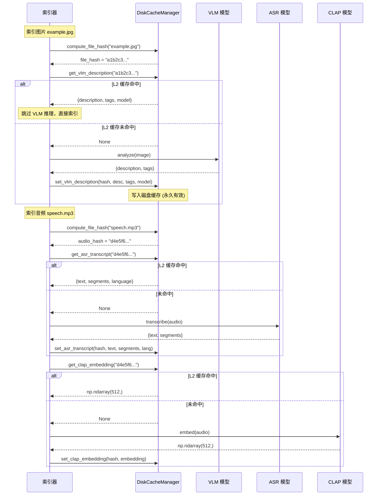

---

## 4. 缓存策略

### 4.1 缓存决策矩阵

系统中的每个计算密集型操作都有对应的缓存策略。下表完整列出所有可缓存操作及其策略：

| 操作 | 缓存层 | 缓存键 | TTL | LRU 容量 | 估算命中率 | 命中收益 |
|------|--------|--------|-----|----------|-----------|----------|
| 文本→向量 (Embedding) | L1 内存 | MD5(text+model+norm+mrl) | 24h | 5000 | 85-95% | 节省 100-300ms |
| 查询→检索结果 | L1 内存 | MD5(query+filter+topk+mode) | 10min | 200 | 60-80% | 节省 5-15ms |
| 图片→VLM 描述 | L2 磁盘 | MD5(文件内容) | 永久 | 10GB | 95-99% | 节省 2-8s |
| 视频→VLM 描述 | L2 磁盘 | MD5(文件内容) | 永久 | 10GB | 95-99% | 节省 5-15s |
| 音频→ASR 转写 | L2 磁盘 | MD5(音频流内容) | 永久 | 5GB | 90-95% | 节省 3-30s |
| 音频→CLAP 嵌入 | L2 磁盘 | MD5(音频流内容) | 永久 | 2GB | 90-95% | 节省 0.5-2s |
| 视频→抽帧 | L2 磁盘 | MD5(视频+抽帧参数) | 永久 | 20GB | 85-95% | 节省 1-5s |

### 4.2 TTL 策略详解

```mermaid
flowchart LR
    subgraph "TTL 长期 (24h)"
        EMB[embedding_cache<br>文本→向量]
        NOTE1[文本内容不变<br>向量结果确定<br>TTL 仅防止<br>内存长期占用]
    end

    subgraph "TTL 短期 (10min)"
        SRCH[search_cache<br>查询→结果]
        NOTE2[索引可能更新<br>新文件入索引<br>10min 平衡新鲜度<br>与性能]
    end

    subgraph "永久 (基于内容哈希)"
        DESC[descriptions<br>VLM 描述]
        ASR_C[asr_transcripts<br>ASR 转写]
        CLAP_C[clap_embeddings<br>CLAP 嵌入]
        FRAMES[video_frames<br>视频帧]
        NOTE3[文件内容不变<br>推理结果不变<br>永久有效<br>文件更新时主动失效]
    end

    style EMB fill:#1a201a,stroke:#10B981
    style SRCH fill:#1a201a,stroke:#10B981
    style DESC fill:#1a1520,stroke:#8B5CF6
    style ASR_C fill:#1a1520,stroke:#8B5CF6
    style CLAP_C fill:#1a1520,stroke:#8B5CF6
    style FRAMES fill:#1a1520,stroke:#8B5CF6
```

**TTL 设计原则**：

1. **embedding_cache (24h)**：文本到向量的映射由 Embedding 模型权重决定，模型不变则映射不变。24h TTL 足够覆盖一天的查询周期，同时避免长期不使用的向量占用内存。模型升级时通过 `embedding_cache.clear()` 手动清除。

2. **search_cache (10min)**：检索结果依赖于 Qdrant 中的索引内容，新文件入库后旧缓存结果可能不完整。10min TTL 确保用户在持续索引时仍能看到最新内容的概率，同时高频查询在 10min 窗口内命中缓存。主动触发失效场景：批量索引完成后调用 `search_cache.clear()`。

3. **L2 磁盘缓存 (永久)**：基于文件内容 MD5 哈希，文件内容不变则推理结果不变。唯一的失效场景是文件被修改或删除（见 [第 11 节 缓存一致性](#11-缓存一致性)）。diskcache 的 `size_limit` 提供 LRU 自动淘汰，超限时自动删除最久未访问的条目。

### 4.3 LRU 容量规划

| 缓存 | LRU 容量 | 单条大小 | 总内存/磁盘 | 预估命中率 | 规划依据 |
|------|----------|----------|-------------|-----------|----------|
| embedding_cache | 5000 | ~8KB (2048维 float32) | ~40-120MB | 85-95% | 覆盖用户一天内 5000 个不同查询词汇 |
| search_cache | 200 | ~50KB-1MB | ~10-200MB | 60-80% | 检索结果较大，200 条平衡内存与命中率 |
| descriptions | 10GB | ~2-5KB | 10GB | 95-99% | 可缓存 200-500 万文件的 VLM 描述 |
| asr_transcripts | 5GB | ~10-100KB | 5GB | 90-95% | 可缓存 5-50 万音频文件的 ASR 转写 |
| clap_embeddings | 2GB | ~2KB (512维 float32) | 2GB | 90-95% | 可缓存约 100 万音频的 CLAP 嵌入 |
| video_frames | 20GB | ~200KB-1MB | 20GB | 85-95% | 可缓存 2-10 万视频的抽帧结果 |

### 4.4 缓存失效策略汇总

```mermaid
flowchart TB
    subgraph "主动失效"
        FILE_UPDATE[文件修改] --> INVALIDATE_HASH[基于旧 MD5 失效<br>L2 全部相关条目]
        FILE_DELETE[文件删除] --> INVALIDATE_HASH
        MODEL_UPGRADE[模型升级] --> CLEAR_EMB[清空 embedding_cache<br>清空 descriptions]
        MANUAL[手动清除] --> CLEAR_ALL[清空指定缓存]
    end

    subgraph "自动失效"
        TTL_EXPIRE[TTL 到期] --> LAZY_DELETE[惰性删除<br>下次访问时检查]
        CLEANUP_THREAD[后台清理线程] --> ACTIVE_DELETE[主动扫描删除<br>每 60s 执行]
    end

    subgraph "LRU 淘汰"
        L1_FULL[L1 超容量] --> EVICT_LRU_L1[淘汰最久未访问条目]
        L2_FULL[L2 超容量] --> EVICT_LRU_L2[diskcache 自动淘汰]
        MEM_FULL[内存超上限] --> EVICT_MEM[按 LRU 批量淘汰]
    end

    style INVALIDATE_HASH fill:#3a1520,stroke:#EF4444
    style CLEAR_EMB fill:#3a1520,stroke:#EF4444
    style LAZY_DELETE fill:#3a2a15,stroke:#F59E0B
    style EVICT_LRU_L1 fill:#1a201a,stroke:#10B981
    style EVICT_LRU_L2 fill:#1a1520,stroke:#8B5CF6
```

### 4.5 缓存键设计规范

缓存键的设计直接影响命中率和正确性。本系统的缓存键遵循以下原则：

1. **包含所有影响输出的参数**：向量化结果受模型名、归一化方式、MRL 维度影响，这些参数必须纳入缓存键
2. **使用 MD5 哈希**：原始键可能很长（文件路径 + 参数），MD5 将其统一为 32 字符定长字符串
3. **参数排序**：字典类参数序列化前按 key 排序，避免参数顺序不同导致缓存未命中
4. **内容哈希 vs 路径哈希**：L2 磁盘缓存使用文件内容 MD5（文件移动/重命名后仍命中），不使用文件路径

```python
# 正确: 包含所有影响输出的参数
emb_key = MD5(text + model_name + normalize + mrl_dim)

# 正确: L2 使用内容哈希，文件移动后仍命中
vlm_key = MD5(file_content_bytes)

# 错误: 仅用文本本身，模型升级后返回过期向量
bad_key = MD5(text)

# 错误: 使用文件路径，文件移动后缓存未命中
bad_key = MD5(file_path)
```

---

## 5. 错误分级与处理

### 5.1 四级错误体系

系统将所有可能发生的错误分为四个级别，每个级别有明确的处理策略和用户感知：

```mermaid
flowchart TB
    ERROR[异常发生]

    ERROR --> L1{致命错误?<br>FatalError}
    ERROR --> L2{输入错误?<br>InputError}
    ERROR --> L3{可重试错误?<br>RetryableError}
    ERROR --> L4{可恢复错误?<br>RecoverableError}

    L1 -->|是| R1[返回 HTTP 503<br>停止处理<br>告警通知]
    L1 -->|否| L2

    L2 -->|是| R2[返回 HTTP 400<br>提示用户修正输入<br>不重试不降级]
    L2 -->|否| L3

    L3 -->|是| R3[指数退避重试<br>最多 3 次<br>重试失败则降级]
    L3 -->|否| L4

    L4 -->|是| R4[执行降级策略<br>跳过失败模态<br>保证基本可用]
    L4 -->|否| DEFAULT[按未知错误处理<br>记录日志<br>返回 500]

    style L1 fill:#3a1520,stroke:#EF4444
    style L2 fill:#3a2a15,stroke:#F59E0B
    style L3 fill:#1a2a20,stroke:#10B981
    style L4 fill:#1a1520,stroke:#8B5CF6
```

### 5.2 错误级别定义

| 级别 | 错误类型 | HTTP 状态码 | 典型场景 | 处理策略 | 用户感知 |
|------|----------|------------|----------|----------|----------|
| **致命** | `FatalError` | 503 | Qdrant 连接断开、内存耗尽 (OOM)、磁盘空间不足 | 停止处理，返回 503，记录错误日志，触发告警 | "服务暂时不可用，请稍后重试" |
| **输入错误** | `InputError` | 400 | 文件格式不支持、文件损坏无法读取、查询文本为空 | 返回 400，提示具体错误原因，不重试不降级 | "文件格式不支持: .xxx，请使用 jpg/png/mp4/mp3 等格式" |
| **可重试** | `RetryableError` | — | 网络超时、GPU 临时占用、模型加载竞争 | 指数退避重试（最多 3 次），重试失败后降级 | 延时增加 2-30s，最终可能降级 |
| **可恢复** | `RecoverableError` | 200 (降级) | VLM 推理失败、ASR 转写失败、CLAP 嵌入失败、Reranker 超时 | 执行降级策略，跳过失败模态，返回部分结果 | 结果可能缺少某个模态的描述，但基本可用 |

### 5.3 错误类实现

```python
"""
四级错误体系 — 异常类定义与错误分级逻辑

所有自定义异常继承自统一基类 MultimodalError，
通过 error_level 属性区分错误级别。
"""

from enum import IntEnum
from typing import Optional, Any


class ErrorLevel(IntEnum):
    """错误级别枚举"""
    FATAL = 4         # 致命: 503，停止服务
    INPUT = 3         # 输入错误: 400，用户修正
    RETRYABLE = 2     # 可重试: 指数退避
    RECOVERABLE = 1   # 可恢复: 降级处理


class MultimodalError(Exception):
    """多模态系统错误基类"""

    error_level: ErrorLevel = ErrorLevel.RECOVERABLE
    http_status: int = 200
    user_message: str = "处理过程中发生错误"

    def __init__(
        self,
        message: str,
        user_message: Optional[str] = None,
        context: Optional[dict] = None,
    ):
        super().__init__(message)
        self.message = message
        self.user_message = user_message or self.user_message
        self.context = context or {}

    def to_dict(self) -> dict:
        """序列化为字典（用于 API 响应）"""
        return {
            "error": self.__class__.__name__,
            "level": self.error_level.name,
            "http_status": self.http_status,
            "message": self.message,
            "user_message": self.user_message,
            "context": self.context,
        }


# ─── 致命错误 ──────────────────────────────────────────────────

class FatalError(MultimodalError):
    """
    致命错误 — 服务无法继续运行

    触发场景:
      - Qdrant 向量数据库连接断开
      - 系统内存耗尽 (OOM)
      - 磁盘空间不足，无法写入缓存
      - 核心依赖库加载失败

    处理: 返回 503，停止当前请求处理，记录 CRITICAL 日志。
    """
    error_level = ErrorLevel.FATAL
    http_status = 503
    user_message = "服务暂时不可用，请稍后重试"


class QdrantConnectionError(FatalError):
    """Qdrant 连接异常"""
    def __init__(self, message: str = "无法连接到 Qdrant 向量数据库"):
        super().__init__(message, context={"component": "qdrant"})


class OOMError(FatalError):
    """内存溢出"""
    def __init__(self, required_mb: float, available_mb: float):
        super().__init__(
            f"内存不足: 需要 {required_mb:.0f}MB，可用 {available_mb:.0f}MB",
            context={"required_mb": required_mb, "available_mb": available_mb},
        )


class DiskFullError(FatalError):
    """磁盘空间不足"""
    def __init__(self, path: str, required_gb: float, available_gb: float):
        super().__init__(
            f"磁盘空间不足: {path} 需要 {required_gb:.1f}GB，可用 {available_gb:.1f}GB",
            context={"path": path, "required_gb": required_gb, "available_gb": available_gb},
        )


# ─── 输入错误 ──────────────────────────────────────────────────

class InputError(MultimodalError):
    """
    输入错误 — 用户请求不合法

    触发场景:
      - 文件格式不支持
      - 文件损坏无法解码
      - 查询文本为空
      - 参数值超出合法范围

    处理: 返回 400，提示具体错误，不重试不降级。
    """
    error_level = ErrorLevel.INPUT
    http_status = 400
    user_message = "输入参数有误，请检查后重试"


class UnsupportedFormatError(InputError):
    """不支持的文件格式"""
    def __init__(self, file_path: str, ext: str):
        super().__init__(
            f"不支持的文件格式: {ext}",
            user_message=f"文件 {file_path} 的格式 .{ext} 不支持，"
                         f"请使用 jpg/png/webp/mp4/mov/mp3/wav/flac 等格式",
            context={"file_path": file_path, "extension": ext},
        )


class CorruptedFileError(InputError):
    """文件损坏"""
    def __init__(self, file_path: str, reason: str = ""):
        super().__init__(
            f"文件损坏或无法解码: {file_path} ({reason})",
            user_message=f"文件 {file_path} 已损坏或无法读取，请检查文件完整性",
            context={"file_path": file_path, "reason": reason},
        )


class EmptyQueryError(InputError):
    """空查询"""
    def __init__(self):
        super().__init__(
            "查询文本不能为空",
            user_message="请输入查询内容",
        )


# ─── 可重试错误 ────────────────────────────────────────────────

class RetryableError(MultimodalError):
    """
    可重试错误 — 临时性故障，重试可能成功

    触发场景:
      - 模型加载超时（其他进程占用 GPU）
      - 网络超时（如有外部 API 调用）
      - 文件锁竞争
      - GPU 内存碎片导致推理失败

    处理: 指数退避重试（最多 3 次），重试全部失败后降级为可恢复错误。
    """
    error_level = ErrorLevel.RETRYABLE
    http_status = 200
    user_message = "处理暂时遇到问题，正在重试..."


class ModelLoadTimeoutError(RetryableError):
    """模型加载超时"""
    def __init__(self, model_name: str, timeout: float):
        super().__init__(
            f"模型加载超时: {model_name} ({timeout}s)",
            context={"model": model_name, "timeout": timeout},
        )


class InferenceTimeoutError(RetryableError):
    """推理超时"""
    def __init__(self, model_name: str, timeout: float):
        super().__init__(
            f"推理超时: {model_name} ({timeout}s)",
            context={"model": model_name, "timeout": timeout},
        )


# ─── 可恢复错误 ────────────────────────────────────────────────

class RecoverableError(MultimodalError):
    """
    可恢复错误 — 单一模态失败，可降级处理

    触发场景:
      - VLM 推理失败（模型崩溃、输出异常）
      - ASR 转写失败（音频质量太差）
      - CLAP 嵌入失败
      - Reranker 加载失败
      - LLM 生成推荐理由失败

    处理: 执行降级策略，跳过失败模态，返回部分结果。
    """
    error_level = ErrorLevel.RECOVERABLE
    http_status = 200
    user_message = "部分功能降级运行"


class VLMInferenceError(RecoverableError):
    """VLM 推理失败"""
    def __init__(self, file_path: str, reason: str = ""):
        super().__init__(
            f"VLM 推理失败: {file_path} ({reason})",
            user_message="视觉理解模块暂时不可用，将仅使用文件名和元数据索引",
            context={"file_path": file_path, "reason": reason, "component": "vlm"},
        )


class ASRTranscriptionError(RecoverableError):
    """ASR 转写失败"""
    def __init__(self, file_path: str, reason: str = ""):
        super().__init__(
            f"ASR 转写失败: {file_path} ({reason})",
            user_message="语音转写模块暂时不可用，将仅使用音频特征索引",
            context={"file_path": file_path, "reason": reason, "component": "asr"},
        )


class CLAPEmbeddingError(RecoverableError):
    """CLAP 嵌入失败"""
    def __init__(self, file_path: str, reason: str = ""):
        super().__init__(
            f"CLAP 嵌入失败: {file_path} ({reason})",
            user_message="音频嵌入模块暂时不可用，将仅使用语音转写索引",
            context={"file_path": file_path, "reason": reason, "component": "clap"},
        )


class RerankerError(RecoverableError):
    """Reranker 精排失败"""
    def __init__(self, reason: str = ""):
        super().__init__(
            f"Reranker 精排失败: {reason}",
            user_message="精排模块暂时不可用，将使用粗排结果",
            context={"reason": reason, "component": "reranker"},
        )


class LLMGenerationError(RecoverableError):
    """LLM 推荐理由生成失败"""
    def __init__(self, reason: str = ""):
        super().__init__(
            f"LLM 推荐理由生成失败: {reason}",
            user_message="推荐理由生成暂时不可用，将仅显示排序结果",
            context={"reason": reason, "component": "llm"},
        )
```

### 5.4 错误处理流程

```python
"""
错误处理入口 — 统一异常分发器

所有模块的异常通过此函数统一处理，根据错误级别执行对应策略。
"""

import logging
import traceback

logger = logging.getLogger("multimodal.errors")


def handle_error(
    error: Exception,
    context: Optional[dict] = None,
    enable_retry: bool = True,
    enable_degradation: bool = True,
) -> dict:
    """
    统一错误处理

    Args:
        error: 捕获的异常
        context: 额外上下文信息
        enable_retry: 是否允许重试
        enable_degradation: 是否允许降级

    Returns:
        错误响应字典，包含错误级别、状态码、用户消息等
    """
    # 非系统自定义异常，包装为可恢复错误
    if not isinstance(error, MultimodalError):
        logger.error(
            f"Unhandled exception: {error}\n{traceback.format_exc()}"
        )
        error = RecoverableError(
            str(error),
            user_message="处理过程中发生未知错误",
            context={"original_type": type(error).__name__},
        )

    level = error.error_level
    response = error.to_dict()
    if context:
        response["context"].update(context)

    if level == ErrorLevel.FATAL:
        # 致命错误: 记录 CRITICAL 日志，返回 503
        logger.critical(
            f"FATAL ERROR: {error.message} | Context: {error.context}"
        )
        # TODO: 触发告警通知（邮件/Slack/飞书）

    elif level == ErrorLevel.INPUT:
        # 输入错误: 记录 INFO 日志（用户行为问题，非系统故障）
        logger.info(f"Input error: {error.message}")

    elif level == ErrorLevel.RETRYABLE:
        # 可重试错误: 由 retry_with_backoff 装饰器处理
        # 如果到达此处说明重试已耗尽
        logger.warning(
            f"Retryable error (retries exhausted): {error.message}"
        )
        if enable_degradation:
            response["action"] = "degrade"
        else:
            response["action"] = "fail"

    elif level == ErrorLevel.RECOVERABLE:
        # 可恢复错误: 降级处理
        logger.warning(f"Recoverable error, degrading: {error.message}")
        response["action"] = "degrade"

    return response
```

---

## 6. 降级策略

### 6.1 降级链设计

降级策略的核心思想是 **"部分优于全部"**——当某个模态的模型推理失败时，不是放弃整个文件的索引，而是跳过失败模态，使用剩余可用模态完成索引，保证文件至少以最低质量入库可搜。

```mermaid
flowchart TB
    subgraph "视频降级链"
        V_START[视频文件] --> V_VLM{VLM 可用?}
        V_VLM -->|是| V_ASR{ASR 可用?}
        V_VLM -->|否| V_ASR_ONLY[跳过画面<br>仅索引声音<br>ASR + CLAP]
        V_ASR -->|是| V_FULL[全模态索引<br>VLM + ASR + CLAP]
        V_ASR -->|否| V_VLM_ONLY[跳过声音<br>仅索引画面<br>VLM 描述 + 标签]
        V_VLM_ONLY --> V_FILENAME
        V_ASR_ONLY --> V_FILENAME
        V_FILENAME[降级到文件名<br>仅元数据索引]
    end

    subgraph "音频降级链"
        A_START[音频文件] --> A_ASR{ASR 可用?}
        A_ASR -->|是| A_CLAP{CLAP 可用?}
        A_ASR -->|否| A_CLAP_ONLY[仅用 CLAP<br>音频嵌入向量]
        A_CLAP -->|是| A_FULL[全模态索引<br>ASR 转写 + CLAP 嵌入]
        A_CLAP -->|否| A_ASR_ONLY[仅用 ASR<br>语音转写文本]
        A_ASR_ONLY --> A_FILENAME
        A_CLAP_ONLY --> A_FILENAME
        A_FILENAME[降级到文件名<br>仅元数据索引]
    end

    subgraph "检索降级链"
        S_START[检索请求] --> S_RERANK{Reranker 可用?}
        S_RERANK -->|是| S_LLM{LLM 可用?}
        S_RERANK -->|否| S_SKIP_RERANK[跳过精排<br>使用粗排结果]
        S_LLM -->|是| S_FULL[完整推荐<br>精排 + 推荐理由]
        S_LLM -->|否| S_SKIP_LLM[跳过推荐理由<br>仅返回精排排序]
        S_SKIP_RERANK --> S_OUTPUT[返回 Top-10]
        S_SKIP_LLM --> S_OUTPUT
        S_FULL --> S_OUTPUT
    end

    style V_FULL fill:#1a201a,stroke:#10B981
    style V_FILENAME fill:#3a1520,stroke:#EF4444
    style A_FULL fill:#1a201a,stroke:#10B981
    style A_FILENAME fill:#3a1520,stroke:#EF4444
    style S_FULL fill:#1a201a,stroke:#10B981
    style S_OUTPUT fill:#1a201a,stroke:#10B981
```

### 6.2 降级结果质量矩阵

| 模态 | 正常状态 | 降级 1 | 降级 2 | 最低可用 |
|------|----------|--------|--------|----------|
| **视频** | VLM描述 + 标签 + ASR转写 + CLAP嵌入 | VLM描述 + 标签（跳过声音） | ASR转写 + CLAP嵌入（跳过画面） | 仅文件名 + 元数据 |
| **音频** | ASR转写 + CLAP嵌入 | 仅CLAP嵌入（跳过ASR） | 仅ASR转写（跳过CLAP） | 仅文件名 + 元数据 |
| **图片** | VLM描述 + 标签 + VL-Embedding | — | — | 仅文件名 + 元数据 |
| **检索** | 粗排 + Reranker精排 + LLM推荐理由 | 粗排 + Reranker精排（跳过LLM） | 粗排（跳过精排） | 粗排（必须可用） |

> **注**：图片无中间降级状态，VLM 失败直接降级到文件名。检索的粗排（Qdrant 向量检索）是必须可用的底线，粗排失败属于致命错误。

### 6.3 DegradationHandler 完整实现

```python
"""
降级策略处理器 — DegradationHandler

管理三种模态（视频/音频/检索）的降级链，
在模型推理失败时自动选择降级路径，保证基本可用。
"""

import logging
from dataclasses import dataclass, field
from enum import Enum
from typing import Optional, Callable, Any

logger = logging.getLogger("multimodal.degradation")


class DegradationLevel(Enum):
    """降级级别"""
    FULL = "full"              # 全模态正常
    PARTIAL_VISUAL = "partial_visual"   # 仅画面（跳过声音）
    PARTIAL_AUDIO = "partial_audio"     # 仅声音（跳过画面）
    AUDIO_ONLY = "audio_only"           # 仅音频特征
    TEXT_ONLY = "text_only"             # 仅文本（跳过音频特征）
    FILENAME_ONLY = "filename_only"     # 仅文件名


@dataclass
class DegradationState:
    """降级状态记录"""
    modality: str                           # video / audio / search
    level: DegradationLevel = DegradationLevel.FULL
    failed_components: list[str] = field(default_factory=list)
    skipped_features: list[str] = field(default_factory=list)
    user_notice: str = ""

    def is_degraded(self) -> bool:
        return self.level != DegradationLevel.FULL

    def add_failure(self, component: str, notice: str):
        self.failed_components.append(component)
        if self.user_notice:
            self.user_notice += "; " + notice
        else:
            self.user_notice = notice


class DegradationHandler:
    """
    降级策略处理器

    在模型推理失败时，根据模态和失败组件选择降级路径，
    返回降级后的处理结果和降级状态。

    使用方式:
        handler = DegradationHandler()

        # 视频索引
        state = handler.create_state("video")
        try:
            vlm_result = vlm_analyze(video_path)
        except Exception as e:
            state = handler.handle_vlm_failure(state, str(e))

        if state.level != DegradationLevel.PARTIAL_AUDIO:
            # 画面未降级，继续处理声音
            try:
                asr_result = asr_transcribe(audio_path)
            except Exception as e:
                state = handler.handle_asr_failure(state, str(e))
    """

    def __init__(self):
        self._failure_counts: dict[str, int] = {}

    def create_state(self, modality: str) -> DegradationState:
        """创建降级状态跟踪器"""
        return DegradationState(modality=modality)

    # ─── 视频降级 ──────────────────────────────────────────────

    def handle_vlm_failure(
        self, state: DegradationState, error_msg: str
    ) -> DegradationState:
        """
        视频索引中 VLM 失败的降级处理

        降级路径: VLM失败 → 跳过画面，仅索引声音
        """
        state.add_failure("vlm", "视觉理解模块不可用，跳过画面分析")
        state.skipped_features.extend(["vlm_description", "visual_tags", "visual_embedding"])

        if state.modality == "video":
            state.level = DegradationLevel.PARTIAL_AUDIO
            logger.warning(
                f"Video degradation: VLM failed, indexing audio only. "
                f"Error: {error_msg}"
            )

        self._record_failure("vlm")
        return state

    def handle_asr_failure(
        self, state: DegradationState, error_msg: str
    ) -> DegradationState:
        """
        视频索引中 ASR 失败的降级处理

        降级路径:
          - 如果画面可用: ASR失败 → 跳过语音，仅索引画面
          - 如果画面已降级: ASR失败 → 降级到文件名
        """
        state.add_failure("asr", "语音转写模块不可用，跳过语音内容")
        state.skipped_features.extend(["asr_transcript", "asr_text_embedding"])

        if state.modality == "video":
            if state.level == DegradationLevel.FULL:
                # 画面正常，仅跳过语音
                state.level = DegradationLevel.PARTIAL_VISUAL
                logger.warning(
                    f"Video degradation: ASR failed, indexing visual only. "
                    f"Error: {error_msg}"
                )
            elif state.level == DegradationLevel.PARTIAL_AUDIO:
                # 画面已降级，ASR 也失败，降级到文件名
                state.level = DegradationLevel.FILENAME_ONLY
                logger.warning(
                    f"Video degradation: both VLM and ASR failed, "
                    f"falling back to filename only. Error: {error_msg}"
                )
        elif state.modality == "audio":
            if state.level == DegradationLevel.FULL:
                # 音频: ASR失败，尝试 CLAP
                state.level = DegradationLevel.AUDIO_ONLY
                logger.warning(
                    f"Audio degradation: ASR failed, using CLAP only. "
                    f"Error: {error_msg}"
                )

        self._record_failure("asr")
        return state

    def handle_clap_failure(
        self, state: DegradationState, error_msg: str
    ) -> DegradationState:
        """
        音频/视频中 CLAP 失败的降级处理

        降级路径:
          - 如果 ASR 可用: CLAP失败 → 仅用 ASR 文本
          - 如果 ASR 已降级: CLAP失败 → 降级到文件名
        """
        state.add_failure("clap", "音频嵌入模块不可用，跳过音频特征向量")
        state.skipped_features.extend(["clap_embedding", "audio_vector"])

        if state.modality == "audio":
            if state.level == DegradationLevel.FULL:
                # ASR 正常，仅跳过 CLAP
                state.level = DegradationLevel.TEXT_ONLY
                logger.warning(
                    f"Audio degradation: CLAP failed, using ASR text only. "
                    f"Error: {error_msg}"
                )
            elif state.level == DegradationLevel.AUDIO_ONLY:
                # ASR 已失败，CLAP 也失败，降级到文件名
                state.level = DegradationLevel.FILENAME_ONLY
                logger.warning(
                    f"Audio degradation: both ASR and CLAP failed, "
                    f"falling back to filename only. Error: {error_msg}"
                )
        elif state.modality == "video":
            if state.level == DegradationLevel.PARTIAL_AUDIO:
                # 视频已降级到仅声音，但 CLAP 也失败了
                # 检查 ASR 是否可用
                if "asr" not in state.failed_components:
                    state.level = DegradationLevel.TEXT_ONLY
                else:
                    state.level = DegradationLevel.FILENAME_ONLY

        self._record_failure("clap")
        return state

    # ─── 检索降级 ──────────────────────────────────────────────

    def handle_reranker_failure(
        self, state: DegradationState, error_msg: str
    ) -> DegradationState:
        """
        检索中 Reranker 失败的降级处理

        降级路径: Reranker失败 → 跳过精排，使用粗排结果
        """
        state.modality = "search"
        state.add_failure("reranker", "精排模块不可用，使用粗排结果")
        state.skipped_features.append("rerank_scores")

        if state.level == DegradationLevel.FULL:
            state.level = DegradationLevel.PARTIAL_VISUAL  # 复用级别表示"部分功能"
            logger.warning(
                f"Search degradation: Reranker failed, using raw search results. "
                f"Error: {error_msg}"
            )

        self._record_failure("reranker")
        return state

    def handle_llm_failure(
        self, state: DegradationState, error_msg: str
    ) -> DegradationState:
        """
        检索中 LLM 推荐理由生成失败的降级处理

        降级路径: LLM失败 → 跳过推荐理由，仅返回排序结果
        """
        state.modality = "search"
        state.add_failure("llm", "推荐理由生成不可用，仅返回排序结果")
        state.skipped_features.append("recommendation_reasons")

        logger.warning(
            f"Search degradation: LLM reason generation failed. "
            f"Error: {error_msg}"
        )

        self._record_failure("llm")
        return state

    # ─── 降级结果构建 ──────────────────────────────────────────

    def build_filename_only_result(self, file_path: str) -> dict:
        """
        构建文件名降级结果 — 所有模态全挂时的最低可用结果

        使用文件名和基本元数据生成最小索引数据，
        保证文件至少能按文件名搜索。
        """
        import os
        from pathlib import Path

        file_stat = os.stat(file_path)
        ext = Path(file_path).suffix.lower().lstrip(".")
        filename = Path(file_path).stem

        # 从文件名提取可能的标签（简单的分词）
        # 例如 "2024_巴黎_旅行_埃菲尔铁塔.jpg" → ["2024", "巴黎", "旅行", "埃菲尔铁塔"]
        simple_tags = []
        for separator in ["_", "-", " "]:
            if separator in filename:
                simple_tags = [
                    p.strip() for p in filename.split(separator)
                    if p.strip() and len(p.strip()) > 1
                ]
                break
        if not simple_tags:
            simple_tags = [filename]

        return {
            "file_path": file_path,
            "description": f"文件名: {filename}",
            "tags": {"filename_tokens": simple_tags},
            "metadata": {
                "file_name": Path(file_path).name,
                "file_extension": ext,
                "file_size": file_stat.st_size,
                "created_at": file_stat.st_ctime,
                "modified_at": file_stat.st_mtime,
            },
            "degraded": True,
            "degradation_level": "filename_only",
        }

    # ─── 统计与监控 ────────────────────────────────────────────

    def _record_failure(self, component: str):
        """记录组件失败次数（用于监控和告警）"""
        self._failure_counts[component] = self._failure_counts.get(component, 0) + 1

    def get_failure_stats(self) -> dict:
        """获取各组件的失败统计"""
        return dict(self._failure_counts)

    def is_component_healthy(self, component: str, threshold: int = 5) -> bool:
        """
        检查组件是否健康

        连续失败次数超过 threshold 时认为组件不健康，
        后续请求应直接跳过该组件（快速失败）。
        """
        return self._failure_counts.get(component, 0) < threshold

    def reset_failure_count(self, component: str):
        """重置组件失败计数（组件恢复后调用）"""
        self._failure_counts.pop(component, None)
        logger.info(f"Component '{component}' failure count reset")
```

### 6.4 降级处理完整示例

```python
"""
降级处理完整示例 — 视频索引的降级流程

展示 DegradationHandler 在实际索引流程中的使用方式。
"""

import asyncio
from typing import Optional


async def index_video_with_degradation(
    video_path: str,
    handler: DegradationHandler,
    disk_cache: DiskCacheManager,
    vlm_fn: Optional[Callable] = None,
    asr_fn: Optional[Callable] = None,
    clap_fn: Optional[Callable] = None,
) -> dict:
    """
    带降级处理的视频索引

    降级链:
      1. 正常: VLM + ASR + CLAP 全模态
      2. VLM 挂: 跳过画面，仅 ASR + CLAP
      3. ASR 挂: 跳过语音，仅 VLM 描述
      4. 全挂: 仅文件名 + 元数据
    """
    state = handler.create_state("video")
    result = {"file_path": video_path, "degraded": False}

    # ── 画面分析 (VLM) ──
    if handler.is_component_healthy("vlm") and vlm_fn:
        file_hash = disk_cache.compute_file_hash(video_path)

        # 优先查 L2 缓存
        cached = disk_cache.get_vlm_description(file_hash)
        if cached:
            result["vlm_description"] = cached["description"]
            result["tags"] = cached["tags"]
        else:
            try:
                desc, tags = await vlm_fn(video_path)
                result["vlm_description"] = desc
                result["tags"] = tags
                disk_cache.set_vlm_description(file_hash, desc, tags, "qwen3-vl")
            except Exception as e:
                state = handler.handle_vlm_failure(state, str(e))

    # ── 声音分析 (ASR + CLAP) ──
    # 如果画面已降级到 PARTIAL_AUDIO，仍需尝试声音分析
    # 如果画面正常 (FULL) 或仅画面 (PARTIAL_VISUAL)，也尝试声音分析
    if state.level != DegradationLevel.FILENAME_ONLY:
        audio_path = extract_audio_track(video_path)
        if audio_path:
            audio_hash = disk_cache.compute_file_hash(audio_path)

            # ASR 转写
            if handler.is_component_healthy("asr") and asr_fn:
                cached_asr = disk_cache.get_asr_transcript(audio_hash)
                if cached_asr:
                    result["asr_text"] = cached_asr["text"]
                else:
                    try:
                        text, segments = await asr_fn(audio_path)
                        result["asr_text"] = text
                        disk_cache.set_asr_transcript(
                            audio_hash, text, segments, "zh"
                        )
                    except Exception as e:
                        state = handler.handle_asr_failure(state, str(e))

            # CLAP 嵌入
            if handler.is_component_healthy("clap") and clap_fn:
                cached_clap = disk_cache.get_clap_embedding(audio_hash)
                if cached_clap is not None:
                    result["audio_vector"] = cached_clap
                else:
                    try:
                        embedding = await clap_fn(audio_path)
                        result["audio_vector"] = embedding
                        disk_cache.set_clap_embedding(audio_hash, embedding)
                    except Exception as e:
                        state = handler.handle_clap_failure(state, str(e))

    # ── 降级到文件名 ──
    if state.level == DegradationLevel.FILENAME_ONLY:
        fallback = handler.build_filename_only_result(video_path)
        result.update(fallback)
        result["degraded"] = True

    # 记录降级状态
    if state.is_degraded():
        result["degraded"] = True
        result["degradation_level"] = state.level.value
        result["degradation_notice"] = state.user_notice
        result["failed_components"] = state.failed_components
        print(f"[Degradation] {video_path}: {state.user_notice}")

    return result


def extract_audio_track(video_path: str) -> Optional[str]:
    """从视频中提取音轨（使用 ffmpeg）"""
    import subprocess
    import tempfile

    audio_path = tempfile.mktemp(suffix=".wav")
    try:
        subprocess.run(
            ["ffmpeg", "-i", video_path, "-vn", "-acodec", "pcm_s16le",
             "-ar", "16000", "-ac", "1", audio_path, "-y"],
            capture_output=True, timeout=60,
        )
        return audio_path
    except Exception:
        return None
```

---

## 7. 重试机制

### 7.1 设计说明

可重试错误（`RetryableError`）通过指数退避（Exponential Backoff）+ 抖动（Jitter）策略进行重试。核心参数：

| 参数 | 值 | 说明 |
|------|-----|------|
| 最大重试次数 | 3 | 超过后降级处理 |
| 基础延迟 | 2s | 第一次重试等待时间 |
| 最大延迟 | 30s | 单次重试等待上限 |
| 退避因子 | 2.0 | 指数底数 |
| 抖动方式 | Full Jitter | `random.uniform(0, calculated_delay)` |

**指数退避公式**：

```
delay = min(base_delay * (factor ^ attempt), max_delay)
jittered_delay = random.uniform(0, delay)
```

**重试时序**：

```
第 0 次尝试 (原始调用)
  ↓ 失败
等待 0~2s (base=2, jitter)
第 1 次重试
  ↓ 失败
等待 0~4s (base*2=4, jitter)
第 2 次重试
  ↓ 失败
等待 0~8s (base*4=8, jitter)
第 3 次重试
  ↓ 失败
重试耗尽 → 降级处理
```

> **选择 Full Jitter 的原因**：相比 Decorrelated Jitter 或 Equal Jitter，Full Jitter（完全随机化到 `[0, delay]` 区间）能有效避免多个并发请求同时重试导致的"惊群效应"，在分布式/多线程场景下最优。虽然本系统是单机运行，但多模态并发处理仍可能同时触发多个重试。

### 7.2 retry_with_backoff 装饰器完整实现

```python
"""
重试机制 — 指数退避 + 抖动

支持同步函数和异步函数，通过装饰器使用。
重试耗尽后将 RetryableError 转换为 RecoverableError 触发降级。
"""

import asyncio
import functools
import logging
import random
import time
from typing import Callable, Optional, Type, Tuple, Union

logger = logging.getLogger("multimodal.retry")


def retry_with_backoff(
    max_retries: int = 3,
    base_delay: float = 2.0,
    max_delay: float = 30.0,
    backoff_factor: float = 2.0,
    jitter: str = "full",
    retryable_exceptions: Optional[Tuple[Type[Exception], ...]] = None,
    on_retry: Optional[Callable[[int, Exception], None]] = None,
):
    """
    指数退避重试装饰器

    支持同步和异步函数。自动检测函数类型并选择对应的重试逻辑。

    Args:
        max_retries: 最大重试次数（不包含原始调用）
        base_delay: 基础延迟（秒），第一次重试的等待时间基准
        max_delay: 最大延迟（秒），单次重试等待上限
        backoff_factor: 退避因子，delay = base * factor^attempt
        jitter: 抖动策略
            - "full": uniform(0, delay)  — 完全随机化，防惊群
            - "equal": delay/2 + uniform(0, delay/2)  — 一半固定一半随机
            - "decorrelated": uniform(base, prev_delay * factor)  — 去相关
            - None: 不加抖动，使用固定 delay
        retryable_exceptions: 可重试的异常类型元组
            None 表示重试所有 Exception 子类
        on_retry: 每次重试前的回调函数 (attempt, exception) -> None

    Returns:
        装饰器函数

    使用示例:
        @retry_with_backoff(max_retries=3, base_delay=2.0)
        async def vlm_analyze(image_path):
            ...

        @retry_with_backoff(
            max_retries=5,
            base_delay=1.0,
            retryable_exceptions=(ModelLoadTimeoutError, InferenceTimeoutError),
        )
        def load_model(model_name):
            ...
    """
    # 默认可重试异常
    if retryable_exceptions is None:
        retryable_exceptions = (RetryableError,)

    def decorator(func):
        # 判断是同步还是异步函数
        is_async = asyncio.iscoroutinefunction(func)

        @functools.wraps(func)
        async def async_wrapper(*args, **kwargs):
            return await _async_retry(
                func, args, kwargs,
                max_retries, base_delay, max_delay, backoff_factor,
                jitter, retryable_exceptions, on_retry,
            )

        @functools.wraps(func)
        def sync_wrapper(*args, **kwargs):
            return _sync_retry(
                func, args, kwargs,
                max_retries, base_delay, max_delay, backoff_factor,
                jitter, retryable_exceptions, on_retry,
            )

        return async_wrapper if is_async else sync_wrapper

    return decorator


def _calculate_delay(
    attempt: int,
    base_delay: float,
    max_delay: float,
    backoff_factor: float,
    jitter: Optional[str],
    prev_delay: Optional[float] = None,
) -> float:
    """
    计算重试延迟

    Args:
        attempt: 当前重试次数 (0 = 第一次重试)
        base_delay: 基础延迟
        max_delay: 最大延迟上限
        backoff_factor: 退避因子
        jitter: 抖动策略
        prev_delay: 上一次的延迟（decorrelated 抖动需要）

    Returns:
        实际等待时间（秒）
    """
    # 指数退避: base * factor^attempt
    delay = min(base_delay * (backoff_factor ** attempt), max_delay)

    if jitter is None:
        return delay

    if jitter == "full":
        # Full Jitter: 完全随机化到 [0, delay]
        return random.uniform(0, delay)

    elif jitter == "equal":
        # Equal Jitter: 一半固定 + 一半随机
        return delay / 2 + random.uniform(0, delay / 2)

    elif jitter == "decorrelated":
        # Decorrelated Jitter: uniform(base, prev * factor)
        if prev_delay is None:
            prev_delay = base_delay
        return min(random.uniform(base_delay, prev_delay * backoff_factor), max_delay)

    return delay


async def _async_retry(
    func, args, kwargs,
    max_retries, base_delay, max_delay, backoff_factor,
    jitter, retryable_exceptions, on_retry,
):
    """异步重试逻辑"""
    last_exception = None
    prev_delay = None

    for attempt in range(max_retries + 1):
        try:
            return await func(*args, **kwargs)
        except retryable_exceptions as e:
            last_exception = e

            if attempt >= max_retries:
                # 重试耗尽
                logger.error(
                    f"Retry exhausted for {func.__name__}: "
                    f"{max_retries} attempts failed. Last error: {e}"
                )
                # 将 RetryableError 转换为 RecoverableError 触发降级
                if isinstance(e, RetryableError):
                    raise RecoverableError(
                        f"重试 {max_retries} 次后仍失败: {e.message}",
                        user_message="多次重试后仍失败，将降级处理",
                        context={
                            "original_error": e.message,
                            "retries": max_retries,
                            "function": func.__name__,
                        },
                    ) from e
                raise

            # 计算延迟
            delay = _calculate_delay(
                attempt, base_delay, max_delay, backoff_factor,
                jitter, prev_delay,
            )
            prev_delay = delay

            logger.warning(
                f"Retry {attempt + 1}/{max_retries} for {func.__name__} "
                f"after {delay:.2f}s. Error: {e}"
            )

            # 重试前回调
            if on_retry:
                try:
                    on_retry(attempt + 1, e)
                except Exception as callback_err:
                    logger.error(f"on_retry callback error: {callback_err}")

            # 异步等待
            await asyncio.sleep(delay)

        except Exception as e:
            # 非可重试异常，直接抛出
            raise

    raise last_exception


def _sync_retry(
    func, args, kwargs,
    max_retries, base_delay, max_delay, backoff_factor,
    jitter, retryable_exceptions, on_retry,
):
    """同步重试逻辑"""
    last_exception = None
    prev_delay = None

    for attempt in range(max_retries + 1):
        try:
            return func(*args, **kwargs)
        except retryable_exceptions as e:
            last_exception = e

            if attempt >= max_retries:
                logger.error(
                    f"Retry exhausted for {func.__name__}: "
                    f"{max_retries} attempts failed. Last error: {e}"
                )
                if isinstance(e, RetryableError):
                    raise RecoverableError(
                        f"重试 {max_retries} 次后仍失败: {e.message}",
                        user_message="多次重试后仍失败，将降级处理",
                        context={
                            "original_error": e.message,
                            "retries": max_retries,
                            "function": func.__name__,
                        },
                    ) from e
                raise

            delay = _calculate_delay(
                attempt, base_delay, max_delay, backoff_factor,
                jitter, prev_delay,
            )
            prev_delay = delay

            logger.warning(
                f"Retry {attempt + 1}/{max_retries} for {func.__name__} "
                f"after {delay:.2f}s. Error: {e}"
            )

            if on_retry:
                try:
                    on_retry(attempt + 1, e)
                except Exception as callback_err:
                    logger.error(f"on_retry callback error: {callback_err}")

            time.sleep(delay)

        except Exception as e:
            raise

    raise last_exception


# ─── 便捷重试函数 ──────────────────────────────────────────────

async def retry_async(
    coro_factory: Callable,
    max_retries: int = 3,
    base_delay: float = 2.0,
    max_delay: float = 30.0,
    retryable_exceptions: Optional[Tuple[Type[Exception], ...]] = None,
) -> Any:
    """
    便捷异步重试函数（无需装饰器）

    Args:
        coro_factory: 返回协程的工厂函数（每次调用创建新协程）
        max_retries: 最大重试次数
        base_delay: 基础延迟
        max_delay: 最大延迟
        retryable_exceptions: 可重试异常类型

    使用示例:
        result = await retry_async(
            lambda: vlm_analyze(image_path),
            max_retries=3,
        )
    """
    if retryable_exceptions is None:
        retryable_exceptions = (RetryableError,)

    last_exception = None
    for attempt in range(max_retries + 1):
        try:
            return await coro_factory()
        except retryable_exceptions as e:
            last_exception = e
            if attempt >= max_retries:
                raise
            delay = _calculate_delay(
                attempt, base_delay, max_delay, 2.0, "full", None
            )
            logger.warning(
                f"Retry {attempt + 1}/{max_retries} after {delay:.2f}s. Error: {e}"
            )
            await asyncio.sleep(delay)

    raise last_exception
```

### 7.3 重试流程图

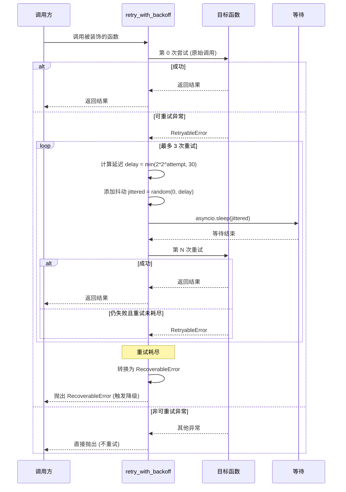

### 7.4 重试使用示例

```python
# 示例 1: 异步函数重试
@retry_with_backoff(
    max_retries=3,
    base_delay=2.0,
    max_delay=30.0,
    retryable_exceptions=(ModelLoadTimeoutError, InferenceTimeoutError),
    on_retry=lambda attempt, err: print(f"[Retry] Attempt {attempt}: {err}"),
)
async def vlm_analyze_with_retry(image_path: str):
    """VLM 分析（带重试）"""
    model = await load_vlm_model()  # 可能抛 ModelLoadTimeoutError
    result = await model.analyze(image_path)  # 可能抛 InferenceTimeoutError
    return result


# 示例 2: 同步函数重试
@retry_with_backoff(max_retries=5, base_delay=1.0, jitter="equal")
def load_model_with_retry(model_name: str):
    """模型加载（带重试，5次，1s 基础延迟）"""
    return load_model(model_name)


# 示例 3: 便捷函数（无需装饰器）
async def index_audio(audio_path: str):
    """音频索引（使用便捷重试函数）"""
    try:
        asr_result = await retry_async(
            lambda: asr_transcribe(audio_path),
            max_retries=3,
        )
        clap_result = await retry_async(
            lambda: clap_embed(audio_path),
            max_retries=3,
        )
        return {"asr": asr_result, "clap": clap_result}
    except RecoverableError as e:
        # 重试耗尽，降级处理
        print(f"[Degradation] Audio indexing degraded: {e.user_message}")
        handler = DegradationHandler()
        state = handler.create_state("audio")
        state = handler.handle_asr_failure(state, str(e))
        return handler.build_filename_only_result(audio_path)
```

---

## 8. 批量处理器

### 8.1 设计说明

批量处理器（`BatchProcessor`）是索引管线的核心调度组件，负责将一批媒体文件按模态分发到对应的并发受限处理队列。核心设计要点：

1. **信号量限流**：每种处理类型有独立的 `asyncio.Semaphore`，防止并发过多导致 OOM
2. **进度追踪**：实时追踪每个任务的状态（pending/running/done/failed），支持进度回调
3. **错误隔离**：单个文件处理失败不影响其他文件，错误被收集而非传播
4. **缓存感知**：L2 缓存命中的文件直接跳过信号量，不占用并发配额
5. **结果聚合**：所有任务完成后返回统一的结果列表，包含成功/失败/降级标记

### 8.2 BatchProcessor 完整实现

```python
"""
批量处理器 — 信号量限流 + 进度追踪 + 错误隔离

管理五种处理类型的并发控制:
  - 图片 VLM 分析:    Semaphore(5),  ~1.5 GB/任务
  - 音频 ASR 转写:    Semaphore(3),  ~0.8 GB/任务
  - 音频 CLAP 嵌入:   Semaphore(3),  ~0.6 GB/任务
  - 视频处理:         Semaphore(1),  ~3.0 GB/任务
  - Embedding 向量化: Semaphore(10), ~0.3 GB/任务
"""

import asyncio
import logging
import time
from dataclasses import dataclass, field
from enum import Enum
from pathlib import Path
from typing import Any, Callable, Optional

logger = logging.getLogger("multimodal.batch")


class TaskStatus(Enum):
    """任务状态"""
    PENDING = "pending"
    RUNNING = "running"
    DONE = "done"
    FAILED = "failed"
    DEGRADED = "degraded"
    SKIPPED = "skipped"  # 缓存命中，跳过处理


class TaskType(Enum):
    """处理类型"""
    IMAGE_VLM = "image_vlm"
    AUDIO_ASR = "audio_asr"
    AUDIO_CLAP = "audio_clap"
    VIDEO = "video"
    EMBEDDING = "embedding"


@dataclass
class BatchTask:
    """单个批量处理任务"""
    task_id: str
    task_type: TaskType
    file_path: str
    status: TaskStatus = TaskStatus.PENDING
    result: Optional[Any] = None
    error: Optional[str] = None
    start_time: Optional[float] = None
    end_time: Optional[float] = None
    cache_hit: bool = False
    degradation_level: Optional[str] = None

    @property
    def duration(self) -> Optional[float]:
        if self.start_time and self.end_time:
            return self.end_time - self.start_time
        return None


@dataclass
class BatchResult:
    """批量处理结果"""
    total: int = 0
    succeeded: int = 0
    failed: int = 0
    degraded: int = 0
    skipped: int = 0
    cache_hits: int = 0
    total_duration: float = 0.0
    tasks: list[BatchTask] = field(default_factory=list)

    def summary(self) -> str:
        return (
            f"Batch: {self.total} files | "
            f"✓{self.succeeded} ✗{self.failed} ~{self.degraded} →{self.skipped} | "
            f"cache: {self.cache_hits}/{self.total} | "
            f"duration: {self.total_duration:.1f}s"
        )


class BatchProcessor:
    """
    批量处理器

    使用 asyncio.Semaphore 控制每种处理类型的并发数，
    防止同时处理过多文件导致内存溢出。

    并发限制:
      | 类型              | Semaphore | 内存/任务 | 峰值内存 |
      |-------------------|-----------|----------|---------|
      | 图片 VLM 分析      | 5         | 1.5 GB   | 7.5 GB  |
      | 音频 ASR 转写      | 3         | 0.8 GB   | 2.4 GB  |
      | 音频 CLAP 嵌入     | 3         | 0.6 GB   | 1.8 GB  |
      | 视频处理           | 1         | 3.0 GB   | 3.0 GB  |
      | Embedding 向量化   | 10        | 0.3 GB   | 3.0 GB  |

    注意: 实际运行中不会同时达到所有类型的峰值，
    因为索引管线按文件类型分批处理，同一时刻通常只有 1-2 种类型在运行。
    """

    # 并发配置: (task_type, concurrency, memory_per_task_gb)
    CONCURRENCY_CONFIG = {
        TaskType.IMAGE_VLM:  (5,  1.5),
        TaskType.AUDIO_ASR:  (3,  0.8),
        TaskType.AUDIO_CLAP: (3,  0.6),
        TaskType.VIDEO:      (1,  3.0),
        TaskType.EMBEDDING:  (10, 0.3),
    }

    def __init__(
        self,
        degradation_handler: Optional[DegradationHandler] = None,
        disk_cache: Optional[DiskCacheManager] = None,
        progress_callback: Optional[Callable[[int, int, str], None]] = None,
    ):
        """
        Args:
            degradation_handler: 降级处理器
            disk_cache: L2 磁盘缓存管理器（用于检查缓存命中）
            progress_callback: 进度回调 (completed, total, current_file)
        """
        self.degradation_handler = degradation_handler or DegradationHandler()
        self.disk_cache = disk_cache
        self.progress_callback = progress_callback

        # 为每种处理类型创建信号量
        self._semaphores: dict[TaskType, asyncio.Semaphore] = {}
        for task_type, (concurrency, _) in self.CONCURRENCY_CONFIG.items():
            self._semaphores[task_type] = asyncio.Semaphore(concurrency)

        # 进度追踪
        self._completed_count = 0
        self._total_count = 0

    # ─── 核心处理方法 ──────────────────────────────────────────

    async def process_batch(
        self,
        file_paths: list[str],
        process_fn: Callable,
        task_type: TaskType,
    ) -> BatchResult:
        """
        批量处理文件

        Args:
            file_paths: 文件路径列表
            process_fn: 单文件处理函数 (file_path) -> result
            task_type: 处理类型（决定并发限制）

        Returns:
            BatchResult: 批量处理结果
        """
        self._total_count = len(file_paths)
        self._completed_count = 0

        # 创建任务列表
        tasks = []
        for i, file_path in enumerate(file_paths):
            task = BatchTask(
                task_id=f"{task_type.value}_{i:04d}",
                task_type=task_type,
                file_path=file_path,
            )
            tasks.append(task)

        # 创建协程任务
        coroutines = [
            self._process_single(task, process_fn)
            for task in tasks
        ]

        # 并发执行
        start_time = time.time()
        await asyncio.gather(*coroutines, return_exceptions=True)
        total_duration = time.time() - start_time

        # 聚合结果
        result = BatchResult(
            total=len(tasks),
            total_duration=total_duration,
            tasks=tasks,
        )
        for task in tasks:
            if task.status == TaskStatus.DONE:
                result.succeeded += 1
            elif task.status == TaskStatus.FAILED:
                result.failed += 1
            elif task.status == TaskStatus.DEGRADED:
                result.degraded += 1
            elif task.status == TaskStatus.SKIPPED:
                result.skipped += 1
            if task.cache_hit:
                result.cache_hits += 1

        logger.info(result.summary())
        return result

    async def _process_single(
        self,
        task: BatchTask,
        process_fn: Callable,
    ):
        """
        处理单个文件（带信号量限流）

        信号量保证同一类型的处理任务不超过并发上限。
        缓存命中的任务直接返回，不获取信号量。
        """
        semaphore = self._semaphores[task.task_type]

        # 检查 L2 缓存
        if self.disk_cache and task.task_type != TaskType.EMBEDDING:
            file_hash = self.disk_cache.compute_file_hash(task.file_path)
            cache_name = self._get_cache_name(task.task_type)
            if cache_name and self.disk_cache.exists(cache_name, file_hash):
                task.status = TaskStatus.SKIPPED
                task.cache_hit = True
                task.result = self.disk_cache.get(cache_name, file_hash)
                task.start_time = time.time()
                task.end_time = time.time()
                self._update_progress(task.file_path)
                return

        # 获取信号量（并发限流）
        async with semaphore:
            task.status = TaskStatus.RUNNING
            task.start_time = time.time()

            try:
                # 执行处理函数
                result = await process_fn(task.file_path) \
                    if asyncio.iscoroutinefunction(process_fn) \
                    else process_fn(task.file_path)

                task.result = result
                task.status = TaskStatus.DONE

            except RecoverableError as e:
                # 可恢复错误: 降级处理
                task.status = TaskStatus.DEGRADED
                task.error = e.message
                task.result = self.degradation_handler.build_filename_only_result(
                    task.file_path
                )
                logger.warning(
                    f"Task {task.task_id} degraded: {e.user_message}"
                )

            except Exception as e:
                # 其他错误: 标记失败
                task.status = TaskStatus.FAILED
                task.error = str(e)
                logger.error(
                    f"Task {task.task_id} failed: {e}", exc_info=True
                )

            finally:
                task.end_time = time.time()
                self._update_progress(task.file_path)

    def _update_progress(self, current_file: str):
        """更新进度并触发回调"""
        self._completed_count += 1
        if self.progress_callback:
            try:
                self.progress_callback(
                    self._completed_count,
                    self._total_count,
                    current_file,
                )
            except Exception as e:
                logger.error(f"Progress callback error: {e}")

    @staticmethod
    def _get_cache_name(task_type: TaskType) -> Optional[str]:
        """根据任务类型获取对应的 L2 缓存名称"""
        mapping = {
            TaskType.IMAGE_VLM: "descriptions",
            TaskType.AUDIO_ASR: "asr_transcripts",
            TaskType.AUDIO_CLAP: "clap_embeddings",
            TaskType.VIDEO: "descriptions",  # 视频 VLM 描述也存 descriptions
        }
        return mapping.get(task_type)

    # ─── 多模态混合批处理 ──────────────────────────────────────

    async def process_mixed_batch(
        self,
        file_paths: list[str],
    ) -> BatchResult:
        """
        混合模态批量处理

        自动检测文件类型并分发到对应的处理队列。
        图片 → IMAGE_VLM, 视频 → VIDEO, 音频 → AUDIO_ASR + AUDIO_CLAP

        Args:
            file_paths: 混合模态文件路径列表

        Returns:
            BatchResult: 合并的批量处理结果
        """
        # 按模态分组
        groups: dict[TaskType, list[str]] = {
            TaskType.IMAGE_VLM: [],
            TaskType.VIDEO: [],
            TaskType.AUDIO_ASR: [],
        }

        for file_path in file_paths:
            ext = Path(file_path).suffix.lower().lstrip(".")
            modality = self._detect_modality(ext)

            if modality == "image":
                groups[TaskType.IMAGE_VLM].append(file_path)
            elif modality == "video":
                groups[TaskType.VIDEO].append(file_path)
            elif modality == "audio":
                groups[TaskType.AUDIO_ASR].append(file_path)

        # 并发处理各模态（不同模态之间无依赖，可并行）
        tasks = []
        if groups[TaskType.IMAGE_VLM]:
            tasks.append(
                self.process_batch(
                    groups[TaskType.IMAGE_VLM],
                    self._image_process_fn,
                    TaskType.IMAGE_VLM,
                )
            )
        if groups[TaskType.VIDEO]:
            tasks.append(
                self.process_batch(
                    groups[TaskType.VIDEO],
                    self._video_process_fn,
                    TaskType.VIDEO,
                )
            )
        if groups[TaskType.AUDIO_ASR]:
            tasks.append(
                self.process_batch(
                    groups[TaskType.AUDIO_ASR],
                    self._audio_process_fn,
                    TaskType.AUDIO_ASR,
                )
            )

        # 等待所有模态处理完成
        results = await asyncio.gather(*tasks) if tasks else []

        # 合并结果
        merged = BatchResult()
        for r in results:
            merged.total += r.total
            merged.succeeded += r.succeeded
            merged.failed += r.failed
            merged.degraded += r.degraded
            merged.skipped += r.skipped
            merged.cache_hits += r.cache_hits
            merged.total_duration = max(merged.total_duration, r.total_duration)
            merged.tasks.extend(r.tasks)

        return merged

    @staticmethod
    def _detect_modality(ext: str) -> str:
        """检测文件模态"""
        image_exts = {"jpg", "jpeg", "png", "webp", "bmp", "gif", "tiff"}
        video_exts = {"mp4", "mov", "mkv", "avi", "flv", "wmv", "webm"}
        audio_exts = {"mp3", "wav", "flac", "aac", "ogg", "m4a", "wma"}

        if ext in image_exts:
            return "image"
        elif ext in video_exts:
            return "video"
        elif ext in audio_exts:
            return "audio"
        return "unknown"

    # ─── 模态处理函数（需由调用方注入实际实现） ──────────────────

    async def _image_process_fn(self, file_path: str) -> dict:
        """图片处理函数（需被子类或调用方覆盖）"""
        raise NotImplementedError("Override _image_process_fn or pass process_fn")

    async def _video_process_fn(self, file_path: str) -> dict:
        """视频处理函数（需被子类或调用方覆盖）"""
        raise NotImplementedError("Override _video_process_fn or pass process_fn")

    async def _audio_process_fn(self, file_path: str) -> dict:
        """音频处理函数（需被子类或调用方覆盖）"""
        raise NotImplementedError("Override _audio_process_fn or pass process_fn")

    # ─── 信号量状态查询 ────────────────────────────────────────

    def get_concurrency_status(self) -> dict:
        """获取各类型信号量的当前状态"""
        status = {}
        for task_type, (max_conc, mem_gb) in self.CONCURRENCY_CONFIG.items():
            sem = self._semaphores[task_type]
            # asyncio.Semaphore 没有 public API 查询可用数，
            # 此处返回配置值
            status[task_type.value] = {
                "max_concurrency": max_conc,
                "memory_per_task_gb": mem_gb,
                "peak_memory_gb": max_conc * mem_gb,
            }
        return status
```

### 8.3 批量处理流程图

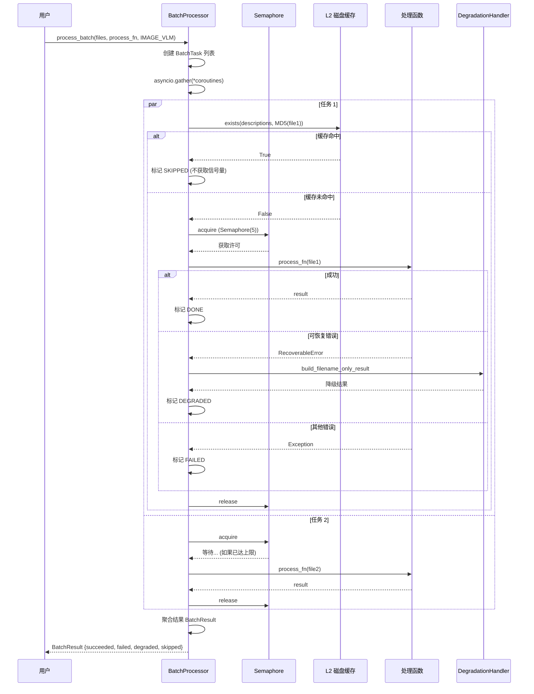

---

## 9. 并发控制

### 9.1 并发限制总览

Apple M5 (24GB RAM) 的内存预算决定了每种处理类型的并发上限。下表展示完整的并发控制矩阵：

| 处理类型 | 信号量 | 并发上限 | 内存/任务 | 峰值内存 | 典型耗时/任务 | 吞吐量 (任务/分钟) |
|---------|--------|---------|----------|---------|--------------|-------------------|
| 图片 VLM 分析 | `Semaphore(5)` | 5 | ~1.5 GB | 7.5 GB | 2-8s | 37-150 |
| 音频 ASR 转写 | `Semaphore(3)` | 3 | ~0.8 GB | 2.4 GB | 3-30s | 6-60 |
| 音频 CLAP 嵌入 | `Semaphore(3)` | 3 | ~0.6 GB | 1.8 GB | 0.5-2s | 90-360 |
| 视频处理 | `Semaphore(1)` | 1 | ~3.0 GB | 3.0 GB | 10-60s | 1-6 |
| Embedding 向量化 | `Semaphore(10)` | 10 | ~0.3 GB | 3.0 GB | 0.1-0.3s | 2000-6000 |

### 9.2 内存预算分析

```mermaid
flowchart LR
    subgraph "24GB 内存分配"
        SYSTEM[macOS 系统<br>4 GB]
        L0_MODELS[常驻模型 L0<br>7.4 GB<br>Embedding + Qdrant]
        L1_HOT[热缓存模型 L1<br>4.6 GB<br>VLM/ASR/CLAP 按需加载]
        BATCH[批量处理<br>峰值 7.5 GB<br>受信号量控制]
        BUFFER[安全余量<br>0.5 GB]
    end

    subgraph "批量处理峰值场景"
        IMG_PEAK[5x 图片 VLM<br>5 × 1.5 = 7.5 GB]
        AUDIO_PEAK[3x ASR + 3x CLAP<br>2.4 + 1.8 = 4.2 GB]
        VIDEO_PEAK[1x 视频<br>1 × 3.0 = 3.0 GB]
        EMB_PEAK[10x Embedding<br>10 × 0.3 = 3.0 GB]
    end

    style SYSTEM fill:#3a1520,stroke:#EF4444
    style L0_MODELS fill:#1a1520,stroke:#8B5CF6
    style L1_HOT fill:#3a2a15,stroke:#F59E0B
    style BATCH fill:#1a201a,stroke:#10B981
    style BUFFER fill:#1a2a20,stroke:#10B981
```

> **关键约束**：实际运行中不会同时达到所有处理类型的峰值。索引管线按文件类型分批处理——先处理所有图片（峰值 7.5GB），再处理音频（峰值 4.2GB），最后处理视频（峰值 3.0GB）。同一时刻通常只有 1-2 种类型在运行，实际峰值内存约 7.5-12GB，在 20GB 可用内存预算内。

### 9.3 信号量使用模式

```python
"""
并发控制 — asyncio.Semaphore 的使用模式

每种处理类型使用独立的信号量，互不干扰。
信号量在 BatchProcessor 初始化时创建，生命周期与处理器一致。
"""

import asyncio


class ConcurrencyController:
    """
    并发控制器 — 统一管理所有信号量

    除了 BatchProcessor 内部使用的处理信号量外，
    还管理模型加载信号量（防止同时加载多个大模型导致 OOM）。
    """

    # 处理任务信号量
    SEMAPHORES = {
        "image_vlm":    5,
        "audio_asr":    3,
        "audio_clap":   3,
        "video":        1,
        "embedding":   10,
    }

    # 模型加载信号量（同时只能加载一个大模型）
    MODEL_LOAD_SEMAPHORE = 1

    def __init__(self):
        # 处理信号量
        self._task_sems: dict[str, asyncio.Semaphore] = {
            name: asyncio.Semaphore(count)
            for name, count in self.SEMAPHORES.items()
        }

        # 模型加载信号量
        self._model_load_sem = asyncio.Semaphore(self.MODEL_LOAD_SEMAPHORE)

        # 等待计数（用于监控）
        self._waiting: dict[str, int] = {name: 0 for name in self.SEMAPHORES}

    def get_semaphore(self, task_type: str) -> asyncio.Semaphore:
        """获取指定类型的信号量"""
        return self._task_sems[task_type]

    async def acquire_model_load(self):
        """
        获取模型加载许可

        大模型（VLM/ASR/CLAP）加载到内存时需要获取此信号量，
        防止同时加载多个大模型导致 OOM。
        """
        await self._model_load_sem.acquire()

    def release_model_load(self):
        """释放模型加载许可"""
        self._model_load_sem.release()

    def stats(self) -> dict:
        """获取并发状态统计"""
        return {
            name: {
                "max_concurrency": count,
                "semaphore_value": sem._value if hasattr(sem, '_value') else None,
            }
            for name, (count, sem) in zip(
                self.SEMAPHORES.keys(),
                zip(self.SEMAPHORES.values(), self._task_sems.values()),
            )
        }


# 全局并发控制器实例
concurrency_controller = ConcurrencyController()
```

### 9.4 并发场景示意

```mermaid
flowchart TB
    subgraph "图片批处理 (Semaphore=5)"
        I1[img1.jpg<br>VLM 分析] -.->|占1| SEM_I[Semaphore(5)]
        I2[img2.jpg<br>VLM 分析] -.->|占1| SEM_I
        I3[img3.jpg<br>VLM 分析] -.->|占1| SEM_I
        I4[img4.jpg<br>VLM 分析] -.->|占1| SEM_I
        I5[img5.jpg<br>VLM 分析] -.->|占1| SEM_I
        I6[img6.jpg<br>VLM 分析] ==>|等待| SEM_I
    end

    subgraph "视频处理 (Semaphore=1)"
        V1[video1.mp4<br>完整处理] -.->|占1| SEM_V[Semaphore(1)]
        V2[video2.mp4<br>完整处理] ==>|等待| SEM_V
        V3[video3.mp4<br>完整处理] ==>|等待| SEM_V
    end

    subgraph "Embedding (Semaphore=10)"
        E1[text1 → 向量] -.->|占1| SEM_E[Semaphore(10)]
        E2[text2 → 向量] -.->|占1| SEM_E
        E3[text3 → 向量] -.->|占1| SEM_E
        E4[...更多] -.->|占1| SEM_E
    end

    style SEM_I fill:#1a201a,stroke:#10B981
    style SEM_V fill:#3a1520,stroke:#EF4444
    style SEM_E fill:#1a201a,stroke:#10B981
```

图中虚线（`-.->`）表示已获取信号量正在执行，粗箭头（`==>`）表示正在等待信号量。视频处理由于 `Semaphore(1)` 限制，同时只能处理一个视频文件，后续视频排队等待。

---

## 10. 渐进式索引

### 10.1 设计说明

渐进式索引（Progressive Indexing）是多模态索引管线的核心设计，将文件索引分为三个优先级层级，使文件在入库后 **立即可搜索**，并在后台逐步提升索引质量。

| 层级 | 名称 | 耗时 | 处理内容 | 可搜索能力 | 优先级 |
|------|------|------|----------|-----------|--------|
| **L1** | 快速索引 | <100ms | 文件名 + 元数据 + MD5 | 按文件名/元数据过滤 | 最高（同步） |
| **L2** | 标准索引 | 2-15s | VLM 描述 + 标签 + Embedding | 语义相似度检索 | 中（后台队列） |
| **L3** | 深度索引 | 10-60s | ASR + CLAP | 全模态检索 | 低（后台队列） |

```mermaid
flowchart LR
    FILE[新文件入库] --> L1

    subgraph "L1 快速索引 (<100ms)"
        L1[同步处理<br>文件名 + 元数据 + MD5]
        L1 --> L1_DONE[立即可搜索<br>按文件名过滤]
    end

    L1_DONE --> L2_QUEUE[L2 后台队列]

    subgraph "L2 标准索引 (2-15s)"
        L2_QUEUE --> L2_WORKER[L2 Worker<br>按优先级消费]
        L2_WORKER --> L2_PROCESS[VLM 描述 + 标签 + Embedding]
        L2_PROCESS --> L2_DONE[语义可搜索<br>向量相似度检索]
    end

    L2_DONE --> L3_QUEUE[L3 后台队列]

    subgraph "L3 深度索引 (10-60s)"
        L3_QUEUE --> L3_WORKER[L3 Worker<br>按优先级消费]
        L3_WORKER --> L3_PROCESS[ASR 转写 + CLAP 嵌入]
        L3_PROCESS --> L3_DONE[全模态可搜索<br>跨模态检索]
    end

    style L1 fill:#1a201a,stroke:#10B981
    style L2_PROCESS fill:#1a1520,stroke:#8B5CF6
    style L3_PROCESS fill:#3a2a15,stroke:#F59E0B
```

### 10.2 优先级队列设计

L2 和 L3 队列使用优先级排序，确保重要文件优先处理：

| 优先级 | 场景 | 示例 |
|--------|------|------|
| P0 (最高) | 用户手动指定的高优先级文件 | 用户选中的特定文件 |
| P1 | 新入库的文件 | 刚上传/添加的文件 |
| P2 | 用户的搜索查询命中的 L1 文件 | 用户搜索时发现只有 L1 索引，触发 L2 升级 |
| P3 (最低) | 批量导入的低优先级文件 | 批量导入的历史归档文件 |

### 10.3 ProgressiveIndexer 完整实现

```python
"""
渐进式索引器 — L1/L2/L3 三级流水线 + 后台 worker

L1 同步执行（<100ms），文件立即可搜索。
L2/L3 放入后台优先级队列，由 worker 按优先级异步处理。

与文档 03 中的 ProgressiveIndexer 相比，此版本增加了:
  - 后台 worker 队列管理
  - 优先级排序
  - 进度追踪和回调
  - 与 BatchProcessor 的集成
  - 缓存一致性检查
"""

import asyncio
import heapq
import hashlib
import os
import logging
import time
from dataclasses import dataclass, field
from enum import IntEnum
from pathlib import Path
from typing import Any, Callable, Optional

logger = logging.getLogger("multimodal.progressive")


class IndexLevel(IntEnum):
    """索引层级"""
    L1 = 1  # 快速: 文件名 + 元数据
    L2 = 2  # 标准: VLM + Embedding
    L3 = 3  # 深度: ASR + CLAP


class Priority(IntEnum):
    """队列优先级（值越小优先级越高）"""
    P0_USER = 0      # 用户手动指定
    P1_NEW = 1       # 新入库文件
    P2_QUERY = 2     # 查询触发升级
    P3_BATCH = 3     # 批量导入


@dataclass(order=True)
class IndexJob:
    """
    索引任务（用于优先级队列）

    heapq 按元组比较: (priority, timestamp, counter, ...)
    """
    priority: int
    timestamp: float
    counter: int                          # 保证同优先级 FIFO
    file_path: str = field(compare=False)
    file_hash: str = field(compare=False)
    target_level: IndexLevel = field(compare=False)
    modality: str = field(compare=False, default="unknown")


class ProgressiveIndexer:
    """
    渐进式索引器

    工作流程:
      1. 文件入库 → 同步执行 L1 → 立即可搜索
      2. L1 完成后 → 将 L2 任务放入后台队列
      3. L2 worker 消费队列 → 执行 VLM + Embedding → 语义可搜索
      4. L2 完成后 → 将 L3 任务放入后台队列
      5. L3 worker 消费队列 → 执行 ASR + CLAP → 全模态可搜索

    后台 worker:
      - L2 worker: 并发度由 BatchProcessor 的信号量控制
      - L3 worker: 并发度受视频 Semaphore(1) 限制
      - worker 持续运行，队列为空时等待
    """

    def __init__(
        self,
        qdrant_client,
        disk_cache: Optional[DiskCacheManager] = None,
        batch_processor: Optional[BatchProcessor] = None,
        degradation_handler: Optional[DegradationHandler] = None,
        collection_name: str = "multimodal_index",
    ):
        """
        Args:
            qdrant_client: Qdrant 客户端
            disk_cache: L2 磁盘缓存
            batch_processor: 批量处理器
            degradation_handler: 降级处理器
            collection_name: Qdrant 集合名
        """
        self.qdrant = qdrant_client
        self.disk_cache = disk_cache
        self.batch_processor = batch_processor
        self.degradation_handler = degradation_handler or DegradationHandler()
        self.collection_name = collection_name

        # 优先级队列
        self._l2_queue: list[IndexJob] = []
        self._l3_queue: list[IndexJob] = []
        self._counter = 0  # 任务计数器（保证 FIFO）

        # 队列锁和条件变量
        self._queue_lock = asyncio.Lock()
        self._l2_event = asyncio.Event()
        self._l3_event = asyncio.Event()

        # worker 状态
        self._l2_worker_running = False
        self._l3_worker_running = False
        self._shutdown = False

        # 统计
        self._stats = {
            "l1_completed": 0,
            "l2_completed": 0,
            "l3_completed": 0,
            "l2_failed": 0,
            "l3_failed": 0,
            "l2_queue_size": 0,
            "l3_queue_size": 0,
        }

    # ─── 公共接口 ──────────────────────────────────────────────

    async def index_progressive(
        self,
        file_path: str,
        priority: Priority = Priority.P1_NEW,
    ) -> str:
        """
        渐进式索引入口

        同步执行 L1，然后将 L2/L3 任务放入后台队列。

        Args:
            file_path: 文件路径
            priority: 优先级

        Returns:
            file_hash: 文件 MD5 哈希
        """
        file_path = str(Path(file_path).resolve())

        # ── L1: 快速索引（同步） ──
        file_hash = await self._index_l1(file_path)
        self._stats["l1_completed"] += 1
        logger.info(f"[L1] Fast index completed: {file_path}")

        # ── L2: 标准索引（入队后台） ──
        modality = self._detect_modality(Path(file_path).suffix.lower().lstrip("."))
        await self._enqueue_l2(file_path, file_hash, modality, priority)

        # ── L3: 深度索引（L2 完成后入队） ──
        # L3 任务在 L2 完成后自动入队（见 _process_l2）

        return file_hash

    async def index_batch_progressive(
        self,
        file_paths: list[str],
        priority: Priority = Priority.P3_BATCH,
    ) -> list[str]:
        """
        批量渐进式索引

        对一批文件同步执行 L1，然后批量入队 L2。
        """
        file_hashes = []
        for file_path in file_paths:
            file_hash = await self.index_progressive(file_path, priority)
            file_hashes.append(file_hash)
        return file_hashes

    # ─── L1: 快速索引 ──────────────────────────────────────────

    async def _index_l1(self, file_path: str) -> str:
        """
        L1 快速索引 — 文件名 + 元数据 + MD5

        耗时: <100ms
        向量: 无
        可搜索: 按文件名/元数据过滤
        """
        # 1. 计算 MD5
        if self.disk_cache:
            file_hash = self.disk_cache.compute_file_hash(file_path)
        else:
            file_hash = self._compute_md5(file_path)

        # 2. 提取元数据
        file_stat = os.stat(file_path)
        ext = Path(file_path).suffix.lower().lstrip(".")
        modality = self._detect_modality(ext)

        metadata = {
            "file_name": Path(file_path).name,
            "file_extension": ext,
            "file_size": file_stat.st_size,
            "created_at": file_stat.st_ctime,
            "modified_at": file_stat.st_mtime,
        }

        # 补充模态特定快速元数据
        if modality == "image":
            metadata.update(self._get_image_info_fast(file_path))
        elif modality == "video":
            metadata.update(self._get_video_info_fast(file_path))
        elif modality == "audio":
            metadata.update(self._get_audio_info_fast(file_path))

        # 3. 写入 Qdrant（仅 payload，无向量）
        from qdrant_client.models import PointStruct

        point = PointStruct(
            id=file_hash,
            vector={},  # L1 阶段无向量
            payload={
                "file_path": file_path,
                "file_hash": file_hash,
                "modality": modality,
                "metadata": metadata,
                "index_level": "L1",
                "description": "",
                "tags": {},
            },
        )
        self.qdrant.upsert(
            collection_name=self.collection_name,
            points=[point],
        )

        return file_hash

    # ─── L2: 标准索引 ──────────────────────────────────────────

    async def _index_l2(self, file_path: str, file_hash: str) -> bool:
        """
        L2 标准索引 — VLM 描述 + 标签 + Embedding

        耗时: 2-15s
        向量: content_vector
        可搜索: 语义相似度检索

        Returns:
            True 表示成功，False 表示失败（将触发降级）
        """
        ext = Path(file_path).suffix.lower().lstrip(".")
        modality = self._detect_modality(ext)
        state = self.degradation_handler.create_state(modality)

        description = ""
        tags = {}
        content_vector = None

        # ── 查 L2 磁盘缓存 ──
        if self.disk_cache:
            cached = self.disk_cache.get_vlm_description(file_hash)
            if cached:
                description = cached.get("description", "")
                tags = cached.get("tags", {})
                logger.debug(f"[L2] Cache hit for VLM: {file_path}")

        # ── 缓存未命中，执行 VLM ──
        if not description:
            try:
                desc, vlm_tags = await self._run_vlm(file_path, modality)
                description = desc
                tags = vlm_tags

                # 写入 L2 磁盘缓存
                if self.disk_cache:
                    self.disk_cache.set_vlm_description(
                        file_hash, description, tags, "qwen3-vl"
                    )

            except Exception as e:
                state = self.degradation_handler.handle_vlm_failure(state, str(e))

        # ── 生成 Embedding 向量 ──
        if description:
            try:
                # 使用 L1 内存缓存
                content_vector = await self._compute_embedding(description)
            except Exception as e:
                logger.warning(f"[L2] Embedding failed: {e}")
                # Embedding 失败是致命的（无法语义检索），
                # 但文件仍可通过文件名搜索
                pass

        # ── 更新 Qdrant ──
        self._update_qdrant(
            file_hash=file_hash,
            level="L2",
            description=description,
            tags=tags,
            content_vector=content_vector,
        )

        if state.is_degraded():
            logger.warning(
                f"[L2] Degraded index for {file_path}: {state.user_notice}"
            )

        # 返回是否成功（有向量即为成功）
        return content_vector is not None

    # ─── L3: 深度索引 ──────────────────────────────────────────

    async def _index_l3(self, file_path: str, file_hash: str) -> bool:
        """
        L3 深度索引 — ASR + CLAP

        耗时: 10-60s
        向量: audio_vector (CLAP)
        可搜索: 全模态检索

        仅对视频和音频文件执行，图片无需 L3。
        """
        ext = Path(file_path).suffix.lower().lstrip(".")
        modality = self._detect_modality(ext)

        if modality == "image":
            return True  # 图片无需 L3

        state = self.degradation_handler.create_state(modality)
        audio_vector = None
        asr_text = ""

        # 提取音轨（视频文件）
        audio_path = file_path
        if modality == "video":
            audio_path = self._extract_audio(file_path)
            if not audio_path:
                logger.warning(f"[L3] No audio track in video: {file_path}")
                return False

        # 计算音频哈希
        if self.disk_cache:
            audio_hash = self.disk_cache.compute_file_hash(audio_path)
        else:
            audio_hash = self._compute_md5(audio_path)

        # ── ASR 转写 ──
        if self.disk_cache:
            cached_asr = self.disk_cache.get_asr_transcript(audio_hash)
            if cached_asr:
                asr_text = cached_asr.get("text", "")
            else:
                try:
                    asr_text = await self._run_asr(audio_path)
                    self.disk_cache.set_asr_transcript(
                        audio_hash, asr_text, [], "zh"
                    )
                except Exception as e:
                    state = self.degradation_handler.handle_asr_failure(
                        state, str(e)
                    )

        # ── CLAP 嵌入 ──
        if self.disk_cache:
            cached_clap = self.disk_cache.get_clap_embedding(audio_hash)
            if cached_clap is not None:
                audio_vector = cached_clap
            else:
                try:
                    audio_vector = await self._run_clap(audio_path)
                    self.disk_cache.set_clap_embedding(audio_hash, audio_vector)
                except Exception as e:
                    state = self.degradation_handler.handle_clap_failure(
                        state, str(e)
                    )

        # ── ASR 文本的 Embedding（如果有转写文本） ──
        content_vector = None
        if asr_text:
            try:
                content_vector = await self._compute_embedding(asr_text)
            except Exception:
                pass

        # ── 更新 Qdrant ──
        self._update_qdrant(
            file_hash=file_hash,
            level="L3",
            description=asr_text,
            tags={},
            content_vector=content_vector,
            audio_vector=audio_vector,
        )

        if state.is_degraded():
            logger.warning(
                f"[L3] Degraded index for {file_path}: {state.user_notice}"
            )

        return True

    # ─── 后台 Worker ───────────────────────────────────────────

    async def start_workers(self):
        """启动 L2 和 L3 后台 worker"""
        self._shutdown = False
        await asyncio.gather(
            self._l2_worker_loop(),
            self._l3_worker_loop(),
        )

    async def stop_workers(self):
        """停止后台 worker"""
        self._shutdown = True
        self._l2_event.set()  # 唤醒等待中的 worker
        self._l3_event.set()

    async def _l2_worker_loop(self):
        """L2 后台 worker — 持续消费 L2 队列"""
        self._l2_worker_running = True
        logger.info("[Worker] L2 worker started")

        while not self._shutdown:
            job = await self._dequeue_l2()
            if job is None:
                # 队列为空，等待新任务
                self._l2_event.clear()
                await self._l2_event.wait()
                continue

            try:
                success = await self._index_l2(job.file_path, job.file_hash)
                if success:
                    self._stats["l2_completed"] += 1
                    logger.info(f"[L2] Standard index completed: {job.file_path}")

                    # L2 成功后，将 L3 任务入队
                    if job.modality in ("video", "audio"):
                        await self._enqueue_l3(
                            job.file_path, job.file_hash,
                            job.modality, Priority(job.priority)
                        )
                else:
                    self._stats["l2_failed"] += 1
                    logger.warning(f"[L2] Standard index failed: {job.file_path}")

            except Exception as e:
                self._stats["l2_failed"] += 1
                logger.error(f"[L2] Error indexing {job.file_path}: {e}")

        self._l2_worker_running = False
        logger.info("[Worker] L2 worker stopped")

    async def _l3_worker_loop(self):
        """L3 后台 worker — 持续消费 L3 队列"""
        self._l3_worker_running = True
        logger.info("[Worker] L3 worker started")

        while not self._shutdown:
            job = await self._dequeue_l3()
            if job is None:
                self._l3_event.clear()
                await self._l3_event.wait()
                continue

            try:
                success = await self._index_l3(job.file_path, job.file_hash)
                if success:
                    self._stats["l3_completed"] += 1
                    logger.info(f"[L3] Deep index completed: {job.file_path}")
                else:
                    self._stats["l3_failed"] += 1

            except Exception as e:
                self._stats["l3_failed"] += 1
                logger.error(f"[L3] Error indexing {job.file_path}: {e}")

        self._l3_worker_running = False
        logger.info("[Worker] L3 worker stopped")

    # ─── 队列管理 ──────────────────────────────────────────────

    async def _enqueue_l2(
        self, file_path: str, file_hash: str,
        modality: str, priority: Priority,
    ):
        """将 L2 任务入队"""
        async with self._queue_lock:
            self._counter += 1
            job = IndexJob(
                priority=int(priority),
                timestamp=time.time(),
                counter=self._counter,
                file_path=file_path,
                file_hash=file_hash,
                target_level=IndexLevel.L2,
                modality=modality,
            )
            heapq.heappush(self._l2_queue, job)
            self._stats["l2_queue_size"] = len(self._l2_queue)

        self._l2_event.set()  # 唤醒 worker

    async def _dequeue_l2(self) -> Optional[IndexJob]:
        """从 L2 队列取出任务"""
        async with self._queue_lock:
            if self._l2_queue:
                job = heapq.heappop(self._l2_queue)
                self._stats["l2_queue_size"] = len(self._l2_queue)
                return job
            return None

    async def _enqueue_l3(
        self, file_path: str, file_hash: str,
        modality: str, priority: Priority,
    ):
        """将 L3 任务入队"""
        async with self._queue_lock:
            self._counter += 1
            job = IndexJob(
                priority=int(priority),
                timestamp=time.time(),
                counter=self._counter,
                file_path=file_path,
                file_hash=file_hash,
                target_level=IndexLevel.L3,
                modality=modality,
            )
            heapq.heappush(self._l3_queue, job)
            self._stats["l3_queue_size"] = len(self._l3_queue)

        self._l3_event.set()

    async def _dequeue_l3(self) -> Optional[IndexJob]:
        """从 L3 队列取出任务"""
        async with self._queue_lock:
            if self._l3_queue:
                job = heapq.heappop(self._l3_queue)
                self._stats["l3_queue_size"] = len(self._l3_queue)
                return job
            return None

    # ─── 查询触发的索引升级 ────────────────────────────────────

    async def upgrade_index_level(
        self, file_path: str, current_level: str, target_level: IndexLevel,
    ):
        """
        查询触发的索引升级

        当用户搜索命中一个仅有 L1 索引的文件时，
        以 P2 优先级将其升级到 L2，使后续查询能语义匹配。
        """
        file_hash = self._compute_md5(file_path) if not self.disk_cache \
            else self.disk_cache.compute_file_hash(file_path)
        modality = self._detect_modality(
            Path(file_path).suffix.lower().lstrip(".")
        )

        level_map = {"L1": IndexLevel.L1, "L2": IndexLevel.L2, "L3": IndexLevel.L3}
        curr = level_map.get(current_level, IndexLevel.L1)

        if curr < IndexLevel.L2 and target_level >= IndexLevel.L2:
            await self._enqueue_l2(
                file_path, file_hash, modality, Priority.P2_QUERY
            )
            logger.info(f"[Upgrade] Enqueued L2 for {file_path} (query-triggered)")

        if curr < IndexLevel.L3 and target_level >= IndexLevel.L3:
            # L3 会在 L2 完成后自动入队
            pass

    # ─── Qdrant 更新 ──────────────────────────────────────────

    def _update_qdrant(
        self,
        file_hash: str,
        level: str,
        description: str = "",
        tags: Optional[dict] = None,
        content_vector=None,
        audio_vector=None,
    ):
        """更新 Qdrant 中的索引层级和向量"""
        from qdrant_client.models import PointStruct

        vectors = {}
        if content_vector is not None:
            vectors["content_vector"] = content_vector
        if audio_vector is not None:
            vectors["audio_vector"] = audio_vector

        # 读取现有 payload 并合并
        existing, _ = self.qdrant.scroll(
            collection_name=self.collection_name,
            scroll_filter={
                "must": [{"key": "file_hash", "match": {"value": file_hash}}]
            },
            limit=1,
            with_payload=True,
            with_vectors=True,
        )

        if existing:
            old_payload = existing[0].payload or {}
            merged = {
                **old_payload,
                "index_level": level,
            }
            if description:
                merged["description"] = description
            if tags:
                merged["tags"] = {**old_payload.get("tags", {}), **tags}
            # 合并已有向量
            old_vectors = existing[0].vector or {}
            for k, v in old_vectors.items():
                if k not in vectors and v:
                    vectors[k] = v
        else:
            merged = {
                "file_hash": file_hash,
                "index_level": level,
                "description": description,
                "tags": tags or {},
            }

        point = PointStruct(
            id=file_hash,
            vector=vectors,
            payload=merged,
        )
        self.qdrant.upsert(
            collection_name=self.collection_name,
            points=[point],
        )

    # ─── 模型推理（需由调用方注入实际实现） ─────────────────────

    async def _run_vlm(self, file_path: str, modality: str) -> tuple[str, dict]:
        """VLM 推理（需被覆盖）"""
        raise NotImplementedError("Inject VLM implementation")

    async def _run_asr(self, audio_path: str) -> str:
        """ASR 转写（需被覆盖）"""
        raise NotImplementedError("Inject ASR implementation")

    async def _run_clap(self, audio_path: str):
        """CLAP 嵌入（需被覆盖）"""
        raise NotImplementedError("Inject CLAP implementation")

    async def _compute_embedding(self, text: str):
        """文本向量化（需被覆盖）"""
        raise NotImplementedError("Inject Embedding implementation")

    # ─── 辅助方法 ─────────────────────────────────────────────

    @staticmethod
    def _detect_modality(ext: str) -> str:
        image_exts = {"jpg", "jpeg", "png", "webp", "bmp", "gif", "tiff"}
        video_exts = {"mp4", "mov", "mkv", "avi", "flv", "wmv", "webm"}
        audio_exts = {"mp3", "wav", "flac", "aac", "ogg", "m4a", "wma"}
        if ext in image_exts:
            return "image"
        if ext in video_exts:
            return "video"
        if ext in audio_exts:
            return "audio"
        return "unknown"

    @staticmethod
    def _compute_md5(file_path: str) -> str:
        import hashlib
        md5 = hashlib.md5()
        with open(file_path, "rb") as f:
            for chunk in iter(lambda: f.read(8192), b""):
                md5.update(chunk)
        return md5.hexdigest()

    @staticmethod
    def _extract_audio(video_path: str) -> Optional[str]:
        import subprocess, tempfile
        audio_path = tempfile.mktemp(suffix=".wav")
        try:
            subprocess.run(
                ["ffmpeg", "-i", video_path, "-vn", "-acodec", "pcm_s16le",
                 "-ar", "16000", "-ac", "1", audio_path, "-y"],
                capture_output=True, timeout=60,
            )
            return audio_path if os.path.exists(audio_path) else None
        except Exception:
            return None

    @staticmethod
    def _get_image_info_fast(file_path: str) -> dict:
        try:
            from PIL import Image
            with Image.open(file_path) as img:
                return {"width": img.width, "height": img.height}
        except Exception:
            return {}

    @staticmethod
    def _get_video_info_fast(file_path: str) -> dict:
        import subprocess
        try:
            result = subprocess.run(
                ["ffprobe", "-v", "quiet", "-print_format", "json",
                 "-show_format", "-show_streams", file_path],
                capture_output=True, text=True, timeout=10,
            )
            import json
            info = json.loads(result.stdout)
            fmt = info.get("format", {})
            streams = info.get("streams", [])
            video_stream = next(
                (s for s in streams if s.get("codec_type") == "video"), {}
            )
            return {
                "duration": float(fmt.get("duration", 0)),
                "width": int(video_stream.get("width", 0)),
                "height": int(video_stream.get("height", 0)),
                "fps": video_stream.get("r_frame_rate", ""),
            }
        except Exception:
            return {}

    @staticmethod
    def _get_audio_info_fast(file_path: str) -> dict:
        import subprocess
        try:
            result = subprocess.run(
                ["ffprobe", "-v", "quiet", "-print_format", "json",
                 "-show_format", file_path],
                capture_output=True, text=True, timeout=10,
            )
            import json
            fmt = json.loads(result.stdout).get("format", {})
            return {
                "duration": float(fmt.get("duration", 0)),
                "bit_rate": int(fmt.get("bit_rate", 0)),
            }
        except Exception:
            return {}

    def get_stats(self) -> dict:
        """获取索引统计"""
        return dict(self._stats)
```

### 10.4 渐进式索引时序图

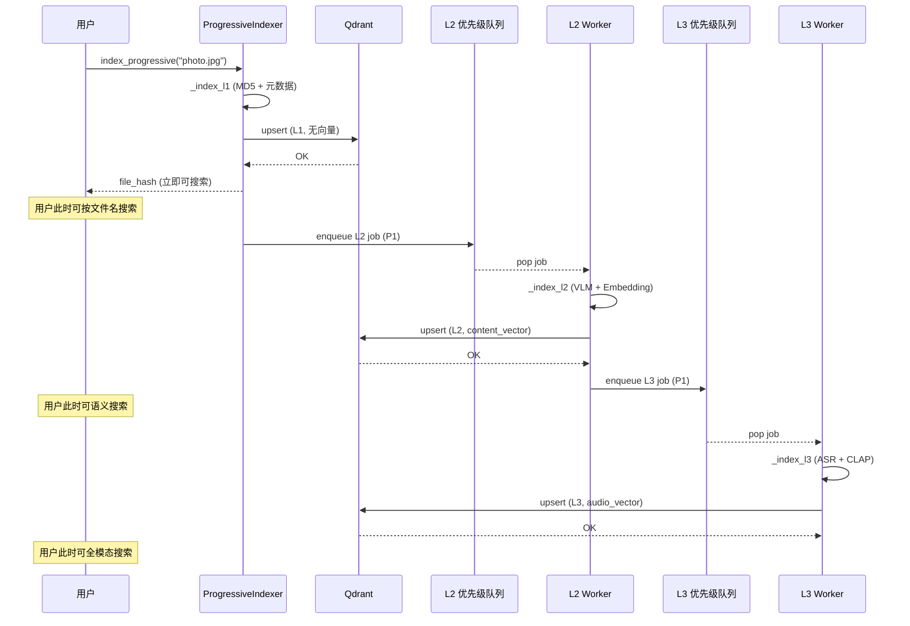

### 10.5 后台 Worker 启动示例

```python
# 初始化
disk_cache = DiskCacheManager(base_dir="~/.multimodal/cache")
handler = DegradationHandler()
bp = BatchProcessor(degradation_handler=handler, disk_cache=disk_cache)

indexer = ProgressiveIndexer(
    qdrant_client=qdrant_client,
    disk_cache=disk_cache,
    batch_processor=bp,
    degradation_handler=handler,
)

# 启动后台 worker（在单独的 asyncio 任务中）
async def main():
    # 启动 worker
    worker_task = asyncio.create_task(indexer.start_workers())

    # 索引文件（L1 同步完成，L2/L3 后台异步）
    file_hash = await indexer.index_progressive("/photos/sunset.jpg")

    # 文件已可按文件名搜索（L1）
    # L2/L3 在后台自动完成

    # 批量索引
    await indexer.index_batch_progressive([
        "/photos/img1.jpg",
        "/videos/clip1.mp4",
        "/audio/song.mp3",
    ])

    # 停止 worker
    await indexer.stop_workers()
    await worker_task

asyncio.run(main())
```

---

## 11. 缓存一致性

### 11.1 一致性挑战

缓存系统的核心矛盾是 **"缓存数据 vs 源数据"** 的一致性。本系统面临以下一致性场景：

| 场景 | 影响范围 | 一致性要求 | 处理策略 |
|------|----------|-----------|----------|
| 文件内容修改 | L2 磁盘缓存（4 种） | 强一致：旧缓存必须失效 | 基于 MD5 哈希自动失效 |
| 文件删除 | L2 磁盘缓存 + Qdrant | 最终一致：延迟清理 | 标记删除 + 定期 GC |
| 文件移动/重命名 | L2 磁盘缓存不受影响 | 无影响（基于内容哈希） | 无需处理 |
| 模型升级 | L1 内存 + L2 磁盘 | 强一致：旧结果全部失效 | 手动清除 |
| 批量索引完成 | L1 search_cache | 最终一致：旧结果可能不完整 | 索引完成后清除 |

### 11.2 缓存失效流程图

```mermaid
flowchart TB
    subgraph "文件修改场景"
        MOD[文件被修改] --> REHASH[重新计算 MD5]
        REHASH --> NEW_HASH[新 hash ≠ 旧 hash]
        NEW_HASH --> L2_MISS[L2 缓存自然未命中<br>新 hash 无对应缓存]
        L2_MISS --> RECOMPUTE[重新执行模型推理]
        RECOMPUTE --> STORE_NEW[写入新 hash 的 L2 缓存]
        STORE_NEW --> CLEANUP[定期清理旧 hash 的过期缓存]
    end

    subgraph "文件删除场景"
        DEL[文件被删除] --> MARK_DEL[Qdrant 标记 deleted=true]
        MARK_DEL --> CLEAR_SEARCH[清除 L1 search_cache]
        MARK_DEL --> L2_GC[L2 磁盘缓存 GC<br>定期扫描清除孤儿条目]
    end

    subgraph "模型升级场景"
        UPGRADE[模型权重更新] --> CLEAR_L1[清除 L1 embedding_cache]
        UPGRADE --> CLEAR_DESC[清除 L2 descriptions 缓存]
        UPGRADE --> CLEAR_ASR[清除 L2 asr_transcripts 缓存]
        UPGRADE --> CLEAR_CLAP[清除 L2 clap_embeddings 缓存]
    end

    style L2_MISS fill:#1a201a,stroke:#10B981
    style MARK_DEL fill:#3a1520,stroke:#EF4444
    style CLEAR_L1 fill:#3a2a15,stroke:#F59E0B
```

### 11.3 文件修改的一致性处理

本系统的 L2 磁盘缓存以 **文件内容 MD5** 为键，文件修改后内容变化导致 MD5 变化，新 MD5 在 L2 中自然未命中，因此会自动重新推理。旧 MD5 对应的缓存条目成为"孤儿"，由定期 GC 清理。

```python
"""
缓存一致性管理器

处理文件修改、删除时的缓存失效逻辑。
"""

import os
import time
import hashlib
import logging
from pathlib import Path
from typing import Optional

logger = logging.getLogger("multimodal.consistency")


class CacheConsistencyManager:
    """
    缓存一致性管理器

    职责:
      1. 文件修改检测: 基于修改时间 + MD5 双重验证
      2. 缓存失效: 文件修改/删除时清除相关缓存
      3. 孤儿缓存清理: 定期扫描清除无对应文件的 L2 缓存条目
      4. 模型升级处理: 清除受模型影响的全部缓存
    """

    # 文件哈希缓存: file_path -> (md5, mtime, size)
    # 避免每次都重新计算 MD5（仅当 mtime/size 变化时重算）
    _hash_cache: dict[str, tuple[str, float, int]] = {}

    def __init__(
        self,
        disk_cache: DiskCacheManager,
        l1_embedding_cache: LRUTTLCache,
        l1_search_cache: LRUTTLCache,
        qdrant_client=None,
    ):
        self.disk_cache = disk_cache
        self.embedding_cache = l1_embedding_cache
        self.search_cache = l1_search_cache
        self.qdrant = qdrant_client

    # ─── 文件修改检测 ──────────────────────────────────────────

    def get_file_hash(self, file_path: str) -> str:
        """
        获取文件内容哈希（带修改时间缓存）

        如果文件的 mtime 和 size 未变，直接返回缓存的 MD5。
        否则重新计算 MD5 并更新缓存。
        """
        stat = os.stat(file_path)
        mtime, size = stat.st_mtime, stat.st_size

        cached = self._hash_cache.get(file_path)
        if cached:
            cached_hash, cached_mtime, cached_size = cached
            if mtime == cached_mtime and size == cached_size:
                # 文件未修改，返回缓存哈希
                return cached_hash

        # 文件已修改或首次访问，重新计算
        new_hash = self.disk_cache.compute_file_hash(file_path)
        self._hash_cache[file_path] = (new_hash, mtime, size)
        return new_hash

    def has_file_changed(self, file_path: str, old_hash: str) -> bool:
        """
        检查文件是否已修改

        Args:
            file_path: 文件路径
            old_hash: 之前记录的文件哈希

        Returns:
            True 表示文件已修改
        """
        try:
            new_hash = self.get_file_hash(file_path)
            return new_hash != old_hash
        except FileNotFoundError:
            return True  # 文件已删除

    # ─── 文件修改时的缓存失效 ──────────────────────────────────

    def invalidate_on_file_update(self, file_path: str, old_hash: str):
        """
        文件修改时的缓存失效

        当检测到文件内容变化时，清除旧哈希对应的所有 L2 缓存条目。
        新哈希的缓存会在下次索引时自动写入。

        Args:
            file_path: 文件路径
            old_hash: 修改前的文件哈希
        """
        # 清除 L2 磁盘缓存中旧哈希的条目
        cache_names = ["descriptions", "asr_transcripts",
                       "clap_embeddings", "video_frames"]

        for cache_name in cache_names:
            if self.disk_cache.exists(cache_name, old_hash):
                self.disk_cache.delete(cache_name, old_hash)
                logger.info(
                    f"[Consistency] Invalidated {cache_name} "
                    f"for old hash {old_hash[:8]}..."
                )

        # 清除 L1 search_cache（检索结果可能包含旧文件）
        self.search_cache.clear()
        logger.info("[Consistency] Cleared L1 search_cache (file updated)")

        # 更新 Qdrant 中的索引（标记需要重新索引）
        if self.qdrant:
            try:
                from qdrant_client.models import PointStruct
                self.qdrant.upsert(
                    collection_name="multimodal_index",
                    points=[PointStruct(
                        id=old_hash,
                        vector={},
                        payload={"index_level": "L1", "needs_reindex": True},
                    )],
                )
            except Exception as e:
                logger.warning(f"[Consistency] Failed to update Qdrant: {e}")

    # ─── 文件删除时的缓存失效 ──────────────────────────────────

    def invalidate_on_file_delete(self, file_path: str, file_hash: str):
        """
        文件删除时的缓存失效

        清除所有与该文件相关的缓存条目和 Qdrant 索引。
        """
        # 清除 L2 磁盘缓存
        cache_names = ["descriptions", "asr_transcripts",
                       "clap_embeddings", "video_frames"]
        for cache_name in cache_names:
            self.disk_cache.delete(cache_name, file_hash)

        # 清除哈希缓存
        self._hash_cache.pop(file_path, None)

        # 清除 L1 search_cache
        self.search_cache.clear()

        # 从 Qdrant 删除
        if self.qdrant:
            try:
                self.qdrant.delete(
                    collection_name="multimodal_index",
                    points_selector={"points": [file_hash]},
                )
                logger.info(
                    f"[Consistency] Deleted Qdrant point for {file_path}"
                )
            except Exception as e:
                logger.warning(f"[Consistency] Failed to delete from Qdrant: {e}")

        logger.info(f"[Consistency] Cache invalidated for deleted file: {file_path}")

    # ─── 模型升级时的缓存失效 ──────────────────────────────────

    def invalidate_on_model_upgrade(self, model_type: str):
        """
        模型升级时的缓存失效

        Args:
            model_type: 模型类型 (vlm/asr/clap/embedding/reranker/llm)
        """
        if model_type == "vlm":
            # VLM 升级: 清除描述缓存 + embedding 缓存
            self.disk_cache.clear("descriptions")
            self.embedding_cache.clear()
            logger.info("[Consistency] Cleared VLM-related caches")

        elif model_type == "asr":
            self.disk_cache.clear("asr_transcripts")
            logger.info("[Consistency] Cleared ASR transcript cache")

        elif model_type == "clap":
            self.disk_cache.clear("clap_embeddings")
            logger.info("[Consistency] Cleared CLAP embedding cache")

        elif model_type == "embedding":
            self.embedding_cache.clear()
            self.search_cache.clear()
            logger.info("[Consistency] Cleared embedding + search caches")

        elif model_type == "reranker":
            self.search_cache.clear()
            logger.info("[Consistency] Cleared search cache (reranker upgraded)")

        elif model_type == "llm":
            self.search_cache.clear()
            logger.info("[Consistency] Cleared search cache (LLM upgraded)")

        # 清除哈希缓存（强制重新计算）
        self._hash_cache.clear()

    # ─── 孤儿缓存清理 ──────────────────────────────────────────

    def cleanup_orphaned_cache(self, valid_hashes: set[str]) -> dict:
        """
        清理孤儿缓存条目

        扫描 L2 磁盘缓存，删除不在 valid_hashes 中的条目。
        通常在以下场景执行:
          - 定期维护（每周/每月）
          - 大规模文件删除后
          - 磁盘空间不足时

        Args:
            valid_hashes: 当前有效的文件哈希集合

        Returns:
            清理统计 {cache_name: removed_count}
        """
        stats = {}
        cache_names = ["descriptions", "asr_transcripts",
                       "clap_embeddings", "video_frames"]

        for cache_name in cache_names:
            cache = self.disk_cache._caches.get(cache_name)
            if not cache:
                continue

            removed = 0
            # diskcache 遍历所有键
            for key in list(cache):
                # video_frames 的键格式为 "hash::params"，提取 hash 部分
                hash_part = key.split("::")[0] if "::" in key else key
                if hash_part not in valid_hashes:
                    cache.delete(key)
                    removed += 1

            stats[cache_name] = removed
            if removed > 0:
                logger.info(
                    f"[Consistency] Cleaned {removed} orphaned "
                    f"entries from {cache_name}"
                )

        return stats

    # ─── 批量索引完成后的缓存处理 ──────────────────────────────

    def on_batch_index_complete(self):
        """
        批量索引完成后的缓存处理

        清除 L1 search_cache，确保后续查询使用最新的索引数据。
        embedding_cache 保留（文本向量不受索引影响）。
        """
        self.search_cache.clear()
        logger.info("[Consistency] Cleared search_cache after batch index")
```

### 11.4 一致性保证机制总结

```mermaid
flowchart LR
    subgraph "强一致保证"
        HASH[内容哈希键<br>MD5(file_content)] --> AUTO_MISS[文件修改→新哈希<br>自动缓存未命中]
        INVALIDATE[主动失效<br>invalidate_on_*] --> DEL_OLD[删除旧哈希缓存]
    end

    subgraph "最终一致保证"
        TTL[TTL 过期<br>10min/24h] --> LAZY[惰性删除<br>下次访问时检查]
        GC[定期 GC<br>cleanup_orphaned_cache] --> SCAN[扫描孤儿条目<br>批量清除]
        BATCH[批量索引完成] --> CLEAR[清除 search_cache]
    end

    subgraph "手动一致保证"
        MODEL[model_upgrade] --> CLEAR_ALL[清除受影响缓存]
        MANUAL[手动 clear] --> CLEAR_SEL[清除指定缓存]
    end

    style AUTO_MISS fill:#1a201a,stroke:#10B981
    style TTL fill:#3a2a15,stroke:#F59E0B
    style MODEL fill:#3a1520,stroke:#EF4444
```

---

## 12. 性能数据

### 12.1 缓存命中率目标

| 缓存 | 目标命中率 | 测量周期 | 评估方法 | 低于目标时的行动 |
|------|-----------|----------|----------|-----------------|
| embedding_cache | 85-95% | 每日 | `stats()` 中 hits/(hits+misses) | 增大 LRU 容量（当前 5000） |
| search_cache | 60-80% | 每小时 | 同上 | 检查查询多样性，考虑增大 TTL |
| descriptions (L2) | 95-99% | 每周 | diskcache item_count / 总文件数 | 检查缓存容量是否不足 |
| asr_transcripts (L2) | 90-95% | 每周 | 同上 | 检查是否有大量新音频文件 |
| clap_embeddings (L2) | 90-95% | 每周 | 同上 | 同上 |
| video_frames (L2) | 85-95% | 每周 | 同上 | 检查抽帧参数是否频繁变化 |

### 12.2 各操作延时预期

#### 索引阶段延时

| 操作 | 首次（缓存未命中） | 二次（L2 缓存命中） | 加速比 | 备注 |
|------|-------------------|-------------------|--------|------|
| 图片 L1 快速索引 | 50-100ms | 50-100ms | 1x | 无缓存依赖，始终执行 |
| 图片 L2 VLM 分析 | 2-8s | 1-5ms (L2) | 400-8000x | Qwen3-VL 4-bit 推理 |
| 图片 L2 Embedding | 100-300ms | <0.1ms (L1) | 1000-3000x | bge-m3 模型 |
| 视频 L2 VLM 分析 | 5-15s | 1-5ms (L2) | 1000-15000x | 抽帧 + 多帧 VLM |
| 视频 L3 ASR 转写 | 3-30s | 1-5ms (L2) | 600-30000x | Whisper 模型 |
| 视频 L3 CLAP 嵌入 | 0.5-2s | 1-3ms (L2) | 170-2000x | CLAP 模型 |
| 音频 L3 ASR 转写 | 3-30s | 1-5ms (L2) | 600-30000x | 取决于音频时长 |
| 音频 L3 CLAP 嵌入 | 0.5-2s | 1-3ms (L2) | 170-2000x | 固定 512 维输出 |

#### 检索阶段延时

| 操作 | 首次（缓存未命中） | 二次（L1 缓存命中） | 加速比 | 备注 |
|------|-------------------|-------------------|--------|------|
| 文本查询向量化 | 100-300ms | <0.1ms | 1000-3000x | bge-m3 |
| 图片查询向量化 | 300ms | <0.1ms | 3000x | VLM + Embedding |
| 语音查询向量化 | 1-3s | <0.1ms | 10000-30000x | ASR + Embedding |
| Qdrant 向量检索 | ~5ms | ~5ms | 1x | 无法缓存检索本身 |
| Qdrant 检索结果 | 5-15ms | <0.1ms | 50-150x | search_cache |
| Reranker 精排 | 50-200ms | 50-200ms | 1x | 无法缓存 |
| LLM 推荐理由 | 1-5s | 1-5s | 1x | 无法缓存 |
| **总计（文字查询，全缓存命中）** | — | **~7ms** | — | 向量缓存 + 结果缓存 |
| **总计（文字查询，全未命中）** | **106-315ms** | — | — | 向量化 + 检索 + 精排 |
| **总计（视频查询，全缓存命中）** | — | **~7ms** | — | 从 5-15s 降至 7ms |

### 12.3 内存占用预算

```mermaid
flowchart LR
    subgraph "L1 内存缓存峰值"
        EMB[embedding_cache<br>5000 条 × 8KB<br>≈ 40-120 MB]
        SRCH[search_cache<br>200 条 × 50KB-1MB<br>≈ 10-200 MB]
        L1_TOTAL[L1 合计<br>峰值 ≈ 1 GB]
    end

    subgraph "L2 磁盘缓存总量"
        DESC_D[descriptions<br>10 GB]
        ASR_D[asr_transcripts<br>5 GB]
        CLAP_D[clap_embeddings<br>2 GB]
        FRAME_D[video_frames<br>20 GB]
        L2_TOTAL[L2 合计<br>37 GB]
    end

    subgraph "批量处理峰值内存"
        IMG_B[5x 图片 VLM<br>7.5 GB]
        AUD_B[3x ASR + 3x CLAP<br>4.2 GB]
        VID_B[1x 视频<br>3.0 GB]
        EMB_B[10x Embedding<br>3.0 GB]
        BATCH_NOTE[实际峰值<br>7.5-12 GB<br>不同时达到]
    end

    style L1_TOTAL fill:#1a201a,stroke:#10B981
    style L2_TOTAL fill:#1a1520,stroke:#8B5CF6
```

### 12.4 吞吐量预期

| 场景 | 文件数 | 预期总耗时 | 吞吐量 | 瓶颈 |
|------|--------|-----------|--------|------|
| 首次索引 100 张图片 | 100 | 40-160s | 25-150 张/min | VLM 推理 (Semaphore=5) |
| 二次索引 100 张图片 | 100 | <1s | >6000 张/min | L2 缓存命中 |
| 首次索引 10 个视频 (各 1min) | 10 | 2-10min | 1-5 个/min | 视频处理 (Semaphore=1) |
| 首次索引 50 个音频 | 50 | 1-5min | 10-50 个/min | ASR 转写 (Semaphore=3) |
| 混合批处理 200 文件 | 200 | 5-15min | 13-40 文件/min | 视频串行瓶颈 |
| 文字查询（缓存命中） | 1 | <7ms | >8500 查询/s | Qdrant 检索 |
| 文字查询（缓存未命中） | 1 | 106-315ms | 3-9 查询/s | 向量化 |

### 12.5 错误恢复时间预期

| 错误类型 | 恢复策略 | 预期恢复时间 | 用户感知 |
|---------|----------|-------------|----------|
| 模型加载超时 | 重试 3 次 (2+4+8s) | 最多 14s | 延时增加 0-14s |
| 推理超时 | 重试 3 次 (2+4+8s) | 最多 14s | 延时增加 0-14s |
| VLM 推理崩溃 | 降级到文件名 | <1s | 结果缺少视觉描述 |
| ASR 转写失败 | 降级到 CLAP only | <1s | 结果缺少语音内容 |
| Reranker 不可用 | 跳过精排 | <1s | 使用粗排结果 |
| LLM 不可用 | 跳过推荐理由 | <1s | 无推荐理由文本 |
| Qdrant 连接断开 | 返回 503 | 手动恢复 | 服务不可用 |

### 12.6 性能监控指标

```python
"""
性能监控 — 统一指标采集与输出

整合 L1/L2 缓存统计、批量处理统计、索引统计、降级统计，
提供系统运行状态的完整视图。
"""


class PerformanceMonitor:
    """系统性能监控器"""

    def __init__(
        self,
        embedding_cache: LRUTTLCache,
        search_cache: LRUTTLCache,
        disk_cache: DiskCacheManager,
        batch_processor: BatchProcessor,
        indexer: ProgressiveIndexer,
        degradation_handler: DegradationHandler,
    ):
        self.emb_cache = embedding_cache
        self.srch_cache = search_cache
        self.disk = disk_cache
        self.batch = batch_processor
        self.indexer = indexer
        self.degradation = degradation_handler

    def collect_metrics(self) -> dict:
        """采集全部性能指标"""
        return {
            "timestamp": time.time(),

            # L1 内存缓存
            "l1_embedding_cache": self.emb_cache.stats(),
            "l1_search_cache": self.srch_cache.stats(),

            # L2 磁盘缓存
            "l2_disk_cache": self.disk.stats(),

            # 索引统计
            "indexer_stats": self.indexer.get_stats(),

            # 降级统计
            "degradation_stats": self.degradation.get_failure_stats(),

            # 并发控制
            "concurrency": self.batch.get_concurrency_status(),
        }

    def print_report(self):
        """打印性能报告"""
        metrics = self.collect_metrics()

        print("=" * 70)
        print("  系统性能报告")
        print("=" * 70)

        # L1 缓存
        emb = metrics["l1_embedding_cache"]
        srch = metrics["l1_search_cache"]
        print(f"\n[L1 内存缓存]")
        print(f"  embedding_cache: {emb['size']}/{emb['max_size']} "
              f"条, 命中率 {emb['hit_rate']}, "
              f"内存 {emb['memory_mb']:.1f}MB")
        print(f"  search_cache:    {srch['size']}/{srch['max_size']} "
              f"条, 命中率 {srch['hit_rate']}, "
              f"内存 {srch['memory_mb']:.1f}MB")

        # L2 缓存
        print(f"\n[L2 磁盘缓存]")
        for name, stats in metrics["l2_disk_cache"].items():
            print(f"  {name:20s}: {stats['item_count']:>8d} 条, "
                  f"{stats['size_gb']:.2f}/{stats['limit_gb']:.0f} GB")

        # 索引统计
        idx = metrics["indexer_stats"]
        print(f"\n[渐进式索引]")
        print(f"  L1 完成: {idx['l1_completed']}, "
              f"L2 完成: {idx['l2_completed']}, "
              f"L3 完成: {idx['l3_completed']}")
        print(f"  L2 队列: {idx['l2_queue_size']}, "
              f"L3 队列: {idx['l3_queue_size']}")
        print(f"  L2 失败: {idx['l2_failed']}, "
              f"L3 失败: {idx['l3_failed']}")

        # 降级统计
        deg = metrics["degradation_stats"]
        if deg:
            print(f"\n[降级统计]")
            for component, count in deg.items():
                print(f"  {component:12s}: {count} 次失败")

        print("\n" + "=" * 70)


# 使用示例
# monitor = PerformanceMonitor(
#     embedding_cache, search_cache, disk_cache,
#     batch_processor, indexer, degradation_handler,
# )
# monitor.print_report()
```

### 12.7 性能基准测试建议

| 测试场景 | 测试方法 | 预期结果 | 验收标准 |
|---------|----------|----------|----------|
| 缓存命中率 | 索引 1000 文件后查询 100 次 | embedding_cache >85%, search_cache >60% | 命中率达标 |
| 二次索引加速 | 同一文件索引两次，对比耗时 | 二次 <1s（首次 10-60s） | 加速 >100x |
| 查询缓存加速 | 同一查询执行两次，对比耗时 | 二次 <7ms（首次 100-300ms） | 加速 >50x |
| 降级可用性 | 杀死 VLM 进程后索引文件 | 文件仍入库，标记 DEGRADED | 无文件丢失 |
| 重试恢复 | 模拟模型加载超时 | 3 次重试后恢复或降级 | 无用户可见错误 |
| 并发安全 | 同时索引 50 个文件 | 无 OOM，无数据竞争 | 内存 <20GB |
| 渐进式可用 | 索引后立即搜索 | L1 完成即可按文件名搜索 | <1s 可搜索 |

---

## 附录：模块依赖关系

```mermaid
flowchart TB
    subgraph "缓存层"
        L1[L1 内存缓存<br>LRUTTLCache]
        L2[L2 磁盘缓存<br>DiskCacheManager]
    end

    subgraph "容错层"
        ERR[错误分级<br>MultimodalError]
        DEG[降级处理器<br>DegradationHandler]
        RTY[重试机制<br>retry_with_backoff]
    end

    subgraph "处理层"
        BP[批量处理器<br>BatchProcessor]
        CC[并发控制<br>ConcurrencyController]
        PI[渐进式索引<br>ProgressiveIndexer]
    end

    subgraph "一致性层"
        CONS[缓存一致性<br>CacheConsistencyManager]
    end

    subgraph "外部依赖"
        QD[Qdrant]
        VLM_M[VLM 模型]
        ASR_M[ASR 模型]
        CLAP_M[CLAP 模型]
        EMB_M[Embedding 模型]
    end

    L1 --> PI
    L2 --> PI
    L2 --> BP

    ERR --> DEG
    ERR --> RTY
    DEG --> BP
    DEG --> PI
    RTY --> PI

    BP --> CC
    PI --> BP
    PI --> QD

    CONS --> L1
    CONS --> L2
    CONS --> QD

    PI --> VLM_M
    PI --> ASR_M
    PI --> CLAP_M
    PI --> EMB_M

    style L1 fill:#1a201a,stroke:#10B981
    style L2 fill:#1a1520,stroke:#8B5CF6
    style ERR fill:#3a1520,stroke:#EF4444
    style DEG fill:#3a2a15,stroke:#F59E0B
    style PI fill:#1a2a20,stroke:#10B981
    style CONS fill:#3a2a15,stroke:#F59E0B
```

---

[← 返回目录](00-目录索引.md)

