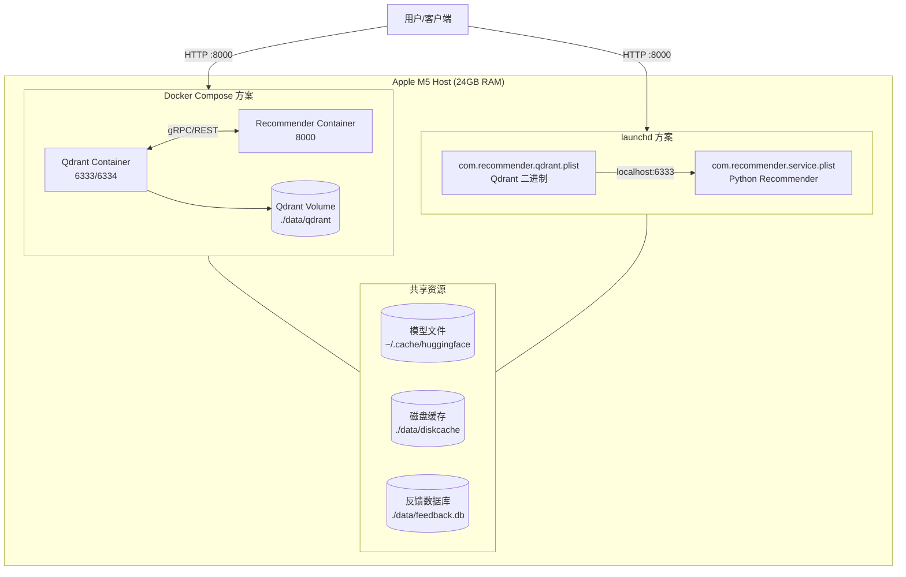
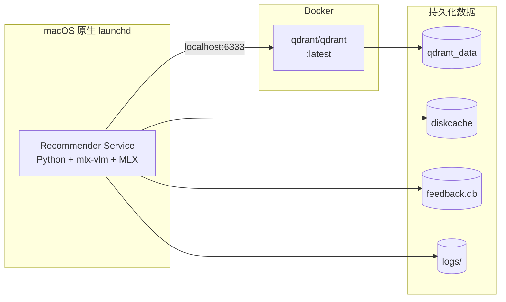
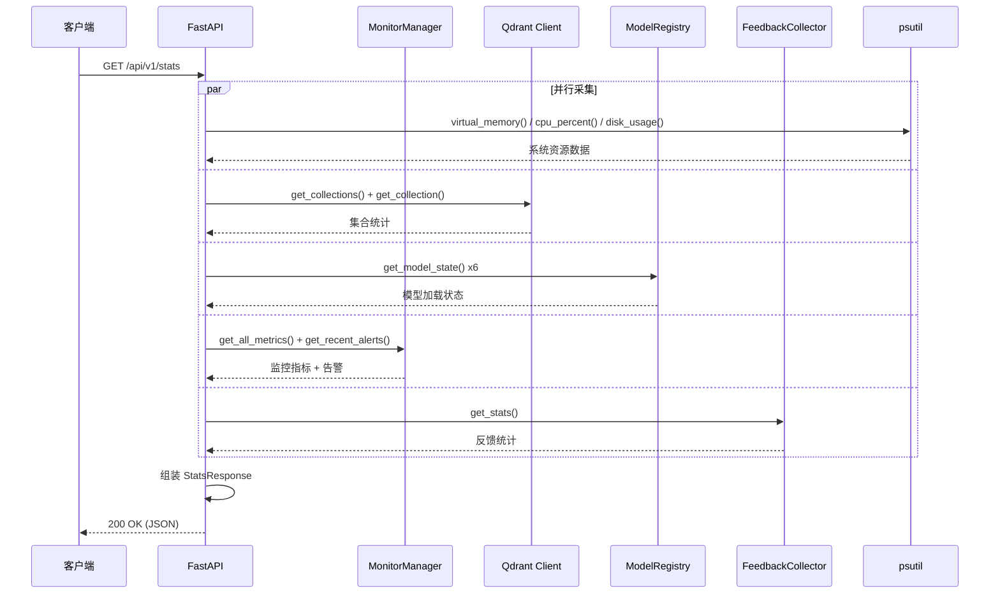
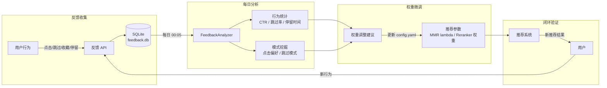
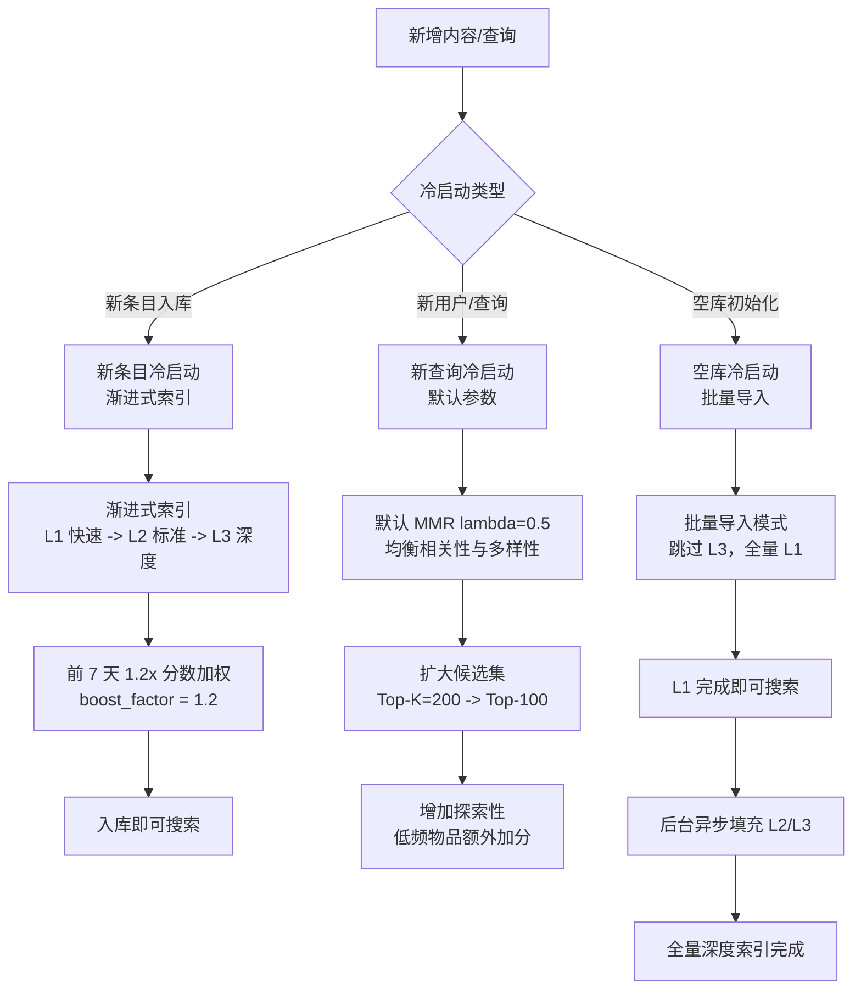
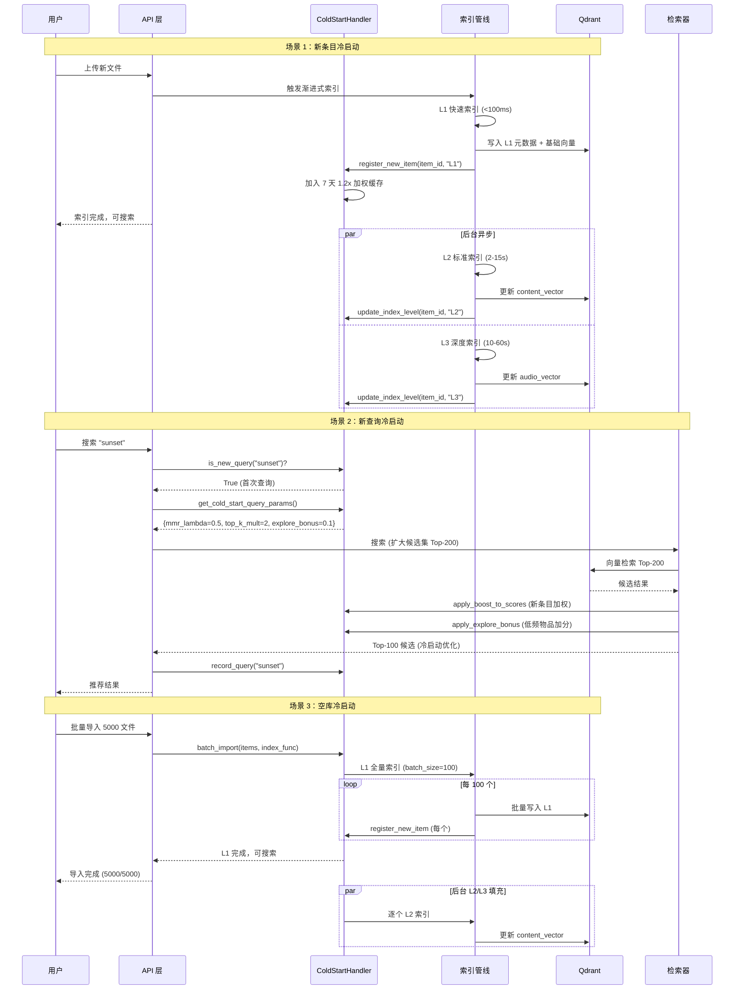
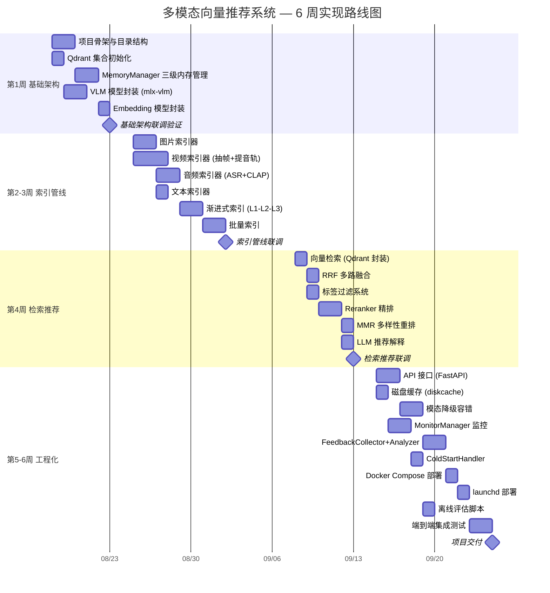

[← 返回目录](00-目录索引.md)

# 09 — 部署运维与评估

> **运行环境**：Apple M5 (24GB RAM) · macOS · Docker Compose / launchd · psutil + diskcache 监控
>
> | 组件 | 部署方式 | 职责 |
> |------|---------|------|
> | Qdrant | Docker 容器 | 向量数据库服务 |
> | Recommender | Docker 容器 / launchd | 推荐系统主服务（API + 索引 + 检索 + 推荐） |
> | Monitor | 内嵌于 Recommender | 指标采集 + 告警 + 降级 |
> | Feedback | SQLite (内嵌) | 用户行为收集 + 分析 |
>
> 版本：2026-08-14 · 文档定位：部署方案、监控告警、离线/在线评估、反馈闭环、冷启动策略与实现路线图

---

## 目录

1. [部署方案总览](#1-部署方案总览)
2. [Docker Compose 部署](#2-docker-compose-部署)
3. [macOS launchd 部署](#3-macos-launchd-部署)
4. [项目结构](#4-项目结构)
5. [监控体系](#5-监控体系)
6. [系统状态 API](#6-系统状态-api)
7. [离线评估](#7-离线评估)
8. [在线反馈闭环](#8-在线反馈闭环)
9. [冷启动策略](#9-冷启动策略)
10. [实现路线图](#10-实现路线图)
11. [配置管理](#11-配置管理)
12. [日志规范](#12-日志规范)

---

## 1. 部署方案总览

本系统在 Apple M5 (24GB RAM) 单机上运行，提供两种部署方案：**Docker Compose**（推荐，容器化隔离）和 **macOS launchd**（原生后台服务，开机自启）。两种方案可根据使用场景灵活切换。

### 1.1 部署架构图



### 1.2 两种方案对比

| 维度 | Docker Compose | macOS launchd |
|------|---------------|---------------|
| **隔离性** | 容器级隔离，依赖不污染宿主 | 进程级，直接使用宿主 Python 环境 |
| **部署复杂度** | 低（`docker compose up -d`） | 中（需手动安装依赖 + 配置 plist） |
| **开机自启** | 需额外配置 Docker Desktop 自启 | 原生支持（`RunAtLoad=true`） |
| **资源开销** | 额外 ~200MB Docker Engine | 零额外开销 |
| **GPU/MPS 访问** | 需挂载 Metal 设备（实验性） | 原生 MPS 加速，无额外配置 |
| **MLX 兼容性** | 需验证容器内 MLX/MPS 可用 | 原生兼容，mlx-vlm 最佳性能 |
| **日志管理** | `docker logs` + 文件挂载 | 统一写入 `~/Library/Logs/` |
| **更新方式** | 重新 build 镜像 + restart | `git pull` + `launchctl reload` |
| **适用场景** | 快速验证、环境隔离、团队协作 | 生产长期运行、最大化 GPU 性能 |
| **推荐度** | 开发/测试环境 | 生产环境（M5 单机最优） |

> **关键决策**：由于 mlx-vlm 依赖 Apple MLX 框架和 Metal Performance Shaders，Docker 容器内 MPS 访问尚属实验性功能。对于依赖 VLM 推理的核心场景，**launchd 方案为生产首选**；Docker Compose 适用于 Qdrant 单独容器化 + Recommender 本地运行的混合方案。

### 1.3 推荐混合部署策略

实际部署中推荐混合方案：Qdrant 使用 Docker 容器运行（避免编译复杂性），Recommender 使用 launchd 原生运行（保证 MLX/MPS 性能）。



---

## 2. Docker Compose 部署

### 2.1 目录结构

```
multimodal-recommender/
├── docker-compose.yml          # 编排配置
├── docker-compose.override.yml # 本地覆盖配置（可选）
├── .env                        # 环境变量
├── qdrant/
│   └── config/
│       └── qdrant.yaml         # Qdrant 自定义配置
├── recommender/
│   ├── Dockerfile              # Recommender 镜像构建
│   ├── requirements.txt        # Python 依赖
│   └── entrypoint.sh           # 容器入口脚本
└── data/                       # 持久化数据（gitignore）
    ├── qdrant/                 # Qdrant 存储
    ├── diskcache/              # 磁盘缓存
    ├── feedback.db             # 反馈数据库
    └── logs/                   # 日志文件
```

### 2.2 docker-compose.yml

```yaml
# docker-compose.yml
# 多模态向量推荐系统 — Docker Compose 编排
# Apple M5 (24GB RAM) 本地部署

version: "3.9"

services:
  # ============================================================
  # Qdrant 向量数据库
  # ============================================================
  qdrant:
    image: qdrant/qdrant:latest
    container_name: recommender-qdrant
    restart: unless-stopped
    ports:
      - "6333:6333"   # REST API
      - "6334:6334"   # gRPC
    volumes:
      - ./data/qdrant:/qdrant/storage
      - ./qdrant/config/qdrant.yaml:/qdrant/config/production.yaml
    environment:
      - QDRANT__LOG_LEVEL=INFO
    healthcheck:
      test: ["CMD", "curl", "-f", "http://localhost:6333/health"]
      interval: 10s
      timeout: 5s
      retries: 3
      start_period: 10s
    deploy:
      resources:
        limits:
          memory: 2G
    networks:
      - recommender-net

  # ============================================================
  # Recommender 主服务
  # ============================================================
  recommender:
    build:
      context: ./recommender
      dockerfile: Dockerfile
    container_name: recommender-service
    restart: unless-stopped
    ports:
      - "8000:8000"
    volumes:
      - ./data/diskcache:/app/data/diskcache
      - ./data/feedback.db:/app/data/feedback.db
      - ./data/logs:/app/data/logs
      - ./config.yaml:/app/config.yaml
      # 模型文件挂载（避免容器内重新下载）
      - ~/.cache/huggingface:/root/.cache/huggingface
      # 媒体库挂载（索引源文件）
      - ~/MediaLibrary:/app/media:ro
    environment:
      - QDRANT_URL=http://qdrant:6333
      - CONFIG_PATH=/app/config.yaml
      - LOG_LEVEL=INFO
      - PYTHONUNBUFFERED=1
      # MPS 可用性（容器内实验性）
      - PYTORCH_ENABLE_MPS_FALLBACK=1
    depends_on:
      qdrant:
        condition: service_healthy
    deploy:
      resources:
        limits:
          memory: 18G
    networks:
      - recommender-net

networks:
  recommender-net:
    driver: bridge
    name: recommender-network
```

### 2.3 docker-compose.override.yml（本地开发覆盖）

```yaml
# docker-compose.override.yml
# 本地开发覆盖配置：启用热重载、调试端口、详细日志

version: "3.9"

services:
  recommender:
    build:
      target: development
    volumes:
      # 挂载源码用于热重载
      - ./src:/app/src
      - ./tests:/app/tests
    environment:
      - LOG_LEVEL=DEBUG
      - RELOAD=true
    ports:
      - "8000:8000"
      - "5678:5678"  # debugpy 远程调试端口
    command: ["python", "-m", "debugpy", "--listen", "0.0.0.0:5678", "-m", "uvicorn", "src.api.main:app", "--host", "0.0.0.0", "--port", "8000", "--reload"]
```

### 2.4 Dockerfile

```dockerfile
# recommender/Dockerfile
# 多阶段构建：base → development → production

# ============================================================
# Stage 1: Base — 安装系统依赖 + Python 环境
# ============================================================
FROM python:3.11-slim AS base

# 系统依赖
RUN apt-get update && apt-get install -y --no-install-recommends \
    build-essential \
    cmake \
    git \
    curl \
    ffmpeg \
    libsndfile1 \
    && rm -rf /var/lib/apt/lists/*

# 工作目录
WORKDIR /app

# 安装 Python 依赖（利用 Docker 层缓存）
COPY requirements.txt .
RUN pip install --no-cache-dir -r requirements.txt

# 复制源码
COPY . /app

# ============================================================
# Stage 2: Development — 开发环境
# ============================================================
FROM base AS development

RUN pip install --no-cache-dir \
    debugpy==1.8.5 \
    pytest==8.3.2 \
    pytest-asyncio==0.23.8 \
    httpx==0.27.0

CMD ["python", "-m", "uvicorn", "src.api.main:app", "--host", "0.0.0.0", "--port", "8000", "--reload"]

# ============================================================
# Stage 3: Production — 生产环境
# ============================================================
FROM base AS production

# 非 root 用户运行
RUN useradd -m -u 1000 recommender
USER recommender

EXPOSE 8000

HEALTHCHECK --interval=30s --timeout=10s --start-period=60s --retries=3 \
    CMD curl -f http://localhost:8000/api/v1/health || exit 1

ENTRYPOINT ["/app/entrypoint.sh"]
CMD ["python", "-m", "uvicorn", "src.api.main:app", "--host", "0.0.0.0", "--port", "8000", "--workers", "1"]
```

### 2.5 entrypoint.sh

```bash
#!/bin/bash
# recommender/entrypoint.sh
# 容器入口脚本：等待 Qdrant 就绪 → 启动服务

set -e

echo "[entrypoint] 等待 Qdrant 就绪..."
QDRANT_HOST="${QDRANT_URL:-http://qdrant:6333}"
QDRANT_HOST=$(echo "$QDRANT_HOST" | sed 's|https\?://||')

MAX_RETRIES=30
RETRY_COUNT=0

until curl -sf "http://${QDRANT_HOST}/health" > /dev/null 2>&1; do
    RETRY_COUNT=$((RETRY_COUNT + 1))
    if [ $RETRY_COUNT -ge $MAX_RETRIES ]; then
        echo "[entrypoint] Qdrant 连接超时，退出"
        exit 1
    fi
    echo "[entrypoint] 等待 Qdrant... ($RETRY_COUNT/$MAX_RETRIES)"
    sleep 2
done

echo "[entrypoint] Qdrant 就绪"

# 初始化集合（如果不存在）
echo "[entrypoint] 检查 Qdrant 集合..."
python -m src.init_collections || echo "[entrypoint] 集合初始化跳过（可能已存在）"

echo "[entrypoint] 启动 Recommender 服务..."
exec "$@"
```

### 2.6 requirements.txt

```txt
# recommender/requirements.txt
# 多模态向量推荐系统 Python 依赖

# ============================================================
# Web 框架
# ============================================================
fastapi==0.115.0
uvicorn[standard]==0.30.6
pydantic==2.9.0
pydantic-settings==2.5.2
python-multipart==0.0.9

# ============================================================
# 向量数据库
# ============================================================
qdrant-client==1.11.0

# ============================================================
# AI 模型推理
# ============================================================
# mlx-vlm（Apple M 芯片优化，容器内可能降级为 CPU）
mlx-vlm==0.1.16
mlx-lm==0.19.3

# transformers 生态
transformers==4.44.2
torch==2.4.0
accelerate==0.33.0
sentencepiece==0.2.0

# 音频处理
librosa==0.10.2.post1
soundfile==0.12.1

# 图像处理
Pillow==10.4.0

# ============================================================
# 工具库
# ============================================================
numpy==1.26.4
scipy==1.14.1
scikit-learn==1.5.1

# 磁盘缓存
diskcache==5.6.3

# 系统监控
psutil==6.0.0

# 数据库 ORM（用于反馈分析）
sqlmodel==0.0.21

# 日志
loguru==0.7.2

# 配置管理
pyyaml==6.0.2

# 视频处理
ffmpeg-python==0.2.0

# 异步任务队列（索引用）
asyncio-extras==1.3.2
aiofiles==24.1.0
```

### 2.7 Qdrant 自定义配置

```yaml
# qdrant/config/qdrant.yaml
# Qdrant 生产环境配置

service:
  host: 0.0.0.0
  http_port: 6333
  grpc_port: 6334

storage:
  storage_type: rust
  optimize_for_ssd: false
  performance:
    max_search_threads: 4
  wal:
    wal_capacity_mb: 32
    wal_segments_ahead: 0
  snapshots:
    snapshots_path: /qdrant/snapshots

# 日志级别
log_level: INFO

# 集群（单机模式，无集群配置）
cluster:
  enabled: false

# 遥测关闭
telemetry_disabled: true
```

### 2.8 .env 环境变量

```bash
# .env
# Docker Compose 环境变量

# Qdrant
QDRANT_URL=http://qdrant:6333

# Recommender
CONFIG_PATH=/app/config.yaml
LOG_LEVEL=INFO
PYTHONUNBUFFERED=1

# MPS（容器内实验性，回退 CPU）
PYTORCH_ENABLE_MPS_FALLBACK=1

# 数据路径
DISKCACHE_DIR=/app/data/diskcache
FEEDBACK_DB_PATH=/app/data/feedback.db
LOG_DIR=/app/data/logs
```

### 2.9 部署命令

```bash
# 构建并启动全部服务
docker compose up -d --build

# 查看日志
docker compose logs -f recommender
docker compose logs -f qdrant

# 查看服务状态
docker compose ps

# 停止全部服务
docker compose down

# 停止并清除数据（慎用）
docker compose down -v

# 单独重建 Recommender
docker compose up -d --build recommender

# 进入容器调试
docker compose exec recommender bash
docker compose exec qdrant sh
```

---

## 3. macOS launchd 部署

launchd 是 macOS 原生的服务管理框架，支持开机自启、进程守护、日志重定向。对于依赖 MLX/MPS 的 Recommender 服务，launchd 方案能最大化 GPU 加速能力。

### 3.1 前置条件

```bash
# 1. 安装 Homebrew（如未安装）
/bin/bash -c "$(curl -fsSL https://raw.githubusercontent.com/Homebrew/install/HEAD/install.sh)"

# 2. 安装 Python 3.11
brew install python@3.11

# 3. 创建虚拟环境
python3.11 -m venv ~/recommender-venv
source ~/recommender-venv/bin/activate

# 4. 安装依赖
pip install -r requirements.txt

# 5. 安装 Qdrant（二进制方式，不走 Docker）
brew install qdrant

# 6. 创建数据和日志目录
mkdir -p ~/Library/Logs/Recommender
mkdir -p ~/recommender-data/qdrant
mkdir -p ~/recommender-data/diskcache
mkdir -p ~/recommender-data/logs
```

### 3.2 Qdrant launchd 配置

```xml
<?xml version="1.0" encoding="UTF-8"?>
<!DOCTYPE plist PUBLIC "-//Apple//DTD PLIST 1.0//EN" "http://www.apple.com/DTDs/PropertyList-1.0.dtd">
<plist version="1.0">
<dict>
    <!-- 服务标签 -->
    <key>Label</key>
    <string>com.recommender.qdrant</string>

    <!-- 启动命令 -->
    <key>ProgramArguments</key>
    <array>
        <string>/opt/homebrew/bin/qdrant</string>
        <string>--config-path</string>
        <string>/opt/homebrew/etc/qdrant/qdrant.yaml</string>
    </array>

    <!-- 开机自启 -->
    <key>RunAtLoad</key>
    <true/>

    <!-- 进程守护：崩溃后自动重启 -->
    <key>KeepAlive</key>
    <dict>
        <key>SuccessfulExit</key>
        <false/>
        <key>Crashed</key>
        <true/>
    </dict>

    <!-- 重启间隔（秒） -->
    <key>ThrottleInterval</key>
    <integer>10</integer>

    <!-- 环境变量 -->
    <key>EnvironmentVariables</key>
    <dict>
        <key>QDRANT__STORAGE__STORAGE_PATH</key>
        <string>/Users/USER/recommender-data/qdrant</string>
        <key>QDRANT__LOG_LEVEL</key>
        <string>INFO</string>
    </dict>

    <!-- 标准输出日志 -->
    <key>StandardOutPath</key>
    <string>/Users/USER/Library/Logs/Recommender/qdrant.out.log</string>

    <!-- 标准错误日志 -->
    <key>StandardErrorPath</key>
    <string>/Users/USER/Library/Logs/Recommender/qdrant.err.log</string>

    <!-- 进程优先级 -->
    <key>ProcessType</key>
    <string>Background</string>
</dict>
</plist>
```

> **注意**：上述 XML 中的 `/Users/USER` 需替换为实际用户主目录路径。

### 3.3 Recommender launchd 配置

```xml
<?xml version="1.0" encoding="UTF-8"?>
<!DOCTYPE plist PUBLIC "-//Apple//DTD PLIST 1.0//EN" "http://www.apple.com/DTDs/PropertyList-1.0.dtd">
<plist version="1.0">
<dict>
    <!-- 服务标签 -->
    <key>Label</key>
    <string>com.recommender.service</string>

    <!-- 启动命令 -->
    <key>ProgramArguments</key>
    <array>
        <!-- Python 虚拟环境路径 -->
        <string>/Users/USER/recommender-venv/bin/python</string>
        <string>-m</string>
        <string>uvicorn</string>
        <string>src.api.main:app</string>
        <string>--host</string>
        <string>0.0.0.0</string>
        <string>--port</string>
        <string>8000</string>
        <string>--workers</string>
        <string>1</string>
    </array>

    <!-- 工作目录 -->
    <key>WorkingDirectory</key>
    <string>/Users/USER/projects/multimodal-recommender</string>

    <!-- 开机自启 -->
    <key>RunAtLoad</key>
    <true/>

    <!-- 进程守护 -->
    <key>KeepAlive</key>
    <dict>
        <key>SuccessfulExit</key>
        <false/>
        <key>Crashed</key>
        <true/>
    </dict>

    <!-- 重启间隔 -->
    <key>ThrottleInterval</key>
    <integer>15</integer>

    <!-- 环境变量 -->
    <key>EnvironmentVariables</key>
    <dict>
        <key>QDRANT_URL</key>
        <string>http://localhost:6333</string>
        <key>CONFIG_PATH</key>
        <string>/Users/USER/projects/multimodal-recommender/config.yaml</string>
        <key>LOG_LEVEL</key>
        <string>INFO</string>
        <key>PYTHONUNBUFFERED</key>
        <string>1</string>
        <key>DISKCACHE_DIR</key>
        <string>/Users/USER/recommender-data/diskcache</string>
        <key>FEEDBACK_DB_PATH</key>
        <string>/Users/USER/recommender-data/feedback.db</string>
        <key>LOG_DIR</key>
        <string>/Users/USER/recommender-data/logs</string>
        <!-- MPS 原生可用，无需 fallback -->
        <key>MLX_USE_METAL</key>
        <string>1</string>
    </dict>

    <!-- 标准输出日志 -->
    <key>StandardOutPath</key>
    <string>/Users/USER/Library/Logs/Recommender/service.out.log</string>

    <!-- 标准错误日志 -->
    <key>StandardErrorPath</key>
    <string>/Users/USER/Library/Logs/Recommender/service.err.log</string>

    <!-- 进程优先级：自适应 -->
    <key>ProcessType</key>
    <string>Adaptive</string>

    <!-- 限速：低 I/O 优先级 -->
    <key>LowPriorityIO</key>
    <true/>
</dict>
</plist>
```

### 3.4 加载与管理命令

```bash
# ============================================================
# plist 文件安装位置
# ============================================================
# 用户级服务（推荐）：~/Library/LaunchAgents/
# 系统级服务（需 sudo）：/Library/LaunchDaemons/

PLIST_DIR="$HOME/Library/LaunchAgents"

# 复制 plist 文件
cp com.recommender.qdrant.plist "$PLIST_DIR/"
cp com.recommender.service.plist "$PLIST_DIR/"

# ============================================================
# 加载服务
# ============================================================
# 加载 Qdrant
launchctl load "$PLIST_DIR/com.recommender.qdrant.plist"

# 加载 Recommender（需在 Qdrant 之后）
launchctl load "$PLIST_DIR/com.recommender.service.plist"

# ============================================================
# 卸载服务
# ============================================================
launchctl unload "$PLIST_DIR/com.recommender.service.plist"
launchctl unload "$PLIST_DIR/com.recommender.qdrant.plist"

# ============================================================
# 服务管理
# ============================================================
# 查看服务状态
launchctl list | grep recommender

# 启动已加载的服务
launchctl start com.recommender.qdrant
launchctl start com.recommender.service

# 停止服务（不卸载）
launchctl stop com.recommender.service

# 重启服务
launchctl stop com.recommender.service && launchctl start com.recommender.service

# ============================================================
# 日志查看
# ============================================================
# 实时查看 Recommender 日志
tail -f ~/Library/Logs/Recommender/service.out.log
tail -f ~/Library/Logs/Recommender/service.err.log

# 查看 Qdrant 日志
tail -f ~/Library/Logs/Recommender/qdrant.out.log

# ============================================================
# 修改 plist 后重新加载
# ============================================================
launchctl unload "$PLIST_DIR/com.recommender.service.plist"
launchctl load "$PLIST_DIR/com.recommender.service.plist"
```

### 3.5 服务健康检查脚本

```bash
#!/bin/bash
# scripts/health-check.sh
# 定期检查服务健康状态，异常时发送通知

QDRANT_URL="http://localhost:6333"
RECOMMENDER_URL="http://localhost:8000/api/v1/health"
LOG_FILE="$HOME/recommender-data/logs/health-check.log"

log() {
    echo "[$(date '+%Y-%m-%d %H:%M:%S')] $1" >> "$LOG_FILE"
}

# 检查 Qdrant
if curl -sf "$QDRANT_URL/health" > /dev/null 2>&1; then
    log "Qdrant: OK"
else
    log "Qdrant: FAIL — 尝试重启..."
    launchctl stop com.recommender.qdrant 2>/dev/null
    sleep 5
    launchctl start com.recommender.qdrant
    log "Qdrant: 重启命令已发送"
fi

# 检查 Recommender
if curl -sf "$RECOMMENDER_URL" > /dev/null 2>&1; then
    log "Recommender: OK"
else
    log "Recommender: FAIL — 尝试重启..."
    launchctl stop com.recommender.service 2>/dev/null
    sleep 10
    launchctl start com.recommender.service
    log "Recommender: 重启命令已发送"
fi

# 检查内存使用率
MEM_PCT=$(vm_stat | awk '/Pages active/ {active=$3} /Pages wired/ {wired=$3} /Pageouts/ {free=$3} END {printf "%.1f", (active+wired)/(active+wired+free)*100}')
if (( $(echo "$MEM_PCT > 92" | bc -l) )); then
    log "WARNING: 内存使用率 ${MEM_PCT}%，超过 92% 阈值"
    # 触发 Recommender 热缓存清理
    curl -X POST "http://localhost:8000/api/v1/admin/evict-cache" 2>/dev/null
    log "已触发热缓存清理"
fi
```

### 3.6 定时健康检查 launchd 配置

```xml
<?xml version="1.0" encoding="UTF-8"?>
<!DOCTYPE plist PUBLIC "-//Apple//DTD PLIST 1.0//EN" "http://www.apple.com/DTDs/PropertyList-1.0.dtd">
<plist version="1.0">
<dict>
    <key>Label</key>
    <string>com.recommender.health-check</string>

    <key>ProgramArguments</key>
    <array>
        <string>/bin/bash</string>
        <string>/Users/USER/projects/multimodal-recommender/scripts/health-check.sh</string>
    </array>

    <!-- 每 5 分钟执行一次 -->
    <key>StartInterval</key>
    <integer>300</integer>

    <key>RunAtLoad</key>
    <true/>

    <key>StandardOutPath</key>
    <string>/Users/USER/Library/Logs/Recommender/health-check.out.log</string>
    <key>StandardErrorPath</key>
    <string>/Users/USER/Library/Logs/Recommender/health-check.err.log</string>
</dict>
</plist>
```

---

## 4. 项目结构

### 4.1 完整目录树

```
multimodal-recommender/
│
├── config.yaml                          # 全局配置文件
├── docker-compose.yml                   # Docker Compose 编排
├── docker-compose.override.yml          # 本地开发覆盖（可选）
├── .env                                 # 环境变量
├── requirements.txt                     # Python 依赖
├── README.md                            # 项目说明
├── Makefile                             # 常用命令快捷方式
│
├── src/                                 # 源代码
│   ├── __init__.py
│   │
│   ├── api/                             # API 层
│   │   ├── __init__.py
│   │   ├── main.py                      # FastAPI 应用入口
│   │   ├── routes/                      # 路由模块
│   │   │   ├── __init__.py
│   │   │   ├── search.py                # 搜索接口 /api/v1/search
│   │   │   ├── recommend.py             # 推荐接口 /api/v1/recommend
│   │   │   ├── index.py                 # 索引接口 /api/v1/index
│   │   │   ├── stats.py                 # 状态接口 /api/v1/stats
│   │   │   ├── feedback.py              # 反馈接口 /api/v1/feedback
│   │   │   └── admin.py                 # 管理接口 /api/v1/admin
│   │   ├── middleware.py                # 中间件（CORS、日志、限流）
│   │   └── schemas.py                   # 请求/响应 Pydantic 模型
│   │
│   ├── core/                            # 核心模块
│   │   ├── __init__.py
│   │   ├── config.py                    # 配置加载（Pydantic Settings）
│   │   ├── memory_manager.py            # 三级内存管理 (L0/L1/L2)
│   │   ├── model_registry.py            # 模型注册表
│   │   └── exceptions.py                # 自定义异常
│   │
│   ├── models/                          # AI 模型封装
│   │   ├── __init__.py
│   │   ├── vlm_model.py                 # VLM 视觉语言模型 (mlx-vlm)
│   │   ├── embedding_model.py           # Embedding 模型 (Qwen3-Embedding-2B)
│   │   ├── reranker_model.py            # Reranker 模型 (Qwen3-VL-Reranker-2B)
│   │   ├── llm_model.py                 # LLM 模型 (bonsai-8b-mlx)
│   │   ├── asr_model.py                 # ASR 语音识别 (Whisper)
│   │   └── clap_model.py                # CLAP 音频模型
│   │
│   ├── indexing/                        # 索引管线
│   │   ├── __init__.py
│   │   ├── pipeline.py                  # 索引主管线
│   │   ├── image_indexer.py             # 图片索引器
│   │   ├── video_indexer.py             # 视频索引器
│   │   ├── audio_indexer.py             # 音频索引器
│   │   ├── text_indexer.py              # 文本索引器
│   │   ├── progressive.py               # 渐进式索引 (L1->L2->L3)
│   │   └── batch.py                     # 批量索引
│   │
│   ├── retrieval/                       # 检索引擎
│   │   ├── __init__.py
│   │   ├── vector_search.py             # Qdrant 向量检索
│   │   ├── query_encoder.py             # 查询向量化
│   │   ├── rrf.py                       # RRF 多路融合
│   │   ├── filter.py                    # 标签过滤
│   │   └── retriever.py                 # 检索器封装
│   │
│   ├── recommendation/                  # 推荐引擎
│   │   ├── __init__.py
│   │   ├── reranker.py                  # Reranker 精排
│   │   ├── mmr.py                       # MMR 多样性重排
│   │   ├── llm_explainer.py             # LLM 推荐解释
│   │   ├── engine.py                    # 推荐引擎入口
│   │   └── cold_start.py                # 冷启动处理器
│   │
│   ├── monitoring/                      # 监控体系
│   │   ├── __init__.py
│   │   ├── manager.py                   # MonitorManager 主管理器
│   │   ├── metrics.py                   # 指标定义与采集
│   │   ├── alerts.py                    # 告警规则与通知
│   │   └── health.py                    # 健康检查
│   │
│   ├── feedback/                        # 反馈闭环
│   │   ├── __init__.py
│   │   ├── collector.py                 # FeedbackCollector
│   │   ├── analyzer.py                  # FeedbackAnalyzer
│   │   ├── database.py                  # SQLite 数据库管理
│   │   └── models.py                    # 反馈数据模型
│   │
│   ├── evaluation/                      # 评估模块
│   │   ├── __init__.py
│   │   ├── offline.py                   # 离线评估指标
│   │   ├── online.py                    # 在线评估指标
│   │   ├── dataset.py                   # 评估数据集加载
│   │   └── report.py                    # 评估报告生成
│   │
│   └── utils/                           # 工具函数
│       ├── __init__.py
│       ├── cache.py                     # 磁盘缓存封装
│       ├── logging.py                   # 日志配置
│       ├── timer.py                     # 计时器装饰器
│       └── helpers.py                   # 通用辅助函数
│
├── scripts/                             # 运维脚本
│   ├── health-check.sh                  # 健康检查脚本
│   ├── init_collections.py              # Qdrant 集合初始化
│   ├── batch_index.py                   # 批量索引脚本
│   ├── run_evaluation.py                # 运行离线评估
│   ├── daily_analysis.py               # 每日反馈分析
│   └── backup_qdrant.sh                # Qdrant 快照备份
│
├── tests/                               # 测试
│   ├── __init__.py
│   ├── conftest.py                      # pytest fixtures
│   ├── test_api/                        # API 测试
│   ├── test_retrieval/                  # 检索测试
│   ├── test_recommendation/             # 推荐测试
│   ├── test_monitoring/                 # 监控测试
│   └── test_evaluation/                 # 评估测试
│
├── docker/                              # Docker 相关
│   ├── recommender/
│   │   ├── Dockerfile                   # Recommender 镜像
│   │   ├── entrypoint.sh                # 容器入口
│   │   └── requirements.txt             # 容器依赖
│   └── qdrant/
│       └── config/
│           └── qdrant.yaml              # Qdrant 配置
│
├── launchd/                             # launchd 配置
│   ├── com.recommender.qdrant.plist
│   ├── com.recommender.service.plist
│   └── com.recommender.health-check.plist
│
├── data/                                # 持久化数据（gitignore）
│   ├── qdrant/                          # Qdrant 存储
│   ├── diskcache/                       # 磁盘缓存
│   ├── feedback.db                      # 反馈数据库
│   └── logs/                            # 日志文件
│
├── evaluation/                          # 评估数据
│   ├── datasets/                        # 标注数据集
│   ├── results/                         # 评估结果
│   └── reports/                         # 评估报告
│
└── docs/                                # 文档
    ├── architecture/                    # 架构文档
    ├── api/                             # API 文档
    └── operations/                      # 运维文档
```

### 4.2 关键模块职责说明

| 模块 | 路径 | 职责 | 依赖 |
|------|------|------|------|
| API 层 | `src/api/` | HTTP 接口、请求校验、响应序列化 | FastAPI |
| 核心层 | `src/core/` | 配置加载、内存管理、模型注册 | Pydantic, psutil |
| 模型层 | `src/models/` | VLM/Embedding/Reranker/LLM/ASR/CLAP 封装 | mlx-vlm, transformers |
| 索引层 | `src/indexing/` | 多模态索引管线、渐进式索引 | 模型层, Qdrant |
| 检索层 | `src/retrieval/` | 向量检索、RRF 融合、标签过滤 | Qdrant |
| 推荐层 | `src/recommendation/` | 精排、MMR、LLM 解释、冷启动 | 检索层, 模型层 |
| 监控层 | `src/monitoring/` | 指标采集、告警、健康检查 | psutil, diskcache |
| 反馈层 | `src/feedback/` | 用户行为收集、分析、权重微调 | SQLite |
| 评估层 | `src/evaluation/` | 离线/在线评估、报告生成 | numpy, scikit-learn |

---

## 5. 监控体系

### 5.1 监控架构

```mermaid
flowchart TB
    subgraph METRICS["指标采集层"]
        M1[内存使用率<br>psutil.virtual_memory]
        M2[Qdrant 连接<br>心跳检测]
        M3[搜索 P95 延时<br>请求计时]
        M4[索引队列积压<br>队列长度]
        M5[磁盘缓存占用<br>diskcache.volume_size]
        M6[模型加载失败率<br>异常计数]
    end

    subgraph ENGINE["监控引擎"]
        MM[MonitorManager<br>定时采集 + 阈值判断]
        ALERT[AlertEngine<br>告警规则匹配]
        ACTION[ActionExecutor<br>处理动作执行]
    end

    subgraph ACTIONS["处理动作"]
        A1[驱逐热缓存模型]
        A2[自动重连 + 降级]
        A3[跳过 LLM 解释]
        A4[提升索引并发]
        A5[LRU 清理磁盘缓存]
        A6[检查模型文件]
    end

    subgraph OUTPUT["输出"]
        LOG[日志记录]
        STATS[/api/v1/stats<br>状态 API]
        NOTIFY[告警通知]
    end

    M1 --> MM
    M2 --> MM
    M3 --> MM
    M4 --> MM
    M5 --> MM
    M6 --> MM

    MM --> ALERT
    ALERT --> ACTION

    ACTION --> A1
    ACTION --> A2
    ACTION --> A3
    ACTION --> A4
    ACTION --> A5
    ACTION --> A6

    MM --> LOG
    MM --> STATS
    ALERT --> NOTIFY
```

### 5.2 监控指标定义

| 指标 | 采集方式 | 采集间隔 | 告警阈值 | 处理动作 | 严重级别 |
|------|---------|---------|---------|---------|---------|
| 内存使用率 | `psutil.virtual_memory()` | 10s | >90% | 驱逐 L1 热缓存模型 | CRITICAL |
| Qdrant 连接 | HTTP GET `/health` 心跳 | 5s | 连续 3 次失败 | 自动重连 + 搜索降级 | CRITICAL |
| 搜索 P95 延时 | 请求计时 (滑动窗口) | 每请求 | >10s | 跳过 LLM 解释环节 | WARNING |
| 索引队列积压 | `queue.qsize()` | 5s | >500 | 提升索引并发数 | WARNING |
| 磁盘缓存占用 | `diskcache.volume_size()` | 60s | >35GB | LRU 自动清理 | WARNING |
| 模型加载失败率 | 异常计数 / 总尝试 | 60s 滑窗 | >5%/h | 记录 + 检查模型文件 | WARNING |

### 5.3 MonitorManager 完整实现

```python
# src/monitoring/manager.py
"""
MonitorManager — 系统监控管理器
定时采集 6 项核心指标，根据阈值触发告警和自动处理动作。
"""

import time
import threading
import psutil
import diskcache
from collections import deque
from dataclasses import dataclass, field
from enum import Enum
from typing import Callable, Optional
from datetime import datetime, timedelta
import logging

logger = logging.getLogger(__name__)


class AlertLevel(Enum):
    """告警级别"""
    INFO = "info"
    WARNING = "warning"
    CRITICAL = "critical"
    RECOVERY = "recovery"


class MetricStatus(Enum):
    """指标状态"""
    NORMAL = "normal"
    WARNING = "warning"
    CRITICAL = "critical"


@dataclass
class MetricRecord:
    """单条指标记录"""
    name: str
    value: float
    unit: str
    status: MetricStatus
    timestamp: datetime
    threshold: float
    message: str = ""


@dataclass
class AlertEvent:
    """告警事件"""
    metric_name: str
    level: AlertLevel
    message: str
    timestamp: datetime
    action_taken: str = ""
    resolved: bool = False


@dataclass
class LatencyWindow:
    """延时滑动窗口"""
    window_size: int = 100
    values: deque = field(default_factory=lambda: deque(maxlen=100))

    def add(self, value: float) -> None:
        self.values.append(value)

    def percentile(self, p: float) -> float:
        if not self.values:
            return 0.0
        sorted_vals = sorted(self.values)
        idx = int(len(sorted_vals) * p / 100)
        idx = min(idx, len(sorted_vals) - 1)
        return sorted_vals[idx]

    def count(self) -> int:
        return len(self.values)


class MonitorManager:
    """
    系统监控管理器

    职责：
    1. 定时采集 6 项核心指标（内存、Qdrant、延时、队列、磁盘、模型）
    2. 根据阈值判断指标状态（NORMAL / WARNING / CRITICAL）
    3. 触发对应的自动处理动作（驱逐缓存、重连、降级等）
    4. 记录告警事件，供 /api/v1/stats 查询
    """

    # 默认阈值配置
    DEFAULT_THRESHOLDS = {
        "memory_usage": {"warning": 0.85, "critical": 0.90},
        "qdrant_health": {"warning": 1, "critical": 3},
        "search_p95_latency": {"warning": 5.0, "critical": 10.0},
        "index_queue_backlog": {"warning": 200, "critical": 500},
        "disk_cache_size": {"warning": 30e9, "critical": 35e9},
        "model_load_failure_rate": {"warning": 0.03, "critical": 0.05},
    }

    def __init__(
        self,
        qdrant_url: str = "http://localhost:6333",
        diskcache_path: str = "./data/diskcache",
        thresholds: Optional[dict] = None,
        on_alert: Optional[Callable[[AlertEvent], None]] = None,
        on_action: Optional[Callable[[str, dict], None]] = None,
    ):
        """
        Args:
            qdrant_url: Qdrant 服务地址
            diskcache_path: 磁盘缓存路径
            thresholds: 自定义阈值（覆盖默认）
            on_alert: 告警回调函数
            on_action: 处理动作回调函数
        """
        self.qdrant_url = qdrant_url
        self.diskcache_path = diskcache_path
        self.thresholds = {**self.DEFAULT_THRESHOLDS, **(thresholds or {})}
        self.on_alert = on_alert
        self.on_action = on_action

        # 指标存储
        self._metrics: dict[str, MetricRecord] = {}
        self._alerts: deque[AlertEvent] = deque(maxlen=200)
        self._alert_active: dict[str, bool] = {}

        # Qdrant 连续失败计数
        self._qdrant_fail_count = 0

        # 搜索延时滑动窗口
        self._latency_window = LatencyWindow(window_size=100)

        # 索引队列引用（外部注入）
        self._index_queue = None

        # 模型加载统计
        self._model_load_attempts = 0
        self._model_load_failures = 0
        self._model_load_window_start = datetime.now()

        # 磁盘缓存引用
        self._diskcache: Optional[diskcache.Cache] = None

        # 监控线程
        self._monitor_thread: Optional[threading.Thread] = None
        self._running = False
        self._lock = threading.Lock()

        # 处理动作注册表
        self._action_handlers: dict[str, Callable] = {
            "evict_cache": self._action_evict_cache,
            "reconnect_qdrant": self._action_reconnect_qdrant,
            "skip_llm_explanation": self._action_skip_llm,
            "boost_index_concurrency": self._action_boost_concurrency,
            "lru_disk_cleanup": self._action_lru_cleanup,
            "check_model_files": self._action_check_models,
        }

        # 降级状态标记
        self.degraded_state = {
            "llm_explanation_skipped": False,
            "search_degraded": False,
            "index_concurrency_boosted": False,
        }

    # ============================================================
    # 公开接口
    # ============================================================

    def start(self, interval: float = 10.0) -> None:
        """启动监控线程"""
        if self._running:
            return
        self._running = True
        self._monitor_thread = threading.Thread(
            target=self._monitor_loop,
            args=(interval,),
            daemon=True,
            name="monitor",
        )
        self._monitor_thread.start()
        logger.info("MonitorManager 已启动，采集间隔 %.1fs", interval)

    def stop(self) -> None:
        """停止监控线程"""
        self._running = False
        if self._monitor_thread:
            self._monitor_thread.join(timeout=5)
        logger.info("MonitorManager 已停止")

    def record_search_latency(self, latency: float) -> None:
        """记录单次搜索延时（供检索器调用）"""
        self._latency_window.add(latency)

    def record_model_load(self, success: bool) -> None:
        """记录模型加载结果"""
        self._model_load_attempts += 1
        if not success:
            self._model_load_failures += 1

    def set_index_queue(self, queue) -> None:
        """注入索引队列引用，用于积压监控"""
        self._index_queue = queue

    def get_all_metrics(self) -> list[dict]:
        """获取所有指标当前值（供 /api/v1/stats 使用）"""
        with self._lock:
            return [
                {
                    "name": r.name,
                    "value": r.value,
                    "unit": r.unit,
                    "status": r.status.value,
                    "threshold": r.threshold,
                    "message": r.message,
                    "timestamp": r.timestamp.isoformat(),
                }
                for r in self._metrics.values()
            ]

    def get_recent_alerts(self, limit: int = 20) -> list[dict]:
        """获取最近告警事件"""
        with self._lock:
            return [
                {
                    "metric": a.metric_name,
                    "level": a.level.value,
                    "message": a.message,
                    "action": a.action_taken,
                    "timestamp": a.timestamp.isoformat(),
                    "resolved": a.resolved,
                }
                for a in list(self._alerts)[-limit:]
            ]

    def get_degraded_state(self) -> dict:
        """获取当前降级状态"""
        return dict(self.degraded_state)

    # ============================================================
    # 监控主循环
    # ============================================================

    def _monitor_loop(self, interval: float) -> None:
        """监控主循环"""
        while self._running:
            try:
                self._collect_all_metrics()
                self._check_alerts()
            except Exception as e:
                logger.error("监控循环异常: %s", e, exc_info=True)
            time.sleep(interval)

    def _collect_all_metrics(self) -> None:
        """采集所有指标"""
        self._collect_memory()
        self._collect_qdrant_health()
        self._collect_search_latency()
        self._collect_index_queue()
        self._collect_disk_cache()
        self._collect_model_load_rate()

    # ============================================================
    # 指标采集方法
    # ============================================================

    def _collect_memory(self) -> None:
        """采集内存使用率"""
        mem = psutil.virtual_memory()
        usage_ratio = mem.used / mem.total
        status = self._evaluate_status(
            usage_ratio,
            self.thresholds["memory_usage"]["warning"],
            self.thresholds["memory_usage"]["critical"],
        )
        self._set_metric(
            "memory_usage",
            round(usage_ratio * 100, 1),
            "%",
            status,
            self.thresholds["memory_usage"]["critical"] * 100,
            f"已用 {mem.used / 1e9:.1f}GB / {mem.total / 1e9:.1f}GB",
        )

    def _collect_qdrant_health(self) -> None:
        """采集 Qdrant 连接状态"""
        import requests
        try:
            resp = requests.get(f"{self.qdrant_url}/health", timeout=3)
            if resp.status_code == 200:
                self._qdrant_fail_count = 0
                status = MetricStatus.NORMAL
                value = 0
                msg = "连接正常"
            else:
                self._qdrant_fail_count += 1
                status = self._evaluate_status(
                    self._qdrant_fail_count,
                    self.thresholds["qdrant_health"]["warning"],
                    self.thresholds["qdrant_health"]["critical"],
                )
                value = self._qdrant_fail_count
                msg = f"HTTP {resp.status_code}"
        except Exception:
            self._qdrant_fail_count += 1
            status = self._evaluate_status(
                self._qdrant_fail_count,
                self.thresholds["qdrant_health"]["warning"],
                self.thresholds["qdrant_health"]["critical"],
            )
            value = self._qdrant_fail_count
            msg = "连接失败"

        self._set_metric(
            "qdrant_health", value, "failures", status,
            self.thresholds["qdrant_health"]["critical"], msg,
        )

    def _collect_search_latency(self) -> None:
        """采集搜索 P95 延时"""
        p95 = self._latency_window.percentile(95)
        status = self._evaluate_status(
            p95,
            self.thresholds["search_p95_latency"]["warning"],
            self.thresholds["search_p95_latency"]["critical"],
        )
        self._set_metric(
            "search_p95_latency", round(p95, 3), "seconds", status,
            self.thresholds["search_p95_latency"]["critical"],
            f"窗口内 {self._latency_window.count()} 次请求",
        )

    def _collect_index_queue(self) -> None:
        """采集索引队列积压"""
        if self._index_queue is None:
            self._set_metric(
                "index_queue_backlog", 0, "items", MetricStatus.NORMAL,
                self.thresholds["index_queue_backlog"]["critical"], "队列未注册",
            )
            return

        queue_size = self._index_queue.qsize() if hasattr(self._index_queue, "qsize") else 0
        status = self._evaluate_status(
            queue_size,
            self.thresholds["index_queue_backlog"]["warning"],
            self.thresholds["index_queue_backlog"]["critical"],
        )
        self._set_metric(
            "index_queue_backlog", queue_size, "items", status,
            self.thresholds["index_queue_backlog"]["critical"],
            f"队列积压 {queue_size} 项",
        )

    def _collect_disk_cache(self) -> None:
        """采集磁盘缓存占用"""
        try:
            if self._diskcache is None:
                self._diskcache = diskcache.Cache(self.diskcache_path)
            cache_size = self._diskcache.volume_size()
        except Exception:
            cache_size = 0

        status = self._evaluate_status(
            cache_size,
            self.thresholds["disk_cache_size"]["warning"],
            self.thresholds["disk_cache_size"]["critical"],
        )
        self._set_metric(
            "disk_cache_size", round(cache_size / 1e9, 2), "GB", status,
            self.thresholds["disk_cache_size"]["critical"] / 1e9,
            f"缓存占用 {cache_size / 1e9:.2f}GB",
        )

    def _collect_model_load_rate(self) -> None:
        """采集模型加载失败率（每小时）"""
        now = datetime.now()
        elapsed = (now - self._model_load_window_start).total_seconds()

        # 每小时重置一次窗口
        if elapsed > 3600:
            self._model_load_attempts = 0
            self._model_load_failures = 0
            self._model_load_window_start = now
            elapsed = 0

        if self._model_load_attempts == 0:
            failure_rate = 0.0
        else:
            failure_rate = self._model_load_failures / self._model_load_attempts

        status = self._evaluate_status(
            failure_rate,
            self.thresholds["model_load_failure_rate"]["warning"],
            self.thresholds["model_load_failure_rate"]["critical"],
        )
        self._set_metric(
            "model_load_failure_rate", round(failure_rate * 100, 2), "%", status,
            self.thresholds["model_load_failure_rate"]["critical"] * 100,
            f"尝试 {self._model_load_attempts} 次，失败 {self._model_load_failures} 次",
        )

    # ============================================================
    # 告警检查与动作触发
    # ============================================================

    def _check_alerts(self) -> None:
        """检查所有指标，触发告警和动作"""
        metric_action_map = {
            "memory_usage": "evict_cache",
            "qdrant_health": "reconnect_qdrant",
            "search_p95_latency": "skip_llm_explanation",
            "index_queue_backlog": "boost_index_concurrency",
            "disk_cache_size": "lru_disk_cleanup",
            "model_load_failure_rate": "check_model_files",
        }

        for metric_name, action_name in metric_action_map.items():
            record = self._metrics.get(metric_name)
            if record is None:
                continue

            is_critical = record.status == MetricStatus.CRITICAL
            is_warning = record.status == MetricStatus.WARNING
            was_active = self._alert_active.get(metric_name, False)

            if (is_critical or is_warning) and not was_active:
                # 新告警触发
                level = AlertLevel.CRITICAL if is_critical else AlertLevel.WARNING
                alert = AlertEvent(
                    metric_name=metric_name,
                    level=level,
                    message=record.message,
                    timestamp=datetime.now(),
                )
                self._trigger_alert(alert, action_name, record)
                self._alert_active[metric_name] = True

            elif not is_critical and not is_warning and was_active:
                # 告警恢复
                recovery = AlertEvent(
                    metric_name=metric_name,
                    level=AlertLevel.RECOVERY,
                    message=f"{metric_name} 已恢复正常",
                    timestamp=datetime.now(),
                    resolved=True,
                )
                self._alerts.append(recovery)
                self._alert_active[metric_name] = False
                self._restore_state(metric_name)
                logger.info("指标 %s 已恢复正常", metric_name)

    def _trigger_alert(
        self, alert: AlertEvent, action_name: str, record: MetricRecord
    ) -> None:
        """触发告警并执行处理动作"""
        handler = self._action_handlers.get(action_name)
        action_desc = ""
        if handler:
            try:
                action_desc = handler() or ""
            except Exception as e:
                action_desc = f"动作执行失败: {e}"
                logger.error("处理动作 %s 执行失败: %s", action_name, e, exc_info=True)

        alert.action_taken = action_desc
        self._alerts.append(alert)

        if self.on_alert:
            try:
                self.on_alert(alert)
            except Exception:
                pass

        logger.warning(
            "告警触发 [%s] %s: %s → 动作: %s",
            alert.level.value, alert.metric_name, alert.message, action_desc,
        )

    # ============================================================
    # 处理动作实现
    # ============================================================

    def _action_evict_cache(self) -> str:
        """驱逐 L1 热缓存模型"""
        if self.on_action:
            self.on_action("evict_cache", {"reason": "memory_critical"})
        self.degraded_state["cache_evicted"] = True
        return "已驱逐 L1 热缓存模型，释放内存"

    def _action_reconnect_qdrant(self) -> str:
        """Qdrant 自动重连 + 搜索降级"""
        self.degraded_state["search_degraded"] = True
        if self.on_action:
            self.on_action("reconnect_qdrant", {"fail_count": self._qdrant_fail_count})
        return f"已标记搜索降级（连续失败 {self._qdrant_fail_count} 次），等待自动重连"

    def _action_skip_llm(self) -> str:
        """跳过 LLM 解释环节"""
        self.degraded_state["llm_explanation_skipped"] = True
        return "已启用降级模式：跳过 LLM 推荐解释，仅返回 Reranker 结果"

    def _action_boost_concurrency(self) -> str:
        """提升索引并发数"""
        self.degraded_state["index_concurrency_boosted"] = True
        if self.on_action:
            self.on_action("boost_index_concurrency", {"new_concurrency": 8})
        return "已提升索引并发至 8（原 5）"

    def _action_lru_cleanup(self) -> str:
        """LRU 清理磁盘缓存"""
        try:
            if self._diskcache is None:
                self._diskcache = diskcache.Cache(self.diskcache_path)
            evicted = self._diskcache.expire()
            total = len(self._diskcache)
            to_evict = int(total * 0.2)
            if to_evict > 0:
                keys_to_remove = []
                for i, key in enumerate(self._diskcache):
                    if i >= to_evict:
                        break
                    keys_to_remove.append(key)
                for key in keys_to_remove:
                    del self._diskcache[key]
            return f"LRU 清理完成：过期 {evicted} 条，强制淘汰 {to_evict} 条"
        except Exception as e:
            return f"LRU 清理失败: {e}"

    def _action_check_models(self) -> str:
        """检查模型文件完整性"""
        import os
        model_paths = [
            "~/.cache/huggingface/hub/models--Qwen--Qwen3-VL-8B-Instruct",
            "~/.cache/huggingface/hub/models--Qwen--Qwen3-Embedding-2B",
            "~/.cache/huggingface/hub/models--Qwen--Qwen3-VL-Reranker-2B",
            "~/.cache/huggingface/hub/models--mlx-community--bonsai-8b",
        ]
        results = []
        for path in model_paths:
            full_path = os.path.expanduser(path)
            exists = os.path.exists(full_path)
            results.append(f"{'OK' if exists else 'MISSING'} {path.split('--')[-1]}")
        return "模型文件检查: " + "; ".join(results)

    def _restore_state(self, metric_name: str) -> None:
        """告警恢复时重置降级状态"""
        if metric_name == "memory_usage":
            self.degraded_state.pop("cache_evicted", None)
        elif metric_name == "qdrant_health":
            self.degraded_state["search_degraded"] = False
        elif metric_name == "search_p95_latency":
            self.degraded_state["llm_explanation_skipped"] = False
        elif metric_name == "index_queue_backlog":
            self.degraded_state["index_concurrency_boosted"] = False

    # ============================================================
    # 辅助方法
    # ============================================================

    def _evaluate_status(
        self, value: float, warning: float, critical: float
    ) -> MetricStatus:
        """根据阈值评估指标状态"""
        if value >= critical:
            return MetricStatus.CRITICAL
        elif value >= warning:
            return MetricStatus.WARNING
        return MetricStatus.NORMAL

    def _set_metric(
        self, name: str, value: float, unit: str,
        status: MetricStatus, threshold: float, message: str,
    ) -> None:
        """设置指标值"""
        with self._lock:
            self._metrics[name] = MetricRecord(
                name=name, value=value, unit=unit, status=status,
                timestamp=datetime.now(), threshold=threshold, message=message,
            )
```

### 5.4 监控指标采集流程

```mermaid
sequenceDiagram
    participant Loop as MonitorLoop (10s)
    participant MM as MonitorManager
    participant PS as psutil
    participant QD as Qdrant
    participant DC as diskcache
    participant Log as Logger

    loop 每 10 秒
        Loop->>MM: _collect_all_metrics()

        Note over MM: 1. 内存采集
        MM->>PS: virtual_memory()
        PS-->>MM: used/total ratio
        MM->>MM: 评估状态 (>90% = CRITICAL)

        Note over MM: 2. Qdrant 心跳
        MM->>QD: GET /health
        QD-->>MM: 200 OK / 超时
        MM->>MM: 更新连续失败计数

        Note over MM: 3. 搜索 P95 延时
        MM->>MM: 计算 latency_window.percentile(95)

        Note over MM: 4. 索引队列积压
        MM->>MM: 读取 queue.qsize()

        Note over MM: 5. 磁盘缓存占用
        MM->>DC: volume_size()
        DC-->>MM: bytes

        Note over MM: 6. 模型加载失败率
        MM->>MM: failures/attempts (1h 窗口)

        Note over MM: 告警检查
        MM->>MM: 遍历指标，匹配阈值
        alt CRITICAL 触发
            MM->>MM: 执行处理动作
            MM->>Log: WARNING 告警日志
        end
    end
```

---

## 6. 系统状态 API

### 6.1 API 概述

`GET /api/v1/stats` 返回系统完整运行状态，包括监控指标、降级状态、最近告警、Qdrant 集合统计和系统资源信息。该接口供运维仪表盘和健康检查脚本调用。

### 6.2 响应结构

```json
{
  "status": "healthy",
  "timestamp": "2026-08-14T10:30:00.123456",
  "uptime_seconds": 86400,

  "system": {
    "platform": "macOS 26.5.2",
    "chip": "Apple M5",
    "memory": {
      "total_gb": 24.0,
      "used_gb": 16.8,
      "usage_pct": 70.0,
      "available_gb": 7.2
    },
    "cpu": {
      "usage_pct": 12.5,
      "core_count": 12
    },
    "disk": {
      "total_gb": 512.0,
      "used_gb": 234.5,
      "usage_pct": 45.8
    }
  },

  "qdrant": {
    "status": "connected",
    "url": "http://localhost:6333",
    "collections": {
      "multimodal_items": {
        "points_count": 15234,
        "vectors_count": 28456,
        "indexed": true,
        "status": "green"
      }
    }
  },

  "models": {
    "vlm": {"loaded": false, "tier": "L1", "memory_mb": 0},
    "embedding": {"loaded": true, "tier": "L0", "memory_mb": 2048},
    "reranker": {"loaded": false, "tier": "L1", "memory_mb": 0},
    "llm": {"loaded": false, "tier": "L1", "memory_mb": 0},
    "asr": {"loaded": false, "tier": "L2", "memory_mb": 0},
    "clap": {"loaded": false, "tier": "L2", "memory_mb": 0}
  },

  "monitoring": {
    "metrics": [
      {
        "name": "memory_usage",
        "value": 70.0,
        "unit": "%",
        "status": "normal",
        "threshold": 90.0,
        "message": "已用 16.8GB / 24.0GB",
        "timestamp": "2026-08-14T10:29:55.000000"
      },
      {
        "name": "qdrant_health",
        "value": 0,
        "unit": "failures",
        "status": "normal",
        "threshold": 3,
        "message": "连接正常",
        "timestamp": "2026-08-14T10:29:55.000000"
      },
      {
        "name": "search_p95_latency",
        "value": 1.234,
        "unit": "seconds",
        "status": "normal",
        "threshold": 10.0,
        "message": "窗口内 87 次请求",
        "timestamp": "2026-08-14T10:29:55.000000"
      }
    ],
    "degraded_state": {
      "llm_explanation_skipped": false,
      "search_degraded": false,
      "index_concurrency_boosted": false
    },
    "recent_alerts": [
      {
        "metric": "memory_usage",
        "level": "recovery",
        "message": "memory_usage 已恢复正常",
        "action": "",
        "timestamp": "2026-08-14T09:15:00.000000",
        "resolved": true
      }
    ]
  },

  "feedback": {
    "total_events": 3421,
    "events_today": 87,
    "last_analysis": "2026-08-14T00:05:00.000000",
    "top_clicked_categories": ["风景", "人物", "音乐"]
  }
}
```

### 6.3 Python 实现

```python
# src/api/routes/stats.py
"""
系统状态 API
GET /api/v1/stats     — 完整系统状态
GET /api/v1/health    — 健康检查（轻量）
"""

import time
import psutil
import platform
import subprocess
from datetime import datetime
from fastapi import APIRouter, Depends
from pydantic import BaseModel
from typing import Optional

router = APIRouter(prefix="/api/v1", tags=["stats"])

# 服务启动时间
_START_TIME = time.time()


# ============================================================
# 依赖注入：获取各组件引用
# ============================================================

def get_monitor_manager():
    """获取 MonitorManager 实例"""
    from src.api.main import app_state
    return app_state.monitor_manager


def get_qdrant_client():
    """获取 Qdrant 客户端"""
    from src.api.main import app_state
    return app_state.qdrant_client


def get_model_registry():
    """获取模型注册表"""
    from src.api.main import app_state
    return app_state.model_registry


def get_feedback_collector():
    """获取反馈收集器"""
    from src.api.main import app_state
    return app_state.feedback_collector


# ============================================================
# 响应模型
# ============================================================

class MetricResponse(BaseModel):
    name: str
    value: float
    unit: str
    status: str
    threshold: float
    message: str
    timestamp: str


class SystemInfo(BaseModel):
    platform: str
    chip: str
    memory: dict
    cpu: dict
    disk: dict


class QdrantInfo(BaseModel):
    status: str
    url: str
    collections: dict


class ModelInfo(BaseModel):
    loaded: bool
    tier: str
    memory_mb: int


class MonitoringInfo(BaseModel):
    metrics: list[dict]
    degraded_state: dict
    recent_alerts: list[dict]


class FeedbackInfo(BaseModel):
    total_events: int
    events_today: int
    last_analysis: Optional[str]
    top_clicked_categories: list[str]


class StatsResponse(BaseModel):
    status: str
    timestamp: str
    uptime_seconds: float
    system: SystemInfo
    qdrant: QdrantInfo
    models: dict[str, ModelInfo]
    monitoring: MonitoringInfo
    feedback: FeedbackInfo


# ============================================================
# 接口实现
# ============================================================

@router.get("/stats", response_model=StatsResponse)
async def get_stats(
    monitor=Depends(get_monitor_manager),
    qdrant=Depends(get_qdrant_client),
    registry=Depends(get_model_registry),
    feedback=Depends(get_feedback_collector),
):
    """
    获取系统完整运行状态

    包含：系统资源、Qdrant 集合状态、模型加载状态、监控指标与告警、反馈统计
    """
    now = datetime.now()
    uptime = time.time() - _START_TIME

    # 1. 系统信息
    mem = psutil.virtual_memory()
    cpu_pct = psutil.cpu_percent(interval=0.5)
    disk = psutil.disk_usage("/")

    try:
        chip_info = subprocess.check_output(
            ["sysctl", "-n", "machdep.cpu.brand_string"],
            stderr=subprocess.DEVNULL,
        ).decode().strip()
    except Exception:
        chip_info = "Apple Silicon"

    system_info = SystemInfo(
        platform=f"{platform.system()} {platform.mac_ver()[0]}",
        chip=chip_info,
        memory={
            "total_gb": round(mem.total / 1e9, 1),
            "used_gb": round(mem.used / 1e9, 1),
            "usage_pct": round(mem.percent, 1),
            "available_gb": round(mem.available / 1e9, 1),
        },
        cpu={
            "usage_pct": cpu_pct,
            "core_count": psutil.cpu_count(logical=False) or 0,
        },
        disk={
            "total_gb": round(disk.total / 1e9, 1),
            "used_gb": round(disk.used / 1e9, 1),
            "usage_pct": round(disk.used / disk.total * 100, 1),
        },
    )

    # 2. Qdrant 状态
    qdrant_status = "connected"
    collections_info = {}
    try:
        collections_response = qdrant.get_collections()
        for col in collections_response.collections:
            col_info = qdrant.get_collection(col.name)
            collections_info[col.name] = {
                "points_count": col_info.points_count or 0,
                "vectors_count": col_info.vectors_count or 0,
                "indexed": (col_info.indexed_vectors_count or 0) > 0,
                "status": str(col_info.status),
            }
    except Exception as e:
        qdrant_status = f"disconnected: {e}"

    qdrant_info = QdrantInfo(
        status=qdrant_status,
        url=str(getattr(qdrant, '_base_url', 'unknown')),
        collections=collections_info,
    )

    # 3. 模型状态
    models_info = {}
    for model_name in ["vlm", "embedding", "reranker", "llm", "asr", "clap"]:
        model_state = registry.get_model_state(model_name)
        models_info[model_name] = ModelInfo(
            loaded=model_state.get("loaded", False),
            tier=model_state.get("tier", "L2"),
            memory_mb=model_state.get("memory_mb", 0),
        )

    # 4. 监控信息
    monitoring_info = MonitoringInfo(
        metrics=monitor.get_all_metrics(),
        degraded_state=monitor.get_degraded_state(),
        recent_alerts=monitor.get_recent_alerts(limit=20),
    )

    # 5. 反馈统计
    feedback_stats = feedback.get_stats()
    feedback_info = FeedbackInfo(
        total_events=feedback_stats.get("total_events", 0),
        events_today=feedback_stats.get("events_today", 0),
        last_analysis=feedback_stats.get("last_analysis"),
        top_clicked_categories=feedback_stats.get("top_clicked_categories", []),
    )

    # 6. 整体状态判断
    has_critical = any(m["status"] == "critical" for m in monitoring_info.metrics)
    overall_status = "degraded" if (has_critical or qdrant_status != "connected") else "healthy"

    return StatsResponse(
        status=overall_status,
        timestamp=now.isoformat(),
        uptime_seconds=round(uptime, 1),
        system=system_info,
        qdrant=qdrant_info,
        models=models_info,
        monitoring=monitoring_info,
        feedback=feedback_info,
    )


@router.get("/health")
async def health_check():
    """
    轻量健康检查端点

    用于 Docker healthcheck 和负载均衡探针。
    仅检查服务存活，不采集详细指标。
    """
    return {"status": "ok", "timestamp": datetime.now().isoformat()}
```

### 6.4 状态 API 调用时序



---

## 7. 离线评估

### 7.1 评估指标体系

```mermaid
flowchart TB
    subgraph OFFLINE["离线评估指标"]
        subgraph ACCURACY["准确性指标"]
            R[Recall@K<br>召回率]
            P[Precision@K<br>精确率]
            MRR[MRR<br>平均倒数排名]
            NDCG[NDCG@K<br>归一化折损累积增益]
        end

        subgraph DIVERSITY["多样性指标"]
            COV[Coverage<br>覆盖率]
            NOV[Novelty<br>新颖度]
            ILS[ILS<br>内列表相似度]
        end
    end

    subgraph ONLINE["在线评估指标"]
        CTR[CTR<br>点击率]
        SKIP[跳过率]
        DWELL[停留时间]
        CONV[转化率]
    end

    ACCURACY --> EVAL[评估报告]
    DIVERSITY --> EVAL
    ONLINE --> EVAL
```

| 指标 | 公式 | 含义 | 目标值 |
|------|------|------|--------|
| Recall@K | `\|R ∩ TopK\| / \|R\|` | 相关项被检索到的比例 | >0.65 |
| Precision@K | `\|R ∩ TopK\| / K` | Top-K 中相关项的比例 | >0.40 |
| MRR | `(1/\|Q\|) Σ 1/rank_i` | 第一个相关项的平均倒数排名 | >0.55 |
| NDCG@K | `DCG@K / IDCG@K` | 考虑排名位置的增益 | >0.50 |
| Coverage | `\|U_rec\| / \|U_all\|` | 被推荐物品占总物品比例 | >0.80 |
| Novelty | `-Σ p(i) log2 p(i)` | 推荐物品的意外程度 | >6.0 |
| ILS | `(2/K(K-1)) Σ sim(i,j)` | 推荐列表内部平均相似度 | <0.30 |

### 7.2 离线评估指标完整实现

```python
# src/evaluation/offline.py
"""
离线评估指标计算模块
支持 Recall@K, Precision@K, MRR, NDCG@K, Coverage, Novelty, ILS 七项指标。
"""

import numpy as np
from typing import Sequence, Optional
from dataclasses import dataclass, field
from collections import defaultdict
import logging

logger = logging.getLogger(__name__)


@dataclass
class EvaluationResult:
    """单次评估结果"""
    recall_at_k: dict[int, float] = field(default_factory=dict)
    precision_at_k: dict[int, float] = field(default_factory=dict)
    mrr: float = 0.0
    ndcg_at_k: dict[int, float] = field(default_factory=dict)
    coverage: float = 0.0
    novelty: float = 0.0
    ils: float = 0.0
    num_queries: int = 0
    num_total_items: int = 0

    def summary(self) -> str:
        """生成评估摘要"""
        lines = [
            "=" * 60,
            "离线评估结果摘要",
            "=" * 60,
            f"评估查询数: {self.num_queries}",
            f"总物品数: {self.num_total_items}",
            "-" * 60,
            "准确性指标:",
        ]
        for k, v in sorted(self.recall_at_k.items()):
            lines.append(f"  Recall@{k}:    {v:.4f}")
        for k, v in sorted(self.precision_at_k.items()):
            lines.append(f"  Precision@{k}: {v:.4f}")
        lines.append(f"  MRR:          {self.mrr:.4f}")
        for k, v in sorted(self.ndcg_at_k.items()):
            lines.append(f"  NDCG@{k}:      {v:.4f}")
        lines.append("-" * 60)
        lines.append("多样性指标:")
        lines.append(f"  Coverage:     {self.coverage:.4f}")
        lines.append(f"  Novelty:      {self.novelty:.4f} bits")
        lines.append(f"  ILS:          {self.ils:.4f}")
        lines.append("=" * 60)
        return "\n".join(lines)


# ============================================================
# 准确性指标
# ============================================================

def recall_at_k(
    recommended: Sequence[str],
    relevant: set[str],
    k: int,
) -> float:
    """
    Recall@K — 召回率

    衡量在 Top-K 推荐中，有多少相关物品被成功检索到。

    Args:
        recommended: 推荐列表（有序 item_id 列表）
        relevant: 相关物品集合（ground truth）
        k: 截断位置

    Returns:
        Recall@K 值，范围 [0, 1]
    """
    if len(relevant) == 0:
        return 0.0
    top_k = set(recommended[:k])
    hit = len(top_k & relevant)
    return hit / len(relevant)


def precision_at_k(
    recommended: Sequence[str],
    relevant: set[str],
    k: int,
) -> float:
    """
    Precision@K — 精确率

    衡量 Top-K 推荐中有多少比例是相关物品。

    Returns:
        Precision@K 值，范围 [0, 1]
    """
    if k == 0:
        return 0.0
    top_k = set(recommended[:k])
    hit = len(top_k & relevant)
    return hit / k


def mean_reciprocal_rank(
    recommended: Sequence[str],
    relevant: set[str],
) -> float:
    """
    MRR — 平均倒数排名

    衡量第一个相关物品在推荐列表中的排名位置。
    排名越靠前，分数越高。

    Returns:
        1/rank（第一个相关项的倒数排名），范围 [0, 1]
    """
    for i, item_id in enumerate(recommended, start=1):
        if item_id in relevant:
            return 1.0 / i
    return 0.0


def ndcg_at_k(
    recommended: Sequence[str],
    relevant: set[str],
    k: int,
    relevance_scores: Optional[dict[str, float]] = None,
) -> float:
    """
    NDCG@K — 归一化折损累积增益

    考虑排名位置的评估指标，排名越靠前的相关物品贡献越大。

    公式:
        DCG@K = sum_{i=1}^{K} (rel_i / log2(i + 1))
        IDCG@K = DCG@K 的理想排序
        NDCG@K = DCG@K / IDCG@K

    Args:
        recommended: 推荐列表
        relevant: 相关物品集合
        k: 截断位置
        relevance_scores: 可选的分级相关性分数 {item_id: score}
                         若为 None，使用二元相关性（相关=1）

    Returns:
        NDCG@K 值，范围 [0, 1]
    """
    def get_relevance(item_id: str) -> float:
        if relevance_scores:
            return relevance_scores.get(item_id, 0.0)
        return 1.0 if item_id in relevant else 0.0

    # DCG@K
    dcg = 0.0
    for i, item_id in enumerate(recommended[:k], start=1):
        rel = get_relevance(item_id)
        if rel > 0:
            dcg += rel / np.log2(i + 1)

    # IDCG@K（理想排序）
    ideal_rels = sorted(
        [get_relevance(item_id) for item_id in relevant],
        reverse=True,
    )[:k]
    idcg = sum(
        rel / np.log2(i + 1)
        for i, rel in enumerate(ideal_rels, start=1)
        if rel > 0
    )

    if idcg == 0:
        return 0.0
    return dcg / idcg


# ============================================================
# 多样性指标
# ============================================================

def coverage(
    all_recommended: list[list[str]],
    total_items: int,
) -> float:
    """
    Coverage — 覆盖率

    衡量推荐系统能覆盖多少比例的物品。
    覆盖率越高，说明系统不会只推荐热门物品。

    Returns:
        Coverage 值，范围 [0, 1]
    """
    if total_items == 0:
        return 0.0
    unique_recommended = set()
    for rec_list in all_recommended:
        unique_recommended.update(rec_list)
    return len(unique_recommended) / total_items


def novelty(
    all_recommended: list[list[str]],
    item_popularity: dict[str, int],
    num_users: int,
) -> float:
    """
    Novelty — 新颖度

    衡量推荐物品的意外程度（信息论定义）。
    推荐冷门物品得分更高。

    公式:
        novelty = -sum_{i in rec} log2(p(i)) / |rec|
        其中 p(i) = popularity(i) / num_users

    Returns:
        平均新颖度（bits），越高越好
    """
    total_novelty = 0.0
    total_items_count = 0

    for rec_list in all_recommended:
        for item_id in rec_list:
            pop = item_popularity.get(item_id, 1)
            p = pop / max(num_users, 1)
            p = max(p, 1e-10)  # 避免 log(0)
            total_novelty += -np.log2(p)
            total_items_count += 1

    if total_items_count == 0:
        return 0.0
    return total_novelty / total_items_count


def intra_list_similarity(
    recommended: Sequence[str],
    item_vectors: dict[str, np.ndarray],
) -> float:
    """
    ILS — Intra-List Similarity（内列表相似度）

    衡量推荐列表内部物品之间的平均相似度。
    ILS 越低，推荐列表越多样化。

    公式:
        ILS = 2 / (K * (K-1)) * sum_{i != j} cosine_sim(v_i, v_j)

    Args:
        recommended: 推荐列表
        item_vectors: 物品向量字典 {item_id: vector}

    Returns:
        ILS 值，范围 [0, 1]，越低越好
    """
    vecs = []
    for item_id in recommended:
        if item_id in item_vectors:
            vecs.append(item_vectors[item_id])

    if len(vecs) < 2:
        return 0.0

    vectors = np.array(vecs, dtype=np.float32)

    # 归一化
    norms = np.linalg.norm(vectors, axis=1, keepdims=True) + 1e-8
    normalized = vectors / norms

    # 计算两两余弦相似度
    sim_matrix = normalized @ normalized.T

    # 取上三角（排除对角线）
    k = len(vecs)
    upper_tri = sim_matrix[np.triu_indices(k, k=1)]

    return float(np.mean(upper_tri))


# ============================================================
# 评估器
# ============================================================

class OfflineEvaluator:
    """
    离线评估器

    对推荐系统在标注数据集上的表现进行全量评估，
    生成包含 7 项指标的评估报告。
    """

    def __init__(self, k_values: list[int] = None):
        """
        Args:
            k_values: 评估的 K 值列表，默认 [5, 10, 20]
        """
        self.k_values = k_values or [5, 10, 20]

    def evaluate(
        self,
        recommendations: dict[str, list[str]],
        ground_truth: dict[str, set[str]],
        total_items: int,
        item_vectors: Optional[dict[str, np.ndarray]] = None,
        item_popularity: Optional[dict[str, int]] = None,
        num_users: Optional[int] = None,
        relevance_scores: Optional[dict[str, dict[str, float]]] = None,
    ) -> EvaluationResult:
        """
        执行全量离线评估

        Args:
            recommendations: 推荐结果 {query_id: [item_id, ...]}
            ground_truth: 标注答案 {query_id: {relevant_item_id, ...}}
            total_items: 物品库总物品数
            item_vectors: 物品向量（用于 ILS 计算）
            item_popularity: 物品流行度（用于 Novelty 计算）
            num_users: 用户/查询总数（用于 Novelty 计算）
            relevance_scores: 分级相关性 {query_id: {item_id: score}}

        Returns:
            EvaluationResult 包含所有指标
        """
        result = EvaluationResult()
        result.num_queries = len(recommendations)
        result.num_total_items = total_items

        all_recommended = []
        reciprocal_ranks = []

        for query_id, rec_list in recommendations.items():
            relevant = ground_truth.get(query_id, set())
            all_recommended.append(rec_list)

            # 准确性指标
            for k in self.k_values:
                r = recall_at_k(rec_list, relevant, k)
                p = precision_at_k(rec_list, relevant, k)

                result.recall_at_k.setdefault(k, []).append(r)
                result.precision_at_k.setdefault(k, []).append(p)

                # NDCG
                rel_scores = relevance_scores.get(query_id) if relevance_scores else None
                n = ndcg_at_k(rec_list, relevant, k, rel_scores)
                result.ndcg_at_k.setdefault(k, []).append(n)

            # MRR
            rr = mean_reciprocal_rank(rec_list, relevant)
            reciprocal_ranks.append(rr)

        # 聚合平均值
        for k in self.k_values:
            result.recall_at_k[k] = float(np.mean(result.recall_at_k[k])) if result.recall_at_k[k] else 0.0
            result.precision_at_k[k] = float(np.mean(result.precision_at_k[k])) if result.precision_at_k[k] else 0.0
            result.ndcg_at_k[k] = float(np.mean(result.ndcg_at_k[k])) if result.ndcg_at_k[k] else 0.0

        result.mrr = float(np.mean(reciprocal_ranks)) if reciprocal_ranks else 0.0

        # 多样性指标
        result.coverage = coverage(all_recommended, total_items)

        if item_popularity and num_users:
            result.novelty = novelty(all_recommended, item_popularity, num_users)

        if item_vectors:
            ils_values = []
            for rec_list in all_recommended:
                ils = intra_list_similarity(rec_list, item_vectors)
                ils_values.append(ils)
            result.ils = float(np.mean(ils_values)) if ils_values else 0.0

        logger.info(
            "离线评估完成: %d 查询, Recall@10=%.4f, NDCG@10=%.4f, ILS=%.4f",
            result.num_queries,
            result.recall_at_k.get(10, 0),
            result.ndcg_at_k.get(10, 0),
            result.ils,
        )

        return result
```

### 7.3 评估脚本

```python
# scripts/run_evaluation.py
"""
离线评估脚本
从标注数据集加载查询和 ground truth，调用推荐系统生成推荐结果，计算评估指标。

用法:
    python scripts/run_evaluation.py --dataset evaluation/datasets/test.json
    python scripts/run_evaluation.py --dataset eval.json --k 5,10,20 --output report.json
"""

import argparse
import json
import sys
import os
import numpy as np
from pathlib import Path
from datetime import datetime

# 添加项目根目录到 path
sys.path.insert(0, str(Path(__file__).parent.parent))

from src.evaluation.offline import OfflineEvaluator
from src.retrieval.retriever import Retriever
from src.recommendation.engine import RecommendationEngine
from src.core.config import load_config


def load_dataset(dataset_path: str) -> dict:
    """
    加载评估数据集

    数据集格式 (JSON):
    {
        "total_items": 15000,
        "queries": [
            {
                "query_id": "q001",
                "query_text": "sunset landscape",
                "query_type": "text",
                "relevant_items": ["item_001", "item_045", "item_123"],
                "relevance_scores": {"item_001": 3, "item_045": 2, "item_123": 1}
            }
        ],
        "item_popularity": {"item_001": 45, "item_002": 12}
    }
    """
    with open(dataset_path, "r", encoding="utf-8") as f:
        data = json.load(f)
    return data


def generate_recommendations(
    queries: list[dict],
    retriever: Retriever,
    engine: RecommendationEngine,
    top_k: int = 20,
) -> dict[str, list[str]]:
    """对每个查询生成推荐结果"""
    recommendations = {}
    for q in queries:
        query_id = q["query_id"]
        query_text = q["query_text"]
        query_type = q.get("query_type", "text")

        try:
            results = engine.recommend(
                query=query_text,
                query_type=query_type,
                top_k=top_k,
                skip_llm=True,  # 评估时跳过 LLM 解释，加速
            )
            recommendations[query_id] = [r["item_id"] for r in results]
            print(f"  查询 {query_id}: 生成 {len(recommendations[query_id])} 条推荐")
        except Exception as e:
            print(f"  查询 {query_id} 失败: {e}")
            recommendations[query_id] = []

    return recommendations


def load_item_vectors(qdrant_client, collection_name: str, item_ids: list[str]) -> dict:
    """从 Qdrant 批量获取物品向量（用于 ILS 计算）"""
    vectors = {}
    try:
        points = qdrant_client.retrieve(
            collection_name=collection_name,
            ids=item_ids,
            with_vectors=True,
        )
        for point in points:
            vec = point.vector
            if isinstance(vec, dict):
                vec = vec.get("content_vector", list(vec.values())[0])
            vectors[str(point.id)] = np.array(vec, dtype=np.float32)
    except Exception as e:
        print(f"  向量加载失败: {e}")
    return vectors


def main():
    parser = argparse.ArgumentParser(description="离线评估脚本")
    parser.add_argument("--dataset", required=True, help="评估数据集路径")
    parser.add_argument("--k", default="5,10,20", help="K 值列表，逗号分隔")
    parser.add_argument("--output", default=None, help="评估结果输出路径")
    parser.add_argument("--config", default="config.yaml", help="配置文件路径")
    parser.add_argument("--skip-vectors", action="store_true", help="跳过 ILS 计算")
    args = parser.parse_args()

    # 加载配置
    config = load_config(args.config)

    # 解析 K 值
    k_values = [int(k.strip()) for k in args.k.split(",")]

    # 加载数据集
    print(f"加载数据集: {args.dataset}")
    dataset = load_dataset(args.dataset)
    queries = dataset["queries"]
    total_items = dataset["total_items"]
    item_popularity = dataset.get("item_popularity", {})

    print(f"  查询数: {len(queries)}")
    print(f"  总物品数: {total_items}")

    # 准备 ground truth
    ground_truth = {}
    relevance_scores = {}
    for q in queries:
        ground_truth[q["query_id"]] = set(q["relevant_items"])
        if "relevance_scores" in q:
            relevance_scores[q["query_id"]] = q["relevance_scores"]

    # 初始化推荐系统
    print("\n初始化推荐系统...")
    retriever = Retriever(config)
    engine = RecommendationEngine(config, retriever)

    # 生成推荐
    print("\n生成推荐结果...")
    max_k = max(k_values)
    recommendations = generate_recommendations(queries, retriever, engine, top_k=max_k)

    # 加载物品向量（用于 ILS）
    item_vectors = None
    if not args.skip_vectors:
        print("\n加载物品向量...")
        all_item_ids = set()
        for rec_list in recommendations.values():
            all_item_ids.update(rec_list)
        item_vectors = load_item_vectors(
            retriever.qdrant_client,
            config.qdrant.collection_name,
            list(all_item_ids),
        )
        print(f"  加载 {len(item_vectors)} 个向量")

    # 执行评估
    print("\n计算评估指标...")
    evaluator = OfflineEvaluator(k_values=k_values)
    result = evaluator.evaluate(
        recommendations=recommendations,
        ground_truth=ground_truth,
        total_items=total_items,
        item_vectors=item_vectors,
        item_popularity=item_popularity,
        num_users=len(queries),
        relevance_scores=relevance_scores if relevance_scores else None,
    )

    # 输出结果
    print()
    print(result.summary())

    # 保存结果
    if args.output:
        output_data = {
            "timestamp": datetime.now().isoformat(),
            "dataset": args.dataset,
            "k_values": k_values,
            "num_queries": result.num_queries,
            "total_items": result.num_total_items,
            "metrics": {
                "recall_at_k": {str(k): v for k, v in result.recall_at_k.items()},
                "precision_at_k": {str(k): v for k, v in result.precision_at_k.items()},
                "mrr": result.mrr,
                "ndcg_at_k": {str(k): v for k, v in result.ndcg_at_k.items()},
                "coverage": result.coverage,
                "novelty": result.novelty,
                "ils": result.ils,
            },
        }
        with open(args.output, "w", encoding="utf-8") as f:
            json.dump(output_data, f, indent=2, ensure_ascii=False)
        print(f"\n评估结果已保存至: {args.output}")


if __name__ == "__main__":
    main()
```

### 7.4 评估流程

```mermaid
flowchart TB
    DS[评估数据集<br>JSON: queries + ground truth] --> LOAD[加载数据集]
    LOAD --> GT[准备 ground truth<br>relevant_items / relevance_scores]

    GT --> INIT[初始化推荐系统<br>Retriever + Engine]
    INIT --> GEN[生成推荐结果<br>每个查询 → Top-K]

    GEN --> VEC[加载物品向量<br>Qdrant retrieve with_vectors]
    VEC --> EVAL[执行评估<br>OfflineEvaluator]

    subgraph METRICS["计算 7 项指标"]
        EVAL --> R[Recall@K]
        EVAL --> P[Precision@K]
        EVAL --> MRR[MRR]
        EVAL --> NDCG[NDCG@K]
        EVAL --> COV[Coverage]
        EVAL --> NOV[Novelty]
        EVAL --> ILS[ILS]
    end

    METRICS --> REPORT[评估报告<br>控制台输出 + JSON 文件]
```

---

## 8. 在线反馈闭环

### 8.1 反馈闭环架构



### 8.2 数据库表设计

```python
# src/feedback/database.py
"""
反馈数据库管理（SQLite）
存储用户行为事件，支持查询和分析。
"""

import sqlite3
import json
from pathlib import Path
from datetime import datetime
from typing import Optional
import logging

logger = logging.getLogger(__name__)


class FeedbackDatabase:
    """SQLite 反馈数据库管理"""

    SCHEMA = """
    CREATE TABLE IF NOT EXISTS feedback_events (
        id INTEGER PRIMARY KEY AUTOINCREMENT,
        event_id TEXT UNIQUE NOT NULL,
        query_id TEXT NOT NULL,
        session_id TEXT,
        user_id TEXT,
        item_id TEXT NOT NULL,
        item_rank INTEGER,
        action TEXT NOT NULL,
        query_text TEXT,
        query_type TEXT,
        item_modality TEXT,
        item_tags TEXT,
        dwell_time REAL,
        timestamp TEXT NOT NULL,
        metadata TEXT
    );

    CREATE INDEX IF NOT EXISTS idx_feedback_timestamp ON feedback_events(timestamp);
    CREATE INDEX IF NOT EXISTS idx_feedback_item ON feedback_events(item_id);
    CREATE INDEX IF NOT EXISTS idx_feedback_query ON feedback_events(query_id);
    CREATE INDEX IF NOT EXISTS idx_feedback_action ON feedback_events(action);

    CREATE TABLE IF NOT EXISTS analysis_results (
        id INTEGER PRIMARY KEY AUTOINCREMENT,
        analysis_date TEXT NOT NULL,
        analysis_type TEXT NOT NULL,
        results TEXT NOT NULL,
        created_at TEXT NOT NULL
    );

    CREATE INDEX IF NOT EXISTS idx_analysis_date ON analysis_results(analysis_date);
    """

    def __init__(self, db_path: str = "./data/feedback.db"):
        self.db_path = db_path
        Path(db_path).parent.mkdir(parents=True, exist_ok=True)
        self._init_db()

    def _init_db(self) -> None:
        """初始化数据库"""
        with self._get_conn() as conn:
            conn.executescript(self.SCHEMA)
        logger.info("反馈数据库初始化完成: %s", self.db_path)

    def _get_conn(self) -> sqlite3.Connection:
        conn = sqlite3.connect(self.db_path)
        conn.row_factory = sqlite3.Row
        return conn

    def insert_event(self, event: dict) -> bool:
        """插入单条反馈事件"""
        with self._get_conn() as conn:
            try:
                conn.execute(
                    """
                    INSERT OR IGNORE INTO feedback_events
                    (event_id, query_id, session_id, user_id, item_id, item_rank,
                     action, query_text, query_type, item_modality, item_tags,
                     dwell_time, timestamp, metadata)
                    VALUES (?, ?, ?, ?, ?, ?, ?, ?, ?, ?, ?, ?, ?, ?)
                    """,
                    (
                        event.get("event_id"),
                        event.get("query_id"),
                        event.get("session_id"),
                        event.get("user_id"),
                        event.get("item_id"),
                        event.get("item_rank"),
                        event.get("action"),
                        event.get("query_text"),
                        event.get("query_type"),
                        event.get("item_modality"),
                        json.dumps(event.get("item_tags", []), ensure_ascii=False),
                        event.get("dwell_time"),
                        event.get("timestamp", datetime.now().isoformat()),
                        json.dumps(event.get("metadata", {}), ensure_ascii=False),
                    ),
                )
                return True
            except sqlite3.IntegrityError:
                logger.warning("重复事件: %s", event.get("event_id"))
                return False

    def query_events(
        self,
        start_date: Optional[str] = None,
        end_date: Optional[str] = None,
        action: Optional[str] = None,
        item_id: Optional[str] = None,
        limit: int = 1000,
    ) -> list[dict]:
        """查询反馈事件"""
        sql = "SELECT * FROM feedback_events WHERE 1=1"
        params = []

        if start_date:
            sql += " AND timestamp >= ?"
            params.append(start_date)
        if end_date:
            sql += " AND timestamp <= ?"
            params.append(end_date)
        if action:
            sql += " AND action = ?"
            params.append(action)
        if item_id:
            sql += " AND item_id = ?"
            params.append(item_id)

        sql += " ORDER BY timestamp DESC LIMIT ?"
        params.append(limit)

        with self._get_conn() as conn:
            rows = conn.execute(sql, params).fetchall()

        results = []
        for row in rows:
            r = dict(row)
            r["item_tags"] = json.loads(r.get("item_tags") or "[]")
            r["metadata"] = json.loads(r.get("metadata") or "{}")
            results.append(r)

        return results

    def save_analysis(self, analysis_date: str, analysis_type: str, results: dict) -> None:
        """保存分析结果"""
        with self._get_conn() as conn:
            conn.execute(
                """
                INSERT INTO analysis_results (analysis_date, analysis_type, results, created_at)
                VALUES (?, ?, ?, ?)
                """,
                (analysis_date, analysis_type,
                 json.dumps(results, ensure_ascii=False),
                 datetime.now().isoformat()),
            )

    def get_last_analysis_date(self) -> Optional[str]:
        """获取最近分析日期"""
        with self._get_conn() as conn:
            row = conn.execute(
                "SELECT MAX(analysis_date) as last_date FROM analysis_results"
            ).fetchone()
            return row["last_date"] if row else None

    def get_event_count(self, date_str: Optional[str] = None) -> int:
        """获取事件总数（可选按日期过滤）"""
        with self._get_conn() as conn:
            if date_str:
                row = conn.execute(
                    "SELECT COUNT(*) as cnt FROM feedback_events WHERE date(timestamp) = ?",
                    (date_str,),
                ).fetchone()
            else:
                row = conn.execute("SELECT COUNT(*) as cnt FROM feedback_events").fetchone()
            return row["cnt"] if row else 0
```

### 8.3 FeedbackCollector 完整实现

```python
# src/feedback/collector.py
"""
FeedbackCollector — 用户行为反馈收集器
实时收集用户行为（点击/跳过/收藏/停留），写入 SQLite 数据库。
"""

import uuid
from datetime import datetime
from typing import Optional
from dataclasses import dataclass
from enum import Enum
import logging

from src.feedback.database import FeedbackDatabase

logger = logging.getLogger(__name__)


class ActionType(Enum):
    """用户行为类型"""
    CLICK = "click"
    SKIP = "skip"
    FAVORITE = "favorite"
    UNFAVORITE = "unfavorite"
    SHARE = "share"
    DWELL = "dwell"
    CONVERSION = "conversion"


@dataclass
class FeedbackEvent:
    """反馈事件数据结构"""
    query_id: str
    item_id: str
    action: str
    session_id: Optional[str] = None
    user_id: Optional[str] = None
    item_rank: Optional[int] = None
    query_text: Optional[str] = None
    query_type: Optional[str] = None
    item_modality: Optional[str] = None
    item_tags: Optional[list[str]] = None
    dwell_time: Optional[float] = None
    metadata: Optional[dict] = None
    event_id: str = ""
    timestamp: str = ""

    def __post_init__(self):
        if not self.event_id:
            self.event_id = str(uuid.uuid4())
        if not self.timestamp:
            self.timestamp = datetime.now().isoformat()


class FeedbackCollector:
    """
    反馈收集器

    职责：
    1. 接收 API 层转发的用户行为事件
    2. 补全事件元数据（event_id, timestamp）
    3. 写入 SQLite 持久化存储
    4. 提供基础查询接口供分析器使用
    """

    def __init__(self, db_path: str = "./data/feedback.db"):
        self.db = FeedbackDatabase(db_path)
        logger.info("FeedbackCollector 初始化完成")

    def record(
        self,
        query_id: str,
        item_id: str,
        action: str,
        session_id: Optional[str] = None,
        user_id: Optional[str] = None,
        item_rank: Optional[int] = None,
        query_text: Optional[str] = None,
        query_type: Optional[str] = None,
        item_modality: Optional[str] = None,
        item_tags: Optional[list[str]] = None,
        dwell_time: Optional[float] = None,
        metadata: Optional[dict] = None,
    ) -> dict:
        """
        记录用户行为

        Args:
            query_id: 关联的查询 ID
            item_id: 被操作的物品 ID
            action: 行为类型（click/skip/favorite/dwell/conversion...）
            session_id: 会话 ID
            user_id: 用户 ID（可选）
            item_rank: 物品在推荐列表中的排名
            query_text: 原始查询文本
            query_type: 查询类型（text/image/audio/video）
            item_modality: 物品模态
            item_tags: 物品标签列表
            dwell_time: 停留时间（秒）
            metadata: 额外元数据

        Returns:
            {"event_id": ..., "recorded": True/False}
        """
        event = FeedbackEvent(
            query_id=query_id,
            item_id=item_id,
            action=action,
            session_id=session_id,
            user_id=user_id,
            item_rank=item_rank,
            query_text=query_text,
            query_type=query_type,
            item_modality=item_modality,
            item_tags=item_tags,
            dwell_time=dwell_time,
            metadata=metadata or {},
        )

        event_dict = {
            "event_id": event.event_id,
            "query_id": event.query_id,
            "session_id": event.session_id,
            "user_id": event.user_id,
            "item_id": event.item_id,
            "item_rank": event.item_rank,
            "action": event.action,
            "query_text": event.query_text,
            "query_type": event.query_type,
            "item_modality": event.item_modality,
            "item_tags": event.item_tags or [],
            "dwell_time": event.dwell_time,
            "timestamp": event.timestamp,
            "metadata": event.metadata,
        }

        success = self.db.insert_event(event_dict)

        if success:
            logger.debug(
                "反馈记录: query=%s item=%s action=%s rank=%s",
                query_id, item_id, action, item_rank,
            )

        return {"event_id": event.event_id, "recorded": success}

    def record_batch(self, events: list[dict]) -> dict:
        """批量记录行为"""
        recorded = 0
        for event in events:
            result = self.record(**event)
            if result["recorded"]:
                recorded += 1

        return {
            "total": len(events),
            "recorded": recorded,
            "failed": len(events) - recorded,
        }

    def record_search_result_feedback(
        self,
        query_id: str,
        recommended_items: list[dict],
        clicked_item_ids: set[str],
        session_id: Optional[str] = None,
        dwell_times: Optional[dict[str, float]] = None,
    ) -> dict:
        """
        记录一次搜索/推荐的完整反馈

        自动将推荐结果分为「点击」和「跳过」两类事件。

        Args:
            query_id: 查询 ID
            recommended_items: 推荐结果列表
            clicked_item_ids: 被点击的物品 ID 集合
            session_id: 会话 ID
            dwell_times: 停留时间 {item_id: seconds}

        Returns:
            {"clicks": N, "skips": M, "total": N+M}
        """
        dwell_times = dwell_times or {}
        clicks = 0
        skips = 0

        for rank, item in enumerate(recommended_items, start=1):
            item_id = item["item_id"]
            is_clicked = item_id in clicked_item_ids

            self.record(
                query_id=query_id,
                item_id=item_id,
                action=ActionType.CLICK.value if is_clicked else ActionType.SKIP.value,
                session_id=session_id,
                item_rank=rank,
                item_modality=item.get("modality"),
                item_tags=item.get("tags", []),
                dwell_time=dwell_times.get(item_id),
            )

            if is_clicked:
                clicks += 1
            else:
                skips += 1

        logger.info(
            "搜索反馈记录: query=%s, 点击=%d, 跳过=%d, 总计=%d",
            query_id, clicks, skips, clicks + skips,
        )

        return {"clicks": clicks, "skips": skips, "total": clicks + skips}

    def get_stats(self) -> dict:
        """获取反馈统计摘要（供 /api/v1/stats 使用）"""
        today = datetime.now().strftime("%Y-%m-%d")
        total = self.db.get_event_count()
        today_count = self.db.get_event_count(today)

        last_analysis = self.db.get_last_analysis_date()

        # 获取今日点击最多的标签
        today_events = self.db.query_events(
            start_date=today,
            action=ActionType.CLICK.value,
            limit=500,
        )
        tag_counts: dict[str, int] = {}
        for event in today_events:
            for tag in event.get("item_tags", []):
                tag_counts[tag] = tag_counts.get(tag, 0) + 1
        top_tags = sorted(tag_counts.items(), key=lambda x: x[1], reverse=True)[:5]

        return {
            "total_events": total,
            "events_today": today_count,
            "last_analysis": last_analysis,
            "top_clicked_categories": [tag for tag, _ in top_tags],
        }
```

### 8.4 FeedbackAnalyzer 完整实现

```python
# src/feedback/analyzer.py
"""
FeedbackAnalyzer — 反馈数据分析器
每日定时分析用户行为数据，计算在线指标，生成权重调整建议。
"""

import json
from datetime import datetime, timedelta
from collections import defaultdict, Counter
from typing import Optional
from dataclasses import dataclass, field
import logging

from src.feedback.database import FeedbackDatabase

logger = logging.getLogger(__name__)


@dataclass
class OnlineMetrics:
    """在线评估指标"""
    ctr: float = 0.0
    skip_rate: float = 0.0
    avg_dwell_time: float = 0.0
    conversion_rate: float = 0.0
    favorite_rate: float = 0.0
    total_impressions: int = 0
    total_clicks: int = 0
    total_skips: int = 0
    total_favorites: int = 0
    total_conversions: int = 0


@dataclass
class WeightAdjustment:
    """权重调整建议"""
    mmr_lambda: Optional[float] = None
    reranker_weight: Optional[float] = None
    rrf_k: Optional[int] = None
    reason: str = ""


@dataclass
class AnalysisReport:
    """分析报告"""
    date: str
    metrics: OnlineMetrics
    per_rank_ctr: dict[int, float] = field(default_factory=dict)
    per_modality_ctr: dict[str, float] = field(default_factory=dict)
    per_tag_ctr: dict[str, float] = field(default_factory=dict)
    skip_patterns: dict = field(default_factory=dict)
    weight_adjustments: list[WeightAdjustment] = field(default_factory=list)
    summary: str = ""


class FeedbackAnalyzer:
    """
    反馈分析器

    职责：
    1. 计算在线评估指标（CTR / 跳过率 / 停留时间 / 转化率）
    2. 按排名、模态、标签维度分析点击分布
    3. 挖掘跳过模式（连续跳过、高跳过率物品）
    4. 生成权重微调建议
    5. 持久化分析结果
    """

    def __init__(self, db_path: str = "./data/feedback.db"):
        self.db = FeedbackDatabase(db_path)

    def analyze(self, target_date: Optional[str] = None) -> AnalysisReport:
        """
        执行每日分析

        Args:
            target_date: 分析日期 (YYYY-MM-DD)，默认昨天

        Returns:
            AnalysisReport 分析报告
        """
        if target_date is None:
            target_date = (datetime.now() - timedelta(days=1)).strftime("%Y-%m-%d")

        logger.info("开始分析 %s 的反馈数据", target_date)

        # 拉取当日所有事件
        events = self.db.query_events(
            start_date=f"{target_date}T00:00:00",
            end_date=f"{target_date}T23:59:59",
            limit=100000,
        )

        if not events:
            logger.warning("日期 %s 无反馈数据", target_date)
            return AnalysisReport(
                date=target_date,
                metrics=OnlineMetrics(),
                summary="当日无反馈数据",
            )

        # 计算在线指标
        metrics = self._calculate_online_metrics(events)

        # 分维度分析 CTR
        per_rank_ctr = self._analyze_rank_ctr(events)
        per_modality_ctr = self._analyze_modality_ctr(events)
        per_tag_ctr = self._analyze_tag_ctr(events)

        # 跳过模式分析
        skip_patterns = self._analyze_skip_patterns(events)

        # 生成权重调整建议
        adjustments = self._generate_adjustments(
            metrics, per_rank_ctr, per_modality_ctr, skip_patterns
        )

        # 生成摘要
        summary = self._generate_summary(
            target_date, metrics, per_rank_ctr, skip_patterns, adjustments
        )

        report = AnalysisReport(
            date=target_date,
            metrics=metrics,
            per_rank_ctr=per_rank_ctr,
            per_modality_ctr=per_modality_ctr,
            per_tag_ctr=per_tag_ctr,
            skip_patterns=skip_patterns,
            weight_adjustments=adjustments,
            summary=summary,
        )

        # 持久化
        self.db.save_analysis(target_date, "daily_full", {
            "metrics": metrics.__dict__,
            "per_rank_ctr": per_rank_ctr,
            "per_modality_ctr": per_modality_ctr,
            "skip_patterns": skip_patterns,
            "adjustments": [a.__dict__ for a in adjustments],
            "summary": summary,
        })

        logger.info("分析完成: %s", summary)
        return report

    # ============================================================
    # 指标计算
    # ============================================================

    def _calculate_online_metrics(self, events: list[dict]) -> OnlineMetrics:
        """计算在线评估指标"""
        metrics = OnlineMetrics()

        click_events = [e for e in events if e["action"] == "click"]
        skip_events = [e for e in events if e["action"] == "skip"]
        favorite_events = [e for e in events if e["action"] == "favorite"]
        conversion_events = [e for e in events if e["action"] == "conversion"]

        metrics.total_impressions = len(click_events) + len(skip_events)
        metrics.total_clicks = len(click_events)
        metrics.total_skips = len(skip_events)
        metrics.total_favorites = len(favorite_events)
        metrics.total_conversions = len(conversion_events)

        if metrics.total_impressions > 0:
            metrics.ctr = metrics.total_clicks / metrics.total_impressions
            metrics.skip_rate = metrics.total_skips / metrics.total_impressions

        dwell_events = [e for e in events if e["action"] == "dwell" and e.get("dwell_time")]
        if dwell_events:
            metrics.avg_dwell_time = sum(e["dwell_time"] for e in dwell_events) / len(dwell_events)

        if metrics.total_clicks > 0:
            metrics.conversion_rate = metrics.total_conversions / metrics.total_clicks
            metrics.favorite_rate = metrics.total_favorites / metrics.total_clicks

        return metrics

    def _analyze_rank_ctr(self, events: list[dict]) -> dict[int, float]:
        """按推荐排名分析 CTR"""
        rank_stats: dict[int, dict[str, int]] = defaultdict(lambda: {"clicks": 0, "total": 0})

        for e in events:
            rank = e.get("item_rank")
            if rank is None:
                continue
            if e["action"] in ("click", "skip"):
                rank_stats[rank]["total"] += 1
                if e["action"] == "click":
                    rank_stats[rank]["clicks"] += 1

        return {
            rank: stats["clicks"] / stats["total"]
            for rank, stats in sorted(rank_stats.items())
            if stats["total"] > 0
        }

    def _analyze_modality_ctr(self, events: list[dict]) -> dict[str, float]:
        """按模态分析 CTR"""
        modality_stats: dict[str, dict[str, int]] = defaultdict(lambda: {"clicks": 0, "total": 0})

        for e in events:
            modality = e.get("item_modality", "unknown")
            if e["action"] in ("click", "skip"):
                modality_stats[modality]["total"] += 1
                if e["action"] == "click":
                    modality_stats[modality]["clicks"] += 1

        return {
            mod: stats["clicks"] / stats["total"]
            for mod, stats in modality_stats.items()
            if stats["total"] > 0
        }

    def _analyze_tag_ctr(self, events: list[dict]) -> dict[str, float]:
        """按标签分析 CTR"""
        tag_stats: dict[str, dict[str, int]] = defaultdict(lambda: {"clicks": 0, "total": 0})

        for e in events:
            tags = e.get("item_tags", [])
            if e["action"] in ("click", "skip"):
                for tag in tags:
                    tag_stats[tag]["total"] += 1
                    if e["action"] == "click":
                        tag_stats[tag]["clicks"] += 1

        return {
            tag: stats["clicks"] / stats["total"]
            for tag, stats in tag_stats.items()
            if stats["total"] >= 5
        }

    def _analyze_skip_patterns(self, events: list[dict]) -> dict:
        """分析跳过模式"""
        query_events: dict[str, list[dict]] = defaultdict(list)
        for e in events:
            if e["action"] in ("click", "skip"):
                query_events[e["query_id"]].append(e)

        max_consecutive_skips = []
        total_queries = 0
        queries_with_clicks = 0

        for query_id, q_events in query_events.items():
            q_events.sort(key=lambda x: x.get("item_rank", 0))
            total_queries += 1

            has_click = any(e["action"] == "click" for e in q_events)
            if has_click:
                queries_with_clicks += 1

            max_skip = 0
            current_skip = 0
            for e in q_events:
                if e["action"] == "skip":
                    current_skip += 1
                    max_skip = max(max_skip, current_skip)
                else:
                    current_skip = 0
            max_consecutive_skips.append(max_skip)

        # 高跳过率物品
        item_skip_rate: dict[str, dict[str, int]] = defaultdict(lambda: {"skips": 0, "total": 0})
        for e in events:
            if e["action"] in ("click", "skip"):
                item_skip_rate[e["item_id"]]["total"] += 1
                if e["action"] == "skip":
                    item_skip_rate[e["item_id"]]["skips"] += 1

        high_skip_items = [
            {
                "item_id": item_id,
                "skip_rate": stats["skips"] / stats["total"],
                "appearances": stats["total"],
            }
            for item_id, stats in item_skip_rate.items()
            if stats["total"] >= 3 and stats["skips"] / stats["total"] > 0.8
        ]
        high_skip_items.sort(key=lambda x: x["skip_rate"], reverse=True)

        return {
            "avg_max_consecutive_skips": sum(max_consecutive_skips) / len(max_consecutive_skips) if max_consecutive_skips else 0,
            "max_consecutive_skips": max(max_consecutive_skips) if max_consecutive_skips else 0,
            "total_queries": total_queries,
            "queries_with_clicks": queries_with_clicks,
            "zero_click_queries": total_queries - queries_with_clicks,
            "high_skip_items": high_skip_items[:20],
        }

    # ============================================================
    # 权重调整建议
    # ============================================================

    def _generate_adjustments(
        self,
        metrics: OnlineMetrics,
        per_rank_ctr: dict[int, float],
        per_modality_ctr: dict[str, float],
        skip_patterns: dict,
    ) -> list[WeightAdjustment]:
        """根据分析结果生成权重调整建议"""
        adjustments = []

        # 1. MMR lambda 调整
        if metrics.ctr < 0.2 and skip_patterns.get("avg_max_consecutive_skips", 0) > 3:
            adjustments.append(WeightAdjustment(
                mmr_lambda=0.3,
                reason=f"CTR 偏低 ({metrics.ctr:.1%}) 且连续跳过多 "
                       f"({skip_patterns['avg_max_consecutive_skips']:.1f})，"
                       f"建议降低 lambda 增加多样性",
            ))
        elif metrics.ctr > 0.5 and skip_patterns.get("avg_max_consecutive_skips", 0) < 2:
            adjustments.append(WeightAdjustment(
                mmr_lambda=0.7,
                reason=f"CTR 良好 ({metrics.ctr:.1%}) 且跳过少，"
                       f"建议提高 lambda 增强相关性",
            ))

        # 2. Reranker 权重调整
        if per_rank_ctr:
            top1_ctr = per_rank_ctr.get(1, 0)
            top5_avg = sum(per_rank_ctr.get(k, 0) for k in range(2, 6)) / min(4, len(per_rank_ctr))
            if top1_ctr < top5_avg * 0.5:
                adjustments.append(WeightAdjustment(
                    reranker_weight=1.2,
                    reason=f"Top-1 CTR ({top1_ctr:.1%}) 远低于 Top-5 均值 "
                           f"({top5_avg:.1%})，建议增加 Reranker 权重",
                ))

        # 3. RRF k 值调整
        if len(per_modality_ctr) >= 2:
            ctr_values = list(per_modality_ctr.values())
            ctr_range = max(ctr_values) - min(ctr_values)
            if ctr_range > 0.3:
                adjustments.append(WeightAdjustment(
                    rrf_k=30,
                    reason=f"模态间 CTR 差异大 ({ctr_range:.1%})，"
                           f"建议降低 RRF k 值增强高分路权重",
                ))

        return adjustments

    def _generate_summary(
        self,
        date: str,
        metrics: OnlineMetrics,
        per_rank_ctr: dict[int, float],
        skip_patterns: dict,
        adjustments: list[WeightAdjustment],
    ) -> str:
        """生成分析摘要文本"""
        lines = [
            f"日期: {date}",
            f"总曝光: {metrics.total_impressions}, 点击: {metrics.total_clicks}",
            f"CTR: {metrics.ctr:.1%}, 跳过率: {metrics.skip_rate:.1%}",
            f"平均停留: {metrics.avg_dwell_time:.1f}s, 转化率: {metrics.conversion_rate:.1%}",
            f"连续跳过均值: {skip_patterns.get('avg_max_consecutive_skips', 0):.1f}",
            f"零点击查询: {skip_patterns.get('zero_click_queries', 0)}/{skip_patterns.get('total_queries', 0)}",
        ]
        if adjustments:
            lines.append(f"权重调整建议: {len(adjustments)} 条")
            for adj in adjustments:
                lines.append(f"  - {adj.reason}")
        else:
            lines.append("权重调整建议: 无需调整")

        return "\n".join(lines)
```

### 8.5 每日分析脚本与定时任务

```python
# scripts/daily_analysis.py
"""
每日反馈分析脚本（launchd 定时执行，每天 00:05）

用法:
    python scripts/daily_analysis.py
    python scripts/daily_analysis.py --date 2026-08-13 --output report.json
"""

import argparse
import json
import sys
from pathlib import Path
from datetime import datetime

sys.path.insert(0, str(Path(__file__).parent.parent))

from src.feedback.analyzer import FeedbackAnalyzer


def main():
    parser = argparse.ArgumentParser(description="每日反馈分析")
    parser.add_argument("--date", default=None, help="分析日期 YYYY-MM-DD（默认昨天）")
    parser.add_argument("--db", default="./data/feedback.db", help="反馈数据库路径")
    parser.add_argument("--output", default=None, help="报告输出路径")
    args = parser.parse_args()

    analyzer = FeedbackAnalyzer(db_path=args.db)
    report = analyzer.analyze(target_date=args.date)

    print(report.summary)

    if args.output:
        output_data = {
            "date": report.date,
            "metrics": report.metrics.__dict__,
            "per_rank_ctr": report.per_rank_ctr,
            "per_modality_ctr": report.per_modality_ctr,
            "skip_patterns": {
                k: v for k, v in report.skip_patterns.items()
                if k != "high_skip_items"
            },
            "high_skip_items_count": len(report.skip_patterns.get("high_skip_items", [])),
            "adjustments": [a.__dict__ for a in report.weight_adjustments],
            "summary": report.summary,
            "generated_at": datetime.now().isoformat(),
        }
        with open(args.output, "w", encoding="utf-8") as f:
            json.dump(output_data, f, indent=2, ensure_ascii=False)
        print(f"\n报告已保存至: {args.output}")


if __name__ == "__main__":
    main()
```

每日分析 launchd 定时任务配置：

```xml
<?xml version="1.0" encoding="UTF-8"?>
<!DOCTYPE plist PUBLIC "-//Apple//DTD PLIST 1.0//EN" "http://www.apple.com/DTDs/PropertyList-1.0.dtd">
<plist version="1.0">
<dict>
    <key>Label</key>
    <string>com.recommender.daily-analysis</string>

    <key>ProgramArguments</key>
    <array>
        <string>/Users/USER/recommender-venv/bin/python</string>
        <string>/Users/USER/projects/multimodal-recommender/scripts/daily_analysis.py</string>
        <string>--output</string>
        <string>/Users/USER/recommender-data/logs/analysis-report.json</string>
    </array>

    <!-- 每天 00:05 执行 -->
    <key>StartCalendarInterval</key>
    <dict>
        <key>Minute</key>
        <integer>5</integer>
        <key>Hour</key>
        <integer>0</integer>
    </dict>

    <key>StandardOutPath</key>
    <string>/Users/USER/Library/Logs/Recommender/daily-analysis.out.log</string>
    <key>StandardErrorPath</key>
    <string>/Users/USER/Library/Logs/Recommender/daily-analysis.err.log</string>
</dict>
</plist>
```

---

## 9. 冷启动策略

### 9.1 冷启动场景分析



### 9.2 三种冷启动场景对比

| 场景 | 触发条件 | 核心策略 | 关键参数 | 预期时间 |
|------|---------|---------|---------|---------|
| 新条目冷启动 | 新文件入库 | 渐进式索引 + 7天加权 | boost_factor=1.2, boost_days=7 | L1 <100ms, L2 2-15s |
| 新查询冷启动 | 无历史查询记录 | 默认参数 + 探索性推荐 | mmr_lambda=0.5, explore_bonus=0.1 | <1s |
| 空库冷启动 | 首次部署/数据迁移 | 批量导入 + 分阶段填充 | batch_size=100, skip_L3=true | L1 全量 <5min |

### 9.3 ColdStartHandler 完整实现

```python
# src/recommendation/cold_start.py
"""
ColdStartHandler — 冷启动处理器
处理新条目、新查询和空库三种冷启动场景。
"""

import time
import threading
from datetime import datetime, timedelta
from typing import Optional, Sequence
from dataclasses import dataclass
from collections import defaultdict
import logging

logger = logging.getLogger(__name__)


@dataclass
class ItemBoostInfo:
    """物品加权信息"""
    item_id: str
    created_at: datetime
    boost_factor: float
    boost_until: datetime
    index_level: str  # "L1" / "L2" / "L3"


class ColdStartHandler:
    """
    冷启动处理器

    职责：
    1. 新条目冷启动：渐进式索引 + 7 天 1.2x 分数加权
    2. 新查询冷启动：默认 MMR lambda=0.5 + 探索性推荐
    3. 空库冷启动：批量导入 + L1 全量 -> L2/L3 后台填充
    """

    DEFAULT_CONFIG = {
        # 新条目加权
        "boost_factor": 1.2,
        "boost_days": 7,
        # 新查询
        "default_mmr_lambda": 0.5,
        "explore_top_k_multiplier": 2,
        "explore_bonus": 0.1,
        # 空库批量导入
        "batch_size": 100,
        "batch_concurrency": 5,
        "skip_l3_on_batch": True,
    }

    def __init__(
        self,
        qdrant_client,
        collection_name: str,
        config: Optional[dict] = None,
    ):
        """
        Args:
            qdrant_client: Qdrant 客户端
            collection_name: Qdrant 集合名称
            config: 配置覆盖
        """
        self.qdrant = qdrant_client
        self.collection_name = collection_name
        self.config = {**self.DEFAULT_CONFIG, **(config or {})}

        # 内存缓存：item_id -> ItemBoostInfo
        self._boost_cache: dict[str, ItemBoostInfo] = {}
        self._cache_lock = threading.Lock()

        # 查询历史（用于判断新查询）
        self._query_history: dict[str, int] = defaultdict(int)
        self._new_query_threshold = 2

        # 空库导入状态
        self._batch_import_active = False
        self._batch_import_progress = {"total": 0, "completed": 0, "current_level": ""}

    # ============================================================
    # 1. 新条目冷启动
    # ============================================================

    def register_new_item(
        self,
        item_id: str,
        index_level: str = "L1",
        created_at: Optional[datetime] = None,
    ) -> ItemBoostInfo:
        """
        注册新条目，加入加权缓存

        在索引管线的 L1 完成后调用，确保新条目入库即可搜索，
        并在前 7 天获得 1.2x 分数加权。

        Args:
            item_id: 物品 ID
            index_level: 当前索引级别（L1/L2/L3）
            created_at: 创建时间（默认当前）

        Returns:
            ItemBoostInfo 加权信息
        """
        if created_at is None:
            created_at = datetime.now()

        boost_until = created_at + timedelta(days=self.config["boost_days"])

        boost_info = ItemBoostInfo(
            item_id=item_id,
            created_at=created_at,
            boost_factor=self.config["boost_factor"],
            boost_until=boost_until,
            index_level=index_level,
        )

        with self._cache_lock:
            self._boost_cache[item_id] = boost_info

        logger.info(
            "新条目注册: %s, 索引级别=%s, 加权=%.1fx, 有效期至=%s",
            item_id, index_level, boost_info.boost_factor, boost_until.strftime("%Y-%m-%d"),
        )
        return boost_info

    def get_boost_factor(self, item_id: str) -> float:
        """
        获取物品的当前加权因子

        如果物品在 boost 有效期内，返回 boost_factor（如 1.2）；
        否则返回 1.0（无加权）。

        Args:
            item_id: 物品 ID

        Returns:
            加权因子（1.0 表示无加权）
        """
        with self._cache_lock:
            boost_info = self._boost_cache.get(item_id)

        if boost_info is None:
            return 1.0

        if datetime.now() > boost_info.boost_until:
            # 加权过期，清理缓存
            with self._cache_lock:
                self._boost_cache.pop(item_id, None)
            return 1.0

        return boost_info.boost_factor

    def apply_boost_to_scores(
        self,
        item_ids: list[str],
        scores: list[float],
    ) -> list[float]:
        """
        对搜索结果应用冷启动加权

        新条目的分数乘以 boost_factor，提升其在推荐列表中的排名。

        Args:
            item_ids: 搜索结果物品 ID 列表
            scores: 对应的原始分数列表

        Returns:
            加权后的分数列表
        """
        boosted_scores = []
        for item_id, score in zip(item_ids, scores):
            boost = self.get_boost_factor(item_id)
            boosted_scores.append(score * boost)
        return boosted_scores

    def update_index_level(self, item_id: str, new_level: str) -> None:
        """
        更新物品的索引级别（渐进式索引升级时调用）

        Args:
            item_id: 物品 ID
            new_level: 新的索引级别（"L1" / "L2" / "L3"）
        """
        with self._cache_lock:
            boost_info = self._boost_cache.get(item_id)
            if boost_info:
                boost_info.index_level = new_level
                logger.debug("物品 %s 索引级别更新为 %s", item_id, new_level)

    # ============================================================
    # 2. 新查询冷启动
    # ============================================================

    def is_new_query(self, query_text: str) -> bool:
        """
        判断是否为新查询

        通过内存中的查询历史计数判断。出现次数低于阈值的查询视为新查询。

        Args:
            query_text: 查询文本

        Returns:
            True 如果是新查询
        """
        query_hash = str(hash(query_text))
        count = self._query_history.get(query_hash, 0)
        return count < self._new_query_threshold

    def record_query(self, query_text: str) -> None:
        """记录查询（更新查询历史计数）"""
        query_hash = str(hash(query_text))
        self._query_history[query_hash] += 1

    def get_cold_start_query_params(self) -> dict:
        """
        获取新查询的冷启动参数

        新查询使用默认的 MMR lambda=0.5（均衡相关性与多样性），
        扩大候选集以增加探索性。

        Returns:
            冷启动参数字典
        """
        return {
            "mmr_lambda": self.config["default_mmr_lambda"],
            "top_k_multiplier": self.config["explore_top_k_multiplier"],
            "explore_bonus": self.config["explore_bonus"],
            "is_cold_start": True,
        }

    def apply_explore_bonus(
        self,
        item_ids: list[str],
        scores: list[float],
        item_popularity: dict[str, int],
    ) -> list[float]:
        """
        对新查询的搜索结果应用探索性加分

        低频物品（被推荐次数少）获得额外加分，增加推荐多样性。

        Args:
            item_ids: 搜索结果物品 ID 列表
            scores: 对应的原始分数列表
            item_popularity: 物品流行度 {item_id: 被推荐次数}

        Returns:
            加分后的分数列表
        """
        bonus = self.config["explore_bonus"]
        max_pop = max(item_popularity.values()) if item_popularity else 1

        boosted_scores = []
        for item_id, score in zip(item_ids, scores):
            pop = item_popularity.get(item_id, 0)
            # 流行度越低，加分越高（逆比例）
            pop_factor = 1.0 - (pop / max_pop) if max_pop > 0 else 0.5
            boosted_scores.append(score * (1.0 + bonus * pop_factor))

        return boosted_scores

    # ============================================================
    # 3. 空库冷启动
    # ============================================================

    def batch_import(
        self,
        items: list[dict],
        index_func,
        progress_callback: Optional[callable] = None,
    ) -> dict:
        """
        空库批量导入

        分阶段策略：
        1. 阶段 1（L1 全量）：对所有物品执行 L1 快速索引（元数据 + 基础嵌入）
           — 完成后即可搜索
        2. 阶段 2（L2/L3 后台填充）：对已入库物品逐步执行深度索引

        Args:
            items: 物品列表 [{"item_id": ..., "path": ..., "modality": ...}, ...]
            index_func: 索引函数 (item, level) -> bool
            progress_callback: 进度回调 (completed, total, level)

        Returns:
            {"total": N, "l1_completed": M, "l2_completed": K, "failed": F}
        """
        total = len(items)
        if total == 0:
            return {"total": 0, "l1_completed": 0, "l2_completed": 0, "failed": 0}

        self._batch_import_active = True
        self._batch_import_progress = {"total": total, "completed": 0, "current_level": "L1"}

        logger.info("空库批量导入开始: %d 个物品", total)

        # 阶段 1：L1 全量快速索引
        l1_completed = 0
        l1_failed = 0

        batch_size = self.config["batch_size"]
        for i in range(0, total, batch_size):
            batch = items[i:i + batch_size]
            for item in batch:
                try:
                    success = index_func(item, "L1")
                    if success:
                        l1_completed += 1
                        self.register_new_item(item["item_id"], "L1")
                    else:
                        l1_failed += 1
                except Exception as e:
                    logger.error("L1 索引失败 %s: %s", item.get("item_id"), e)
                    l1_failed += 1

                self._batch_import_progress["completed"] = l1_completed + l1_failed

                if progress_callback:
                    progress_callback(l1_completed + l1_failed, total, "L1")

            logger.info(
                "L1 批量导入进度: %d/%d (%.1f%%)",
                l1_completed + l1_failed, total,
                (l1_completed + l1_failed) / total * 100,
            )

        logger.info("L1 全量索引完成: 成功 %d, 失败 %d", l1_completed, l1_failed)

        # 阶段 2：L2/L3 后台填充（跳过 L3 如果配置）
        l2_completed = 0
        levels = ["L2"] + (["L3"] if not self.config["skip_l3_on_batch"] else [])

        for level in levels:
            self._batch_import_progress["current_level"] = level
            for item in items:
                try:
                    success = index_func(item, level)
                    if success:
                        l2_completed += 1
                        self.update_index_level(item["item_id"], level)
                except Exception as e:
                    logger.debug("%s 填充失败 %s: %s", level, item.get("item_id"), e)

                if progress_callback:
                    progress_callback(l2_completed, total * len(levels), level)

        self._batch_import_active = False
        logger.info(
            "批量导入全部完成: L1=%d, L2/L3=%d, 失败=%d",
            l1_completed, l2_completed, l1_failed,
        )

        return {
            "total": total,
            "l1_completed": l1_completed,
            "l2_completed": l2_completed,
            "failed": l1_failed,
        }

    def get_batch_import_progress(self) -> dict:
        """获取批量导入进度"""
        return {
            "active": self._batch_import_active,
            "total": self._batch_import_progress["total"],
            "completed": self._batch_import_progress["completed"],
            "current_level": self._batch_import_progress["current_level"],
            "progress_pct": (
                self._batch_import_progress["completed"] / self._batch_import_progress["total"] * 100
                if self._batch_import_progress["total"] > 0 else 0
            ),
        }

    # ============================================================
    # 缓存清理
    # ============================================================

    def cleanup_expired_boosts(self) -> int:
        """
        清理过期的加权缓存

        定期调用以释放内存，移除已超过 boost 有效期的条目。

        Returns:
            清理的条目数
        """
        now = datetime.now()
        expired_keys = []

        with self._cache_lock:
            for item_id, boost_info in self._boost_cache.items():
                if now > boost_info.boost_until:
                    expired_keys.append(item_id)

            for key in expired_keys:
                del self._boost_cache[key]

        if expired_keys:
            logger.info("清理过期加权缓存: %d 条", len(expired_keys))

        return len(expired_keys)
```

### 9.4 冷启动策略流程



---

## 10. 实现路线图

### 10.1 甘特图



### 10.2 里程碑与验收标准

| 里程碑 | 时间 | 交付物 | 验收标准 |
|--------|------|--------|---------|
| M1 基础架构 | 第1周末 | 项目骨架 + Qdrant + 内存管理 + 模型封装 | Qdrant 集合创建成功；VLM 能对图片生成描述；Embedding 能生成向量；MemoryManager 正确加载/卸载模型 |
| M2 索引管线 | 第3周末 | 四模态索引器 + 渐进式 + 批量 | 图片/视频/音频/文本均能完成 L1-L3 索引；渐进式索引 L1 <100ms 可搜索；批量导入 1000 文件无崩溃 |
| M3 检索推荐 | 第4周末 | 向量检索 + RRF + Reranker + MMR + LLM | 文字搜索 Top-10 延时 <3s；Reranker 精排结果优于粗排；MMR 有效降低 ILS；LLM 能生成推荐理由 |
| M4 工程化 | 第5周末 | API + 缓存 + 降级 + 监控 + 反馈 | API 全部接口可用；降级模式自动切换；监控 6 项指标正确采集；反馈数据正确写入 SQLite |
| M5 部署交付 | 第6周末 | Docker + launchd + 评估 + 文档 | Docker Compose 一键启动；launchd 开机自启；离线评估 7 项指标可运行；全部文档完成 |

### 10.3 风险与应对

| 风险 | 概率 | 影响 | 应对措施 |
|------|------|------|---------|
| mlx-vlm 容器内 MPS 不可用 | 高 | VLM 推理降级为 CPU，速度慢 10x | 生产环境使用 launchd 原生部署；Docker 仅用于 Qdrant |
| 24GB 内存不足同时加载 7 模型 | 中 | OOM 崩溃 | 三级内存管理 L0/L1/L2 + LRU 驱逐；监控内存 >90% 自动卸载 L1 |
| Qdrant 大规模索引慢 | 中 | 批量导入耗时长 | HNSW 参数调优 (m=16, ef_construct=64)；批量写入 + 后台索引 |
| LLM 推理超时 | 中 | 推荐结果无解释 | 超时 10s 自动降级跳过 LLM；返回 Reranker 结果 + 默认模板 |
| 磁盘缓存膨胀 | 低 | 磁盘空间不足 | diskcache LRU 自动清理；监控 >35GB 触发强制淘汰 20% |

---

## 11. 配置管理

### 11.1 config.yaml 完整配置

```yaml
# config.yaml
# 多模态向量推荐系统 — 全局配置
# Apple M5 (24GB RAM) 本地部署

# ============================================================
# 服务配置
# ============================================================
server:
  host: "0.0.0.0"
  port: 8000
  workers: 1                    # 单进程，避免多进程内存翻倍
  cors_origins: ["*"]           # CORS 允许的源
  max_upload_size_mb: 500       # 文件上传大小限制

# ============================================================
# Qdrant 向量数据库
# ============================================================
qdrant:
  url: "http://localhost:6333"
  collection_name: "multimodal_items"
  # HNSW 索引参数
  hnsw:
    m: 16                       # 每层最大连接数
    ef_construct: 64            # 构建时搜索宽度
    ef_search: 128              # 查询时搜索宽度
  # 向量配置
  vectors:
    content_vector:
      size: 2048                # Qwen3-Embedding-2B (MRL 截断)
      distance: "Cosine"
    audio_vector:
      size: 512                 # CLAP
      distance: "Cosine"

# ============================================================
# 模型配置
# ============================================================
models:
  # VLM 视觉语言模型
  vlm:
    name: "Qwen/Qwen3-VL-8B-Instruct"
    backend: "mlx-vlm"          # mlx-vlm / transformers
    quantization: "4bit"        # 4bit / 8bit / none
    memory_tier: "L1"           # L0 常驻 / L1 热缓存 / L2 冷加载
    max_tokens: 512             # 单次生成最大 token
    temperature: 0.3            # 生成温度
    # 视频帧处理
    frame_resolution: "720p"    # 720p / 480p / 1080p
    max_frames: 10              # 单次最大帧数

  # Embedding 模型
  embedding:
    name: "Qwen/Qwen3-Embedding-2B"
    memory_tier: "L0"           # 常驻内存
    vector_dim: 2048            # MRL 截断维度
    normalize: true             # L2 归一化
    batch_size: 32              # 批量编码大小

  # Reranker 模型
  reranker:
    name: "Qwen/Qwen3-VL-Reranker-2B"
    memory_tier: "L1"
    max_candidates: 20          # 精排候选数
    batch_size: 10              # 逐对打分批量

  # LLM 模型
  llm:
    name: "mlx-community/bonsai-8b"
    backend: "mlx-lm"
    memory_tier: "L1"
    max_tokens: 1024
    temperature: 0.5
    timeout: 10                 # 超时秒数

  # ASR 语音识别
  asr:
    name: "openai/whisper-large-v3"
    memory_tier: "L2"           # 冷加载
    language: "auto"            # 自动检测语言
    max_duration: 300           # 最大音频时长（秒）

  # CLAP 音频模型
  clap:
    name: "laion/clap-htsat-unet"
    memory_tier: "L2"
    sample_rate: 48000

# ============================================================
# 内存管理
# ============================================================
memory:
  total_limit_gb: 20            # 总内存限制（预留 4GB 给系统）
  l0_resident_gb: 7.4           # L0 常驻内存
  l1_hot_cache_gb: 4.6          # L1 热缓存
  l2_cold_load_gb: 2.4          # L2 冷加载
  l1_ttl_minutes: 5             # L1 缓存 TTL
  eviction_algorithm: "LRU"     # LRU 淘汰

# ============================================================
# 索引管线
# ============================================================
indexing:
  # 渐进式索引
  progressive:
    l1_timeout_ms: 100          # L1 快速索引超时
    l2_timeout_s: 15            # L2 标准索引超时
    l3_timeout_s: 60            # L3 深度索引超时
  # 批量索引
  batch:
    image_concurrency: 5        # 图片并发数
    audio_concurrency: 3        # 音频并发数
    video_concurrency: 1        # 视频并发数（单进程）
    batch_size: 100             # 批量大小
  # 视频处理
  video:
    short_clip_threshold: 30    # <30s 用 1fps
    medium_clip_threshold: 300  # 30s-5min 用 1帧/2-3s
    # >5min 用关键帧

# ============================================================
# 检索引擎
# ============================================================
retrieval:
  top_k: 100                    # 粗排候选数
  rrf_k: 60                     # RRF 融合常数
  score_threshold: 0.1          # 最低分数阈值
  # 标签过滤
  filter:
    enable_modality_filter: true
    enable_category_filter: true
    enable_emotion_filter: false
    enable_style_filter: true

# ============================================================
# 推荐引擎
# ============================================================
recommendation:
  # Reranker
  reranker:
    top_k: 20                   # 精排输出数
  # MMR
  mmr:
    lambda: 0.5                 # 相关性 vs 多样性 (0-1)
    top_k: 10                   # 最终输出数
  # LLM
  llm:
    enable: true                # 是否启用 LLM 解释
    timeout_s: 10               # 超时秒数
    fallback_message: "该结果与您的查询高度相关"  # 降级默认文案
  # Item-to-Item
  item2item:
    top_k: 10
    use_reranker: true

# ============================================================
# 冷启动
# ============================================================
cold_start:
  # 新条目
  boost_factor: 1.2             # 分数加权倍数
  boost_days: 7                 # 加权持续天数
  # 新查询
  default_mmr_lambda: 0.5       # 默认 MMR lambda
  explore_top_k_multiplier: 2   # 候选集扩大倍数
  explore_bonus: 0.1            # 探索性加分
  # 空库批量
  batch_size: 100
  batch_concurrency: 5
  skip_l3_on_batch: true        # 批量导入跳过 L3

# ============================================================
# 监控
# ============================================================
monitoring:
  collect_interval_s: 10        # 指标采集间隔
  # 阈值
  thresholds:
    memory_usage:
      warning: 0.85
      critical: 0.90
    qdrant_health:
      warning: 1                # 连续失败次数
      critical: 3
    search_p95_latency:
      warning: 5.0              # 秒
      critical: 10.0
    index_queue_backlog:
      warning: 200
      critical: 500
    disk_cache_size:
      warning: 30000000000      # 30GB (bytes)
      critical: 35000000000     # 35GB
    model_load_failure_rate:
      warning: 0.03             # 3%/h
      critical: 0.05            # 5%/h

# ============================================================
# 缓存
# ============================================================
cache:
  # 磁盘缓存
  diskcache:
    path: "./data/diskcache"
    size_limit_gb: 35           # 最大缓存大小
    eviction_policy: "least-recently-used"
  # 内存缓存
  memory_cache:
    max_items: 1000             # 最大缓存条目
    ttl_minutes: 5              # TTL

# ============================================================
# 反馈
# ============================================================
feedback:
  db_path: "./data/feedback.db"
  # 每日分析
  daily_analysis:
    enabled: true
    time: "00:05"               # 每日执行时间

# ============================================================
# 日志
# ============================================================
logging:
  level: "INFO"                 # DEBUG / INFO / WARNING / ERROR
  format: "json"                # json / text
  log_dir: "./data/logs"
  max_file_size_mb: 50          # 单文件最大大小
  backup_count: 5               # 保留备份数
  # 模块级别覆盖
  module_levels:
    "src.monitoring": "INFO"
    "src.feedback": "INFO"
    "src.retrieval": "INFO"
    "uvicorn.access": "WARNING"  # 关闭访问日志
```

### 11.2 配置加载实现

```python
# src/core/config.py
"""
配置加载模块
从 YAML 文件加载配置，支持环境变量覆盖。
"""

import os
import yaml
from pathlib import Path
from dataclasses import dataclass
from typing import Optional
import logging

logger = logging.getLogger(__name__)


@dataclass
class AppConfig:
    """应用配置（从 config.yaml 加载）"""
    _raw: dict

    @property
    def server(self) -> dict:
        return self._raw.get("server", {})

    @property
    def qdrant(self) -> dict:
        return self._raw.get("qdrant", {})

    @property
    def models(self) -> dict:
        return self._raw.get("models", {})

    @property
    def memory(self) -> dict:
        return self._raw.get("memory", {})

    @property
    def indexing(self) -> dict:
        return self._raw.get("indexing", {})

    @property
    def retrieval(self) -> dict:
        return self._raw.get("retrieval", {})

    @property
    def recommendation(self) -> dict:
        return self._raw.get("recommendation", {})

    @property
    def cold_start(self) -> dict:
        return self._raw.get("cold_start", {})

    @property
    def monitoring(self) -> dict:
        return self._raw.get("monitoring", {})

    @property
    def cache(self) -> dict:
        return self._raw.get("cache", {})

    @property
    def feedback(self) -> dict:
        return self._raw.get("feedback", {})

    @property
    def logging(self) -> dict:
        return self._raw.get("logging", {})

    def get(self, path: str, default=None):
        """
        按点分路径获取配置值

        Args:
            path: 配置路径，如 "qdrant.url"
            default: 默认值

        Returns:
            配置值
        """
        keys = path.split(".")
        value = self._raw
        for key in keys:
            if isinstance(value, dict):
                value = value.get(key, default)
            else:
                return default
        return value


def load_config(config_path: Optional[str] = None) -> AppConfig:
    """
    加载配置文件

    优先级：环境变量 CONFIG_PATH > 参数 > 默认 config.yaml

    Args:
        config_path: 配置文件路径

    Returns:
        AppConfig 配置对象
    """
    if config_path is None:
        config_path = os.environ.get("CONFIG_PATH", "config.yaml")

    config_path = Path(config_path)
    if not config_path.exists():
        logger.warning("配置文件不存在: %s，使用默认配置", config_path)
        return AppConfig(_raw={})

    with open(config_path, "r", encoding="utf-8") as f:
        raw = yaml.safe_load(f) or {}

    logger.info("配置加载完成: %s (%d 顶级配置项)", config_path, len(raw))
    return AppConfig(_raw=raw)
```

---

## 12. 日志规范

### 12.1 日志级别定义

| 级别 | 使用场景 | 示例 |
|------|---------|------|
| DEBUG | 详细调试信息，仅开发环境启用 | 向量维度、中间分数、缓存命中/未命中 |
| INFO | 关键业务节点，正常运行信息 | 索引完成、搜索请求、模型加载/卸载 |
| WARNING | 异常但可恢复，需关注 | 降级触发、缓存驱逐、重试成功 |
| ERROR | 错误，影响部分功能 | 模型加载失败、Qdrant 查询超时、索引失败 |
| CRITICAL | 严重错误，系统不可用 | OOM、Qdrant 连接断开、核心服务崩溃 |

### 12.2 日志格式

系统支持两种日志格式：**JSON 格式**（生产推荐，便于日志分析）和 **文本格式**（开发调试）。

#### JSON 格式（生产环境）

```json
{
  "timestamp": "2026-08-14T10:30:00.123+08:00",
  "level": "INFO",
  "logger": "src.retrieval.retriever",
  "message": "向量检索完成",
  "module": "retriever",
  "function": "search",
  "line": 156,
  "extra": {
    "query_id": "q_abc123",
    "top_k": 100,
    "latency_ms": 234,
    "results_count": 87
  }
}
```

#### 文本格式（开发环境）

```
2026-08-14 10:30:00.123 | INFO     | src.retrieval.retriever:search:156  - 向量检索完成 [query_id=q_abc123 top_k=100 latency_ms=234 results_count=87]
```

### 12.3 日志配置实现

```python
# src/utils/logging.py
"""
日志配置模块
支持 JSON 和文本两种格式，按模块设置不同级别，文件轮转。
"""

import logging
import logging.handlers
import json
import os
from datetime import datetime
from pathlib import Path
from typing import Optional


class JsonFormatter(logging.Formatter):
    """JSON 日志格式化器"""

    def format(self, record: logging.LogRecord) -> str:
        log_entry = {
            "timestamp": datetime.fromtimestamp(record.created).isoformat(),
            "level": record.levelname,
            "logger": record.name,
            "message": record.getMessage(),
            "module": record.module,
            "function": record.funcName,
            "line": record.lineno,
        }

        # 添加异常信息
        if record.exc_info:
            log_entry["exception"] = self.formatException(record.exc_info)

        # 添加额外字段
        extra = {}
        for key, value in record.__dict__.items():
            if key not in {
                "name", "msg", "args", "levelname", "levelno", "pathname",
                "filename", "module", "exc_info", "exc_text", "stack_info",
                "lineno", "funcName", "created", "msecs", "relativeCreated",
                "thread", "threadName", "processName", "process", "message",
            }:
                try:
                    json.dumps(value)  # 检查可序列化
                    extra[key] = value
                except (TypeError, ValueError):
                    extra[key] = str(value)

        if extra:
            log_entry["extra"] = extra

        return json.dumps(log_entry, ensure_ascii=False)


class TextFormatter(logging.Formatter):
    """文本日志格式化器"""

    def format(self, record: logging.LogRecord) -> str:
        # 基础格式
        timestamp = datetime.fromtimestamp(record.created).strftime("%Y-%m-%d %H:%M:%S.%f")[:-3]
        level = f"{record.levelname:<8}"
        location = f"{record.name}:{record.funcName}:{record.lineno}"

        # 额外字段
        extra_str = ""
        extra_keys = {
            "query_id", "item_id", "latency_ms", "top_k", "results_count",
            "model_name", "memory_mb", "action", "error",
        }
        extra_parts = []
        for key in extra_keys:
            if hasattr(record, key):
                extra_parts.append(f"{key}={getattr(record, key)}")
        if extra_parts:
            extra_str = f" [{' '.join(extra_parts)}]"

        message = record.getMessage()
        if record.exc_info:
            message += "\n" + self.formatException(record.exc_info)

        return f"{timestamp} | {level} | {location:<45} - {message}{extra_str}"


def setup_logging(
    level: str = "INFO",
    format_type: str = "json",
    log_dir: str = "./data/logs",
    max_file_size_mb: int = 50,
    backup_count: int = 5,
    module_levels: Optional[dict] = None,
) -> None:
    """
    配置全局日志系统

    Args:
        level: 全局日志级别 (DEBUG / INFO / WARNING / ERROR)
        format_type: 日志格式 (json / text)
        log_dir: 日志文件目录
        max_file_size_mb: 单文件最大大小 (MB)
        backup_count: 保留备份数
        module_levels: 模块级别覆盖 {"src.retrieval": "DEBUG", ...}
    """
    log_dir_path = Path(log_dir)
    log_dir_path.mkdir(parents=True, exist_ok=True)

    # 选择格式化器
    if format_type == "json":
        formatter = JsonFormatter()
    else:
        formatter = TextFormatter()

    # 根 logger 配置
    root_logger = logging.getLogger()
    root_logger.setLevel(getattr(logging, level.upper(), logging.INFO))

    # 清除已有 handler
    root_logger.handlers.clear()

    # 控制台 handler
    console_handler = logging.StreamHandler()
    console_handler.setFormatter(formatter)
    console_handler.setLevel(getattr(logging, level.upper(), logging.INFO))
    root_logger.addHandler(console_handler)

    # 文件 handler（轮转）
    file_handler = logging.handlers.RotatingFileHandler(
        filename=log_dir_path / "recommender.log",
        maxBytes=max_file_size_mb * 1024 * 1024,
        backupCount=backup_count,
        encoding="utf-8",
    )
    file_handler.setFormatter(formatter)
    file_handler.setLevel(getattr(logging, level.upper(), logging.INFO))
    root_logger.addHandler(file_handler)

    # 错误日志单独文件
    error_handler = logging.handlers.RotatingFileHandler(
        filename=log_dir_path / "error.log",
        maxBytes=max_file_size_mb * 1024 * 1024,
        backupCount=backup_count,
        encoding="utf-8",
    )
    error_handler.setFormatter(formatter)
    error_handler.setLevel(logging.ERROR)
    root_logger.addHandler(error_handler)

    # 模块级别覆盖
    if module_levels:
        for module_name, module_level in module_levels.items():
            logging.getLogger(module_name).setLevel(
                getattr(logging, module_level.upper(), logging.INFO)
            )

    logging.info(
        "日志系统初始化: level=%s format=%s dir=%s",
        level, format_type, log_dir,
    )


def get_logger(name: str) -> logging.Logger:
    """
    获取命名 logger

    Args:
        name: 模块名称（通常 __name__）

    Returns:
        logging.Logger 实例
    """
    return logging.getLogger(name)
```

### 12.4 日志轮转策略

| 日志文件 | 最大大小 | 保留份数 | 轮转方式 | 说明 |
|---------|---------|---------|---------|------|
| `recommender.log` | 50MB | 5 | 按大小轮转 | 全量日志（INFO+） |
| `error.log` | 50MB | 5 | 按大小轮转 | 仅 ERROR+ 级别 |
| `qdrant.out.log` | 无限制 | 无 | launchd 管理 | Qdrant 标准输出 |
| `service.out.log` | 无限制 | 无 | launchd 管理 | Recommender 标准输出 |
| `health-check.log` | 无限制 | 无 | 追加写入 | 健康检查记录 |
| `daily-analysis.out.log` | 无限制 | 无 | launchd 管理 | 每日分析输出 |

### 12.5 日志文件目录结构

```
data/logs/
├── recommender.log           # 全量日志（当前）
├── recommender.log.1         # 轮转备份 1
├── recommender.log.2         # 轮转备份 2
├── recommender.log.3         # 轮转备份 3
├── recommender.log.4         # 轮转备份 4
├── recommender.log.5         # 轮转备份 5
├── error.log                 # 错误日志（当前）
├── error.log.1               # 轮转备份 1
├── error.log.2               # 轮转备份 2
├── health-check.log          # 健康检查记录
└── analysis-report.json      # 每日分析报告
```

### 12.6 各模块日志规范

| 模块 | 日志级别 | 关键日志内容 |
|------|---------|-------------|
| `src.api` | INFO | 请求路径、响应状态、延时 |
| `src.core.memory_manager` | INFO | 模型加载/卸载、内存使用变化 |
| `src.indexing` | INFO | 索引开始/完成、渐进式级别升级 |
| `src.retrieval` | INFO | 检索请求、结果数、延时 |
| `src.recommendation` | INFO | 推荐请求、各阶段延时 |
| `src.monitoring` | WARNING | 告警触发/恢复、降级状态变化 |
| `src.feedback` | INFO | 反馈记录、每日分析完成 |
| `uvicorn.access` | WARNING | 关闭详细访问日志（减少噪音） |

### 12.7 日志使用示例

```python
# 在各模块中使用日志的示例
from src.utils.logging import get_logger

logger = get_logger(__name__)

# 基本日志
logger.info("索引完成: item_id=%s, level=L2", item_id)
logger.warning("内存使用率 %.1f%%，触发 L1 缓存驱逐", mem_pct)
logger.error("Qdrant 连接失败: %s", str(e), exc_info=True)

# 带额外字段的日志（JSON 格式中会出现在 extra 字段）
logger.info(
    "向量检索完成",
    extra={
        "query_id": query_id,
        "top_k": 100,
        "latency_ms": 234,
        "results_count": 87,
    }
)

# 性能计时日志
import time
start = time.time()
results = retriever.search(query_vector, top_k=100)
latency_ms = (time.time() - start) * 1000
logger.info(
    "检索性能",
    extra={
        "query_id": query_id,
        "latency_ms": round(latency_ms, 1),
        "results_count": len(results),
    }
)
```
